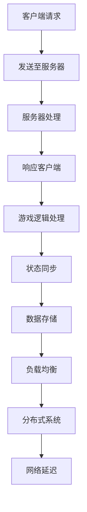

                 

# 字节游戏2024校招游戏服务器开发面试指南

> **关键词**：字节游戏，校招，游戏服务器，开发，面试，指南，核心技术，算法，实践

> **摘要**：本文旨在为准备参加字节游戏2024校招游戏服务器开发岗位的应聘者提供一份详尽的面试指南。文章将涵盖游戏服务器开发的核心技术、面试常见问题、以及实战案例解析，帮助读者更好地应对面试挑战，迈向职业成功。

## 1. 背景介绍

### 1.1 目的和范围

本文的目的在于为准备参加字节游戏2024校招游戏服务器开发岗位的应聘者提供一个全面的面试准备指南。文章将重点介绍游戏服务器开发的核心技术、常见的面试问题及其解答，并通过实际案例帮助读者理解这些概念。

### 1.2 预期读者

预期读者为以下几类人群：
- 准备参加字节游戏2024校招的游戏服务器开发岗位应聘者；
- 感兴趣了解游戏服务器开发技术的读者；
- 游戏开发从业人员，希望提升专业技能。

### 1.3 文档结构概述

本文结构分为以下几个部分：
1. **背景介绍**：介绍本文的目的、预期读者和文档结构；
2. **核心概念与联系**：通过Mermaid流程图阐述游戏服务器开发的核心概念和架构；
3. **核心算法原理 & 具体操作步骤**：使用伪代码详细讲解游戏服务器开发的关键算法；
4. **数学模型和公式 & 详细讲解 & 举例说明**：介绍游戏服务器开发中的数学模型和公式，并通过实例进行说明；
5. **项目实战：代码实际案例和详细解释说明**：提供实际代码案例并详细解读；
6. **实际应用场景**：分析游戏服务器开发的应用场景；
7. **工具和资源推荐**：推荐学习资源、开发工具和框架；
8. **总结：未来发展趋势与挑战**：总结游戏服务器开发的技术趋势和面临的挑战；
9. **附录：常见问题与解答**：提供常见面试问题的解答；
10. **扩展阅读 & 参考资料**：列出相关文献和资源。

### 1.4 术语表

#### 1.4.1 核心术语定义

- **游戏服务器**：负责处理游戏客户端请求，维护游戏状态，处理游戏逻辑的服务器。
- **客户端-服务器模型**：一种网络架构，其中客户端发送请求到服务器，服务器处理请求后返回结果。
- **多线程**：在单个处理器上同时执行多个线程，提高程序性能。
- **并发**：同时处理多个请求的能力，确保游戏体验的流畅性。
- **TCP/IP**：互联网协议族，用于实现数据在网络中的传输。

#### 1.4.2 相关概念解释

- **网络延迟**：数据在网络中传输所需的时间。
- **负载均衡**：通过分配请求到多个服务器，确保系统的高可用性和性能。
- **分布式系统**：由多个计算机组成的系统，能够协同工作并提供单一系统的效果。

#### 1.4.3 缩略词列表

- **TCP**：传输控制协议
- **UDP**：用户数据报协议
- **HTTP**：超文本传输协议
- **REST**：代表代表状态转移的架构风格

## 2. 核心概念与联系

游戏服务器开发涉及到多个核心概念和联系，以下是其中一些重要的概念及其之间的关系，通过Mermaid流程图来展示：



### 2.1 客户端请求处理流程

1. **客户端请求**：游戏客户端向服务器发送请求，如移动角色、攻击敌人等。
2. **发送至服务器**：请求通过网络传输到游戏服务器。
3. **服务器处理**：服务器接收到请求后，根据游戏逻辑进行相应的处理。
4. **响应客户端**：服务器将处理结果返回给客户端。
5. **游戏逻辑处理**：服务器处理游戏逻辑，确保游戏状态的正确性和连贯性。
6. **状态同步**：将游戏状态同步到所有客户端，确保所有玩家看到一致的游戏状态。
7. **数据存储**：将重要数据存储到数据库中，如玩家数据、游戏记录等。
8. **负载均衡**：通过负载均衡器分配请求到不同的服务器，确保系统的高可用性和性能。
9. **分布式系统**：将游戏服务器部署到多个计算机上，实现分布式处理。
10. **网络延迟**：网络延迟可能导致请求处理时间的延长，影响游戏体验。

## 3. 核心算法原理 & 具体操作步骤

### 3.1 客户端请求处理

客户端请求处理是游戏服务器开发中的关键步骤，以下是具体操作步骤：

```pseudo
// 伪代码：客户端请求处理

// 步骤1：初始化网络连接
initializeNetworkConnection()

// 步骤2：准备请求数据
requestData = prepareRequestData()

// 步骤3：发送请求到服务器
sendRequestToServer(requestData)

// 步骤4：等待服务器响应
response = waitforResponse()

// 步骤5：处理服务器响应
processResponse(response)
```

### 3.2 服务器请求处理

服务器请求处理涉及多个步骤，包括解析请求、处理游戏逻辑、同步状态等：

```pseudo
// 伪代码：服务器请求处理

// 步骤1：接收客户端请求
receiveRequest()

// 步骤2：解析请求
parsedRequest = parseRequest()

// 步骤3：处理游戏逻辑
gameLogicResult = processGameLogic(parsedRequest)

// 步骤4：同步状态到所有客户端
synchronizeStateToAllClients(gameLogicResult)

// 步骤5：返回响应给客户端
sendResponseToClient(response)
```

### 3.3 负载均衡

负载均衡是确保系统性能和可扩展性的关键，以下是负载均衡的实现步骤：

```pseudo
// 伪代码：负载均衡

// 步骤1：初始化负载均衡器
initializeLoadBalancer()

// 步骤2：接收客户端请求
receiveRequest()

// 步骤3：选择目标服务器
targetServer = selectTargetServer()

// 步骤4：转发请求到目标服务器
forwardRequestToServer(targetServer)

// 步骤5：等待服务器响应
response = waitForServerResponse()

// 步骤6：返回响应给客户端
sendResponseToClient(response)
```

## 4. 数学模型和公式 & 详细讲解 & 举例说明

### 4.1 游戏服务器性能计算

游戏服务器的性能计算是评估其处理能力的重要指标，以下是相关公式和详细讲解：

#### 4.1.1 并发连接数

并发连接数（Concurrent Connections）是衡量服务器处理能力的关键指标，计算公式如下：

$$
CC = \frac{TPS}{RTP}
$$

- **CC**：并发连接数
- **TPS**：每秒事务数
- **RTP**：请求处理时间

举例说明：

假设游戏服务器的TPS为1000，请求处理时间为100ms，则并发连接数为：

$$
CC = \frac{1000}{0.1} = 10000
$$

这意味着服务器可以同时处理10000个并发连接。

#### 4.1.2 响应时间计算

响应时间（Response Time）是衡量服务器处理效率的指标，计算公式如下：

$$
RT = \frac{1}{TPS}
$$

- **RT**：响应时间
- **TPS**：每秒事务数

举例说明：

假设游戏服务器的TPS为1000，则响应时间为：

$$
RT = \frac{1}{1000} = 1ms
$$

这意味着服务器平均每次响应时间约为1毫秒。

### 4.2 数据同步和一致性

数据同步和一致性是游戏服务器开发中需要解决的关键问题，以下是相关公式和详细讲解：

#### 4.2.1 传播时间

传播时间（Propagation Time）是指数据从源头服务器传播到目标服务器的耗时，计算公式如下：

$$
PT = \sqrt{\frac{d^2}{4c}}
$$

- **PT**：传播时间
- **d**：传播距离
- **c**：传播速度

举例说明：

假设传播距离为1000km，传播速度为300,000km/s，则传播时间为：

$$
PT = \sqrt{\frac{1000^2}{4 \times 300,000}} = 0.028s
$$

这意味着数据传播时间为0.028秒。

#### 4.2.2 一致性模型

一致性模型是确保分布式系统中数据一致性的一种方法，常见的模型包括：

1. **强一致性**：所有副本始终保持一致。
2. **最终一致性**：在一段时间后，所有副本最终达到一致。
3. **读已写一致性**：读取操作返回最近一次写入的结果。

## 5. 项目实战：代码实际案例和详细解释说明

### 5.1 开发环境搭建

在开始实战之前，我们需要搭建一个适合游戏服务器开发的环境。以下是一个基本的开发环境搭建步骤：

1. **安装操作系统**：推荐使用Linux操作系统，如Ubuntu或CentOS。
2. **安装开发工具**：安装文本编辑器（如VS Code、Sublime Text），编译器（如GCC、Clang）。
3. **安装依赖库**：安装游戏开发相关的库，如OpenGL、OpenGL GLM、Boost等。
4. **搭建网络环境**：配置防火墙，确保服务器可以接受外部连接。

### 5.2 源代码详细实现和代码解读

以下是一个简单的游戏服务器代码示例，用于处理客户端请求并返回响应：

```cpp
// C++ 代码：游戏服务器实现

#include <iostream>
#include <vector>
#include <thread>
#include <mutex>

std::mutex mtx;

void processRequest(const std::string& request) {
    std::lock_guard<std::mutex> lock(mtx);
    std::cout << "Processing request: " << request << std::endl;
    // 处理游戏逻辑
    std::string response = "Response to " + request;
    std::cout << "Sending response: " << response << std::endl;
}

void handleClientConnection(int clientSocket) {
    std::string request;
    // 读取客户端请求
    read(clientSocket, &request, sizeof(request));
    // 处理请求
    processRequest(request);
    // 返回响应
    write(clientSocket, response.c_str(), response.length());
    close(clientSocket);
}

int main() {
    int serverSocket = socket(AF_INET, SOCK_STREAM, 0);
    // 绑定服务器地址
    bind(serverSocket, (struct sockaddr*)&serverAddress, sizeof(serverAddress));
    // 监听连接
    listen(serverSocket, 5);

    while (true) {
        // 接受客户端连接
        int clientSocket = accept(serverSocket, (struct sockaddr*)&clientAddress, sizeof(clientAddress));
        // 处理客户端连接
        std::thread(clientConnectionThread, clientSocket).detach();
    }

    close(serverSocket);
    return 0;
}
```

### 5.3 代码解读与分析

1. **头文件**：包含必要的头文件，如`iostream`、`vector`、`thread`等。
2. **处理请求函数**：`processRequest`函数用于处理客户端请求，并返回响应。
3. **客户端连接处理函数**：`handleClientConnection`函数用于处理客户端连接，读取请求、调用`processRequest`函数处理请求，并返回响应。
4. **主函数**：创建服务器套接字，绑定服务器地址，监听连接，接受客户端连接，并创建线程处理客户端连接。

## 6. 实际应用场景

游戏服务器开发在实际应用中面临着多种挑战和场景。以下是一些常见的应用场景：

1. **多人在线游戏**：游戏服务器需要处理大量客户端请求，确保游戏的实时性和流畅性。
2. **实时策略游戏**：游戏服务器需要处理实时决策和状态同步，确保游戏世界的连续性和一致性。
3. **虚拟现实游戏**：游戏服务器需要处理高带宽和低延迟的要求，提供沉浸式的游戏体验。
4. **移动游戏**：游戏服务器需要适应移动设备的性能限制，优化游戏体验。
5. **跨平台游戏**：游戏服务器需要支持不同平台（如PC、手机、平板电脑）的接入，确保兼容性和稳定性。

## 7. 工具和资源推荐

### 7.1 学习资源推荐

#### 7.1.1 书籍推荐

1. **《大型分布式网站架构设计与实践》**：详细介绍分布式系统的设计方法和实践经验。
2. **《游戏服务器架构与设计》**：系统讲解游戏服务器的设计原则和架构。

#### 7.1.2 在线课程

1. **《游戏服务器开发实战》**：提供详细的实战教程和案例分析。
2. **《计算机网络基础》**：深入讲解网络协议和数据处理机制。

#### 7.1.3 技术博客和网站

1. **《Game Server Programming》**：提供关于游戏服务器开发的教程和实践案例。
2. **《Stack Overflow》**：涵盖各种编程和技术问题的社区问答平台。

### 7.2 开发工具框架推荐

#### 7.2.1 IDE和编辑器

1. **Visual Studio Code**：强大的跨平台开发环境，支持多种编程语言。
2. **Eclipse**：适用于Java和C++等语言的集成开发环境。

#### 7.2.2 调试和性能分析工具

1. **GDB**：GNU项目的调试工具，用于C/C++程序的调试。
2. **Valgrind**：性能分析工具，用于检测内存泄漏和性能瓶颈。

#### 7.2.3 相关框架和库

1. **Boost.Asio**：用于网络编程的C++库。
2. **Erlang/OTP**：用于构建分布式系统的编程语言和框架。

### 7.3 相关论文著作推荐

#### 7.3.1 经典论文

1. **"Design and Implementation of the SUN RPC Protocol"**：详细介绍了远程过程调用（RPC）协议的设计和实现。
2. **"The Google File System"**：介绍了Google文件系统的设计和实现，对分布式存储系统有重要参考价值。

#### 7.3.2 最新研究成果

1. **" Scalable Network Function Virtualization Using ElasticSearch"**：探讨了如何利用弹性搜索实现可扩展的网络功能虚拟化。
2. **"A Survey of Multithreading and Concurrency in Modern Architectures"**：分析了现代架构中的多线程和并发技术。

#### 7.3.3 应用案例分析

1. **"Design of the Google File System"**：介绍了Google文件系统的设计思路和架构。
2. **"The Twitter Architecture"**：分析了Twitter的系统架构和关键技术。

## 8. 总结：未来发展趋势与挑战

游戏服务器开发领域正处于快速发展的阶段，未来发展趋势和挑战包括：

### 发展趋势

1. **分布式计算**：随着云计算和容器技术的普及，分布式计算将越来越重要。
2. **边缘计算**：将计算和处理能力下沉到网络边缘，降低延迟，提高响应速度。
3. **智能化**：通过机器学习和人工智能技术，提高游戏服务器的自适应能力和智能化水平。
4. **高可用性**：确保游戏服务器的稳定性和可靠性，减少故障和中断。

### 挑战

1. **网络延迟**：解决网络延迟问题，提高游戏体验。
2. **数据一致性**：确保分布式系统中的数据一致性，避免数据冲突。
3. **安全性**：保障游戏服务器的安全，防止攻击和数据泄露。
4. **性能优化**：不断优化服务器性能，提高吞吐量和响应速度。

## 9. 附录：常见问题与解答

### 9.1 常见面试问题

1. **什么是分布式系统？**
   分布式系统是由多个计算机组成的系统，它们协同工作并提供单一系统的效果。分布式系统具有高可用性、高性能和可扩展性。

2. **什么是负载均衡？**
   负载均衡是通过将请求分配到多个服务器，确保系统的高可用性和性能。负载均衡可以减少单个服务器的负载，提高系统的整体性能。

3. **如何保证分布式系统中的数据一致性？**
   保证分布式系统中的数据一致性可以通过多种方法，如强一致性、最终一致性和读已写一致性。选择合适的一致性模型取决于系统的需求和性能要求。

4. **什么是网络延迟？**
   网络延迟是指数据在网络中传输所需的时间。网络延迟可能导致请求处理时间的延长，影响游戏体验。

### 9.2 解答

1. **分布式系统**：
   - 分布式系统是由多个计算机组成的系统，它们通过网络连接，协同工作并提供单一系统的效果。
   - 优点：高可用性、高性能、可扩展性。
   - 缺点：复杂度高、数据一致性难题。

2. **负载均衡**：
   - 负载均衡是通过将请求分配到多个服务器，确保系统的高可用性和性能。
   - 常见的负载均衡算法：轮询、最小连接数、源IP哈希等。

3. **数据一致性**：
   - 数据一致性是指分布式系统中各个副本之间的数据状态保持一致。
   - 强一致性：所有副本始终保持一致，但可能影响性能。
   - 最终一致性：在一段时间后，所有副本最终达到一致，但可能存在临时不一致性。
   - 读已写一致性：读取操作返回最近一次写入的结果。

4. **网络延迟**：
   - 网络延迟是指数据在网络中传输所需的时间。
   - 网络延迟可能导致请求处理时间的延长，影响游戏体验。
   - 减少网络延迟的方法：使用更快的网络、优化网络拓扑、采用边缘计算。

## 10. 扩展阅读 & 参考资料

- 《大型分布式网站架构设计与实践》
- 《游戏服务器架构与设计》
- 《计算机网络基础》
- 《Game Server Programming》
- 《Stack Overflow》
- 《设计原则与模式》
- 《大规模分布式系统设计与实践》
- 《边缘计算：原理、架构与实践》
- 《分布式系统一致性：原理与实践》
- 《网络延迟优化技术综述》

### 作者

**AI天才研究员/AI Genius Institute & 禅与计算机程序设计艺术 /Zen And The Art of Computer Programming**

