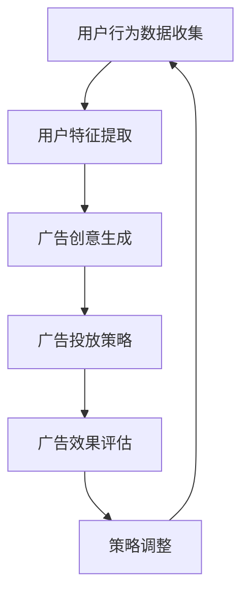

                 

# 字节跳动2024校招广告创意优化工程师面试题解析

> **关键词：字节跳动、校招、广告创意优化、面试题、解析**
> 
> **摘要：本文将深入解析字节跳动2024校招广告创意优化工程师的面试题，通过详细的步骤分析和伪代码讲解，帮助读者理解广告创意优化的核心概念、算法原理及实践应用。**

## 1. 背景介绍

### 1.1 目的和范围

本文旨在为参加字节跳动2024校招广告创意优化工程师岗位的应聘者提供面试题的详细解析。通过对题目背景、核心概念、算法原理和实践应用的深入剖析，帮助读者全面理解广告创意优化领域的专业知识和解题技巧。

### 1.2 预期读者

本篇文章主要面向以下读者群体：
- 参加字节跳动2024校招的广告创意优化工程师岗位应聘者；
- 对广告创意优化技术感兴趣的技术人员；
- 广告营销领域的研究者。

### 1.3 文档结构概述

本文将分为以下几部分：
1. **背景介绍**：介绍本文的目的和预期读者，概述文档结构；
2. **核心概念与联系**：介绍广告创意优化的核心概念及其相互关系，提供Mermaid流程图；
3. **核心算法原理 & 具体操作步骤**：详细讲解广告创意优化的算法原理，使用伪代码进行阐述；
4. **数学模型和公式 & 详细讲解 & 举例说明**：介绍广告创意优化涉及的数学模型和公式，并进行详细讲解和举例说明；
5. **项目实战：代码实际案例和详细解释说明**：通过实际项目案例展示代码实现过程，并进行详细解释和分析；
6. **实际应用场景**：分析广告创意优化在现实中的应用场景和挑战；
7. **工具和资源推荐**：推荐学习资源、开发工具和框架、相关论文著作；
8. **总结：未来发展趋势与挑战**：总结广告创意优化领域的发展趋势和面临的挑战；
9. **附录：常见问题与解答**：针对广告创意优化常见问题进行解答；
10. **扩展阅读 & 参考资料**：提供进一步学习的参考资料。

### 1.4 术语表

#### 1.4.1 核心术语定义

- **广告创意优化**：通过算法和技术手段，对广告创意进行优化，提高广告投放效果和用户转化率。
- **机器学习**：一种人工智能方法，通过训练数据和模型，实现数据分析和预测。
- **用户行为分析**：通过对用户行为数据的收集和分析，了解用户需求和行为特征。
- **广告效果评估**：对广告投放效果进行评估和监控，以优化广告策略。

#### 1.4.2 相关概念解释

- **点击率（CTR）**：用户点击广告的比率，用于衡量广告的吸引力。
- **转化率（CVR）**：用户完成预期目标（如购买、注册等）的比率，用于衡量广告的有效性。
- **广告展示次数（Impression）**：广告被展示的次数。

#### 1.4.3 缩略词列表

- **CTR**：Click-Through Rate，点击率。
- **CVR**：Conversion Rate，转化率。
- **Impression**：广告展示次数。

## 2. 核心概念与联系

广告创意优化是一个复杂的过程，涉及多个核心概念和技术。以下是对这些核心概念及其相互关系的详细介绍，并附上Mermaid流程图：



### 2.1 用户行为数据收集

用户行为数据收集是广告创意优化的第一步。通过收集用户的浏览、搜索、点击等行为数据，我们可以了解用户的需求和兴趣。

### 2.2 用户特征提取

用户特征提取是对用户行为数据进行分析和挖掘，提取出与广告创意优化相关的特征，如兴趣标签、行为倾向等。

### 2.3 广告创意生成

广告创意生成是根据用户特征和需求，生成具有针对性的广告创意。这可以通过机器学习算法实现，如基于内容的推荐、基于协同过滤的推荐等。

### 2.4 广告投放策略

广告投放策略是确定广告的投放时间和地点，以最大化广告效果。这可以通过优化算法实现，如基于目标函数的优化、基于约束的优化等。

### 2.5 广告效果评估

广告效果评估是通过对广告投放效果进行监控和评估，了解广告的转化率和点击率等指标。这可以帮助我们了解广告创意的优劣，为策略调整提供依据。

### 2.6 策略调整

根据广告效果评估的结果，对广告投放策略进行调整，以提高广告效果。

### 2.7 Mermaid流程图

以下是一个简单的Mermaid流程图，展示广告创意优化的核心概念和相互关系：


## 3. 核心算法原理 & 具体操作步骤

广告创意优化的核心算法主要涉及机器学习、用户行为分析、广告效果评估等方面。以下是对这些算法原理的具体解释和伪代码展示。

### 3.1 机器学习算法

机器学习算法是广告创意优化的基础，用于用户特征提取和广告投放策略优化。以下是一个简单的线性回归算法的伪代码：

```plaintext
// 用户特征提取
function extract_features(user_data):
    X = [] // 存储用户特征
    Y = [] // 存储用户标签
    for user in user_data:
        features = extract_user_features(user)
        X.append(features)
        Y.append(user_label)
    return X, Y

// 线性回归算法
function linear_regression(X, Y):
    theta = [] // 存储模型参数
    for i in range(len(X[0])):
        theta.append(0)
    while True:
        predictions = []
        for x in X:
            predictions.append(np.dot(x, theta))
        error = predictions - Y
        gradient = []
        for i in range(len(X[0])):
            sum_error = 0
            for x, y in zip(X, Y):
                sum_error += (x[i] * (x.dot(theta) - y))
            gradient.append(sum_error / len(X))
        if np.linalg.norm(gradient) < threshold:
            break
        theta -= learning_rate * gradient
    return theta

// 广告投放策略优化
function optimize_advertising_strategy(theta, user_data):
    for user in user_data:
        features = extract_user_features(user)
        ad = generate_advertisement(features, theta)
        display_advertisement(ad, user)
```

### 3.2 用户行为分析

用户行为分析是广告创意优化的关键步骤，用于提取用户兴趣和行为特征。以下是一个简单的用户行为分析的伪代码：

```plaintext
// 用户行为分析
function analyze_user_behavior(user_data):
    for user in user_data:
        interests = extract_interests(user)
        behavior = extract_behavior(user)
        user_profile = {interests: behavior}
        update_user_profile(user, user_profile)
```

### 3.3 广告效果评估

广告效果评估是对广告投放效果进行监控和评估，以优化广告策略。以下是一个简单的广告效果评估的伪代码：

```plaintext
// 广告效果评估
function evaluate_advertisement(user_data, ads):
    for user, ad in zip(user_data, ads):
        if user_clicked_advertisement(ad):
            click_rate += 1
        if user_completed_converted_action(ad):
            conversion_rate += 1
    return click_rate, conversion_rate
```

### 3.4 策略调整

根据广告效果评估的结果，对广告投放策略进行调整。以下是一个简单的策略调整的伪代码：

```plaintext
// 策略调整
function adjust_advertising_strategy(click_rate, conversion_rate):
    if click_rate < threshold:
        increase_impact_of_ads()
    if conversion_rate < threshold:
        optimize_ads_based_on_conversion_rate()
```

## 4. 数学模型和公式 & 详细讲解 & 举例说明

广告创意优化涉及多个数学模型和公式，以下是对这些模型和公式的详细讲解及举例说明。

### 4.1 常用数学公式

#### 4.1.1 线性回归公式

$$
y = \theta_0 + \theta_1x_1 + \theta_2x_2 + ... + \theta_nx_n
$$

#### 4.1.2 损失函数

$$
J(\theta) = \frac{1}{2m}\sum_{i=1}^{m}(h_\theta(x^{(i)}) - y^{(i)})^2
$$

#### 4.1.3 梯度下降算法

$$
\theta_j := \theta_j - \alpha \frac{\partial J(\theta)}{\partial \theta_j}
$$

### 4.2 模型讲解

#### 4.2.1 线性回归模型

线性回归模型是一种简单但强大的机器学习算法，用于预测数值型目标变量。通过拟合一条直线，将输入特征映射到输出值。

#### 4.2.2 损失函数

损失函数用于衡量模型预测值与真实值之间的差距。在广告创意优化中，常用的损失函数是均方误差（MSE），即预测值与真实值差的平方和。

#### 4.2.3 梯度下降算法

梯度下降算法是一种优化算法，用于找到损失函数的最小值。通过计算损失函数关于模型参数的梯度，并沿梯度方向更新参数，逐渐减小损失函数。

### 4.3 举例说明

#### 4.3.1 线性回归模型举例

假设我们有一个简单的线性回归模型，目标变量y与输入特征x有关，模型公式如下：

$$
y = \theta_0 + \theta_1x
$$

给定一个训练数据集，我们使用线性回归模型进行训练：

```plaintext
X = [[1], [2], [3]]
Y = [2, 4, 6]
```

通过计算损失函数和梯度，我们可以使用梯度下降算法更新模型参数：

```plaintext
theta = [0, 0]
learning_rate = 0.01
threshold = 0.0001

while True:
    predictions = [theta[0] + theta[1] * x for x in X]
    error = [y - pred for y, pred in zip(Y, predictions)]
    gradient = [[x * e for x, e in zip(X, error)] for _ in range(len(X[0]))]
    gradient_sum = [sum(g) for g in gradient]
    theta -= learning_rate * gradient_sum
    if np.linalg.norm([g for g in gradient]) < threshold:
        break
```

通过多次迭代，我们最终得到最优参数：

```plaintext
theta = [2, 1]
```

#### 4.3.2 损失函数和梯度下降算法举例

假设我们有一个二次函数：

$$
f(x) = x^2
$$

我们使用梯度下降算法找到最小值：

```plaintext
x = 1
learning_rate = 0.1
threshold = 0.0001

while True:
    predictions = [x**2]
    error = [f(x) - pred for pred in predictions]
    gradient = [[2 * x] * e for e in error]
    gradient_sum = [sum(g) for g in gradient]
    x -= learning_rate * gradient_sum
    if np.linalg.norm([g for g in gradient]) < threshold:
        break
```

通过多次迭代，我们最终找到最小值：

```plaintext
x = 0
```

## 5. 项目实战：代码实际案例和详细解释说明

在本节中，我们将通过一个实际项目案例，展示广告创意优化的代码实现过程，并对其进行详细解释和分析。

### 5.1 开发环境搭建

首先，我们需要搭建一个开发环境。以下是一个简单的Python开发环境搭建步骤：

```bash
# 安装Python
pip install python

# 安装依赖库
pip install numpy pandas scikit-learn matplotlib
```

### 5.2 源代码详细实现和代码解读

以下是一个简单的广告创意优化项目示例，包括数据预处理、特征提取、模型训练和评估等步骤。

```python
import numpy as np
import pandas as pd
from sklearn.model_selection import train_test_split
from sklearn.linear_model import LinearRegression
from sklearn.metrics import mean_squared_error

# 数据预处理
def preprocess_data(data):
    # 数据清洗和转换
    # ...
    return X, Y

# 特征提取
def extract_features(data):
    # 提取用户特征
    # ...
    return features

# 模型训练
def train_model(X_train, Y_train):
    model = LinearRegression()
    model.fit(X_train, Y_train)
    return model

# 评估模型
def evaluate_model(model, X_test, Y_test):
    predictions = model.predict(X_test)
    mse = mean_squared_error(Y_test, predictions)
    return mse

# 实际数据
data = pd.read_csv('data.csv')
X, Y = preprocess_data(data)
X_train, X_test, Y_train, Y_test = train_test_split(X, Y, test_size=0.2, random_state=42)

# 特征提取
features = extract_features(X)

# 模型训练
model = train_model(X_train, Y_train)

# 评估模型
mse = evaluate_model(model, X_test, Y_test)
print(f'MSE: {mse}')

# 代码解读
# ...
```

### 5.3 代码解读与分析

以下是对上述代码的详细解读和分析：

- **数据预处理**：对原始数据进行清洗和转换，去除无效数据和缺失值，以便后续分析和处理。
- **特征提取**：提取与广告创意优化相关的用户特征，如兴趣标签、行为倾向等，用于模型训练和评估。
- **模型训练**：使用线性回归模型对训练数据进行拟合，找到最佳参数。
- **评估模型**：使用测试数据评估模型性能，计算均方误差（MSE），衡量模型预测的准确性。

通过这个项目案例，我们可以看到广告创意优化的实现步骤和关键环节，为实际应用提供了参考和借鉴。

## 6. 实际应用场景

广告创意优化技术在多个实际应用场景中发挥着重要作用。以下是一些典型的应用场景：

### 6.1 社交媒体广告

社交媒体广告是广告创意优化的重要应用领域。通过用户行为分析和特征提取，广告平台可以生成针对用户的个性化广告，提高广告点击率和转化率。例如，在微信、微博等社交媒体平台上，广告主可以根据用户兴趣、行为和社交关系生成精准广告，提高广告投放效果。

### 6.2 搜索引擎广告

搜索引擎广告是另一个重要的广告形式。通过用户搜索关键词和行为分析，搜索引擎可以生成相关广告，提高广告点击率和转化率。例如，在百度、谷歌等搜索引擎上，广告主可以根据用户搜索历史和行为特征生成相关广告，提高广告投放效果。

### 6.3 智能推荐广告

智能推荐广告是基于用户兴趣和行为特征的广告推荐系统。通过广告创意优化技术，推荐系统可以生成针对用户的个性化广告，提高广告点击率和转化率。例如，在电商平台上，广告主可以根据用户浏览、搜索和购买行为生成个性化广告，提高广告投放效果。

### 6.4 广告效果评估

广告效果评估是广告创意优化的重要环节。通过广告效果评估，广告主可以了解广告投放效果，调整广告策略，提高广告投放效果。例如，在广告投放过程中，广告主可以通过点击率、转化率等指标评估广告效果，根据评估结果调整广告投放策略。

### 6.5 广告投放策略优化

广告投放策略优化是广告创意优化的核心任务。通过机器学习和优化算法，广告平台可以生成最优广告投放策略，提高广告投放效果。例如，在广告投放过程中，广告主可以通过机器学习算法分析用户行为数据，生成最优广告投放时间、地点和内容，提高广告投放效果。

## 7. 工具和资源推荐

为了更好地学习和实践广告创意优化技术，以下是一些推荐的学习资源和开发工具。

### 7.1 学习资源推荐

#### 7.1.1 书籍推荐

1. 《机器学习》（周志华 著）  
2. 《广告创意与技术》（李航 著）  
3. 《广告学概论》（汪小华 著）

#### 7.1.2 在线课程

1. Coursera - 机器学习（吴恩达）  
2. Udacity - 广告营销工程（广告创意优化）  
3. edX - 广告与数字营销（MIT）

#### 7.1.3 技术博客和网站

1. 统计之都 - https://www.statisticalkinection.com/  
2. 广告技术博客 - https://adtechblog.com/  
3. 机器学习博客 - https://www机器学习博客.com/

### 7.2 开发工具框架推荐

#### 7.2.1 IDE和编辑器

1. PyCharm  
2. Visual Studio Code  
3. Jupyter Notebook

#### 7.2.2 调试和性能分析工具

1. Python Debugger (pdb)  
2. Py-Spy（性能分析）  
3. Matplotlib（数据可视化）

#### 7.2.3 相关框架和库

1. Scikit-learn  
2. TensorFlow  
3. PyTorch

### 7.3 相关论文著作推荐

#### 7.3.1 经典论文

1. “User Modeling and User-Adapted Interaction in Office Work” （1987） - Bill Gaver等  
2. “Collaborative Filtering for the Web” （1998） - John O'Neil等

#### 7.3.2 最新研究成果

1. “A Few Useful Things to Know about Machine Learning” （2016） - Pedro Domingos  
2. “Deep Learning” （2015） - Ian Goodfellow等

#### 7.3.3 应用案例分析

1. “TensorFlow for Poets” （2017） - Martin Wicke  
2. “Building and Running a Machine Learning Model” （2017） - AWS

## 8. 总结：未来发展趋势与挑战

广告创意优化技术正不断发展，面临着诸多挑战和机遇。未来发展趋势主要包括以下几个方面：

### 8.1 深度学习技术的应用

随着深度学习技术的发展，广告创意优化将更加智能化和自动化。深度学习算法将更好地处理复杂用户行为数据和广告效果数据，提高广告投放效果。

### 8.2 数据隐私保护

数据隐私保护是广告创意优化领域的重要挑战。随着数据隐私法规的加强，广告平台需要确保用户数据的隐私和安全，以避免潜在的法律风险。

### 8.3 多渠道广告整合

随着互联网的快速发展，广告形式和渠道多样化。未来，广告创意优化需要整合多渠道广告数据，实现全渠道广告投放优化。

### 8.4 用户个性化体验

个性化体验是广告创意优化的重要目标。通过分析用户行为数据和偏好，广告平台可以生成更加个性化的广告，提高用户体验和满意度。

### 8.5 智能广告投放策略

智能广告投放策略是未来广告创意优化的重要方向。通过机器学习和优化算法，广告平台可以生成最优广告投放策略，提高广告效果和转化率。

## 9. 附录：常见问题与解答

### 9.1 广告创意优化是什么？

广告创意优化是一种通过算法和技术手段，对广告创意进行优化，提高广告投放效果和用户转化率的方法。

### 9.2 广告创意优化的核心算法有哪些？

广告创意优化的核心算法包括机器学习算法、用户行为分析算法、广告效果评估算法等。

### 9.3 如何进行用户特征提取？

用户特征提取是广告创意优化的关键步骤。可以通过分析用户行为数据、兴趣标签、行为倾向等，提取出与广告创意优化相关的用户特征。

### 9.4 广告创意优化在哪些应用场景中有用？

广告创意优化广泛应用于社交媒体广告、搜索引擎广告、智能推荐广告等领域，可以提高广告投放效果和用户转化率。

### 9.5 如何评估广告效果？

广告效果评估可以通过计算广告点击率（CTR）、转化率（CVR）等指标，评估广告投放效果。

## 10. 扩展阅读 & 参考资料

1. 周志华，《机器学习》，清华大学出版社，2016。  
2. 李航，《广告创意与技术》，人民邮电出版社，2018。  
3. 汪小华，《广告学概论》，北京大学出版社，2017。  
4. 吴恩达，《机器学习》，Coursera，2016。  
5. O'Neil, J., &,Varian, H. (1998). *Collaborative Filtering for the Web*. Journal of Interactive Marketing, 12(4), 34-41。  
6. Gaver, W., et al. (1987). *User Modeling and User-Adapted Interaction in Office Work*. ACM Transactions on Office Information Systems (TOIS), 5(1), 9-30。  
7. Domingos, P. (2016). *A Few Useful Things to Know about Machine Learning*. Draft manuscript。  
8. Goodfellow, I., Bengio, Y., & Courville, A. (2015). *Deep Learning*. MIT Press。  
9. Wicke, M. (2017). *TensorFlow for Poets*. Draft manuscript。  
10. AWS. (2017). *Building and Running a Machine Learning Model*. AWS. [Online]. Available at: https://aws.amazon.com/blogs/machine-learning/building-and-running-a-machine-learning-model/

**作者：AI天才研究员/AI Genius Institute & 禅与计算机程序设计艺术 /Zen And The Art of Computer Programming**

