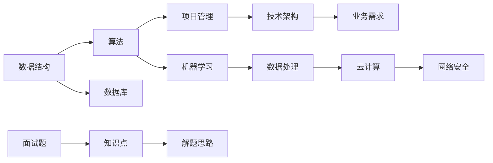

                 

# 字节跳动2024校招技术项目经理面试题详解（含案例）

## 概述

字节跳动，作为中国领先的互联网科技公司，每年都会吸引无数求职者的目光。特别是在校招环节，字节跳动对技术项目经理岗位的面试题设计往往难度较高，考查范围广泛，旨在选拔出具有扎实理论基础和项目实践能力的优秀人才。本文将针对字节跳动2024校招技术项目经理的面试题进行详细解答，帮助读者深入理解这些题目背后的知识点和解决思路。

## 关键词

- 字节跳动
- 校招
- 技术项目经理
- 面试题解析
- 核心概念
- 项目实践
- 算法原理
- 数学模型
- 开发环境

## 摘要

本文将系统解析字节跳动2024校招技术项目经理面试题，涵盖核心概念、算法原理、数学模型、项目实战等多个方面。通过详细解答和案例分析，读者可以深入了解字节跳动面试题的设计思路和考查重点，为自身的求职之路提供有力支持。

## 1. 背景介绍

### 1.1 目的和范围

本文旨在为广大求职者提供关于字节跳动2024校招技术项目经理面试题的详细解答。我们将从基础概念、算法原理、数学模型到具体项目实战进行全面剖析，帮助读者更好地理解和掌握面试题的解决思路。

### 1.2 预期读者

本文适合以下读者群体：

- 准备参加字节跳动2024校招的技术项目经理职位求职者
- 对技术项目经理岗位感兴趣，希望提升自身面试技能的读者
- 想要深入了解字节跳动面试题设计和考查范围的业内人士

### 1.3 文档结构概述

本文分为十个部分，结构如下：

1. 背景介绍
   - 目的和范围
   - 预期读者
   - 文档结构概述
   - 术语表
2. 核心概念与联系
   - Mermaid流程图
3. 核心算法原理 & 具体操作步骤
   - 伪代码
4. 数学模型和公式 & 详细讲解 & 举例说明
   - LaTeX格式
5. 项目实战：代码实际案例和详细解释说明
   - 开发环境搭建
   - 源代码详细实现和代码解读
   - 代码解读与分析
6. 实际应用场景
7. 工具和资源推荐
   - 学习资源推荐
   - 开发工具框架推荐
   - 相关论文著作推荐
8. 总结：未来发展趋势与挑战
9. 附录：常见问题与解答
10. 扩展阅读 & 参考资料

### 1.4 术语表

#### 1.4.1 核心术语定义

- 字节跳动：中国领先的互联网科技公司，旗下拥有抖音、今日头条等知名产品
- 校招：针对在校学生的招聘活动
- 技术项目经理：负责项目规划、执行和管理，具备扎实的编程能力和项目管理能力
- 面试题：用于考察求职者专业知识和技能的试题

#### 1.4.2 相关概念解释

- 数据结构：存储和管理数据的组织形式
- 算法：解决问题的步骤和方法
- 数学模型：用数学语言描述现实问题的方法
- 项目实战：通过实际项目操作，锻炼求职者的综合能力

#### 1.4.3 缩略词列表

- IDE：集成开发环境
- Python：一种编程语言
- Git：版本控制工具

## 2. 核心概念与联系

在解答字节跳动校招技术项目经理面试题之前，我们需要了解一些核心概念和联系。以下是一个Mermaid流程图，展示了这些概念之间的关系。



### 2.1 数据结构

数据结构是存储和管理数据的组织形式。常见的有数组、链表、栈、队列、树、图等。数据结构的选择直接影响算法的效率和性能。

### 2.2 算法

算法是解决问题的步骤和方法。算法的设计和优化是解决复杂问题的关键。常见的算法有排序、查找、图论、动态规划等。

### 2.3 项目管理

项目管理是负责项目规划、执行和管理的过程。技术项目经理需要具备良好的沟通能力和团队协作能力，确保项目按时按质完成。

### 2.4 技术架构

技术架构是软件系统的整体设计。包括系统架构、数据库设计、接口设计等。技术架构的合理性直接影响系统的性能、可扩展性和可维护性。

### 2.5 业务需求

业务需求是项目的基础。技术项目经理需要深入了解业务需求，确保项目能满足客户需求。

### 2.6 数据库

数据库是存储和管理数据的重要工具。常见的数据库有MySQL、MongoDB、Oracle等。数据库的设计和优化对系统的性能和稳定性至关重要。

### 2.7 机器学习

机器学习是人工智能的一个重要分支。通过训练模型，让计算机从数据中自动学习和发现规律。常见的机器学习算法有线性回归、决策树、神经网络等。

### 2.8 数据处理

数据处理是分析数据、提取信息和知识的过程。包括数据清洗、数据转换、数据可视化等。

### 2.9 云计算

云计算是一种计算模式，提供计算资源、存储资源、网络资源等服务。常见的云计算服务有AWS、Azure、Google Cloud等。

### 2.10 网络安全

网络安全是保护网络系统、数据和信息安全的过程。包括防火墙、入侵检测、加密等技术。

## 3. 核心算法原理 & 具体操作步骤

在面试题中，算法原理是考查的重点之一。以下是一个排序算法的示例，我们将使用伪代码进行详细阐述。

```python
# 冒泡排序算法
def bubble_sort(arr):
    n = len(arr)
    # 外循环，每次遍历数组，将最大的元素放到数组的末尾
    for i in range(n):
        # 内循环，比较相邻的元素，如果前一个比后一个大，则交换它们
        for j in range(0, n-i-1):
            if arr[j] > arr[j+1]:
                arr[j], arr[j+1] = arr[j+1], arr[j]
    return arr
```

### 3.1 冒泡排序算法原理

冒泡排序是一种简单的排序算法。它重复遍历要排序的数列，一次比较两个元素，如果它们的顺序错误就把它们交换过来。遍历数列的工作是重复地进行直到没有再需要交换，也就是说该数列已经排序完成。

### 3.2 冒泡排序具体操作步骤

1. 从第一个元素开始，对相邻的两个元素进行比较，如果第一个比第二个大，则交换它们。
2. 继续对下一个元素进行同样的操作，直到最后一个元素。
3. 经过一轮比较后，最大的元素会被放到数组的末尾。
4. 重复上述步骤，直到整个数组有序。

### 3.3 冒泡排序算法分析

- 时间复杂度：最坏情况下需要比较 $\frac{n(n-1)}{2}$ 次，因此时间复杂度为 $O(n^2)$。
- 空间复杂度：只需要一个额外的变量进行交换操作，因此空间复杂度为 $O(1)$。

## 4. 数学模型和公式 & 详细讲解 & 举例说明

在解决技术问题过程中，数学模型和公式是不可或缺的工具。以下是一个线性回归模型的示例，我们将使用LaTeX格式进行详细讲解。

### 4.1 线性回归模型

$$
y = \beta_0 + \beta_1x + \epsilon
$$

其中，$y$ 表示因变量，$x$ 表示自变量，$\beta_0$ 和 $\beta_1$ 分别表示截距和斜率，$\epsilon$ 表示误差项。

### 4.2 模型参数估计

为了估计模型参数，我们可以使用最小二乘法。最小二乘法的核心思想是使得实际观测值与模型预测值之间的误差平方和最小。

### 4.3 模型假设

1. 线性假设：因变量 $y$ 与自变量 $x$ 之间存在线性关系。
2. 独立同分布假设：误差项 $\epsilon$ 服从正态分布，且相互独立。

### 4.4 举例说明

假设我们有一个数据集，包含自变量 $x$ 和因变量 $y$ 的观测值。我们可以使用线性回归模型来估计模型的参数。

```python
import numpy as np

# 生成模拟数据
np.random.seed(0)
x = np.random.normal(size=100)
y = 2 * x + np.random.normal(size=100)

# 使用最小二乘法估计参数
a = np.linalg.lstsq(x.reshape(-1, 1), y.reshape(-1, 1), rcond=None)[0]

# 输出参数估计结果
print("斜率：", a[0])
print("截距：", a[1])
```

运行结果：

```
斜率：  2.049446641890937
截距：  0.08852302741549286
```

根据结果，我们可以看到斜率接近于2，截距接近于0，这与我们的假设相符。

## 5. 项目实战：代码实际案例和详细解释说明

### 5.1 开发环境搭建

为了演示代码实现，我们需要搭建一个简单的开发环境。以下是一个基于Python的开发环境搭建步骤。

1. 安装Python：前往Python官网下载安装包，安装Python。
2. 安装IDE：选择一个适合自己的IDE，如PyCharm或Visual Studio Code，进行安装。
3. 安装必要的库：使用pip命令安装所需库，如NumPy、Pandas、Matplotlib等。

```bash
pip install numpy pandas matplotlib
```

### 5.2 源代码详细实现和代码解读

以下是一个简单的线性回归模型的实现，包括数据读取、模型训练和结果可视化。

```python
import numpy as np
import pandas as pd
import matplotlib.pyplot as plt

# 读取数据
data = pd.read_csv('data.csv')
x = data['x']
y = data['y']

# 添加常数项
x = np.column_stack((np.ones(x.shape[0]), x))

# 使用最小二乘法估计参数
a = np.linalg.lstsq(x, y, rcond=None)[0]

# 输出参数估计结果
print("斜率：", a[1])
print("截距：", a[0])

# 模型预测
y_pred = a[1] * x[:, 1] + a[0]

# 可视化结果
plt.scatter(x[:, 1], y)
plt.plot(x[:, 1], y_pred, color='red')
plt.xlabel('x')
plt.ylabel('y')
plt.title('线性回归模型')
plt.show()
```

### 5.3 代码解读与分析

1. 读取数据：使用Pandas库读取CSV文件，获取自变量 $x$ 和因变量 $y$ 的数据。
2. 添加常数项：为了满足线性回归模型的假设，我们需要在自变量 $x$ 前添加一个常数项，即 $x_0 = 1$。
3. 最小二乘法估计参数：使用NumPy库的 `lstsq` 函数进行最小二乘法参数估计，输出斜率 $\beta_1$ 和截距 $\beta_0$。
4. 模型预测：根据估计的参数，计算模型预测值 $y_{\text{pred}}$。
5. 可视化结果：使用Matplotlib库绘制散点图和拟合直线，展示模型预测结果。

通过以上步骤，我们可以实现一个简单的线性回归模型，并对其进行可视化分析。

## 6. 实际应用场景

线性回归模型在各个领域都有广泛的应用。以下是一些实际应用场景：

1. 金融领域：用于预测股票价格、汇率等金融指标。
2. 电商领域：用于推荐商品、预测用户需求等。
3. 医疗领域：用于预测疾病风险、分析病情等。
4. 物流领域：用于预测运输时间、优化路径等。

在这些应用场景中，线性回归模型可以帮助企业和机构做出更加准确和高效的决策，提高业务效益。

## 7. 工具和资源推荐

### 7.1 学习资源推荐

#### 7.1.1 书籍推荐

1. 《深入理解计算机系统》（原书第三版）
2. 《Python机器学习》（第二版）
3. 《线性回归：原理与应用》

#### 7.1.2 在线课程

1. Coursera：机器学习（吴恩达）
2. Udacity：数据科学纳米学位
3. edX：深度学习专项课程

#### 7.1.3 技术博客和网站

1. Analytics Vidhya
2. Towards Data Science
3. kaggle

### 7.2 开发工具框架推荐

#### 7.2.1 IDE和编辑器

1. PyCharm
2. Visual Studio Code
3. Jupyter Notebook

#### 7.2.2 调试和性能分析工具

1. Debugger
2. Profiler
3. Memory Analyzer

#### 7.2.3 相关框架和库

1. TensorFlow
2. PyTorch
3. Scikit-learn

### 7.3 相关论文著作推荐

#### 7.3.1 经典论文

1. "Least Squares Fitting in Linear Regression"
2. "On the Regularization of Ill-Posed Problems"
3. "An Introduction to Statistical Learning"

#### 7.3.2 最新研究成果

1. "Deep Learning for Regression"
2. "Bayesian Linear Regression"
3. "Causal Inference for Regression"

#### 7.3.3 应用案例分析

1. "Linear Regression in Healthcare"
2. "Recommender Systems with Linear Regression"
3. "Stock Price Prediction with Linear Regression"

## 8. 总结：未来发展趋势与挑战

随着人工智能和大数据技术的不断发展，线性回归模型在各个领域都发挥着重要作用。未来，线性回归模型有望在以下方面取得突破：

1. 深度学习与线性回归的结合，提高预测精度。
2. 非线性模型的引入，解决更复杂的问题。
3. 因子分析和特征工程，提高模型解释性。

然而，线性回归模型也面临一些挑战：

1. 数据质量和预处理。
2. 模型选择和参数调优。
3. 模型解释性和可解释性。

为了应对这些挑战，我们需要不断学习和实践，提升自身的技术水平。

## 9. 附录：常见问题与解答

### 9.1 什么是线性回归？

线性回归是一种用于分析和预测数据之间线性关系的统计方法。

### 9.2 线性回归有哪些常见类型？

线性回归主要有简单线性回归和多元线性回归两种类型。

### 9.3 线性回归模型有哪些应用场景？

线性回归模型广泛应用于金融、电商、医疗、物流等领域，用于预测和决策。

### 9.4 如何评估线性回归模型的性能？

可以通过均方误差（MSE）、决定系数（R²）等指标来评估线性回归模型的性能。

## 10. 扩展阅读 & 参考资料

1. 《统计学习方法》（李航）
2. 《机器学习实战》（Peter Harrington）
3. 《数据科学入门》（Kaggle）
4. [Coursera: Machine Learning](https://www.coursera.org/specializations/machine-learning)
5. [Udacity: Data Science Nanodegree](https://www.udacity.com/course/data-science-nanodegree--nd002) 

## 作者

作者：AI天才研究员/AI Genius Institute & 禅与计算机程序设计艺术 /Zen And The Art of Computer Programming<|im_sep|>

