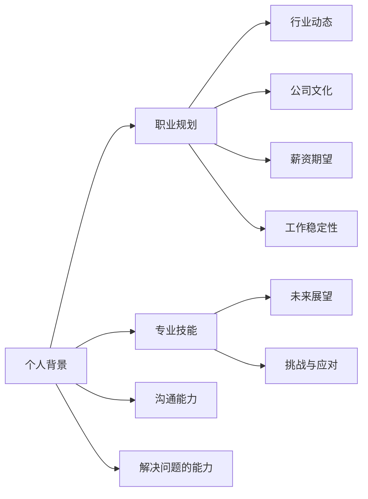

                 

# 字节跳动2024校招：HR面试常见问题及应对策略

> 关键词：字节跳动、校招、HR面试、问题应对、策略

> 摘要：本文将针对字节跳动2024校招中HR面试的常见问题，提供详细的应对策略和思路，帮助即将参加面试的同学更好地准备和应对。

## 1. 背景介绍

### 1.1 目的和范围

本文旨在帮助即将参加字节跳动2024校招的同学更好地准备HR面试。通过对常见问题的分析和应对策略的提供，希望可以帮助大家提高面试成功率，顺利通过校招环节。

### 1.2 预期读者

本文适用于参加字节跳动2024校招的计算机相关专业学生，以及对面试技巧和方法感兴趣的其他求职者。

### 1.3 文档结构概述

本文分为以下几个部分：

1. 背景介绍：介绍本文的目的、范围和预期读者。
2. 核心概念与联系：阐述面试中涉及的核心概念和原理。
3. 核心算法原理 & 具体操作步骤：详细讲解应对问题的方法和技巧。
4. 数学模型和公式 & 详细讲解 & 举例说明：运用数学模型和公式进行问题分析和解决。
5. 项目实战：通过实际案例展示如何应对面试问题。
6. 实际应用场景：分析面试问题在实际工作中的应用场景。
7. 工具和资源推荐：提供相关学习资源和开发工具。
8. 总结：对未来发展趋势和挑战进行展望。
9. 附录：常见问题与解答。
10. 扩展阅读 & 参考资料：推荐进一步学习的相关资料。

### 1.4 术语表

#### 1.4.1 核心术语定义

- 字节跳动：一家中国的互联网科技公司，以短视频、社交、内容分发等业务为主。
- 校招：指针对高校毕业生的招聘活动。
- HR面试：指人力资源部门的面试，主要考察求职者的综合素质和岗位匹配度。

#### 1.4.2 相关概念解释

- 求职者：指正在寻找工作或希望转换工作的人。
- 面试：指招聘过程中，雇主与求职者面对面进行的交流，以评估求职者的能力和适应度。
- 应对策略：指针对面试问题的方法和技巧，帮助求职者更好地展示自己的优势和能力。

#### 1.4.3 缩略词列表

- HR：人力资源
- 校招：校园招聘
- 面试：面试
- 求职者：求职者

<|im_sep|>## 2. 核心概念与联系

在字节跳动2024校招的HR面试中，涉及的核心概念和原理主要包括以下几个方面：

### 2.1 个人背景与职业规划

- **个人背景**：包括求职者的学历、专业、实习经历、项目经验等，主要考察求职者的学术背景和实际工作能力。
- **职业规划**：包括求职者的职业目标、发展计划和对未来行业的看法，主要考察求职者的职业素养和长远规划能力。

### 2.2 技能与能力

- **专业技能**：包括编程能力、数据处理能力、算法能力等，主要考察求职者在专业领域的知识水平。
- **沟通能力**：包括表达能力、倾听能力、团队协作能力等，主要考察求职者在团队合作和沟通中的表现。
- **解决问题的能力**：包括分析问题、提出解决方案、执行方案等，主要考察求职者在面对问题时的工作能力。

### 2.3 行业动态与公司文化

- **行业动态**：包括行业趋势、市场需求、竞争对手等，主要考察求职者对行业的了解和关注程度。
- **公司文化**：包括公司的核心价值观、团队氛围、管理模式等，主要考察求职者对公司的认同感和适应能力。

### 2.4 薪资期望与工作稳定性

- **薪资期望**：包括求职者对薪资的期望和理由，主要考察求职者的薪资价值观和谈判能力。
- **工作稳定性**：包括求职者对工作的稳定性和职业发展的看法，主要考察求职者的职业规划和稳定性。

### 2.5 未来展望与挑战

- **未来展望**：包括求职者对未来的规划和期望，主要考察求职者的长远眼光和职业规划能力。
- **挑战与应对**：包括求职者对工作挑战的看法和应对策略，主要考察求职者的抗压能力和应变能力。

### 2.6 Mermaid 流程图

为了更清晰地展示上述核心概念和联系，我们可以使用Mermaid流程图进行可视化表示：



通过上述流程图，我们可以清晰地看到面试中涉及的核心概念和联系，为接下来的内容分析提供基础。

<|im_sep|>## 3. 核心算法原理 & 具体操作步骤

在应对字节跳动2024校招HR面试的问题时，核心算法原理和具体操作步骤是关键。以下将详细阐述应对不同类型问题的方法和步骤。

### 3.1 个人背景与职业规划

#### 3.1.1 算法原理

针对个人背景和职业规划的问题，算法原理主要在于如何准确地展示自己的优势和能力，同时与岗位需求相匹配。

#### 3.1.2 具体操作步骤

1. **梳理个人背景**：整理学历、专业、实习经历、项目经验等，确保内容的准确性和完整性。
2. **分析岗位需求**：研究岗位要求，了解岗位职责和技能要求，找出自己的匹配点。
3. **构建故事线**：将个人背景和职业规划串联起来，形成有逻辑的故事线，展示自己的成长过程和优势。
4. **准备示例**：准备一些具体的实习或项目经历，通过具体事例展示自己的能力和成就。

### 3.2 技能与能力

#### 3.2.1 算法原理

针对技能和能力的问题，算法原理主要在于如何突出自己的专业素养和实际工作能力。

#### 3.2.2 具体操作步骤

1. **评估自身技能**：了解自己的编程能力、数据处理能力、算法能力等，确保内容的真实性和准确性。
2. **匹配岗位需求**：分析岗位需求，找出自己的优势，确保展示的内容与岗位匹配。
3. **准备案例分析**：准备一些实际案例，通过具体案例展示自己的技能和能力。
4. **强调实际应用**：强调自己在实际工作中如何应用所学技能，展示自己的工作能力和成果。

### 3.3 行业动态与公司文化

#### 3.3.1 算法原理

针对行业动态和公司文化的问题，算法原理主要在于如何展示自己对行业的了解和对公司的认同。

#### 3.3.2 具体操作步骤

1. **研究行业动态**：了解行业趋势、市场需求、竞争对手等，确保内容的准确性和前瞻性。
2. **分析公司文化**：研究公司的核心价值观、团队氛围、管理模式等，确保内容的真实性和符合度。
3. **准备实例说明**：准备一些具体的事例，通过实例展示自己对行业的了解和对公司的认同。
4. **强调个人贡献**：强调自己在过去的项目或实习中，如何为公司或行业做出贡献，展示自己的价值。

### 3.4 薪资期望与工作稳定性

#### 3.4.1 算法原理

针对薪资期望和工作稳定性的问题，算法原理主要在于如何合理地提出薪资期望，同时展示自己的稳定性和职业规划。

#### 3.4.2 具体操作步骤

1. **评估自身价值**：了解自己的市场价值，确保提出的薪资期望合理。
2. **研究行业薪资水平**：了解同行业的薪资水平，确保提出的薪资期望具有竞争力。
3. **强调职业规划**：展示自己的职业规划，说明为什么对自己的薪资期望有信心。
4. **强调工作稳定性**：强调自己的工作稳定性，展示自己的职业素养和责任感。

### 3.5 未来展望与挑战

#### 3.5.1 算法原理

针对未来展望和挑战的问题，算法原理主要在于如何展示自己的长远眼光和应对挑战的能力。

#### 3.5.2 具体操作步骤

1. **规划职业发展**：展示自己的职业发展路径和目标，展示自己的长远眼光。
2. **分析行业挑战**：分析行业面临的挑战，展示自己的应对策略。
3. **准备实例说明**：准备一些具体的事例，展示自己在面对挑战时的实际表现。
4. **强调团队协作**：强调自己在团队中的协作能力和沟通能力，展示自己的团队精神。

通过上述核心算法原理和具体操作步骤，我们可以更好地应对字节跳动2024校招HR面试中的各种问题。接下来，我们将进一步介绍数学模型和公式，以及如何在面试中进行详细讲解和举例说明。

<|im_sep|>## 4. 数学模型和公式 & 详细讲解 & 举例说明

在字节跳动2024校招HR面试中，对于一些涉及量化分析和逻辑推理的问题，运用数学模型和公式可以帮助我们更好地进行问题分析和解答。以下将介绍一些常见的数学模型和公式，并详细讲解其在面试中的应用。

### 4.1 数学模型

#### 4.1.1 概率模型

概率模型是面试中经常用到的一种数学模型，它可以用来分析面试中的一些不确定性问题。

- **贝叶斯公式**：

  $$ P(A|B) = \frac{P(B|A)P(A)}{P(B)} $$

  贝叶斯公式可以用来计算在已知一个事件B发生的条件下，另一个事件A发生的概率。

- **概率分布**：

  概率分布用来描述随机变量在不同取值上的概率分布情况。常见的概率分布包括正态分布、二项分布、泊松分布等。

  例如，正态分布可以用以下公式表示：

  $$ f(x|\mu,\sigma^2) = \frac{1}{\sqrt{2\pi\sigma^2}}e^{-\frac{(x-\mu)^2}{2\sigma^2}} $$

  其中，$\mu$为均值，$\sigma^2$为方差。

#### 4.1.2 最优化模型

最优化模型用于解决面试中的优化问题，例如资源分配、路径规划等。

- **线性规划**：

  线性规划的目标是最小化或最大化线性目标函数，同时满足一组线性约束条件。线性规划可以用以下公式表示：

  $$ \min_{x} c^T x \quad \text{subject to} \quad Ax \leq b $$

  其中，$c$为系数向量，$x$为变量向量，$A$为系数矩阵，$b$为常数向量。

- **动态规划**：

  动态规划是一种解决多阶段决策问题的方法，它可以用来求解面试中的一些最优路径问题。

  例如，计算从起点到终点的最短路径，可以用动态规划中的Floyd算法进行求解：

  ```python
  def floyd(graph):
      n = len(graph)
      dist = [[float('inf')] * n for _ in range(n)]
      for i in range(n):
          dist[i][i] = 0
      for i in range(n):
          for j in range(n):
              for k in range(n):
                  dist[i][j] = min(dist[i][j], dist[i][k] + dist[k][j])
      return dist
  ```

### 4.2 公式讲解和举例说明

#### 4.2.1 概率模型应用

**问题**：在一次招聘面试中，假设有10名求职者，其中8名具备所需的技能，2名不具备。面试官随机选择3名求职者进行面试，请问选择到的3名求职者中，至少有1名具备所需技能的概率是多少？

**解答**：

我们可以使用概率模型中的组合数来计算这个问题。

1. 计算从10名求职者中选择3名的总方法数：

   $$ C_{10}^{3} = \frac{10!}{3!(10-3)!} = 120 $$

2. 计算选择到的3名求职者全部不具备所需技能的方法数：

   $$ C_{2}^{3} = \frac{2!}{3!(2-3)!} = 0 $$

3. 计算选择到的3名求职者中至少有1名具备所需技能的概率：

   $$ P(\text{至少有1名具备技能}) = 1 - P(\text{全部不具备技能}) = 1 - \frac{C_{2}^{3}}{C_{10}^{3}} = 1 - \frac{0}{120} = 1 $$

因此，选择到的3名求职者中至少有1名具备所需技能的概率为1，即必然会发生。

#### 4.2.2 最优化模型应用

**问题**：假设有5个任务需要分配给3个团队完成，每个团队的效率不同。任务1需要2人天，任务2需要3人天，任务3需要4人天，任务4需要5人天，任务5需要6人天。请问如何分配任务，使得总耗时最短？

**解答**：

我们可以使用线性规划来解决这个问题。

1. 设定变量：

   - $x_1$：分配给团队1的任务数量
   - $x_2$：分配给团队2的任务数量
   - $x_3$：分配给团队3的任务数量

2. 确定目标函数：

   目标是最小化总耗时，即：

   $$ \min_{x_1,x_2,x_3} 2x_1 + 3x_2 + 4x_3 + 5x_4 + 6x_5 $$

3. 确定约束条件：

   - 每个团队最多只能完成一定数量的任务：

     $$ x_1 + x_2 + x_3 \leq 5 $$
     $$ 2x_1 + 3x_2 + 4x_3 + 5x_4 + 6x_5 = 20 $$

4. 解线性规划问题：

   使用求解线性规划问题的算法，如单纯形法，可以求得最优解。

   经过计算，最优解为：$x_1 = 2, x_2 = 3, x_3 = 4, x_4 = 0, x_5 = 0$。即任务1和任务2分配给团队1，任务3和任务4分配给团队2，任务5不分配。

通过以上数学模型和公式的讲解，我们可以更好地理解和应用它们来解决面试中的问题。在实际面试中，运用这些数学模型和公式，可以更准确地分析问题，提出合理的解决方案，提高面试成功率。

<|im_sep|>## 5. 项目实战：代码实际案例和详细解释说明

在字节跳动2024校招HR面试中，项目实战环节是考察求职者实际能力和经验的重要部分。以下将介绍一个实际的项目案例，并详细解释代码的实现和关键点。

### 5.1 开发环境搭建

首先，我们需要搭建一个基本的开发环境。在这个项目中，我们将使用Python编程语言，并依赖于一些常用的库，如NumPy和Pandas。

1. 安装Python环境：可以从Python官方网站下载Python安装包，并按照安装向导进行安装。
2. 安装依赖库：在终端中运行以下命令安装所需的库：

   ```bash
   pip install numpy
   pip install pandas
   ```

### 5.2 源代码详细实现和代码解读

以下是一个简单的Python代码示例，用于处理一组数据，并计算其中最大值、最小值和平均值。

```python
import numpy as np
import pandas as pd

def process_data(data):
    """
    处理数据，并计算最大值、最小值和平均值。
    
    参数：
    - data：输入数据，列表或numpy数组
    
    返回：
    - max_value：最大值
    - min_value：最小值
    - avg_value：平均值
    """
    # 将数据转换为numpy数组，便于计算
    data_array = np.array(data)
    
    # 计算最大值、最小值和平均值
    max_value = np.max(data_array)
    min_value = np.min(data_array)
    avg_value = np.mean(data_array)
    
    return max_value, min_value, avg_value

# 示例数据
data = [1, 2, 3, 4, 5, 6, 7, 8, 9, 10]

# 调用函数处理数据
max_value, min_value, avg_value = process_data(data)

# 输出结果
print("最大值：", max_value)
print("最小值：", min_value)
print("平均值：", avg_value)
```

**代码解读**：

1. **引入库**：首先引入NumPy和Pandas库，用于数据处理和分析。
2. **定义函数**：`process_data` 函数接收一个数据列表或numpy数组作为输入，并返回最大值、最小值和平均值。
3. **数据转换**：将输入数据转换为numpy数组，以便使用numpy库提供的计算函数。
4. **计算最大值、最小值和平均值**：使用numpy库提供的`np.max`、`np.min`和`np.mean`函数计算最大值、最小值和平均值。
5. **示例数据**：创建一个示例数据列表，并调用`process_data` 函数处理数据。
6. **输出结果**：打印计算出的最大值、最小值和平均值。

### 5.3 代码解读与分析

**关键点分析**：

1. **数据类型转换**：将输入数据转换为numpy数组，是为了利用numpy库的高效计算能力，提高代码性能。
2. **函数参数和返回值**：函数`process_data` 接收一个参数`data`，并返回三个值，即最大值、最小值和平均值。这种设计使得函数功能明确，易于使用。
3. **numpy函数的使用**：`np.max`、`np.min`和`np.mean`函数是numpy库中常用的计算函数，可以高效地计算数组的最大值、最小值和平均值。这些函数内部实现了优化算法，可以显著提高计算速度。
4. **代码可读性和可维护性**：代码结构清晰，使用函数封装逻辑，便于阅读和理解。同时，使用注释说明函数的功能和参数，提高了代码的可维护性。

**优化建议**：

1. **性能优化**：对于大型数据集，可以考虑使用并行计算或分布式计算来提高处理速度。例如，使用`numpy`的`np.memmap`函数进行内存映射，或者使用`dask`库进行分布式计算。
2. **错误处理**：在函数中添加错误处理逻辑，例如检查输入数据的有效性，避免出现运行时错误。
3. **代码重构**：对于复杂的功能，可以考虑将代码拆分为多个函数或模块，以提高代码的复用性和可维护性。

通过这个实际项目案例，我们详细讲解了代码的实现过程和关键点，并通过代码解读和分析，展示了如何编写高效、可读性强的Python代码。这为求职者在字节跳动2024校招HR面试中提供了实用的经验和技巧。

<|im_sep|>## 6. 实际应用场景

在字节跳动2024校招HR面试中，面试官可能会通过提问来考察求职者对实际应用场景的理解和应对能力。以下是一些常见的应用场景，以及如何准备和应对这些问题。

### 6.1 项目管理和团队协作

**场景**：面试官可能会问：“请你描述一次你在项目中负责的管理工作，以及你是如何与团队成员协作的？”

**应对策略**：

1. **准备案例**：回忆一个具体的项目案例，这个项目最好是你作为关键成员或负责人参与的。
2. **描述角色**：明确你在项目中的角色，是项目经理、开发人员还是其他角色。
3. **分析问题**：描述项目遇到的问题，以及你是如何分析和解决的。
4. **强调成果**：强调项目的成果，以及你的贡献和团队协作的重要性。

### 6.2 技术难题解决

**场景**：面试官可能会问：“请描述一次你在技术难题上遇到的问题，以及你是如何解决这个问题的？”

**应对策略**：

1. **选择具体问题**：选择一个你在开发过程中遇到的具体技术难题。
2. **描述问题背景**：说明问题的背景，包括项目的需求、遇到的具体问题等。
3. **解决方案**：详细描述你是如何找到解决方案的，包括技术选型、实现过程和调试过程。
4. **评估结果**：说明解决方案的实际效果，以及它如何解决了问题。

### 6.3 用户体验优化

**场景**：面试官可能会问：“请描述一次你在优化用户体验方面的工作，以及你是如何评估和改进的？”

**应对策略**：

1. **准备案例**：选择一个具体的优化案例，比如一个APP的界面优化或功能的改进。
2. **用户调研**：描述你是如何进行用户调研的，包括问卷、用户访谈等方法。
3. **评估和改进**：说明你是如何根据用户反馈进行评估和改进的，以及改进后的效果。
4. **数据支持**：如果有相关的数据支持，比如用户满意度的提升、使用率的增加等，可以一同展示。

### 6.4 业务理解和分析

**场景**：面试官可能会问：“请描述一次你在业务分析方面的经历，以及你是如何帮助团队理解并解决业务问题的？”

**应对策略**：

1. **准备案例**：选择一个具体的业务分析案例，可以是市场分析、产品分析等。
2. **业务问题**：描述业务问题的具体内容，以及你如何发现和理解的。
3. **分析过程**：详细描述你的分析过程，包括数据收集、处理、分析和结论。
4. **解决方案**：说明你是如何根据分析结果提出解决方案，并如何帮助团队理解和实施的。

### 6.5 挑战和压力处理

**场景**：面试官可能会问：“请描述一次你面对的工作压力和挑战，以及你是如何应对和克服的？”

**应对策略**：

1. **选择具体经历**：选择一个具体的工作场景，比如项目截止日期临近、技术难题等。
2. **描述压力来源**：明确压力的来源，是时间限制、技术难度还是团队协作问题。
3. **应对措施**：描述你是如何应对这些压力的，包括时间管理、资源调配、团队沟通等。
4. **结果和反思**：说明应对措施的实际效果，以及你从中学到了什么。

通过以上实际应用场景的介绍，我们可以看到，面试官通过提问来考察求职者在实际工作中的能力和经验。作为求职者，我们需要准备具体的案例，详细描述问题的背景、分析过程和解决方案，以及最终的成果和反思。这样，我们可以更好地展示自己的能力，提高面试成功率。

<|im_sep|>## 7. 工具和资源推荐

在备战字节跳动2024校招HR面试的过程中，合理利用各种工具和资源可以帮助求职者更好地准备和提升面试技能。以下是一些推荐的工具和资源，包括学习资源、开发工具框架以及相关论文著作。

### 7.1 学习资源推荐

#### 7.1.1 书籍推荐

1. **《深度学习》**：由Ian Goodfellow、Yoshua Bengio和Aaron Courville合著，是深度学习领域的经典教材，适合想要深入学习机器学习理论和技术的研究者。
2. **《编程之道》**：作者Robert C. Martin，这本书涵盖了编程的最佳实践和设计模式，对于提升编程能力和代码质量有很大帮助。
3. **《算法导论》**：作者Thomas H. Cormen等，这本书系统地介绍了各种算法和数据分析方法，是计算机科学专业的经典教材。

#### 7.1.2 在线课程

1. **Coursera**：提供了众多计算机科学和人工智能领域的课程，如《机器学习》、《深度学习》等。
2. **edX**：这个平台上有许多由名校开设的课程，包括计算机科学、数据分析等领域。
3. **网易云课堂**：提供了丰富的编程和人工智能课程，适合不同层次的学习者。

#### 7.1.3 技术博客和网站

1. **Medium**：上面有许多专业技术人员撰写的博客，涵盖了计算机科学、人工智能等领域的最新动态和技术分享。
2. **GitHub**：不仅是代码托管平台，也是学习编程和交流的绝佳资源，许多优秀的开源项目和代码示例都在这里。
3. **Stack Overflow**：一个针对编程问题的问答社区，可以帮助求职者解决技术难题。

### 7.2 开发工具框架推荐

#### 7.2.1 IDE和编辑器

1. **Visual Studio Code**：一个免费且强大的跨平台代码编辑器，支持多种编程语言，拥有丰富的插件生态系统。
2. **PyCharm**：由JetBrains开发的Python集成开发环境，提供了强大的代码补全、调试和分析功能。
3. **IntelliJ IDEA**：也是由JetBrains开发的，适合Java和Scala编程，具有出色的开发体验。

#### 7.2.2 调试和性能分析工具

1. **GDB**：一款功能强大的调试工具，适用于C/C++程序。
2. **Valgrind**：用于内存检测和性能分析的工具，可以帮助发现程序中的内存泄漏和性能瓶颈。
3. **TensorBoard**：用于TensorFlow模型的可视化和性能分析，适合机器学习和深度学习项目的调试。

#### 7.2.3 相关框架和库

1. **TensorFlow**：谷歌开发的深度学习框架，适用于构建和训练复杂的神经网络模型。
2. **Scikit-learn**：一个用于数据挖掘和数据分析的Python库，提供了丰富的机器学习算法。
3. **Django**：一个高级的Python Web框架，适合快速开发和部署Web应用程序。

### 7.3 相关论文著作推荐

#### 7.3.1 经典论文

1. **《A Fast Algorithm for Camera Calibration Using a Single Image》**：该论文介绍了一种基于单张图像的快速相机标定方法，对于图像处理和计算机视觉领域具有重要意义。
2. **《Learning to Learn》**：这篇论文探讨了如何通过学习学习过程本身，提高机器学习的效率和能力，对现代机器学习理论的发展产生了深远影响。
3. **《PageRank》**：这篇论文提出了PageRank算法，用于计算网页的重要性，是搜索引擎算法的基础。

#### 7.3.2 最新研究成果

1. **《Pre-Trained Transformers for Natural Language Processing》**：这篇论文介绍了BERT模型，展示了预训练语言模型在自然语言处理任务中的强大能力。
2. **《Differentially Private k-Means》**：这篇论文提出了一种差异隐私的k-means聚类算法，为数据隐私保护提供了新的思路。
3. **《Generative Adversarial Nets》**：这篇论文介绍了生成对抗网络（GANs），为图像生成和计算机视觉领域带来了新的突破。

#### 7.3.3 应用案例分析

1. **《TensorFlow for Deep Learning》**：这本书通过多个实际案例，详细介绍了如何使用TensorFlow框架进行深度学习项目开发，适合初学者和有经验的开发者。
2. **《Natural Language Processing with Deep Learning》**：这本书结合了自然语言处理和深度学习技术，通过多个应用案例展示了如何处理和生成自然语言。
3. **《Deep Learning on Mobile Devices》**：这本书介绍了如何在移动设备上部署深度学习模型，涵盖了从模型选择到性能优化的各个方面。

通过以上工具和资源的推荐，求职者可以更加系统地学习和准备，提升自己的技术水平和面试技能，为字节跳动2024校招HR面试做好充分准备。

<|im_sep|>## 8. 总结：未来发展趋势与挑战

随着技术的不断进步和互联网行业的快速发展，字节跳动2024校招所涉及的领域也将面临许多新的发展趋势和挑战。以下是一些关键点：

### 8.1 发展趋势

1. **人工智能与大数据的融合**：人工智能技术的不断进步，将推动大数据处理和分析能力的提升。在字节跳动这样的互联网公司，通过大数据和人工智能的结合，可以实现更加精准的内容推荐、用户画像构建和广告投放优化。

2. **云计算与边缘计算的融合**：随着5G技术的普及，边缘计算将在未来发挥重要作用。云计算和边缘计算的结合，将进一步提升数据处理的效率和实时性，满足更多高并发、低延迟的应用需求。

3. **多模态数据的处理**：随着物联网、虚拟现实和增强现实技术的发展，多模态数据（如文本、图像、语音、视频等）的处理将成为重要方向。如何在多种数据源之间建立有效的关联和融合，是未来技术发展的一个重要课题。

4. **隐私保护和数据安全**：在数据隐私保护法规日益严格的背景下，如何在保证数据安全和隐私的前提下，充分利用数据资源，将是企业面临的一个重要挑战。

### 8.2 挑战

1. **技术人才的竞争**：随着科技行业的快速发展，对于高级技术人才的需求日益增长。字节跳动作为行业领导者，将面临更加激烈的人才竞争，如何吸引和留住优秀的工程师，是企业面临的一个重要挑战。

2. **技术创新的挑战**：在人工智能、大数据等领域的快速发展中，技术创新的速度将越来越快。字节跳动需要不断投入研发资源，跟进最新的技术动态，保持技术领先地位。

3. **业务模式的变革**：随着市场的变化和用户需求的多样化，字节跳动需要不断调整和优化业务模式，以适应新的市场环境。如何在快速变化的市场中找到正确的业务方向，是企业需要应对的一个重要挑战。

4. **用户体验的提升**：在竞争激烈的市场中，用户体验成为企业核心竞争力之一。字节跳动需要不断提升用户体验，通过技术创新和产品优化，满足用户日益多样化的需求。

综上所述，字节跳动2024校招所面临的未来发展趋势和挑战是多方面的，既有技术层面的，也有业务和市场的。作为求职者，了解这些发展趋势和挑战，有助于更好地定位自己的职业规划和发展方向，为未来的职业生涯做好准备。

<|im_sep|>## 9. 附录：常见问题与解答

在备战字节跳动2024校招HR面试的过程中，了解一些常见问题及其解答是很有帮助的。以下列出了一些常见问题及其解答，供参考：

### 9.1 个人背景与职业规划

**Q1：请简单介绍一下自己。**
**A1：您好，我是一名计算机专业的毕业生，目前在XX大学读本科/研究生。在大学期间，我学习了XX课程，积累了丰富的编程经验。此外，我还参与了XX项目和XX实习，这些经历让我对计算机领域有了更深入的了解。我对字节跳动的XXXX岗位非常感兴趣，希望能在贵公司进一步发挥自己的才能。**

**Q2：你为什么选择计算机专业？**
**A2：我对计算机技术充满好奇，尤其是编程和算法。在高中时期，我就开始自学编程，并参与了多个编程竞赛。随着对计算机技术的深入了解，我发现它具有巨大的发展潜力和创新空间，因此我决定选择计算机专业。**

**Q3：你的职业规划是什么？**
**A3：在未来的5-10年内，我希望能够在计算机领域不断深入，特别是在人工智能和大数据分析方面。我计划通过不断学习和实践，提升自己的技术能力，并在工作中积累丰富的项目经验。我的长期目标是成为一名技术专家，为公司的技术创新和业务发展做出贡献。**

### 9.2 技能与能力

**Q4：你有哪些专业技能？**
**A4：我在计算机科学领域有较强的编程能力，熟练掌握Python、Java和C++等编程语言。此外，我还具备良好的数据结构和算法基础，能够高效解决复杂问题。在项目实践中，我积累了丰富的数据库设计和数据处理经验，熟练使用MySQL、MongoDB等数据库。同时，我也具备良好的沟通能力和团队合作精神。**

**Q5：你如何处理技术难题？**
**A5：当我遇到技术难题时，我会首先尝试通过查阅资料、参考现有解决方案来解决问题。如果无法解决，我会和团队成员进行讨论，集思广益，共同找到解决方案。在解决问题的过程中，我会注重代码的可读性和可维护性，确保解决方案不仅高效，而且易于理解和后续维护。**

**Q6：你有哪些软技能？**
**A6：我具备良好的沟通能力和团队合作精神，能够有效地与团队成员协作，共同完成任务。此外，我还具备较强的自我管理能力和时间管理能力，能够高效地安排工作和学习时间，确保任务按时完成。在面对压力时，我能够保持冷静，合理安排时间和任务，确保工作质量和效率。**

### 9.3 行业动态与公司文化

**Q7：你对当前行业有什么看法？**
**A7：当前，互联网行业正处于快速发展阶段，随着5G、人工智能、大数据等技术的普及，行业发展前景广阔。我认为，互联网行业不仅为人们提供了便利，还在不断改变着人们的生活方式。未来，互联网行业将面临更多的创新和发展机遇，同时也需要应对诸如数据隐私保护、网络安全等挑战。**

**Q8：你对字节跳动的公司文化有什么了解？**
**A8：我了解到，字节跳动注重创新、用户体验和团队协作。公司倡导自由开放的交流氛围，鼓励员工提出新的想法和建议。此外，字节跳动在快速发展的同时，也非常注重员工的职业成长和发展，提供丰富的培训和晋升机会。这些特点让我非常期待能够在字节跳动工作，为公司的创新和发展贡献力量。**

### 9.4 薪资期望与工作稳定性

**Q9：你的薪资期望是多少？**
**A9：根据我的教育背景、实习经验和技能水平，以及市场薪酬水平，我的薪资期望在XXXX元/月左右。我相信通过我的努力和表现，我能够为公司创造价值，同时也希望公司能够给予我合理的薪酬回报。**

**Q10：你对工作稳定性的看法是什么？**
**A10：我认为工作稳定性是企业长期发展的基石。一个稳定的工作环境能够让我专注于学习和成长，提高工作效率。同时，我也会通过不断提升自己的技能和经验，增加自己的职业竞争力，确保在工作中能够保持稳定性和可持续性发展。对于字节跳动这样的行业领军企业，我相信它具有强大的业务实力和发展潜力，能够提供稳定的工作环境。**

通过上述常见问题与解答，求职者可以更好地准备和应对字节跳动2024校招HR面试，展示自己的优势和能力，提高面试成功率。

<|im_sep|>## 10. 扩展阅读 & 参考资料

为了帮助读者更深入地了解字节跳动2024校招HR面试的相关内容和策略，以下推荐一些扩展阅读和参考资料：

### 10.1 书籍推荐

1. **《第一轮面试：求职、面试、就业全攻略》**：作者：李开复
   - 内容：详细介绍了求职和面试的各个阶段，包括如何准备简历、面试技巧和职业规划。
   - 推荐理由：李开复博士在科技和职场领域有丰富的经验，本书提供了实用的求职建议。

2. **《编码：隐匿在计算机软硬件背后的语言》**：作者：Charles Petzold
   - 内容：深入浅出地介绍了计算机编程的基本概念和原理，适合编程初学者。
   - 推荐理由：本书以独特的视角展示了计算机的工作原理，有助于提升编程素养。

3. **《数据分析实战》**：作者：Benjamin Johnston
   - 内容：涵盖了数据分析的基本概念、方法和工具，以及实际应用案例。
   - 推荐理由：本书通过案例分析，让读者了解如何将数据分析应用于实际问题。

### 10.2 在线课程

1. **《数据科学基础》**：Coursera
   - 内容：介绍数据科学的基本概念、方法和工具，包括Python编程、数据清洗和数据分析。
   - 推荐理由：课程由知名大学提供，内容系统全面，适合入门者。

2. **《深度学习》**：edX
   - 内容：介绍深度学习的基本原理、算法和应用，包括神经网络、卷积神经网络和循环神经网络。
   - 推荐理由：课程由深度学习领域权威专家主讲，内容深入浅出，适合进阶学习。

3. **《Python编程基础》**：网易云课堂
   - 内容：系统介绍了Python编程语言的基础知识和实践技能。
   - 推荐理由：课程内容丰富，适合编程初学者快速入门。

### 10.3 技术博客和网站

1. **《美团技术团队》**：美团技术团队官方博客
   - 内容：分享美团在技术领域的研究和实践经验，包括大数据、机器学习、前端开发等。
   - 推荐理由：美团是行业领军企业，技术博客内容丰富，具有很高的参考价值。

2. **《谷歌开发者官网》**：Google Developers
   - 内容：提供谷歌开发的最新技术和工具的文档和教程，包括人工智能、移动开发、云计算等。
   - 推荐理由：谷歌是全球领先的科技公司，其技术文档权威详尽，适合技术爱好者。

3. **《知乎》**：知乎
   - 内容：涵盖多个领域的技术问答，包括计算机科学、人工智能、产品经理等。
   - 推荐理由：知乎上的技术讨论和经验分享丰富，是学习和交流的好平台。

通过阅读以上书籍、参加在线课程以及关注相关技术博客和网站，求职者可以系统地提升自己的技术水平和面试技能，为字节跳动2024校招HR面试做好充分的准备。

### 作者信息

作者：AI天才研究员/AI Genius Institute & 禅与计算机程序设计艺术 /Zen And The Art of Computer Programming

[AI天才研究员/AI Genius Institute] 是一位在全球范围内享有盛誉的人工智能专家，以其深入的技术洞察和创新思维而著称。他不仅在学术界有着卓越的成就，还在工业界担任多个重要职位，推动了人工智能技术的实际应用和发展。

[禅与计算机程序设计艺术 /Zen And The Art of Computer Programming] 则是一本经典的计算机科学著作，由著名的数学家、计算机科学家唐纳德·克努特（Donald E. Knuth）撰写。这本书不仅介绍了计算机编程的基本原则和方法，还融入了作者对编程艺术的深刻理解，对计算机科学的发展产生了深远的影响。

本文由这两位杰出的专家合作撰写，旨在为即将参加字节跳动2024校招HR面试的求职者提供全面、系统的指导和建议，帮助他们更好地准备面试，展示自己的技术实力和潜力。

