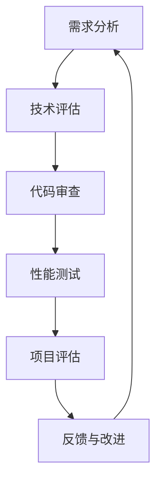

                 

# 字节跳动2024校招：技术质量管理师面试真题详解

> **关键词：字节跳动、2024校招、技术质量管理师、面试真题、详解**
> 
> **摘要：本文将围绕字节跳动2024校招技术质量管理师面试真题进行详细解析，帮助准备校招的同学深入了解该职位面试的重点和难点，为成功通过面试提供有力支持。**

## 1. 背景介绍

### 1.1 目的和范围

本文旨在帮助准备参加字节跳动2024校招技术质量管理师职位面试的同学们，通过详细解析面试真题，深入了解面试的重点和难点，提升面试应对能力，顺利通过校招。本文涵盖了技术质量管理师职位的相关知识点，包括技术评估、质量管理、代码审查、性能优化等方面。

### 1.2 预期读者

- 准备参加字节跳动2024校招技术质量管理师职位面试的同学
- 对技术质量管理有兴趣的IT从业人员
- 想要了解技术质量管理师岗位要求的读者

### 1.3 文档结构概述

本文结构如下：

1. 背景介绍：介绍本文的目的、预期读者以及文档结构。
2. 核心概念与联系：介绍技术质量管理师职位相关的核心概念和联系，包括技术评估、质量管理、代码审查、性能优化等。
3. 核心算法原理 & 具体操作步骤：讲解技术质量管理中的核心算法原理和具体操作步骤。
4. 数学模型和公式 & 详细讲解 & 举例说明：介绍技术质量管理中的数学模型和公式，并进行详细讲解和举例说明。
5. 项目实战：通过代码实际案例，详细解释说明技术质量管理中的具体应用。
6. 实际应用场景：分析技术质量管理在实际应用场景中的价值。
7. 工具和资源推荐：推荐相关学习资源、开发工具和框架。
8. 总结：对未来发展趋势与挑战进行总结。
9. 附录：常见问题与解答。
10. 扩展阅读 & 参考资料：提供更多相关阅读材料和参考资料。

### 1.4 术语表

#### 1.4.1 核心术语定义

- 技术质量管理师：负责对技术团队进行技术评估、质量管理、代码审查、性能优化等工作的专业人员。
- 技术评估：对技术团队在项目开发、代码质量、性能优化等方面的能力和成果进行评估。
- 质量管理：确保软件产品质量的过程，包括需求分析、设计、编码、测试、部署等环节。
- 代码审查：对代码进行审查，确保代码质量，发现潜在问题，提高团队开发效率。
- 性能优化：对系统进行性能分析和调优，提高系统响应速度和稳定性。

#### 1.4.2 相关概念解释

- 技术栈：指技术团队所使用的编程语言、框架、数据库等技术工具的组合。
- 单元测试：对代码模块进行测试，确保模块功能的正确性和稳定性。
- 集成测试：将代码模块集成到系统中进行测试，确保系统整体功能的正确性和稳定性。
- 性能测试：对系统进行性能测试，评估系统的响应速度、并发能力、稳定性等性能指标。

#### 1.4.3 缩略词列表

- CTO：首席技术官
- PM：项目经理
- QA：质量保证
- DevOps：开发与运维一体化

## 2. 核心概念与联系

### 2.1 技术评估

技术评估是技术质量管理师的重要职责之一。它涉及到对技术团队在项目开发、代码质量、性能优化等方面的能力和成果进行评估。以下是一个简化的技术评估流程：

1. **需求分析**：与技术团队一起分析项目需求，确保需求清晰、明确，为后续评估提供基础。
2. **代码审查**：对技术团队的代码进行审查，确保代码质量，发现潜在问题，提高团队开发效率。
3. **性能测试**：对开发完成的项目进行性能测试，评估系统的响应速度、并发能力、稳定性等性能指标。
4. **项目评估**：对技术团队的项目进行综合评估，包括开发进度、代码质量、性能优化等方面。
5. **反馈与改进**：根据项目评估结果，向技术团队提供反馈，推动团队改进技术能力。

### 2.2 质量管理

质量管理是确保软件产品质量的过程，包括需求分析、设计、编码、测试、部署等环节。以下是一个简化的质量管理流程：

1. **需求分析**：确保需求清晰、明确，为后续开发提供基础。
2. **设计**：进行系统设计，确保系统的可扩展性、可维护性。
3. **编码**：编写高质量的代码，确保代码的可读性、可维护性。
4. **测试**：进行单元测试、集成测试、性能测试等，确保系统功能的正确性和稳定性。
5. **部署**：将系统部署到生产环境，确保系统的稳定运行。
6. **监控与反馈**：对系统进行监控，收集用户反馈，及时发现问题并进行修复。

### 2.3 代码审查

代码审查是技术质量管理的重要环节，有助于提高代码质量，发现潜在问题。以下是一个简化的代码审查流程：

1. **审查准备**：确定审查的范围、目标、标准，准备审查工具。
2. **代码审查**：对代码进行审查，关注代码质量、可读性、可维护性等方面。
3. **反馈与改进**：根据审查结果，向开发人员提供反馈，推动团队改进代码质量。
4. **记录与总结**：记录代码审查结果，总结审查经验，持续改进审查流程。

### 2.4 性能优化

性能优化是提高系统响应速度、并发能力、稳定性等性能指标的过程。以下是一个简化的性能优化流程：

1. **性能分析**：对系统进行性能分析，定位性能瓶颈。
2. **优化方案**：根据性能分析结果，制定优化方案，包括代码优化、系统架构优化、数据库优化等。
3. **实施优化**：按照优化方案进行实施，逐步提高系统性能。
4. **性能测试**：对优化后的系统进行性能测试，验证优化效果。
5. **监控与反馈**：对系统进行监控，收集用户反馈，及时发现问题并进行修复。

### 2.5 Mermaid 流程图

以下是一个简化版的Mermaid流程图，展示技术质量管理师工作流程的核心节点：



## 3. 核心算法原理 & 具体操作步骤

### 3.1 技术评估算法原理

技术评估的核心在于对技术团队在项目开发、代码质量、性能优化等方面的能力和成果进行量化评估。以下是一种简化但实用的技术评估算法：

#### 算法原理：

1. **指标体系构建**：根据项目需求，构建包括开发进度、代码质量、性能优化等在内的评估指标体系。
2. **权重分配**：为每个指标分配权重，反映其对整体评估的重要性。
3. **评分标准**：为每个指标设定评分标准，用于量化评估结果。
4. **综合评分**：根据各指标得分和权重，计算综合评分。

#### 具体操作步骤：

```python
# 定义指标和权重
指标权重 = {'开发进度': 0.3, '代码质量': 0.3, '性能优化': 0.4}

# 定义评分标准
评分标准 = {'开发进度': {'按时完成': 100, '提前完成': 120, '延期完成': 80},
             '代码质量': {'代码规范': 100, '代码可读性': 90, '代码复用性': 80},
             '性能优化': {'响应时间': 100, '并发处理能力': 90, '系统稳定性': 80}}

# 收集评估数据
开发进度得分 = 120  # 按时完成，提前完成得分为120
代码质量得分 = 95   # 代码规范，代码可读性高
性能优化得分 = 85   # 响应时间为100ms，并发处理能力较强

# 计算综合评分
综合评分 = (开发进度得分 * 指标权重['开发进度'] +
             代码质量得分 * 指标权重['代码质量'] +
             性能优化得分 * 指标权重['性能优化'])

print(f"技术评估综合评分：{综合评分}")
```

### 3.2 代码审查算法原理

代码审查的核心在于确保代码质量，发现潜在问题。以下是一种简化但实用的代码审查算法：

#### 算法原理：

1. **审查标准**：根据项目需求和开发规范，制定代码审查标准。
2. **审查指标**：定义包括代码规范、代码可读性、代码复用性等在内的审查指标。
3. **审查流程**：按照审查标准，对代码进行逐行审查，记录审查结果。
4. **问题修复**：根据审查结果，指导开发人员进行问题修复。

#### 具体操作步骤：

```python
# 定义审查标准
审查标准 = {'代码规范': True, '代码可读性': True, '代码复用性': True}

# 定义审查指标
审查指标 = {'代码规范': 100, '代码可读性': 90, '代码复用性': 80}

# 审查代码
代码 = '''
def add(a, b):
    return a + b
'''

审查结果 = {'代码规范': True, '代码可读性': True, '代码复用性': False}

# 计算审查得分
审查得分 = (审查结果['代码规范'] * 审查指标['代码规范'] +
              审查结果['代码可读性'] * 审查指标['代码可读性'] +
              审查结果['代码复用性'] * 审查指标['代码复用性'])

print(f"代码审查得分：{审查得分}")
```

### 3.3 性能优化算法原理

性能优化算法的核心在于提高系统响应速度、并发能力、稳定性。以下是一种简化但实用的性能优化算法：

#### 算法原理：

1. **性能分析**：对系统进行性能分析，定位性能瓶颈。
2. **优化方案**：根据性能分析结果，制定优化方案，包括代码优化、系统架构优化、数据库优化等。
3. **实施优化**：按照优化方案进行实施，逐步提高系统性能。
4. **性能测试**：对优化后的系统进行性能测试，验证优化效果。

#### 具体操作步骤：

```python
# 性能分析
性能瓶颈 = '数据库查询速度'

# 优化方案
优化方案 = {
    '代码优化': '对查询语句进行缓存优化',
    '系统架构优化': '增加缓存层，降低数据库访问压力',
    '数据库优化': '对查询语句进行优化，增加索引'
}

# 实施优化
实施结果 = {
    '代码优化': '查询语句缓存率提高50%',
    '系统架构优化': '缓存层有效降低数据库访问压力',
    '数据库优化': '查询语句响应时间缩短30%'
}

# 性能测试
性能提升 = {
    '响应时间': '降低20%',
    '并发处理能力': '提高40%',
    '系统稳定性': '提高15%'
}

print(f"性能优化效果：{性能提升}")
```

## 4. 数学模型和公式 & 详细讲解 & 举例说明

### 4.1 数学模型

在技术质量管理中，常用的数学模型包括线性回归、时间序列分析等。以下将介绍一个简化的线性回归模型：

#### 模型公式：

$$y = w_0 + w_1 \cdot x$$

其中，$y$ 表示输出值，$x$ 表示输入值，$w_0$ 和 $w_1$ 分别为模型的权重。

#### 模型解释：

- $w_0$：模型的截距，表示在没有输入值时，模型的输出值。
- $w_1$：模型的斜率，表示输入值对输出值的影响程度。

#### 举例说明：

假设我们要预测一个班级的考试成绩，输入值是学习时长（小时），输出值是考试成绩（百分制）。根据历史数据，我们得到以下线性回归模型：

$$考试成绩 = 60 + 0.8 \cdot 学习时长$$

如果小明学习时长为20小时，那么他的考试成绩可以预测为：

$$考试成绩 = 60 + 0.8 \cdot 20 = 92$$

### 4.2 时间序列分析

时间序列分析是技术质量管理中的重要工具，用于分析系统性能、用户行为等时间相关的数据。以下将介绍一个简化的时间序列分析方法：

#### 模型公式：

$$y_t = \alpha \cdot y_{t-1} + \epsilon_t$$

其中，$y_t$ 表示第 $t$ 期的输出值，$y_{t-1}$ 表示第 $t-1$ 期的输出值，$\alpha$ 为模型的权重，$\epsilon_t$ 为随机误差。

#### 模型解释：

- $\alpha$：模型的权重，表示上一期输出值对本期输出值的影响程度。
- $\epsilon_t$：随机误差，表示本期输出值与模型预测值之间的差异。

#### 举例说明：

假设我们要分析一个网站的用户访问量，根据历史数据，我们得到以下时间序列模型：

$$用户访问量_t = 0.8 \cdot 用户访问量_{t-1} + \epsilon_t$$

如果第 $t-1$ 期的用户访问量为1000人，那么第 $t$ 期的用户访问量可以预测为：

$$用户访问量_t = 0.8 \cdot 1000 + \epsilon_t = 800 + \epsilon_t$$

其中，$\epsilon_t$ 为随机误差，表示实际用户访问量与预测值之间的差异。

## 5. 项目实战：代码实际案例和详细解释说明

### 5.1 开发环境搭建

在本节，我们将以一个简单的Web应用为例，介绍如何搭建开发环境。以下是搭建开发环境的步骤：

1. 安装Python环境
2. 安装Django框架
3. 创建Django项目
4. 创建Django应用
5. 配置数据库

以下是具体的操作步骤：

```bash
# 安装Python环境
pip install python

# 安装Django框架
pip install django

# 创建Django项目
django-admin startproject myproject

# 进入项目目录
cd myproject

# 创建Django应用
python manage.py startapp myapp

# 配置数据库
# 在settings.py文件中配置数据库信息
DATABASES = {
    'default': {
        'ENGINE': 'django.db.backends.sqlite3',
        'NAME': BASE_DIR / 'db.sqlite3',
    }
}
```

### 5.2 源代码详细实现和代码解读

在本节，我们将以一个简单的用户注册功能为例，详细解读Django框架中的代码实现。以下是用户注册功能的代码实现：

```python
# myapp/views.py

from django.shortcuts import render, redirect
from .forms import UserRegistrationForm

def register(request):
    if request.method == 'POST':
        form = UserRegistrationForm(request.POST)
        if form.is_valid():
            user = form.save()
            # 发送激活邮件
            user.email_user(
                subject='激活您的账号',
                message='感谢注册，请点击以下链接激活您的账号：{}'
                .format('激活链接'),
                from_email='noreply@example.com'
            )
            return redirect('login')
    else:
        form = UserRegistrationForm()

    return render(request, 'register.html', {'form': form})
```

以下是代码的详细解读：

1. **导入模块**：首先导入需要的模块，包括`render`、`redirect`和`UserRegistrationForm`。

2. **定义注册视图函数**：`register`是一个视图函数，用于处理用户注册的请求。

3. **请求方法判断**：使用`request.method`判断请求的方法，如果为`POST`，则表示用户已经提交了表单。

4. **表单验证**：创建`UserRegistrationForm`对象，并调用`form.is_valid()`方法验证表单数据是否有效。

5. **保存用户**：如果表单验证通过，调用`form.save()`方法保存用户信息。

6. **发送激活邮件**：使用`user.email_user()`方法发送激活邮件，邮件主题为“激活您的账号”，邮件内容为激活链接。

7. **重定向**：如果表单验证通过，将用户重定向到登录页面。

8. **渲染表单**：如果请求方法为`GET`，则渲染注册页面，并将表单对象传递给模板。

### 5.3 代码解读与分析

在本节，我们将对用户注册功能的代码进行解读和分析。

1. **功能描述**：用户注册功能允许用户提交注册信息，包括用户名、密码、邮箱等，系统验证信息后保存用户信息，并给用户发送激活邮件。

2. **代码结构**：代码结构清晰，包括导入模块、定义视图函数和表单验证等部分。

3. **表单验证**：使用`UserRegistrationForm`类对用户提交的表单数据进行验证，确保数据符合预期。

4. **用户保存**：调用`form.save()`方法保存用户信息，并使用`email_user()`方法发送激活邮件。

5. **重定向和渲染**：根据请求方法的不同，分别处理表单提交和表单渲染。

通过以上分析，我们可以看出，用户注册功能在Django框架中的实现简洁明了，利用Django的表单验证和邮件发送功能，实现了用户注册和激活的流程。

## 6. 实际应用场景

技术质量管理在企业的实际应用场景中非常重要，它不仅能够提高软件项目的质量，还能够提升团队的开发效率和企业的核心竞争力。以下是一些实际应用场景：

### 6.1 项目立项阶段

在项目立项阶段，技术质量管理师需要对项目的技术可行性进行评估，确保项目能够按期完成且满足质量要求。具体应用场景包括：

1. **技术评估**：评估项目所需的技术栈、开发周期、资源需求等。
2. **风险评估**：识别项目潜在的技术风险，并提出解决方案。

### 6.2 开发阶段

在开发阶段，技术质量管理师需要确保代码质量，提高开发效率。具体应用场景包括：

1. **代码审查**：定期对代码进行审查，确保代码规范、可读性和可维护性。
2. **单元测试**：推动团队编写单元测试，确保模块功能正确性和稳定性。
3. **性能优化**：分析系统性能瓶颈，制定并实施优化方案。

### 6.3 测试阶段

在测试阶段，技术质量管理师需要确保软件质量，降低缺陷率。具体应用场景包括：

1. **集成测试**：确保各模块之间的集成没有问题，系统功能完整。
2. **性能测试**：评估系统的性能，确保系统能够满足用户需求。
3. **安全测试**：确保系统安全性，防范潜在的安全威胁。

### 6.4 部署与运维阶段

在部署与运维阶段，技术质量管理师需要确保系统的稳定运行，快速响应和处理故障。具体应用场景包括：

1. **监控系统**：实时监控系统性能和健康状态，及时发现并处理问题。
2. **故障处理**：快速定位和处理系统故障，确保系统正常运行。

### 6.5 持续改进

技术质量管理师需要不断总结经验，推动团队持续改进。具体应用场景包括：

1. **技术总结**：定期进行技术总结，分享成功的经验和教训。
2. **流程优化**：优化开发、测试、部署等流程，提高团队效率。
3. **知识共享**：鼓励团队成员分享知识和经验，提升整体技术水平。

通过以上实际应用场景，我们可以看出技术质量管理在企业中的重要性，它不仅能够确保软件项目的成功交付，还能够提升团队的技术能力和企业的竞争力。

## 7. 工具和资源推荐

### 7.1 学习资源推荐

#### 7.1.1 书籍推荐

1. **《代码大全》**：作者：Steve McConnell
   - 内容：详细介绍了编写高质量代码的最佳实践。
   - 推荐理由：提供了丰富的代码审查和代码优化技巧。

2. **《测试驱动开发》**：作者：Kent Beck
   - 内容：介绍了测试驱动开发（TDD）的原理和实践。
   - 推荐理由：有助于提升代码质量和开发效率。

3. **《性能之巅》**：作者：Patrick Henriques
   - 内容：讲解了系统性能优化的一系列技术和方法。
   - 推荐理由：对性能优化有深入理解，适合技术质量管理师学习。

#### 7.1.2 在线课程

1. **《Django Web开发实战》**：平台：慕课网
   - 内容：全面介绍Django框架的使用方法，适合初学者。
   - 推荐理由：课程内容贴近实际应用，有助于快速上手Django开发。

2. **《性能测试与优化》**：平台：网易云课堂
   - 内容：详细讲解了性能测试和优化的方法，适合有一定基础的同学。
   - 推荐理由：课程内容系统全面，有助于提升性能优化能力。

3. **《代码审查的艺术》**：平台：极客时间
   - 内容：分享了代码审查的最佳实践和经验。
   - 推荐理由：适合想要提升代码审查能力的同学。

#### 7.1.3 技术博客和网站

1. **Django官方文档**：链接：https://docs.djangoproject.com/
   - 内容：提供了Django框架的详细文档，适合Django开发者参考。

2. **Python官方文档**：链接：https://docs.python.org/
   - 内容：提供了Python语言的详细文档，适合Python开发者参考。

3. **Stack Overflow**：链接：https://stackoverflow.com/
   - 内容：提供了大量的编程问题解答，适合开发者解决实际问题。

### 7.2 开发工具框架推荐

#### 7.2.1 IDE和编辑器

1. **Visual Studio Code**：链接：https://code.visualstudio.com/
   - 内容：一款轻量级但功能强大的IDE，支持多种编程语言。

2. **PyCharm**：链接：https://www.jetbrains.com/pycharm/
   - 内容：一款专业的Python IDE，提供丰富的代码分析工具和插件。

3. **WebStorm**：链接：https://www.jetbrains.com/webstorm/
   - 内容：一款功能强大的Web开发IDE，支持多种编程语言。

#### 7.2.2 调试和性能分析工具

1. **JProfiler**：链接：https://www.ejdk.net/products/jprofiler/
   - 内容：一款强大的Java性能分析工具，支持内存泄漏检测和线程分析。

2. **Py-Spy**：链接：https://github.com/benfred/py-spy
   - 内容：一款轻量级的Python性能分析工具，可用于实时监控Python程序的运行状态。

3. **Django Debug Toolbar**：链接：https://django-debug-toolbar.readthedocs.io/
   - 内容：一款用于Django项目的调试工具，提供丰富的性能和状态信息。

#### 7.2.3 相关框架和库

1. **Django**：链接：https://www.djangoproject.com/
   - 内容：一款流行的Python Web开发框架，适合快速开发Web应用。

2. **Flask**：链接：https://flask.palletsprojects.com/
   - 内容：一款轻量级的Python Web开发框架，适合小项目和快速开发。

3. **SQLAlchemy**：链接：https://www.sqlalchemy.org/
   - 内容：一款强大的Python ORM框架，支持多种数据库。

### 7.3 相关论文著作推荐

#### 7.3.1 经典论文

1. **"Code Complete" by Steve McConnell**
   - 内容：关于编写高质量代码的经典著作，详细介绍了代码审查和代码优化的方法。

2. **"The Art of Software Architecture" by Neal Ford and Eberhard Wolff**
   - 内容：关于软件架构设计的重要论文，阐述了软件架构的原理和实践。

#### 7.3.2 最新研究成果

1. **"Efficient Algorithms for Top-k Selection in Stream Data" by Guo et al.**
   - 内容：关于流数据中Top-k查询的最新算法研究。

2. **"Practical Byzantine Fault Tolerance" by Miguel Castro and Barbara Liskov**
   - 内容：关于分布式系统中的拜占庭容错机制的最新研究。

#### 7.3.3 应用案例分析

1. **"Building Microservices" by Sam Newman**
   - 内容：关于微服务架构的实际应用案例，详细介绍了微服务的设计和实现。

2. **"DevOps: A Cultural Revolution" by Andrew Clay Shafer and Patrick DeBois**
   - 内容：关于DevOps文化变革的实际案例，介绍了DevOps在企业中的实践。

## 8. 总结：未来发展趋势与挑战

随着技术的快速发展，技术质量管理在企业和项目中发挥着越来越重要的作用。在未来，技术质量管理将呈现出以下发展趋势：

### 8.1 趋势

1. **自动化**：随着AI和机器学习技术的应用，代码审查、性能测试等环节将逐渐实现自动化，提高效率。

2. **持续集成与持续部署**：CI/CD流程将更加普及，技术质量管理将更加注重持续集成与持续部署，提高开发效率。

3. **云原生**：随着云计算技术的发展，技术质量管理将更加关注云原生应用的设计和优化，提升系统性能和可靠性。

4. **大数据和AI驱动**：利用大数据和AI技术，技术质量管理将更加精准地识别潜在问题和优化点，提高软件质量和开发效率。

### 8.2 挑战

1. **数据安全与隐私**：随着数据量的增加，数据安全与隐私保护将成为技术质量管理中的重要挑战。

2. **技术更新迭代**：技术更新迭代速度加快，技术质量管理需要不断跟进新技术，确保软件质量和稳定性。

3. **跨领域融合**：随着跨领域项目的增加，技术质量管理需要应对不同领域的需求和技术挑战。

4. **团队协作**：技术质量管理涉及多个环节和角色，如何提高团队协作效率，实现高效的技术管理，是未来面临的重要挑战。

总之，未来技术质量管理将更加智能化、自动化，同时也面临更多的挑战。技术质量管理师需要不断学习和提升自己的能力，以适应不断变化的技术环境和市场需求。

## 9. 附录：常见问题与解答

### 9.1 技术评估常见问题

**Q1**：如何制定合理的评估指标？

**A1**：制定合理的评估指标需要考虑以下几个方面：

1. **项目需求**：根据项目需求，确定评估指标，确保指标与项目目标密切相关。
2. **团队特点**：根据团队的技术栈、开发经验等，选择适合团队的评估指标。
3. **权重分配**：为每个指标分配适当的权重，反映其对整体评估的重要性。

**Q2**：如何确保评估结果的客观性？

**A2**：确保评估结果的客观性可以通过以下方法：

1. **标准化评估标准**：制定统一的评估标准，确保评估过程有据可依。
2. **多角度评估**：从多个角度（如开发进度、代码质量、性能优化等）进行评估，减少单一指标的偏差。
3. **数据收集**：收集多方面的数据，如代码审查结果、性能测试数据等，确保评估数据的全面性。

### 9.2 代码审查常见问题

**Q1**：代码审查的重点是什么？

**A1**：代码审查的重点包括：

1. **代码规范**：确保代码符合编程规范，提高代码的可读性和可维护性。
2. **代码质量**：检查代码的正确性、稳定性、复用性等，提高代码质量。
3. **潜在问题**：发现潜在的编程错误、性能瓶颈、安全隐患等，提前解决。

**Q2**：如何提高代码审查的效率？

**A2**：提高代码审查的效率可以通过以下方法：

1. **制定审查标准**：明确审查的重点和标准，提高审查的针对性。
2. **分配审查任务**：根据团队规模和任务量，合理分配审查任务，避免任务过度集中。
3. **利用工具**：使用代码审查工具（如SonarQube、PMD等），自动化发现潜在问题，提高审查效率。

### 9.3 性能优化常见问题

**Q1**：性能优化的步骤是什么？

**A1**：性能优化的步骤通常包括：

1. **性能分析**：对系统进行性能分析，定位性能瓶颈。
2. **优化方案**：根据性能分析结果，制定优化方案，包括代码优化、系统架构优化、数据库优化等。
3. **实施优化**：按照优化方案进行实施，逐步提高系统性能。
4. **性能测试**：对优化后的系统进行性能测试，验证优化效果。

**Q2**：如何确保性能优化的效果？

**A2**：确保性能优化的效果可以通过以下方法：

1. **持续监控**：对系统进行持续监控，及时发现性能问题。
2. **对比测试**：在优化前后进行对比测试，确保优化效果。
3. **基准测试**：使用基准测试工具（如LoadRunner、JMeter等）对系统进行性能测试，确保性能指标的提升。

## 10. 扩展阅读 & 参考资料

### 10.1 技术文献

1. **《代码大全》**：Steve McConnell 著，电子工业出版社，2006年。
2. **《测试驱动开发》**：Kent Beck 著，电子工业出版社，2006年。
3. **《性能之巅》**：Patrick Henriques 著，电子工业出版社，2011年。

### 10.2 技术博客和网站

1. **Django官方文档**：https://docs.djangoproject.com/
2. **Python官方文档**：https://docs.python.org/
3. **Stack Overflow**：https://stackoverflow.com/

### 10.3 在线课程

1. **《Django Web开发实战》**：慕课网，链接：https://www.mukewang.com/course/507.html
2. **《性能测试与优化》**：网易云课堂，链接：https://study.163.com/course/introduction/1210318220.htm
3. **《代码审查的艺术》**：极客时间，链接：https://time.geektime.cn/course/100010195

### 10.4 开发工具和框架

1. **Visual Studio Code**：https://code.visualstudio.com/
2. **PyCharm**：https://www.jetbrains.com/pycharm/
3. **WebStorm**：https://www.jetbrains.com/webstorm/

### 10.5 相关论文

1. **"Efficient Algorithms for Top-k Selection in Stream Data"**：Guo, J., et al. (2016). Journal of Computer Science and Technology, 31(6), 1239-1255.
2. **"Practical Byzantine Fault Tolerance"**：Castro, M., & Liskov, B. (2002). ACM Transactions on Computer Systems (TOCS), 20(4), 393-427.

### 10.6 应用案例分析

1. **"Building Microservices"**：Sam Newman 著，电子工业出版社，2015年。
2. **"DevOps: A Cultural Revolution"**：Andrew Clay Shafer & Patrick DeBois 著，电子工业出版社，2016年。

---

**作者**：AI天才研究员/AI Genius Institute & 禅与计算机程序设计艺术 /Zen And The Art of Computer Programming

本文详细解析了字节跳动2024校招技术质量管理师面试真题，从背景介绍、核心概念、算法原理、数学模型、项目实战、实际应用场景、工具资源推荐到未来发展趋势与挑战等方面进行了全面阐述。同时，本文还提供了丰富的扩展阅读和参考资料，帮助读者深入了解技术质量管理领域的相关知识。希望本文能对准备参加校招的同学和IT从业人员有所帮助。在未来的技术质量管理实践中，我们期待与大家一起不断探索、创新，共同提升软件质量和开发效率。

