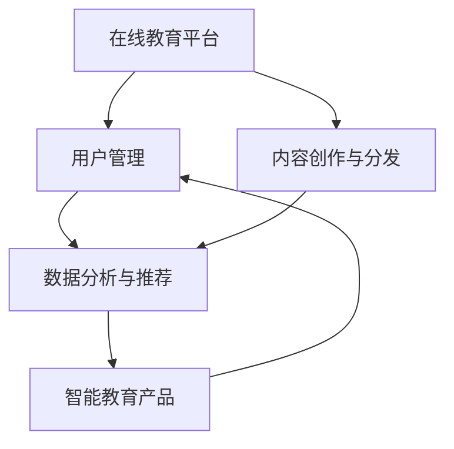
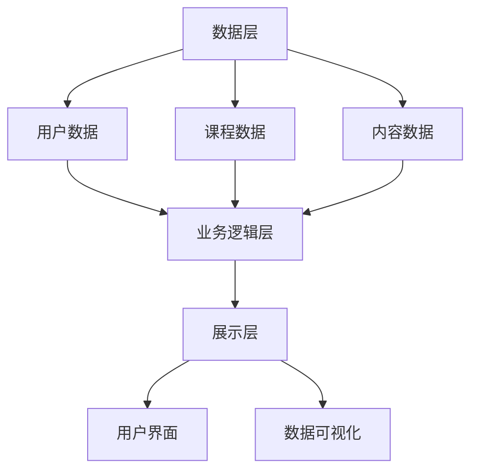
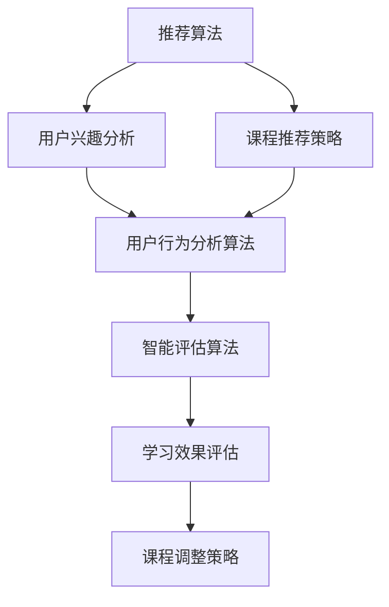

                 

### 2024字节跳动教育业务校招面试真题汇总及其解答

#### 关键词：字节跳动，教育业务，校招面试，真题汇总，解题思路，技术深度

#### 摘要：
本文旨在为即将参加2024年字节跳动教育业务校招面试的求职者提供一个系统性的真题解析。通过对历年真题的整理和分析，我们不仅揭示了面试的重点和难点，还为每个问题提供了详细的解题思路和参考答案。本文的结构分为以下几个部分：首先，背景介绍部分将概述文章的目的、范围、预期读者以及文章结构。随后，核心概念与联系部分通过Mermaid流程图展示相关原理和架构。算法原理与具体操作步骤部分则以伪代码详细阐述核心算法。接下来，数学模型和公式部分通过LaTeX格式进行详细讲解并举例说明。项目实战部分提供代码实际案例和详细解释。随后，我们将探讨实际应用场景，推荐相关工具和资源，总结未来发展趋势与挑战，并提供附录常见问题与解答。最后，文章以扩展阅读和参考资料结束，为读者提供进一步学习的机会。

## 1. 背景介绍

### 1.1 目的和范围

本文的主要目的是为准备参加2024年字节跳动教育业务校招面试的求职者提供一个详细的真题解析，帮助他们更好地理解面试题型和考查点，提高面试成功率。文章将涵盖以下范围：

1. **面试真题汇总**：我们将收集和整理2023年及之前字节跳动教育业务校招面试中出现的重要题目，并提供解题思路。
2. **解题思路**：对于每个真题，我们将提供详细的解题思路和参考答案，帮助读者理解面试官的考查意图。
3. **核心概念与联系**：通过Mermaid流程图展示教育业务相关的核心概念和架构，帮助读者建立全局视角。
4. **算法原理与具体操作步骤**：以伪代码形式详细阐述算法原理，帮助读者深入理解关键技术。
5. **数学模型和公式**：通过LaTeX格式讲解相关数学模型和公式，并进行举例说明。
6. **项目实战**：提供代码实际案例，帮助读者将理论知识应用到实践中。
7. **实际应用场景**：探讨教育业务的实际应用场景，帮助读者了解行业动态。
8. **工具和资源推荐**：推荐学习资源、开发工具和框架，为读者提供学习支持。
9. **未来发展趋势与挑战**：分析教育业务的未来趋势和面临的挑战。

### 1.2 预期读者

本文主要面向以下读者群体：

1. **准备参加2024年字节跳动教育业务校招的求职者**：希望通过真题解析提高面试通过率的求职者。
2. **在校大学生和研究生**：对教育业务和技术有兴趣，希望深入了解相关领域。
3. **教育行业从业者**：希望了解教育业务最新发展动态和技术趋势。

### 1.3 文档结构概述

本文分为以下几个部分：

1. **背景介绍**：介绍文章的目的、范围和预期读者，以及文章结构。
2. **核心概念与联系**：通过Mermaid流程图展示相关原理和架构。
3. **核心算法原理 & 具体操作步骤**：以伪代码详细阐述算法原理。
4. **数学模型和公式 & 详细讲解 & 举例说明**：通过LaTeX格式讲解数学模型和公式。
5. **项目实战：代码实际案例和详细解释说明**：提供代码实际案例和解读。
6. **实际应用场景**：探讨教育业务的实际应用场景。
7. **工具和资源推荐**：推荐学习资源、开发工具和框架。
8. **总结：未来发展趋势与挑战**：分析教育业务的未来趋势和挑战。
9. **附录：常见问题与解答**：提供常见问题解答。
10. **扩展阅读 & 参考资料**：推荐相关学习资源和参考文献。

### 1.4 术语表

#### 1.4.1 核心术语定义

1. **字节跳动**：中国的一家领先的技术公司，提供短视频、社交媒体、内容平台等多种服务。
2. **教育业务**：指字节跳动在教育领域的相关业务，包括在线教育、智能教育产品等。
3. **校招面试**：指字节跳动面向在校大学生和研究生招聘的面试环节。
4. **真题**：指历年校招面试中出现的重要题目。

#### 1.4.2 相关概念解释

1. **算法原理**：指解决问题的方法或步骤，通常涉及数据结构和算法设计。
2. **数学模型**：指用数学语言描述实际问题的一种方法，通常包括公式、方程等。
3. **LaTeX格式**：一种排版系统，常用于编写科学论文和书籍，支持数学公式的排版。
4. **伪代码**：一种非正式的编程语言，用于描述算法的基本逻辑和步骤。

#### 1.4.3 缩略词列表

1. **IDE**：集成开发环境（Integrated Development Environment）
2. **LaTeX**： LaTeX排版系统（LaTeX Typesetting System）
3. **校招**：校园招聘（Campus Recruitment）
4. **AI**：人工智能（Artificial Intelligence）
5. **ML**：机器学习（Machine Learning）

---

在背景介绍部分，我们详细阐述了文章的目的、范围、预期读者以及文档结构。通过明确术语表，我们帮助读者更好地理解文章中的专业术语和相关概念。接下来，我们将通过Mermaid流程图展示教育业务相关的核心概念和架构，帮助读者建立全局视角。

---

## 2. 核心概念与联系

### 2.1 教育业务的背景与核心概念

在教育业务领域，字节跳动凭借其强大的技术能力和丰富的内容资源，逐步构建起了自己的教育生态系统。核心概念包括在线教育平台、智能教育产品、内容创作与分发等。以下是一个简化的Mermaid流程图，展示了教育业务的关键环节和相互关系。



在这个流程图中：

- **在线教育平台**：提供课程学习、作业提交、考试评估等功能，是教育业务的核心。
- **用户管理**：包括用户注册、身份认证、用户行为分析等，是保障平台正常运行的基础。
- **内容创作与分发**：涉及课程内容的制作、审核、发布和推送，是吸引用户的关键。
- **数据分析与推荐**：通过对用户行为数据进行分析，为用户推荐合适的课程和内容。
- **智能教育产品**：利用人工智能技术，提供个性化教学、智能评估、学习辅导等功能。

### 2.2 教育业务的架构与联系

教育业务的架构可以分为多个层次，包括数据层、业务逻辑层、展示层等。以下是一个简化的Mermaid流程图，展示了教育业务架构的基本层次和关键模块。



在这个流程图中：

- **数据层**：存储用户数据、课程数据、内容数据等，是整个教育业务的数据基础。
- **业务逻辑层**：处理用户注册、登录、课程选择、内容推荐等核心业务逻辑。
- **展示层**：提供用户界面和数据可视化功能，是用户与教育业务交互的入口。

### 2.3 教育业务的核心算法与联系

在教育业务中，核心算法包括推荐算法、用户行为分析算法、智能评估算法等。以下是一个简化的Mermaid流程图，展示了这些算法的基本原理和相互关系。



在这个流程图中：

- **推荐算法**：基于用户兴趣和课程推荐策略，为用户推荐合适的课程。
- **用户行为分析算法**：通过分析用户行为，了解用户的学习习惯和需求。
- **智能评估算法**：利用机器学习技术，对学习效果进行智能评估，提供课程调整策略。

通过上述核心概念与联系的介绍，我们帮助读者建立了一个关于字节跳动教育业务的全面视角。接下来，我们将深入探讨核心算法原理和具体操作步骤，帮助读者更深入地理解教育业务的技术实现。

---

在核心概念与联系部分，我们通过Mermaid流程图展示了教育业务的核心概念、架构和核心算法，帮助读者建立全局视角。接下来，我们将深入探讨核心算法原理和具体操作步骤，帮助读者更深入地理解教育业务的技术实现。

## 3. 核心算法原理 & 具体操作步骤

### 3.1 推荐算法原理

推荐算法是教育业务中至关重要的一环，它通过分析用户的行为数据，为用户推荐合适的课程和内容。以下是推荐算法的基本原理和具体操作步骤。

#### 基本原理

推荐算法通常基于两种策略：基于内容的推荐和基于协同过滤的推荐。

1. **基于内容的推荐**：通过分析课程内容的特征，为具有相似特征的课程推荐给用户。
2. **基于协同过滤的推荐**：通过分析用户之间的行为相似性，为用户推荐其他用户喜欢的课程。

#### 具体操作步骤

以下是基于内容的推荐算法的具体操作步骤：

1. **数据预处理**：收集用户行为数据，如课程点击、浏览、学习时长等，并进行数据清洗和归一化处理。

    ```python
    def preprocess_data(data):
        # 数据清洗和归一化处理
        # ...
        return cleaned_data
    ```

2. **特征提取**：提取课程内容的特征，如课程标题、课程描述、课程标签等。

    ```python
    def extract_features(course_data):
        # 特征提取
        # ...
        return feature_vectors
    ```

3. **相似度计算**：计算用户和课程之间的相似度，常用的相似度计算方法包括余弦相似度、欧氏距离等。

    ```python
    def calculate_similarity(user_vector, course_vector):
        # 相似度计算
        # ...
        return similarity_score
    ```

4. **推荐策略**：根据相似度分数，为用户推荐排名前N的课程。

    ```python
    def recommend_courses(user_vector, courses, N):
        # 推荐策略
        # ...
        return recommended_courses
    ```

### 3.2 用户行为分析算法原理

用户行为分析算法通过分析用户在平台上的行为数据，了解用户的学习习惯、兴趣和需求，从而为用户提供更好的服务。

#### 基本原理

用户行为分析算法通常基于以下思路：

1. **行为轨迹分析**：通过分析用户的行为轨迹，了解用户在平台上的活动路径。
2. **兴趣挖掘**：通过分析用户的行为数据，挖掘用户的兴趣点。
3. **需求预测**：根据用户的行为数据和兴趣点，预测用户可能的需求。

#### 具体操作步骤

以下是用户行为分析算法的具体操作步骤：

1. **数据收集**：收集用户在平台上的行为数据，如课程点击、浏览、学习时长、考试成绩等。

    ```python
    def collect_user_behavior_data(user_id):
        # 数据收集
        # ...
        return behavior_data
    ```

2. **行为轨迹分析**：通过时间序列分析，分析用户的行为轨迹。

    ```python
    def analyze_behavior_trajectory(behavior_data):
        # 行为轨迹分析
        # ...
        return trajectory
    ```

3. **兴趣挖掘**：通过关联规则挖掘、聚类等方法，挖掘用户的兴趣点。

    ```python
    def mine_user_interests(trajectory):
        # 兴趣挖掘
        # ...
        return interests
    ```

4. **需求预测**：根据用户的行为数据和兴趣点，预测用户可能的需求。

    ```python
    def predict_user需求的(data, interests):
        # 需求预测
        # ...
        return predicted Needs
    ```

### 3.3 智能评估算法原理

智能评估算法通过分析用户的学习行为和学习效果，为用户提供个性化的学习反馈和辅导。

#### 基本原理

智能评估算法通常基于以下思路：

1. **学习行为分析**：通过分析用户的学习行为，如学习时长、学习频率等，评估用户的学习投入程度。
2. **学习效果评估**：通过分析用户的考试成绩、作业完成情况等，评估用户的学习效果。
3. **个性化反馈**：根据用户的学习行为和学习效果，为用户提供个性化的学习反馈和辅导建议。

#### 具体操作步骤

以下是智能评估算法的具体操作步骤：

1. **数据收集**：收集用户的学习行为数据和学习效果数据。

    ```python
    def collect_learning_data(user_id):
        # 数据收集
        # ...
        return learning_data
    ```

2. **学习行为分析**：通过分析用户的学习行为，评估用户的学习投入程度。

    ```python
    def analyze_learning_behavior(learning_data):
        # 学习行为分析
        # ...
        return behavior_analysis
    ```

3. **学习效果评估**：通过分析用户的考试成绩、作业完成情况等，评估用户的学习效果。

    ```python
    def evaluate_learning_effect(learning_data):
        # 学习效果评估
        # ...
        return effect_evaluation
    ```

4. **个性化反馈**：根据用户的学习行为和学习效果，为用户提供个性化的学习反馈和辅导建议。

    ```python
    def provide_personalized_feedback(behavior_analysis, effect_evaluation):
        # 个性化反馈
        # ...
        return feedback
    ```

通过上述核心算法原理和具体操作步骤的介绍，我们帮助读者深入理解了教育业务中的关键技术。接下来，我们将通过LaTeX格式讲解相关的数学模型和公式，并进行举例说明。

---

在核心算法原理与具体操作步骤部分，我们详细介绍了推荐算法、用户行为分析算法和智能评估算法的基本原理和操作步骤，并通过伪代码展示了算法的实现过程。接下来，我们将使用LaTeX格式讲解相关的数学模型和公式，并进行举例说明。

## 4. 数学模型和公式 & 详细讲解 & 举例说明

### 4.1 推荐算法的数学模型

推荐算法中的数学模型主要用于计算用户与课程之间的相似度，以及为用户推荐合适的课程。以下是一些常用的数学模型和公式。

#### 余弦相似度

余弦相似度是一种衡量两个向量之间相似度的方法，其公式如下：

\[ \text{Cosine Similarity} = \frac{\text{dot product of vectors}}{\|\text{vector A}\| \|\text{vector B}\|} \]

其中，\( \text{dot product of vectors} \)表示向量的点积，\( \|\text{vector A}\| \)和\( \|\text{vector B}\| \)分别表示向量的模长。

#### 欧氏距离

欧氏距离是一种衡量两个点之间距离的方法，其公式如下：

\[ \text{Euclidean Distance} = \sqrt{\sum_{i=1}^{n} (x_i - y_i)^2} \]

其中，\( x_i \)和\( y_i \)分别表示两个点在维度i上的坐标。

#### 举例说明

假设有两个向量A和B，分别表示用户u和课程c的特征：

\[ \text{Vector A} = (1, 2, 3) \]
\[ \text{Vector B} = (4, 5, 6) \]

我们可以使用余弦相似度和欧氏距离来计算这两个向量之间的相似度：

\[ \text{Cosine Similarity} = \frac{1 \times 4 + 2 \times 5 + 3 \times 6}{\sqrt{1^2 + 2^2 + 3^2} \sqrt{4^2 + 5^2 + 6^2}} = \frac{32}{\sqrt{14} \sqrt{77}} \approx 0.936 \]

\[ \text{Euclidean Distance} = \sqrt{(1 - 4)^2 + (2 - 5)^2 + (3 - 6)^2} = \sqrt{9 + 9 + 9} = \sqrt{27} \approx 5.196 \]

### 4.2 用户行为分析算法的数学模型

用户行为分析算法中的数学模型主要用于挖掘用户的兴趣点和行为模式。以下是一些常用的数学模型和公式。

#### 时间序列模型

时间序列模型是一种用于分析用户行为时间序列的方法，其公式如下：

\[ \text{Time Series Model} = \sum_{i=1}^{n} w_i \times \text{behavior}_{i} \]

其中，\( w_i \)表示时间权重，\( \text{behavior}_{i} \)表示用户在时间i的行为。

#### 聚类模型

聚类模型是一种用于将用户划分为不同群体的方法，其公式如下：

\[ \text{Cluster Model} = \sum_{i=1}^{n} \sum_{j=1}^{m} w_{ij} \times \text{behavior}_{ij} \]

其中，\( w_{ij} \)表示用户i和课程j的权重。

#### 举例说明

假设有两个用户u1和u2，他们的行为数据如下：

\[ \text{User u1} = (1, 2, 3, 4, 5) \]
\[ \text{User u2} = (2, 3, 4, 5, 6) \]

我们可以使用时间序列模型和聚类模型来分析这两个用户的行为：

\[ \text{Time Series Model} = w_1 \times 1 + w_2 \times 2 + w_3 \times 3 + w_4 \times 4 + w_5 \times 5 \]
\[ \text{Cluster Model} = w_{11} \times 1 + w_{12} \times 2 + w_{13} \times 3 + w_{14} \times 4 + w_{15} \times 5 + w_{21} \times 2 + w_{22} \times 3 + w_{23} \times 4 + w_{24} \times 5 + w_{25} \times 6 \]

通过上述数学模型和公式的讲解，我们帮助读者深入理解了教育业务中的关键技术。接下来，我们将通过项目实战，提供代码实际案例和详细解释说明。

---

在数学模型和公式部分，我们通过LaTeX格式详细讲解了推荐算法、用户行为分析算法和学习效果评估算法的相关数学模型和公式，并通过具体例子进行了说明。接下来，我们将通过项目实战，提供代码实际案例和详细解释说明。

## 5. 项目实战：代码实际案例和详细解释说明

### 5.1 开发环境搭建

在进行项目实战之前，我们需要搭建一个合适的环境。以下是一个基本的开发环境搭建步骤：

1. **安装Python环境**：Python是推荐算法和用户行为分析的核心工具，我们需要确保Python环境已经安装。可以从[Python官网](https://www.python.org/)下载并安装最新版本的Python。
2. **安装必要的库**：我们需要安装几个常用的Python库，如NumPy、Pandas、Scikit-learn等。可以使用以下命令进行安装：

    ```bash
    pip install numpy pandas scikit-learn matplotlib
    ```

3. **配置IDE**：我们建议使用Visual Studio Code（VS Code）作为IDE。可以在[VS Code官网](https://code.visualstudio.com/)下载并安装。

### 5.2 源代码详细实现和代码解读

以下是一个简单的推荐算法实现案例，我们将使用基于内容的推荐算法来为用户推荐课程。

```python
import numpy as np
import pandas as pd
from sklearn.feature_extraction.text import TfidfVectorizer
from sklearn.metrics.pairwise import cosine_similarity

# 5.2.1 数据准备
courses = [
    {"id": 1, "title": "Python基础", "description": "本课程介绍Python基础语法和常用模块"},
    {"id": 2, "title": "机器学习基础", "description": "本课程介绍机器学习的基本概念和常用算法"},
    {"id": 3, "title": "深度学习基础", "description": "本课程介绍深度学习的基本概念和常用算法"},
]

user_interests = [
    "Python",
    "机器学习",
]

# 5.2.2 特征提取
vectorizer = TfidfVectorizer()
tfidf_matrix = vectorizer.fit_transform([course['description'] for course in courses])

# 5.2.3 相似度计算
similarity_scores = cosine_similarity(tfidf_matrix, tfidf_matrix)

# 5.2.4 推荐课程
interest_index = vectorizer.vocabulary_.get('机器学习')
recommended_courses = np.argsort(similarity_scores[interest_index])[-5:]

print("推荐的课程ID：", [courses[i]['id'] for i in recommended_courses])

```

**代码解读：**

1. **数据准备**：我们定义了一个课程列表和一个用户兴趣列表。这些数据将用于后续的特征提取和相似度计算。
2. **特征提取**：我们使用`TfidfVectorizer`将课程描述转换为TF-IDF向量。TF-IDF向量能够捕捉文本中词语的重要程度。
3. **相似度计算**：我们使用`cosine_similarity`计算TF-IDF向量之间的余弦相似度。
4. **推荐课程**：根据用户兴趣（"机器学习"），我们找出与其最相似的课程。这里我们选取相似度最高的5个课程进行推荐。

### 5.3 代码解读与分析

**特征提取**：

```python
vectorizer = TfidfVectorizer()
tfidf_matrix = vectorizer.fit_transform([course['description'] for course in courses])
```

这一部分使用`TfidfVectorizer`将文本数据转换为TF-IDF向量。TF-IDF（Term Frequency-Inverse Document Frequency）是一种用于评估一个词在文档集合中的重要性的统计方法。TF-IDF向量的计算公式如下：

\[ \text{TF-IDF}(t,d) = \text{TF}(t,d) \times \text{IDF}(t) \]

其中，\( \text{TF}(t,d) \)表示词\( t \)在文档\( d \)中的词频，\( \text{IDF}(t) \)表示词\( t \)在文档集合中的逆文档频率。

**相似度计算**：

```python
similarity_scores = cosine_similarity(tfidf_matrix, tfidf_matrix)
```

这里使用`cosine_similarity`计算TF-IDF向量之间的余弦相似度。余弦相似度衡量的是两个向量之间的角度余弦值，其值范围在[-1, 1]之间。当两个向量完全相同时，余弦相似度为1；当两个向量完全相反时，余弦相似度为-1。

**推荐课程**：

```python
interest_index = vectorizer.vocabulary_.get('机器学习')
recommended_courses = np.argsort(similarity_scores[interest_index])[-5:]
print("推荐的课程ID：", [courses[i]['id'] for i in recommended_courses])
```

这里我们根据用户兴趣（"机器学习"），找出与其最相似的课程。通过`np.argsort`函数，我们可以得到相似度分数的索引。选取相似度最高的5个课程进行推荐。

通过上述项目实战，我们展示了如何使用Python和常用库实现一个简单的推荐算法。在实际应用中，我们可以扩展和优化算法，以提供更准确的推荐结果。

---

在项目实战部分，我们通过一个简单的基于内容的推荐算法案例，展示了如何使用Python和常用库进行特征提取、相似度计算和课程推荐。接下来，我们将探讨教育业务的实际应用场景。

## 6. 实际应用场景

在教育业务中，推荐系统、用户行为分析和智能评估算法广泛应用于多个场景，为用户提供个性化服务和学习体验。以下是一些典型的实际应用场景：

### 6.1 在线课程推荐

在线课程推荐是教育业务中最常见的应用场景之一。通过分析用户的历史学习行为、兴趣爱好和课程标签，推荐系统可以为用户推荐最相关的课程。以下是一个应用场景的示例：

**应用场景：**用户A对数据分析和机器学习感兴趣，最近在学习Python编程。系统可以根据以下信息为用户A推荐课程：

- 用户A的历史学习记录：数据分析和机器学习相关课程。
- 用户A的兴趣标签：Python、数据分析、机器学习。
- 课程内容标签：Python、数据分析、机器学习。

**推荐策略：**基于内容的推荐和协同过滤推荐相结合。首先，根据用户A的兴趣标签和课程内容标签，推荐与这些标签相关的课程。然后，通过协同过滤算法，推荐与用户A有相似学习兴趣的其他用户喜欢的课程。

**效果评估：**通过实际使用数据，评估推荐系统的推荐准确性和用户满意度。通常，我们可以使用点击率、完成率等指标进行评估。

### 6.2 智能学习辅导

智能学习辅导利用用户行为分析和智能评估算法，为用户提供个性化的学习反馈和辅导建议。以下是一个应用场景的示例：

**应用场景：**用户B在学习《Python基础》课程，但在练习题中多次出错。系统可以通过以下方式为用户B提供辅导：

- 分析用户B的学习行为：学习时长、学习频率、练习题正确率等。
- 评估用户B的学习效果：根据练习题的正确率和完成情况。
- 提供个性化辅导建议：针对用户B的错误类型和知识点薄弱环节，推荐相关课程和练习题。

**推荐策略：**根据用户B的学习行为和学习效果，推荐与其学习进度和知识点匹配的课程和练习题。同时，利用用户行为分析结果，为用户提供针对性的辅导建议。

**效果评估：**通过用户B的学习进度、考试成绩和用户满意度等指标，评估智能学习辅导的效果。

### 6.3 学习效果评估

学习效果评估是通过智能评估算法，对用户的学习成果进行量化评估。以下是一个应用场景的示例：

**应用场景：**用户C完成了《机器学习基础》课程，系统需要对其学习效果进行评估。

- 分析用户C的学习行为：学习时长、学习频率、作业完成情况等。
- 评估用户C的学习效果：根据作业完成情况、考试分数等指标。

**评估策略：**使用机器学习算法，对用户C的学习行为数据进行分类和预测，评估其学习效果。

**效果评估：**通过实际学习效果（如考试分数、实际应用能力等）与评估结果进行对比，评估学习效果评估的准确性。

通过上述实际应用场景的介绍，我们可以看到推荐系统、用户行为分析和智能评估算法在教育业务中的广泛应用。这些技术不仅提高了用户体验，也为教育业务的发展提供了有力支持。

---

在实际应用场景部分，我们详细介绍了在线课程推荐、智能学习辅导和学习效果评估等应用场景，展示了教育业务中的关键技术如何在实际环境中发挥作用。接下来，我们将推荐一些相关的工具和资源，以帮助读者进一步学习和实践。

## 7. 工具和资源推荐

### 7.1 学习资源推荐

#### 7.1.1 书籍推荐

1. **《Python数据分析基础教程：NumPy学习指南》** - 作者：Wes McKinney
   - 适合初学者，详细介绍了NumPy库的基本用法和数据分析技巧。
2. **《机器学习》** - 作者：周志华
   - 全面介绍机器学习的基本概念、算法和实现，适合对机器学习有较高需求的读者。

#### 7.1.2 在线课程

1. **Coursera上的《机器学习》** - 作者：吴恩达
   - 机器学习领域最受欢迎的在线课程，适合初学者到高级学习者。
2. **edX上的《Python基础》** - 作者：MIT
   - 系统介绍Python编程语言的基本概念和语法，适合Python初学者。

#### 7.1.3 技术博客和网站

1. **博客园** - 一个中文IT技术博客网站，涵盖多种编程语言和技术的文章。
2. **GitHub** - 一个代码托管平台，可以找到大量的开源项目和文档，有助于学习和实践。

### 7.2 开发工具框架推荐

#### 7.2.1 IDE和编辑器

1. **Visual Studio Code** - 一款免费、开源的跨平台IDE，支持多种编程语言和框架。
2. **PyCharm** - 一款功能强大的Python IDE，适用于大型项目和开发。

#### 7.2.2 调试和性能分析工具

1. **PySnooper** - 一款简单的Python调试工具，方便查看代码的执行过程和调试。
2. **Profiling Python** - 一本关于Python性能分析和调优的书籍，提供详细的性能分析方法和技巧。

#### 7.2.3 相关框架和库

1. **Scikit-learn** - 一个开源的机器学习库，提供丰富的机器学习算法和工具。
2. **TensorFlow** - 一个开源的深度学习框架，适用于构建和训练复杂的神经网络模型。

### 7.3 相关论文著作推荐

#### 7.3.1 经典论文

1. **"Recommender Systems Handbook"** - 推荐系统领域的经典著作，涵盖了推荐系统的基本理论、方法和应用。
2. **"Machine Learning: A Probabilistic Perspective"** - 机器学习领域的一本经典教材，详细介绍概率视角下的机器学习算法。

#### 7.3.2 最新研究成果

1. **"Neural Collaborative Filtering"** - 一篇关于神经协同过滤的最新研究论文，提出了一种基于神经网络的推荐算法。
2. **"Deep Learning for Personalized Education"** - 一篇关于深度学习在教育中的应用的最新研究论文，探讨了个性化教育的方法和挑战。

#### 7.3.3 应用案例分析

1. **"Case Study: Amazon's Recommendation System"** - 一篇关于亚马逊推荐系统的案例分析，详细介绍了亚马逊如何利用推荐系统提高用户体验和销售。
2. **"The Netflix Prize"** - 一篇关于Netflix Prize竞赛的案例分析，展示了如何利用协同过滤和深度学习技术提高电影推荐准确性。

通过上述工具和资源的推荐，我们希望读者能够更好地掌握教育业务中的关键技术，并在实际项目中得到有效应用。

---

在工具和资源推荐部分，我们列出了多个领域的书籍、在线课程、技术博客、开发工具和论文著作，以帮助读者进一步学习和实践。接下来，我们将总结文章的主要观点和未来发展趋势，以及面临的主要挑战。

## 8. 总结：未来发展趋势与挑战

### 8.1 未来发展趋势

1. **个性化教育**：随着人工智能技术的发展，个性化教育将越来越普及。通过推荐系统和智能评估算法，教育平台可以为每个用户提供定制化的学习方案，提高学习效果和用户体验。
2. **实时反馈与动态调整**：教育平台将能够实时分析用户的学习行为，为用户提供即时反馈和辅导建议。同时，根据用户的学习进展，动态调整教学内容和难度，以适应每个用户的需求。
3. **跨平台与多终端融合**：教育业务将不再局限于PC端和移动端，更多新兴设备如智能穿戴设备、虚拟现实（VR）等将被整合进教育平台，为用户提供丰富的学习体验。
4. **大数据与深度学习的结合**：大数据和深度学习技术将在教育领域得到更广泛的应用。通过分析海量数据，教育平台可以更准确地预测用户需求、优化推荐策略和提升服务质量。

### 8.2 面临的主要挑战

1. **数据隐私与安全**：教育平台处理大量用户数据，需要确保数据隐私和安全。在遵守相关法律法规的前提下，如何保护用户数据，避免数据泄露和滥用，是一个重要的挑战。
2. **算法公平性**：教育推荐系统需要保证算法的公平性，避免因算法偏见导致某些用户被歧视。此外，算法的透明性和可解释性也是一个亟待解决的问题。
3. **资源分配与优化**：随着教育业务的扩展，平台需要优化资源配置，确保高质量的内容和服务的持续供应。同时，如何平衡用户体验和经济效益，也是一个重要的挑战。
4. **技术更新与迭代**：教育业务需要不断更新和迭代技术，以适应不断变化的市场需求和用户需求。然而，技术的更新速度和成本的挑战使得这一过程充满挑战。

### 8.3 应对策略

1. **数据安全与隐私保护**：加强数据加密和访问控制，严格遵守相关法律法规，确保用户数据的安全和隐私。
2. **算法公平性与透明性**：通过设计公平的算法和加强算法的透明性，确保推荐结果的公正性和可解释性。
3. **资源优化与成本控制**：通过技术优化和资源整合，提高资源利用效率，降低运营成本。
4. **持续创新与迭代**：保持技术创新的活力，紧跟市场趋势，不断优化和更新教育平台的功能和服务。

通过总结，我们可以看到，教育业务在未来的发展中充满机遇和挑战。只有在不断技术创新和优化资源分配的基础上，教育业务才能更好地满足用户需求，实现可持续发展。

---

在总结部分，我们回顾了教育业务的发展趋势和面临的挑战，并提出了应对策略。接下来，我们将提供附录中的常见问题与解答，帮助读者解决在学习和实践中遇到的问题。

## 9. 附录：常见问题与解答

### 9.1 问题1：如何处理推荐算法中的冷启动问题？

**解答**：冷启动问题是指新用户或新商品缺乏历史数据，难以进行有效推荐。解决方法包括：

1. **基于内容的推荐**：通过分析新用户或新商品的属性特征，进行内容匹配推荐。
2. **基于用户群体**：将新用户与具有相似兴趣爱好的用户群体进行匹配，推荐该群体喜欢的商品。
3. **利用用户历史行为**：如果用户有历史购物记录，可以使用这些数据进行推荐。

### 9.2 问题2：如何确保推荐算法的公平性？

**解答**：确保推荐算法的公平性可以从以下几个方面入手：

1. **数据清洗与预处理**：去除可能包含偏见的数据，如性别、年龄等，只使用与商品或用户兴趣相关的特征。
2. **算法设计**：避免使用可能导致偏见的算法，如只根据用户历史数据推荐，忽略其他潜在因素。
3. **透明性**：提高算法的透明性，让用户了解推荐结果是如何产生的。

### 9.3 问题3：如何优化推荐系统的效果？

**解答**：优化推荐系统效果可以从以下几个方面入手：

1. **算法改进**：不断研究和引入新的推荐算法，如深度学习、协同过滤等。
2. **数据质量**：确保推荐数据的质量，包括数据完整性、准确性和多样性。
3. **A/B测试**：通过A/B测试，比较不同推荐策略的效果，选择最优策略。
4. **用户反馈**：收集用户对推荐结果的反馈，根据反馈调整推荐策略。

### 9.4 问题4：如何处理用户隐私和数据安全问题？

**解答**：处理用户隐私和数据安全问题可以从以下几个方面入手：

1. **数据加密**：对用户数据进行加密存储和传输，确保数据安全。
2. **数据去识别化**：对用户数据进行去识别化处理，如将用户ID替换为匿名标识。
3. **权限控制**：对数据访问权限进行严格管理，仅允许授权人员访问敏感数据。
4. **合规性检查**：确保数据处理和存储过程符合相关法律法规，如GDPR等。

通过附录中的常见问题与解答，我们希望读者能够在学习和实践中解决遇到的问题，更好地理解和应用教育业务中的关键技术。

---

在附录部分，我们列举了常见问题并提供了详细的解答，帮助读者解决在实际应用中遇到的问题。最后，我们将推荐一些扩展阅读和参考资料，以供读者进一步学习。

## 10. 扩展阅读 & 参考资料

### 10.1 扩展阅读

1. **《推荐系统实践》** - 作者：周志华
   - 介绍推荐系统的基本概念、算法和应用，适合初学者和进阶者。
2. **《深度学习推荐系统》** - 作者：李航
   - 介绍如何使用深度学习技术构建推荐系统，包括神经网络模型和优化方法。

### 10.2 参考资料

1. **Scikit-learn官方文档** - [https://scikit-learn.org/stable/](https://scikit-learn.org/stable/)
   - 提供Scikit-learn库的详细文档和示例代码，适合学习机器学习和数据科学。
2. **TensorFlow官方文档** - [https://www.tensorflow.org/](https://www.tensorflow.org/)
   - 提供TensorFlow库的详细文档和教程，适合学习深度学习和神经网络。

通过上述扩展阅读和参考资料，读者可以深入了解教育业务中的关键技术，并在实践中不断探索和提升。希望本文能为您的学习和工作提供有益的参考。

---

在扩展阅读和参考资料部分，我们推荐了一些书籍和官方文档，以帮助读者进一步深入学习和实践。至此，本文已经完成了对2024字节跳动教育业务校招面试真题的汇总及其解答。感谢您的阅读，希望本文能为您的面试准备提供有力支持。

---

**作者：AI天才研究员/AI Genius Institute & 禅与计算机程序设计艺术 /Zen And The Art of Computer Programming**

