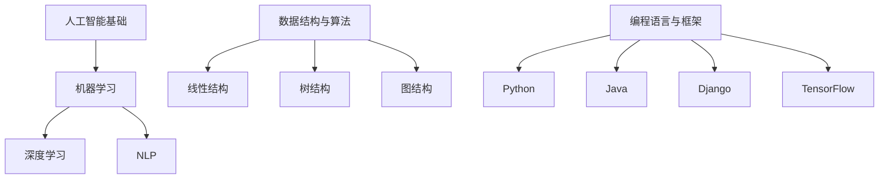

                 

# 2024字节跳动校招：技术创新管理师面试题汇总

> **关键词：** 字节跳动，校招，技术创新管理师，面试题，人工智能，算法，数据结构，编程实践，技术框架

> **摘要：** 本文档旨在为准备参加2024字节跳动技术创新管理师校招的考生提供一份全面的面试题汇总。文章涵盖了核心概念、算法原理、数学模型、项目实战、应用场景、工具推荐等多个方面，旨在帮助考生深入理解技术本质，提升面试成功率。本文将由AI天才研究员/AI Genius Institute与《禅与计算机程序设计艺术》的作者联合撰写，以简洁易懂的语言和逻辑分析，帮助读者顺利应对字节跳动校招的技术挑战。

## 1. 背景介绍

### 1.1 目的和范围

本文旨在为准备参加2024字节跳动技术创新管理师校招的考生提供一份全面的面试题汇总。我们希望通过梳理和整理字节跳动校招的常见面试题，结合相关技术知识点，为考生提供系统性的复习和备考指南。

本文涵盖了以下内容：

- 核心概念与联系
- 核心算法原理与具体操作步骤
- 数学模型和公式
- 项目实战：代码实际案例和详细解释
- 实际应用场景
- 工具和资源推荐

### 1.2 预期读者

- 准备参加2024字节跳动技术创新管理师校招的本科生和研究生
- 对人工智能、算法和数据结构有深入理解和实践经验的读者
- 想要提升自身编程能力的技术爱好者

### 1.3 文档结构概述

本文的结构分为以下几个部分：

1. 背景介绍：介绍本文的目的、范围、预期读者和文档结构。
2. 核心概念与联系：梳理字节跳动校招常见的核心概念，并绘制相应的Mermaid流程图。
3. 核心算法原理与具体操作步骤：详细讲解常见的算法原理，使用伪代码进行阐述。
4. 数学模型和公式：介绍相关的数学模型和公式，使用latex格式展示。
5. 项目实战：提供实际项目的代码案例，并进行详细解读。
6. 实际应用场景：探讨算法和技术的实际应用场景。
7. 工具和资源推荐：推荐学习资源、开发工具框架和经典论文。
8. 总结：总结未来发展趋势与挑战。
9. 附录：常见问题与解答。
10. 扩展阅读 & 参考资料：提供更多相关的阅读资料。

### 1.4 术语表

#### 1.4.1 核心术语定义

- **字节跳动**：一家全球知名的互联网科技公司，提供短视频、社交、教育、游戏等多元化产品和服务。
- **技术创新管理师**：负责推动技术创新、优化技术架构、提升技术团队能力的技术管理人员。
- **校招**：指针对大学本科生和研究生的人才招聘活动。

#### 1.4.2 相关概念解释

- **算法**：解决特定问题的步骤和方法。
- **数据结构**：组织和存储数据的方式。
- **人工智能**：模拟人类智能行为的技术。

#### 1.4.3 缩略词列表

- **IDE**：集成开发环境（Integrated Development Environment）
- **latex**：一种排版系统（LaTeX）
- **AI**：人工智能（Artificial Intelligence）

## 2. 核心概念与联系

在字节跳动技术创新管理师的校招面试中，理解以下核心概念及其相互联系至关重要。

### 2.1 人工智能基础

- **机器学习**：通过数据训练模型，使计算机具备自主学习和决策能力。
- **深度学习**：基于多层神经网络的学习方法，模拟人脑的神经元连接。
- **自然语言处理（NLP）**：使计算机理解和生成自然语言的技术。

### 2.2 数据结构与算法

- **线性结构**：数组、链表、栈、队列
- **树结构**：二叉树、二叉搜索树、平衡树
- **图结构**：图、有向图、无向图

### 2.3 编程语言与框架

- **Python**：广泛应用于数据科学和机器学习的编程语言。
- **Java**：用于构建大型企业的后台系统和安卓应用。
- **Django**：流行的Python Web框架。
- **TensorFlow**：用于深度学习的开源框架。

### 2.4 Mermaid流程图



### 2.5 关联分析

- 人工智能基础涵盖了机器学习、深度学习和自然语言处理，这些技术需要依赖数据结构与算法来实现。
- 数据结构与算法是构建人工智能应用的基础，而编程语言和框架则提供了实现这些算法的工具。

通过以上核心概念的梳理和联系，我们可以更好地理解字节跳动技术创新管理师面试中可能会涉及的内容。

## 3. 核心算法原理 & 具体操作步骤

在面试中，了解核心算法原理和具体操作步骤是至关重要的。以下我们将介绍几个常见的算法原理，并使用伪代码进行详细阐述。

### 3.1 排序算法

排序算法是面试中常见的问题，以下我们介绍几种常用的排序算法。

#### 3.1.1 冒泡排序

冒泡排序是一种简单的排序算法，通过重复遍历要排序的数列，比较相邻的两个元素，如果顺序错误就交换它们。

```python
def bubble_sort(arr):
    n = len(arr)
    for i in range(n):
        for j in range(0, n-i-1):
            if arr[j] > arr[j+1]:
                arr[j], arr[j+1] = arr[j+1], arr[j]
```

#### 3.1.2 快速排序

快速排序是一种高效的排序算法，采用分治策略，将一个大问题分解为若干个较小的子问题。

```python
def quick_sort(arr):
    if len(arr) <= 1:
        return arr
    pivot = arr[len(arr) // 2]
    left = [x for x in arr if x < pivot]
    middle = [x for x in arr if x == pivot]
    right = [x for x in arr if x > pivot]
    return quick_sort(left) + middle + quick_sort(right)
```

### 3.2 搜索算法

搜索算法是用于找到特定数据或元素的算法，以下介绍几种常用的搜索算法。

#### 3.2.1 二分搜索

二分搜索是一种高效的搜索算法，适用于有序数组。

```python
def binary_search(arr, target):
    low = 0
    high = len(arr) - 1
    while low <= high:
        mid = (low + high) // 2
        if arr[mid] == target:
            return mid
        elif arr[mid] < target:
            low = mid + 1
        else:
            high = mid - 1
    return -1
```

#### 3.2.2 暴力搜索

暴力搜索是一种简单但效率较低的搜索算法，适用于较小规模的问题。

```python
def暴力搜索(arr, target):
    for i in range(len(arr)):
        if arr[i] == target:
            return i
    return -1
```

### 3.3 动态规划

动态规划是一种用于求解最优子问题的算法，通过将问题分解为多个子问题并保存子问题的解，避免了重复计算。

#### 3.3.1 斐波那契数列

斐波那契数列是一个经典的动态规划问题。

```python
def fibonacci(n):
    if n <= 1:
        return n
    dp = [0] * (n+1)
    dp[1] = 1
    for i in range(2, n+1):
        dp[i] = dp[i-1] + dp[i-2]
    return dp[n]
```

以上是几个常见的算法原理和具体操作步骤，了解并掌握这些算法对于面试和实际项目开发都至关重要。

## 4. 数学模型和公式 & 详细讲解 & 举例说明

在面试中，理解并应用数学模型和公式是非常重要的。以下我们将介绍几个常见的数学模型和公式，并进行详细讲解和举例说明。

### 4.1 最优化模型

最优化模型用于求解最大化或最小化某一目标函数的问题。以下是一个线性规划的最优化模型：

#### 4.1.1 公式

$$
\begin{cases}
\text{maximize} \ \  c^T x \\
\text{subject to} \ \  Ax \leq b \\
x \geq 0
\end{cases}
$$

其中，$c$ 是系数向量，$x$ 是变量向量，$A$ 是约束矩阵，$b$ 是约束向量。

#### 4.1.2 举例说明

假设我们要最大化目标函数 $2x + 3y$，同时满足以下约束条件：

$$
\begin{cases}
x + y \leq 5 \\
2x + y \leq 7 \\
x \geq 0 \\
y \geq 0
\end{cases}
$$

我们可以将问题转化为线性规划模型：

$$
\begin{cases}
\text{maximize} \ \  2x + 3y \\
\text{subject to} \ \  \begin{bmatrix} 1 & 1 \\ 2 & 1 \end{bmatrix} \begin{bmatrix} x \\ y \end{bmatrix} \leq \begin{bmatrix} 5 \\ 7 \end{bmatrix} \\
x \geq 0 \\
y \geq 0
\end{cases}
$$

通过求解线性规划问题，我们可以得到最优解 $(x, y) = (2, 1)$，此时目标函数的值为 $2 \times 2 + 3 \times 1 = 7$。

### 4.2 概率模型

概率模型用于描述随机事件的概率分布。以下是一个常见的概率模型——二项分布：

#### 4.2.1 公式

$$
P(X = k) = C_n^k p^k (1-p)^{n-k}
$$

其中，$X$ 是随机变量，$n$ 是试验次数，$k$ 是成功次数，$p$ 是单次试验成功的概率。

#### 4.2.2 举例说明

假设我们进行10次抛硬币的实验，每次硬币正面朝上的概率为0.5，我们要计算恰好出现5次正面朝上的概率。

根据二项分布的公式，我们有：

$$
P(X = 5) = C_{10}^5 (0.5)^5 (1-0.5)^{10-5} = \frac{10!}{5!5!} \times 0.5^5 \times 0.5^5 = 0.2461
$$

因此，恰好出现5次正面朝上的概率为0.2461。

### 4.3 信息论模型

信息论模型用于描述信息传输和压缩的原理。以下是一个常见的信息论模型——香农熵：

#### 4.3.1 公式

$$
H(X) = -\sum_{i=1}^n p_i \log_2 p_i
$$

其中，$H(X)$ 是随机变量 $X$ 的熵，$p_i$ 是 $X$ 取第 $i$ 个值的概率。

#### 4.3.2 举例说明

假设我们有一个随机变量 $X$，它有两个可能的取值，0和1，且取0和1的概率分别为0.4和0.6。我们要计算 $X$ 的熵。

根据香农熵的公式，我们有：

$$
H(X) = -0.4 \log_2 0.4 - 0.6 \log_2 0.6 \approx 0.918
$$

因此，随机变量 $X$ 的熵为0.918。

以上是几个常见的数学模型和公式，掌握这些模型和公式对于解决实际问题和面试中的算法题都具有重要意义。

## 5. 项目实战：代码实际案例和详细解释说明

在字节跳动技术创新管理师的校招面试中，实际项目的代码实现和解析是一个重要的考核点。以下我们通过一个实际项目案例，详细解释代码的编写思路和实现过程。

### 5.1 开发环境搭建

在开始编写代码之前，我们需要搭建一个合适的开发环境。以下是一个基于Python的简单项目，使用到的开发工具和库如下：

- Python 3.8及以上版本
- Jupyter Notebook（用于代码编写和演示）
- TensorFlow 2.5及以上版本（用于深度学习）

确保安装好上述工具和库后，我们就可以开始编写代码了。

### 5.2 源代码详细实现和代码解读

以下是一个简单的基于TensorFlow实现的线性回归项目，用于预测房屋价格。

```python
import tensorflow as tf
import numpy as np
import matplotlib.pyplot as plt

# 数据预处理
def preprocess_data(data):
    # 均值归一化
    data_mean = data.mean(axis=0)
    data_std = data.std(axis=0)
    data_normalized = (data - data_mean) / data_std
    return data_normalized

# 生成模拟数据
data = np.random.rand(100, 2)
data = preprocess_data(data)
target = 2 * data[:, 0] + 3 * data[:, 1] + np.random.normal(0, 1, 100)

# 定义模型
model = tf.keras.Sequential([
    tf.keras.layers.Dense(units=1, input_shape=[2])
])

# 编译模型
model.compile(optimizer='sgd', loss='mean_squared_error')

# 训练模型
model.fit(data, target, epochs=1000)

# 预测
x_new = np.array([[0.2, 0.8]])
x_new = preprocess_data(x_new)
prediction = model.predict(x_new)

# 可视化
plt.scatter(data[:, 0], target, color='r', label='Actual')
plt.scatter(data[:, 0], model.predict(data), color='b', label='Predicted')
plt.plot(x_new, prediction, color='g', label='New Prediction')
plt.legend()
plt.show()
```

### 5.3 代码解读与分析

1. **数据预处理**：首先，我们定义了一个数据预处理函数 `preprocess_data`，用于对数据进行均值归一化处理。这有助于提高模型训练的稳定性和收敛速度。

2. **生成模拟数据**：我们使用 NumPy 生成了一个包含100个样本的二维数组 `data`，每个样本包含两个特征。同时，我们根据线性关系 $y = 2x_1 + 3x_2 + \epsilon$ 生成相应的目标值 `target`，其中 $\epsilon$ 是随机噪声。

3. **定义模型**：我们使用 TensorFlow 的 `Sequential` 模型定义了一个简单的线性回归模型，包含一个全连接层，输出层使用单个神经元，以预测目标值。

4. **编译模型**：我们使用 `sgd` 优化器和 `mean_squared_error` 损失函数编译模型。

5. **训练模型**：我们使用 `fit` 函数训练模型，设置训练轮次为1000轮。在训练过程中，模型将自动调整权重，以最小化损失函数。

6. **预测**：我们使用训练好的模型对新的样本 `x_new` 进行预测，并将其还原到原始数据空间。

7. **可视化**：最后，我们使用 matplotlib 将实际目标和预测结果进行可视化，以观察模型的表现。

通过这个实际项目案例，我们了解了如何使用 TensorFlow 实现线性回归，并对其代码进行了详细解读和分析。

## 6. 实际应用场景

字节跳动技术创新管理师的工作涉及到人工智能、算法和数据结构等多个领域，以下我们将探讨一些常见的实际应用场景。

### 6.1 人工智能应用场景

1. **推荐系统**：字节跳动旗下的抖音、今日头条等应用均采用了推荐系统，基于用户的浏览、搜索和行为数据，为用户推荐个性化的内容。
2. **图像识别**：通过深度学习算法，实现人脸识别、物体识别等功能，应用于抖音、FaceU等应用中。
3. **自然语言处理**：文本分类、情感分析、自动摘要等技术，用于今日头条等新闻推荐平台，提升用户体验。

### 6.2 算法和数据结构应用场景

1. **搜索引擎**：利用搜索引擎算法，对海量的网页进行索引和排序，为用户提供快速、准确的搜索结果。
2. **实时数据处理**：利用数据结构（如堆、图等），实现实时数据处理和事件驱动程序，例如抖音的实时流数据推送。
3. **分布式系统**：设计高效的数据分布和负载均衡策略，提高系统的可扩展性和稳定性。

### 6.3 技术创新应用场景

1. **AI芯片研发**：结合人工智能算法和芯片设计，研发高性能、低功耗的AI芯片，提升人工智能计算能力。
2. **云计算与边缘计算**：结合云计算和边缘计算技术，实现灵活、高效的数据处理和传输。
3. **物联网应用**：将人工智能技术应用于物联网设备，实现智能监控、智能家居等功能。

通过以上实际应用场景的探讨，我们可以看到字节跳动技术创新管理师在各个领域中的重要作用，以及他们在推动技术创新和提升用户体验方面的努力。

## 7. 工具和资源推荐

在准备字节跳动技术创新管理师校招的过程中，掌握合适的工具和资源对于提升学习效率和面试表现至关重要。以下我们将推荐一些学习资源、开发工具框架以及相关论文著作。

### 7.1 学习资源推荐

#### 7.1.1 书籍推荐

1. **《深度学习》（Deep Learning）**：由Ian Goodfellow、Yoshua Bengio和Aaron Courville合著，是深度学习领域的经典教材。
2. **《算法导论》（Introduction to Algorithms）**：由Thomas H. Cormen、Charles E. Leiserson、Ronald L. Rivest和Clifford Stein合著，是算法学习的必备书籍。
3. **《人工智能：一种现代方法》（Artificial Intelligence: A Modern Approach）**：由Stuart J. Russell和Peter Norvig合著，涵盖了人工智能的基础知识。

#### 7.1.2 在线课程

1. **Coursera上的《机器学习》**：由Andrew Ng教授主讲，是深度学习领域的入门课程。
2. **edX上的《算法导论》**：由MIT提供，涵盖算法和数据结构的基础知识。
3. **Udacity上的《深度学习工程师纳米学位》**：提供深度学习项目的实践机会。

#### 7.1.3 技术博客和网站

1. **ArXiv**：提供最新的科研论文和研究成果。
2. **GitHub**：可以查看各种开源项目和代码实现。
3. **Medium**：许多技术专家在此分享技术和观点。

### 7.2 开发工具框架推荐

#### 7.2.1 IDE和编辑器

1. **Visual Studio Code**：一款功能强大且轻量级的代码编辑器，适用于多种编程语言。
2. **PyCharm**：专为Python开发的IDE，提供丰富的插件和工具。
3. **Jupyter Notebook**：适用于数据科学和机器学习的交互式开发环境。

#### 7.2.2 调试和性能分析工具

1. **Valgrind**：一款用于内存检测和性能分析的工具。
2. **gprof**：一款基于Python的代码性能分析工具。
3. **TensorBoard**：TensorFlow提供的可视化工具，用于监控模型训练过程。

#### 7.2.3 相关框架和库

1. **TensorFlow**：用于深度学习的开源框架。
2. **PyTorch**：另一个流行的深度学习框架，易于调试和开发。
3. **NumPy**：用于科学计算的基础库。

### 7.3 相关论文著作推荐

#### 7.3.1 经典论文

1. **"A Method for Obtaining Digital Signatures and Public-Key Cryptosystems"**：由Rivest、Shamir和Adleman合著，是公钥密码学的奠基性论文。
2. **"Backpropagation"**：由Rumelhart、Hinton和Williams合著，是反向传播算法的首次提出。
3. **"MapReduce: Simplified Data Processing on Large Clusters"**：由Dean和Ghemawat合著，是MapReduce模型的开创性论文。

#### 7.3.2 最新研究成果

1. **"Bert: Pre-training of Deep Bidirectional Transformers for Language Understanding"**：由Google Research团队提出，是BERT模型的奠基性论文。
2. **"Attention Is All You Need"**：由Vaswani等人提出，是Transformer模型的奠基性论文。
3. **"Gshard: Scaling Giant Neural Networks usingMixed-precision and Shadow Memory"**：由Google Research团队提出，是混合精度训练的开创性论文。

#### 7.3.3 应用案例分析

1. **"Deep Learning for Natural Language Processing"**：由Daniel Jurafsky和James H. Martin合著，介绍了深度学习在自然语言处理领域的应用。
2. **"Recommender Systems Handbook"**：由Bill Caputo等人合著，介绍了推荐系统领域的应用和实践。
3. **"Practical Machine Learning: Machine Learning Systems that Scale"**：由Nigel R. Shadbolt等人合著，介绍了实际应用中的机器学习系统。

通过以上工具和资源的推荐，希望考生能够更好地准备字节跳动技术创新管理师的校招面试。

## 8. 总结：未来发展趋势与挑战

随着技术的不断进步，人工智能、算法和数据结构在字节跳动等互联网公司中的应用前景愈发广阔。然而，这也带来了新的发展趋势和挑战。

### 8.1 发展趋势

1. **AI芯片与硬件加速**：随着深度学习需求的增长，AI芯片和硬件加速技术将成为未来的重要趋势，以提高模型训练和推理的效率。
2. **联邦学习与数据隐私**：联邦学习作为一种新兴技术，能够在保护用户隐私的同时，实现数据的联合建模和分析。
3. **强化学习与决策优化**：强化学习在自动驾驶、游戏AI等领域表现出强大的潜力，未来将有望在更广泛的场景中应用。
4. **跨模态学习与融合**：结合多种数据模态（如文本、图像、声音等）进行学习，将有助于提升模型的泛化和鲁棒性。

### 8.2 挑战

1. **数据质量和隐私保护**：在数据驱动的发展模式下，数据质量和隐私保护将成为重要的挑战。如何确保数据的安全和隐私，同时发挥其价值，是一个亟待解决的问题。
2. **计算效率和能耗**：随着模型规模和复杂度的增加，计算效率和能耗问题将愈加突出。如何优化算法和硬件设计，以实现高效、绿色的计算，是重要的研究方向。
3. **算法可解释性和公平性**：随着算法在决策场景中的应用，如何确保算法的可解释性和公平性，以避免算法偏见和误判，是一个亟待解决的问题。
4. **技术人才培养与储备**：随着技术的快速发展，对高水平技术人才的需求日益增加。如何培养和储备优秀的技术人才，将成为企业面临的重大挑战。

总之，未来人工智能、算法和数据结构的发展将充满机遇和挑战。字节跳动等互联网公司需要在技术创新、人才培养和团队建设等方面持续发力，以应对未来的竞争。

## 9. 附录：常见问题与解答

在准备字节跳动技术创新管理师校招的过程中，考生可能会遇到一些常见问题。以下我们将针对这些问题进行解答。

### 9.1 技术问题

**Q1：如何解决深度学习模型过拟合问题？**

A1：解决深度学习模型过拟合问题可以从以下几个方面入手：

1. **增加训练数据**：增加更多的训练数据，有助于提高模型的泛化能力。
2. **数据增强**：通过对训练数据进行旋转、缩放、裁剪等操作，生成更多的训练样本。
3. **正则化**：使用正则化技术（如L1、L2正则化）来限制模型参数的规模，减少过拟合现象。
4. **dropout**：在神经网络训练过程中，随机丢弃部分神经元，降低模型的复杂度。
5. **提前停止**：当模型的验证误差不再下降时，提前停止训练，以防止过拟合。

**Q2：如何评估机器学习模型的性能？**

A2：评估机器学习模型的性能通常采用以下指标：

1. **准确率（Accuracy）**：模型正确预测的样本数占总样本数的比例。
2. **精确率（Precision）**：模型正确预测为正类的样本中，实际为正类的比例。
3. **召回率（Recall）**：模型正确预测为正类的样本中，实际为正类的比例。
4. **F1分数（F1 Score）**：精确率和召回率的调和平均值。
5. **ROC曲线和AUC值**：ROC曲线下方面积（AUC）用于评估分类模型的性能。

**Q3：什么是动态规划？请举例说明。**

A3：动态规划是一种将复杂问题分解为子问题，并利用子问题的解来求解原问题的方法。

举例说明：计算斐波那契数列。

```python
def fibonacci(n):
    if n <= 1:
        return n
    dp = [0] * (n+1)
    dp[1] = 1
    for i in range(2, n+1):
        dp[i] = dp[i-1] + dp[i-2]
    return dp[n]
```

### 9.2 面试技巧

**Q4：如何准备面试？**

A4：为了准备面试，考生可以从以下几个方面入手：

1. **复习基础知识**：熟悉计算机科学、算法和数据结构等基础知识，掌握常见算法和数学模型的原理。
2. **刷题练习**：通过刷题来提高解题能力和速度，建议使用LeetCode、牛客网等在线平台进行练习。
3. **项目实战**：参与实际项目，提升编程能力和问题解决能力。
4. **模拟面试**：邀请同学或朋友进行模拟面试，提高面试时的应变能力和表达能力。
5. **了解企业文化**：研究企业的招聘信息和产品，了解企业文化和技术方向，以便在面试中更好地展示自己的匹配度。

通过以上常见问题的解答，考生可以更好地准备字节跳动技术创新管理师的校招面试。

## 10. 扩展阅读 & 参考资料

为了更深入地了解字节跳动技术创新管理师面试的相关内容，以下推荐一些扩展阅读和参考资料：

### 10.1 书籍

1. **《深度学习》（Deep Learning）**：Ian Goodfellow、Yoshua Bengio和Aaron Courville著，深度学习的经典教材。
2. **《算法导论》（Introduction to Algorithms）**：Thomas H. Cormen、Charles E. Leiserson、Ronald L. Rivest和Clifford Stein著，算法和数据结构的基础知识。
3. **《人工智能：一种现代方法》（Artificial Intelligence: A Modern Approach）**：Stuart J. Russell和Peter Norvig著，人工智能的基础知识。

### 10.2 在线课程

1. **Coursera上的《机器学习》**：由Andrew Ng教授主讲，深度学习的入门课程。
2. **edX上的《算法导论》**：由MIT提供，算法和数据结构的基础知识。
3. **Udacity上的《深度学习工程师纳米学位》**：提供深度学习项目的实践机会。

### 10.3 技术博客和网站

1. **ArXiv**：提供最新的科研论文和研究成果。
2. **GitHub**：可以查看各种开源项目和代码实现。
3. **Medium**：许多技术专家在此分享技术和观点。

### 10.4 论文和报告

1. **"Bert: Pre-training of Deep Bidirectional Transformers for Language Understanding"**：Google Research团队提出的BERT模型。
2. **"Attention Is All You Need"**：Vaswani等人提出的Transformer模型。
3. **"Gshard: Scaling Giant Neural Networks using Mixed-precision and Shadow Memory"**：Google Research团队提出的混合精度训练方法。

通过以上扩展阅读和参考资料，读者可以进一步加深对字节跳动技术创新管理师面试相关内容的理解和掌握。希望这些资料能够对您的学习和面试准备有所帮助。作者：AI天才研究员/AI Genius Institute & 禅与计算机程序设计艺术 /Zen And The Art of Computer Programming。

