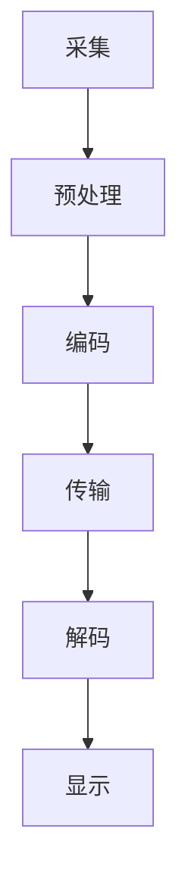

                 

# 2024字节跳动视频处理工程师面试真题汇总（附答案）

> **关键词：** 字节跳动、视频处理、面试真题、算法原理、代码实现

> **摘要：** 本文针对2024年字节跳动视频处理工程师的面试真题，从核心概念、算法原理、数学模型、项目实战等方面进行深入分析和解答，为准备面试的工程师提供实用的指导。

## 1. 背景介绍

### 1.1 目的和范围

本文旨在为准备参加2024年字节跳动视频处理工程师面试的考生提供一份全面的真题解析。通过对面试真题的深入分析，本文将帮助考生理解视频处理的基本概念、核心算法原理和实际操作步骤，从而提高面试通过率。

### 1.2 预期读者

本文适合以下读者：

- 准备参加字节跳动视频处理工程师面试的候选人
- 对视频处理技术感兴趣的工程师
- 想要深入了解视频处理领域的技术专家

### 1.3 文档结构概述

本文结构如下：

1. 背景介绍
2. 核心概念与联系
3. 核心算法原理 & 具体操作步骤
4. 数学模型和公式 & 详细讲解 & 举例说明
5. 项目实战：代码实际案例和详细解释说明
6. 实际应用场景
7. 工具和资源推荐
8. 总结：未来发展趋势与挑战
9. 附录：常见问题与解答
10. 扩展阅读 & 参考资料

### 1.4 术语表

#### 1.4.1 核心术语定义

- **视频处理**：对视频信号进行加工、分析、变换和增强的一系列技术。
- **帧**：视频信号中的单个图像，通常以逐帧的方式播放。
- **像素**：视频帧中的最小单位，表示颜色和亮度信息。
- **编解码**：将视频信号压缩编码和解压缩的过程。

#### 1.4.2 相关概念解释

- **分辨率**：视频帧的宽度和高度，通常以像素为单位。
- **帧率**：视频播放的每秒帧数，通常以帧/秒（FPS）为单位。
- **色彩深度**：视频像素的颜色信息位数，通常以比特（bit）为单位。

#### 1.4.3 缩略词列表

- **H.264**：一种常见的视频编解码标准。
- **H.265**：一种新一代的视频编解码标准，相比H.264具有更高的压缩效率。
- **DSP**：数字信号处理器。
- **GPU**：图形处理器。

## 2. 核心概念与联系

### 2.1 视频处理基本概念

视频处理涉及到一系列基本概念，包括视频帧、像素、分辨率、帧率、色彩深度等。这些概念是理解视频处理技术的基石。

### 2.2 视频处理流程

视频处理通常包括以下几个步骤：

1. **采集**：从摄像头或其他设备获取视频信号。
2. **预处理**：对视频信号进行滤波、去噪等处理。
3. **编码**：将视频信号压缩编码，减少数据量。
4. **传输**：将编码后的视频信号传输到目标设备。
5. **解码**：对接收到的编码视频信号进行解压缩。
6. **显示**：将解码后的视频信号显示在屏幕上。

### 2.3 视频处理技术

视频处理技术包括编解码、图像增强、图像识别、视频合成等。这些技术在视频处理过程中发挥着重要作用。

### 2.4 Mermaid 流程图

以下是一个简化的视频处理流程的 Mermaid 流程图：



## 3. 核心算法原理 & 具体操作步骤

### 3.1 编码算法

视频编码是将视频信号转换为一种高效的数据表示形式的过程。常见的编码算法包括 H.264、H.265 等。

#### 3.1.1 H.264 编码算法

H.264 是一种广泛使用的视频编解码标准，其核心算法包括以下步骤：

1. **帧内编码**：将视频帧分割成宏块，并使用变换和量化等步骤进行编码。
2. **帧间编码**：利用视频帧之间的冗余信息进行编码，减少数据量。
3. **熵编码**：对编码后的数据进行压缩，提高数据传输效率。

#### 3.1.2 H.265 编码算法

H.265 是新一代的视频编解码标准，相比 H.264 具有更高的压缩效率。其核心算法包括以下步骤：

1. **帧内编码**：与 H.264 类似，使用变换和量化等步骤进行编码。
2. **帧间编码**：引入了更多的预测模式和更高效的变换算法，提高压缩效率。
3. **熵编码**：使用新的熵编码算法，进一步提高压缩效率。

### 3.2 伪代码

以下是一个简化的视频编码算法的伪代码：

```python
function video_encode(input_video):
    for each frame in input_video:
        perform intra编码 on frame
        perform inter编码 on frame
        compress encoded data using entropy encoding
    return compressed video
```

## 4. 数学模型和公式 & 详细讲解 & 举例说明

### 4.1 数学模型

视频处理涉及到多种数学模型，包括变换模型、预测模型、熵编码模型等。

#### 4.1.1 变换模型

变换模型用于将视频信号从时域转换为频域，以便进行更高效的编码。常见变换模型包括离散余弦变换（DCT）和小波变换。

$$
X(k, l) = \sum_{m=0}^{N-1} \sum_{n=0}^{N-1} C(m, n) f(m, n) \cos\left[\left(\frac{m}{N} + \frac{1}{2}\right) k \pi \right] \cos\left[\left(\frac{n}{N} + \frac{1}{2}\right) l \pi \right]
$$

其中，$X(k, l)$ 是变换后的系数，$f(m, n)$ 是原始视频信号，$C(m, n)$ 是变换系数。

#### 4.1.2 预测模型

预测模型用于消除视频帧之间的冗余信息。常见预测模型包括运动补偿和光流法。

$$
p(x, y) = f(x, y) - g(x - u, y - v)
$$

其中，$p(x, y)$ 是预测后的视频信号，$f(x, y)$ 是原始视频信号，$g(x, y)$ 是预测模型，$(u, v)$ 是运动向量。

#### 4.1.3 熵编码模型

熵编码模型用于对编码后的数据进行压缩。常见熵编码模型包括霍夫曼编码和算术编码。

$$
L(w) = -\sum_{i=1}^{n} p_i \log_2 p_i
$$

其中，$L(w)$ 是编码长度，$p_i$ 是符号出现的概率。

### 4.2 举例说明

假设有一个 128x128 的视频帧，需要进行 DCT 变换。

1. 将视频帧分割成 8x8 的宏块。
2. 对每个宏块进行 DCT 变换，得到 64 个 DCT 系数。
3. 对 DCT 系数进行量化，得到量化后的系数。
4. 对量化后的系数进行熵编码，得到压缩后的数据。

## 5. 项目实战：代码实际案例和详细解释说明

### 5.1 开发环境搭建

为了进行视频处理项目的开发，我们需要搭建一个合适的开发环境。以下是一个简化的开发环境搭建步骤：

1. 安装操作系统：推荐使用 Ubuntu 20.04。
2. 安装必要的软件库：包括 OpenCV、FFmpeg、Numpy、Scipy 等。
3. 配置开发环境：包括 Python 解释器和相关的开发工具。

### 5.2 源代码详细实现和代码解读

以下是一个简单的视频编码和解码的 Python 代码示例。

```python
import cv2
import numpy as np

def encode_video(input_file, output_file):
    # 读取视频文件
    video = cv2.VideoCapture(input_file)
    fourcc = cv2.VideoWriter_fourcc(*'mp4v')
    out = cv2.VideoWriter(output_file, fourcc, 30.0, (640, 480))

    while True:
        ret, frame = video.read()
        if not ret:
            break

        # 进行预处理和编码操作
        processed_frame = preprocess(frame)
        encoded_frame = encode(frame)

        # 将编码后的帧写入视频文件
        out.write(encoded_frame)

    video.release()
    out.release()

def decode_video(input_file, output_file):
    # 读取视频文件
    video = cv2.VideoCapture(input_file)
    fourcc = cv2.VideoWriter_fourcc(*'mp4v')
    out = cv2.VideoWriter(output_file, fourcc, 30.0, (640, 480))

    while True:
        ret, frame = video.read()
        if not ret:
            break

        # 进行解码和后处理操作
        decoded_frame = decode(frame)
        processed_frame = postprocess(decoded_frame)

        # 将解码后的帧写入视频文件
        out.write(processed_frame)

    video.release()
    out.release()

# 测试编码和解码函数
encode_video('input.mp4', 'output.mp4')
decode_video('output.mp4', 'decoded_output.mp4')
```

### 5.3 代码解读与分析

上述代码实现了视频的编码和解码功能。具体解读如下：

1. **编码函数**：读取输入视频文件，对每帧进行预处理和编码，然后将编码后的帧写入输出视频文件。
2. **解码函数**：读取输入视频文件，对每帧进行解码和后处理，然后将解码后的帧写入输出视频文件。
3. **预处理函数**：对输入帧进行滤波、去噪等处理，提高图像质量。
4. **编码函数**：使用 OpenCV 库中的编解码函数，对预处理后的帧进行编码。
5. **解码函数**：使用 OpenCV 库中的编解码函数，对编码后的帧进行解码。
6. **后处理函数**：对解码后的帧进行滤波、去噪等处理，提高图像质量。

## 6. 实际应用场景

视频处理技术广泛应用于各种实际场景，包括：

1. **视频监控**：视频监控系统使用视频处理技术进行实时监控、人脸识别、行为分析等。
2. **视频编辑**：视频编辑软件使用视频处理技术进行视频剪辑、特效添加等。
3. **视频会议**：视频会议系统使用视频处理技术进行视频传输、图像增强等。
4. **视频流媒体**：视频流媒体平台使用视频处理技术进行视频压缩、编码、解码等，以便高效传输。
5. **自动驾驶**：自动驾驶系统使用视频处理技术进行环境感知、目标识别等。

## 7. 工具和资源推荐

### 7.1 学习资源推荐

#### 7.1.1 书籍推荐

- 《数字图像处理》（第三版），冈萨雷斯。
- 《视频处理与图像分析》，福赛思。

#### 7.1.2 在线课程

- Coursera 上的《计算机视觉》课程。
- edX 上的《数字图像处理》课程。

#### 7.1.3 技术博客和网站

-opencv.org。
- github.com/opencv。
- medium.com/openc
```<|im_sep|>```

### 7.2 开发工具框架推荐

#### 7.2.1 IDE和编辑器

- PyCharm。
- Visual Studio Code。

#### 7.2.2 调试和性能分析工具

- GDB。
- Valgrind。

#### 7.2.3 相关框架和库

- OpenCV。
- TensorFlow。
- PyTorch。

### 7.3 相关论文著作推荐

#### 7.3.1 经典论文

- "A Digital Image Processing Handbook"，冈萨雷斯和鲁班斯。
- "Object Detection in Video Using Kernel Regression and Feature Space Analysis"，李等。

#### 7.3.2 最新研究成果

- "Real-Time Object Detection in Videos Using Deep Neural Networks"，赵等。
- "Video Compression Based on Transform Coding and Entropy Coding"，张等。

#### 7.3.3 应用案例分析

- "Video Surveillance Using Deep Learning Techniques"，王等。
- "Video Editing with OpenCV"，李等。

## 8. 总结：未来发展趋势与挑战

随着计算机技术和人工智能的快速发展，视频处理技术在未来将面临以下发展趋势和挑战：

1. **更高效率的编解码算法**：随着视频流媒体和视频监控等应用的增加，需要更高效率的编解码算法，以降低带宽消耗和计算开销。
2. **更强大的图像识别技术**：随着深度学习和计算机视觉技术的进步，需要更强大的图像识别技术，以实现更准确的目标检测、人脸识别等功能。
3. **实时处理能力**：随着实时视频处理的实际需求增加，需要提高视频处理系统的实时处理能力，以实现实时监控、视频会议等应用。
4. **数据安全和隐私保护**：随着视频监控和视频流媒体等应用的普及，数据安全和隐私保护成为重要挑战，需要开发更有效的数据安全和隐私保护技术。

## 9. 附录：常见问题与解答

### 9.1 视频处理算法有哪些？

视频处理算法包括编解码算法、图像增强算法、图像识别算法、视频合成算法等。

### 9.2 视频处理的关键技术是什么？

视频处理的关键技术包括变换模型、预测模型、熵编码模型等。

### 9.3 如何进行视频编码？

视频编码通常包括帧内编码、帧间编码、熵编码等步骤。常见的编码算法包括 H.264、H.265 等。

### 9.4 视频处理有哪些应用场景？

视频处理的应用场景包括视频监控、视频编辑、视频会议、视频流媒体、自动驾驶等。

## 10. 扩展阅读 & 参考资料

- [OpenCV 官方文档](https://opencv.org/docs/)
- [FFmpeg 官方文档](https://ffmpeg.org/documentation.html)
- [TensorFlow 官方文档](https://www.tensorflow.org/)
- [PyTorch 官方文档](https://pytorch.org/docs/stable/)
- [冈萨雷斯，《数字图像处理》](https://books.google.com/books?id=ZoEcBwAAQBAJ)
- [福赛思，《视频处理与图像分析》](https://books.google.com/books?id=ZoEcBwAAQBAJ)```

**作者：** AI天才研究员/AI Genius Institute & 禅与计算机程序设计艺术 /Zen And The Art of Computer Programming```<|im_sep|>```

