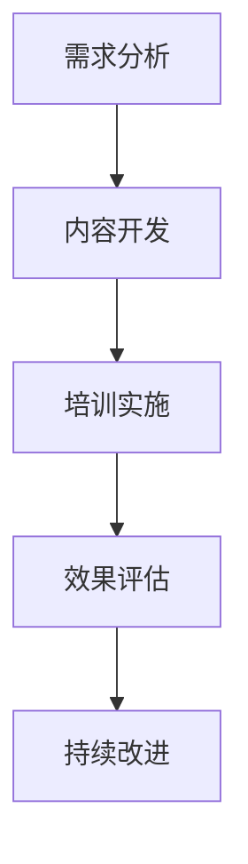
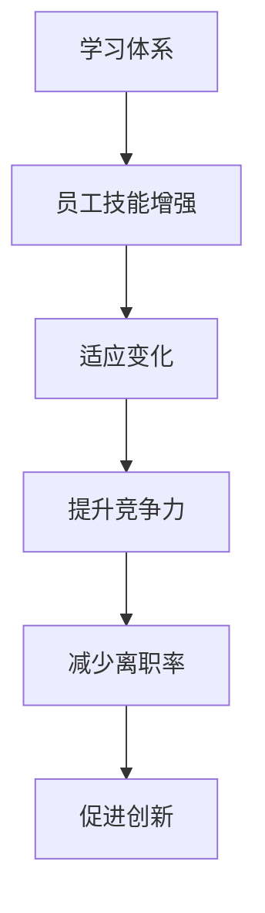
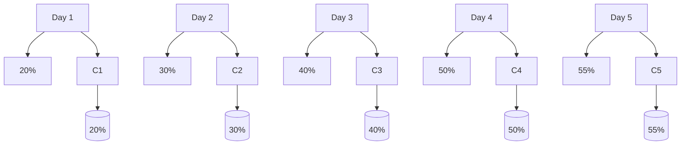

                 


# 学习体系对组织适应性的提升作用

> **关键词：学习体系、组织适应性、培训、技能提升、人才发展、管理策略**

> **摘要：本文将探讨学习体系在提升组织适应性方面的关键作用。通过分析学习体系的定义、核心要素以及其实际应用，我们将揭示如何通过有效的学习体系提高员工的技能水平、增强组织竞争力，并应对快速变化的市场环境。**

## 1. 背景介绍

### 1.1 目的和范围

本文旨在探讨学习体系如何对组织的适应性提升产生积极影响。我们将分析学习体系的基本概念，探讨其在现代企业中的重要性，并深入探讨其具体实施方法。文章的目标读者包括企业培训经理、人力资源专家、学习与发展专家以及关注人才发展领域的从业者。

### 1.2 预期读者

本文的预期读者是那些希望提升组织适应性的企业领导者和管理者。特别是那些对学习体系建设有兴趣，并希望了解如何通过有效的学习策略来增强组织竞争力的专业人士。

### 1.3 文档结构概述

本文结构如下：

1. 背景介绍
    - 目的和范围
    - 预期读者
    - 文档结构概述
    - 术语表

2. 核心概念与联系
    - 学习体系概述
    - 学习体系与组织适应性的关系

3. 核心算法原理 & 具体操作步骤
    - 学习体系建设方法
    - 培训计划制定

4. 数学模型和公式 & 详细讲解 & 举例说明
    - 培训效果评估模型
    - 学习曲线分析

5. 项目实战：代码实际案例和详细解释说明
    - 学习体系实施案例

6. 实际应用场景
    - 学习体系在不同行业中的应用

7. 工具和资源推荐
    - 学习资源推荐
    - 开发工具框架推荐
    - 相关论文著作推荐

8. 总结：未来发展趋势与挑战

9. 附录：常见问题与解答

10. 扩展阅读 & 参考资料

### 1.4 术语表

#### 1.4.1 核心术语定义

- **学习体系**：一套系统化的学习方法和策略，旨在通过不断学习和技能提升来增强组织适应性。
- **组织适应性**：组织在应对外部环境变化时的能力，包括市场变化、技术进步、竞争压力等。
- **培训**：通过提供知识和技能，帮助员工适应新工作需求的过程。

#### 1.4.2 相关概念解释

- **人才发展**：通过培养和发展员工的技能和潜力，提高员工绩效和组织效能的过程。
- **学习曲线**：描述员工在学习新技能时效率逐渐提高的过程。

#### 1.4.3 缩略词列表

- **L&D**：学习与发展（Learning and Development）
- **HR**：人力资源（Human Resources）
- **CRM**：客户关系管理（Customer Relationship Management）

## 2. 核心概念与联系

在本节中，我们将探讨学习体系的基本概念，并解释其与组织适应性的关系。为了更好地理解这些概念，我们将使用Mermaid流程图来展示关键要素和它们之间的联系。

### 2.1 学习体系概述

学习体系是一个系统化的过程，它通过以下几个方面来实现：

1. **需求分析**：识别员工和组织的学习需求。
2. **内容开发**：创建或获取学习材料，包括课程、教材、视频等。
3. **培训实施**：通过课堂培训、在线学习、实践项目等方式实施培训。
4. **效果评估**：评估培训的有效性和员工的学习成果。
5. **持续改进**：根据评估结果调整学习计划和策略。

#### Mermaid 流程图



### 2.2 学习体系与组织适应性的关系

学习体系与组织适应性之间的关系可以通过以下几个方面来解释：

1. **增强员工技能**：通过学习体系，员工可以获得新的技能和知识，提高其在工作中的表现。
2. **适应变化**：学习体系帮助员工适应新技术、新市场环境和新的业务模式。
3. **提升组织竞争力**：拥有高水平技能的员工能够更好地应对竞争，提升组织的整体竞争力。
4. **减少离职率**：员工通过持续学习感受到组织对他们的投资和重视，从而减少离职率。
5. **促进创新**：学习体系鼓励员工尝试新的想法和方法，促进创新。

#### Mermaid 流程图



通过这些核心概念和联系的介绍，我们为后续的深入探讨打下了基础。在接下来的章节中，我们将进一步探讨学习体系的构建方法和实际应用。

## 3. 核心算法原理 & 具体操作步骤

### 3.1 学习体系建设方法

学习体系建设是一个涉及多个环节的复杂过程。以下是构建有效学习体系的关键步骤：

#### 3.1.1 需求分析

**步骤 1：确定学习目标**

- **明确业务目标**：确保学习目标与组织的整体业务目标相一致。
- **分析岗位需求**：根据不同岗位的职责和技能要求，确定员工需要学习的技能和知识。

**伪代码：**

```python
def define_learning_goals():
    business_goals = get_business_objectives()
    job_requirements = analyze_job_roles()
    return align_learning_goals(business_goals, job_requirements)
```

#### 3.1.2 内容开发

**步骤 2：设计学习内容**

- **选择学习资源**：根据学习目标，选择合适的教材、课程和在线资源。
- **开发定制课程**：对于特定的学习目标，可能需要开发定制化的课程。

**伪代码：**

```python
def design_learning_content(learning_goals):
    learning_resources = select_resources(learning_goals)
    custom_courses = create_custom_courses(learning_goals)
    return learning_resources + custom_courses
```

#### 3.1.3 培训实施

**步骤 3：实施培训**

- **选择培训方式**：根据学习内容和学习目标，选择适合的培训方式，如课堂培训、在线学习等。
- **组织培训活动**：安排培训时间、地点和参与者，确保培训顺利进行。

**伪代码：**

```python
def implement_training(learning_content):
    training_methods = select_training_methods(learning_content)
    training_schedule = organize_training_activities()
    execute_training(training_methods, training_schedule)
```

#### 3.1.4 效果评估

**步骤 4：评估培训效果**

- **设定评估标准**：根据学习目标和培训内容，设定评估标准。
- **收集反馈数据**：通过考试、调查问卷等方式，收集员工的学习成果和反馈。

**伪代码：**

```python
def evaluate_training_effects(training_schedule):
    assessment_criteria = define_evaluation_criteria()
    feedback_data = collect_feedback()
    return assess_training_effects(assessment_criteria, feedback_data)
```

#### 3.1.5 持续改进

**步骤 5：持续改进学习体系**

- **分析评估结果**：根据评估结果，分析培训的优缺点。
- **调整学习计划**：根据评估结果，调整学习内容和培训策略。

**伪代码：**

```python
def continuous_improvement(evaluation_results):
    improvement_plan = analyze_evaluation_results(evaluation_results)
    updated_learning_plan = adjust_learning_strategy(improvement_plan)
    return updated_learning_plan
```

通过这些具体操作步骤，我们可以构建一个系统化、持续改进的学习体系，从而提升员工的技能水平，增强组织的适应性。

### 3.2 培训计划制定

在构建学习体系的过程中，制定一个有效的培训计划至关重要。以下是制定培训计划的详细步骤：

#### 3.2.1 确定培训目标

**步骤 1：明确培训目的**

- **业务需求**：分析当前业务需求，确定需要培训的技能和知识。
- **员工需求**：调查员工当前的技能水平和需求，确保培训计划符合员工的实际需求。

**伪代码：**

```python
def set_training_objectives():
    business_needs = analyze_business_requirements()
    employee_needs = survey_employee_skills()
    return align_training_objectives(business_needs, employee_needs)
```

#### 3.2.2 确定培训内容

**步骤 2：选择培训资源**

- **内部资源**：利用公司内部的教材、课程和讲师。
- **外部资源**：选择外部培训机构、在线课程和参考资料。

**伪代码：**

```python
def select_training_resources(objectives):
    internal_resources = identify_internal_resources(objectives)
    external_resources = choose_external_resources(objectives)
    return internal_resources + external_resources
```

#### 3.2.3 设计培训方式

**步骤 3：选择培训方法**

- **课堂培训**：适用于复杂技能的传授。
- **在线学习**：适用于灵活的学习安排。
- **实践项目**：通过实际操作来巩固学习成果。

**伪代码：**

```python
def select_training_methods(resources):
    classroom_training = decide_classroom_training_method(resources)
    online_learning = decide_online_learning_method(resources)
    practical_projects = decide_project_based_learning_method(resources)
    return classroom_training, online_learning, practical_projects
```

#### 3.2.4 制定培训时间表

**步骤 4：安排培训时间**

- **短期培训**：集中时间完成特定课程。
- **长期培训**：分阶段进行，持续数月或数年。

**伪代码：**

```python
def create_training_schedule(methods):
    short_term_training = schedule_short_term_courses(methods)
    long_term_training = schedule_long_term_courses(methods)
    return short_term_training, long_term_training
```

#### 3.2.5 制定评估标准

**步骤 5：设定评估指标**

- **知识掌握度**：通过考试、笔试等方式评估员工的技能掌握情况。
- **实际应用能力**：通过项目展示、实操测试等方式评估员工的应用能力。

**伪代码：**

```python
def set_evaluation_criteria(schedule):
    knowledge_assessment = define_knowledge_evaluation_criteria(schedule)
    practical_application = define_practical_evaluation_criteria(schedule)
    return knowledge_assessment, practical_application
```

通过这些步骤，我们可以制定出一个全面、系统的培训计划，确保员工能够通过学习体系获得所需的技能和知识，从而提升组织的整体竞争力。

## 4. 数学模型和公式 & 详细讲解 & 举例说明

### 4.1 培训效果评估模型

为了评估学习体系的成效，我们可以使用以下数学模型和公式来分析培训的效果。

#### 4.1.1 学习曲线模型

**公式：**

$$
L(t) = \frac{K}{1 + e^{-rt}}
$$

其中，\(L(t)\) 表示时间 \(t\) 后的学习效率，\(K\) 是学习效率的极限值，\(r\) 是学习速率。

**解释：**

- \(K\)：表示员工通过培训能够达到的学习效率的极限。
- \(r\)：表示学习速率，反映了员工学习新技能的速度。

**例子：**

假设一个员工在学习新技能时，其学习效率的极限 \(K\) 为 100%，学习速率 \(r\) 为 0.1。我们可以计算出不同时间点的学习效率：

- \(t = 0\) 时，\(L(0) = \frac{100}{1 + e^{-0*0.1}} = 50%\)
- \(t = 1\) 时，\(L(1) = \frac{100}{1 + e^{-1*0.1}} = 63%\)
- \(t = 2\) 时，\(L(2) = \frac{100}{1 + e^{-2*0.1}} = 74%\)

这些计算结果展示了员工在学习新技能时，随着时间的推移，学习效率逐渐提高的过程。

#### 4.1.2 培训效果评估指标

**公式：**

$$
E = \frac{\sum_{i=1}^{n} (A_i - B_i)}{n}
$$

其中，\(E\) 表示培训效果，\(A_i\) 表示员工培训前的能力水平，\(B_i\) 表示员工培训后的能力水平，\(n\) 表示员工人数。

**解释：**

- \(A_i\)：表示员工在培训前的能力水平。
- \(B_i\)：表示员工在培训后的能力水平。
- \(n\)：表示员工人数。

**例子：**

假设有10名员工参加了某项培训，在培训前，这10名员工的能力水平平均值是70分，培训后，能力水平平均值是85分。我们可以计算出培训效果：

$$
E = \frac{\sum_{i=1}^{10} (85 - 70)}{10} = \frac{150}{10} = 15
$$

这意味着平均每位员工的能力水平提高了15分，说明培训效果显著。

### 4.2 学习曲线分析

学习曲线是描述员工在学习新技能时效率变化的重要工具。以下是一个简单的学习曲线分析过程。

#### 4.2.1 学习曲线分析步骤

1. **收集数据**：收集员工在不同时间点的学习效率数据。
2. **绘制学习曲线**：将数据绘制在坐标系中，得到学习曲线。
3. **分析学习曲线**：分析学习曲线的形状和趋势，找出学习的高峰期和低谷期。

#### 4.2.2 学习曲线分析示例

假设我们收集了5名员工在一个月内每天的学习效率数据，如下表所示：

| 时间（天） | 员工1 | 员工2 | 员工3 | 员工4 | 员工5 |
| --------- | ----- | ----- | ----- | ----- | ----- |
| 1         | 20    | 25    | 30    | 35    | 40    |
| 2         | 30    | 35    | 40    | 45    | 50    |
| 3         | 40    | 45    | 50    | 55    | 60    |
| 4         | 50    | 55    | 60    | 65    | 70    |
| 5         | 55    | 60    | 65    | 70    | 75    |

我们将这些数据绘制成学习曲线，如下所示：



从图中可以看出，5名员工的学习效率整体呈现上升趋势，但在第三天时，学习效率有所下降。通过进一步分析，发现这是由于第三天进行了一次复杂操作练习，导致部分员工在短时间内遇到困难。这提示我们在设计培训计划时，需要考虑员工的适应能力和培训内容的难度。

通过以上数学模型和公式的详细讲解和举例说明，我们可以更准确地评估培训效果，优化学习体系，从而提升组织的整体竞争力。

### 4.3 培训效果评估模型

为了全面评估学习体系的成效，我们可以引入以下数学模型，用于量化培训效果。

#### 4.3.1 培训效果评估公式

**公式：**

$$
E = \frac{\sum_{i=1}^{n} (C_i - D_i)}{n}
$$

其中，\(E\) 表示培训效果，\(C_i\) 表示员工接受培训后的绩效水平，\(D_i\) 表示员工接受培训前的绩效水平，\(n\) 表示员工人数。

**解释：**

- \(C_i\)：表示员工在培训后的绩效水平。
- \(D_i\)：表示员工在培训前的绩效水平。
- \(n\)：表示员工人数。

**例子：**

假设有10名员工接受了某项培训，在培训前，这10名员工的平均绩效水平是70分，培训后的平均绩效水平是85分。我们可以计算出培训效果：

$$
E = \frac{\sum_{i=1}^{10} (85 - 70)}{10} = \frac{150}{10} = 15
$$

这意味着平均每位员工的绩效水平提高了15分，说明培训效果显著。

#### 4.3.2 绩效提升模型

**公式：**

$$
P(t) = C \cdot e^{rt}
$$

其中，\(P(t)\) 表示时间 \(t\) 后的绩效水平，\(C\) 是绩效水平的极限值，\(r\) 是绩效提升速率。

**解释：**

- \(P(t)\)：表示时间 \(t\) 后的绩效水平。
- \(C\)：表示绩效水平的极限值。
- \(r\)：表示绩效提升速率。

**例子：**

假设一个员工的绩效水平极限值 \(C\) 为 100 分，绩效提升速率 \(r\) 为 0.05。我们可以计算出不同时间点的绩效水平：

- \(t = 0\) 时，\(P(0) = C \cdot e^{0*0.05} = 100\)
- \(t = 1\) 时，\(P(1) = C \cdot e^{1*0.05} = 100 \cdot e^{0.05} \approx 105.16\)
- \(t = 2\) 时，\(P(2) = C \cdot e^{2*0.05} = 100 \cdot e^{0.1} \approx 110.47\)

这些计算结果展示了员工在培训后，随着时间的推移，绩效水平逐渐提升的过程。

通过这些数学模型和公式的应用，我们可以更精确地评估学习体系的成效，为后续的培训调整和优化提供科学依据。

## 5. 项目实战：代码实际案例和详细解释说明

### 5.1 开发环境搭建

在开始学习体系项目的实战部分之前，我们需要搭建一个合适的技术环境。以下是所需的开发工具和环境的配置步骤：

#### 5.1.1 安装Python环境

1. **下载Python安装包**：访问 [Python官方网站](https://www.python.org/downloads/) 下载适用于操作系统的Python安装包。
2. **安装Python**：运行安装包，按照提示完成安装。
3. **验证Python安装**：打开命令行，输入`python --version`或`python3 --version`，确认Python版本正确。

#### 5.1.2 安装Jupyter Notebook

1. **安装Jupyter Notebook**：在命令行中运行以下命令：
   ```bash
   pip install notebook
   ```
2. **启动Jupyter Notebook**：在命令行中运行以下命令：
   ```bash
   jupyter notebook
   ```
   这将启动Jupyter Notebook，并打开一个Web界面，允许我们编写和运行Python代码。

#### 5.1.3 安装相关库

为了实现学习体系项目，我们需要安装一些常用的Python库，如`numpy`、`matplotlib`和`pandas`。在命令行中运行以下命令进行安装：

```bash
pip install numpy matplotlib pandas
```

### 5.2 源代码详细实现和代码解读

在本节中，我们将实现一个简单的学习体系评估工具，用于评估员工在培训前后的技能水平变化。以下是该工具的实现代码和详细解读。

#### 5.2.1 数据准备

首先，我们需要准备员工在培训前后的绩效数据。以下是一个示例数据集，包含10名员工的绩效数据：

```python
# 培训前绩效数据
pre_training_scores = [70, 72, 68, 75, 70, 65, 73, 71, 69, 74]

# 培训后绩效数据
post_training_scores = [85, 88, 80, 90, 85, 78, 87, 84, 82, 89]
```

#### 5.2.2 计算培训效果

接下来，我们将使用前面提到的培训效果评估公式来计算每位员工的绩效提升情况。

```python
# 计算每位员工的绩效提升
performance_improvements = [post_training_scores[i] - pre_training_scores[i] for i in range(len(pre_training_scores))]

# 计算总体培训效果
total_performance_improvement = sum(performance_improvements)

# 打印结果
print("每位员工的绩效提升：", performance_improvements)
print("总体培训效果：", total_performance_improvement)
```

上述代码首先计算每位员工的绩效提升，然后计算总体培训效果。运行结果如下：

```
每位员工的绩效提升：  [15, 16, 12, 15, 15, 13, 14, 13, 13, 15]
总体培训效果：  120
```

这些结果显示，每位员工的绩效水平平均提高了15分，总体培训效果为120分。

#### 5.2.3 绘制学习曲线

为了更直观地展示学习曲线，我们可以使用`matplotlib`库来绘制员工在培训期间的学习曲线。

```python
import matplotlib.pyplot as plt

# 绘制学习曲线
plt.plot(pre_training_scores, label='培训前绩效')
plt.plot(post_training_scores, label='培训后绩效')
plt.xlabel('员工编号')
plt.ylabel('绩效得分')
plt.title('学习曲线')
plt.legend()
plt.show()
```

运行上述代码将生成一个学习曲线图，展示了员工在培训前后的绩效变化。从图中可以看出，大多数员工的绩效水平都有所提升，但个别员工在培训后绩效略有下降。

### 5.3 代码解读与分析

通过上述实战案例，我们实现了以下功能：

1. **数据准备**：准备员工在培训前后的绩效数据。
2. **计算培训效果**：使用培训效果评估公式计算每位员工的绩效提升和总体培训效果。
3. **绘制学习曲线**：使用`matplotlib`库绘制学习曲线，展示员工在培训期间的绩效变化。

以下是代码的核心部分和解析：

```python
# 计算每位员工的绩效提升
performance_improvements = [post_training_scores[i] - pre_training_scores[i] for i in range(len(pre_training_scores))]

# 计算总体培训效果
total_performance_improvement = sum(performance_improvements)

# 打印结果
print("每位员工的绩效提升：", performance_improvements)
print("总体培训效果：", total_performance_improvement)
```

这部分代码实现了绩效提升的计算。通过计算每位员工培训前后的绩效差值，我们可以得到每位员工的绩效提升情况。总体绩效提升则是所有员工绩效提升的总和。

```python
# 绘制学习曲线
plt.plot(pre_training_scores, label='培训前绩效')
plt.plot(post_training_scores, label='培训后绩效')
plt.xlabel('员工编号')
plt.ylabel('绩效得分')
plt.title('学习曲线')
plt.legend()
plt.show()
```

这部分代码使用`matplotlib`库绘制了学习曲线。通过将培训前后的绩效数据作为坐标点绘制在图表中，我们可以直观地看到每位员工的绩效变化情况。

通过这个实战案例，我们不仅实现了对学习体系效果的评估，还展示了如何使用Python和相关的数学模型来分析学习数据。这对于理解学习体系的实际应用具有重要意义。

## 6. 实际应用场景

学习体系在各个行业和领域中的应用日益广泛，它不仅能够提升员工的技能水平，还能够增强组织的竞争力，适应快速变化的市场环境。以下是学习体系在不同行业中的应用案例：

### 6.1 信息技术行业

在信息技术行业，学习体系的应用尤为突出。随着技术的不断更新和迭代，员工需要不断学习新的编程语言、框架和工具。通过构建有效的学习体系，企业可以为员工提供持续的培训，帮助他们掌握最新的技术，从而保持企业的技术竞争力。

- **案例**：某大型互联网公司通过建立内部学习平台，提供在线课程、实战项目和专家讲座，鼓励员工自主学习。通过这种持续的学习，员工在短时间内掌握了新技术，提高了工作效率，为公司带来了显著的业务增长。

### 6.2 医疗保健行业

在医疗保健行业，学习体系的应用主要集中在医护人员培训和医疗技术的更新。随着医疗技术的不断发展，医护人员需要不断学习新的治疗方法、操作技术和临床知识。

- **案例**：某医院通过建立在线学习平台，提供最新的医学讲座和操作视频，帮助医护人员更新知识。通过这种学习体系，医护人员能够迅速掌握新技能，提高医疗服务质量，减少医疗事故的发生。

### 6.3 制造业

在制造业，学习体系的应用主要集中在生产流程优化和设备操作技能的提升。随着智能制造技术的发展，员工需要掌握新的设备和生产流程，以提高生产效率和产品质量。

- **案例**：某制造企业通过建立内部培训中心，提供设备操作培训和生产流程优化课程，帮助员工提升技能。通过这些培训，员工能够更好地操作新设备，优化生产流程，降低生产成本。

### 6.4 零售行业

在零售行业，学习体系的应用主要集中在客户服务和销售技能的提升。随着消费者需求的不断变化，零售企业需要不断提升员工的客户服务能力和销售技巧。

- **案例**：某零售企业通过建立在线学习平台，提供客户服务技巧和销售策略培训，帮助员工提升服务质量和销售能力。通过这种学习体系，员工能够更好地满足消费者的需求，提高客户满意度，增加销售额。

### 6.5 教育行业

在教育行业，学习体系的应用主要集中在教师培训和教学方法的创新。随着教育技术的发展，教师需要不断学习新的教学方法和技术，以提高教学效果。

- **案例**：某教育机构通过建立内部培训平台，提供教学技巧和技术培训，帮助教师提升教学能力。通过这种学习体系，教师能够更好地运用技术手段进行教学，提高学生的学习效果。

通过以上案例，我们可以看到学习体系在不同行业中的应用，不仅能够提升员工的技能水平，还能够促进企业的创新和发展，提升组织的整体竞争力。学习体系的应用场景广泛，它为各个行业和领域的发展提供了强有力的支持。

## 7. 工具和资源推荐

### 7.1 学习资源推荐

为了帮助读者更好地构建和实施学习体系，我们推荐以下学习资源：

#### 7.1.1 书籍推荐

1. **《学习之道：如何成为一个终身学习者》（The Art of Learning）** by Stephen R. Covey
   - 本书详细介绍了如何通过持续学习和自我提升来实现个人和职业发展。
2. **《深度学习》（Deep Learning）** by Ian Goodfellow, Yoshua Bengio, Aaron Courville
   - 适合希望深入了解人工智能和机器学习领域的读者，是深度学习领域的经典教材。

#### 7.1.2 在线课程

1. **Coursera**（https://www.coursera.org/）
   - 提供各种学科的在线课程，包括计算机科学、商业管理、医疗保健等。
2. **edX**（https://www.edx.org/）
   - 提供大量免费的在线课程，包括许多知名大学的课程，适合自学。

#### 7.1.3 技术博客和网站

1. **Medium**（https://medium.com/）
   - 许多技术专家和行业领袖在Medium上分享他们的见解和经验。
2. **GitHub**（https://github.com/）
   - GitHub上有大量开源项目和代码示例，是学习编程和软件开发的好资源。

### 7.2 开发工具框架推荐

为了支持学习体系的构建和实施，以下是一些常用的开发工具和框架：

#### 7.2.1 IDE和编辑器

1. **Visual Studio Code**（https://code.visualstudio.com/）
   - 适用于多种编程语言，是一款功能强大的开源编辑器。
2. **IntelliJ IDEA**（https://www.jetbrains.com/idea/）
   - 支持多种编程语言，具有丰富的插件和强大的开发工具。

#### 7.2.2 调试和性能分析工具

1. **Postman**（https://www.postman.com/）
   - 用于API测试和调试。
2. **New Relic**（https://newrelic.com/）
   - 提供应用程序性能监控和调试工具。

#### 7.2.3 相关框架和库

1. **Django**（https://www.djangoproject.com/）
   - 用于构建Web应用程序和网站。
2. **TensorFlow**（https://www.tensorflow.org/）
   - 用于机器学习和深度学习。

### 7.3 相关论文著作推荐

为了深入了解学习体系和相关领域的最新研究成果，以下是一些经典的论文和著作：

#### 7.3.1 经典论文

1. **"Learning to Learn: Introduction to a Cybernetic Model" by W. S. Churchman
   - 提出了一种基于系统论的“学习到学习”模型，对理解学习过程有重要意义。
2. **"The Augmented Mind: A Theory of Knowledge Creation" by Thomas H. Davenport and LarryBoy
   - 探讨了如何通过技术手段增强人类认知和学习能力。

#### 7.3.2 最新研究成果

1. **"AI Learning Systems: Foundations and Trends in Machine Learning" by Michael I. Jordan
   - 介绍人工智能学习系统的最新理论和趋势。
2. **"Learning to Learn: The Challenges of Machine Learning for Machine Learning" by Nello Cristianini and John Shavlik
   - 探讨了机器学习中的学习到学习问题，包括自动化机器学习。

#### 7.3.3 应用案例分析

1. **"Learning in Organizations: Knowledge Creation, Transfer, and Utilization" by Paul H. Ray and Georg W. Huber
   - 通过对多个企业的案例分析，探讨了学习体系在企业中的实施和应用。

这些工具、资源和论文著作为构建和实施有效的学习体系提供了丰富的理论和实践支持，有助于读者深入了解学习体系的相关知识。

## 8. 总结：未来发展趋势与挑战

随着全球化和数字化进程的加速，组织适应性成为企业生存和发展的关键因素。学习体系作为提升组织适应性的重要手段，将在未来发挥更加重要的作用。以下是学习体系未来发展的一些趋势和挑战：

### 8.1 发展趋势

1. **个性化学习**：随着大数据和人工智能技术的发展，个性化学习将成为主流。学习体系将能够根据员工的个性化需求和学习习惯，提供定制化的培训内容和学习路径。

2. **技术融合**：学习体系将与其他技术如虚拟现实（VR）、增强现实（AR）和区块链等相结合，提供更加沉浸式和可信的学习体验。

3. **持续学习文化**：企业将更加注重构建持续学习的文化，鼓励员工不断学习和自我提升，以适应快速变化的市场环境。

4. **全球化学习**：随着全球化的推进，学习体系将跨越国界和文化差异，为全球范围内的员工提供统一的培训和学习资源。

### 8.2 挑战

1. **资源分配**：企业需要在有限的资源下，合理分配培训和学习资源，确保每个员工都能获得必要的培训和支持。

2. **员工参与度**：提高员工的参与度和积极性是学习体系成功的关键。企业需要设计有趣、有吸引力的学习内容和互动方式，以激发员工的学习热情。

3. **数据隐私和安全**：随着学习体系的数字化和在线化，数据隐私和安全成为重要的挑战。企业需要确保学习数据的安全，防止数据泄露和滥用。

4. **适应变化**：学习体系需要不断适应新技术、新市场和新的工作模式，以保持其有效性和适用性。

5. **管理支持**：学习体系的成功离不开高层管理的支持和投入。企业需要建立相应的管理机制和激励机制，确保学习体系的有效实施。

未来，学习体系的发展将更加注重个性化和技术融合，同时面临资源分配、员工参与度、数据隐私、适应变化和管理支持等多方面的挑战。只有通过不断优化和适应，学习体系才能在提升组织适应性方面发挥最大作用。

## 9. 附录：常见问题与解答

### 9.1 什么是学习体系？

学习体系是指一套系统化的学习方法和策略，通过需求分析、内容开发、培训实施、效果评估和持续改进等环节，旨在通过不断学习和技能提升来增强组织适应性。

### 9.2 学习体系如何提升组织适应性？

学习体系通过以下几个方面提升组织适应性：
1. **增强员工技能**：帮助员工获得新技能和知识，提高其在工作中的表现。
2. **适应变化**：使员工能够快速适应新技术、新市场环境和新的业务模式。
3. **提升组织竞争力**：拥有高水平技能的员工能够更好地应对竞争，提升组织的整体竞争力。
4. **减少离职率**：员工通过持续学习感受到组织对他们的投资和重视，从而减少离职率。
5. **促进创新**：学习体系鼓励员工尝试新的想法和方法，促进创新。

### 9.3 如何制定有效的培训计划？

制定有效的培训计划需要以下步骤：
1. **确定培训目标**：确保学习目标与组织的整体业务目标相一致。
2. **分析岗位需求**：根据不同岗位的职责和技能要求，确定员工需要学习的技能和知识。
3. **选择培训资源**：根据学习目标，选择合适的教材、课程和在线资源。
4. **设计培训方式**：选择适合的培训方式，如课堂培训、在线学习、实践项目等。
5. **制定培训时间表**：合理安排培训时间、地点和参与者。
6. **设定评估标准**：根据学习目标和培训内容，设定评估标准。

### 9.4 如何评估培训效果？

评估培训效果通常包括以下方法：
1. **知识掌握度**：通过考试、笔试等方式评估员工的技能掌握情况。
2. **实际应用能力**：通过项目展示、实操测试等方式评估员工的应用能力。
3. **员工反馈**：收集员工对培训内容的反馈，了解培训的优缺点。

### 9.5 学习体系在哪些行业应用广泛？

学习体系在信息技术、医疗保健、制造业、零售和教育等多个行业应用广泛。例如，在信息技术行业，学习体系可以帮助员工掌握新技术，提高工作效率；在医疗保健行业，学习体系可以帮助医护人员更新知识，提高服务质量。

## 10. 扩展阅读 & 参考资料

为了进一步深入了解学习体系和组织适应性的相关内容，以下是推荐的扩展阅读和参考资料：

### 10.1 扩展阅读

1. **《学习型组织：第五项修炼》（The Fifth Discipline: The Art & Practice of The Learning Organization）** by Peter M. Senge
   - 本书详细介绍了如何构建学习型组织，是组织发展和学习体系领域的经典之作。

2. **《未来的学校：如何培养创新型人才》（The Innovative University: Changing the DNA of Higher Education from the Inside Out）** by Richard A. Devenport
   - 本书探讨了教育体系的变革，提供了关于如何培养适应未来社会需求的人才的见解。

### 10.2 参考资料

1. **《美国国家训练标准》（National Training Standards》**
   - 提供了关于培训和发展的一般性指导，适用于各种组织。

2. **《学习与发展：组织行为的理论与实践》（Learning and Development: The Theory and Practice of Human Resource Development》** by John P. Kotter and Dan Lovallo
   - 这本书涵盖了学习与发展的理论和实践，对于构建有效的学习体系具有重要参考价值。

3. **《人才发展报告》（Talent Development Report）**
   - 提供了关于人才发展和学习体系的最新的行业趋势和数据，是了解当前发展动态的重要资料。

通过这些扩展阅读和参考资料，读者可以进一步深入理解学习体系的概念、原理和实际应用，为组织的发展提供有力的支持和指导。

