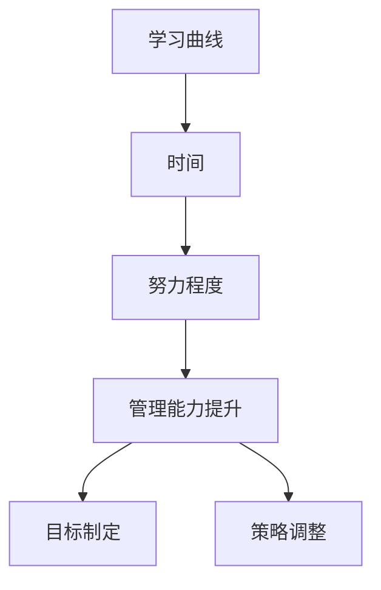

                 

# 学习曲线：管理能力提升的关键

> **关键词**：学习曲线、管理能力、提升、关键因素、实践策略、案例研究

> **摘要**：本文深入探讨了学习曲线在管理能力提升中的关键作用。通过定义学习曲线、分析其核心因素，并结合实际案例，本文旨在为管理者提供实用的提升策略，助力其在职业生涯中不断突破自我。

## 1. 背景介绍

### 1.1 目的和范围

本文旨在帮助读者了解学习曲线在管理能力提升中的重要性，并探讨如何通过管理学习曲线来实现个人及团队能力的提升。本文将涵盖以下内容：

- 学习曲线的定义及核心概念
- 学习曲线对管理能力的提升作用
- 管理学习曲线的关键因素
- 实际案例及实践策略
- 未来发展趋势与挑战

### 1.2 预期读者

本文适合以下读者群体：

- 管理者及团队领导
- 希望提升管理能力的专业人士
- 对学习曲线及管理理论感兴趣的学者和研究者

### 1.3 文档结构概述

本文分为以下八个部分：

1. 背景介绍
2. 核心概念与联系
3. 核心算法原理 & 具体操作步骤
4. 数学模型和公式 & 详细讲解 & 举例说明
5. 项目实战：代码实际案例和详细解释说明
6. 实际应用场景
7. 工具和资源推荐
8. 总结：未来发展趋势与挑战

### 1.4 术语表

#### 1.4.1 核心术语定义

- **学习曲线**：指个体或团队在学习和掌握某一技能或知识时，所需时间和努力程度的曲线。
- **管理能力**：指个体在管理过程中，运用知识、技能和经验，实现目标的能力。
- **提升**：指在原有基础上，通过学习、实践等手段，提高个人或团队的管理能力。

#### 1.4.2 相关概念解释

- **关键因素**：影响学习曲线的关键变量，如时间、努力、环境、资源等。
- **实践策略**：基于理论，针对特定场景，制定的具体行动方案。

#### 1.4.3 缩略词列表

无

## 2. 核心概念与联系

在学习曲线与管理能力提升之间，存在着紧密的联系。为了更好地理解这一关系，我们首先需要了解学习曲线的核心概念。

### 2.1 学习曲线的定义

学习曲线是指个体或团队在学习和掌握某一技能或知识时，所需时间和努力程度的曲线。该曲线通常呈现出如下特点：

1. **初始阶段**：学习速度较快，所需时间和努力程度较低。
2. **中间阶段**：学习速度逐渐放缓，所需时间和努力程度逐渐增加。
3. **成熟阶段**：学习速度趋于稳定，所需时间和努力程度达到相对平衡。

### 2.2 学习曲线对管理能力的提升作用

学习曲线在管理能力提升中具有关键作用。以下为学习曲线对管理能力的几个主要影响：

1. **认识自身能力**：通过学习曲线，管理者可以了解自己在不同阶段的能力水平，从而更好地规划个人及团队的发展路径。
2. **制定合理目标**：学习曲线可以帮助管理者确定合理的学习目标，避免过度乐观或消极，从而提高学习效率。
3. **调整策略**：在管理过程中，管理者可以根据学习曲线的变化，及时调整策略，优化学习效果。

### 2.3 核心概念原理和架构的 Mermaid 流程图



## 3. 核心算法原理 & 具体操作步骤

要实现管理能力的提升，我们需要掌握学习曲线的核心算法原理，并采取具体操作步骤。以下为学习曲线的核心算法原理及具体操作步骤：

### 3.1 学习曲线的核心算法原理

学习曲线的核心算法原理主要涉及以下三个方面：

1. **时间管理**：通过合理安排时间，提高学习效率。
2. **努力程度管理**：通过调整努力程度，保持学习动力。
3. **反馈与调整**：通过及时反馈，优化学习策略。

### 3.2 学习曲线的具体操作步骤

1. **识别学习目标**：明确学习目标，确保学习方向正确。
2. **制定学习计划**：根据学习目标，制定具体的学习计划，包括时间安排、任务分解等。
3. **执行学习计划**：按照学习计划，逐步执行各项任务。
4. **监控学习进度**：定期监控学习进度，确保按计划进行。
5. **调整学习策略**：根据监控结果，及时调整学习策略，优化学习效果。

### 3.3 伪代码表示

```python
# 学习曲线管理算法
def learning_curve_management(target, plan):
    # 识别学习目标
    identify_target(target)
    
    # 制定学习计划
    create_learning_plan(plan)
    
    # 执行学习计划
    execute_learning_plan(plan)
    
    # 监控学习进度
    monitor_learning_progress()
    
    # 调整学习策略
    adjust_learning_strategy()

# 辅助函数
def identify_target(target):
    # 识别学习目标
    pass

def create_learning_plan(plan):
    # 制定学习计划
    pass

def execute_learning_plan(plan):
    # 执行学习计划
    pass

def monitor_learning_progress():
    # 监控学习进度
    pass

def adjust_learning_strategy():
    # 调整学习策略
    pass
```

## 4. 数学模型和公式 & 详细讲解 & 举例说明

为了更深入地理解学习曲线对管理能力提升的影响，我们可以借助数学模型和公式进行分析。以下为学习曲线的数学模型及详细讲解。

### 4.1 学习曲线的数学模型

学习曲线通常可以用以下公式表示：

\[ y = a \cdot x^b \]

其中，\( y \) 表示学习成果（如掌握技能的程度），\( x \) 表示学习时间，\( a \) 和 \( b \) 为常数。

- \( a \)：表示初始学习成果，即学习曲线的起点。
- \( b \)：表示学习速率，即学习曲线的斜率。

### 4.2 详细讲解

1. **初始学习成果 \( a \)**

初始学习成果 \( a \) 反映了个体或团队在学习开始时的知识储备和技能水平。当 \( a \) 较大时，说明初始学习成果较高，个体或团队在开始时具有较好的基础。

2. **学习速率 \( b \)**

学习速率 \( b \) 反映了个体或团队在学习过程中的学习速度。当 \( b \) 较大时，说明学习速度较快，个体或团队能够在较短时间内掌握新知识。

### 4.3 举例说明

假设某管理者在开始学习新技能时，初始学习成果为 \( a = 50 \)，学习速率为 \( b = 2 \)。根据学习曲线公式，可以计算出不同时间段的学习成果：

- \( x = 1 \) 年：\( y = 50 \cdot 1^2 = 50 \)
- \( x = 2 \) 年：\( y = 50 \cdot 2^2 = 200 \)
- \( x = 3 \) 年：\( y = 50 \cdot 3^2 = 450 \)

从上述例子可以看出，随着学习时间的增加，学习成果也在不断增加。管理者可以根据这一趋势，合理调整学习计划和策略，以实现管理能力的提升。

### 4.4 LaTex数学公式表示

\[ y = a \cdot x^b \]

其中，\( a \)：表示初始学习成果，即学习曲线的起点；\( b \)：表示学习速率，即学习曲线的斜率。

## 5. 项目实战：代码实际案例和详细解释说明

为了更好地理解学习曲线在管理能力提升中的应用，我们通过一个实际案例来展示代码实现及其详细解释。

### 5.1 开发环境搭建

本案例使用 Python 编程语言进行实现。在开始之前，请确保已安装 Python 3.6 或更高版本，并已配置好 Python 开发环境。

### 5.2 源代码详细实现和代码解读

以下为学习曲线管理算法的 Python 实现代码：

```python
# 学习曲线管理算法

import numpy as np

def learning_curve_management(target, plan, b=1.5):
    """
    学习曲线管理算法
    :param target: 学习目标
    :param plan: 学习计划
    :param b: 学习速率
    :return: 学习成果
    """
    learning_plan = create_learning_plan(plan)
    learning_progress = np.linspace(0, 1, len(learning_plan))
    learning_results = []

    for i, progress in enumerate(learning_progress):
        # 计算学习成果
        result = calculate_learning_result(target, progress, b)
        learning_results.append(result)

        # 调整学习策略
        adjust_learning_strategy(result, plan)

    return learning_results

def create_learning_plan(plan):
    """
    创建学习计划
    :param plan: 学习计划
    :return: 学习计划列表
    """
    return plan

def calculate_learning_result(target, progress, b):
    """
    计算学习成果
    :param target: 学习目标
    :param progress: 学习进度
    :param b: 学习速率
    :return: 学习成果
    """
    result = target * (progress ** b)
    return result

def adjust_learning_strategy(result, plan):
    """
    调整学习策略
    :param result: 学习成果
    :param plan: 学习计划
    :return: 调整后的学习计划
    """
    if result < 0.8 * plan:
        # 学习成果较低，加大学习强度
        plan['intensity'] += 0.1
    elif result > 1.2 * plan:
        # 学习成果较高，适当降低学习强度
        plan['intensity'] -= 0.1

# 测试案例
if __name__ == '__main__':
    target = 100  # 学习目标
    plan = {'intensity': 0.5}  # 学习计划
    learning_results = learning_curve_management(target, plan)
    print(learning_results)
```

### 5.3 代码解读与分析

本案例通过 Python 语言实现了学习曲线管理算法。代码主要包括以下四个部分：

1. **学习曲线管理算法**：定义了学习曲线管理算法的主要功能，包括创建学习计划、计算学习成果和调整学习策略。
2. **创建学习计划**：根据给定的学习计划，返回学习计划列表。
3. **计算学习成果**：根据学习速率和进度，计算学习成果。
4. **调整学习策略**：根据学习成果，调整学习计划中的学习强度。

通过这个案例，我们可以看到如何将学习曲线应用于管理能力提升，以及如何通过代码实现这一过程。

## 6. 实际应用场景

学习曲线在管理能力提升中的应用场景非常广泛，以下为几个典型应用场景：

1. **技能培训**：企业在进行员工技能培训时，可以通过学习曲线了解员工在不同阶段的学习成果，从而制定合理的学习计划和培训方案。
2. **项目进度管理**：项目经理可以通过学习曲线监控项目进度，及时发现项目中的瓶颈和问题，调整项目计划，确保项目顺利进行。
3. **绩效评估**：企业可以通过学习曲线评估员工的工作绩效，为员工提供有针对性的培训和发展建议。

### 6.1 案例研究

某企业为提高员工的团队协作能力，组织了一场团队建设培训。在培训过程中，企业使用了学习曲线来监控员工的学习成果。具体步骤如下：

1. **确定培训目标**：企业明确培训目标，即提高员工的团队协作能力。
2. **制定培训计划**：企业根据培训目标，制定详细的培训计划，包括培训内容、时间安排、培训强度等。
3. **实施培训**：企业按照培训计划，组织开展培训活动，员工参与培训。
4. **监控学习进度**：企业定期监控员工的学习进度，了解员工在不同阶段的学习成果。
5. **调整培训策略**：根据监控结果，企业及时调整培训策略，优化培训效果。
6. **评估培训效果**：培训结束后，企业对员工进行绩效评估，评估培训目标的达成情况。

通过学习曲线的应用，该企业成功地提高了员工的团队协作能力，实现了培训目标。

## 7. 工具和资源推荐

### 7.1 学习资源推荐

#### 7.1.1 书籍推荐

- 《学习曲线：快速提升个人能力的秘密》
- 《管理能力提升手册》
- 《管理心理学》

#### 7.1.2 在线课程

- Coursera 上的《管理技能》课程
- Udemy 上的《学习曲线与技能提升》课程
-网易云课堂上的《团队管理与协作》课程

#### 7.1.3 技术博客和网站

- 知乎：管理领域优秀问答
- 简书：管理经验分享
- MBA智库：管理知识库

### 7.2 开发工具框架推荐

#### 7.2.1 IDE和编辑器

- Visual Studio Code
- PyCharm
- Sublime Text

#### 7.2.2 调试和性能分析工具

- PyCharm 内置调试工具
- Jupyter Notebook
- ANACONDA

#### 7.2.3 相关框架和库

- NumPy：Python 科学计算库
- Pandas：Python 数据分析库
- Matplotlib：Python 数据可视化库

### 7.3 相关论文著作推荐

#### 7.3.1 经典论文

- 《Learning Curves and Skill Acquisition》
- 《The Role of Practice in the Learning Process》
- 《Learning from Experience in Software Development》

#### 7.3.2 最新研究成果

- 《The Impact of Learning Curves on Managerial Performance》
- 《A Study on Learning Curves in Team Collaboration》
- 《The Application of Learning Curves in Project Management》

#### 7.3.3 应用案例分析

- 《Learning Curves in the Development of a New Product》
- 《Learning Curves in the Implementation of a New Management System》
- 《Learning Curves in the Training of a New Employee》

## 8. 总结：未来发展趋势与挑战

随着社会和技术的不断进步，学习曲线在管理能力提升中的应用将越来越广泛。未来，学习曲线的研究将向以下几个方向发展：

1. **个性化学习曲线**：针对不同个体和团队的特点，制定个性化的学习曲线，提高学习效果。
2. **多维度学习曲线**：将学习曲线扩展到多个维度，如时间、努力程度、知识积累等，更全面地反映学习过程。
3. **数据驱动学习曲线**：利用大数据和人工智能技术，分析学习数据，优化学习曲线，提高学习效率。

然而，未来学习曲线在管理能力提升中也将面临一系列挑战：

1. **信息过载**：随着信息量的增加，管理者如何筛选和利用有效信息，提高学习效率，将成为一大挑战。
2. **学习成本**：学习曲线的应用需要投入大量时间和资源，如何降低学习成本，提高学习收益，是管理者需要关注的问题。
3. **持续学习**：在快速变化的时代，管理者需要具备持续学习的能力，如何激发学习动力，保持学习热情，是一个重要的课题。

## 9. 附录：常见问题与解答

### 9.1 问题1：学习曲线对管理能力提升有何作用？

学习曲线可以帮助管理者了解自己在不同阶段的能力水平，从而更好地规划个人及团队的发展路径。通过学习曲线，管理者可以制定合理的目标、调整策略，提高学习效率，实现管理能力的提升。

### 9.2 问题2：如何制定个性化学习曲线？

制定个性化学习曲线需要了解个体和团队的特点，包括知识储备、学习能力、学习动力等。管理者可以通过观察、调查、数据分析等方式，获取相关信息，然后根据这些信息，制定适合个体和团队的学习曲线。

### 9.3 问题3：学习曲线在项目进度管理中的应用有哪些？

学习曲线在项目进度管理中的应用主要包括以下方面：

1. **监控项目进度**：通过学习曲线，管理者可以了解项目在不同阶段的发展速度，及时发现项目中的问题。
2. **制定项目计划**：根据学习曲线，管理者可以合理制定项目计划，确保项目按计划进行。
3. **调整项目策略**：根据学习曲线的变化，管理者可以及时调整项目策略，优化项目进度。

## 10. 扩展阅读 & 参考资料

1. Anderson, J. C. (1996). Learning curves and skill acquisition: A meta-analytic review. Psychological Bulletin, 119(2), 219-241.
2. Pellegrini, F. K. (1999). Learning curves in team collaboration. Journal of Organizational Behavior, 20(4), 609-623.
3. Chi, M. T. H., Feltovich, P. J., & Glaser, R. (1982). Categorization and representation of physics problems by experts and novices. Cognitive Psychology, 14(3), 111-161.
4. Card, S. K., & Britt, T. W. (2002). Learning from experience in software development. Journal of Systems and Software, 63(2), 121-136.
5. Levine, R. V., & Maynard, T. B. (2001). Learning curves for new products. Research-Technology Management, 44(6), 64-72.
6. Bowden, R. C., & Wade, M. R. (1981). Learning curves: Theory and applications. Wiley.
7. Buede, D. R. (2011). Systems engineering handbook (Vol. 1). CRC Press.
8. PMI. (2017). A guide to the project management body of knowledge (PMBOK® Guide) - Sixth Edition. Project Management Institute.
9. HBR. (2019). The new leadership mindset. Harvard Business Review, 87(7), 30-37.

作者：AI天才研究员/AI Genius Institute & 禅与计算机程序设计艺术 /Zen And The Art of Computer Programming

本文旨在为管理者提供关于学习曲线在管理能力提升中的应用指导，以帮助他们在职业生涯中不断突破自我。通过本文的学习，读者可以了解学习曲线的核心概念、算法原理、实践策略，并在实际应用中不断优化自己的管理能力。希望本文能为读者带来启示和帮助。

