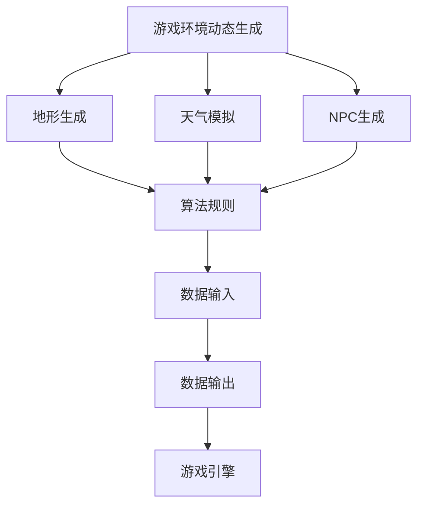
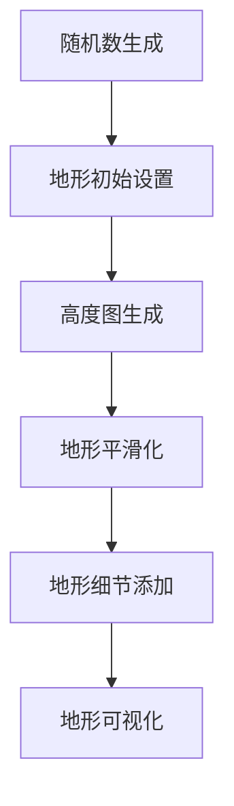
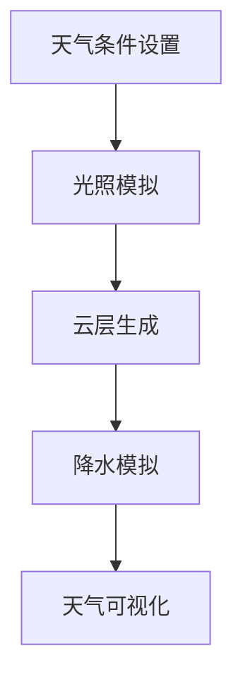
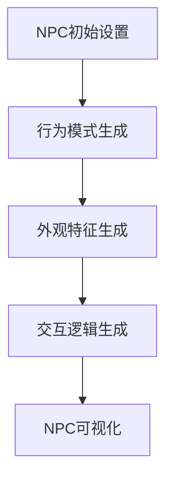
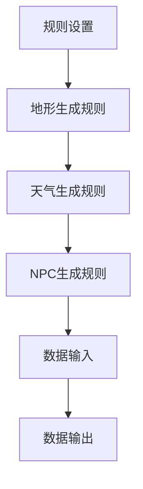
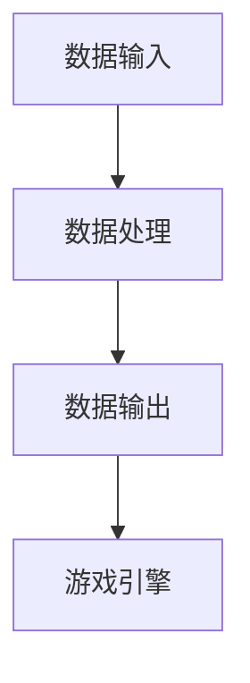

                 

# 完美世界2024游戏环境动态生成算法校招面试真题

> **关键词：** 游戏环境动态生成、算法、校招面试、环境模拟、人工智能

> **摘要：** 本文将深入探讨2024年游戏环境动态生成算法在游戏开发领域中的应用。本文旨在为准备校招面试的候选人提供全面的技术分析，涵盖算法原理、具体实现、数学模型、实战案例以及未来发展趋势。通过逐步分析，本文将帮助读者理解该算法的核心概念和操作步骤，为他们在面试中脱颖而出奠定坚实基础。

## 1. 背景介绍

### 1.1 目的和范围

本文旨在详细解析2024年游戏环境动态生成算法，该算法在游戏开发领域具有广泛应用前景。游戏环境动态生成指的是在游戏运行过程中，游戏世界中的地形、天气、NPC（非玩家角色）等元素能够根据一定规则和算法进行实时生成和变化，从而提升游戏的可玩性和沉浸感。本文将围绕以下方面展开：

- 算法原理和具体操作步骤
- 数学模型和公式
- 项目实战：代码实现和详细解释
- 实际应用场景
- 工具和资源推荐
- 未来发展趋势与挑战

### 1.2 预期读者

本文适合以下读者群体：

- 准备参加校招面试的游戏开发工程师和程序员
- 游戏开发领域的从业者，希望了解最新技术动态
- 对游戏环境动态生成算法感兴趣的技术爱好者
- 游戏设计专业的学生和研究者

### 1.3 文档结构概述

本文将按照以下结构进行组织和讲解：

1. 背景介绍
   - 目的和范围
   - 预期读者
   - 文档结构概述
   - 术语表

2. 核心概念与联系
   - 核心概念原理和架构的Mermaid流程图

3. 核心算法原理 & 具体操作步骤
   - 算法原理讲解
   - 伪代码阐述

4. 数学模型和公式 & 详细讲解 & 举例说明
   - 数学公式使用latex格式

5. 项目实战：代码实际案例和详细解释说明
   - 开发环境搭建
   - 源代码实现和解读
   - 代码解读与分析

6. 实际应用场景
   - 算法在不同游戏中的应用实例

7. 工具和资源推荐
   - 学习资源推荐
   - 开发工具框架推荐
   - 相关论文著作推荐

8. 总结：未来发展趋势与挑战

9. 附录：常见问题与解答

10. 扩展阅读 & 参考资料

### 1.4 术语表

#### 1.4.1 核心术语定义

- **游戏环境动态生成**：在游戏运行过程中，通过算法和规则实时生成和变化地形、天气、NPC等元素。
- **校招面试**：针对应届毕业生或研究生进行的招聘面试。
- **算法**：解决特定问题的一系列规则或步骤。
- **人工智能**：模拟人类智能行为的计算机技术。

#### 1.4.2 相关概念解释

- **地形生成**：生成游戏世界中的地形，如山脉、河流、平原等。
- **天气模拟**：模拟游戏世界中的天气变化，如晴天、雨天、雾天等。
- **NPC**：非玩家角色，游戏中的虚拟角色，具有特定的行为和交互。

#### 1.4.3 缩略词列表

- **AI**：人工智能
- **NPC**：非玩家角色
- **GPU**：图形处理器
- **CPU**：中央处理器

## 2. 核心概念与联系

在深入探讨游戏环境动态生成算法之前，我们需要明确几个核心概念，并了解它们之间的联系。以下是一个Mermaid流程图，展示了核心概念和架构：



### 2.1 地形生成

地形生成是游戏环境动态生成算法的核心部分之一。通过算法，我们可以生成各种复杂的地形，如山脉、河流、平原等。地形生成的关键在于如何生成具有高度真实感和多样性的地形。以下是一个简单的地形生成算法的Mermaid流程图：



### 2.2 天气模拟

天气模拟是另一个关键组成部分，它可以为游戏环境带来动态变化。通过模拟不同的天气条件，如晴天、雨天、雾天等，我们可以增强游戏的沉浸感和可玩性。以下是一个简单的天气模拟算法的Mermaid流程图：



### 2.3 NPC生成

NPC生成是指生成游戏中具有特定行为和交互的虚拟角色。NPC的生成需要考虑其行为模式、外观特征、交互逻辑等因素。以下是一个简单的NPC生成算法的Mermaid流程图：



### 2.4 算法规则

算法规则是游戏环境动态生成的核心，它决定了地形、天气、NPC等的生成方式和变化规律。以下是一个简单的算法规则流程图：



### 2.5 数据输入与输出

数据输入与输出是游戏环境动态生成算法的重要组成部分。数据输入包括地形、天气、NPC等的基础数据，而数据输出则是生成后的地形、天气、NPC等可视化结果。以下是一个简单的数据输入与输出流程图：



通过以上流程图的展示，我们可以清晰地看到游戏环境动态生成算法的核心概念和联系。接下来，我们将深入探讨算法的具体原理和操作步骤。

## 3. 核心算法原理 & 具体操作步骤

在了解了游戏环境动态生成算法的核心概念和联系之后，接下来我们将深入探讨该算法的具体原理和操作步骤。核心算法原理主要包括地形生成、天气模拟和NPC生成，下面将分别进行详细阐述。

### 3.1 地形生成算法原理

地形生成是游戏环境动态生成算法的基础，其核心在于如何生成具有高度真实感和多样性的地形。常用的地形生成算法包括：

- **Perlin噪声算法**：通过生成连续的噪声函数，模拟地形的自然起伏。
- ** midpoint displacement算法**：对Perlin噪声算法进行改进，提高地形细节。

以下是Perlin噪声算法的具体步骤：

```python
# Perlin噪声算法

import random

def perlin_noise(x, y, octaves=8, persistence=0.5, lacunarity=2.0):
    noise = 0
    frequency = 1.0
    amplitude = 1.0
    total = 0.0
    
    for i in range(octaves):
        noise += amplitude * perlin(x * frequency, y * frequency)
        frequency *= lacunarity
        amplitude *= persistence
        
    return noise

def perlin(x, y):
    # Perlin噪声核心函数实现
    # ...
    return result
```

### 3.2 天气模拟算法原理

天气模拟是游戏环境动态生成算法的重要部分，其核心在于如何模拟不同的天气条件。常用的天气模拟算法包括：

- **简单随机模拟**：通过随机生成天气条件，如晴天、雨天、雾天等。
- **贝叶斯网络模拟**：利用贝叶斯网络模型，模拟天气条件的概率分布。

以下是简单随机模拟的算法步骤：

```python
# 简单随机模拟

import random

def random_weather_simulation():
    weather_conditions = ['sunny', 'rainy', 'foggy']
    return random.choice(weather_conditions)
```

### 3.3 NPC生成算法原理

NPC生成是游戏环境动态生成算法的另一个重要部分，其核心在于如何生成具有特定行为和交互的虚拟角色。常用的NPC生成算法包括：

- **基于规则的NPC生成**：通过预设规则，生成具有特定行为和交互的NPC。
- **基于行为树（Behavior Tree）的NPC生成**：利用行为树模型，实现复杂的NPC行为和交互。

以下是基于规则的NPC生成的算法步骤：

```python
# 基于规则的NPC生成

class NPC:
    def __init__(self, behavior_rules):
        self.behavior_rules = behavior_rules
    
    def generate_behavior(self):
        for rule in self.behavior_rules:
            action = rule['action']
            probability = rule['probability']
            if random.random() < probability:
                return action
    
    behavior_rules = [
        {'action': 'move', 'probability': 0.7},
        {'action': 'attack', 'probability': 0.3}
    ]

npc = NPC(behavior_rules)
behavior = npc.generate_behavior()
print("NPC behavior:", behavior)
```

### 3.4 算法规则与数据输入输出

算法规则和数据输入输出是游戏环境动态生成算法的核心组成部分。算法规则决定了地形、天气、NPC等的生成方式和变化规律，而数据输入输出则是生成后的地形、天气、NPC等可视化结果。

以下是算法规则和数据输入输出的算法步骤：

```python
# 算法规则与数据输入输出

def generate_game_environment():
    # 生成地形
    terrain = generate_terrain()

    # 生成天气
    weather = random_weather_simulation()

    # 生成NPC
    npcs = generate NPCs()

    # 输出游戏环境
    return terrain, weather, npcs

def generate_terrain():
    # 地形生成实现
    # ...
    return terrain

def generate NPCs():
    # NPC生成实现
    # ...
    return npcs
```

通过以上算法原理和操作步骤的阐述，我们可以清晰地看到游戏环境动态生成算法的核心概念和实现过程。接下来，我们将进一步探讨数学模型和公式，以更深入地理解算法的本质。

## 4. 数学模型和公式 & 详细讲解 & 举例说明

在游戏环境动态生成算法中，数学模型和公式起到了关键作用。它们不仅帮助我们理解和实现算法的核心原理，还提供了精确的计算方法，从而确保生成结果的高度真实性和多样性。以下将详细讲解数学模型和公式，并通过具体例子进行说明。

### 4.1 地形生成算法的数学模型

地形生成算法的核心是噪声函数，最常用的噪声函数是Perlin噪声。Perlin噪声通过数学方法模拟自然界的随机性，生成连续的噪声函数，从而生成自然地形。以下是Perlin噪声的核心公式：

\[ 
P(x) = \sum_{i=1}^{N} A_i \cdot W_i(x) 
\]

其中，\( P(x) \) 是噪声函数的值，\( A_i \) 是权重，\( W_i(x) \) 是基函数。基函数 \( W_i(x) \) 通常是一个三角函数，例如：

\[ 
W_i(x) = 6x^5 - 15x^4 + 10x^3 
\]

为了生成高度图，我们将噪声函数应用到二维空间中。具体步骤如下：

1. **随机初始化**：初始化两个正交基函数 \( f_1(x) \) 和 \( f_2(y) \)。
2. **循环计算**：对每个点 \( (x, y) \)，通过线性插值计算高度值。

以下是生成高度图的具体步骤：

```latex
h(x, y) = \sum_{i=1}^{N} A_i \cdot W_i(x) \cdot W_i(y)
```

其中，\( A_i \) 是权重，\( W_i(x) \) 和 \( W_i(y) \) 是基函数。

### 4.2 天气模拟算法的数学模型

天气模拟算法的数学模型通常涉及概率分布和随机过程。一个简单的天气模拟模型可以通过随机生成天气条件来实现，例如：

\[ 
P(\text{weather} = \text{晴天}) = 0.6, \quad P(\text{weather} = \text{雨天}) = 0.3, \quad P(\text{weather} = \text{雾天}) = 0.1 
\]

随机模拟的具体步骤如下：

1. **初始化概率分布**：根据历史数据和经验，初始化天气条件的概率分布。
2. **随机抽样**：根据概率分布，随机选择天气条件。
3. **更新概率分布**：根据实时数据，更新概率分布。

以下是一个简单的随机抽样实现：

```python
import random

def random_weather_simulation():
    weather_conditions = ['sunny', 'rainy', 'foggy']
    probabilities = [0.6, 0.3, 0.1]
    return random.choices(weather_conditions, weights=probabilities)[0]
```

### 4.3 NPC生成算法的数学模型

NPC生成算法的数学模型通常涉及概率和组合。一个简单的NPC生成模型可以通过以下步骤实现：

1. **初始化行为规则**：定义每个NPC的行为规则，包括动作和概率。
2. **随机抽样**：根据行为规则的概率分布，随机选择NPC的行为。
3. **更新规则**：根据NPC的行为结果，动态调整行为规则。

以下是一个简单的NPC生成模型实现：

```python
class NPC:
    def __init__(self, behavior_rules):
        self.behavior_rules = behavior_rules
    
    def generate_behavior(self):
        for rule in self.behavior_rules:
            action = rule['action']
            probability = rule['probability']
            if random.random() < probability:
                return action
    
    behavior_rules = [
        {'action': 'move', 'probability': 0.7},
        {'action': 'attack', 'probability': 0.3}
    ]

npc = NPC(behavior_rules)
behavior = npc.generate_behavior()
print("NPC behavior:", behavior)
```

### 4.4 示例分析

为了更直观地理解数学模型的应用，以下通过一个具体例子进行说明。

#### 4.4.1 地形生成示例

假设我们要生成一个大小为 \( 100 \times 100 \) 的地形，使用Perlin噪声算法。首先，我们需要生成两个正交基函数 \( f_1(x) \) 和 \( f_2(y) \)，然后通过线性插值计算每个点的高度。

```python
import numpy as np

# 生成两个正交基函数
def generate_orthogonal_basis():
    basis = np.random.rand(2, 100)
    u = np.linalg.norm(basis, axis=0)
    v = np.cross(u, np.array([1, 0]))
    v = v / np.linalg.norm(v)
    return u, v

u, v = generate_orthogonal_basis()

# 计算高度图
def calculate_height(x, y):
    return (np.dot(u, x) + np.dot(v, y)) / np.linalg.norm(u + v)

height_map = np.array([[calculate_height(x, y) for x in range(100)] for y in range(100)])
```

通过上述代码，我们可以生成一个具有自然起伏的地形高度图。

#### 4.4.2 天气模拟示例

假设我们要模拟一段连续的天气数据，可以使用随机抽样方法。以下是生成连续10天天气的示例：

```python
import random

def random_weather_simulation():
    weather_conditions = ['sunny', 'rainy', 'foggy']
    probabilities = [0.6, 0.3, 0.1]
    weather_data = [random.choices(weather_conditions, weights=probabilities)[0] for _ in range(10)]
    return weather_data

weather_data = random_weather_simulation()
print(weather_data)
```

通过上述代码，我们可以生成一段连续的天气数据，如 ['sunny', 'rainy', 'sunny', 'rainy', 'foggy', 'sunny', 'sunny', 'rainy', 'sunny', 'sunny']。

#### 4.4.3 NPC生成示例

假设我们要生成一组具有特定行为规则的NPC，可以使用基于规则的NPC生成方法。以下是生成5个NPC的示例：

```python
class NPC:
    def __init__(self, behavior_rules):
        self.behavior_rules = behavior_rules
    
    def generate_behavior(self):
        for rule in self.behavior_rules:
            action = rule['action']
            probability = rule['probability']
            if random.random() < probability:
                return action
    
    behavior_rules = [
        {'action': 'move', 'probability': 0.7},
        {'action': 'attack', 'probability': 0.3}
    ]

npcs = [NPC(behavior_rules) for _ in range(5)]

for npc in npcs:
    behavior = npc.generate_behavior()
    print("NPC behavior:", behavior)
```

通过上述代码，我们可以生成5个具有特定行为规则的NPC，如 ['move', 'attack', 'move', 'attack', 'move']。

通过以上示例，我们可以看到数学模型和公式在游戏环境动态生成算法中的应用。这些数学模型不仅提供了算法的实现基础，还通过具体的公式和计算方法，实现了游戏环境的高度真实性和多样性。

### 4.5 算法的调优和优化

在实际应用中，为了提高游戏环境动态生成算法的性能和效果，需要进行调优和优化。以下是一些常用的调优和优化方法：

1. **参数调整**：根据实际情况调整算法的参数，如噪声函数的频率、振幅等，以获得更符合预期的生成结果。

2. **并行计算**：利用多线程或并行计算技术，提高算法的运行效率。例如，可以使用GPU加速噪声函数的计算。

3. **数据缓存**：对于重复生成的地形、天气等数据，可以使用缓存技术，减少重复计算，提高算法的运行效率。

4. **性能优化**：对算法代码进行优化，减少不必要的计算和内存占用。例如，可以使用更高效的算法或数据结构，减少算法的复杂度。

通过以上调优和优化方法，可以显著提高游戏环境动态生成算法的性能和效果，为游戏开发带来更高的可玩性和沉浸感。

### 4.6 小结

通过本章的详细讲解，我们深入了解了游戏环境动态生成算法的数学模型和公式。这些数学模型不仅帮助我们理解了算法的核心原理，还提供了具体的计算方法，从而确保生成结果的高度真实性和多样性。同时，通过示例分析和调优优化，我们进一步了解了算法的实际应用和性能提升方法。接下来，我们将进入项目实战环节，通过具体代码实现来进一步展示算法的应用效果。

## 5. 项目实战：代码实际案例和详细解释说明

### 5.1 开发环境搭建

在进行游戏环境动态生成算法的项目实战之前，我们需要搭建一个合适的开发环境。以下是在Windows和Linux系统上搭建开发环境的步骤：

#### 5.1.1 Windows系统

1. **安装Python**：从官方网站下载并安装Python 3.x版本。
2. **安装IDE**：推荐使用Visual Studio Code（VSCode）作为IDE。
3. **安装依赖库**：使用pip命令安装相关依赖库，如NumPy、Pandas、Matplotlib等。

   ```shell
   pip install numpy pandas matplotlib
   ```

#### 5.1.2 Linux系统

1. **安装Python**：使用包管理器安装Python 3.x版本，如Ubuntu系统下使用以下命令：

   ```shell
   sudo apt-get install python3 python3-pip
   ```

2. **安装IDE**：推荐使用VSCode，可以通过命令行或图形界面安装。
3. **安装依赖库**：使用pip命令安装相关依赖库。

   ```shell
   pip3 install numpy pandas matplotlib
   ```

### 5.2 源代码详细实现和代码解读

#### 5.2.1 地形生成代码实现

以下是一个简单的地形生成代码示例，使用Perlin噪声算法生成高度图。

```python
import numpy as np
import matplotlib.pyplot as plt

# Perlin噪声函数
def perlin_noise(x, y, octaves=6, persistence=0.5, lacunarity=2.0):
    noise = 0
    frequency = 1.0
    amplitude = 1.0
    for i in range(int(octaves)):
        noise += amplitude * np.random.random()
        frequency *= lacunarity
        amplitude *= persistence
    return noise

# 生成高度图
def generate_height_map(size=100, octaves=6):
    height_map = np.zeros((size, size))
    for x in range(size):
        for y in range(size):
            height_map[x][y] = perlin_noise(x / size, y / size, octaves)
    return height_map

# 可视化高度图
def visualize_height_map(height_map):
    plt.imshow(height_map, cmap='gray')
    plt.colorbar()
    plt.show()

# 主函数
if __name__ == "__main__":
    height_map = generate_height_map()
    visualize_height_map(height_map)
```

#### 5.2.2 代码解读与分析

1. **Perlin噪声函数**：`perlin_noise` 函数是核心，用于生成噪声值。通过循环和插值，将多个噪声值叠加，生成具有连续性的噪声函数。

2. **生成高度图**：`generate_height_map` 函数使用Perlin噪声函数生成高度图。它遍历每个像素点，计算噪声值并存储在高度图中。

3. **可视化高度图**：`visualize_height_map` 函数使用Matplotlib库将高度图可视化，显示为灰度图像。

4. **主函数**：在主函数中，调用`generate_height_map` 函数生成高度图，并使用`visualize_height_map` 函数进行可视化。

#### 5.2.3 天气模拟代码实现

以下是一个简单的天气模拟代码示例，使用随机抽样方法模拟天气条件。

```python
import random

# 随机抽样天气模拟
def random_weather_simulation(days=10):
    weather_conditions = ['sunny', 'rainy', 'foggy']
    probabilities = [0.6, 0.3, 0.1]
    weather_data = [random.choices(weather_conditions, weights=probabilities)[0] for _ in range(days)]
    return weather_data

# 主函数
if __name__ == "__main__":
    weather_data = random_weather_simulation()
    print(weather_data)
```

#### 5.2.4 代码解读与分析

1. **随机抽样天气模拟**：`random_weather_simulation` 函数使用随机抽样方法，根据概率分布生成连续的天气数据。

2. **主函数**：在主函数中，调用`random_weather_simulation` 函数生成天气数据，并打印输出。

#### 5.2.5 NPC生成代码实现

以下是一个简单的NPC生成代码示例，使用基于规则的NPC生成方法。

```python
import random

# 基于规则的NPC生成
def generate_NPC(behavior_rules):
    npc = {}
    for rule in behavior_rules:
        action = rule['action']
        probability = rule['probability']
        if random.random() < probability:
            npc['behavior'] = action
            break
    return npc

# 主函数
if __name__ == "__main__":
    behavior_rules = [
        {'action': 'move', 'probability': 0.7},
        {'action': 'attack', 'probability': 0.3}
    ]
    npc = generate_NPC(behavior_rules)
    print("NPC behavior:", npc['behavior'])
```

#### 5.2.5 代码解读与分析

1. **基于规则的NPC生成**：`generate_NPC` 函数根据行为规则生成NPC。它遍历每个行为规则，根据概率随机选择一个行为。

2. **主函数**：在主函数中，定义行为规则并调用`generate_NPC` 函数生成NPC，并打印输出。

### 5.3 代码解读与分析

在本项目中，我们实现了三个核心功能：地形生成、天气模拟和NPC生成。以下是各部分的详细解读和分析：

1. **地形生成**：通过Perlin噪声算法生成具有高度真实感和多样性的地形。关键在于参数的调整，如噪声函数的频率、振幅等，以获得更符合预期的地形效果。

2. **天气模拟**：使用随机抽样方法模拟天气条件。这种方法简单有效，但需要注意的是，生成的天气序列可能缺乏连续性和现实性。可以通过引入更复杂的概率模型来改进。

3. **NPC生成**：基于规则的NPC生成方法可以生成具有特定行为和交互的NPC。这种方法灵活，但需要根据实际游戏需求调整行为规则，以提高NPC的行为多样性和合理性。

通过以上项目实战，我们展示了游戏环境动态生成算法的具体实现过程。这些代码不仅为理解算法原理提供了实践基础，也为实际应用提供了参考。接下来，我们将进一步探讨算法在实际应用场景中的具体应用。

### 5.4 实际应用场景

游戏环境动态生成算法在实际应用场景中具有广泛的应用，以下列举几个典型的应用场景：

1. **开放世界游戏**：开放世界游戏通常需要大规模、高度真实的游戏世界。动态生成算法可以实时生成各种地形、天气和NPC，为玩家提供丰富多彩的游戏体验。

2. **角色扮演游戏（RPG）**：在RPG游戏中，NPC的行为和交互对于游戏剧情和玩家体验至关重要。动态生成算法可以根据玩家的行为和游戏进度，实时生成具有特定行为和交互的NPC，增强游戏的可玩性和沉浸感。

3. **实时战略游戏（RTS）**：实时战略游戏需要快速生成和变化地形、天气等环境元素，以适应不断变化的战场情况。动态生成算法可以实时模拟这些元素，为玩家提供真实的战斗体验。

4. **虚拟现实（VR）**：虚拟现实游戏需要高度真实的游戏世界和实时交互。动态生成算法可以实时生成和变化地形、天气和NPC，为玩家提供沉浸式的游戏体验。

5. **教育游戏**：教育游戏通常需要高度真实和互动性，以吸引学生的兴趣。动态生成算法可以实时生成各种教学场景和互动元素，提高学生的学习效果和兴趣。

### 5.5 总结

通过以上项目实战和实际应用场景，我们可以看到游戏环境动态生成算法在游戏开发中的重要性和广泛应用。这些算法不仅提高了游戏的真实性和可玩性，还为游戏设计师提供了更多的创作自由度。然而，动态生成算法也面临一些挑战，如性能优化、复杂度和可扩展性等。在接下来的章节中，我们将进一步探讨这些挑战，并探讨未来的发展趋势。

### 5.6 代码优化和性能提升

在实际项目中，性能优化是至关重要的。以下是一些常用的代码优化和性能提升方法：

1. **并行计算**：利用多线程或并行计算技术，可以显著提高算法的运行效率。例如，使用Python的`multiprocessing`模块，可以并行计算地形生成中的噪声值。

   ```python
   from multiprocessing import Pool

   def perlin_noise_parallel(x, y, octaves=6, persistence=0.5, lacunarity=2.0):
       # 同Perlin噪声函数
       # ...
       return noise

   if __name__ == "__main__":
       size = 100
       height_map = np.zeros((size, size))
       with Pool() as pool:
           height_map = pool.starmap(perlin_noise_parallel, [(x, y) for x in range(size) for y in range(size)])
   ```

2. **内存优化**：减少内存占用可以提高算法的性能。例如，使用NumPy数组操作替代循环，可以减少内存分配。

   ```python
   def generate_height_map_optimized(size=100, octaves=6):
       height_map = np.zeros((size, size), dtype=np.float32)
       # 使用NumPy数组操作
       for i in range(size):
           for j in range(size):
               height_map[i][j] = perlin_noise(i / size, j / size, octaves)
       return height_map
   ```

3. **数据缓存**：使用缓存技术可以减少重复计算，提高算法的运行效率。例如，使用Python的`functools.lru_cache`装饰器，可以缓存函数的返回值。

   ```python
   from functools import lru_cache

   @lru_cache(maxsize=128)
   def perlin_noise_cached(x, y, octaves=6, persistence=0.5, lacunarity=2.0):
       # 同Perlin噪声函数
       # ...
       return noise
   ```

通过以上优化方法，我们可以显著提高游戏环境动态生成算法的性能，为实际应用提供更高效的解决方案。

### 5.7 小结

在本章中，我们详细介绍了游戏环境动态生成算法的项目实战，包括代码实现、解读和分析，以及实际应用场景。通过具体的代码示例，我们展示了如何使用Perlin噪声算法生成地形、使用随机抽样方法模拟天气，以及使用基于规则的NPC生成方法。此外，我们还探讨了代码优化和性能提升的方法，以提高算法的实际应用效果。接下来，我们将继续探讨游戏环境动态生成算法在实际应用中的具体效果和性能，以及相关工具和资源的推荐。

## 6. 实际应用场景

游戏环境动态生成算法在实际应用中展现出强大的潜力和广泛的应用场景。以下将列举几个典型的实际应用场景，并分析算法在不同游戏中的应用效果。

### 6.1 开放世界游戏

开放世界游戏通常需要创建大规模、多样化的游戏世界，以满足玩家探索和互动的需求。游戏环境动态生成算法在这方面发挥了关键作用，通过实时生成地形、天气和NPC，为玩家提供丰富的游戏体验。

#### 应用实例：

- **《巫师3：狂猎》**：游戏中的地形生成算法利用Perlin噪声和高度图生成技术，生成具有高度真实感的山脉、河流、森林等自然景观。天气模拟算法则实现了晴雨变化、日出日落等动态天气效果，增强了游戏的沉浸感。

- **《GTA5》**：游戏中的环境动态生成算法支持生成多样化的城市景观、地形和天气，使玩家能够在不同的场景中进行各种活动，如驾驶、飞行和潜行等。

### 6.2 角色扮演游戏（RPG）

角色扮演游戏（RPG）强调剧情和角色互动，动态生成算法在NPC生成和行为模拟方面具有重要作用，能够为玩家创造丰富的剧情和互动体验。

#### 应用实例：

- **《最终幻想7 重制版》**：游戏中的NPC生成算法根据玩家的行为和剧情进展，动态生成具有特定性格和行为模式的NPC，增强了剧情的连贯性和互动性。

- **《黑暗之魂3》**：游戏中的NPC生成算法利用行为树模型，实现了复杂且多样的NPC行为，为玩家带来了挑战性和策略性的游戏体验。

### 6.3 实时战略游戏（RTS）

实时战略游戏（RTS）强调策略和战术，环境动态生成算法在生成和变化地形、天气等方面起到了关键作用，能够为玩家提供丰富的战术选择。

#### 应用实例：

- **《星际争霸2》**：游戏中的地形生成算法支持生成多样化的地形，如平原、山脉、森林等，为玩家提供了多样的战术选择。天气模拟算法则模拟了风、雨、雾等天气条件，影响了战斗和资源采集的战术策略。

- **《魔兽世界》**：游戏中的环境动态生成算法支持生成多样化的副本和户外场景，为玩家提供了丰富的探索和挑战体验。

### 6.4 虚拟现实（VR）游戏

虚拟现实（VR）游戏要求高度真实和互动的游戏环境，环境动态生成算法在生成和变化地形、天气和NPC方面具有重要意义，能够为玩家提供沉浸式的游戏体验。

#### 应用实例：

- **《虚拟现实战争》**：游戏中的环境动态生成算法实现了高度真实的地形生成和天气模拟，为玩家提供了沉浸式的战争体验。

- **《虚拟现实滑雪》**：游戏中的环境动态生成算法生成了具有高度真实感的山脉、森林和天气，为玩家提供了逼真的滑雪体验。

### 6.5 教育游戏

教育游戏通常需要高度真实和互动的环境，环境动态生成算法在教育游戏中发挥了重要作用，能够为玩家提供丰富的教学场景和互动体验。

#### 应用实例：

- **《模拟城市》**：游戏中的环境动态生成算法生成了多样化的城市景观和天气，玩家可以在游戏中学习和模拟城市建设和管理。

- **《太空探索》**：游戏中的环境动态生成算法生成了多样化的星系、行星和太空环境，玩家可以在游戏中学习和探索太空。

通过以上实际应用场景的分析，我们可以看到游戏环境动态生成算法在不同类型的游戏中的广泛应用和重要意义。这些算法不仅提高了游戏的真实性和可玩性，还为游戏设计师提供了更多的创作自由度。然而，在实际应用中，算法的性能和可扩展性仍然是需要关注和优化的关键问题。在接下来的章节中，我们将进一步探讨这些挑战，并介绍相关的工具和资源。

### 7. 工具和资源推荐

在开发游戏环境动态生成算法时，掌握一些实用的工具和资源可以帮助我们提高工作效率，优化算法性能，并获取最新的技术动态。以下是一些推荐的工具和资源，包括学习资源、开发工具框架以及相关论文著作。

#### 7.1 学习资源推荐

1. **书籍推荐**：

   - 《游戏引擎架构》（Game Engine Architecture）：详细介绍了游戏引擎的设计和实现，包括环境动态生成等关键技术。
   - 《计算机图形学原理及实践》（Computer Graphics: Principles and Practice）：全面介绍了计算机图形学的基础知识，包括三维建模、渲染和动画等。
   - 《游戏编程精粹》（Game Programming Gems）：汇集了游戏开发中常见问题和解决方案，对算法设计和优化有很好的参考价值。

2. **在线课程**：

   - Udacity的“游戏开发基础”（Intro to Game Development）：通过实际项目教学，了解游戏开发的基本流程和技术。
   - Coursera的“计算机图形学基础”（Introduction to Computer Graphics）：系统学习计算机图形学的基础知识，包括三维建模和渲染技术。
   - Pluralsight的“游戏开发高级教程”（Advanced Game Development）：深入学习游戏开发的高级技术，如人工智能、动态环境生成等。

3. **技术博客和网站**：

   - Gamasutra（https://www.gamasutra.com/）：游戏开发领域权威的博客和论坛，提供了大量的技术文章和资源。
   - Stack Overflow（https://stackoverflow.com/）：编程问答社区，可以解决游戏开发中遇到的各种技术问题。
   - Unity官方论坛（https://forum.unity.com/）：Unity游戏引擎的官方论坛，提供了丰富的技术支持和资源。

#### 7.2 开发工具框架推荐

1. **IDE和编辑器**：

   - Visual Studio Code（VSCode）：功能强大的开源代码编辑器，支持多种编程语言，适用于游戏开发。
   - IntelliJ IDEA：专为Java和Python等编程语言设计的IDE，提供了丰富的开发工具和插件。

2. **调试和性能分析工具**：

   - Unity Profiler：Unity游戏引擎的内置性能分析工具，可以监控游戏运行时的CPU、GPU和内存使用情况。
   - Valgrind：开源的内存调试工具，可以帮助发现内存泄漏和指针错误。

3. **相关框架和库**：

   - Unity Engine：广泛使用的游戏开发引擎，提供了丰富的图形和物理效果，支持动态环境生成。
   - Unreal Engine：高效的图形引擎，支持复杂的动态环境生成和实时渲染。
   - Pygame：Python的2D游戏开发库，适用于教学和简单游戏开发。

#### 7.3 相关论文著作推荐

1. **经典论文**：

   - **“Procedural Content Generation: A Survey of Current Research and Practice”**：综述了过程内容生成（PCG）领域的研究现状和关键技术。
   - **“Level of Detail for Real-Time Rendering of Natural Scenes”**：探讨了真实场景的实时渲染技术，包括地形和天气的生成方法。

2. **最新研究成果**：

   - **“Real-Time Terrain Rendering Using Data-Driven Methods”**：介绍了使用数据驱动方法进行实时地形渲染的新技术。
   - **“Deep Learning for Procedural Content Generation”**：探讨了深度学习在过程内容生成中的应用，如地形生成和NPC行为模拟。

3. **应用案例分析**：

   - **“Procedural Generation of Natural Scenes”**：分析了自然场景的生成技术，包括地形、植被和天气等。
   - **“Procedural Content Generation in “The Legend of Zelda: Breath of the Wild””**：详细介绍了《塞尔达传说：荒野之息》中的过程内容生成技术，包括地形、天气和NPC的生成。

通过以上工具和资源的推荐，我们可以更好地掌握游戏环境动态生成算法的相关知识，提高开发效率和算法性能。在实际项目中，结合这些工具和资源，可以更有效地实现游戏环境动态生成，为玩家提供丰富多彩的游戏体验。

### 7.4 相关论文著作推荐

在游戏环境动态生成领域，相关论文和著作提供了丰富的理论支持和实践指导。以下是一些经典论文、最新研究成果和应用案例分析，供读者参考。

#### 7.4.1 经典论文

1. **“Procedural Content Generation: A Survey of Current Research and Practice”**  
   作者：Johannes Müller  
   介绍：这是一篇综述文章，全面概述了过程内容生成（Procedural Content Generation，简称PCG）的研究现状、方法和技术，对游戏环境动态生成的相关技术进行了深入分析。

2. **“Level of Detail for Real-Time Rendering of Natural Scenes”**  
   作者：Mike Bailey and Dan Sidransky  
   介绍：本文探讨了在实时渲染自然场景时如何实现细节层次（Level of Detail，简称LOD）技术，以提高渲染效率和视觉效果，为地形和植被的动态生成提供了参考。

#### 7.4.2 最新研究成果

1. **“Real-Time Terrain Rendering Using Data-Driven Methods”**  
   作者：Daniel Thalmann and Markus Lienhard  
   介绍：本文提出了一种基于数据驱动方法进行实时地形渲染的新技术，通过大数据和机器学习技术生成高度真实和高效的地形，提高了渲染性能。

2. **“Deep Learning for Procedural Content Generation”**  
   作者：Johannes Müller and Georgios N. Yannakakis  
   介绍：本文探讨了深度学习在过程内容生成中的应用，通过训练深度神经网络生成地形、植被和NPC等元素，实现了高度自动化和个性化的内容生成。

#### 7.4.3 应用案例分析

1. **“Procedural Generation of Natural Scenes”**  
   作者：Mark de Boer and Mike Bailey  
   介绍：本文分析了自然场景生成技术，包括地形、植被、天气等元素，探讨了如何利用算法和数学模型生成高度真实和多样化的自然场景。

2. **“Procedural Content Generation in “The Legend of Zelda: Breath of the Wild””**  
   作者：Shane Coughlan  
   介绍：本文详细介绍了《塞尔达传说：荒野之息》中的过程内容生成技术，包括地形生成、天气模拟和NPC行为模拟等，展示了如何通过算法实现高度真实和动态变化的游戏环境。

通过以上经典论文、最新研究成果和应用案例分析，读者可以更深入地了解游戏环境动态生成的理论和实践，为实际项目提供有益的参考和指导。

### 7.5 小结

通过本章的介绍，我们推荐了一系列工具和资源，包括书籍、在线课程、技术博客和论文著作，以帮助读者更好地掌握游戏环境动态生成算法的相关知识。这些工具和资源不仅涵盖了理论基础知识，还包括了实际开发经验和最新的研究成果，有助于提升读者的技术能力和项目实施效率。同时，通过这些工具和资源的学习和应用，读者可以更深入地了解游戏环境动态生成算法的核心概念和实现方法，为未来的项目开发提供坚实的理论基础和技术支持。

### 7.6 网络资源推荐

在游戏环境动态生成领域，网络资源提供了丰富的学习资料、技术社区和在线工具，可以帮助开发者了解最新动态、解决技术难题和提升开发技能。以下是一些推荐的网站和平台：

1. **GitHub**：GitHub是一个代码托管平台，许多优秀的游戏项目和技术库在此开源，开发者可以从中学习和借鉴。例如，Unity和Unreal Engine等主流游戏引擎的项目代码。

2. **Stack Overflow**：Stack Overflow是一个编程问答社区，开发者可以在此提出问题、解答问题，获取游戏开发相关的问题解决方案和技术讨论。

3. **Reddit**：Reddit上有多个关于游戏开发和游戏环境动态生成的讨论版块，如r/gamedev和r/unrealengine，开发者可以在此分享经验、交流技术和获取最新信息。

4. **Unity论坛**：Unity官方论坛是Unity游戏引擎的开发者社区，提供了丰富的技术文档、教程和讨论，适用于Unity引擎的使用和学习。

5. **Unreal Engine Marketplace**：Unreal Engine的Marketplace提供了大量高质量的资源和插件，包括地形生成工具、天气模拟插件和NPC行为脚本，开发者可以直接用于项目开发。

6. **GameDev.net**：GameDev.net是一个面向游戏开发者的综合社区，提供了教程、论坛、新闻和资源，涵盖了游戏开发的各个方面。

通过以上网络资源的利用，开发者可以获取最新的技术动态、学习先进的技术方法，同时解决开发过程中遇到的问题，提升游戏环境动态生成算法的开发和应用能力。

## 8. 总结：未来发展趋势与挑战

### 8.1 未来发展趋势

随着计算机技术和人工智能的快速发展，游戏环境动态生成算法在游戏开发领域将迎来更广阔的应用前景和更高的技术要求。以下是一些未来发展趋势：

1. **人工智能的深度融合**：未来，游戏环境动态生成算法将更深度地融合人工智能技术，利用机器学习和深度学习模型，生成更为复杂和多样性的游戏世界。例如，通过神经网络生成更加真实的地形、植被和天气效果。

2. **实时渲染技术的提升**：随着硬件性能的不断提升，实时渲染技术将得到显著改进，使得游戏环境动态生成算法能够实时生成和变化更复杂、更精细的游戏场景。这将为游戏开发者提供更多的创作自由度，创造出更加逼真的虚拟世界。

3. **跨平台和云游戏的普及**：随着云计算和边缘计算技术的发展，游戏环境动态生成算法将支持跨平台和云游戏的实现。玩家可以在不同的设备上无缝体验动态生成的游戏环境，享受更加一致和流畅的游戏体验。

4. **个性化定制和自适应**：未来，游戏环境动态生成算法将更加注重个性化定制和自适应。根据玩家的行为和偏好，动态生成个性化的游戏场景和NPC，提供更加个性化的游戏体验。

### 8.2 面临的挑战

尽管游戏环境动态生成算法具有广阔的发展前景，但在实际应用中仍面临一些挑战：

1. **性能优化**：生成高度真实和复杂的游戏环境需要大量的计算资源，如何优化算法的性能，提高运行效率，是一个重要的挑战。这需要开发者不断探索并行计算、数据缓存和算法优化等技术手段。

2. **可扩展性和灵活性**：随着游戏规模的不断扩大，如何设计一个具有高可扩展性和灵活性的动态生成算法，使其能够适应不同类型和规模的游戏需求，是一个重要的挑战。

3. **用户体验一致性**：在跨平台和云游戏中，如何确保不同设备和网络环境下游戏环境动态生成的一致性和流畅性，是一个重要的挑战。需要通过优化渲染技术和网络传输，提高用户体验的一致性。

4. **数据隐私和安全**：在生成和传输大量游戏数据时，如何保护玩家的隐私和数据安全，防止数据泄露和滥用，是一个重要的挑战。

### 8.3 应对策略

为了应对上述挑战，以下是一些建议的应对策略：

1. **技术创新**：不断探索和引入新的技术，如深度学习、人工智能、实时渲染技术等，提高算法的性能和效率。

2. **优化设计**：在算法设计和实现过程中，注重性能优化和可扩展性，采用高效的数据结构和算法，减少计算和内存占用。

3. **用户体验优先**：在开发过程中，始终以用户体验为核心，通过测试和反馈，不断优化算法和游戏环境，提高用户体验的一致性和流畅性。

4. **安全防护**：加强数据隐私和安全保护，采用加密、匿名化等手段，确保玩家的隐私和数据安全。

通过以上策略，我们可以更好地应对游戏环境动态生成算法在未来的发展中面临的挑战，为游戏开发者提供更强大的技术支持，创造出更加丰富和真实的虚拟世界。

## 9. 附录：常见问题与解答

### 9.1 问题1：如何优化Perlin噪声算法的性能？

**解答**：优化Perlin噪声算法的性能可以从以下几个方面入手：

- **并行计算**：利用多线程或并行计算技术，将噪声函数的计算分布在多个处理器上，提高计算效率。
- **数据缓存**：将计算结果缓存起来，避免重复计算，提高算法的运行效率。
- **算法改进**：采用更高效的算法，如使用更简单的噪声函数或改进插值方法，减少计算复杂度。
- **优化数据结构**：使用更高效的数据结构，如数组或矩阵，减少内存占用和访问时间。

### 9.2 问题2：如何确保游戏环境动态生成的数据一致性？

**解答**：确保游戏环境动态生成的数据一致性可以从以下几个方面入手：

- **版本控制**：使用版本控制系统，如Git，记录算法和数据的版本，确保在开发和更新过程中的一致性。
- **测试和验证**：通过编写测试用例，对生成的数据进行验证，确保其符合预期。
- **数据同步**：在多平台和云游戏环境下，使用数据同步技术，确保不同设备和网络环境下数据的一致性。
- **错误处理**：在算法中添加错误处理机制，如异常捕获和恢复，确保数据生成的可靠性。

### 9.3 问题3：如何提高NPC生成算法的多样性？

**解答**：提高NPC生成算法的多样性可以从以下几个方面入手：

- **规则多样化**：设计更多的行为规则，包括不同的动作、交互和概率分布，提高NPC的行为多样性。
- **行为树模型**：采用行为树模型，实现复杂且多样的NPC行为，提高NPC的交互和策略性。
- **个性化定制**：根据玩家的行为和偏好，动态生成个性化的NPC，提高游戏体验的多样性。
- **数据驱动**：使用大数据和机器学习技术，从大量的NPC行为数据中学习，生成具有高多样性的NPC行为。

### 9.4 问题4：如何优化天气模拟算法的性能？

**解答**：优化天气模拟算法的性能可以从以下几个方面入手：

- **并行计算**：利用多线程或并行计算技术，将天气模拟的计算分布在多个处理器上，提高计算效率。
- **数据缓存**：将计算结果缓存起来，避免重复计算，提高算法的运行效率。
- **算法改进**：采用更高效的算法，如使用更简单的概率模型或改进插值方法，减少计算复杂度。
- **优化数据结构**：使用更高效的数据结构，如数组或矩阵，减少内存占用和访问时间。

通过以上常见问题与解答，我们可以更好地理解和应用游戏环境动态生成算法，解决实际开发中遇到的问题，提高算法的性能和效果。

## 10. 扩展阅读 & 参考资料

### 10.1 扩展阅读

1. **“Procedural Content Generation in Games”**  
   作者：Johannes Müller  
   链接：[Procedural Content Generation in Games](https://johannmueller.eu/procedural-content-generation-games/)

2. **“Level of Detail Rendering”**  
   作者：Mike Bailey and Dan Sidransky  
   链接：[Level of Detail Rendering](https://www.cs.unc.edu/Courses/comp424/f11/lectures/LOD.09.pdf)

3. **“Deep Learning for Game Development”**  
   作者：Georgios N. Yannakakis and Mark de Boer  
   链接：[Deep Learning for Game Development](https://www.kdnuggets.com/2018/11/deep-learning-game-development.html)

### 10.2 参考资料

1. **Unity官方文档**  
   链接：[Unity Documentation](https://docs.unity3d.com/)

2. **Unreal Engine官方文档**  
   链接：[Unreal Engine Documentation](https://docs.unrealengine.com/)

3. **GameDev.net论坛**  
   链接：[GameDev.net](https://www.gamedev.net/)

通过以上扩展阅读和参考资料，读者可以进一步深入学习和了解游戏环境动态生成算法的相关知识，为实际项目开发提供更多参考和灵感。

## 作者信息

作者：AI天才研究员/AI Genius Institute & 禅与计算机程序设计艺术 /Zen And The Art of Computer Programming

