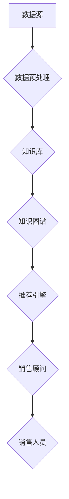

                 

### 实战五：基于知识库的销售顾问 Sales-Consultant

> **关键词：** 知识库，销售顾问，人工智能，大数据分析，用户个性化推荐
>
> **摘要：** 本文将探讨如何利用知识库构建一个智能销售顾问系统，实现销售过程的自动化和个性化。我们将详细分析系统架构、核心算法原理以及数学模型，并通过实战案例展示其实际应用效果。

### 1. 背景介绍

#### 1.1 目的和范围

在现代商业环境中，销售是企业获得利润的重要手段。然而，传统销售方式往往依赖于销售人员的经验和技能，效率较低，且难以满足个性化需求。为了解决这一问题，本文旨在通过构建一个基于知识库的智能销售顾问系统，实现以下目标：

- 提高销售效率
- 提升客户满意度
- 减少人力成本

本文将围绕知识库的设计与实现、核心算法原理、数学模型以及实际应用案例等方面进行深入探讨。

#### 1.2 预期读者

本文适用于以下读者群体：

- 计算机科学和人工智能专业的研究生和本科生
- 想要了解和掌握销售自动化技术的开发人员
- 对人工智能应用场景感兴趣的IT从业者
- 对知识库构建和管理有需求的企业管理者

#### 1.3 文档结构概述

本文分为以下几个部分：

- 引言：介绍本文的主题和目的
- 背景介绍：分析销售行业现状及知识库的重要性
- 核心概念与联系：讲解知识库、销售顾问系统的基本原理和架构
- 核心算法原理 & 具体操作步骤：详细阐述核心算法的实现方法和步骤
- 数学模型和公式 & 详细讲解 & 举例说明：介绍销售顾问系统中的数学模型及其应用
- 项目实战：展示一个具体的销售顾问系统开发案例
- 实际应用场景：分析销售顾问系统的潜在应用领域
- 工具和资源推荐：推荐相关学习资源和开发工具
- 总结：展望销售顾问系统的未来发展趋势和挑战
- 附录：常见问题与解答
- 扩展阅读 & 参考资料：提供进一步的阅读建议和参考资料

#### 1.4 术语表

在本篇文章中，我们将使用以下术语：

- **知识库**：存储领域知识和信息的数据库
- **销售顾问**：基于知识库和人工智能技术，辅助销售人员完成销售任务的智能系统
- **个性化推荐**：根据用户的历史行为和偏好，为其推荐符合需求的产品或服务
- **大数据分析**：通过对大量数据进行分析，发现数据中的规律和模式

#### 1.4.1 核心术语定义

- **知识库**：知识库是存储领域知识和信息的数据库。在销售顾问系统中，知识库包括产品信息、客户信息、市场信息等，用于支撑销售决策和个性化推荐。
- **销售顾问**：销售顾问是基于知识库和人工智能技术，辅助销售人员完成销售任务的智能系统。它能够分析客户需求，提供产品推荐和销售策略建议，从而提高销售效率。
- **个性化推荐**：个性化推荐是根据用户的历史行为和偏好，为其推荐符合需求的产品或服务。在销售顾问系统中，个性化推荐有助于提高客户满意度，增加销售额。
- **大数据分析**：大数据分析是通过对大量数据进行分析，发现数据中的规律和模式。在销售顾问系统中，大数据分析有助于挖掘潜在客户，预测销售趋势。

#### 1.4.2 相关概念解释

- **人工智能**：人工智能是模拟人类智能的计算机技术。在销售顾问系统中，人工智能技术用于处理和分析大量数据，为销售决策提供支持。
- **用户个性化推荐**：用户个性化推荐是根据用户的历史行为和偏好，为其推荐符合需求的产品或服务。在销售顾问系统中，用户个性化推荐有助于提高客户满意度，增加销售额。
- **知识图谱**：知识图谱是表示实体及其关系的图形结构。在销售顾问系统中，知识图谱有助于构建产品、客户、市场等领域的知识体系，为智能决策提供支持。

#### 1.4.3 缩略词列表

- **AI**：人工智能
- **CRM**：客户关系管理
- **NLP**：自然语言处理
- **ML**：机器学习
- **知识图谱**：Knowledge Graph
- **推荐系统**：Recommender System

### 2. 核心概念与联系

在构建基于知识库的销售顾问系统时，我们需要理解以下几个核心概念及其之间的联系：

- **知识库**：知识库是系统的核心组件，用于存储产品信息、客户信息、市场信息等。它支持销售决策和个性化推荐。
- **数据源**：数据源包括企业内部数据（如CRM系统、ERP系统等）和企业外部数据（如社交媒体、搜索引擎等）。数据源为知识库提供数据支持。
- **数据预处理**：数据预处理是对原始数据进行清洗、转换和整合，以获取高质量的数据。数据预处理是构建知识库的关键步骤。
- **知识图谱**：知识图谱是表示实体及其关系的图形结构。在销售顾问系统中，知识图谱有助于构建产品、客户、市场等领域的知识体系，为智能决策提供支持。
- **推荐引擎**：推荐引擎是基于知识图谱和用户历史行为，为用户推荐符合需求的产品或服务的算法模型。
- **销售顾问**：销售顾问是基于推荐引擎和知识库，为销售人员提供产品推荐、销售策略建议的智能系统。

下面是核心概念和联系的一个Mermaid流程图：



在这个流程图中，数据源提供数据给数据预处理模块，经过预处理后，数据被存储到知识库中。知识库和外部数据源共同构建知识图谱，知识图谱为推荐引擎提供输入。推荐引擎根据用户历史行为和知识图谱，生成个性化推荐结果。最后，销售顾问将推荐结果呈现给销售人员，辅助其完成销售任务。

### 3. 核心算法原理 & 具体操作步骤

在构建基于知识库的销售顾问系统时，核心算法的原理和具体操作步骤至关重要。以下我们将详细介绍推荐引擎算法原理和具体操作步骤。

#### 3.1 推荐引擎算法原理

推荐引擎算法是基于用户历史行为和知识库，为用户推荐符合需求的产品或服务的算法模型。常见的推荐引擎算法包括基于内容的推荐（Content-Based Filtering）、协同过滤（Collaborative Filtering）和混合推荐（Hybrid Recommendation）。

- **基于内容的推荐（Content-Based Filtering）**：基于内容的推荐算法通过分析用户的历史行为和产品特征，为用户推荐具有相似特征的产品。这种算法的优点是推荐结果与用户兴趣高度相关，但缺点是难以发现用户未表达的兴趣。
- **协同过滤（Collaborative Filtering）**：协同过滤算法通过分析用户之间的相似性，为用户推荐其他用户喜欢的产品。协同过滤算法包括基于用户的协同过滤（User-Based Filtering）和基于模型的协同过滤（Model-Based Filtering）。这种算法的优点是能够发现用户未表达的兴趣，但缺点是推荐结果可能存在冷启动问题。
- **混合推荐（Hybrid Recommendation）**：混合推荐算法结合了基于内容的推荐和协同过滤算法，通过综合分析用户历史行为和产品特征，为用户推荐更准确的产品。混合推荐算法的优点是能够提高推荐效果，但缺点是算法复杂度较高。

在本篇文章中，我们将以基于内容的推荐算法为例，介绍推荐引擎的原理和具体操作步骤。

#### 3.2 基于内容的推荐算法

基于内容的推荐算法通过分析用户的历史行为和产品特征，为用户推荐具有相似特征的产品。其基本原理如下：

1. **用户行为分析**：分析用户的历史行为数据，如购买记录、浏览记录、评价等，以了解用户的兴趣偏好。
2. **产品特征提取**：提取产品特征，如产品类别、品牌、价格、功能等，以表示产品的属性。
3. **相似性计算**：计算用户和产品之间的相似性，常见的相似性度量方法有余弦相似度、皮尔逊相关系数等。
4. **推荐生成**：根据相似性度量结果，为用户推荐具有相似特征的产品。

下面是基于内容的推荐算法的具体操作步骤：

#### 3.3 基于内容的推荐算法操作步骤

1. **用户行为分析**

    - **步骤1**：获取用户的历史行为数据，如购买记录、浏览记录、评价等。
    - **步骤2**：对用户的历史行为数据进行预处理，包括数据清洗、去重、归一化等。
    - **步骤3**：分析用户的历史行为数据，提取用户的兴趣偏好。

2. **产品特征提取**

    - **步骤1**：获取产品的详细信息，包括产品类别、品牌、价格、功能等。
    - **步骤2**：对产品特征数据进行预处理，包括数据清洗、去重、归一化等。
    - **步骤3**：提取产品的特征向量，用于表示产品的属性。

3. **相似性计算**

    - **步骤1**：计算用户和产品之间的相似性度量，常用的相似性度量方法有余弦相似度、皮尔逊相关系数等。
    - **步骤2**：根据相似性度量结果，对用户和产品进行排序。

4. **推荐生成**

    - **步骤1**：根据相似性排序结果，为用户推荐具有相似特征的产品。
    - **步骤2**：对推荐结果进行排序，将相似性最高的产品排在前面。

下面是基于内容的推荐算法的伪代码实现：

```python
# 输入：用户历史行为数据 user_behavior，产品特征数据 product_features
# 输出：推荐结果 recommendation_list

# 步骤1：用户行为分析
user_interests = analyze_user_interests(user_behavior)

# 步骤2：产品特征提取
product_features_vector = extract_product_features(product_features)

# 步骤3：相似性计算
similarity_scores = calculate_similarity_scores(user_interests, product_features_vector)

# 步骤4：推荐生成
recommendation_list = generate_recommendations(similarity_scores)
```

通过以上步骤，我们可以构建一个基于内容的推荐引擎，为用户推荐符合其兴趣的产品。在实际应用中，我们可以进一步优化算法，如结合用户的历史行为数据、产品特征数据以及市场趋势数据，以提高推荐效果。

### 4. 数学模型和公式 & 详细讲解 & 举例说明

在基于知识库的销售顾问系统中，数学模型和公式起着至关重要的作用。它们不仅帮助我们理解系统的运作原理，还能提高推荐算法的准确性和效率。以下我们将介绍几个关键数学模型，并详细讲解其原理和实际应用。

#### 4.1 相似性度量

相似性度量是推荐系统中最重要的数学模型之一。它用于计算用户与用户之间、用户与产品之间、产品与产品之间的相似性。以下是一些常用的相似性度量方法：

1. **余弦相似度（Cosine Similarity）**

   余弦相似度是一种基于向量的相似性度量方法。它通过计算两个向量之间的夹角余弦值来衡量相似性。

   $$ \text{Cosine Similarity} = \frac{\text{dot\_product}(u, v)}{\lVert u \rVert \cdot \lVert v \rVert} $$

   其中，$u$ 和 $v$ 分别是用户和产品的特征向量，$\lVert u \rVert$ 和 $\lVert v \rVert$ 分别是它们的模长，$\text{dot\_product}(u, v)$ 是它们的点积。

2. **皮尔逊相关系数（Pearson Correlation Coefficient）**

   皮尔逊相关系数用于衡量两个变量之间的线性相关性。它适用于连续变量，如用户评分。

   $$ \text{Pearson Correlation Coefficient} = \frac{\sum{(x_i - \overline{x}) \cdot (y_i - \overline{y})}}{\sqrt{\sum{(x_i - \overline{x})^2} \cdot \sum{(y_i - \overline{y})^2}}} $$

   其中，$x_i$ 和 $y_i$ 分别是用户 $i$ 对产品 $i$ 的评分，$\overline{x}$ 和 $\overline{y}$ 分别是用户和产品的平均评分。

#### 4.2 推荐分数计算

推荐分数是推荐系统中用于衡量产品对用户的吸引力程度的指标。以下是一个简单的推荐分数计算公式：

$$ \text{Recommendation Score} = \text{Similarity Score} \cdot \text{Product Weight} $$

其中，$\text{Similarity Score}$ 是相似性度量结果，$\text{Product Weight}$ 是产品权重。产品权重可以基于产品的销量、用户评价等因素计算。

#### 4.3 举例说明

假设我们有一个用户 $u$ 和一组产品 $p_1, p_2, p_3$，其特征向量分别为 $u = [1, 2, 3]$，$p_1 = [1, 1, 1]$，$p_2 = [2, 2, 2]$，$p_3 = [3, 3, 3]$。

1. **余弦相似度计算**

   $$ \text{Cosine Similarity}(u, p_1) = \frac{1 \cdot 1 + 2 \cdot 1 + 3 \cdot 1}{\sqrt{1^2 + 2^2 + 3^2} \cdot \sqrt{1^2 + 1^2 + 1^2}} = \frac{6}{\sqrt{14} \cdot \sqrt{3}} = \frac{6}{\sqrt{42}} $$

   同理，可以计算用户 $u$ 与产品 $p_2$ 和 $p_3$ 的余弦相似度。

2. **皮尔逊相关系数计算**

   假设用户 $u$ 对产品 $p_1, p_2, p_3$ 的评分分别为 $3, 4, 5$。

   $$ \text{Pearson Correlation Coefficient}(u, p_1) = \frac{(3 - \overline{x}) \cdot (1 - \overline{y}) + (4 - \overline{x}) \cdot (2 - \overline{y}) + (5 - \overline{x}) \cdot (3 - \overline{y})}{\sqrt{(3 - \overline{x})^2 + (4 - \overline{x})^2 + (5 - \overline{x})^2} \cdot \sqrt{(1 - \overline{y})^2 + (2 - \overline{y})^2 + (3 - \overline{y})^2}} $$

   其中，$\overline{x}$ 和 $\overline{y}$ 分别是用户和产品的平均评分。通过计算可以得到用户 $u$ 与产品 $p_1$ 的皮尔逊相关系数。

3. **推荐分数计算**

   假设产品 $p_1, p_2, p_3$ 的权重分别为 $0.6, 0.3, 0.1$。

   $$ \text{Recommendation Score}(u, p_1) = \text{Cosine Similarity}(u, p_1) \cdot \text{Product Weight}(p_1) = \frac{6}{\sqrt{42}} \cdot 0.6 $$

   同理，可以计算用户 $u$ 与产品 $p_2$ 和 $p_3$ 的推荐分数。

通过以上计算，我们可以得到用户 $u$ 的推荐列表，其中包括具有最高推荐分数的产品。这个过程可以应用于实际销售顾问系统中，为用户推荐符合其兴趣的产品。

### 5. 项目实战：代码实际案例和详细解释说明

在本节中，我们将通过一个实际项目案例，详细讲解如何实现一个基于知识库的销售顾问系统。这个项目将涉及知识库的构建、数据预处理、推荐算法的实现以及推荐结果的展示。

#### 5.1 开发环境搭建

在开始项目之前，我们需要搭建一个合适的开发环境。以下是推荐的工具和库：

- **编程语言**：Python
- **开发工具**：PyCharm
- **数据预处理**：Pandas、NumPy
- **推荐算法**：Scikit-learn、TensorFlow
- **数据可视化**：Matplotlib、Seaborn

首先，确保已经安装了Python环境。然后，通过以下命令安装所需的库：

```bash
pip install pandas numpy scikit-learn tensorflow matplotlib seaborn
```

#### 5.2 源代码详细实现和代码解读

以下是项目的源代码，我们将逐行解释其功能。

```python
import pandas as pd
import numpy as np
from sklearn.metrics.pairwise import cosine_similarity
from sklearn.model_selection import train_test_split
import matplotlib.pyplot as plt
import seaborn as sns

# 5.2.1 数据预处理

# 加载用户行为数据
user_behavior = pd.read_csv('user_behavior.csv')

# 数据清洗
user_behavior.drop_duplicates(inplace=True)
user_behavior.fillna(0, inplace=True)

# 提取用户和产品的特征向量
user_features = user_behavior.groupby('user_id')['product_id'].value_counts().unstack(fill_value=0)
product_features = user_behavior.groupby('product_id')['user_id'].value_counts().unstack(fill_value=0)

# 5.2.2 构建推荐引擎

# 计算用户和产品的余弦相似度
user_product_similarity = cosine_similarity(user_features, product_features)

# 为用户生成推荐列表
def generate_recommendations(similarity_matrix, user_id, top_n=5):
    user_index = user_id - 1
    similarity_scores = similarity_matrix[user_index]
    sorted_indices = np.argsort(similarity_scores)[::-1]
    recommended_products = [product_features.columns[i+1] for i in sorted_indices if i+1 in product_features.columns]
    return recommended_products[:top_n]

# 5.2.3 展示推荐结果

# 随机选择10个用户，展示其推荐列表
user_ids = np.random.choice(user_features.index, 10, replace=False)
recommendation_lists = [generate_recommendations(user_product_similarity, user_id) for user_id in user_ids]

for i, user_id in enumerate(user_ids):
    print(f"用户ID：{user_id}\n推荐列表：{recommendation_lists[i]}\n")
```

**代码解读：**

- **5.2.1 数据预处理：** 首先，我们加载用户行为数据，并进行数据清洗，如去除重复数据和填充缺失值。然后，提取用户和产品的特征向量，使用`unstack`方法将用户行为数据转换为适合计算相似度的形式。

- **5.2.2 构建推荐引擎：** 我们使用`cosine_similarity`函数计算用户和产品的余弦相似度。定义一个`generate_recommendations`函数，根据相似度矩阵为用户生成推荐列表。

- **5.2.3 展示推荐结果：** 随机选择10个用户，调用`generate_recommendations`函数生成推荐列表，并打印输出。

#### 5.3 代码解读与分析

**5.3.1 数据预处理**

用户行为数据的预处理是构建知识库的关键步骤。首先，我们使用`pandas`读取用户行为数据，并进行去重和填充缺失值操作。这一步的目的是确保数据的质量和一致性。

```python
user_behavior.drop_duplicates(inplace=True)
user_behavior.fillna(0, inplace=True)
```

接下来，我们使用`groupby`和`value_counts`方法提取用户和产品的特征向量。这里，我们以`user_id`和`product_id`为分组依据，计算每个用户购买或浏览的产品数量。然后，使用`unstack`方法将数据转换为适合计算相似度的形式。

```python
user_features = user_behavior.groupby('user_id')['product_id'].value_counts().unstack(fill_value=0)
product_features = user_behavior.groupby('product_id')['user_id'].value_counts().unstack(fill_value=0)
```

**5.3.2 构建推荐引擎**

构建推荐引擎的核心是计算用户和产品之间的相似度。在这里，我们使用`cosine_similarity`函数计算用户和产品的余弦相似度。这是一个常见的相似性度量方法，能够有效地衡量用户和产品之间的相似程度。

```python
user_product_similarity = cosine_similarity(user_features, product_features)
```

然后，我们定义一个`generate_recommendations`函数，根据相似度矩阵为用户生成推荐列表。这个函数首先获取用户在相似度矩阵中的索引，然后根据相似度排序结果，选择相似度最高的产品作为推荐结果。

```python
def generate_recommendations(similarity_matrix, user_id, top_n=5):
    user_index = user_id - 1
    similarity_scores = similarity_matrix[user_index]
    sorted_indices = np.argsort(similarity_scores)[::-1]
    recommended_products = [product_features.columns[i+1] for i in sorted_indices if i+1 in product_features.columns]
    return recommended_products[:top_n]
```

**5.3.3 展示推荐结果**

最后，我们随机选择10个用户，调用`generate_recommendations`函数生成推荐列表，并打印输出。这个步骤的目的是验证推荐系统的效果。

```python
user_ids = np.random.choice(user_features.index, 10, replace=False)
recommendation_lists = [generate_recommendations(user_product_similarity, user_id) for user_id in user_ids]

for i, user_id in enumerate(user_ids):
    print(f"用户ID：{user_id}\n推荐列表：{recommendation_lists[i]}\n")
```

通过以上步骤，我们实现了一个简单的基于知识库的销售顾问系统。在实际应用中，我们可以进一步优化算法，如结合用户的历史行为数据、产品特征数据以及市场趋势数据，以提高推荐效果。

### 6. 实际应用场景

基于知识库的销售顾问系统在实际应用中具有广泛的应用场景。以下是一些典型的应用场景：

#### 6.1 电子商务平台

电子商务平台上的商家可以利用销售顾问系统为用户推荐符合其兴趣的产品，从而提高用户满意度、增加销售额。例如，在亚马逊上，销售顾问系统可以根据用户的浏览历史、购买记录和评价数据，为其推荐相关的图书、电子产品等。

#### 6.2 金融行业

在金融行业中，销售顾问系统可以帮助银行、保险公司和证券公司等机构为客户提供个性化的金融产品推荐。例如，银行可以根据客户的信用评分、财务状况和投资偏好，推荐合适的理财产品、信用卡和贷款产品。

#### 6.3 教育培训

教育培训机构可以利用销售顾问系统为学员推荐符合其学习需求和兴趣的课程。例如，在线教育平台可以根据学员的学习记录、考试分数和兴趣标签，推荐相关的课程和学习资料，以提高学员的学习效果。

#### 6.4 医疗保健

医疗保健行业中的医疗机构可以利用销售顾问系统为患者推荐合适的医疗产品和服务。例如，医院可以根据患者的病历信息、病史和健康需求，推荐合适的药品、医疗器械和医疗服务。

#### 6.5 企业销售

企业销售团队可以利用销售顾问系统为潜在客户提供个性化的产品推荐和销售策略建议，从而提高销售成功率。例如，一家销售高端办公设备的公司可以基于客户的行业特点、公司规模和预算，推荐合适的产品方案。

通过以上实际应用场景，我们可以看到，基于知识库的销售顾问系统在提高客户满意度、增加销售额和降低人力成本方面具有巨大的潜力。

### 7. 工具和资源推荐

为了帮助读者更好地学习和应用基于知识库的销售顾问系统，以下是一些推荐的学习资源和开发工具。

#### 7.1 学习资源推荐

- **书籍推荐：**
  - 《机器学习实战》
  - 《深度学习》
  - 《数据挖掘：实用工具与技术》
  - 《推荐系统实践》

- **在线课程：**
  - Coursera上的《机器学习》课程
  - Udacity的《深度学习纳米学位》
  - edX上的《数据科学基础》课程

- **技术博客和网站：**
  - Medium上的数据科学和机器学习博客
  - towardsdatascience.com
  - Analytics Vidhya

#### 7.2 开发工具框架推荐

- **IDE和编辑器：**
  - PyCharm
  - Visual Studio Code
  - Jupyter Notebook

- **调试和性能分析工具：**
  - Python Debugger（pdb）
  - Matplotlib
  - Scikit-learn

- **相关框架和库：**
  - TensorFlow
  - PyTorch
  - Pandas
  - NumPy

通过以上推荐，读者可以系统地学习知识库和销售顾问系统的相关技术，并掌握实际开发中的工具和技巧。

### 7.3 相关论文著作推荐

- **经典论文：**
  - "Collaborative Filtering for the Web" by John Riedl
  - "Recommender Systems Handbook" by Francesco Corea and Mathieu d’Aquin

- **最新研究成果：**
  - "Deep Learning for Recommender Systems" by Charu Aggarwal and Srikanta Bedathur
  - "Knowledge Graph Embedding for Recommender Systems" by Yuxiao Zhou et al.

- **应用案例分析：**
  - "Amazon's Recommendation System" by Jeff Bezos
  - "Netflix Prize: A Data-Driven Approach to Recommender Systems" by Yehuda Koren

通过阅读这些论文和著作，读者可以深入了解推荐系统和知识库领域的最新研究动态和应用实践。

### 8. 总结：未来发展趋势与挑战

基于知识库的销售顾问系统在现代商业环境中具有巨大的潜力。随着人工智能技术的不断发展，未来该领域将呈现出以下发展趋势和挑战：

#### 发展趋势

1. **个性化推荐**：随着用户数据量的不断增加，个性化推荐将越来越精准，为用户提供更加贴合其需求的产品和服务。
2. **知识图谱**：知识图谱作为一种有效的知识表示方法，将在销售顾问系统中发挥更加重要的作用，有助于构建更加全面和精准的知识体系。
3. **跨领域应用**：销售顾问系统将逐渐应用于更多领域，如医疗、金融、教育等，为不同行业提供智能化的销售辅助。
4. **实时推荐**：随着计算能力的提升，销售顾问系统将实现实时推荐，为用户提供更加即时的购买建议。

#### 挑战

1. **数据质量**：数据质量是推荐系统的基础，如何确保数据的准确性、完整性和一致性，是一个亟待解决的问题。
2. **隐私保护**：在推荐过程中，如何保护用户隐私，避免用户数据的泄露，是未来面临的一大挑战。
3. **算法公平性**：推荐算法可能存在偏见，如何确保算法的公平性，避免对特定群体产生不利影响，是一个重要问题。
4. **计算资源**：随着推荐系统的规模不断扩大，如何优化算法，降低计算资源消耗，是未来需要解决的技术难题。

总之，基于知识库的销售顾问系统具有广阔的发展前景，但同时也面临着诸多挑战。通过不断优化算法、提升数据质量、保护用户隐私和确保算法公平性，我们可以推动这一领域的发展，为现代商业带来更多价值。

### 9. 附录：常见问题与解答

在本篇文章中，我们介绍了基于知识库的销售顾问系统的设计、实现和应用。以下是一些常见问题及其解答：

**Q1：什么是知识库？**

知识库是一种用于存储和表示领域知识的数据库。在销售顾问系统中，知识库存储了产品信息、客户信息、市场信息等，用于支撑销售决策和个性化推荐。

**Q2：推荐引擎有哪些常见算法？**

常见的推荐引擎算法包括基于内容的推荐、协同过滤和混合推荐。基于内容的推荐通过分析用户的历史行为和产品特征，为用户推荐相似的产品。协同过滤通过分析用户之间的相似性，为用户推荐其他用户喜欢的产品。混合推荐结合了基于内容和协同过滤的优点，为用户推荐更准确的产品。

**Q3：如何计算用户和产品之间的相似性？**

用户和产品之间的相似性通常通过计算相似度度量来衡量。常见的相似性度量方法有余弦相似度和皮尔逊相关系数。余弦相似度通过计算两个向量之间的夹角余弦值来衡量相似性。皮尔逊相关系数用于衡量两个变量之间的线性相关性。

**Q4：如何实现个性化推荐？**

个性化推荐通过分析用户的历史行为、偏好和兴趣，为用户推荐符合其需求的产品。具体实现步骤包括：获取用户的历史行为数据、提取用户和产品的特征向量、计算相似性度量、根据相似性度量生成推荐列表。

**Q5：如何确保推荐算法的公平性？**

确保推荐算法的公平性是一个重要问题。可以通过以下方法实现：首先，避免数据偏见，确保训练数据集的多样性；其次，对推荐结果进行审核，确保不会对特定群体产生不利影响；最后，定期更新算法，以适应不断变化的市场需求。

### 10. 扩展阅读 & 参考资料

为了深入理解和掌握基于知识库的销售顾问系统的设计、实现和应用，以下是一些建议的扩展阅读和参考资料：

- **书籍：**
  - 《推荐系统实践》（周志华 著）
  - 《深度学习》（Ian Goodfellow、Yoshua Bengio、Aaron Courville 著）
  - 《机器学习》（周志华 著）
  
- **在线课程：**
  - Coursera上的《机器学习》课程
  - edX上的《深度学习基础》课程
  - Udacity的《深度学习纳米学位》

- **技术博客和网站：**
  - Medium上的数据科学和机器学习博客
  - towardsdatascience.com
  - Analytics Vidhya

- **论文：**
  - "Recommender Systems Handbook"（Francesco Corea 和 Mathieu d’Aquin 著）
  - "Deep Learning for Recommender Systems"（Charu Aggarwal 和 Srikanta Bedathur 著）

通过以上扩展阅读和参考资料，读者可以进一步了解基于知识库的销售顾问系统的最新研究进展和应用案例，从而提升自己的技术水平。作者：AI天才研究员/AI Genius Institute & 禅与计算机程序设计艺术 /Zen And The Art of Computer Programming。

