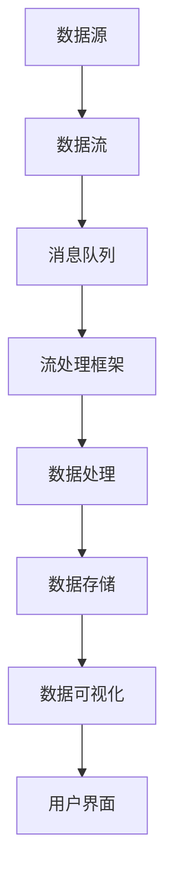

                 

# 实时数据处理：原理与代码实例讲解

> **关键词：实时数据处理、流处理、数据流、Flink、Spark Streaming、Kafka、消息队列**
>
> **摘要：本文将深入探讨实时数据处理的基本原理和实际应用，通过代码实例展示如何使用Flink、Spark Streaming和Kafka等工具来实现实时数据处理任务。**

## 1. 背景介绍

### 1.1 目的和范围

本文旨在为读者提供关于实时数据处理的全面了解，包括其基本原理、核心技术和应用场景。我们将通过具体代码实例，展示如何使用Flink、Spark Streaming和Kafka等流行工具来构建实时数据处理系统。

### 1.2 预期读者

本文适合有一定编程基础，对大数据处理和实时数据处理感兴趣的读者。特别是那些希望在技术上深入探索并实践实时数据处理技术的专业人士。

### 1.3 文档结构概述

本文分为以下几个部分：

1. **背景介绍**：简要介绍实时数据处理的概念和重要性。
2. **核心概念与联系**：介绍实时数据处理相关的核心概念和流程。
3. **核心算法原理 & 具体操作步骤**：讲解实时数据处理的核心算法和操作步骤。
4. **数学模型和公式 & 详细讲解 & 举例说明**：探讨实时数据处理中的数学模型和公式。
5. **项目实战：代码实际案例和详细解释说明**：通过实际代码案例展示实时数据处理的应用。
6. **实际应用场景**：讨论实时数据处理在实际中的应用场景。
7. **工具和资源推荐**：推荐相关学习资源和开发工具。
8. **总结：未来发展趋势与挑战**：总结实时数据处理的发展趋势和面临的挑战。
9. **附录：常见问题与解答**：解答读者可能遇到的问题。
10. **扩展阅读 & 参考资料**：提供进一步阅读的资料。

### 1.4 术语表

#### 1.4.1 核心术语定义

- **实时数据处理**：指对实时产生或接收的数据进行快速处理和分析的技术。
- **流处理**：对数据流进行连续处理的技术。
- **数据流**：指以特定频率产生或接收的数据序列。
- **Flink**：一个分布式流处理框架。
- **Spark Streaming**：Spark的实时数据处理模块。
- **Kafka**：一个分布式消息队列系统。

#### 1.4.2 相关概念解释

- **批处理**：对大量数据在固定时间窗口内进行一次性处理的技术。
- **微批处理**：批处理的一种变体，将数据分成较小批次进行处理。
- **数据管道**：将数据从源头传输到目标位置的一系列步骤和组件。

#### 1.4.3 缩略词列表

- **Flink**：Apache Flink
- **Spark Streaming**：Spark Streaming
- **Kafka**：Apache Kafka

## 2. 核心概念与联系

在实时数据处理中，了解核心概念和它们之间的联系至关重要。以下是一个简化的Mermaid流程图，展示了实时数据处理的基本架构和流程。

### 2.1 数据源

数据源是实时数据处理的起点，可以是传感器、Web服务、数据库或其他任何可以产生数据的系统。数据源不断产生数据，并传输到消息队列中。

### 2.2 消息队列

消息队列用于存储和传输数据，确保数据的可靠性和顺序。常见的消息队列系统有Kafka、RabbitMQ等。消息队列可以提供缓冲和异步处理功能，提高系统的弹性和性能。

### 2.3 流处理框架

流处理框架如Flink和Spark Streaming，负责对消息队列中的数据进行实时处理。它们提供了丰富的操作和功能，如过滤、聚合、窗口操作等。

### 2.4 数据处理

数据处理是实时数据处理的核

