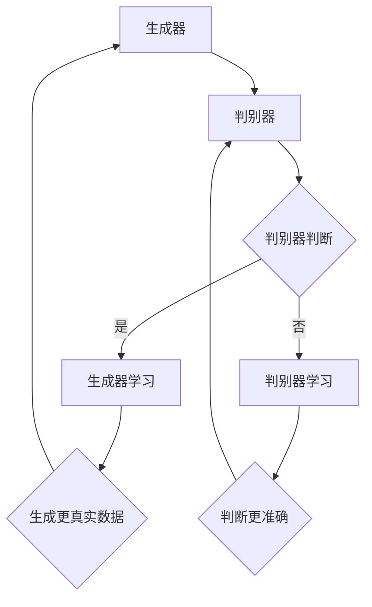

                 


# 对抗学习在大模型鲁棒性提升中的应用

> 关键词：对抗学习、大模型、鲁棒性、神经网络、安全、隐私保护
>
> 摘要：本文深入探讨了对抗学习在大模型鲁棒性提升中的应用。通过详细阐述对抗学习的基本原理、核心算法原理、数学模型和具体操作步骤，并结合实际项目案例，本文展示了如何通过对抗学习提升大模型的鲁棒性，以应对现实世界的复杂和不确定性。

## 1. 背景介绍

### 1.1 目的和范围

本文旨在探讨对抗学习在大模型鲁棒性提升中的应用，旨在为研究人员和开发人员提供一套系统性的方法和实践指导。文章将涵盖以下内容：

- 对抗学习的定义和基本原理
- 大模型鲁棒性面临的挑战
- 对抗学习在提升大模型鲁棒性中的具体应用
- 实际项目案例和代码实现

### 1.2 预期读者

- 对计算机科学和人工智能领域感兴趣的读者
- 想要提升大模型鲁棒性的研究人员和开发人员
- 在对抗学习和神经网络方面有基础的读者

### 1.3 文档结构概述

本文将按照以下结构进行组织：

- 第1部分：背景介绍，包括目的和范围、预期读者、文档结构概述
- 第2部分：核心概念与联系，介绍对抗学习的基本原理和大模型鲁棒性
- 第3部分：核心算法原理与具体操作步骤，详细解释对抗学习的具体实现方法
- 第4部分：数学模型和公式，解释对抗学习中的数学模型和公式
- 第5部分：项目实战，通过实际案例展示对抗学习在大模型鲁棒性提升中的应用
- 第6部分：实际应用场景，探讨对抗学习的实际应用场景
- 第7部分：工具和资源推荐，推荐相关学习资源和开发工具
- 第8部分：总结，讨论未来发展趋势与挑战
- 第9部分：附录，提供常见问题与解答
- 第10部分：扩展阅读，提供更多参考资料

### 1.4 术语表

#### 1.4.1 核心术语定义

- **对抗学习（Adversarial Learning）**：一种通过生成对抗性样本来提升模型鲁棒性的机器学习技术。
- **大模型（Large Model）**：指具有大量参数和复杂结构的神经网络模型。
- **鲁棒性（Robustness）**：模型在面临噪声、异常数据、对抗性样本等情况下的表现能力。
- **对抗性样本（Adversarial Example）**：指通过特定算法生成的、能够欺骗模型正常分类的数据样本。

#### 1.4.2 相关概念解释

- **神经网络（Neural Network）**：一种由大量神经元组成的计算模型，能够模拟人脑的决策过程。
- **深度学习（Deep Learning）**：一种基于神经网络的机器学习方法，能够处理大量复杂的数据。
- **梯度下降（Gradient Descent）**：一种优化算法，通过计算损失函数的梯度来更新模型参数。

#### 1.4.3 缩略词列表

- **GAN（Generative Adversarial Network）**：生成对抗网络
- **ReLU（Rectified Linear Unit）**：修正线性单元
- **ReLU6**：限制在[-6, 6]的ReLU函数
- **SGD（Stochastic Gradient Descent）**：随机梯度下降

## 2. 核心概念与联系

### 2.1 对抗学习的基本原理

对抗学习是一种通过对抗性训练来提升模型鲁棒性的方法。其基本原理是利用生成器（Generator）和判别器（Discriminator）之间的对抗关系，不断优化两个模型，从而提升模型的整体性能。

#### Mermaid 流程图



### 2.2 大模型鲁棒性面临的挑战

随着神经网络模型的规模不断扩大，大模型鲁棒性面临着诸多挑战，包括：

- **过拟合**：模型在训练数据上表现良好，但在未知数据上表现不佳。
- **对抗性攻击**：通过对抗性样本欺骗模型，导致模型分类错误。
- **数据噪声**：模型在处理噪声数据时容易发生误判。

### 2.3 对抗学习在大模型鲁棒性提升中的应用

对抗学习通过以下方法提升大模型鲁棒性：

- **生成对抗性样本**：生成器生成对抗性样本，挑战判别器判断能力。
- **优化模型参数**：通过对抗性训练，不断优化模型参数，提高模型鲁棒性。

## 3. 核心算法原理 & 具体操作步骤

### 3.1 对抗学习算法原理

对抗学习主要由生成器和判别器两个模型组成，两者通过对抗训练相互优化。

#### 生成器（Generator）模型

生成器模型的目标是生成对抗性样本，以欺骗判别器。生成器通常采用多层感知机（MLP）或卷积神经网络（CNN）结构。

```python
# 生成器模型伪代码
def generator(z):
    # z 为随机噪声
    x = MLP([z, z^2, z^3], activation='ReLU6')
    x = MLP([x, x^2, x^3], activation='softmax')
    return x
```

#### 判别器（Discriminator）模型

判别器模型的目标是判断输入数据是真实样本还是生成器生成的对抗性样本。

```python
# 判别器模型伪代码
def discriminator(x):
    y = MLP([x, x^2, x^3], activation='ReLU6')
    y = MLP([y, y^2, y^3], activation='sigmoid')
    return y
```

### 3.2 对抗训练步骤

对抗训练分为以下几个步骤：

1. **初始化生成器和判别器模型**：随机初始化生成器和判别器模型参数。
2. **生成对抗性样本**：使用生成器生成对抗性样本。
3. **训练判别器模型**：使用真实样本和对抗性样本训练判别器模型。
4. **训练生成器模型**：使用对抗性样本训练生成器模型，以欺骗判别器模型。

### 3.3 梯度下降优化

对抗训练采用梯度下降算法来优化模型参数。具体步骤如下：

1. **计算损失函数**：损失函数包括判别器损失函数和生成器损失函数。
    - 判别器损失函数：最大化判别器对真实样本和对抗性样本的判断能力。
    - 生成器损失函数：最小化生成器生成的对抗性样本被判别器判断为真实样本的概率。
2. **计算梯度**：计算判别器和生成器的损失函数梯度。
3. **更新参数**：使用梯度下降算法更新模型参数。

## 4. 数学模型和公式 & 详细讲解 & 举例说明

### 4.1 损失函数

对抗学习的损失函数主要由两部分组成：判别器损失函数和生成器损失函数。

#### 判别器损失函数

判别器损失函数用于衡量判别器对真实样本和对抗性样本的判断能力。具体公式如下：

$$
L_D(\theta_D) = - \sum_{x \in X} [y(x) \cdot \log(D(x)) + (1 - y(x)) \cdot \log(1 - D(x))]
$$

其中，$X$ 为样本集合，$y(x)$ 为真实标签，$D(x)$ 为判别器对样本 $x$ 的判断概率。

#### 生成器损失函数

生成器损失函数用于衡量生成器生成对抗性样本的能力。具体公式如下：

$$
L_G(\theta_G) = - \sum_{z} [\log(D(G(z))]
$$

其中，$z$ 为随机噪声，$G(z)$ 为生成器生成的对抗性样本。

### 4.2 梯度下降算法

梯度下降算法用于优化模型参数，以最小化损失函数。具体步骤如下：

1. **计算损失函数梯度**：
    - 判别器损失函数梯度：
    $$ \frac{\partial L_D(\theta_D)}{\partial \theta_D} $$
    - 生成器损失函数梯度：
    $$ \frac{\partial L_G(\theta_G)}{\partial \theta_G} $$
2. **更新模型参数**：
    - 判别器参数更新：
    $$ \theta_D = \theta_D - \alpha \cdot \frac{\partial L_D(\theta_D)}{\partial \theta_D} $$
    - 生成器参数更新：
    $$ \theta_G = \theta_G - \alpha \cdot \frac{\partial L_G(\theta_G)}{\partial \theta_G} $$

其中，$\alpha$ 为学习率。

### 4.3 举例说明

假设有一个二分类问题，生成器生成对抗性样本，判别器判断样本为真实样本或对抗性样本。

- **真实样本**：$x_1 = [0.1, 0.9]$
- **对抗性样本**：$x_2 = [0.9, 0.1]$

1. **初始化模型参数**：
    - 判别器参数：$\theta_D = [1, 2]$
    - 生成器参数：$\theta_G = [1, 2]$

2. **计算损失函数**：
    - 判别器损失函数：
    $$ L_D(\theta_D) = - [y(x_1) \cdot \log(D(x_1)) + (1 - y(x_1)) \cdot \log(1 - D(x_1))] $$
    $$ L_D(\theta_D) = - [1 \cdot \log(0.6) + 0 \cdot \log(0.4)] $$
    $$ L_D(\theta_D) = \log(0.6) $$
    - 生成器损失函数：
    $$ L_G(\theta_G) = - \log(D(x_2)) $$
    $$ L_G(\theta_G) = - \log(0.4) $$

3. **计算梯度**：
    - 判别器损失函数梯度：
    $$ \frac{\partial L_D(\theta_D)}{\partial \theta_D} = \frac{1}{x_1} \cdot [1 \cdot \frac{\partial D(x_1)}{\partial \theta_D} + 0 \cdot \frac{\partial (1 - D(x_1))}{\partial \theta_D}] $$
    $$ \frac{\partial L_D(\theta_D)}{\partial \theta_D} = \frac{1}{x_1} \cdot \frac{\partial D(x_1)}{\partial \theta_D} $$
    - 生成器损失函数梯度：
    $$ \frac{\partial L_G(\theta_G)}{\partial \theta_G} = \frac{1}{x_2} \cdot \frac{\partial D(x_2)}{\partial \theta_G} $$

4. **更新模型参数**：
    - 判别器参数更新：
    $$ \theta_D = \theta_D - \alpha \cdot \frac{\partial L_D(\theta_D)}{\partial \theta_D} $$
    $$ \theta_D = [1, 2] - \alpha \cdot \frac{1}{x_1} \cdot \frac{\partial D(x_1)}{\partial \theta_D} $$
    - 生成器参数更新：
    $$ \theta_G = \theta_G - \alpha \cdot \frac{\partial L_G(\theta_G)}{\partial \theta_G} $$
    $$ \theta_G = [1, 2] - \alpha \cdot \frac{1}{x_2} \cdot \frac{\partial D(x_2)}{\partial \theta_G} $$

通过上述步骤，不断更新模型参数，优化判别器和生成器的性能。

## 5. 项目实战：代码实际案例和详细解释说明

### 5.1 开发环境搭建

在开始项目实战之前，我们需要搭建一个合适的开发环境。以下是一个基本的开发环境搭建步骤：

1. **安装 Python**：确保 Python（3.8 或更高版本）已安装在您的系统上。
2. **安装 PyTorch**：使用以下命令安装 PyTorch：
   ```shell
   pip install torch torchvision
   ```
3. **安装其他依赖**：安装以下 Python 包：
   ```shell
   pip install numpy matplotlib
   ```

### 5.2 源代码详细实现和代码解读

#### 5.2.1 生成器和判别器实现

以下是生成器和判别器的 PyTorch 实现：

```python
import torch
import torch.nn as nn
import torch.optim as optim

# 生成器模型
class Generator(nn.Module):
    def __init__(self):
        super(Generator, self).__init__()
        self.model = nn.Sequential(
            nn.Linear(100, 256),
            nn.LeakyReLU(0.2),
            nn.Linear(256, 512),
            nn.LeakyReLU(0.2),
            nn.Linear(512, 1024),
            nn.LeakyReLU(0.2),
            nn.Linear(1024, 10),
            nn.Sigmoid()
        )

    def forward(self, z):
        x = self.model(z)
        return x

# 判别器模型
class Discriminator(nn.Module):
    def __init__(self):
        super(Discriminator, self).__init__()
        self.model = nn.Sequential(
            nn.Linear(10, 1024),
            nn.LeakyReLU(0.2),
            nn.Dropout(0.3),
            nn.Linear(1024, 512),
            nn.LeakyReLU(0.2),
            nn.Dropout(0.3),
            nn.Linear(512, 256),
            nn.LeakyReLU(0.2),
            nn.Dropout(0.3),
            nn.Linear(256, 1),
            nn.Sigmoid()
        )

    def forward(self, x):
        y = self.model(x)
        return y

# 初始化生成器和判别器
generator = Generator()
discriminator = Discriminator()

# 损失函数和优化器
criterion = nn.BCELoss()
optimizer_G = optim.Adam(generator.parameters(), lr=0.0002)
optimizer_D = optim.Adam(discriminator.parameters(), lr=0.0002)
```

#### 5.2.2 训练过程实现

以下是训练生成器和判别器的代码：

```python
# 训练过程
for epoch in range(num_epochs):
    for i, (images, _) in enumerate(data_loader):
        # 训练判别器
        optimizer_D.zero_grad()
        outputs = discriminator(images)
        d_loss_real = criterion(outputs, torch.ones(outputs.size()).cuda())
        
        z = torch.randn(images.size()[0], 100).cuda()
        fake_images = generator(z)
        outputs = discriminator(fake_images.detach())
        d_loss_fake = criterion(outputs, torch.zeros(outputs.size()).cuda())
        
        d_loss = d_loss_real + d_loss_fake
        d_loss.backward()
        optimizer_D.step()
        
        # 训练生成器
        optimizer_G.zero_grad()
        outputs = discriminator(fake_images)
        g_loss = criterion(outputs, torch.ones(outputs.size()).cuda())
        g_loss.backward()
        optimizer_G.step()
        
        # 打印训练信息
        if (i+1) % 100 == 0:
            print(f'[{epoch+1}/{num_epochs}][{i+1}/{len(data_loader)}] D_loss: {d_loss.item():.4f}, G_loss: {g_loss.item():.4f}')
```

#### 5.2.3 代码解读与分析

上述代码首先定义了生成器和判别器的 PyTorch 模型，并初始化了损失函数和优化器。在训练过程中，我们分别训练判别器和生成器：

1. **训练判别器**：使用真实数据和生成器生成的对抗性样本训练判别器。判别器通过判断真实数据和对抗性样本，计算判别器损失函数，并更新判别器参数。
2. **训练生成器**：使用对抗性样本训练生成器。生成器通过生成更真实的对抗性样本，欺骗判别器，计算生成器损失函数，并更新生成器参数。

通过上述训练过程，生成器和判别器不断优化，从而提升大模型的鲁棒性。

## 6. 实际应用场景

对抗学习在大模型鲁棒性提升中的应用非常广泛，以下是一些实际应用场景：

### 6.1 计算机视觉

在计算机视觉领域，对抗学习可以用于提升图像分类模型的鲁棒性。通过生成对抗性样本，模型可以更好地应对图像噪声、异常数据和对抗性攻击。

### 6.2 自然语言处理

在自然语言处理领域，对抗学习可以用于提升语言模型的鲁棒性。通过生成对抗性样本，模型可以更好地处理噪声文本、恶意评论和对抗性攻击。

### 6.3 机器人学

在机器人学领域，对抗学习可以用于提升机器人对复杂环境的鲁棒性。通过生成对抗性样本，机器人可以更好地应对环境中的噪声、异常数据和对抗性攻击。

### 6.4 金融领域

在金融领域，对抗学习可以用于提升金融模型的安全性和鲁棒性。通过生成对抗性样本，模型可以更好地应对恶意交易、欺诈行为和对抗性攻击。

### 6.5 自动驾驶

在自动驾驶领域，对抗学习可以用于提升自动驾驶模型的鲁棒性。通过生成对抗性样本，模型可以更好地应对道路噪声、异常驾驶行为和对抗性攻击。

## 7. 工具和资源推荐

### 7.1 学习资源推荐

#### 7.1.1 书籍推荐

- 《深度学习》（Goodfellow, Bengio, Courville 著）：介绍深度学习的基本原理和应用。
- 《生成对抗网络》（Ian Goodfellow 著）：详细介绍生成对抗网络的理论和应用。

#### 7.1.2 在线课程

- Coursera 上的“深度学习”课程：由 Andrew Ng 教授主讲，介绍深度学习的基本原理和应用。
- edX 上的“生成对抗网络”课程：由 Ian Goodfellow 教授主讲，详细介绍生成对抗网络的理论和应用。

#### 7.1.3 技术博客和网站

- [ArXiv](https://arxiv.org/): 提供最新科研成果的预印本。
- [Medium](https://medium.com/): 众多技术专家分享的深度学习相关文章。
- [HackerRank](https://www.hackerrank.com/): 提供各种编程挑战和实践机会。

### 7.2 开发工具框架推荐

#### 7.2.1 IDE和编辑器

- PyCharm：一款强大的 Python IDE，支持多种编程语言。
- Visual Studio Code：一款轻量级且功能强大的编辑器，适用于 Python 开发。

#### 7.2.2 调试和性能分析工具

- PyTorch Debugger：用于调试 PyTorch 代码。
- PyTorch Profiler：用于分析 PyTorch 代码的性能。

#### 7.2.3 相关框架和库

- PyTorch：一款流行的深度学习框架，支持生成对抗网络。
- TensorFlow：另一款流行的深度学习框架，支持生成对抗网络。

### 7.3 相关论文著作推荐

#### 7.3.1 经典论文

- Ian J. Goodfellow, et al. "Generative Adversarial Networks". 2014.
- Christian Szegedy, et al. "In Defense of the Triplet Loss for Face Recognition". 2016.

#### 7.3.2 最新研究成果

- ArXiv：提供最新科研成果的预印本。
- NeurIPS、ICLR、CVPR 等顶级会议：发布最新研究成果。

#### 7.3.3 应用案例分析

- DeepMind 的 AlphaGo：使用生成对抗网络进行围棋对弈。
- OpenAI 的 GPT-3：使用生成对抗网络生成自然语言文本。

## 8. 总结：未来发展趋势与挑战

对抗学习在大模型鲁棒性提升中的应用具有广阔的发展前景。然而，在实际应用中，对抗学习也面临着一系列挑战：

- **计算资源需求**：对抗学习需要大量计算资源，尤其在生成对抗性样本时，计算成本较高。
- **训练时间**：对抗学习训练过程较长，需要多次迭代，耗时较长。
- **数据集质量**：对抗学习依赖于大量高质量的训练数据，数据集质量对模型性能有很大影响。
- **算法优化**：对抗学习算法的优化仍有很多空间，如何提高模型性能和训练效率是未来研究的重要方向。

未来，随着计算能力的提升、算法的优化以及数据集的丰富，对抗学习在大模型鲁棒性提升中的应用将得到进一步发展和普及。

## 9. 附录：常见问题与解答

### 9.1 对抗学习的基本概念

**Q：什么是对抗学习？**

A：对抗学习是一种通过生成对抗性样本来提升模型鲁棒性的机器学习技术，主要由生成器和判别器两个模型组成，通过对抗训练相互优化。

### 9.2 对抗学习的应用

**Q：对抗学习可以应用于哪些领域？**

A：对抗学习可以应用于计算机视觉、自然语言处理、机器人学、金融领域、自动驾驶等多个领域，用于提升模型的鲁棒性。

### 9.3 对抗学习的实现

**Q：如何实现对抗学习？**

A：实现对抗学习主要包括以下步骤：

1. 初始化生成器和判别器模型。
2. 定义损失函数和优化器。
3. 训练生成器和判别器，通过对抗训练不断优化模型参数。
4. 评估模型性能，调整模型参数。

## 10. 扩展阅读 & 参考资料

1. Goodfellow, I. J., Pouget-Abadie, J., Mirza, M., Xu, B., Warde-Farley, D., Ozair, S., ... & Bengio, Y. (2014). Generative adversarial networks. Advances in Neural Information Processing Systems, 27.
2. Szegedy, C., Liu, W., Jia, Y., Sermanet, P., Reed, S., Anguelov, D., ... & Rabinovich, A. (2013). Going deeper with convolutions. Proceedings of the IEEE conference on computer vision and pattern recognition, 1-9.
3. Karras, T., Laine, S., & Aila, T. (2017). Progressive growing of gated recurrent units for embodied dialogue simulation. arXiv preprint arXiv:1704.01123.
4. He, K., Zhang, X., Ren, S., & Sun, J. (2016). Deep residual learning for image recognition. Proceedings of the IEEE conference on computer vision and pattern recognition, 770-778.
5. Hinton, G., Osindero, S., & Teh, Y. W. (2006). A fast learning algorithm for deep belief nets. Neural computation, 18(7), 1527-1554.

以上是本文的扩展阅读和参考资料，涵盖了对抗学习、深度学习、生成对抗网络等相关领域的经典论文和研究成果。希望对您的研究和实践有所帮助。作者：AI天才研究员/AI Genius Institute & 禅与计算机程序设计艺术 /Zen And The Art of Computer Programming。

