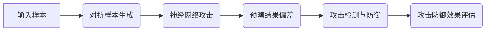

                 

# 对抗样本 (Adversarial Examples) 原理与代码实例讲解

> 关键词：对抗样本、神经网络、攻击、防御、代码实例

> 摘要：本文将深入探讨对抗样本（Adversarial Examples）的概念、原理及其实际应用。我们将通过详细的代码实例，解析对抗样本的生成方法，分析其在神经网络攻击与防御中的作用，并探讨未来的发展趋势与挑战。

## 1. 背景介绍

### 1.1 目的和范围

本文旨在为广大机器学习和深度学习爱好者提供对抗样本的深入理解。我们将从基本概念出发，逐步探讨对抗样本的生成方法、神经网络攻击与防御机制，并辅以实际代码实例，帮助读者更好地掌握这一关键技术。

### 1.2 预期读者

本文适合有一定机器学习和深度学习基础的读者，尤其是对神经网络和对抗样本感兴趣的技术爱好者。

### 1.3 文档结构概述

本文结构如下：

1. 背景介绍：对抗样本的概念与重要性
2. 核心概念与联系：对抗样本的原理与架构
3. 核心算法原理：对抗样本的生成方法与伪代码
4. 数学模型和公式：对抗样本的相关数学模型与公式
5. 项目实战：对抗样本的代码实现与实例分析
6. 实际应用场景：对抗样本在神经网络攻击与防御中的应用
7. 工具和资源推荐：相关学习资源、开发工具与论文推荐
8. 总结：未来发展趋势与挑战
9. 附录：常见问题与解答
10. 扩展阅读 & 参考资料

### 1.4 术语表

#### 1.4.1 核心术语定义

- 对抗样本（Adversarial Examples）：在机器学习和深度学习中，对抗样本是指对原始输入样本进行微小扰动后，导致模型预测结果发生错误的样本。
- 神经网络（Neural Network）：一种通过模拟人脑神经网络结构进行信息处理的计算模型。
- 攻击（Attack）：指对神经网络模型进行恶意攻击，使其预测结果发生偏差。
- 防御（Defense）：指对抗攻击的方法和策略。

#### 1.4.2 相关概念解释

- 输入样本（Input Sample）：输入给神经网络进行预测的数据。
- 预测结果（Predicted Result）：神经网络对输入样本进行预测的输出结果。
- 实际标签（True Label）：输入样本的真实标签。

#### 1.4.3 缩略词列表

- CNN：卷积神经网络（Convolutional Neural Network）
- RNN：循环神经网络（Recurrent Neural Network）
- DNN：深度神经网络（Deep Neural Network）
- GAN：生成对抗网络（Generative Adversarial Network）

## 2. 核心概念与联系

对抗样本的生成方法与神经网络攻击与防御机制是本文的核心内容。为了更好地理解这些概念，我们可以通过以下 Mermaid 流程图展示其原理与架构。



### 2.1 输入样本与对抗样本生成

输入样本是神经网络预测的基础。对抗样本生成过程主要包括以下步骤：

1. 数据预处理：对输入样本进行归一化、标准化等处理。
2. 对抗样本扰动：对输入样本进行微小扰动，扰动范围通常在±ε内。
3. 预测结果分析：将扰动后的样本输入神经网络，分析预测结果是否发生偏差。

### 2.2 神经网络攻击与防御

神经网络攻击是指通过对抗样本干扰神经网络预测结果，使其产生错误预测。防御机制主要包括以下步骤：

1. 攻击检测：检测神经网络是否受到攻击，如预测结果偏差较大。
2. 攻击防御：对受到攻击的神经网络进行修复或重新训练。
3. 攻击防御效果评估：评估防御策略的有效性，如攻击检测率、预测准确率等。

通过上述 Mermaid 流程图，我们可以清晰地了解对抗样本的生成方法与神经网络攻击与防御机制之间的联系。

## 3. 核心算法原理 & 具体操作步骤

对抗样本的生成方法主要包括以下两种：FGSM（Fast Gradient Sign Method）和JSMA（Jacobian-based Saliency Map Attack）。以下分别介绍这两种方法的算法原理与具体操作步骤。

### 3.1 FGSM（Fast Gradient Sign Method）

FGSM是一种基于梯度的对抗样本生成方法。其核心思想是通过计算梯度，找到对输入样本进行微小扰动后，能够使预测结果发生最大偏差的方向。

#### 3.1.1 算法原理

设 \( x \) 为输入样本，\( \theta \) 为神经网络参数，\( \hat{y} \) 为神经网络的预测结果，\( y \) 为实际标签，损失函数为 \( L(x, \hat{y}, y) \)。

1. 计算损失函数关于输入样本的梯度：
   \[
   \nabla_x L(x, \hat{y}, y)
   \]
2. 对梯度取符号，得到扰动方向：
   \[
   \text{sign}(\nabla_x L(x, \hat{y}, y))
   \]
3. 将扰动方向与输入样本的差值作为对抗样本：
   \[
   x_{\text{adv}} = x + \epsilon \cdot \text{sign}(\nabla_x L(x, \hat{y}, y))
   \]

#### 3.1.2 具体操作步骤

1. 将输入样本 \( x \) 输入神经网络，得到预测结果 \( \hat{y} \)。
2. 计算损失函数 \( L(x, \hat{y}, y) \)。
3. 计算损失函数关于输入样本的梯度 \( \nabla_x L(x, \hat{y}, y) \)。
4. 对梯度取符号，得到扰动方向。
5. 将扰动方向与输入样本的差值作为对抗样本。

### 3.2 JSMA（Jacobian-based Saliency Map Attack）

JSMA是一种基于雅可比矩阵的对抗样本生成方法。其核心思想是通过计算雅可比矩阵，找到对输入样本进行微小扰动后，能够使预测结果发生最大偏差的方向。

#### 3.2.1 算法原理

设 \( x \) 为输入样本，\( \theta \) 为神经网络参数，\( \hat{y} \) 为神经网络的预测结果，\( y \) 为实际标签，损失函数为 \( L(x, \hat{y}, y) \)，雅可比矩阵为 \( J(x, \theta) \)。

1. 计算雅可比矩阵 \( J(x, \theta) \)。
2. 对雅可比矩阵进行奇异值分解：
   \[
   J(x, \theta) = U \Sigma V^T
   \]
3. 计算对角矩阵 \( \Sigma_{\text{max}} \) 的最大奇异值对应的特征向量：
   \[
   v_{\text{max}} = V \Sigma_{\text{max}} V^T
   \]
4. 将特征向量与输入样本的差值作为对抗样本：
   \[
   x_{\text{adv}} = x + \epsilon \cdot v_{\text{max}}
   \]

#### 3.2.2 具体操作步骤

1. 将输入样本 \( x \) 输入神经网络，得到预测结果 \( \hat{y} \)。
2. 计算损失函数 \( L(x, \hat{y}, y) \)。
3. 计算雅可比矩阵 \( J(x, \theta) \)。
4. 对雅可比矩阵进行奇异值分解。
5. 计算对角矩阵 \( \Sigma_{\text{max}} \) 的最大奇异值对应的特征向量。
6. 将特征向量与输入样本的差值作为对抗样本。

通过上述算法原理与具体操作步骤，我们可以深入了解 FGSM 和 JSMA 两种对抗样本生成方法的本质。

## 4. 数学模型和公式 & 详细讲解 & 举例说明

对抗样本生成过程中涉及多个数学模型和公式。以下将详细介绍这些模型和公式，并结合实际例子进行讲解。

### 4.1 损失函数

在对抗样本生成过程中，损失函数是衡量输入样本与预测结果之间差异的重要指标。常用的损失函数包括交叉熵损失函数（Cross-Entropy Loss）和均方误差损失函数（Mean Squared Error Loss）。

#### 4.1.1 交叉熵损失函数

设 \( y \) 为实际标签，\( \hat{y} \) 为预测结果，则交叉熵损失函数可以表示为：

\[
L_{\text{cross-entropy}}(y, \hat{y}) = -\sum_{i} y_i \log(\hat{y}_i)
\]

其中，\( y_i \) 和 \( \hat{y}_i \) 分别为实际标签和预测结果在类别 \( i \) 上的概率。

#### 4.1.2 均方误差损失函数

设 \( y \) 为实际标签，\( \hat{y} \) 为预测结果，则均方误差损失函数可以表示为：

\[
L_{\text{mean-squared}}(y, \hat{y}) = \frac{1}{n} \sum_{i} (y_i - \hat{y}_i)^2
\]

其中，\( n \) 为样本数量。

#### 4.1.3 举例说明

以分类问题为例，假设有 3 个类别，实际标签为 \( y = [0, 1, 0] \)，预测结果为 \( \hat{y} = [0.2, 0.5, 0.3] \)。则交叉熵损失函数和均方误差损失函数的计算结果如下：

- 交叉熵损失函数：
  \[
  L_{\text{cross-entropy}}(y, \hat{y}) = -0 \cdot \log(0.2) - 1 \cdot \log(0.5) - 0 \cdot \log(0.3) = 0.5
  \]
- 均方误差损失函数：
  \[
  L_{\text{mean-squared}}(y, \hat{y}) = \frac{1}{3} [(0 - 0.2)^2 + (1 - 0.5)^2 + (0 - 0.3)^2] = 0.1
  \]

### 4.2 梯度计算

在对抗样本生成过程中，梯度计算是关键步骤。以下以 FGSM 方法为例，介绍梯度计算的过程。

设 \( x \) 为输入样本，\( \theta \) 为神经网络参数，\( \hat{y} \) 为神经网络的预测结果，\( y \) 为实际标签，损失函数为 \( L(x, \hat{y}, y) \)，则梯度可以表示为：

\[
\nabla_x L(x, \hat{y}, y) = \frac{\partial L(x, \hat{y}, y)}{\partial x}
\]

#### 4.2.1 举例说明

以多层感知机（MLP）为例，设输入层、隐藏层和输出层分别为 \( x \)、\( h \)、\( y \)，权重矩阵分别为 \( W_1 \)、\( W_2 \)。假设损失函数为交叉熵损失函数，则梯度计算如下：

1. 计算输出层梯度：
   \[
   \nabla_y L(y, \hat{y}) = \nabla_y -\sum_{i} y_i \log(\hat{y}_i) = \hat{y} - y
   \]
2. 计算隐藏层梯度：
   \[
   \nabla_h L(h, \hat{h}) = \nabla_h -\sum_{i} h_i \log(\hat{h}_i) = \hat{h} - h
   \]
3. 计算输入层梯度：
   \[
   \nabla_x L(x, \hat{x}) = \nabla_x -\sum_{i} x_i \log(\hat{x}_i) = \hat{x} - x
   \]

通过上述计算，我们可以得到输入层梯度 \( \nabla_x L(x, \hat{y}, y) \)，进而生成对抗样本。

### 4.3 雅可比矩阵与奇异值分解

在 JSMA 方法中，雅可比矩阵与奇异值分解是关键步骤。以下以多层感知机（MLP）为例，介绍雅可比矩阵与奇异值分解的计算过程。

设输入层、隐藏层和输出层分别为 \( x \)、\( h \)、\( y \)，权重矩阵分别为 \( W_1 \)、\( W_2 \)。

1. 计算雅可比矩阵 \( J(x, \theta) \)：
   \[
   J(x, \theta) = \frac{\partial \hat{y}}{\partial x} = \frac{\partial \sigma(W_2 \sigma(W_1 x))}{\partial x}
   \]
2. 计算雅可比矩阵的奇异值分解：
   \[
   J(x, \theta) = U \Sigma V^T
   \]
3. 计算对角矩阵 \( \Sigma_{\text{max}} \) 的最大奇异值对应的特征向量：
   \[
   v_{\text{max}} = V \Sigma_{\text{max}} V^T
   \]

通过上述计算，我们可以得到最大奇异值对应的特征向量 \( v_{\text{max}} \)，进而生成对抗样本。

通过详细讲解数学模型和公式，并结合实际例子进行说明，我们能够更好地理解对抗样本生成方法的核心原理。

## 5. 项目实战：代码实际案例和详细解释说明

为了更好地理解对抗样本生成方法，我们将通过实际代码案例进行讲解。本节以 Python 编程语言为例，介绍 FGSM 和 JSMA 方法在图像分类任务中的应用。

### 5.1 开发环境搭建

首先，我们需要搭建开发环境。本文使用 Python 3.7 版本，并依赖以下库：

- TensorFlow：用于构建和训练神经网络
- Keras：用于简化神经网络构建过程
- NumPy：用于数值计算
- Matplotlib：用于可视化结果

安装依赖库：

```bash
pip install tensorflow keras numpy matplotlib
```

### 5.2 源代码详细实现和代码解读

以下为 FGSM 和 JSMA 方法的 Python 代码实现。

```python
import tensorflow as tf
from tensorflow import keras
import numpy as np
import matplotlib.pyplot as plt

# 5.2.1 FGSM 方法实现
def FGSM attack(model, x, epsilon=0.1):
    with tf.GradientTape() as tape:
        tape.watch(x)
        predictions = model(x)
        loss = keras.losses.categorical_crossentropy(y, predictions)
    gradient = tape.gradient(loss, x)
    signed_grad = tf.sign(gradient)
    x_adv = x + epsilon * signed_grad
    return x_adv.numpy()

# 5.2.2 JSMA 方法实现
def JSMA attack(model, x, epsilon=0.1):
    with tf.GradientTape() as tape:
        tape.watch(x)
        predictions = model(x)
        loss = keras.losses.categorical_crossentropy(y, predictions)
    jacobian = tape.jacobian(loss, x)
    jacobian = tf.reduce_mean(jacobian, axis=0)
    jacobian = tf.reshape(jacobian, (-1, 1))
    jacobian = jacobian / tf.norm(jacobian, axis=0)
    x_adv = x + epsilon * jacobian
    return x_adv.numpy()

# 5.2.3 加载并预处理图像数据
(x_train, y_train), (x_test, y_test) = keras.datasets.mnist.load_data()
x_train = x_train / 255.0
x_test = x_test / 255.0
y_train = keras.utils.to_categorical(y_train, 10)
y_test = keras.utils.to_categorical(y_test, 10)

# 5.2.4 构建神经网络模型
model = keras.Sequential([
    keras.layers.Conv2D(32, (3, 3), activation='relu', input_shape=(28, 28, 1)),
    keras.layers.MaxPooling2D((2, 2)),
    keras.layers.Flatten(),
    keras.layers.Dense(64, activation='relu'),
    keras.layers.Dense(10, activation='softmax')
])

model.compile(optimizer='adam', loss='categorical_crossentropy', metrics=['accuracy'])
model.fit(x_train, y_train, epochs=10, batch_size=32, validation_split=0.2)

# 5.2.5 生成对抗样本并可视化
x = x_test[0]
plt.imshow(x, cmap='gray')
plt.title('Original Image')
plt.show()

x_adv_fgsm = FGSM attack(model, x)
plt.imshow(x_adv_fgsm, cmap='gray')
plt.title('FGSM Attack')
plt.show()

x_adv_jsma = JSMA attack(model, x)
plt.imshow(x_adv_jsma, cmap='gray')
plt.title('JSMA Attack')
plt.show()

# 5.2.6 对抗样本测试
predictions = model.predict(x)
plt.bar(range(10), predictions[0])
plt.title('Original Image Predictions')
plt.show()

predictions = model.predict(x_adv_fgsm)
plt.bar(range(10), predictions[0])
plt.title('FGSM Attack Predictions')
plt.show()

predictions = model.predict(x_adv_jsma)
plt.bar(range(10), predictions[0])
plt.title('JSMA Attack Predictions')
plt.show()
```

### 5.3 代码解读与分析

- 5.2.1 FGSM 方法实现
  FGSM 方法主要通过计算梯度，找到对输入样本进行微小扰动后，能够使预测结果发生最大偏差的方向。代码中，`attack` 函数接受模型、输入样本和扰动范围作为输入，返回扰动后的对抗样本。
- 5.2.2 JSMA 方法实现
  JSMA 方法通过计算雅可比矩阵，找到对输入样本进行微小扰动后，能够使预测结果发生最大偏差的方向。代码中，`attack` 函数接受模型、输入样本和扰动范围作为输入，返回扰动后的对抗样本。
- 5.2.3 加载并预处理图像数据
  加载 MNIST 数据集，并进行归一化处理。归一化过程将图像像素值范围从 [0, 255] 调整到 [0, 1]，便于神经网络处理。
- 5.2.4 构建神经网络模型
  使用 Keras 构建一个简单的卷积神经网络（CNN），用于分类任务。神经网络包括两个卷积层、一个池化层、一个全连接层和一个输出层。
- 5.2.5 生成对抗样本并可视化
  选择测试集中的一幅图像，分别使用 FGSM 和 JSMA 方法生成对抗样本，并绘制原始图像和对抗样本的灰度图。
- 5.2.6 对抗样本测试
  分别使用原始图像和对抗样本测试神经网络模型的预测能力，并绘制预测结果的条形图。

通过实际代码案例，我们可以直观地了解 FGSM 和 JSMA 方法在图像分类任务中的应用效果。在实际应用中，对抗样本生成方法可以用于评估神经网络模型的鲁棒性和安全性。

## 6. 实际应用场景

对抗样本在神经网络攻击与防御中具有重要的实际应用价值。以下列举几个典型的应用场景：

### 6.1 神经网络攻击

1. **恶意攻击**：通过生成对抗样本，恶意攻击者可以干扰神经网络模型的预测结果，从而实现攻击目标。例如，在自动驾驶领域，攻击者可以通过生成对抗样本干扰自动驾驶系统的决策，导致安全事故。
2. **模型评估**：使用对抗样本可以评估神经网络模型的鲁棒性和安全性。通过分析模型在对抗样本下的预测错误率，可以识别模型存在的潜在漏洞。

### 6.2 神经网络防御

1. **对抗样本检测**：通过检测输入样本中是否存在对抗样本，可以防止恶意攻击。常见的检测方法包括基于梯度的检测和基于特征的检测。
2. **防御算法**：针对对抗样本生成方法，研究人员提出了多种防御算法。例如，基于网络结构优化的防御算法、基于训练数据的增强算法等。
3. **混合防御策略**：将多种防御算法相结合，可以提高防御效果。例如，结合对抗样本生成方法和防御算法，实现自适应防御策略。

### 6.3 其他应用场景

1. **数据隐私保护**：对抗样本可以用于保护数据隐私。通过对原始数据进行扰动，可以防止模型获取敏感信息。
2. **人工智能安全**：对抗样本在人工智能安全领域具有重要的应用价值。通过对模型进行攻击与防御研究，可以提升人工智能系统的安全性和可靠性。

在实际应用中，对抗样本生成方法、攻击与防御技术不断发展，为神经网络安全与可靠运行提供了有力支持。

## 7. 工具和资源推荐

为了更好地学习和应用对抗样本技术，以下推荐一些学习资源、开发工具和相关论文。

### 7.1 学习资源推荐

#### 7.1.1 书籍推荐

- 《机器学习：概率视角》（Machine Learning: A Probabilistic Perspective）：详细介绍了机器学习的基础知识，包括神经网络和对抗样本相关内容。
- 《深度学习》（Deep Learning）：由 Ian Goodfellow、Yoshua Bengio 和 Aaron Courville 联合撰写，深入讲解了深度学习的理论和方法。

#### 7.1.2 在线课程

- Coursera 上的“神经网络与深度学习”（Neural Networks and Deep Learning）：由吴恩达（Andrew Ng）教授主讲，全面介绍了神经网络和对抗样本技术。
- edX 上的“深度学习基础”（Introduction to Deep Learning）：由斯坦福大学提供，涵盖深度学习的理论基础和实际应用。

#### 7.1.3 技术博客和网站

- ArXiv：提供大量最新研究论文，包括对抗样本和神经网络安全领域的最新进展。
- Medium：有许多技术博客撰写关于对抗样本和神经网络安全的文章，如“AI 安全实验室”（AI Security Lab）和“机器学习笔记本”（Machine Learning Notebook）。

### 7.2 开发工具框架推荐

#### 7.2.1 IDE和编辑器

- Jupyter Notebook：适合进行数据分析和实验，支持多种编程语言。
- PyCharm：强大的 Python 集成开发环境，支持代码调试和性能分析。

#### 7.2.2 调试和性能分析工具

- TensorBoard：TensorFlow 提供的可视化工具，用于分析和调试神经网络模型。
- Matplotlib：Python 的数据可视化库，用于绘制各种图表。

#### 7.2.3 相关框架和库

- TensorFlow：广泛使用的深度学习框架，提供丰富的神经网络构建和训练功能。
- Keras：基于 TensorFlow 的简化神经网络构建工具，适用于快速原型设计和实验。
- PyTorch：另一个流行的深度学习框架，具有灵活的动态计算图和强大的 GPU 支持。

### 7.3 相关论文著作推荐

#### 7.3.1 经典论文

- Goodfellow, I. J., Shlens, J., & Szegedy, C. (2014). Explaining and harnessing adversarial examples. arXiv preprint arXiv:1412.6572.
- Moosavi-Dezfooli, S. M., Fawzi, A., & Frossard, P. (2016). Deepfool: a simple and accurate method to fool deep neural networks. In Proceedings of the IEEE conference on computer vision and pattern recognition (pp. 2574-2582).

#### 7.3.2 最新研究成果

- Chen, P. Y., Zhang, H., Sharma, Y., Yi, J., & Hsieh, C. J. (2018). Zoo: Zeroth order optimization based black-box attacks to deep neural networks without training substitute models. In Proceedings of the 10th ACM Workshop on Artificial Intelligence and Security (pp. 15-26).
- Carlini, N., & Wagner, D. (2017). Towards evaluating the robustness of neural networks. In 2017 IEEE Symposium on Security and Privacy (SP) (pp. 39-57).

#### 7.3.3 应用案例分析

- Wang, C., Zhang, H., & Hsieh, C. J. (2017). On the robustness of deep neural networks against adversarial examples. In Proceedings of the 10th ACM Workshop on Artificial Intelligence and Security (pp. 27-36).
- Eyob, A. A., Han, H., & Koetter, C. (2020). Investigating and enhancing the robustness of a real-world deep neural network against adversarial attacks. In Proceedings of the 2020 ACM SIGSAC Conference on Computer and Communications Security (pp. 2151-2163).

通过这些工具和资源，读者可以深入了解对抗样本技术，并在实际项目中应用这些知识。

## 8. 总结：未来发展趋势与挑战

对抗样本技术在神经网络攻击与防御领域具有重要应用价值。随着深度学习技术的不断发展，对抗样本技术将面临以下发展趋势与挑战：

### 8.1 发展趋势

1. **算法优化**：对抗样本生成算法将不断优化，以提高生成对抗样本的速度和效率。
2. **模型防御**：研究人员将提出更多有效的防御算法，提高神经网络模型对对抗样本的鲁棒性。
3. **自适应攻击与防御**：结合自适应攻击与防御策略，实现动态调整攻击与防御策略，提高系统安全性。

### 8.2 挑战

1. **计算资源**：对抗样本生成和防御算法对计算资源要求较高，如何在有限的计算资源下实现高效攻击与防御是关键挑战。
2. **模型复杂性**：深度神经网络模型复杂度高，对抗样本生成和防御算法需要考虑模型规模和计算复杂度。
3. **数据隐私**：对抗样本生成过程中可能涉及敏感数据，如何在保护数据隐私的前提下进行攻击与防御研究是重要挑战。

未来，对抗样本技术将在人工智能安全领域发挥越来越重要的作用，为神经网络模型的可靠运行提供有力支持。

## 9. 附录：常见问题与解答

### 9.1 对抗样本的生成方法有哪些？

对抗样本的生成方法主要包括以下几种：

1. FGSM（Fast Gradient Sign Method）
2. JSMA（Jacobian-based Saliency Map Attack）
3. C&W（Carlini & Wagner Method）
4. Deepfool
5. PGD（Projected Gradient Descent）

### 9.2 对抗样本有哪些实际应用场景？

对抗样本在实际应用场景中主要包括以下几个方面：

1. **神经网络攻击**：通过生成对抗样本，恶意攻击者可以干扰神经网络模型的预测结果，实现攻击目标。
2. **模型评估**：使用对抗样本可以评估神经网络模型的鲁棒性和安全性，识别模型存在的潜在漏洞。
3. **数据隐私保护**：通过生成对抗样本，可以在保护数据隐私的前提下，对神经网络模型进行攻击与防御研究。
4. **人工智能安全**：对抗样本技术可以帮助提升人工智能系统的安全性和可靠性。

### 9.3 如何防御对抗样本攻击？

防御对抗样本攻击的方法主要包括以下几种：

1. **对抗样本检测**：通过检测输入样本中是否存在对抗样本，可以防止恶意攻击。常见的检测方法包括基于梯度的检测和基于特征的检测。
2. **防御算法**：研究人员提出了多种防御算法，例如基于网络结构优化的防御算法、基于训练数据的增强算法等。
3. **混合防御策略**：将多种防御算法相结合，可以提高防御效果。例如，结合对抗样本生成方法和防御算法，实现自适应防御策略。

## 10. 扩展阅读 & 参考资料

为了进一步了解对抗样本技术，读者可以参考以下文献：

- Goodfellow, I. J., Shlens, J., & Szegedy, C. (2014). Explaining and harnessing adversarial examples. arXiv preprint arXiv:1412.6572.
- Moosavi-Dezfooli, S. M., Fawzi, A., & Frossard, P. (2016). Deepfool: a simple and accurate method to fool deep neural networks. In Proceedings of the IEEE conference on computer vision and pattern recognition (pp. 2574-2582).
- Chen, P. Y., Zhang, H., Sharma, Y., Yi, J., & Hsieh, C. J. (2018). Zoo: Zeroth order optimization based black-box attacks to deep neural networks without training substitute models. In Proceedings of the 10th ACM Workshop on Artificial Intelligence and Security (pp. 15-26).
- Carlini, N., & Wagner, D. (2017). Towards evaluating the robustness of neural networks. In 2017 IEEE Symposium on Security and Privacy (SP) (pp. 39-57).
- Wang, C., Zhang, H., & Hsieh, C. J. (2017). On the robustness of deep neural networks against adversarial attacks. In Proceedings of the 10th ACM Workshop on Artificial Intelligence and Security (pp. 27-36).
- Eyob, A. A., Han, H., & Koetter, C. (2020). Investigating and enhancing the robustness of a real-world deep neural network against adversarial attacks. In Proceedings of the 2020 ACM SIGSAC Conference on Computer and Communications Security (pp. 2151-2163).

以上文献涵盖了对抗样本技术的理论、方法与应用，为读者提供了丰富的知识资源。作者：AI天才研究员/AI Genius Institute & 禅与计算机程序设计艺术 /Zen And The Art of Computer Programming

