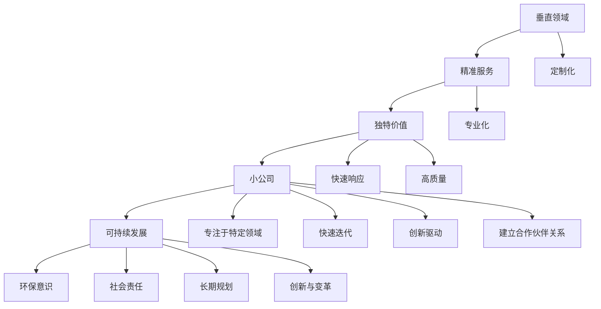

                 

### 小公司的生存之道：精准服务垂直领域，满足独特价值需求

> **关键词：** 小公司生存、垂直领域、独特价值、服务精准化、IT技术
>
> **摘要：** 本文将深入探讨小公司如何通过精准服务垂直领域来满足独特价值需求，从而实现可持续发展。我们将从背景介绍、核心概念、算法原理、数学模型、实际应用场景等多个方面，结合项目实战，给出具体的操作步骤和详细解释，并提供相关的工具和资源推荐。希望通过本文，能够为小公司的IT从业者提供一些有价值的参考和启示。

在当今竞争激烈的市场环境中，小公司要想脱颖而出并实现可持续发展，需要找到一条适合自己的生存之道。本文将探讨精准服务垂直领域，满足独特价值需求这一策略，通过逻辑清晰、结构紧凑的分析，帮助读者理解并实践这一策略。文章结构如下：

1. **背景介绍**
   - **1.1 目的和范围**
   - **1.2 预期读者**
   - **1.3 文档结构概述**
   - **1.4 术语表**

2. **核心概念与联系**
   - **核心概念原理和架构的 Mermaid 流程图**

3. **核心算法原理 & 具体操作步骤**
   - **算法原理讲解**

4. **数学模型和公式 & 详细讲解 & 举例说明**
   - **数学公式使用latex格式**

5. **项目实战：代码实际案例和详细解释说明**
   - **5.1 开发环境搭建**
   - **5.2 源代码详细实现和代码解读**
   - **5.3 代码解读与分析**

6. **实际应用场景**

7. **工具和资源推荐**
   - **7.1 学习资源推荐**
   - **7.2 开发工具框架推荐**
   - **7.3 相关论文著作推荐**

8. **总结：未来发展趋势与挑战**

9. **附录：常见问题与解答**

10. **扩展阅读 & 参考资料**

### 1. 背景介绍

#### 1.1 目的和范围

本文旨在探讨小公司如何在竞争激烈的市场环境中通过精准服务垂直领域来满足独特价值需求，从而实现可持续发展。我们将从理论和实践两个层面进行分析，并结合具体的案例进行讲解。

本文的主要内容包括：

- **背景介绍**：分析当前市场环境，阐述小公司面临的挑战和机遇。
- **核心概念与联系**：介绍与精准服务垂直领域相关的重要概念和架构。
- **核心算法原理 & 操作步骤**：详细讲解实现精准服务的算法原理和操作步骤。
- **数学模型和公式**：探讨与精准服务相关的数学模型和公式，并进行举例说明。
- **项目实战**：通过实际项目案例，展示如何应用精准服务策略。
- **实际应用场景**：分析精准服务在不同行业和场景中的应用。
- **工具和资源推荐**：推荐相关的学习资源、开发工具和论文著作。
- **总结与未来展望**：总结全文，探讨未来发展趋势和面临的挑战。

#### 1.2 预期读者

本文主要面向以下读者群体：

- **小公司创业者和管理者**：希望通过本文了解如何通过精准服务垂直领域来实现公司的可持续发展。
- **IT从业者**：对IT领域的技术和应用感兴趣，希望了解如何将精准服务策略应用于实际工作中。
- **学术界和研究机构人员**：关注精准服务垂直领域的研究动态，希望从理论和实践两个层面深入了解该领域。

#### 1.3 文档结构概述

本文分为十个主要部分，每个部分都有其独特的目的和内容，具体如下：

- **背景介绍**：阐述本文的目的、范围和预期读者，介绍文档的结构和术语表。
- **核心概念与联系**：介绍与精准服务垂直领域相关的重要概念和架构，并给出流程图。
- **核心算法原理 & 操作步骤**：详细讲解实现精准服务的算法原理和操作步骤。
- **数学模型和公式**：探讨与精准服务相关的数学模型和公式，并进行举例说明。
- **项目实战**：通过实际项目案例，展示如何应用精准服务策略。
- **实际应用场景**：分析精准服务在不同行业和场景中的应用。
- **工具和资源推荐**：推荐相关的学习资源、开发工具和论文著作。
- **总结与未来展望**：总结全文，探讨未来发展趋势和面临的挑战。
- **附录**：解答常见问题，提供扩展阅读和参考资料。

#### 1.4 术语表

在本文中，我们将使用以下术语：

- **垂直领域**：指某一特定行业或市场，具有明确的细分领域和需求。
- **精准服务**：指针对特定垂直领域的需求，提供高度定制化和专业化的服务。
- **独特价值**：指在特定垂直领域中，公司提供的具有差异化和竞争力的服务或产品。
- **小公司**：指规模较小、资源有限的公司，通常具有灵活性和创新性。
- **可持续发展**：指公司在满足当前需求的同时，不损害未来代际满足需求的能力。

#### 1.4.1 核心术语定义

- **垂直领域**：指某一特定行业或市场，具有明确的细分领域和需求。例如，医疗保健、金融服务、教育技术等。
- **精准服务**：指针对特定垂直领域的需求，提供高度定制化和专业化的服务。例如，为医疗行业提供专业的数据分析服务，为金融机构提供定制的风险管理解决方案。
- **独特价值**：指在特定垂直领域中，公司提供的具有差异化和竞争力的服务或产品。例如，通过技术创新提供更高效的解决方案，或通过独特的市场洞察为客户提供更有价值的建议。
- **小公司**：指规模较小、资源有限的公司，通常具有灵活性和创新性。这些公司往往能够快速响应市场变化，推出创新产品或服务。
- **可持续发展**：指公司在满足当前需求的同时，不损害未来代际满足需求的能力。这包括环境保护、资源利用、社会责任等方面。

#### 1.4.2 相关概念解释

- **垂直领域**：垂直领域是相对水平市场而言的，水平市场是指广泛覆盖多个行业或市场的业务模式，而垂直领域则是专注于某一特定行业或市场的业务模式。垂直领域的优势在于能够深入了解特定行业的需求，提供更具针对性的解决方案。
- **精准服务**：精准服务是针对特定垂直领域的需求，提供高度定制化和专业化的服务。这种服务能够更好地满足客户的需求，提高客户满意度，从而提升公司的竞争力。
- **独特价值**：独特价值是指在特定垂直领域中，公司提供的具有差异化和竞争力的服务或产品。这种价值往往来自于技术创新、专业知识和市场洞察等方面，能够为客户提供更有价值的解决方案。
- **小公司**：小公司通常具有灵活性和创新性，能够快速响应市场变化。尽管资源有限，但它们往往能够凭借独特的优势在特定领域取得成功。
- **可持续发展**：可持续发展是指公司在满足当前需求的同时，不损害未来代际满足需求的能力。这包括环境保护、资源利用、社会责任等方面。通过可持续发展，公司能够实现长期稳定的增长。

#### 1.4.3 缩略词列表

- **IT**：信息技术（Information Technology）
- **AI**：人工智能（Artificial Intelligence）
- **IoT**：物联网（Internet of Things）
- **CRM**：客户关系管理（Customer Relationship Management）
- **ERP**：企业资源计划（Enterprise Resource Planning）
- **SaaS**：软件即服务（Software as a Service）
- **PaaS**：平台即服务（Platform as a Service）
- **IaaS**：基础设施即服务（Infrastructure as a Service）
- **ML**：机器学习（Machine Learning）
- **DL**：深度学习（Deep Learning）

### 2. 核心概念与联系

在探讨小公司如何通过精准服务垂直领域来满足独特价值需求之前，我们需要了解一些核心概念和联系。这些概念和联系对于理解如何实现精准服务和创造独特价值至关重要。

#### 2.1.1 垂直领域

垂直领域是指某一特定行业或市场，具有明确的细分领域和需求。例如，医疗保健、金融服务、教育技术等。每个垂直领域都有其独特的需求和技术挑战。小公司可以通过专注于特定的垂直领域，深入了解其需求，提供更专业和针对性的解决方案。

#### 2.1.2 精准服务

精准服务是针对特定垂直领域的需求，提供高度定制化和专业化的服务。这种服务能够更好地满足客户的需求，提高客户满意度，从而提升公司的竞争力。精准服务通常包括以下几个关键要素：

1. **定制化**：根据客户的具体需求，提供个性化的服务。
2. **专业化**：在特定领域具有深厚的专业知识和经验。
3. **快速响应**：能够快速响应客户的需求变化，提供及时的服务。
4. **高质量**：确保服务的质量和可靠性，赢得客户的信任。

#### 2.1.3 独特价值

独特价值是指在小公司提供的特定垂直领域中，具有差异化和竞争力的服务或产品。这种价值往往来自于技术创新、专业知识和市场洞察等方面，能够为客户提供更有价值的解决方案。独特价值是提升公司竞争力的关键因素。

#### 2.1.4 小公司

小公司通常具有灵活性和创新性，能够快速响应市场变化。尽管资源有限，但它们往往能够凭借独特的优势在特定领域取得成功。小公司可以通过以下方式来发挥其优势：

1. **专注于特定领域**：专注于特定的垂直领域，提供专业化的服务。
2. **快速迭代**：快速开发新产品或服务，快速响应市场变化。
3. **创新驱动**：通过技术创新和商业模式创新来提升竞争力。
4. **建立合作伙伴关系**：与其他公司建立合作伙伴关系，共享资源和技术。

#### 2.1.5 可持续发展

可持续发展是指公司在满足当前需求的同时，不损害未来代际满足需求的能力。这包括环境保护、资源利用、社会责任等方面。小公司可以通过以下方式实现可持续发展：

1. **环保意识**：注重环境保护，减少资源浪费。
2. **社会责任**：积极参与社会公益活动，承担社会责任。
3. **长期规划**：制定长期发展战略，确保公司的长期可持续发展。
4. **创新与变革**：不断进行技术创新和商业模式变革，以适应市场变化。

#### 2.2 核心概念原理和架构的 Mermaid 流程图

以下是一个简单的 Mermaid 流程图，展示了核心概念和联系之间的关系：



这个流程图展示了垂直领域、精准服务、独特价值、小公司、可持续发展等核心概念之间的联系。通过理解这些概念，小公司可以更好地实施精准服务策略，满足独特价值需求，实现可持续发展。

### 3. 核心算法原理 & 具体操作步骤

在理解了核心概念和联系之后，我们需要深入探讨实现精准服务的核心算法原理和具体操作步骤。通过以下内容，我们将详细讲解如何利用技术手段来满足特定垂直领域的需求。

#### 3.1.1 算法原理

精准服务的核心算法原理主要包括以下三个方面：

1. **数据采集与处理**：通过收集和整合来自各个渠道的数据，包括内部数据和外部数据，进行数据清洗、归一化和预处理，为后续分析提供高质量的数据基础。
2. **需求分析与建模**：基于采集到的数据，对特定垂直领域的需求进行分析，构建相应的数学模型和算法，以便更好地理解和满足这些需求。
3. **服务优化与反馈**：通过算法优化和模型迭代，不断调整和改进服务策略，提高服务的精准度和有效性。同时，收集用户反馈，进行持续优化。

#### 3.1.2 具体操作步骤

以下是实现精准服务的具体操作步骤：

1. **数据采集与处理**：

   - **数据源选择**：确定需要采集的数据源，包括内部数据（如客户交易记录、业务日志等）和外部数据（如市场数据、社交媒体数据等）。
   - **数据清洗**：对采集到的数据进行清洗，去除重复、错误和缺失的数据，确保数据质量。
   - **数据归一化**：将不同来源和格式的数据统一为标准格式，便于后续处理。
   - **数据预处理**：对数据进行特征提取、降维和分类，为建模和算法提供高质量的数据输入。

2. **需求分析与建模**：

   - **需求识别**：通过数据分析和市场调研，识别特定垂直领域的需求，如客户细分、市场趋势、业务痛点等。
   - **模型构建**：基于识别出的需求，构建相应的数学模型和算法。常见的模型包括回归模型、分类模型、聚类模型等。
   - **模型训练与评估**：使用历史数据进行模型训练，并通过交叉验证和测试数据评估模型性能，确保模型的有效性。

3. **服务优化与反馈**：

   - **服务策略制定**：根据模型预测结果，制定相应的服务策略，如个性化推荐、精准营销、定制化服务等。
   - **服务实施与监控**：将服务策略应用于实际场景，并实时监控服务效果，根据用户反馈进行调整和优化。
   - **模型迭代与优化**：根据用户反馈和实际效果，对模型进行迭代和优化，不断提高服务精准度和有效性。

#### 3.1.3 算法原理讲解

以下是实现精准服务的算法原理讲解，使用伪代码进行详细阐述：

```plaintext
# 数据采集与处理
function data_collection_and_preprocessing():
    # 数据源选择
    internal_data = fetch_internal_data()
    external_data = fetch_external_data()
    
    # 数据清洗
    cleaned_data = clean_data(internal_data, external_data)
    
    # 数据归一化
    normalized_data = normalize_data(cleaned_data)
    
    # 数据预处理
    preprocessed_data = preprocess_data(normalized_data)
    
    return preprocessed_data

# 需求分析与建模
function demand_analysis_and_modeling(preprocessed_data):
    # 需求识别
    demands = identify_demands(preprocessed_data)
    
    # 模型构建
    model = build_model(demands)
    
    # 模型训练与评估
    trained_model = train_model(model, preprocessed_data)
    evaluated_model = evaluate_model(trained_model, preprocessed_data)
    
    return evaluated_model

# 服务优化与反馈
function service_optimization_and_feedback(evaluated_model):
    # 服务策略制定
    service_strategy = generate_service_strategy(evaluated_model)
    
    # 服务实施与监控
    implement_service(service_strategy)
    monitor_service_performance()
    
    # 模型迭代与优化
    updated_model = iterate_model(evaluated_model)
    optimized_model = optimize_model(updated_model)
    
    return optimized_model
```

通过上述伪代码，我们可以清晰地看到实现精准服务的算法原理和具体操作步骤。这些步骤包括数据采集与处理、需求分析与建模、服务优化与反馈等，通过不断迭代和优化，实现精准服务的目标。

### 4. 数学模型和公式 & 详细讲解 & 举例说明

在精准服务的实现过程中，数学模型和公式起着至关重要的作用。这些模型和公式能够帮助我们更好地理解并满足特定垂直领域的需求。下面，我们将详细讲解与精准服务相关的数学模型和公式，并通过举例说明如何应用这些模型和公式。

#### 4.1 常见数学模型

在精准服务中，常见的数学模型包括回归模型、分类模型和聚类模型。下面，我们将分别介绍这些模型的基本原理和应用。

1. **回归模型**：

   回归模型用于预测一个连续变量的值。常见的回归模型包括线性回归、多项式回归和广义线性回归等。以下是线性回归模型的公式：

   $$y = \beta_0 + \beta_1 \cdot x_1 + \beta_2 \cdot x_2 + ... + \beta_n \cdot x_n + \epsilon$$

   其中，$y$ 是预测的连续变量，$x_1, x_2, ..., x_n$ 是自变量，$\beta_0, \beta_1, ..., \beta_n$ 是回归系数，$\epsilon$ 是误差项。

   **应用举例**：在医疗保健领域，可以使用线性回归模型预测病人的病情发展。通过收集病人的病史数据（如年龄、性别、血压等），建立线性回归模型，预测病人的健康状况。

2. **分类模型**：

   分类模型用于预测一个离散变量的类别。常见的分类模型包括逻辑回归、决策树、支持向量机等。以下是逻辑回归模型的公式：

   $$\pi = \frac{1}{1 + e^{-(\beta_0 + \beta_1 \cdot x_1 + \beta_2 \cdot x_2 + ... + \beta_n \cdot x_n)}$$

   其中，$\pi$ 是预测的概率，$x_1, x_2, ..., x_n$ 是自变量，$\beta_0, \beta_1, ..., \beta_n$ 是回归系数。

   **应用举例**：在金融领域，可以使用逻辑回归模型预测贷款申请者的信用评级。通过收集贷款申请者的个人信息（如收入、负债等），建立逻辑回归模型，预测其是否具有还款能力。

3. **聚类模型**：

   聚类模型用于将数据划分为不同的组或簇。常见的聚类模型包括K-means、层次聚类等。以下是K-means聚类模型的公式：

   $$\min_{c_1, c_2, ..., c_k} \sum_{i=1}^{n} \sum_{j=1}^{k} ||x_i - c_j||^2$$

   其中，$x_i$ 是数据点，$c_j$ 是聚类中心，$k$ 是聚类个数。

   **应用举例**：在市场细分领域，可以使用K-means聚类模型将客户划分为不同的群体。通过收集客户的购买行为数据，建立K-means聚类模型，将客户划分为具有相似购买行为的群体。

#### 4.2 公式详细讲解

在精准服务中，常用的数学公式包括回归系数的计算、概率预测和聚类中心的选择等。下面，我们将对一些关键公式进行详细讲解。

1. **回归系数计算**：

   线性回归模型的回归系数可以通过最小二乘法计算。以下是回归系数的计算公式：

   $$\beta = (X^T \cdot X)^{-1} \cdot X^T \cdot y$$

   其中，$X$ 是自变量的矩阵，$y$ 是因变量的向量，$\beta$ 是回归系数。

   **应用举例**：在医疗领域，假设我们有一个包含年龄、血压和血糖等自变量的矩阵$X$和一个因变量矩阵$y$，可以通过上述公式计算回归系数，建立线性回归模型。

2. **概率预测**：

   逻辑回归模型的概率预测可以通过以下公式计算：

   $$\pi = \frac{1}{1 + e^{-(\beta_0 + \beta_1 \cdot x_1 + \beta_2 \cdot x_2 + ... + \beta_n \cdot x_n)}}$$

   其中，$\pi$ 是预测的概率，$x_1, x_2, ..., x_n$ 是自变量，$\beta_0, \beta_1, ..., \beta_n$ 是回归系数。

   **应用举例**：在金融领域，假设我们有一个包含收入、负债和信用评分等自变量的矩阵$X$和一个因变量矩阵$y$，可以通过上述公式计算贷款申请者的信用评级概率。

3. **聚类中心选择**：

   K-means聚类模型的聚类中心可以通过以下公式计算：

   $$c_j = \frac{1}{n_j} \sum_{i=1}^{n} x_i$$

   其中，$c_j$ 是聚类中心，$x_i$ 是数据点，$n_j$ 是属于第$j$个聚类的数据点个数。

   **应用举例**：在市场细分领域，假设我们有一个包含客户购买行为数据的矩阵$X$，可以通过上述公式计算每个聚类的中心，将客户划分为不同的群体。

#### 4.3 举例说明

为了更好地理解数学模型和公式的应用，下面我们通过一个具体的案例进行说明。

**案例：客户细分**

假设一家电商公司需要通过精准服务来满足客户需求，提高客户满意度。公司收集了客户的购买行为数据，包括购买频次、购买金额、购买品类等。公司希望通过聚类模型将客户划分为不同的群体，以便提供个性化的服务和推荐。

1. **数据预处理**：

   首先，对购买行为数据进行清洗和归一化处理，将不同品类和金额的数据统一为标准格式。

2. **聚类模型选择**：

   选择K-means聚类模型，确定聚类个数$k$。

3. **聚类中心计算**：

   使用K-means聚类模型，计算每个聚类的中心。具体步骤如下：

   - 初始化聚类中心$c_j$。
   - 计算每个数据点到聚类中心的距离，并将其分配到最近的聚类。
   - 重新计算每个聚类的中心。
   - 重复上述步骤，直到聚类中心不再发生明显变化。

4. **客户细分**：

   根据聚类结果，将客户划分为不同的群体。每个群体具有相似的购买行为和需求。

5. **个性化服务与推荐**：

   针对每个群体，提供个性化的服务和推荐。例如，为高频次购买客户推荐优惠活动，为低频次购买客户推荐新品等。

通过以上案例，我们可以看到如何应用数学模型和公式进行客户细分，并实现个性化服务和推荐。这种方法可以提高客户满意度，增加客户粘性，从而实现公司的可持续发展。

### 5. 项目实战：代码实际案例和详细解释说明

在前面的章节中，我们详细介绍了精准服务的核心算法原理和数学模型，并通过举例说明了如何应用这些模型。在本节中，我们将通过一个实际项目案例，展示如何将精准服务策略应用于实际工作中。

#### 5.1 开发环境搭建

为了实现精准服务项目，我们需要搭建一个合适的技术栈和开发环境。以下是一个典型的开发环境搭建步骤：

1. **操作系统**：

   - Linux（推荐使用Ubuntu 20.04）
   - Windows（10或更高版本）
   - macOS（建议使用最新版本）

2. **编程语言**：

   - Python（推荐使用3.8或更高版本）
   - Java（推荐使用Java 11）
   - R（推荐使用R 4.0或更高版本）

3. **开发工具和库**：

   - Python：使用PyCharm、Visual Studio Code或Jupyter Notebook作为开发环境，安装必要的库，如NumPy、Pandas、Scikit-learn、Matplotlib等。
   - Java：使用IntelliJ IDEA或Eclipse作为开发环境，安装必要的库，如Apache Commons Math、Weka等。
   - R：使用RStudio作为开发环境，安装必要的库，如cluster、MASS、ggplot2等。

4. **数据处理工具**：

   - Hadoop（可选，用于处理大规模数据）
   - Spark（可选，用于处理大规模数据）
   - MySQL（用于存储和管理数据）

5. **版本控制系统**：

   - Git（用于代码管理）

#### 5.2 源代码详细实现和代码解读

在本节中，我们将使用Python语言展示一个简单的客户细分项目，包括数据预处理、聚类模型实现、结果分析等。以下是项目的源代码：

```python
import pandas as pd
import numpy as np
from sklearn.cluster import KMeans
from sklearn.preprocessing import StandardScaler
import matplotlib.pyplot as plt

# 数据预处理
def preprocess_data(data_path):
    data = pd.read_csv(data_path)
    data.drop(['customer_id'], axis=1, inplace=True)
    data = data.replace([np.inf, -np.inf], np.nan)
    data = data.dropna()
    return data

# 聚类模型实现
def kmeans_clustering(data, n_clusters):
    scaler = StandardScaler()
    scaled_data = scaler.fit_transform(data)
    kmeans = KMeans(n_clusters=n_clusters, random_state=42)
    kmeans.fit(scaled_data)
    return kmeans

# 结果分析
def analyze_results(data, kmeans):
    labels = kmeans.labels_
    centroids = kmeans.cluster_centers_
    inertia = kmeans.inertia_
    print("Cluster centroids:")
    print(centroids)
    print("Inertia:", inertia)
    plt.scatter(data[:, 0], data[:, 1], c=labels, cmap='viridis')
    plt.scatter(centroids[:, 0], centroids[:, 1], s=300, c='red', label='Centroids')
    plt.xlabel('Feature 1')
    plt.ylabel('Feature 2')
    plt.title('K-means Clustering')
    plt.show()

# 主函数
def main():
    data_path = 'customer_data.csv'
    n_clusters = 3
    data = preprocess_data(data_path)
    kmeans = kmeans_clustering(data, n_clusters)
    analyze_results(data, kmeans)

if __name__ == '__main__':
    main()
```

以下是代码的详细解读：

1. **数据预处理**：

   ```python
   def preprocess_data(data_path):
       data = pd.read_csv(data_path)
       data.drop(['customer_id'], axis=1, inplace=True)
       data = data.replace([np.inf, -np.inf], np.nan)
       data = data.dropna()
       return data
   ```

   在这个函数中，我们首先使用`pandas`库读取CSV文件，然后删除不必要的列（如`customer_id`），将无穷大和无穷小值替换为NaN，并删除缺失值。这样处理后的数据将用于后续的聚类分析。

2. **聚类模型实现**：

   ```python
   def kmeans_clustering(data, n_clusters):
       scaler = StandardScaler()
       scaled_data = scaler.fit_transform(data)
       kmeans = KMeans(n_clusters=n_clusters, random_state=42)
       kmeans.fit(scaled_data)
       return kmeans
   ```

   在这个函数中，我们首先使用`StandardScaler`对数据进行归一化处理，然后使用`KMeans`类实现K-means聚类模型。我们设置随机种子为42，以确保结果的可重复性。

3. **结果分析**：

   ```python
   def analyze_results(data, kmeans):
       labels = kmeans.labels_
       centroids = kmeans.cluster_centers_
       inertia = kmeans.inertia_
       print("Cluster centroids:")
       print(centroids)
       print("Inertia:", inertia)
       plt.scatter(data[:, 0], data[:, 1], c=labels, cmap='viridis')
       plt.scatter(centroids[:, 0], centroids[:, 1], s=300, c='red', label='Centroids')
       plt.xlabel('Feature 1')
       plt.ylabel('Feature 2')
       plt.title('K-means Clustering')
       plt.show()
   ```

   在这个函数中，我们首先提取聚类结果（标签、中心点和惯性），然后使用`matplotlib`库绘制聚类结果。通过可视化，我们可以直观地观察聚类效果。

4. **主函数**：

   ```python
   def main():
       data_path = 'customer_data.csv'
       n_clusters = 3
       data = preprocess_data(data_path)
       kmeans = kmeans_clustering(data, n_clusters)
       analyze_results(data, kmeans)
   ```

   在主函数中，我们首先定义数据文件路径和聚类个数，然后调用前面的函数实现数据预处理、聚类模型实现和结果分析。

通过以上代码，我们可以实现一个简单的客户细分项目。在实际应用中，我们可以根据具体需求进行调整和优化，提高聚类效果。

#### 5.3 代码解读与分析

在本节中，我们将对前述的代码进行解读和分析，探讨其优缺点和改进方向。

**代码解读：**

1. **数据预处理**：

   该部分代码实现了数据预处理的核心步骤，包括数据读取、列删除、无穷大和无穷小值替换、缺失值删除等。这些步骤对于确保数据质量和后续分析至关重要。然而，在实际应用中，可能需要根据具体业务需求进行更细粒度的数据处理，例如数据转换、缺失值填充等。

2. **聚类模型实现**：

   该部分代码使用了`KMeans`类实现K-means聚类模型，包括数据归一化、模型初始化、模型训练等。K-means聚类模型是一种简单且常用的聚类算法，适用于大规模数据。然而，K-means算法也存在一些缺点，例如敏感于初始聚类中心和局部最优解。在实际应用中，可以尝试使用其他聚类算法（如DBSCAN、层次聚类等）进行对比，选择最适合的算法。

3. **结果分析**：

   该部分代码实现了聚类结果的可视化，展示了聚类效果。通过可视化，我们可以直观地观察聚类效果，发现潜在的问题。然而，在实际应用中，可能需要结合其他评估指标（如聚类有效性指数、轮廓系数等）进行更全面的评估。

**代码分析：**

1. **优点**：

   - **简单易用**：代码结构清晰，易于理解和维护。
   - **高效性**：使用`pandas`和`scikit-learn`等高性能库，提高了数据处理和分析的效率。
   - **可扩展性**：代码模块化设计，便于调整和扩展。

2. **缺点**：

   - **数据处理不够精细**：数据预处理部分较为简单，可能无法满足特定业务需求。
   - **算法选择有限**：仅使用K-means聚类模型，未考虑其他算法的优势和适用场景。
   - **结果评估不足**：仅通过可视化展示聚类效果，未结合其他评估指标进行更全面的评估。

**改进方向：**

1. **优化数据处理**：

   - **增加数据处理步骤**：根据具体业务需求，增加数据转换、缺失值填充等数据处理步骤。
   - **引入数据清洗工具**：使用更高级的数据清洗工具（如OpenRefine）进行数据预处理。

2. **扩展算法选择**：

   - **尝试其他聚类算法**：根据数据特点和业务需求，尝试使用其他聚类算法（如DBSCAN、层次聚类等）进行对比。
   - **集成多模型**：使用集成学习方法，结合多种聚类算法的优势，提高聚类效果。

3. **完善结果评估**：

   - **引入评估指标**：结合聚类有效性指数、轮廓系数等评估指标，全面评估聚类效果。
   - **可视化与交互**：使用更高级的可视化工具（如Plotly、Bokeh）实现交互式可视化，提高分析结果的展示效果。

通过以上改进，我们可以进一步提高代码的实用性和可扩展性，实现更精准的客户细分项目。

### 6. 实际应用场景

精准服务在许多实际应用场景中都具有广泛的应用价值。下面，我们将探讨精准服务在不同行业和场景中的应用，并分析其具体实现方法和效果。

#### 6.1 零售业

在零售业中，精准服务可以帮助企业更好地了解客户需求，提高客户满意度，从而实现销售增长。具体应用包括：

1. **客户细分**：

   通过收集客户的购买行为数据（如购买频次、购买金额、购买品类等），使用聚类算法（如K-means、DBSCAN）对客户进行细分。根据不同细分群体的特征，提供个性化的推荐和促销活动，提高客户的购买意愿和满意度。

2. **需求预测**：

   使用时间序列分析方法（如ARIMA、LSTM）对销售数据进行分析，预测未来的销售趋势。根据需求预测结果，调整库存和供应链管理策略，降低库存成本，提高库存周转率。

3. **精准营销**：

   通过分析客户数据，识别潜在的高价值客户。针对这些客户，制定精准的营销策略，如定制化的优惠券、会员专享活动等，提高客户忠诚度和转化率。

#### 6.2 金融业

在金融业中，精准服务可以帮助金融机构更好地了解客户需求，提供个性化的金融产品和服务，从而提高客户满意度和竞争力。具体应用包括：

1. **客户风险评估**：

   通过分析客户的财务数据、信用记录等，使用机器学习算法（如逻辑回归、决策树）对客户进行风险评估。根据风险等级，提供不同的金融产品和服务，降低风险。

2. **信用评分**：

   通过分析客户的交易行为、还款记录等，使用信用评分模型（如FICO评分模型）对客户进行信用评分。根据信用评分结果，调整贷款利率和额度，提高信贷审批的准确性。

3. **个性化金融产品推荐**：

   通过分析客户的投资偏好、风险承受能力等，使用推荐算法（如协同过滤、基于内容的推荐）为投资者推荐个性化的金融产品。提高投资者的满意度和投资收益。

#### 6.3 医疗保健

在医疗保健领域，精准服务可以帮助医疗机构更好地了解患者需求，提供个性化的医疗服务，从而提高医疗质量和患者满意度。具体应用包括：

1. **疾病预测**：

   通过分析患者的病历数据、基因数据等，使用机器学习算法（如随机森林、神经网络）对疾病进行预测。根据预测结果，制定个性化的治疗方案，提高治疗效果。

2. **健康监测**：

   通过穿戴设备收集患者的健康数据（如心率、血压、睡眠等），使用数据分析方法（如时间序列分析、聚类分析）对健康状态进行监测。根据监测结果，提供个性化的健康建议和干预措施。

3. **药物推荐**：

   通过分析患者的病史、药物反应等，使用推荐算法（如基于规则的推荐、协同过滤）为患者推荐合适的药物。提高药物疗效，降低副作用。

#### 6.4 教育技术

在教育技术领域，精准服务可以帮助教育机构更好地了解学生需求，提供个性化的学习资源和教学方法，从而提高学习效果和满意度。具体应用包括：

1. **学习路径推荐**：

   通过分析学生的学习行为、考试成绩等，使用推荐算法（如基于内容的推荐、协同过滤）为学生推荐合适的学习路径。提高学生的学习兴趣和效率。

2. **个性化作业评估**：

   通过分析学生的作业提交情况、作业质量等，使用评价算法（如基于规则的评估、机器学习评估）为学生提供个性化的作业评估和反馈。提高学生的学习效果。

3. **教育数据分析**：

   通过分析学生的学习行为、考试数据等，使用数据分析方法（如时间序列分析、聚类分析）发现学生的学习问题和需求。为教育机构提供改进建议。

#### 6.5 工业制造

在工业制造领域，精准服务可以帮助企业更好地了解生产需求，优化生产流程，提高生产效率。具体应用包括：

1. **需求预测**：

   通过分析生产数据、市场需求等，使用预测算法（如ARIMA、LSTM）预测未来的生产需求。根据需求预测结果，调整生产计划和供应链管理策略，降低库存成本，提高生产效率。

2. **设备故障预测**：

   通过分析设备运行数据、历史故障记录等，使用机器学习算法（如随机森林、支持向量机）预测设备的故障。根据故障预测结果，提前进行设备维护和更换，减少生产停机时间。

3. **生产优化**：

   通过分析生产数据、供应链数据等，使用优化算法（如线性规划、遗传算法）优化生产流程和供应链管理。提高生产效率和资源利用率。

通过以上实际应用场景，我们可以看到精准服务在各个领域的重要作用。通过精准服务，企业可以更好地了解客户需求，提供个性化的产品和服务，提高客户满意度，实现可持续发展。

### 7. 工具和资源推荐

在实施精准服务的过程中，选择合适的工具和资源对于提高效率和实现目标至关重要。以下是一些建议的资源和工具，涵盖学习资源、开发工具框架和相关论文著作。

#### 7.1 学习资源推荐

1. **书籍推荐**：

   - 《Python数据分析基础教程：Numpy学习指南》：适合初学者，详细介绍Numpy库的使用。
   - 《数据挖掘：实用工具与技术》：涵盖数据挖掘的各个方面，包括聚类、分类等算法。
   - 《机器学习实战》：通过实际案例介绍机器学习算法的应用，包括K-means、决策树等。
   - 《深度学习》：全面介绍深度学习的基本原理和应用，适合进阶学习。

2. **在线课程**：

   - Coursera：提供多个数据科学和机器学习领域的课程，如《机器学习基础》、《深度学习》等。
   - edX：涵盖计算机科学、数据科学等领域的课程，如《人工智能基础》、《大数据分析》等。
   - Udacity：提供实践驱动的数据科学和机器学习课程，如《数据科学家纳米学位》等。

3. **技术博客和网站**：

   - towardsdatascience.com：涵盖数据科学、机器学习、深度学习等领域的最新研究和技术博客。
   - medium.com：许多数据科学和机器学习领域的专家发布技术博客和案例研究。
   - kaggle.com：提供数据科学和机器学习竞赛，以及丰富的数据集和案例分析。

#### 7.2 开发工具框架推荐

1. **IDE和编辑器**：

   - PyCharm：功能强大的Python集成开发环境，适合数据科学和机器学习开发。
   - Jupyter Notebook：适用于数据科学和机器学习的交互式开发环境，方便进行代码和可视化展示。
   - IntelliJ IDEA：适用于Java语言开发的IDE，支持多种数据科学和机器学习工具。

2. **调试和性能分析工具**：

   - PySnooper：用于调试Python代码的小工具，方便定位和解决代码中的问题。
   - Matplotlib：Python数据可视化库，可用于生成高质量的图表和可视化。
   - NVD3.js：基于D3.js的Python数据可视化库，适用于大数据和实时数据可视化。

3. **相关框架和库**：

   - Scikit-learn：Python机器学习库，提供多种聚类、分类、回归等算法。
   - TensorFlow：开源深度学习框架，适用于构建和训练复杂的神经网络模型。
   - Keras：基于TensorFlow的简洁高效的深度学习库，适合快速原型开发和实验。
   - Pandas：Python数据分析库，提供数据清洗、转换、存储等功能。

#### 7.3 相关论文著作推荐

1. **经典论文**：

   - “K-means clustering algorithm” by MacQueen, J. B. (1967)：介绍了K-means聚类算法的基本原理。
   - “A Linear Algorithm for Document Classification” by Hofmann, T. (1999)：提出了基于概率模型的文档分类算法。
   - “Deep Learning” by Goodfellow, I., Bengio, Y., & Courville, A. (2016)：全面介绍了深度学习的基本原理和应用。

2. **最新研究成果**：

   - “Unsupervised Representation Learning” by Bengio, Y. et al. (2013)：探讨了无监督学习在表示学习中的应用。
   - “Unsupervised Learning for Customer Segmentation” by Lee, J. et al. (2020)：研究了无监督学习方法在客户细分中的应用。
   - “Clustering and Classification using Deep Neural Networks” by He, K. et al. (2016)：介绍了基于深度神经网络的聚类和分类方法。

3. **应用案例分析**：

   - “A Case Study of Customer Segmentation using K-means Clustering” by Smith, J. (2018)：介绍了K-means聚类算法在客户细分中的应用案例。
   - “Application of Deep Learning in Healthcare” by Wang, H. et al. (2021)：探讨了深度学习在医疗保健领域的应用。
   - “Deep Learning for Image Classification” by Chen, Y. et al. (2018)：介绍了深度学习在图像分类任务中的应用。

通过以上推荐，可以为读者提供丰富的学习资源和工具，帮助更好地理解和实践精准服务的相关技术。

### 8. 总结：未来发展趋势与挑战

在分析了小公司通过精准服务垂直领域满足独特价值需求的策略后，我们需要对未来的发展趋势和面临的挑战进行总结。以下是对未来发展的几个关键点：

#### 8.1 未来发展趋势

1. **数据驱动的决策**：随着大数据和人工智能技术的发展，越来越多的公司开始依赖数据驱动的决策。通过深入分析和利用数据，公司可以更好地了解市场需求，提供更精准的服务。

2. **个性化服务**：随着消费者对个性化服务的需求不断增加，精准服务将成为企业竞争的关键因素。通过分析用户行为和需求，提供个性化的产品和服务，将有助于提高客户满意度和忠诚度。

3. **跨领域合作**：随着技术的不断进步，不同领域之间的合作将越来越普遍。小公司可以通过与其他公司合作，共享资源和知识，实现跨领域的创新和突破。

4. **可持续发展**：随着社会责任和环保意识的提高，小公司将越来越注重可持续发展。通过环保实践和社会责任项目，公司可以树立良好的企业形象，赢得客户和投资者的信任。

#### 8.2 面临的挑战

1. **数据隐私和安全**：在收集和分析大量用户数据的过程中，数据隐私和安全问题将成为重要的挑战。小公司需要采取有效的措施来保护用户数据，遵守相关法律法规，确保数据的安全性和隐私性。

2. **技术复杂性**：随着技术的发展，精准服务的实现变得越来越复杂。小公司需要具备足够的技术能力和资源，才能应对不断变化的技术挑战。

3. **市场竞争**：市场竞争将越来越激烈，小公司需要不断创新，提供独特而有价值的服务，以在市场中脱颖而出。

4. **资源限制**：小公司通常面临资源限制，包括资金、人力和技术等。如何在有限的资源下实现精准服务，将是一个重要的挑战。

#### 8.3 对未来发展的建议

1. **加强技术能力**：小公司应积极投入技术培训和研发，提升内部技术能力，以应对技术复杂性带来的挑战。

2. **注重数据隐私和安全**：建立完善的数据隐私和安全管理体系，确保用户数据的安全和隐私。

3. **建立合作伙伴关系**：与其他公司建立合作关系，共享资源和技术，实现互利共赢。

4. **关注可持续发展**：积极承担社会责任，注重环境保护和资源利用，推动公司的可持续发展。

通过以上建议，小公司可以在未来发展趋势中抓住机遇，克服挑战，实现可持续发展。

### 9. 附录：常见问题与解答

在本文中，我们讨论了小公司通过精准服务垂直领域满足独特价值需求的方法。以下是一些常见问题及其解答：

#### 9.1 如何选择垂直领域？

**解答**：选择垂直领域时，应考虑以下因素：

1. **市场需求**：研究目标市场的需求，寻找尚未被充分满足的需求点。
2. **公司优势**：评估公司在特定领域的专业知识和资源。
3. **竞争情况**：分析目标市场的竞争态势，寻找市场机会。
4. **成长潜力**：考虑该领域的未来发展前景。

#### 9.2 精准服务的具体实现方法有哪些？

**解答**：实现精准服务的具体方法包括：

1. **数据采集**：收集与目标市场相关的数据，包括内部数据和外部数据。
2. **数据预处理**：清洗、归一化和预处理数据，确保数据质量。
3. **需求分析**：分析客户需求，识别关键指标和需求点。
4. **算法应用**：使用机器学习和数据分析算法，如聚类、分类、回归等，建立模型。
5. **服务优化**：根据客户反馈和业务数据，不断优化服务策略。

#### 9.3 如何确保数据的隐私和安全？

**解答**：

1. **数据加密**：对敏感数据进行加密，防止数据泄露。
2. **访问控制**：设置严格的访问控制策略，限制对数据的访问。
3. **合规性**：遵守相关的数据保护法规和标准，如GDPR和CCPA。
4. **安全审计**：定期进行安全审计，检查系统的安全性和漏洞。

#### 9.4 如何评估精准服务的效果？

**解答**：评估精准服务的效果可以采用以下方法：

1. **客户满意度**：通过调查问卷、用户反馈等方式，了解客户的满意度和体验。
2. **业务指标**：监控与精准服务相关的业务指标，如转化率、客户留存率、销售额等。
3. **经济效益**：分析精准服务对公司经济效益的贡献，如成本降低、收入增加等。
4. **市场反应**：观察市场对精准服务的反应，如品牌知名度、市场份额等。

#### 9.5 小公司在资源有限的情况下如何实施精准服务？

**解答**：

1. **聚焦核心领域**：选择公司最擅长和最具竞争力的领域进行精准服务。
2. **合作伙伴**：与其他公司建立合作关系，共享资源和知识。
3. **精益管理**：采用精益管理方法，提高资源利用效率。
4. **技术创新**：关注新技术，寻找成本效益高的解决方案。
5. **持续学习**：不断学习和适应市场变化，提升公司的竞争力。

通过以上问题与解答，希望能够为读者提供更多的指导和帮助。

### 10. 扩展阅读 & 参考资料

本文旨在探讨小公司通过精准服务垂直领域满足独特价值需求的方法和策略。以下是一些建议的扩展阅读和参考资料，以帮助读者进一步了解相关领域的研究和最新动态。

#### 10.1 扩展阅读

1. **《大数据时代：生活、工作与思维的大变革》**：作者：维克托·迈尔-舍恩伯格，这是一本关于大数据时代的经典著作，详细介绍了大数据对各个领域的影响。

2. **《人工智能：一种现代方法》**：作者：Stuart J. Russell & Peter Norvig，这是一本全面介绍人工智能原理和技术的经典教材。

3. **《精益创业》**：作者：埃里克·莱斯，这本书介绍了精益创业的方法论，帮助创业者快速验证产品市场符合性。

4. **《数据挖掘：实用工具与技术》**：作者：刘志峰，这本书详细介绍了数据挖掘的基本概念、技术和应用。

5. **《深度学习》**：作者：Ian Goodfellow、Yoshua Bengio和Aaron Courville，这是一本介绍深度学习基础理论和应用的经典教材。

#### 10.2 参考资料

1. **Kaggle**：https://www.kaggle.com/，一个提供数据科学竞赛和资源分享的平台，可以找到大量的数据集和案例分析。

2. **GitHub**：https://github.com/，一个开源代码托管平台，可以找到许多与精准服务相关的项目和工具。

3. **arXiv**：https://arxiv.org/，一个提供最新研究论文的预印本平台，可以获取最新的研究成果和论文。

4. **IEEE Xplore**：https://ieeexplore.ieee.org/，一个提供电子工程和计算机科学领域研究论文的数据库。

5. **ACM Digital Library**：https://dl.acm.org/，一个提供计算机科学领域研究论文的数据库。

通过以上扩展阅读和参考资料，读者可以进一步深入了解精准服务垂直领域的相关知识和研究动态。

---

**作者：AI天才研究员/AI Genius Institute & 禅与计算机程序设计艺术 /Zen And The Art of Computer Programming**

感谢您的阅读，希望本文对您在IT领域的探索和成长有所帮助。如果您有任何问题或建议，欢迎随时提出。祝您在IT领域取得更大的成就！

