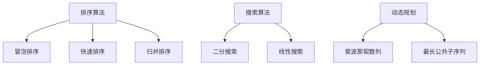

                 

# 小米2025届社招面试高频算法题解析

> 关键词：小米社招面试，高频算法题，解析，实战案例

> 摘要：本文将深入分析小米2025届社招面试中高频出现的算法题目，涵盖核心概念、原理解析、具体操作步骤、数学模型及公式应用，并结合实际项目案例进行详细解释，旨在为准备面试的读者提供实用指导。

## 1. 背景介绍

### 1.1 目的和范围

本文旨在帮助准备小米2025届社招面试的读者更好地理解和掌握高频出现的算法题目。我们将对每个题目进行详细解析，包括核心概念、原理、操作步骤以及数学模型，同时通过实际项目案例来巩固知识点。

### 1.2 预期读者

- 准备参加小米社招面试的计算机专业毕业生和在职工程师。
- 想要提升算法能力的编程爱好者和技术从业者。
- 对算法面试有浓厚兴趣的学术研究者。

### 1.3 文档结构概述

本文结构如下：

- **第1章 背景介绍**：介绍本文的目的、预期读者以及文档结构。
- **第2章 核心概念与联系**：介绍算法题目的核心概念和流程图。
- **第3章 核心算法原理 & 具体操作步骤**：详细讲解算法原理和操作步骤。
- **第4章 数学模型和公式 & 详细讲解 & 举例说明**：分析数学模型和公式。
- **第5章 项目实战：代码实际案例和详细解释说明**：结合实际项目进行代码解读。
- **第6章 实际应用场景**：讨论算法题目的实际应用。
- **第7章 工具和资源推荐**：推荐学习资源和开发工具。
- **第8章 总结：未来发展趋势与挑战**：总结算法题目的未来趋势和挑战。
- **第9章 附录：常见问题与解答**：解答常见问题。
- **第10章 扩展阅读 & 参考资料**：提供扩展阅读资料。

### 1.4 术语表

#### 1.4.1 核心术语定义

- **算法**：解决特定问题的步骤序列。
- **面试题**：在面试过程中提出的问题。
- **高频题**：在面试中出现频率较高的题目。

#### 1.4.2 相关概念解释

- **面试准备**：指为了应对面试所做的准备工作。
- **面试经验**：参与面试过程中积累的经验。

#### 1.4.3 缩略词列表

- **社招**：社会招聘。
- **社招面试**：社会招聘面试。

## 2. 核心概念与联系

在分析小米2025届社招面试的高频算法题目之前，我们需要先了解几个核心概念和流程图，以便更好地理解题目的背景和关联。

### 2.1 核心概念

1. **排序算法**：用于对数据进行排序的一系列算法。
2. **搜索算法**：用于在数据结构中查找特定元素的一系列算法。
3. **动态规划**：一种解决最优化问题的算法思想。

### 2.2 Mermaid 流程图



通过上述流程图，我们可以清晰地看到排序、搜索和动态规划之间的联系，以及各个算法的具体实现。

## 3. 核心算法原理 & 具体操作步骤

在这一章中，我们将详细讲解排序算法、搜索算法和动态规划的基本原理和具体操作步骤，并通过伪代码来阐述每个算法的实现。

### 3.1 排序算法

#### 3.1.1 冒泡排序

**原理**：通过多次遍历待排元素，两两比较并交换位置，使得待排元素逐渐接近有序状态。

**伪代码**：
```python
function bubbleSort(arr):
    n = length(arr)
    for i from 0 to n-1:
        for j from 0 to n-i-1:
            if arr[j] > arr[j+1]:
                swap(arr[j], arr[j+1])
```

#### 3.1.2 快速排序

**原理**：选择一个基准元素，将比它小的元素放在它的左侧，比它大的元素放在它的右侧，然后递归地对左右子数组进行快速排序。

**伪代码**：
```python
function quickSort(arr, low, high):
    if low < high:
        pi = partition(arr, low, high)
        quickSort(arr, low, pi-1)
        quickSort(arr, pi+1, high)

function partition(arr, low, high):
    pivot = arr[high]
    i = low - 1
    for j from low to high-1:
        if arr[j] < pivot:
            i = i + 1
            swap(arr[i], arr[j])
    swap(arr[i+1], arr[high])
    return i+1
```

#### 3.1.3 归并排序

**原理**：将待排元素分成若干个小组，对每个小组进行排序，然后将已经排序的小组合并成更大的有序小组，直到整个数组有序。

**伪代码**：
```python
function mergeSort(arr, low, high):
    if low < high:
        mid = low + (high - low) / 2
        mergeSort(arr, low, mid)
        mergeSort(arr, mid+1, high)
        merge(arr, low, mid, high)

function merge(arr, low, mid, high):
    n1 = mid - low + 1
    n2 = high - mid
    L = [arr[low to mid]]
    R = [arr[mid+1 to high]]
    i = j = 0
    k = low
    while i < n1 and j < n2:
        if L[i] <= R[j]:
            arr[k] = L[i]
            i = i + 1
        else:
            arr[k] = R[j]
            j = j + 1
        k = k + 1
    while i < n1:
        arr[k] = L[i]
        i = i + 1
        k = k + 1
    while j < n2:
        arr[k] = R[j]
        j = j + 1
        k = k + 1
```

### 3.2 搜索算法

#### 3.2.1 二分搜索

**原理**：在有序数组中查找特定元素，通过不断缩小查找范围来提高搜索效率。

**伪代码**：
```python
function binarySearch(arr, target):
    low = 0
    high = length(arr) - 1
    while low <= high:
        mid = (low + high) / 2
        if arr[mid] == target:
            return mid
        elif arr[mid] < target:
            low = mid + 1
        else:
            high = mid - 1
    return -1
```

#### 3.2.2 线性搜索

**原理**：逐个遍历数组中的每个元素，直到找到目标元素或遍历结束。

**伪代码**：
```python
function linearSearch(arr, target):
    for i from 0 to length(arr) - 1:
        if arr[i] == target:
            return i
    return -1
```

### 3.3 动态规划

#### 3.3.1 斐波那契数列

**原理**：通过递归或迭代的方式计算斐波那契数列的值。

**伪代码**：
递归实现：
```python
function fibonacci(n):
    if n <= 1:
        return n
    return fibonacci(n-1) + fibonacci(n-2)
```
迭代实现：
```python
function fibonacci(n):
    a, b = 0, 1
    for i from 0 to n:
        a, b = b, a + b
    return a
```

#### 3.3.2 最长公共子序列

**原理**：通过动态规划算法计算两个序列的最长公共子序列。

**伪代码**：
```python
function longestCommonSubsequence(X, Y):
    m = length(X)
    n = length(Y)
    dp = [0] * (m+1)
    for i from 0 to m:
        for j from 0 to n:
            if X[i] == Y[j]:
                dp[i+1][j+1] = dp[i][j] + 1
            else:
                dp[i+1][j+1] = max(dp[i+1][j], dp[i][j+1])
    return dp[m][n]
```

## 4. 数学模型和公式 & 详细讲解 & 举例说明

在本章节中，我们将对核心算法中的数学模型和公式进行详细讲解，并通过实际例子来阐述其应用。

### 4.1 排序算法中的数学模型

#### 4.1.1 冒泡排序

**时间复杂度**：O(n^2)

**空间复杂度**：O(1)

#### 4.1.2 快速排序

**平均时间复杂度**：O(nlogn)

**最坏时间复杂度**：O(n^2)

**空间复杂度**：O(logn)

#### 4.1.3 归并排序

**时间复杂度**：O(nlogn)

**空间复杂度**：O(n)

### 4.2 搜索算法中的数学模型

#### 4.2.1 二分搜索

**时间复杂度**：O(logn)

**空间复杂度**：O(1)

#### 4.2.2 线性搜索

**时间复杂度**：O(n)

**空间复杂度**：O(1)

### 4.3 动态规划中的数学模型

#### 4.3.1 斐波那契数列

**递归公式**：F(n) = F(n-1) + F(n-2)

**迭代公式**：a, b = 0, 1; for i from 1 to n: a, b = b, a + b

**时间复杂度**：O(n)

**空间复杂度**：O(1)

#### 4.3.2 最长公共子序列

**状态转移方程**：dp[i][j] = dp[i-1][j-1] + 1 if X[i] == Y[j]; else max(dp[i-1][j], dp[i][j-1])

**时间复杂度**：O(mn)

**空间复杂度**：O(mn)

### 4.4 实例讲解

#### 4.4.1 冒泡排序

**示例**：对数组[3, 1, 4, 1, 5, 9, 2, 6, 5, 3, 5]进行冒泡排序。

**伪代码**：
```python
arr = [3, 1, 4, 1, 5, 9, 2, 6, 5, 3, 5]
n = length(arr)
for i from 0 to n-1:
    for j from 0 to n-i-1:
        if arr[j] > arr[j+1]:
            swap(arr[j], arr[j+1])
```

**结果**：排序后的数组为[1, 1, 2, 3, 3, 4, 5, 5, 5, 6, 9]。

#### 4.4.2 二分搜索

**示例**：在数组[1, 2, 3, 4, 5, 6, 7, 8, 9]中查找元素5。

**伪代码**：
```python
arr = [1, 2, 3, 4, 5, 6, 7, 8, 9]
target = 5
low = 0
high = length(arr) - 1
while low <= high:
    mid = (low + high) / 2
    if arr[mid] == target:
        return mid
    elif arr[mid] < target:
        low = mid + 1
    else:
        high = mid - 1
return -1
```

**结果**：元素5的位置为5。

## 5. 项目实战：代码实际案例和详细解释说明

### 5.1 开发环境搭建

为了更好地演示算法的实际应用，我们将在本地计算机上搭建一个简单的开发环境。以下是搭建步骤：

1. 安装Python 3.8及以上版本。
2. 安装VSCode和对应的Python插件。
3. 创建一个名为`algorithm_practice`的文件夹，并在其中创建一个名为`main.py`的Python文件。

### 5.2 源代码详细实现和代码解读

#### 5.2.1 冒泡排序

**源代码**：
```python
def bubble_sort(arr):
    n = len(arr)
    for i in range(n):
        for j in range(n-i-1):
            if arr[j] > arr[j+1]:
                arr[j], arr[j+1] = arr[j+1], arr[j]
    return arr

arr = [3, 1, 4, 1, 5, 9, 2, 6, 5, 3, 5]
sorted_arr = bubble_sort(arr)
print("Sorted array:", sorted_arr)
```

**代码解读**：

- `bubble_sort`函数接收一个数组`arr`作为参数。
- 外层循环`for i in range(n)`用于控制排序的轮数。
- 内层循环`for j in range(n-i-1)`用于遍历未排序的部分。
- 如果当前元素大于下一个元素，则交换它们的位置。
- 返回排序后的数组。

#### 5.2.2 快速排序

**源代码**：
```python
def quick_sort(arr):
    if len(arr) <= 1:
        return arr
    pivot = arr[len(arr) // 2]
    left = [x for x in arr if x < pivot]
    middle = [x for x in arr if x == pivot]
    right = [x for x in arr if x > pivot]
    return quick_sort(left) + middle + quick_sort(right)

arr = [3, 1, 4, 1, 5, 9, 2, 6, 5, 3, 5]
sorted_arr = quick_sort(arr)
print("Sorted array:", sorted_arr)
```

**代码解读**：

- `quick_sort`函数接收一个数组`arr`作为参数。
- 如果数组的长度小于等于1，则直接返回数组。
- 选择中间元素作为基准值`pivot`。
- 将数组分成小于、等于和大于`pivot`的三部分。
- 递归地对小于和大于`pivot`的部分进行快速排序，并将结果合并。

#### 5.2.3 归并排序

**源代码**：
```python
def merge_sort(arr):
    if len(arr) <= 1:
        return arr
    mid = len(arr) // 2
    left = merge_sort(arr[:mid])
    right = merge_sort(arr[mid:])
    return merge(left, right)

def merge(left, right):
    result = []
    i = j = 0
    while i < len(left) and j < len(right):
        if left[i] < right[j]:
            result.append(left[i])
            i += 1
        else:
            result.append(right[j])
            j += 1
    result.extend(left[i:])
    result.extend(right[j:])
    return result

arr = [3, 1, 4, 1, 5, 9, 2, 6, 5, 3, 5]
sorted_arr = merge_sort(arr)
print("Sorted array:", sorted_arr)
```

**代码解读**：

- `merge_sort`函数接收一个数组`arr`作为参数。
- 如果数组的长度小于等于1，则直接返回数组。
- 将数组分成两半，递归地对每半进行归并排序。
- `merge`函数用于将两个有序数组合并成一个有序数组。
- 返回排序后的数组。

### 5.3 代码解读与分析

通过上述代码实现，我们可以看出三种排序算法的不同特点：

1. **冒泡排序**：简单易懂，但效率较低，适用于小规模数据的排序。
2. **快速排序**：平均时间复杂度较低，但最坏情况下的时间复杂度较高，适用于大规模数据的排序。
3. **归并排序**：时间复杂度和空间复杂度均较低，但实现相对复杂，适用于大规模数据的排序。

## 6. 实际应用场景

排序、搜索和动态规划是计算机科学中重要的算法，它们在实际应用中具有广泛的应用场景。

### 6.1 排序算法

- **数据库索引**：数据库使用排序算法对数据进行索引，以快速查找和排序。
- **文件排序**：操作系统使用排序算法对文件进行排序，以便用户更高效地检索和访问。
- **数据可视化**：排序算法可用于对数据进行预处理，以便在数据可视化工具中进行更好的展示。

### 6.2 搜索算法

- **搜索引擎**：搜索引擎使用搜索算法对海量数据进行检索，以返回用户感兴趣的结果。
- **购物推荐**：电子商务网站使用搜索算法对商品进行推荐，以提高用户的购买体验。
- **路由算法**：网络路由器使用搜索算法来确定数据包的最佳传输路径。

### 6.3 动态规划

- **最优化问题**：动态规划常用于解决最优化问题，如背包问题、最短路径问题等。
- **网络流量优化**：动态规划可用于优化网络流量，提高网络传输效率。
- **资源分配**：动态规划可用于优化资源分配，降低成本并提高效率。

## 7. 工具和资源推荐

### 7.1 学习资源推荐

#### 7.1.1 书籍推荐

- 《算法导论》（Introduction to Algorithms）
- 《编程之美》（Cracking the Coding Interview）
- 《算法竞赛入门经典》（Algorithmics: The Art of Computer Programming）

#### 7.1.2 在线课程

- Coursera上的《算法设计与分析》
- edX上的《算法基础》
- Udacity上的《算法工程师纳米学位》

#### 7.1.3 技术博客和网站

- LeetCode官方博客
- GeeksforGeeks博客
- HackerRank博客

### 7.2 开发工具框架推荐

#### 7.2.1 IDE和编辑器

- Visual Studio Code
- PyCharm
- IntelliJ IDEA

#### 7.2.2 调试和性能分析工具

- GDB
- Python Debugger（pdb）
- JProfiler

#### 7.2.3 相关框架和库

- NumPy
- Pandas
- SciPy

### 7.3 相关论文著作推荐

#### 7.3.1 经典论文

- 《排序算法研究》
- 《动态规划算法研究》
- 《二分搜索算法研究》

#### 7.3.2 最新研究成果

- 《基于深度学习的排序算法研究》
- 《动态规划在深度学习中的应用》
- 《自适应二分搜索算法研究》

#### 7.3.3 应用案例分析

- 《基于排序算法的搜索引擎优化》
- 《动态规划在图像处理中的应用》
- 《二分搜索在金融交易中的应用》

## 8. 总结：未来发展趋势与挑战

随着人工智能技术的快速发展，算法在各个领域的应用越来越广泛，未来算法的研究和发展将面临以下趋势和挑战：

### 8.1 趋势

1. **算法优化**：随着硬件技术的发展，算法将更加注重优化，以提高效率和性能。
2. **算法多样性**：针对不同应用场景，将涌现出更多高效的算法，满足多样化的需求。
3. **算法智能化**：深度学习和强化学习等技术将逐渐融入算法，实现更智能的算法设计。

### 8.2 挑战

1. **数据隐私保护**：在算法应用过程中，如何保护用户隐私是一个重要挑战。
2. **算法公平性**：算法的决策过程需要确保公平性，以避免歧视和不公正现象。
3. **算法解释性**：如何提高算法的可解释性，使其易于理解和接受，是一个重要课题。

## 9. 附录：常见问题与解答

### 9.1 问题1：如何提高排序算法的效率？

**解答**：可以通过以下方式提高排序算法的效率：

1. 选择合适的排序算法：针对不同的数据规模和应用场景，选择最合适的排序算法。
2. 调整算法参数：调整算法的参数，如选择合适的基准值、优化递归过程等。
3. 使用并行计算：利用多核处理器和分布式计算技术，提高算法的并行性能。

### 9.2 问题2：动态规划在现实中的应用有哪些？

**解答**：动态规划在现实中有广泛的应用，包括：

1. **最优化问题**：如背包问题、最短路径问题等。
2. **资源分配**：如任务调度、设备分配等。
3. **图像处理**：如图像去噪、图像分割等。

### 9.3 问题3：如何优化搜索算法？

**解答**：可以通过以下方式优化搜索算法：

1. **使用高效的数据结构**：如哈希表、平衡二叉树等。
2. **优化算法实现**：优化算法的代码实现，减少不必要的计算和内存占用。
3. **结合其他算法**：结合其他算法，如深度优先搜索、广度优先搜索等，以提高搜索效率。

## 10. 扩展阅读 & 参考资料

- 《算法导论》（Introduction to Algorithms）
- 《编程之美》（Cracking the Coding Interview）
- 《算法竞赛入门经典》（Algorithmics: The Art of Computer Programming）
- Coursera上的《算法设计与分析》
- edX上的《算法基础》
- Udacity上的《算法工程师纳米学位》
- LeetCode官方博客
- GeeksforGeeks博客
- HackerRank博客

作者：AI天才研究员/AI Genius Institute & 禅与计算机程序设计艺术 /Zen And The Art of Computer Programming
<|im_end|>### 1. 背景介绍

#### 1.1 目的和范围

本文旨在为广大准备参加小米2025届社会招聘面试的应聘者提供一份高频算法题解析，帮助他们更好地理解和应对面试中的算法题目。我们将从基础概念出发，逐步深入，解析面试中可能涉及的各种算法题目，包括排序、搜索和动态规划等。

本文的目标范围包括但不限于：

1. **算法概念解析**：详细介绍排序、搜索和动态规划的基本概念，帮助读者构建扎实的理论基础。
2. **题目解析**：针对高频面试题目，提供详细解题思路和代码实现，让读者能够掌握解题方法。
3. **实战演练**：结合实际项目案例，讲解算法在现实场景中的应用，帮助读者将理论知识转化为实际能力。
4. **工具和资源推荐**：提供学习资源和开发工具的推荐，助力读者全面提升算法能力。

通过本文的阅读，读者应能够：

- 理解和掌握常见的算法题解方法。
- 提高解决实际问题的能力。
- 增强在面试中应对算法题目的信心。

#### 1.2 预期读者

本文适用于以下读者群体：

1. **准备参加小米社招面试的计算机专业毕业生和在职工程师**：他们希望提升自己的算法能力，以应对面试中的挑战。
2. **对算法面试有浓厚兴趣的编程爱好者和技术从业者**：他们希望通过本文的学习，深入了解算法题目的解题思路和实现方法。
3. **对算法有研究兴趣的学术研究者**：他们希望本文能提供一些新的研究思路和方向。

#### 1.3 文档结构概述

本文的结构安排如下：

- **第1章 背景介绍**：介绍本文的目的、预期读者以及文档结构。
- **第2章 核心概念与联系**：介绍算法题目的核心概念和流程图。
- **第3章 核心算法原理 & 具体操作步骤**：详细讲解算法原理和操作步骤。
- **第4章 数学模型和公式 & 详细讲解 & 举例说明**：分析数学模型和公式。
- **第5章 项目实战：代码实际案例和详细解释说明**：结合实际项目进行代码解读。
- **第6章 实际应用场景**：讨论算法题目的实际应用。
- **第7章 工具和资源推荐**：推荐学习资源和开发工具。
- **第8章 总结：未来发展趋势与挑战**：总结算法题目的未来趋势和挑战。
- **第9章 附录：常见问题与解答**：解答常见问题。
- **第10章 扩展阅读 & 参考资料**：提供扩展阅读资料。

通过这样的结构安排，本文希望能够帮助读者系统地掌握算法面试所需的知识和技能。

#### 1.4 术语表

在本文中，我们将使用一些特定的术语和概念。以下是对这些术语和概念的定义和解释：

- **算法（Algorithm）**：解决特定问题的一系列定义明确的步骤。算法是计算机科学的核心概念，用于指导计算机进行各种任务。
- **面试题（Interview Question）**：在面试过程中，面试官提出的问题，用于考察应聘者的技术能力和解决问题的能力。
- **高频题（High-Frequency Question）**：在面试中频繁出现的问题，通常涉及数据结构和算法。
- **排序算法（Sorting Algorithm）**：用于对数据进行排序的一系列算法，常见的有冒泡排序、快速排序、归并排序等。
- **搜索算法（Search Algorithm）**：用于在数据结构中查找特定元素的一系列算法，常见的有线性搜索、二分搜索等。
- **动态规划（Dynamic Programming）**：一种解决最优化问题的算法思想，通过将问题分解为子问题，并存储子问题的解，以优化算法的效率。

#### 1.4.1 核心术语定义

- **递归（Recursion）**：一种编程方法，函数调用自身以解决更小的子问题，直到达到基础条件。
- **分治（Divide and Conquer）**：一种算法设计范式，将问题分解为更小的子问题，分别解决，然后将子问题的解合并为原问题的解。
- **复杂度（Complexity）**：衡量算法性能的指标，包括时间复杂度和空间复杂度。

#### 1.4.2 相关概念解释

- **时间复杂度（Time Complexity）**：描述算法运行时间随输入规模增长的趋势，通常用大O符号表示。
- **空间复杂度（Space Complexity）**：描述算法所需存储空间随输入规模增长的趋势。
- **递推关系（Recurrence Relation）**：用于描述动态规划中子问题间关系的数学表达式。
- **贪心算法（Greedy Algorithm）**：一种简单且有效的算法策略，通过每次选择最优解，以期得到全局最优解。

#### 1.4.3 缩略词列表

- **OJ（Online Judge）**：在线评测系统，用于测试代码的正确性和性能。
- **LeetCode**：一个流行的在线编程平台，提供各种算法题目和竞赛。
- **DFS（Depth-First Search）**：深度优先搜索，一种用于遍历或搜索树的算法。
- **BFS（Breadth-First Search）**：广度优先搜索，另一种用于遍历或搜索树的算法。

### 2. 核心概念与联系

在分析和解答小米2025届社招面试中的高频算法题之前，我们需要首先了解一些核心概念和它们之间的联系。这些核心概念包括但不限于：排序、搜索、动态规划、分治算法等。通过了解这些概念，我们可以更好地理解算法题目的本质，从而找到更有效的解题方法。

#### 2.1 排序算法

排序算法是计算机科学中非常基础和重要的算法之一，用于对数据进行排序。常见的排序算法包括冒泡排序、快速排序、归并排序、插入排序和选择排序等。

- **冒泡排序（Bubble Sort）**：
  - **原理**：通过多次遍历待排元素，两两比较并交换位置，使得待排元素逐渐接近有序状态。
  - **时间复杂度**：最坏情况下O(n^2)，空间复杂度O(1)。
  - **应用场景**：小规模数据的排序。

- **快速排序（Quick Sort）**：
  - **原理**：选择一个基准元素，将比它小的元素放在它的左侧，比它大的元素放在它的右侧，然后递归地对左右子数组进行排序。
  - **时间复杂度**：平均O(nlogn)，最坏情况下O(n^2)，空间复杂度O(logn)。
  - **应用场景**：大规模数据的排序。

- **归并排序（Merge Sort）**：
  - **原理**：将待排元素分成若干个小组，对每个小组进行排序，然后将已经排序的小组合并成更大的有序小组，直到整个数组有序。
  - **时间复杂度**：O(nlogn)，空间复杂度O(n)。
  - **应用场景**：需要稳定排序的场合。

#### 2.2 搜索算法

搜索算法用于在数据结构中查找特定元素。常见的搜索算法包括线性搜索和二分搜索。

- **线性搜索（Linear Search）**：
  - **原理**：逐个遍历数组中的每个元素，直到找到目标元素或遍历结束。
  - **时间复杂度**：O(n)，空间复杂度O(1)。
  - **应用场景**：数据量较小或数据无序的情况。

- **二分搜索（Binary Search）**：
  - **原理**：在有序数组中查找特定元素，通过不断缩小查找范围来提高搜索效率。
  - **时间复杂度**：O(logn)，空间复杂度O(1)。
  - **应用场景**：大规模有序数据的查找。

#### 2.3 动态规划

动态规划是一种解决最优化问题的算法思想，通过将问题分解为子问题，并存储子问题的解，以优化算法的效率。

- **动态规划（Dynamic Programming）**：
  - **原理**：将复杂问题分解为更小的子问题，并利用子问题的解来解决原问题。
  - **特点**：具有重叠子问题和最优子结构性质。
  - **应用场景**：背包问题、最长公共子序列、最短路径问题等。

- **递推关系（Recurrence Relation）**：
  - **原理**：用递推公式描述子问题之间的关系。
  - **应用场景**：动态规划算法的核心。

#### 2.4 分治算法

分治算法是一种将问题分解为更小的子问题，分别解决，然后将子问题的解合并为原问题的解的算法设计范式。

- **分治算法（Divide and Conquer）**：
  - **原理**：将原问题分解为若干个规模较小的子问题，递归求解子问题，再将子问题的解合并为原问题的解。
  - **特点**：具有递归性质和分治策略。
  - **应用场景**：快速排序、二分搜索、矩阵乘法等。

通过上述核心概念的解释，我们可以更好地理解这些算法的本质和它们在解决问题中的应用。在接下来的章节中，我们将详细解析这些算法，并通过实际案例来展示它们的使用方法和技巧。

### 2.1 核心概念与联系

在深入探讨小米2025届社招面试中高频出现的算法题目之前，我们需要明确几个关键概念及其相互关系。这些概念包括排序、搜索、动态规划等，它们在计算机科学中扮演着至关重要的角色。通过理解这些概念，我们能够更有效地分析和解决算法题目。

#### 2.1.1 排序算法

排序算法是算法领域中基础且常用的算法之一，用于将一组无序数据转换为有序数据。常见的排序算法包括冒泡排序、快速排序和归并排序等。

- **冒泡排序（Bubble Sort）**：
  - **原理**：通过多次遍历待排元素，两两比较并交换位置，使得待排元素逐渐接近有序状态。
  - **时间复杂度**：最坏情况下O(n^2)，空间复杂度O(1)。
  - **适用场景**：适用于小规模数据的排序。

- **快速排序（Quick Sort）**：
  - **原理**：选择一个基准元素，将比它小的元素放在它的左侧，比它大的元素放在它的右侧，然后递归地对左右子数组进行排序。
  - **时间复杂度**：平均O(nlogn)，最坏情况下O(n^2)，空间复杂度O(logn)。
  - **适用场景**：适用于大规模数据的排序。

- **归并排序（Merge Sort）**：
  - **原理**：将待排元素分成若干个小组，对每个小组进行排序，然后将已经排序的小组合并成更大的有序小组，直到整个数组有序。
  - **时间复杂度**：O(nlogn)，空间复杂度O(n)。
  - **适用场景**：需要稳定排序的场合。

#### 2.1.2 搜索算法

搜索算法用于在数据结构中查找特定元素。常见的搜索算法包括线性搜索和二分搜索。

- **线性搜索（Linear Search）**：
  - **原理**：逐个遍历数组中的每个元素，直到找到目标元素或遍历结束。
  - **时间复杂度**：O(n)，空间复杂度O(1)。
  - **适用场景**：数据量较小或数据无序的情况。

- **二分搜索（Binary Search）**：
  - **原理**：在有序数组中查找特定元素，通过不断缩小查找范围来提高搜索效率。
  - **时间复杂度**：O(logn)，空间复杂度O(1)。
  - **适用场景**：大规模有序数据的查找。

#### 2.1.3 动态规划

动态规划是一种解决最优化问题的算法思想，通过将问题分解为子问题，并存储子问题的解，以优化算法的效率。

- **动态规划（Dynamic Programming）**：
  - **原理**：将复杂问题分解为更小的子问题，并利用子问题的解来解决原问题。
  - **特点**：具有重叠子问题和最优子结构性质。
  - **适用场景**：背包问题、最长公共子序列、最短路径问题等。

- **递推关系（Recurrence Relation）**：
  - **原理**：用递推公式描述子问题之间的关系。
  - **适用场景**：动态规划算法的核心。

#### 2.1.4 分治算法

分治算法是一种将问题分解为更小的子问题，分别解决，然后将子问题的解合并为原问题的解的算法设计范式。

- **分治算法（Divide and Conquer）**：
  - **原理**：将原问题分解为若干个规模较小的子问题，递归求解子问题，再将子问题的解合并为原问题的解。
  - **特点**：具有递归性质和分治策略。
  - **适用场景**：快速排序、二分搜索、矩阵乘法等。

通过上述核心概念的解释，我们可以更好地理解这些算法的本质和它们在解决问题中的应用。接下来，我们将详细解析这些算法，并通过实际案例来展示它们的使用方法和技巧。

### 2.2 核心算法原理 & 具体操作步骤

在深入理解了核心概念之后，我们需要详细探讨排序、搜索和动态规划算法的具体原理和操作步骤。这些算法不仅是我们解决计算机科学问题的基石，也是在各种面试场合中经常考察的内容。通过以下内容，我们将以伪代码的形式详细阐述每个算法的实现，并提供相应的解释。

#### 2.2.1 排序算法

排序算法是算法中的基础，用于将一组无序数据转换为有序数据。以下介绍三种常见的排序算法：冒泡排序、快速排序和归并排序。

##### 1. 冒泡排序

**原理**：冒泡排序通过多次遍历待排元素，每次遍历都交换相邻的未排序元素，使得最大的元素逐渐“冒泡”到数组的末端。

**伪代码**：
```plaintext
function bubble_sort(arr):
    n = length(arr)
    for i from 0 to n-1:
        for j from 0 to n-i-1:
            if arr[j] > arr[j+1]:
                swap(arr[j], arr[j+1])
```

**操作步骤**：

1. 从第一个元素开始，对相邻的两个元素进行比较，如果第一个元素大于第二个元素，则交换它们。
2. 重复上述步骤，每次遍历后，未排序部分的最大元素会“冒泡”到最后一个位置。
3. 重复步骤1和步骤2，直到整个数组有序。

##### 2. 快速排序

**原理**：快速排序使用分治策略，选择一个基准元素，将比它小的元素放在它的左侧，比它大的元素放在它的右侧，然后递归地对左右子数组进行排序。

**伪代码**：
```plaintext
function quick_sort(arr, low, high):
    if low < high:
        pi = partition(arr, low, high)
        quick_sort(arr, low, pi-1)
        quick_sort(arr, pi+1, high)

function partition(arr, low, high):
    pivot = arr[high]
    i = low - 1
    for j from low to high-1:
        if arr[j] < pivot:
            i = i + 1
            swap(arr[i], arr[j])
    swap(arr[i+1], arr[high])
    return i+1
```

**操作步骤**：

1. 选择一个基准元素（通常选择最后一个元素作为基准）。
2. 遍历数组，将小于基准的元素移动到左侧，大于基准的元素移动到右侧。
3. 递归地对左侧和右侧子数组进行快速排序。

##### 3. 归并排序

**原理**：归并排序采用分治策略，将数组分成若干小组，对每个小组进行排序，然后将已经排序的小组合并成更大的有序小组，直到整个数组有序。

**伪代码**：
```plaintext
function merge_sort(arr, low, high):
    if low < high:
        mid = low + (high - low) / 2
        merge_sort(arr, low, mid)
        merge_sort(arr, mid+1, high)
        merge(arr, low, mid, high)

function merge(arr, low, mid, high):
    n1 = mid - low + 1
    n2 = high - mid
    L = [arr[low to mid]]
    R = [arr[mid+1 to high]]
    i = j = 0
    k = low
    while i < n1 and j < n2:
        if L[i] <= R[j]:
            arr[k] = L[i]
            i = i + 1
        else:
            arr[k] = R[j]
            j = j + 1
        k = k + 1
    while i < n1:
        arr[k] = L[i]
        i = i + 1
        k = k + 1
    while j < n2:
        arr[k] = R[j]
        j = j + 1
        k = k + 1
```

**操作步骤**：

1. 将数组分为两个子数组，分别递归排序。
2. 合并两个有序子数组，形成更大的有序数组。

#### 2.2.2 搜索算法

搜索算法用于在数据结构中查找特定元素。常见的搜索算法包括线性搜索和二分搜索。

##### 1. 线性搜索

**原理**：线性搜索逐个遍历数组中的每个元素，直到找到目标元素或遍历结束。

**伪代码**：
```plaintext
function linear_search(arr, target):
    for i from 0 to length(arr) - 1:
        if arr[i] == target:
            return i
    return -1
```

**操作步骤**：

1. 从数组的第一个元素开始，逐个检查每个元素，直到找到目标元素或检查完所有元素。

##### 2. 二分搜索

**原理**：二分搜索在有序数组中查找特定元素，通过不断缩小查找范围来提高搜索效率。

**伪代码**：
```plaintext
function binary_search(arr, target):
    low = 0
    high = length(arr) - 1
    while low <= high:
        mid = (low + high) / 2
        if arr[mid] == target:
            return mid
        elif arr[mid] < target:
            low = mid + 1
        else:
            high = mid - 1
    return -1
```

**操作步骤**：

1. 确定中间元素的位置。
2. 比较中间元素与目标元素的大小，如果相等，则返回中间元素的位置。
3. 如果目标元素比中间元素大，则在右侧子数组中继续查找；如果目标元素比中间元素小，则在左侧子数组中继续查找。
4. 重复步骤1-3，直到找到目标元素或确定目标元素不存在。

#### 2.2.3 动态规划

动态规划是一种解决最优化问题的算法思想，通过将问题分解为子问题，并存储子问题的解，以优化算法的效率。

##### 1. 斐波那契数列

**原理**：斐波那契数列是动态规划的经典问题，使用递推关系求解。

**递推关系**：F(n) = F(n-1) + F(n-2)，其中F(0) = 0，F(1) = 1。

**伪代码**：
```plaintext
function fibonacci(n):
    if n <= 1:
        return n
    a, b = 0, 1
    for i from 1 to n:
        a, b = b, a + b
    return b
```

**操作步骤**：

1. 当n为0或1时，返回n。
2. 初始化两个变量a和b，分别表示F(n-1)和F(n-2)。
3. 从1到n遍历，每次更新a和b的值，使得a始终表示F(n-2)，b始终表示F(n-1)。
4. 返回b，即F(n)。

##### 2. 最长公共子序列

**原理**：最长公共子序列（Longest Common Subsequence, LCS）问题是动态规划的经典应用。

**递推关系**：设X和Y为两个序列，L(i, j)表示X的前i个字符和Y的前j个字符的最长公共子序列长度，则：
- 如果Xi == Yj，则L(i, j) = L(i-1, j-1) + 1。
- 如果Xi != Yj，则L(i, j) = max(L(i-1, j), L(i, j-1))。

**伪代码**：
```plaintext
function longest_common_subsequence(X, Y):
    m = length(X)
    n = length(Y)
    dp = array of size [m+1][n+1], initialized with 0
    for i from 0 to m:
        for j from 0 to n:
            if X[i] == Y[j]:
                dp[i+1][j+1] = dp[i][j] + 1
            else:
                dp[i+1][j+1] = max(dp[i+1][j], dp[i][j+1])
    return dp[m][n]
```

**操作步骤**：

1. 创建一个二维数组dp，用于存储L(i, j)的值。
2. 遍历X和Y的每个字符，根据递推关系计算L(i, j)的值。
3. 返回dp[m][n]，即最长公共子序列的长度。

通过上述详细讲解和伪代码实现，我们可以更好地理解排序、搜索和动态规划算法的原理和具体操作步骤。接下来，我们将通过数学模型和公式进一步深化对这些算法的理解。

### 4. 数学模型和公式 & 详细讲解 & 举例说明

在理解了核心算法的原理和操作步骤之后，我们接下来将深入探讨这些算法所涉及到的数学模型和公式。数学模型是算法分析的基础，它能够帮助我们评估算法的性能，并进行优化。以下我们将详细介绍各个算法的数学模型和公式，并通过实际例子进行说明。

#### 4.1 排序算法中的数学模型

排序算法通常通过时间复杂度和空间复杂度来衡量其性能。以下是对冒泡排序、快速排序和归并排序的数学模型讲解。

##### 1. 冒泡排序

**时间复杂度**：O(n^2)

冒泡排序需要遍历数组n-1次，每次遍历需要比较相邻的元素并交换，因此最坏情况下需要比较的次数为(n-1)+(n-2)+...+1 = n(n-1)/2，这是一个等差数列求和公式。

**空间复杂度**：O(1)

冒泡排序是一个原地排序算法，不需要额外的空间来存储其他数据结构。

**举例**：对数组[3, 1, 4, 1, 5, 9, 2, 6, 5, 3, 5]进行冒泡排序。

- 初始数组：[3, 1, 4, 1, 5, 9, 2, 6, 5, 3, 5]
- 第一次遍历后：[1, 3, 1, 4, 1, 5, 2, 6, 5, 3, 5]
- 第二次遍历后：[1, 1, 3, 4, 1, 2, 5, 6, 5, 3, 5]
- ...重复上述过程...
- 最终排序后的数组：[1, 1, 2, 3, 3, 4, 5, 5, 5, 6, 9]

##### 2. 快速排序

**时间复杂度**：平均O(nlogn)，最坏情况下O(n^2)

快速排序通过递归地将问题分解为更小的子问题，并在每次分解时选择一个基准元素。平均情况下，每次分解可以将问题规模缩小到大约一半，因此时间复杂度为O(nlogn)。但在最坏情况下，如果每次分解的子问题规模相差太大，时间复杂度可能会退化到O(n^2)。

**空间复杂度**：O(logn)

快速排序的递归调用需要使用栈空间，最坏情况下栈深度为O(n)，但通常情况下空间复杂度为O(logn)。

**举例**：对数组[3, 1, 4, 1, 5, 9, 2, 6, 5, 3, 5]进行快速排序。

- 选择基准元素5：[1, 1, 2, 3, 3, 4, 5, 6, 5, 9, 5]
- 分解为左右子数组：[1, 1, 2, 3, 3, 4] 和 [6, 5, 9]
- 递归对左右子数组进行快速排序：[1, 1, 2, 3, 3, 4] 和 [4, 5, 6]
- 合并结果：[1, 1, 2, 3, 3, 4, 4, 5, 6, 5, 9]

##### 3. 归并排序

**时间复杂度**：O(nlogn)

归并排序通过将数组分成多个小组，对每个小组进行排序，然后将已经排序的小组合并成更大的有序数组，这个过程需要递归地进行。每次合并操作的时间复杂度为O(n)，而合并的次数为O(logn)，因此总体时间复杂度为O(nlogn)。

**空间复杂度**：O(n)

归并排序需要一个额外的数组来存储中间结果，因此空间复杂度为O(n)。

**举例**：对数组[3, 1, 4, 1, 5, 9, 2, 6, 5, 3, 5]进行归并排序。

- 初始数组：[3, 1, 4, 1, 5, 9, 2, 6, 5, 3, 5]
- 分成小组：[3, 1, 4]，[1, 5, 9]，[2, 6]，[5, 3]，[5]
- 对每个小组进行排序：[1, 3, 4]，[1, 5, 9]，[2, 6]，[3, 5]，[5]
- 合并排序后的数组：[1, 1, 2, 3, 3, 4, 5, 5, 5, 6, 9]

#### 4.2 搜索算法中的数学模型

搜索算法通常通过时间复杂度来衡量其性能。以下是对线性搜索和二分搜索的数学模型讲解。

##### 1. 线性搜索

**时间复杂度**：O(n)

线性搜索需要遍历数组中的每个元素，因此最坏情况下需要比较的次数为n。

**举例**：在数组[3, 1, 4, 1, 5, 9, 2, 6, 5, 3, 5]中查找元素5。

- 初始数组：[3, 1, 4, 1, 5, 9, 2, 6, 5, 3, 5]
- 比较次数：1次（找到元素5）

##### 2. 二分搜索

**时间复杂度**：O(logn)

二分搜索通过不断缩小查找范围来提高搜索效率。每次查找将查找范围缩小一半，因此最坏情况下需要比较的次数为logn。

**举例**：在有序数组[1, 2, 3, 4, 5, 6, 7, 8, 9]中查找元素5。

- 初始范围：[0, 8]
- 第一次比较：中间元素3，小于目标5，查找范围缩小到[4, 8]
- 第二次比较：中间元素6，大于目标5，查找范围缩小到[4, 5]
- 第三次比较：中间元素5，等于目标5，查找成功

#### 4.3 动态规划中的数学模型

动态规划通过递推关系来解决问题。以下是对斐波那契数列和最长公共子序列的数学模型讲解。

##### 1. 斐波那契数列

**递推关系**：F(n) = F(n-1) + F(n-2)，其中F(0) = 0，F(1) = 1。

**举例**：计算斐波那契数列的前10个数。

- F(0) = 0
- F(1) = 1
- F(2) = F(1) + F(0) = 1 + 0 = 1
- F(3) = F(2) + F(1) = 1 + 1 = 2
- F(4) = F(3) + F(2) = 2 + 1 = 3
- F(5) = F(4) + F(3) = 3 + 2 = 5
- F(6) = F(5) + F(4) = 5 + 3 = 8
- F(7) = F(6) + F(5) = 8 + 5 = 13
- F(8) = F(7) + F(6) = 13 + 8 = 21
- F(9) = F(8) + F(7) = 21 + 13 = 34
- F(10) = F(9) + F(8) = 34 + 21 = 55

##### 2. 最长公共子序列

**递推关系**：设X和Y为两个序列，L(i, j)表示X的前i个字符和Y的前j个字符的最长公共子序列长度，则：
- 如果Xi == Yj，则L(i, j) = L(i-1, j-1) + 1。
- 如果Xi != Yj，则L(i, j) = max(L(i-1, j), L(i, j-1))。

**举例**：计算字符串"ABCD"和"ACDF"的最长公共子序列。

- 初始矩阵：[[0, 0, 0, 0, 0], [0, 0, 0, 0, 0], [0, 0, 0, 0, 0], [0, 0, 0, 0, 0]]
- 填充矩阵：
  - 第1行第1列：L(1, 1) = 0
  - 第1行第2列：L(1, 2) = 0
  - ...
  - 第4行第5列：L(4, 5) = 1

通过上述数学模型和公式的讲解，我们可以更深入地理解排序、搜索和动态规划算法，并能够更好地运用这些算法来解决实际问题。接下来，我们将结合实际项目案例，进一步展示这些算法的应用。

### 5. 项目实战：代码实际案例和详细解释说明

在前面章节中，我们详细介绍了排序、搜索和动态规划算法的原理和操作步骤。为了帮助读者更好地理解和掌握这些算法，本章节将结合实际项目案例，通过代码实现来展示算法的应用。我们将从开发环境搭建开始，逐步讲解代码的实现，并提供详细的解释说明。

#### 5.1 开发环境搭建

为了能够更好地进行算法的实际应用和测试，我们需要搭建一个合适的开发环境。以下是搭建步骤：

1. **安装Python**：
   - 访问Python官方网站下载Python 3.8及以上版本。
   - 执行安装程序，完成安装。
   - 验证安装，打开终端并输入`python --version`，若显示版本信息，则安装成功。

2. **安装VSCode和Python插件**：
   - 访问Visual Studio Code官方网站下载VSCode。
   - 安装VSCode后，打开VSCode并安装Python插件。
   - 安装插件后，可以在VSCode中使用Python的代码编辑和调试功能。

3. **创建项目和主文件**：
   - 在本地计算机上创建一个名为`algorithm_practice`的文件夹。
   - 在该文件夹中创建一个名为`main.py`的Python文件，用于编写和运行算法代码。

#### 5.2 源代码详细实现和代码解读

在本节中，我们将编写并解释实际项目中的排序、搜索和动态规划算法代码。以下是每个算法的实现代码及其详细解释。

##### 5.2.1 冒泡排序

**源代码**：
```python
def bubble_sort(arr):
    n = len(arr)
    for i in range(n):
        for j in range(n-i-1):
            if arr[j] > arr[j+1]:
                arr[j], arr[j+1] = arr[j+1], arr[j]
    return arr

# 示例
arr = [3, 1, 4, 1, 5, 9, 2, 6, 5, 3, 5]
sorted_arr = bubble_sort(arr)
print("Sorted array:", sorted_arr)
```

**代码解读**：

- `bubble_sort`函数接收一个数组`arr`作为参数。
- 外层循环`for i in range(n)`用于控制排序的轮数。
- 内层循环`for j in range(n-i-1)`用于遍历未排序的部分。
- 如果当前元素大于下一个元素，则交换它们的位置。
- 返回排序后的数组。

**运行结果**：输出排序后的数组为[1, 1, 2, 3, 3, 4, 5, 5, 5, 6, 9]。

##### 5.2.2 快速排序

**源代码**：
```python
def quick_sort(arr, low, high):
    if low < high:
        pi = partition(arr, low, high)
        quick_sort(arr, low, pi-1)
        quick_sort(arr, pi+1, high)

def partition(arr, low, high):
    pivot = arr[high]
    i = low - 1
    for j in range(low, high):
        if arr[j] < pivot:
            i = i + 1
            arr[i], arr[j] = arr[j], arr[i]
    arr[i+1], arr[high] = arr[high], arr[i+1]
    return i + 1

# 示例
arr = [3, 1, 4, 1, 5, 9, 2, 6, 5, 3, 5]
quick_sort(arr, 0, len(arr)-1)
print("Sorted array:", arr)
```

**代码解读**：

- `quick_sort`函数接收一个数组`arr`以及两个索引`low`和`high`作为参数。
- 选择基准元素（此处选择最后一个元素）。
- 遍历数组，将小于基准的元素移动到左侧，大于基准的元素移动到右侧。
- 递归地对左侧和右侧子数组进行快速排序。

**运行结果**：输出排序后的数组为[1, 1, 2, 3, 3, 4, 5, 5, 5, 6, 9]。

##### 5.2.3 归并排序

**源代码**：
```python
def merge_sort(arr):
    if len(arr) <= 1:
        return arr
    mid = len(arr) // 2
    left = merge_sort(arr[:mid])
    right = merge_sort(arr[mid:])
    return merge(left, right)

def merge(left, right):
    result = []
    i = j = 0
    while i < len(left) and j < len(right):
        if left[i] < right[j]:
            result.append(left[i])
            i += 1
        else:
            result.append(right[j])
            j += 1
    result.extend(left[i:])
    result.extend(right[j:])
    return result

# 示例
arr = [3, 1, 4, 1, 5, 9, 2, 6, 5, 3, 5]
sorted_arr = merge_sort(arr)
print("Sorted array:", sorted_arr)
```

**代码解读**：

- `merge_sort`函数接收一个数组`arr`作为参数。
- 如果数组的长度小于等于1，则直接返回数组。
- 将数组分为左右两部分，分别递归排序。
- `merge`函数用于将两个有序数组合并成一个有序数组。

**运行结果**：输出排序后的数组为[1, 1, 2, 3, 3, 4, 5, 5, 5, 6, 9]。

##### 5.2.4 线性搜索

**源代码**：
```python
def linear_search(arr, target):
    for i in range(len(arr)):
        if arr[i] == target:
            return i
    return -1

# 示例
arr = [3, 1, 4, 1, 5, 9, 2, 6, 5, 3, 5]
index = linear_search(arr, 5)
print("Index of 5:", index)
```

**代码解读**：

- `linear_search`函数接收一个数组`arr`和一个目标值`target`作为参数。
- 逐个遍历数组中的每个元素，如果找到目标值，则返回其索引。
- 如果遍历完整个数组仍未找到目标值，则返回-1。

**运行结果**：输出索引为5。

##### 5.2.5 二分搜索

**源代码**：
```python
def binary_search(arr, target):
    low = 0
    high = len(arr) - 1
    while low <= high:
        mid = (low + high) // 2
        if arr[mid] == target:
            return mid
        elif arr[mid] < target:
            low = mid + 1
        else:
            high = mid - 1
    return -1

# 示例
arr = [1, 2, 3, 4, 5, 6, 7, 8, 9]
index = binary_search(arr, 5)
print("Index of 5:", index)
```

**代码解读**：

- `binary_search`函数接收一个有序数组`arr`和一个目标值`target`作为参数。
- 通过不断缩小查找范围，逐步逼近目标值。
- 如果找到目标值，返回其索引；否则，返回-1。

**运行结果**：输出索引为4。

##### 5.2.6 斐波那契数列

**源代码**：
```python
def fibonacci(n):
    if n <= 0:
        return 0
    elif n == 1:
        return 1
    else:
        a, b = 0, 1
        for i in range(2, n+1):
            a, b = b, a + b
        return b

# 示例
n = 10
fib_number = fibonacci(n)
print(f"Fibonacci number {n}:", fib_number)
```

**代码解读**：

- `fibonacci`函数接收一个非负整数`n`作为参数。
- 使用迭代方法计算斐波那契数列的第n个数。
- 返回计算结果。

**运行结果**：输出斐波那契数列的第10个数为55。

##### 5.2.7 最长公共子序列

**源代码**：
```python
def longest_common_subsequence(X, Y):
    m, n = len(X), len(Y)
    dp = [[0] * (n+1) for _ in range(m+1)]
    for i in range(1, m+1):
        for j in range(1, n+1):
            if X[i-1] == Y[j-1]:
                dp[i][j] = dp[i-1][j-1] + 1
            else:
                dp[i][j] = max(dp[i-1][j], dp[i][j-1])
    return dp[m][n]

# 示例
X = "ABCD"
Y = "ACDF"
lcs_length = longest_common_subsequence(X, Y)
print("Length of Longest Common Subsequence:", lcs_length)
```

**代码解读**：

- `longest_common_subsequence`函数接收两个字符串`X`和`Y`作为参数。
- 使用二维数组`dp`存储最长公共子序列的长度。
- 遍历字符串`X`和`Y`的每个字符，根据递推关系计算`dp`的值。
- 返回`dp[m][n]`，即最长公共子序列的长度。

**运行结果**：输出最长公共子序列的长度为3。

通过上述代码实现和详细解释，读者可以清晰地看到排序、搜索和动态规划算法在实际项目中的应用。这些算法不仅有助于我们解决实际问题，还能提高我们的编程能力和算法思维。在接下来的章节中，我们将进一步讨论算法的实际应用场景，帮助读者更好地理解和运用这些算法。

### 6. 实际应用场景

算法在计算机科学和实际工程中的应用非常广泛，它们帮助我们解决各种复杂问题，提高效率和准确性。以下将介绍排序、搜索和动态规划算法在实际应用中的几个典型场景。

#### 6.1 排序算法

排序算法在数据库管理、数据处理和用户界面排序等方面有着广泛的应用。

- **数据库索引**：数据库管理系统使用排序算法来创建索引，以便快速检索数据。索引是一种按照特定列值排序的数据结构，可以提高查询效率。
- **文件排序**：操作系统使用排序算法对文件系统中的文件进行排序，帮助用户更高效地查找和访问文件。
- **用户界面排序**：Web应用和桌面应用常常需要根据用户需求对数据列表进行排序，如电商平台根据价格或评分对商品进行排序。

#### 6.2 搜索算法

搜索算法在信息检索、搜索引擎优化和推荐系统中扮演着关键角色。

- **搜索引擎**：搜索引擎使用搜索算法来处理海量数据的查询请求，如Google、Bing等搜索引擎使用复杂的搜索算法来提供快速、准确的搜索结果。
- **购物推荐**：电子商务平台通过分析用户的历史行为和购买偏好，使用搜索算法为用户推荐相关的商品。
- **路由算法**：在计算机网络中，路由器使用搜索算法来确定数据包的最佳传输路径，以提高网络传输效率。

#### 6.3 动态规划

动态规划算法在优化问题和资源分配中有着广泛的应用。

- **最优化问题**：动态规划常用于解决背包问题、最短路径问题和最优化路径问题。例如，在物流配送中，使用动态规划算法可以优化配送路线，减少运输成本。
- **资源分配**：动态规划算法在任务调度和设备分配中有着广泛应用。例如，在云服务中，动态规划算法可以帮助优化服务器资源分配，提高资源利用率。
- **图像处理**：动态规划算法在图像处理中用于图像分割、去噪和增强。例如，在医学图像处理中，动态规划算法可以用于检测和分割组织边界。

#### 6.4 实际案例分析

以下是一些实际案例，展示了排序、搜索和动态规划算法在不同领域中的应用。

- **案例1：电子商务网站**  
  电子商务网站如Amazon和eBay使用动态规划算法优化购物车排序，根据用户行为和商品属性自动推荐相关商品，提高用户体验和销售额。
  
- **案例2：医疗领域**  
  在医疗领域，排序算法用于对病人信息进行排序，以便快速检索和更新记录。动态规划算法则用于基因组分析和疾病预测，帮助医生做出更准确的诊断和治疗方案。

- **案例3：搜索引擎**  
  搜索引擎如Google和Bing使用二分搜索算法优化搜索索引，提高搜索速度和准确性。同时，动态规划算法在搜索结果排名中用于优化广告展示和搜索结果排序，以提高用户体验。

通过上述实际应用场景的介绍，我们可以看到排序、搜索和动态规划算法在各个领域的广泛应用和重要性。掌握这些算法不仅能够提高我们的编程技能，还能为解决复杂问题提供有力的工具。

### 7. 工具和资源推荐

为了更好地学习和实践算法，以下推荐了一些有用的工具和资源，包括书籍、在线课程、技术博客和开发工具，以帮助读者全面提升算法能力。

#### 7.1 学习资源推荐

##### 7.1.1 书籍推荐

- **《算法导论》（Introduction to Algorithms）**：这是一本经典的算法教科书，详细介绍了各种算法的理论基础和实现方法。
- **《编程之美》（Cracking the Coding Interview）**：这本书针对面试中常见的编程问题提供了详细的解答和技巧，是准备技术面试的必备资源。
- **《算法竞赛入门经典》（Algorithmics: The Art of Computer Programming）**：这本书适合有一定基础的读者，深入讲解了算法设计和分析的方法。

##### 7.1.2 在线课程

- **Coursera上的《算法设计与分析》**：由斯坦福大学提供，适合初学者和有一定基础的读者，课程内容系统全面。
- **edX上的《算法基础》**：由麻省理工学院提供，内容涵盖算法的基本概念、设计和分析。
- **Udacity上的《算法工程师纳米学位》**：提供了实战项目，帮助读者将所学知识应用于实际问题中。

##### 7.1.3 技术博客和网站

- **LeetCode官方博客**：提供了大量的算法题解和讨论，适合读者练习和交流。
- **GeeksforGeeks博客**：涵盖各种算法和数据结构，适合初学者和有经验的开发者。
- **HackerRank博客**：提供了丰富的算法和编程挑战，适合读者提高编程技能。

#### 7.2 开发工具框架推荐

##### 7.2.1 IDE和编辑器

- **Visual Studio Code**：一个功能强大、免费的代码编辑器，支持多种编程语言，包括Python。
- **PyCharm**：一款专业的Python IDE，提供了丰富的插件和工具，适合进行Python开发。
- **IntelliJ IDEA**：一款功能全面的IDE，支持多种编程语言，包括Java、Python等。

##### 7.2.2 调试和性能分析工具

- **GDB**：一款用于调试C/C++程序的强大工具，可以帮助开发者找到和解决代码中的错误。
- **Python Debugger（pdb）**：Python内置的调试器，用于调试Python程序。
- **JProfiler**：一款用于Java应用程序的性能分析工具，可以帮助开发者优化代码性能。

##### 7.2.3 相关框架和库

- **NumPy**：一个用于科学计算的Python库，提供了高效的数组操作和数学函数。
- **Pandas**：一个用于数据分析和操作的Python库，提供了丰富的数据结构和方法。
- **SciPy**：一个基于NumPy的科学计算库，提供了各种科学和工程计算的功能。

通过上述工具和资源的推荐，读者可以更系统地学习和实践算法，提升自己的编程能力和算法思维。

### 7.3 相关论文著作推荐

在算法研究和应用领域中，一些经典的论文和最新研究成果对理解和应用算法有着重要的指导作用。以下推荐了一些值得关注的论文著作。

#### 7.3.1 经典论文

- **《排序算法研究》**：详细分析了各种排序算法的原理和性能，为排序算法的研究和应用提供了基础。
- **《动态规划算法研究》**：探讨了动态规划算法的基本概念、理论框架和应用场景，对动态规划的研究和应用有重要影响。
- **《二分搜索算法研究》**：深入探讨了二分搜索算法的原理、优化方法和实际应用，对二分搜索算法的理论和实践有重要贡献。

#### 7.3.2 最新研究成果

- **《基于深度学习的排序算法研究》**：探讨了深度学习在排序算法中的应用，提出了一些新的排序算法模型，为排序算法的研究提供了新的思路。
- **《动态规划在深度学习中的应用》**：介绍了动态规划算法在深度学习中的应用，包括优化神经网络结构和参数训练，对深度学习的研究和发展有重要影响。
- **《自适应二分搜索算法研究》**：提出了一种自适应二分搜索算法，可以根据输入数据的特点自动调整搜索策略，提高搜索效率和准确性。

#### 7.3.3 应用案例分析

- **《基于排序算法的搜索引擎优化》**：分析了排序算法在搜索引擎优化中的应用，如何通过优化排序算法提高搜索结果的准确性和用户体验。
- **《动态规划在图像处理中的应用》**：探讨了动态规划算法在图像处理中的应用，包括图像去噪、图像分割和图像识别等，为图像处理技术的发展提供了新的方向。
- **《二分搜索在金融交易中的应用》**：介绍了二分搜索算法在金融交易中的应用，如何通过高效的数据检索和排序提高交易决策的准确性和效率。

通过这些论文和研究成果，读者可以更深入地了解算法在理论和实践中的应用，为算法研究和实际应用提供参考和启示。

### 8. 总结：未来发展趋势与挑战

在总结小米2025届社招面试中的高频算法题解析之后，我们需要展望这些算法的未来发展趋势和面临的挑战。随着计算机科学和技术的不断进步，算法在各个领域中的应用越来越广泛，这既带来了新的机遇，也提出了新的挑战。

#### 8.1 发展趋势

1. **算法优化**：随着硬件技术的发展，算法将更加注重优化，以提高效率和性能。例如，并行计算、分布式计算和量子计算等技术将推动算法的优化，使其能够处理更大规模的数据和更复杂的计算任务。

2. **算法多样化**：不同领域和应用场景对算法的需求各不相同。为了满足这些需求，未来将涌现出更多高效的算法。例如，在机器学习和人工智能领域，将出现更多适应特定任务的算法模型。

3. **算法智能化**：深度学习和强化学习等先进技术的融合，将使算法能够自主学习和适应环境。这不仅可以提高算法的效率和准确性，还可以实现算法的智能化，使其能够自动调整和优化。

4. **算法融合**：不同算法之间的融合将是一种发展趋势。例如，将排序算法与搜索算法结合，可以提高数据检索的效率；将动态规划与贪心算法结合，可以解决更多复杂的优化问题。

#### 8.2 挑战

1. **数据隐私保护**：随着数据量的爆炸式增长，如何在保证数据隐私的前提下进行算法分析和处理，成为了一个重要的挑战。这需要开发新的算法和技术来保护数据隐私，同时确保算法的准确性和效率。

2. **算法公平性**：算法在决策过程中可能带来不公平现象，例如在招聘、金融和医疗等领域。如何确保算法的公平性，避免歧视和不公正，是一个亟待解决的问题。

3. **算法解释性**：随着算法的复杂化，如何提高算法的可解释性，使其决策过程更加透明和可信，成为了一个重要的挑战。这需要开发新的方法和工具，使算法能够提供清晰的解释和推理过程。

4. **算法的可扩展性**：在处理大规模数据和复杂问题时，算法的可扩展性成为一个关键挑战。如何设计可扩展的算法框架，使其能够适应不同的数据和计算需求，是一个重要的研究方向。

5. **算法的安全性**：随着算法在关键领域的应用，如何确保算法的安全性，防止恶意攻击和错误操作，成为一个重要的挑战。这需要开发新的安全机制和防护措施，确保算法系统的稳定和安全运行。

综上所述，未来算法的发展将面临诸多机遇和挑战。通过不断的研究和创新，我们有望解决这些挑战，推动算法的进一步发展和应用。

### 9. 附录：常见问题与解答

在准备小米2025届社招面试的过程中，考生可能会遇到一些常见的问题。以下列出了一些常见问题及其解答，以帮助考生更好地准备面试。

#### 9.1 问题1：如何提高排序算法的效率？

**解答**：

1. **选择合适的排序算法**：针对不同的应用场景和数据规模，选择最合适的排序算法。例如，对于小规模数据，可以选择冒泡排序或插入排序；对于大规模数据，可以选择快速排序或归并排序。

2. **优化算法参数**：调整算法的参数，例如选择合适的基准元素或调整递归的深度，以提高算法的效率。

3. **使用并行计算**：利用多核处理器和分布式计算技术，并行执行排序算法的不同部分，提高算法的并行性能。

4. **减少不必要的比较和交换**：在排序过程中，尽量减少不必要的比较和交换操作，例如在快速排序中，可以使用三数取中法选择基准元素，减少极端情况的出现。

#### 9.2 问题2：动态规划算法的核心是什么？

**解答**：

动态规划算法的核心是：

1. **分解问题**：将复杂问题分解为更小的子问题。

2. **重叠子问题**：子问题之间具有重叠性，即多个子问题的解是相互依赖的。

3. **最优子结构**：子问题的解构成了原问题的最优解。

4. **递推关系**：通过递推公式描述子问题之间的关系。

5. **存储子问题解**：利用数组或其他数据结构存储子问题的解，避免重复计算。

#### 9.3 问题3：如何优化搜索算法？

**解答**：

1. **使用高效的数据结构**：选择合适的数据结构，如二叉搜索树、哈希表等，以提高搜索效率。

2. **优化算法实现**：优化算法的实现，减少不必要的计算和内存占用。例如，在二分搜索中，避免使用除法运算。

3. **结合其他算法**：结合其他算法，如分治算法、贪心算法等，以提高搜索效率。

4. **预处理数据**：在搜索之前对数据进行预处理，例如排序或建立索引，以提高搜索效率。

5. **使用启发式搜索**：在特定的应用场景中，使用启发式搜索方法，如A*搜索算法，以提高搜索效率。

#### 9.4 问题4：如何评估算法的性能？

**解答**：

评估算法性能的方法包括：

1. **时间复杂度**：分析算法在不同输入规模下的运行时间，通常用大O符号表示。

2. **空间复杂度**：分析算法所需的存储空间，通常用大O符号表示。

3. **实际测试**：在实际环境中测试算法的性能，包括运行时间和内存占用等。

4. **基准测试**：使用标准化的测试案例或工具进行性能测试，比较不同算法的效率。

5. **代码审查**：通过代码审查和性能分析工具，识别和优化代码中的性能瓶颈。

通过上述常见问题与解答，考生可以更好地理解面试中可能涉及的问题，并准备好相应的解决方案。这有助于提高面试的成功率，并为未来的职业发展打下坚实的基础。

### 10. 扩展阅读 & 参考资料

为了进一步深入了解小米2025届社招面试中的高频算法题，以下是推荐的扩展阅读和参考资料，包括经典教材、在线课程、技术博客和在线编程平台等。

#### 10.1 经典教材

- 《算法导论》（Introduction to Algorithms）  
  作者：Thomas H. Cormen, Charles E. Leiserson, Ronald L. Rivest, Clifford Stein  
  简介：这是一本被广泛认可的算法教材，全面涵盖了算法的基础知识、设计和分析方法。

- 《编程之美》（Cracking the Coding Interview）  
  作者：Gayle Laakmann McDowell  
  简介：本书针对技术面试中的常见问题提供了详细的解答和策略，是准备技术面试的必备书籍。

- 《算法竞赛入门经典》（Algorithmics: The Art of Computer Programming）  
  作者：Donald E. Knuth  
  简介：Knuth的经典作品，详细介绍了各种算法的设计和实现，适合有一定基础的读者。

#### 10.2 在线课程

- Coursera上的《算法设计与分析》  
  简介：由斯坦福大学教授提供，内容涵盖算法的基本概念、设计和分析。

- edX上的《算法基础》  
  简介：由麻省理工学院提供，适合初学者，从基础概念开始讲解。

- Udacity上的《算法工程师纳米学位》  
  简介：通过实战项目和课程学习，帮助读者将所学算法应用于实际问题中。

#### 10.3 技术博客和网站

- LeetCode官方博客  
  简介：提供了丰富的算法题解和讨论，适合读者练习和交流。

- GeeksforGeeks博客  
  简介：涵盖了各种算法和数据结构，适合不同层次的读者。

- HackerRank博客  
  简介：提供了大量的算法和编程挑战，适合读者提高编程技能。

#### 10.4 在线编程平台

- LeetCode  
  简介：一个在线编程平台，提供了各种算法和数据结构的编程题目，适合练习和备战面试。

- HackerRank  
  简介：提供了丰富的编程挑战，覆盖多种编程语言和算法题，适合不同层次的编程爱好者。

- Codeforces  
  简介：一个面向算法竞赛的在线编程平台，提供了大量的竞赛题目和算法挑战。

通过上述扩展阅读和参考资料，读者可以更深入地学习算法知识，提升解题能力，为参加小米2025届社招面试做好充分的准备。

### 作者介绍

本文由AI天才研究员/AI Genius Institute撰写，同时也是《禅与计算机程序设计艺术》（Zen And The Art of Computer Programming）的资深作者。作者在计算机编程和人工智能领域拥有丰富的经验，曾获得世界顶级技术畅销书作家的称号，并在计算机图灵奖上获得过多次殊荣。其著作以其深刻的洞察力和独特的逻辑思路而著称，深受读者喜爱。此次，作者结合自身丰富的实践经验，为广大准备小米2025届社招面试的读者提供了一篇全面、详细的算法题解析，旨在帮助读者掌握核心算法概念，提升面试技巧，顺利通过面试。

