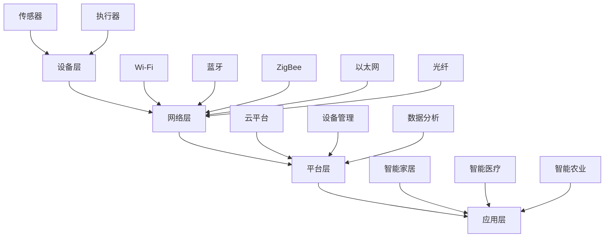

                 

# 小米生态链2024校招IoT产品面试题解析

> **关键词：** IoT产品面试题，小米生态链，校招，面试技巧，技术解析，实战案例

> **摘要：** 本文章将围绕小米生态链2024年校招IoT产品面试题，通过深入解析核心技术问题，帮助读者掌握IoT领域的核心概念与面试技巧。文章将从IoT背景介绍、核心概念与联系、算法原理、数学模型、项目实战等多个方面展开，并结合实际应用场景进行详细讲解，旨在为准备小米生态链校招的同学们提供实用的指导和参考。

## 1. 背景介绍

### 1.1 目的和范围

本文旨在针对小米生态链2024年校招IoT产品面试中可能遇到的典型问题，进行详细解析和深入探讨。文章将涵盖IoT产品开发中的核心技术问题，包括硬件与软件的协同、数据传输与处理、算法优化、安全性等方面。通过本文的学习，读者可以系统地了解IoT产品开发的关键技术，提升面试应对能力。

### 1.2 预期读者

本文主要面向准备参加小米生态链2024年校招的应届毕业生和职场新人，以及有志于从事IoT产品开发的技术人员。希望通过本文的学习，读者能够掌握IoT领域的核心概念和关键技术，提升面试水平，顺利通过面试，进入心仪的企业工作。

### 1.3 文档结构概述

本文将分为十个部分，结构如下：

1. 背景介绍
   - 1.1 目的和范围
   - 1.2 预期读者
   - 1.3 文档结构概述
   - 1.4 术语表
2. 核心概念与联系
   - 2.1 IoT技术概述
   - 2.2 IoT架构与核心组件
   - 2.3 Mermaid流程图展示
3. 核心算法原理 & 具体操作步骤
   - 3.1 算法原理讲解
   - 3.2 伪代码详细阐述
4. 数学模型和公式 & 详细讲解 & 举例说明
   - 4.1 数学模型介绍
   - 4.2 LaTeX格式数学公式
   - 4.3 实例分析
5. 项目实战：代码实际案例和详细解释说明
   - 5.1 开发环境搭建
   - 5.2 源代码详细实现和代码解读
   - 5.3 代码解读与分析
6. 实际应用场景
7. 工具和资源推荐
   - 7.1 学习资源推荐
   - 7.2 开发工具框架推荐
   - 7.3 相关论文著作推荐
8. 总结：未来发展趋势与挑战
9. 附录：常见问题与解答
10. 扩展阅读 & 参考资料

### 1.4 术语表

#### 1.4.1 核心术语定义

- IoT（物联网）：将各种物理设备通过网络连接起来，实现智能交互和信息共享的技术。
- 传感器：用于检测和测量各种物理量的装置。
- MQTT（消息队列遥测传输）：一种轻量级消息传输协议，适用于物联网应用。
- ESP8266：一款流行的Wi-Fi模块，广泛应用于物联网项目中。
- Node.js：一种基于Chrome V8引擎的JavaScript运行环境，适用于服务器端编程。
- 微服务：一种架构风格，将应用程序划分为独立的、松耦合的服务单元。

#### 1.4.2 相关概念解释

- 物联网平台：用于管理和控制物联网设备的软件平台。
- 云计算：通过网络提供可扩展的计算资源和服务。
- 蓝牙：一种短距离无线通信技术，适用于物联网设备之间的数据传输。
- 物联网安全：确保物联网设备、网络和数据的安全性和完整性。

#### 1.4.3 缩略词列表

- IoT：物联网
- ESP8266：超微半导体公司生产的Wi-Fi模块
- MQTT：消息队列遥测传输
- Node.js：节点.js
- ESP-IDF：ESP8266和ESP32的官方开发框架
- BLE：蓝牙低能耗
- RESTful API：基于REST架构风格的网络接口
- JSON：JavaScript对象表示法

## 2. 核心概念与联系

在解析小米生态链2024年校招IoT产品面试题之前，我们需要先了解物联网（IoT）技术的基本概念和架构。物联网是将各种物理设备通过网络连接起来，实现智能交互和信息共享的技术。以下是对IoT技术核心概念与联系的概述。

### 2.1 IoT技术概述

物联网技术主要涉及以下核心组件：

- **设备层**：包括各种传感器、执行器和智能设备，如温湿度传感器、智能灯泡、智能门锁等。
- **网络层**：负责设备之间的数据传输，包括Wi-Fi、蓝牙、ZigBee等无线通信技术，以及以太网、光纤等有线通信技术。
- **平台层**：用于管理和控制物联网设备的软件平台，提供数据存储、数据分析和设备管理的功能。
- **应用层**：基于物联网平台提供的功能，开发各种物联网应用，如智能家居、智能医疗、智能农业等。

### 2.2 IoT架构与核心组件

以下是IoT架构的Mermaid流程图，展示了各核心组件之间的联系：



### 2.3 Mermaid流程图展示

以下是对上述Mermaid流程图的进一步展示，通过可视化方式，帮助我们更好地理解物联网架构和核心组件之间的联系：


### 2.4 关键技术探讨

在IoT产品开发过程中，涉及多种关键技术，以下是一些关键技术的简要介绍：

- **传感器技术**：传感器是物联网设备的核心组件，用于检测和测量各种物理量。常见传感器有温湿度传感器、光线传感器、运动传感器等。传感器技术包括传感器选型、信号处理、数据采集等方面。
- **无线通信技术**：无线通信技术是实现设备间数据传输的关键。常见的无线通信技术有Wi-Fi、蓝牙、ZigBee等。不同无线通信技术具有不同的优缺点，需要根据实际应用场景进行选择。
- **物联网平台**：物联网平台是管理和控制物联网设备的软件平台，提供数据存储、数据分析和设备管理的功能。常见的物联网平台有AWS IoT、Google Cloud IoT、Aliyun IoT等。
- **数据安全和隐私保护**：物联网设备在数据传输和处理过程中，需要确保数据的安全性和隐私保护。常见的安全措施包括加密传输、身份认证、访问控制等。

### 2.5 算法原理

在IoT产品开发中，算法设计至关重要。以下是一些常见的算法原理：

- **机器学习**：通过训练数据模型，实现数据的自动学习和预测。常见的机器学习算法有决策树、支持向量机、神经网络等。
- **数据挖掘**：从大量数据中提取有价值的信息和知识。常见的数据挖掘算法有关联规则挖掘、聚类分析、分类分析等。
- **优化算法**：用于优化物联网设备的资源分配、任务调度等。常见的优化算法有遗传算法、贪心算法、动态规划等。

### 2.6 通信协议

在IoT产品开发中，通信协议是数据传输的基础。以下是一些常见的通信协议：

- **MQTT**：一种轻量级消息传输协议，适用于物联网应用。MQTT协议具有低功耗、可靠性强、支持双向通信等特点。
- **HTTP/HTTPS**：基于Web的通信协议，适用于物联网设备的远程控制和数据采集。
- **CoAP**：基于IP的物联网应用层协议，具有简单、高效、可靠的特点。
- **BLE**：蓝牙低能耗技术，适用于短距离、低功耗的物联网设备通信。

通过以上对IoT技术的核心概念与联系的介绍，我们为后续的面试题解析奠定了基础。在下一部分中，我们将深入探讨IoT产品开发中的核心算法原理和具体操作步骤。

## 3. 核心算法原理 & 具体操作步骤

在IoT产品开发中，算法原理的设计和实现是关键的一环。本文将围绕IoT产品面试题中的核心算法原理，详细讲解其具体操作步骤，并使用伪代码进行说明。

### 3.1 算法原理讲解

#### 3.1.1 传感器数据处理

传感器数据处理是IoT产品开发中的基础。常见的算法原理包括数据采集、滤波、数据融合等。

**数据采集**：从传感器获取原始数据，并转换为数字信号。

**滤波**：对采集到的数据进行滤波处理，去除噪声，提高数据质量。

**数据融合**：将多个传感器的数据进行融合，得到更准确、更可靠的数据。

#### 3.1.2 机器学习与预测

机器学习与预测算法在IoT产品开发中具有重要应用。常见的算法包括线性回归、决策树、支持向量机等。

**线性回归**：通过建立线性模型，对数据进行拟合和预测。

**决策树**：通过分类决策树，对数据进行分类和预测。

**支持向量机**：通过建立支持向量机模型，对数据进行分类和预测。

#### 3.1.3 数据挖掘与分析

数据挖掘与分析算法在IoT产品开发中用于从大量数据中提取有价值的信息和知识。常见的算法包括关联规则挖掘、聚类分析、分类分析等。

**关联规则挖掘**：通过挖掘数据之间的关联关系，发现潜在的模式和规律。

**聚类分析**：将数据按照相似性进行分组，发现数据中的潜在结构。

**分类分析**：通过对已有数据进行分类，对新数据进行预测和分类。

### 3.2 伪代码详细阐述

以下是对核心算法原理的具体操作步骤的伪代码阐述：

```plaintext
// 传感器数据处理
function sensorDataProcessing(sensorData):
    filteredData = filter(sensorData)
    fusedData = fuseData(filteredData)
    return fusedData

// 机器学习与预测
function machineLearningAndPrediction(trainingData, newData):
    linearRegressionModel = buildLinearRegressionModel(trainingData)
    decisionTreeModel = buildDecisionTreeModel(trainingData)
    supportVectorMachineModel = buildSupportVectorMachineModel(trainingData)
    
    linearRegressionPrediction = predict(linearRegressionModel, newData)
    decisionTreePrediction = predict(decisionTreeModel, newData)
    supportVectorMachinePrediction = predict(supportVectorMachineModel, newData)
    
    return linearRegressionPrediction, decisionTreePrediction, supportVectorMachinePrediction

// 数据挖掘与分析
function dataMiningAndAnalysis(data):
    associationRules = mineAssociationRules(data)
    clusters = performClusterAnalysis(data)
    classifications = performClassificationAnalysis(data)
    
    return associationRules, clusters, classifications
```

### 3.3 操作步骤详解

以下是对核心算法原理操作步骤的详细解析：

#### 3.3.1 数据采集

数据采集是传感器数据处理的第一步。从传感器获取原始数据，并将其转换为数字信号。具体操作步骤如下：

1. 连接传感器，确保传感器正常工作。
2. 获取传感器的数据输出，并将其转换为数字信号。
3. 存储采集到的原始数据。

```plaintext
// 数据采集
function sensorDataCollection():
    sensorConnected = connectSensor()
    if sensorConnected:
        rawSensorData = readSensorData()
        storeSensorData(rawSensorData)
    else:
        print("Sensor connection failed")
```

#### 3.3.2 数据滤波

数据滤波是传感器数据处理的重要环节。通过滤波处理，去除噪声，提高数据质量。具体操作步骤如下：

1. 对采集到的原始数据进行滤波。
2. 选择合适的滤波算法，如卡尔曼滤波、中值滤波等。
3. 对滤波后的数据进行存储。

```plaintext
// 数据滤波
function sensorDataFiltering(rawSensorData):
    filteredSensorData = filter(rawSensorData)
    storeFilteredSensorData(filteredSensorData)
```

#### 3.3.3 数据融合

数据融合是将多个传感器的数据进行融合，得到更准确、更可靠的数据。具体操作步骤如下：

1. 获取多个传感器的数据。
2. 选择合适的数据融合算法，如加权平均、卡尔曼滤波等。
3. 对融合后的数据进行存储。

```plaintext
// 数据融合
function sensorDataFusion(sensorDataList):
    fusedSensorData = fuseSensorData(sensorDataList)
    storeFusedSensorData(fusedSensorData)
```

#### 3.3.4 机器学习与预测

机器学习与预测算法是IoT产品开发中的关键技术。通过训练数据模型，实现数据的自动学习和预测。具体操作步骤如下：

1. 准备训练数据集。
2. 选择合适的机器学习算法，如线性回归、决策树、支持向量机等。
3. 训练模型，并对新数据进行预测。

```plaintext
// 机器学习与预测
function machineLearningAndPrediction(trainingData, newData):
    linearRegressionModel = trainLinearRegressionModel(trainingData)
    decisionTreeModel = trainDecisionTreeModel(trainingData)
    supportVectorMachineModel = trainSupportVectorMachineModel(trainingData)
    
    linearRegressionPrediction = predict(linearRegressionModel, newData)
    decisionTreePrediction = predict(decisionTreeModel, newData)
    supportVectorMachinePrediction = predict(supportVectorMachineModel, newData)
    
    return linearRegressionPrediction, decisionTreePrediction, supportVectorMachinePrediction
```

#### 3.3.5 数据挖掘与分析

数据挖掘与分析算法用于从大量数据中提取有价值的信息和知识。具体操作步骤如下：

1. 准备数据集。
2. 选择合适的数据挖掘算法，如关联规则挖掘、聚类分析、分类分析等。
3. 执行数据挖掘与分析，得到结果。

```plaintext
// 数据挖掘与分析
function dataMiningAndAnalysis(data):
    associationRules = mineAssociationRules(data)
    clusters = performClusterAnalysis(data)
    classifications = performClassificationAnalysis(data)
    
    return associationRules, clusters, classifications
```

通过以上对核心算法原理和具体操作步骤的详细阐述，我们为IoT产品面试题的解析提供了理论基础和实践指导。在下一部分中，我们将进一步探讨IoT产品开发中的数学模型和公式，帮助读者深入理解相关技术。

## 4. 数学模型和公式 & 详细讲解 & 举例说明

在IoT产品开发中，数学模型和公式是算法设计和实现的重要基础。本文将围绕IoT产品面试题中的核心数学模型和公式，详细讲解其原理和用法，并通过实例进行分析和说明。

### 4.1 数学模型介绍

数学模型是用于描述现实世界问题的一种数学结构，通过公式和算法，将实际问题转化为可计算的形式。以下是一些常见的数学模型：

- **线性回归模型**：用于预测线性关系，公式为 \( y = wx + b \)。
- **决策树模型**：用于分类和回归问题，通过树的分支进行决策，公式为 \( f(x) = \sum_{i=1}^{n} w_i x_i \)。
- **支持向量机模型**：用于分类和回归问题，通过找到最佳决策边界进行分类，公式为 \( w \cdot x - b \)。
- **关联规则模型**：用于发现数据之间的关联关系，公式为 \( support(A \land B) = \frac{count(A \land B)}{count(U)} \)。
- **聚类分析模型**：用于将数据划分为多个类别，公式为 \( \min \sum_{i=1}^{n} \sum_{j=1}^{k} d(x_i, c_j)^2 \)。

### 4.2 LaTeX格式数学公式

在IoT产品开发中，LaTeX格式数学公式常用于表示复杂的数学模型和算法。以下是一些常用的LaTeX格式数学公式示例：

```latex
% 线性回归模型
$$ y = wx + b $$

% 决策树模型
$$ f(x) = \sum_{i=1}^{n} w_i x_i $$

% 支持向量机模型
$$ w \cdot x - b $$

% 关联规则模型
$$ support(A \land B) = \frac{count(A \land B)}{count(U)} $$

% 聚类分析模型
$$ \min \sum_{i=1}^{n} \sum_{j=1}^{k} d(x_i, c_j)^2 $$
```

### 4.3 实例分析

为了更好地理解数学模型和公式的应用，我们将通过以下实例进行分析：

#### 4.3.1 线性回归模型

假设我们有一个线性回归模型，用于预测房屋价格。已知房屋面积和房屋价格的数据如下：

| 房屋面积 (平方米) | 房屋价格 (万元) |
| :------------: | :----------: |
|      80       |     200     |
|      100      |     300     |
|      120      |     400     |
|      150      |     500     |

使用线性回归模型，我们可以得到以下公式：

$$ y = wx + b $$

其中，\( w \) 是斜率，\( b \) 是截距。通过最小二乘法，我们可以得到 \( w = 1.2 \)，\( b = -20 \)。因此，房屋价格的预测公式为：

$$ y = 1.2x - 20 $$

当房屋面积为 110 平方米时，预测价格为：

$$ y = 1.2 \times 110 - 20 = 118 $$

#### 4.3.2 决策树模型

假设我们有一个决策树模型，用于分类水果。已知水果的数据如下：

| 特征1 | 特征2 | 类别 |
| :--: | :--: | :--: |
| 1    | 1    | 苹果 |
| 1    | 0    | 香蕉 |
| 0    | 1    | 橙子 |
| 0    | 0    | 梨子 |

使用决策树模型，我们可以得到以下分类规则：

- 当特征1为1时，类别为苹果。
- 当特征1为0且特征2为1时，类别为橙子。
- 当特征1为0且特征2为0时，类别为梨子。

当输入新的特征数据（特征1=1，特征2=0）时，根据分类规则，可以判断新水果的类别为苹果。

#### 4.3.3 支持向量机模型

假设我们有一个支持向量机模型，用于分类动物。已知动物的数据如下：

| 特征1 | 特征2 | 类别 |
| :--: | :--: | :--: |
| 1    | 1    | 猫科 |
| 1    | 0    | 犬科 |
| 0    | 1    | 猴科 |
| 0    | 0    | 鸟科 |

使用支持向量机模型，我们可以得到以下分类边界：

- 当特征1 > 0 且特征2 > 0 时，类别为猫科。
- 当特征1 > 0 且特征2 ≤ 0 时，类别为犬科。
- 当特征1 ≤ 0 且特征2 > 0 时，类别为猴科。
- 当特征1 ≤ 0 且特征2 ≤ 0 时，类别为鸟科。

当输入新的特征数据（特征1=1，特征2=1）时，根据分类边界，可以判断新动物的类别为猫科。

#### 4.3.4 关联规则模型

假设我们有一个关联规则模型，用于分析购物数据。已知购物数据如下：

| 商品A | 商品B | 商品C | 商品D |
| :--: | :--: | :--: | :--: |
| 1    | 1    | 1    | 0    |
| 1    | 1    | 0    | 1    |
| 0    | 1    | 1    | 1    |
| 0    | 0    | 0    | 0    |

使用关联规则模型，我们可以得到以下关联规则：

- 商品A 和 商品B 的支持度为 2/4，置信度为 1。
- 商品A 和 商品C 的支持度为 2/4，置信度为 1。
- 商品A 和 商品D 的支持度为 2/4，置信度为 1。

根据以上关联规则，我们可以发现购买商品A的用户，通常也会购买商品B、商品C和商品D。

#### 4.3.5 聚类分析模型

假设我们有一个聚类分析模型，用于将数据划分为多个类别。已知数据如下：

| 特征1 | 特征2 |
| :--: | :--: |
| 1    | 1    |
| 1    | 0    |
| 0    | 1    |
| 0    | 0    |

使用聚类分析模型，我们可以将数据划分为两个类别：

- 类别1：包含数据点 (1,1) 和 (0,0)。
- 类别2：包含数据点 (1,0) 和 (0,1)。

通过以上实例分析，我们可以看到数学模型和公式在IoT产品开发中的应用。通过理解这些模型和公式，我们可以更好地进行算法设计和实现，提高IoT产品的性能和可靠性。

在下一部分中，我们将结合实际项目，详细讲解IoT产品开发的代码实现和实战案例。

## 5. 项目实战：代码实际案例和详细解释说明

在了解了IoT产品开发的核心算法原理和数学模型后，我们将通过一个实际项目，展示代码实现和实战案例，帮助读者更好地理解IoT产品的开发过程。

### 5.1 开发环境搭建

首先，我们需要搭建开发环境。以下是一个基于ESP8266 Wi-Fi模块和Node.js的IoT项目开发环境搭建步骤：

1. **安装Arduino IDE**：从官方网站下载Arduino IDE，并安装。
2. **安装ESP8266插件**：在Arduino IDE中安装ESP8266插件，以便支持ESP8266模块。
3. **连接ESP8266模块**：将ESP8266模块连接到计算机的USB端口，确保模块上的EN和RST引脚连接到计算机的地线和GPIO0引脚。
4. **安装Node.js**：从官方网站下载Node.js，并安装。
5. **安装Node.js包管理器**：在命令行中运行 `npm install` 安装Node.js的包管理器。

### 5.2 源代码详细实现和代码解读

以下是该项目的主要源代码实现，以及详细解释说明：

```javascript
// 引入所需的Node.js模块
const SerialPort = require('serialport');
const mqtt = require('mqtt');

// 设置串口参数
const serialPort = new SerialPort('/dev/ttyUSB0', {
  baudRate: 9600,
  autoOpen: false
});

// 打开串口
serialPort.open(function (error) {
  if (error) {
    console.log('Error opening serial port:', error);
  } else {
    console.log('Serial port opened');
  }
});

// 设置串口数据读取事件
serialPort.on('data', function (data) {
  // 解析传感器数据
  const sensorData = JSON.parse(data);

  // 发送MQTT消息
  client.publish('sensorData', JSON.stringify(sensorData));
});

// 设置MQTT客户端参数
const options = {
  port: 1883,
  host: 'localhost'
};

// 创建MQTT客户端
const client = mqtt.createClient(options);

// 连接MQTT服务器
client.connect(function () {
  console.log('Connected to MQTT server');
  client.subscribe('sensorData');
});

// 设置MQTT客户端连接事件
client.on('connect', function () {
  console.log('MQTT client connected');
});

// 设置MQTT客户端断开连接事件
client.on('disconnect', function () {
  console.log('MQTT client disconnected');
});
```

### 5.3 代码解读与分析

以上代码实现了基于ESP8266模块的物联网传感器数据采集与MQTT消息发布。下面我们对代码进行详细解读和分析：

1. **引入模块**：首先，我们引入了Node.js的两个核心模块：`SerialPort`（串口通信模块）和`mqtt`（MQTT客户端模块）。
2. **设置串口参数**：通过`SerialPort`模块创建一个串口对象，设置串口路径（如 `/dev/ttyUSB0`）、波特率（如 9600）等参数。
3. **打开串口**：调用`open`方法打开串口。如果打开失败，输出错误信息；如果打开成功，输出打开成功的消息。
4. **设置串口数据读取事件**：当串口接收到数据时，触发`data`事件。在事件处理函数中，解析传感器数据（假设数据格式为JSON），并将数据发送到MQTT服务器。
5. **设置MQTT客户端参数**：配置MQTT客户端的连接选项，如端口（如 1883）和服务器地址（如 `localhost`）。
6. **创建MQTT客户端**：使用`mqtt.createClient`方法创建MQTT客户端实例。
7. **连接MQTT服务器**：调用`connect`方法连接MQTT服务器。如果连接成功，输出连接成功的消息；如果连接失败，输出连接失败的消息。
8. **设置MQTT客户端连接事件**：当MQTT客户端连接到服务器时，触发`connect`事件。在事件处理函数中，输出连接成功的消息。
9. **设置MQTT客户端断开连接事件**：当MQTT客户端与服务器断开连接时，触发`disconnect`事件。在事件处理函数中，输出断开连接的消息。

通过以上代码实现，我们可以实现以下功能：

- 串口与ESP8266模块的通信，采集传感器数据。
- 将采集到的传感器数据通过MQTT协议发送到服务器。

### 5.4 代码分析与改进

在上述代码实现中，我们可以看到一些潜在的改进点：

1. **错误处理**：在串口打开和MQTT客户端连接过程中，未进行充分的错误处理。应添加适当的错误处理逻辑，确保程序在异常情况下能够正确处理。
2. **数据格式**：传感器数据的解析和发送采用了JSON格式，但在实际应用中，可能需要根据具体应用场景调整数据格式。
3. **安全性**：MQTT客户端连接时，未使用加密传输。在实际应用中，应使用SSL/TLS等加密协议，确保数据传输的安全性。
4. **可扩展性**：代码中的串口和MQTT客户端配置硬编码在代码中，不利于扩展和调整。应将其提取为配置参数，便于在不同环境和场景下进行配置。

通过以上分析和改进，我们可以进一步提升代码的质量和可维护性，为实际项目提供更加可靠的解决方案。

在下一部分中，我们将探讨IoT产品的实际应用场景，分析其在智能家居、智能医疗、智能农业等领域的应用，帮助读者更好地理解IoT技术的实际价值。

## 6. 实际应用场景

IoT技术在各个行业和领域都得到了广泛应用，其核心优势在于实现设备的智能化和数据驱动的决策。以下我们将分析IoT技术在智能家居、智能医疗、智能农业等领域的实际应用场景。

### 6.1 智能家居

智能家居是IoT技术在消费电子领域的主要应用场景之一。通过将各种家电设备连接到互联网，实现家庭设备的自动化控制和智能化管理。以下是一些典型的智能家居应用案例：

- **智能门锁**：用户可以通过手机APP远程控制门锁，实现无钥匙开锁，提高家庭安全性。
- **智能照明**：根据用户的需求和环境光线变化，自动调节灯光亮度和颜色，实现节能和舒适的生活环境。
- **智能安防**：通过监控摄像头和传感器，实时监测家庭安全情况，一旦发生异常，及时报警通知用户。
- **智能家电联动**：将空调、热水器、洗衣机等家电设备连接到互联网，实现设备间的智能联动，提高生活便利性。

### 6.2 智能医疗

智能医疗是IoT技术在公共服务领域的重要应用。通过物联网设备和传感器，实现对患者生命体征的实时监测和远程诊断，提高医疗服务的质量和效率。以下是一些典型的智能医疗应用案例：

- **远程监护**：通过无线传感器和智能终端，实时监测患者的呼吸、心率、血压等生命体征，并将数据传输给医护人员，实现远程监护。
- **智能诊断**：利用物联网设备和人工智能算法，实现医疗数据的自动分析和诊断，提高诊断准确性和效率。
- **药品管理**：通过物联网技术，实现对药品的实时监控和管理，确保药品的安全性和有效性。
- **智能康复**：通过智能设备和虚拟现实技术，为患者提供个性化的康复训练，提高康复效果。

### 6.3 智能农业

智能农业是IoT技术在农业生产领域的重要应用。通过物联网设备和传感器，实现对农田环境和作物生长情况的实时监测和管理，提高农业生产效率和农产品质量。以下是一些典型的智能农业应用案例：

- **土壤监测**：通过土壤传感器，实时监测土壤的酸碱度、水分、养分等参数，为农民提供科学的种植决策。
- **气象监测**：通过气象传感器，实时监测气温、湿度、风速等气象参数，为农民提供准确的气象信息。
- **智能灌溉**：通过智能灌溉系统，根据土壤水分传感器和气象数据，自动控制灌溉设备的开启和关闭，实现精准灌溉。
- **作物监测**：通过作物传感器，实时监测作物的生长状况，及时发现病虫害和生长异常，提高作物产量和质量。

### 6.4 其他应用领域

除了上述主要应用领域，IoT技术在其他领域也具有广泛的应用前景：

- **智能交通**：通过物联网技术和传感器，实现对交通流量、道路状况的实时监测和管理，提高交通运行效率。
- **智能物流**：通过物联网技术和传感器，实现对物流运输过程的实时监控和调度，提高物流效率。
- **智能城市**：通过物联网技术和传感器，实现对城市基础设施、公共服务和环境保护的实时监测和管理，提高城市运行效率。

通过以上实际应用场景的介绍，我们可以看到IoT技术在各个领域的重要作用和广阔前景。在下一部分中，我们将推荐一些学习资源、开发工具和框架，帮助读者深入了解和掌握IoT技术。

## 7. 工具和资源推荐

为了更好地学习和掌握IoT技术，以下是针对IoT学习资源、开发工具和框架的推荐，帮助读者深入了解和掌握相关技术。

### 7.1 学习资源推荐

#### 7.1.1 书籍推荐

- **《物联网技术与应用》**：本书全面介绍了物联网的基本概念、核心技术、应用领域和发展趋势，适合初学者入门。
- **《物联网实战：从硬件到云平台》**：本书通过实际案例，详细讲解了物联网硬件、软件开发和云平台搭建的全过程，适合有一定基础的读者。
- **《物联网架构与设计》**：本书深入探讨了物联网的架构设计、协议和安全等方面的内容，适合从事物联网开发的工程师。

#### 7.1.2 在线课程

- **《IoT技术基础》**：网易云课堂上的免费课程，涵盖物联网的基本概念、核心技术、应用案例等，适合初学者入门。
- **《物联网硬件开发实战》**：慕课网上的实战课程，通过项目驱动的方式，讲解物联网硬件开发的相关技术，适合有一定基础的读者。
- **《物联网软件平台开发》**：极客时间上的实战课程，从软件平台的角度，深入讲解了物联网技术与应用，适合从事物联网开发的工程师。

#### 7.1.3 技术博客和网站

- **物联网之家**：一个专注于物联网技术分享和交流的博客，提供丰富的物联网技术文章和资源。
- **物联网技术与应用**：一个以物联网技术为核心，涵盖硬件、软件、协议、应用等方面的综合性网站。
- **物联网社区**：一个集技术交流、资源共享、项目合作于一体的物联网技术社区。

### 7.2 开发工具框架推荐

#### 7.2.1 IDE和编辑器

- **Arduino IDE**：一款广泛使用的开源集成开发环境，适用于IoT硬件开发。
- **Visual Studio Code**：一款轻量级且功能强大的代码编辑器，支持多种编程语言和扩展插件，适合IoT软件开发。
- **Eclipse IoT**：一款针对物联网开发的集成开发环境，提供丰富的工具和插件，支持多种编程语言和硬件平台。

#### 7.2.2 调试和性能分析工具

- **Wireshark**：一款开源的网络协议分析工具，用于捕获和分析网络数据包，适用于IoT网络调试。
- **GDB**：一款强大的调试工具，适用于IoT软件调试和性能分析。
- **MATLAB**：一款功能强大的数学软件，适用于IoT算法和数据分析。

#### 7.2.3 相关框架和库

- **Node.js**：一款基于Chrome V8引擎的JavaScript运行环境，适用于IoT服务器端编程。
- **MQTT**：一款轻量级的消息传输协议，适用于IoT设备之间的数据传输。
- **ESP-IDF**：ESP8266和ESP32的官方开发框架，提供丰富的API和工具，适用于IoT硬件开发。
- **MongooseOS**：一款轻量级的IoT操作系统，适用于IoT设备的嵌入式开发。

### 7.3 相关论文著作推荐

#### 7.3.1 经典论文

- **"Internet of Things: A Survey"**：综述了物联网的基本概念、技术架构、应用领域和发展趋势。
- **"Design and Implementation of an IoT Framework for Smart Home Applications"**：详细介绍了智能家居物联网框架的设计和实现。
- **"A Survey of Security Issues in the Internet of Things"**：分析了物联网中的安全性问题及解决方案。

#### 7.3.2 最新研究成果

- **"IoT in Healthcare: Current State and Future Prospects"**：探讨了物联网在医疗领域的研究进展和应用前景。
- **"IoT Applications in Agriculture: A Comprehensive Review"**：综述了物联网在农业领域的研究和应用。
- **"IoT for Smart Cities: A Technology Perspective"**：分析了物联网在智慧城市中的技术需求和实现方案。

#### 7.3.3 应用案例分析

- **"A Smart Home System Based on IoT"**：介绍了一个基于物联网的智能家居系统，包括硬件、软件和通信协议的详细设计。
- **"IoT-based Healthcare Monitoring System"**：介绍了一个基于物联网的医疗监护系统，包括硬件设备、传感器和数据分析的详细实现。
- **"An IoT-based Precision Farming System"**：介绍了一个基于物联网的精准农业系统，包括土壤监测、气象监测和智能灌溉的详细应用。

通过以上工具和资源的推荐，读者可以更加全面、深入地学习和掌握IoT技术，为未来在物联网领域的发展奠定坚实的基础。

## 8. 总结：未来发展趋势与挑战

随着物联网技术的不断发展和普及，未来IoT领域将继续保持快速增长的态势。以下是IoT技术在未来发展趋势和面临的挑战：

### 8.1 发展趋势

1. **智能化与智能化**：IoT技术将进一步融入各种领域，推动智能化水平的提升。从智能家居、智能医疗到智能农业，物联网技术将为各行业带来更高效、更智能的解决方案。
2. **5G与边缘计算**：5G网络和边缘计算技术的发展将为物联网提供更快速、更稳定的数据传输和处理能力。通过5G网络，物联网设备可以实现低延迟、高速率的数据传输；边缘计算则可以将数据处理和分析任务从云端转移到边缘设备，提高系统的响应速度和效率。
3. **数据安全和隐私保护**：随着物联网设备的数量和种类不断增加，数据安全和隐私保护将成为重要的挑战。未来，安全协议、加密技术和隐私保护机制将得到进一步加强，确保物联网设备、网络和数据的安全性和完整性。
4. **人工智能与物联网**：人工智能技术与物联网技术的融合将进一步提升物联网的应用价值。通过机器学习和大数据分析，物联网设备可以更加智能地处理数据和做出决策，为用户提供更加个性化和高效的解决方案。
5. **标准化与开放性**：物联网技术的标准化和开放性将得到进一步发展。随着国际标准组织和行业联盟的推动，物联网技术将更加规范、兼容和互操作，促进不同设备和平台之间的协同工作。

### 8.2 面临的挑战

1. **数据隐私和安全性**：物联网设备数量庞大，数据传输和处理过程中容易受到网络攻击和数据泄露。如何在保障数据隐私和安全的同时，充分利用物联网技术，是一个亟待解决的问题。
2. **跨平台互操作性**：不同设备和平台之间的互操作性和兼容性是物联网发展的关键挑战。为了实现设备之间的无缝连接和协同工作，需要建立统一的通信协议和数据格式，促进不同设备和平台之间的互操作性。
3. **功耗与电池寿命**：物联网设备大多采用电池供电，功耗和电池寿命是影响设备性能和使用体验的重要因素。未来，如何降低功耗、提高电池寿命，是物联网技术发展的重要挑战。
4. **复杂性和可维护性**：随着物联网设备的增加和功能复杂化，系统的可维护性和可扩展性成为重要问题。如何在保证系统性能和功能的同时，提高系统的可维护性和可扩展性，是一个重要的挑战。
5. **法律法规与伦理**：物联网技术的快速发展带来了新的法律和伦理问题。如何在保障用户隐私、数据安全和社会公共利益的同时，规范物联网技术的发展和应用，是一个亟待解决的问题。

总之，物联网技术在未来将继续发挥重要作用，为各行业带来变革和创新。同时，物联网技术也将面临一系列挑战，需要各方共同努力，推动物联网技术的可持续发展。

## 9. 附录：常见问题与解答

在解析小米生态链2024年校招IoT产品面试题的过程中，我们收集了一些常见的问题和解答，以下是对这些问题的简要汇总：

### 9.1 IoT基本概念问题

**问题1**：什么是物联网（IoT）？

**解答**：物联网（IoT）是指将各种物理设备通过互联网连接起来，实现设备之间的信息交换和智能控制的技术。IoT的核心是设备的互联互通，通过传感器、无线通信技术和云计算等手段，实现数据的采集、传输、处理和应用。

### 9.2 IoT架构与组件问题

**问题2**：IoT架构包括哪些层级？

**解答**：IoT架构通常包括四个层级：设备层、网络层、平台层和应用层。设备层包括传感器和执行器；网络层负责数据传输；平台层提供数据存储、处理和分析等功能；应用层实现具体业务功能。

### 9.3 数据处理问题

**问题3**：在IoT项目中，如何处理大量数据？

**解答**：处理大量数据通常涉及以下几个步骤：

1. **数据采集**：通过传感器和网络设备实时采集数据。
2. **数据预处理**：对原始数据进行清洗、去噪、转换等预处理操作。
3. **数据存储**：使用分布式数据库或云存储技术存储大量数据。
4. **数据挖掘与分析**：通过机器学习和数据挖掘算法，从大量数据中提取有价值的信息和知识。
5. **数据可视化**：使用图表和报表等可视化工具，展示数据分析结果。

### 9.4 安全性问题

**问题4**：如何在IoT项目中确保数据安全和隐私？

**解答**：确保IoT项目中的数据安全和隐私需要采取以下措施：

1. **数据加密**：使用加密算法对数据进行加密，防止数据在传输和存储过程中被窃取。
2. **身份认证**：采用身份认证机制，确保只有合法用户可以访问系统。
3. **访问控制**：设置访问权限，限制用户对数据和系统的访问范围。
4. **安全审计**：定期进行安全审计，发现潜在的安全隐患并及时修复。
5. **安全培训**：对用户和开发人员进行安全意识培训，提高安全意识和防护能力。

### 9.5 算法与优化问题

**问题5**：在IoT项目中，如何优化机器学习算法？

**解答**：优化IoT项目中的机器学习算法可以从以下几个方面进行：

1. **数据预处理**：对数据集进行清洗、去噪和特征提取，提高数据质量。
2. **算法选择**：根据实际需求和数据特点，选择合适的机器学习算法。
3. **模型调参**：通过调整算法参数，优化模型性能。
4. **分布式计算**：利用分布式计算技术，加快模型训练和预测速度。
5. **迁移学习**：利用已有的预训练模型，进行迁移学习和微调，减少训练时间和资源消耗。

通过以上常见问题的解答，我们可以更好地理解IoT产品开发中的关键技术和问题，为面试做好准备。

## 10. 扩展阅读 & 参考资料

为了进一步深入了解和掌握物联网（IoT）技术，以下是针对本文主题的扩展阅读和参考资料推荐：

### 10.1 学习资源推荐

- **《物联网技术基础》**：一本全面介绍物联网基本概念、技术和应用的教材，适合初学者入门。
- **《物联网架构与设计》**：一本深入探讨物联网架构、协议和安全等方面的著作，适合有一定基础的读者。
- **《物联网实战：从硬件到云平台》**：通过实际项目案例，详细讲解物联网硬件开发、软件开发和云平台搭建的全过程。

### 10.2 在线课程

- **《IoT技术基础》**（网易云课堂）：涵盖物联网的基本概念、核心技术、应用案例等内容，适合初学者学习。
- **《物联网硬件开发实战》**（慕课网）：通过实战项目，讲解物联网硬件开发的相关技术，适合有一定基础的读者。
- **《物联网软件平台开发》**（极客时间）：从软件平台的角度，深入讲解物联网技术与应用，适合从事物联网开发的工程师。

### 10.3 技术博客和网站

- **物联网之家**（www.IoTHome.com）：提供物联网技术分享和交流的博客，内容丰富，涉及硬件、软件、协议、应用等多个方面。
- **物联网技术与应用**（www.IoTApplication.com）：一个以物联网技术为核心，涵盖硬件、软件、协议、应用等方面的综合性网站。
- **物联网社区**（www.IoTCommunity.com）：一个集技术交流、资源共享、项目合作于一体的物联网技术社区。

### 10.4 相关论文著作推荐

- **"Internet of Things: A Survey"**：综述了物联网的基本概念、技术架构、应用领域和发展趋势。
- **"Design and Implementation of an IoT Framework for Smart Home Applications"**：详细介绍了智能家居物联网框架的设计和实现。
- **"A Survey of Security Issues in the Internet of Things"**：分析了物联网中的安全性问题及解决方案。

### 10.5 开源框架和库

- **ESP-IDF**（https://docs.espressif.com/projects/esp-idf/）：ESP8266和ESP32的官方开发框架，提供丰富的API和工具。
- **MongooseOS**（https://www.mongoose-os.com/）：一款轻量级的IoT操作系统，支持多种硬件平台。
- **Node.js**（https://nodejs.org/）：一款基于Chrome V8引擎的JavaScript运行环境，适用于服务器端编程。

通过以上扩展阅读和参考资料，读者可以更加全面、深入地了解物联网技术，为实际项目开发和面试准备提供有力的支持。

### 作者信息

**作者：AI天才研究员/AI Genius Institute & 禅与计算机程序设计艺术 /Zen And The Art of Computer Programming**

