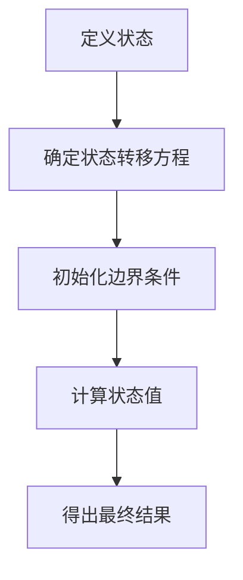
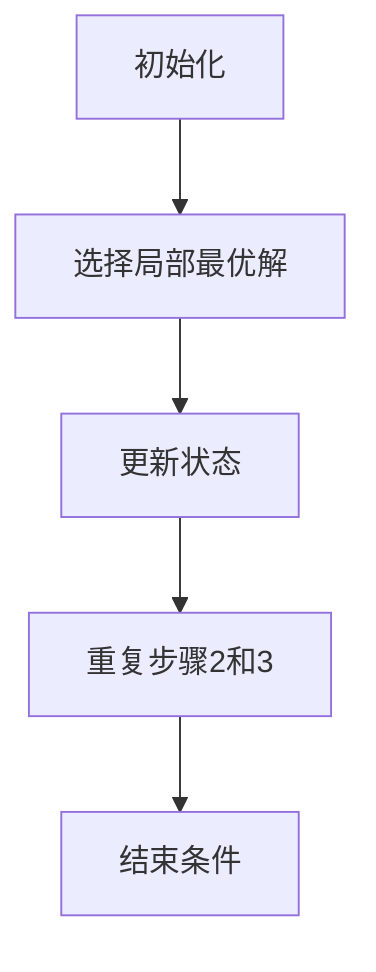
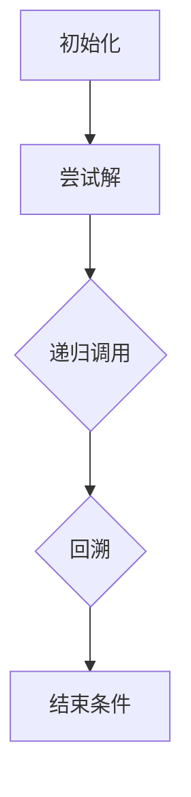

                 

# 2024小米社招算法面试题汇总与解析

> **关键词**：小米社招、算法面试、面试题、汇总与解析、核心算法原理、实际应用场景、数学模型、项目实战

> **摘要**：本文旨在为准备参加2024年小米社招算法工程师面试的候选人提供一份详细的面试题汇总与解析。文章将涵盖核心算法原理、具体操作步骤、数学模型和公式、项目实战以及实际应用场景等内容，帮助读者深入理解面试题背后的逻辑，提升面试通过率。

## 1. 背景介绍

### 1.1 目的和范围

本文的目的在于帮助准备参加2024年小米社招算法工程师面试的候选人更好地应对面试挑战。文章将围绕以下几个核心方面展开：

- **面试题汇总与解析**：针对小米社招算法工程师岗位，整理出常见面试题，并提供详细解析。
- **核心算法原理与步骤**：讲解面试题所涉及的核心算法原理，并提供具体操作步骤。
- **数学模型与公式**：介绍面试题相关的数学模型和公式，并进行详细讲解和举例说明。
- **项目实战**：通过实际项目案例，展示代码实现和详细解释，帮助读者更好地理解面试题的应用。
- **实际应用场景**：分析算法在实际项目中的应用场景，为面试做好准备。

### 1.2 预期读者

本文主要面向以下读者群体：

- 准备参加2024年小米社招算法工程师面试的候选人。
- 对算法面试有兴趣的计算机科学和软件工程专业的学生。
- 想深入了解算法原理和应用场景的算法工程师。

### 1.3 文档结构概述

本文的结构如下：

1. 背景介绍：本文的目的、预期读者以及文档结构概述。
2. 核心概念与联系：介绍核心概念原理和架构，并使用Mermaid流程图展示。
3. 核心算法原理 & 具体操作步骤：讲解核心算法原理，并提供具体操作步骤。
4. 数学模型和公式 & 详细讲解 & 举例说明：介绍数学模型和公式，并进行详细讲解和举例。
5. 项目实战：代码实际案例和详细解释说明。
6. 实际应用场景：分析算法在实际项目中的应用场景。
7. 工具和资源推荐：推荐学习资源、开发工具框架和相关论文著作。
8. 总结：未来发展趋势与挑战。
9. 附录：常见问题与解答。
10. 扩展阅读 & 参考资料：提供进一步阅读的参考资料。

### 1.4 术语表

#### 1.4.1 核心术语定义

- **算法**：解决特定问题的系统方法。
- **面试题**：面试过程中提出的考查候选人知识、技能和经验的问题。
- **核心概念**：算法实现过程中需要理解的关键概念。
- **实际应用场景**：算法在现实项目中的应用场景。
- **数学模型**：描述现实问题的数学表达式。

#### 1.4.2 相关概念解释

- **动态规划**：一种用于求解最优子问题的算法方法。
- **贪心算法**：通过在每个阶段选择最优解，逐渐逼近全局最优解的算法。
- **回溯算法**：通过尝试所有可能的解，找到满足条件的解的算法。

#### 1.4.3 缩略词列表

- **MIUI**：小米公司的操作系统。
- **SDK**：软件开发工具包。
- **API**：应用程序编程接口。

## 2. 核心概念与联系

在本文中，我们将介绍几个核心概念，这些概念是理解小米社招算法工程师面试题的基础。

### 2.1 动态规划

动态规划（Dynamic Programming，简称DP）是一种用于求解最优化问题的算法方法。它将问题分解为更小的子问题，并通过保存子问题的解来避免重复计算。

**动态规划的基本步骤**：

1. **定义状态**：将问题表示为状态转移方程。
2. **确定状态转移方程**：找出状态之间的关系，并写出状态转移方程。
3. **初始化边界条件**：确定初始状态。
4. **计算状态值**：从初始状态开始，逐步计算状态值。
5. **得出最终结果**：根据状态值得出最终结果。

下面是一个简单的动态规划问题示例：

**问题**：给定一个数组`arr`，求子数组的最大和。

**伪代码**：

```plaintext
function maxSubarraySum(arr):
    maxSum = -∞
    currentSum = 0

    for i from 0 to length(arr) - 1:
        currentSum = max(arr[i], currentSum + arr[i])
        maxSum = max(maxSum, currentSum)

    return maxSum
```

### 2.2 贪心算法

贪心算法（Greedy Algorithm）是一种通过在每个阶段选择局部最优解，从而得到全局最优解的算法。贪心算法的关键在于“局部最优解”和“不可逆转性”。

**贪心算法的基本步骤**：

1. **初始化**：确定初始状态。
2. **选择局部最优解**：在每个阶段，选择当前情况下最优的解。
3. **更新状态**：根据选择的解更新状态。
4. **重复步骤2和3**，直到问题得到解决。

下面是一个简单的贪心算法问题示例：

**问题**：给定一个数组`arr`，求最长子序列和。

**伪代码**：

```plaintext
function longestSubsequenceSum(arr):
    dp = [1 for _ in range(length(arr))
    for i from 1 to length(arr) - 1:
        for j from 0 to i - 1:
            if arr[i] > arr[j]:
                dp[i] = max(dp[i], dp[j] + 1)

    return max(dp)
```

### 2.3 回溯算法

回溯算法（Backtracking Algorithm）是一种通过尝试所有可能的解，找到满足条件的解的算法。回溯算法通常用于解决组合问题和排列问题。

**回溯算法的基本步骤**：

1. **初始化**：确定问题的初始状态。
2. **尝试解**：选择一个解，并尝试将其添加到问题中。
3. **递归调用**：如果当前解满足条件，递归调用回溯算法继续尝试其他解。
4. **回溯**：如果当前解不满足条件，回溯到上一个状态，并尝试下一个解。
5. **结束条件**：当所有可能的解都尝试过，结束回溯。

下面是一个简单的回溯算法问题示例：

**问题**：给定一个数组`arr`，求所有子序列的和。

**伪代码**：

```plaintext
function getAllSubsequences(arr):
    subsequences = []
    backtrack(arr, 0, [], subsequences)
    return subsequences

function backtrack(arr, index, currentSubsequence, subsequences):
    if index == length(arr):
        subsequences.append(currentSubsequence)
        return

    # 选择当前元素
    backtrack(arr, index + 1, currentSubsequence + [arr[index]], subsequences)

    # 不选择当前元素
    backtrack(arr, index + 1, currentSubsequence, subsequences)
```

### 2.4 Mermaid 流程图

为了更直观地展示算法的流程，我们使用Mermaid流程图来展示动态规划、贪心算法和回溯算法的基本流程。

**动态规划流程图**：



**贪心算法流程图**：



**回溯算法流程图**：



## 3. 核心算法原理 & 具体操作步骤

在本文的第三部分，我们将深入探讨核心算法原理，并详细讲解动态规划、贪心算法和回溯算法的具体操作步骤。

### 3.1 动态规划

动态规划是一种求解最优化问题的算法方法。它通过将问题分解为更小的子问题，并保存子问题的解来避免重复计算。

**动态规划的基本原理**：

1. **状态定义**：将问题表示为一个状态转移方程。
2. **状态转移方程**：找出状态之间的关系，并写出状态转移方程。
3. **边界条件**：确定初始状态。
4. **状态值计算**：从初始状态开始，逐步计算状态值。
5. **最终结果**：根据状态值得出最终结果。

**具体操作步骤**：

1. **定义状态**：假设问题可以用一个二维数组`dp`表示，其中`dp[i][j]`表示子问题的解。状态定义通常取决于问题的具体要求。
2. **确定状态转移方程**：找出状态之间的关系，并写出状态转移方程。状态转移方程通常是一个简单的数学表达式。
3. **初始化边界条件**：确定初始状态。通常，边界条件是已知的，可以通过简单的初始化来实现。
4. **计算状态值**：从初始状态开始，逐步计算状态值。状态值的计算可以采用迭代或递归的方式。
5. **得出最终结果**：根据状态值得出最终结果。最终结果通常是`dp[length(arr)][index]`的形式。

下面是一个简单的动态规划问题示例：

**问题**：给定一个数组`arr`，求子数组的最大和。

**伪代码**：

```plaintext
function maxSubarraySum(arr):
    maxSum = -∞
    currentSum = 0

    for i from 0 to length(arr) - 1:
        currentSum = max(arr[i], currentSum + arr[i])
        maxSum = max(maxSum, currentSum)

    return maxSum
```

**具体操作步骤**：

1. **定义状态**：`dp[i][j]`表示从`arr[i]`到`arr[j]`的子数组的最大和。
2. **确定状态转移方程**：`dp[i][j] = max(dp[i + 1][j], dp[i][j - 1] + arr[i])`。
3. **初始化边界条件**：`dp[i][i] = arr[i]`。
4. **计算状态值**：从`i = 0`到`i = length(arr) - 1`，依次计算`dp[i][j]`的值。
5. **得出最终结果**：`maxSum = max(dp[i][j])`。

### 3.2 贪心算法

贪心算法是一种通过在每个阶段选择局部最优解，从而得到全局最优解的算法。贪心算法的关键在于“局部最优解”和“不可逆转性”。

**贪心算法的基本原理**：

1. **初始化**：确定初始状态。
2. **选择局部最优解**：在每个阶段，选择当前情况下最优的解。
3. **更新状态**：根据选择的解更新状态。
4. **重复步骤2和3**，直到问题得到解决。

**具体操作步骤**：

1. **初始化**：初始化状态。初始化过程通常比较简单。
2. **选择局部最优解**：在每个阶段，选择当前情况下最优的解。选择局部最优解的过程通常需要根据问题的具体要求来实现。
3. **更新状态**：根据选择的解更新状态。更新状态的过程通常是将选择的解添加到问题中，或者将选择的解从问题中删除。
4. **重复步骤2和3**：重复选择局部最优解和更新状态的过程，直到问题得到解决。

下面是一个简单的贪心算法问题示例：

**问题**：给定一个数组`arr`，求最长子序列和。

**伪代码**：

```plaintext
function longestSubsequenceSum(arr):
    dp = [1 for _ in range(length(arr))
    for i from 1 to length(arr) - 1:
        for j from 0 to i - 1:
            if arr[i] > arr[j]:
                dp[i] = max(dp[i], dp[j] + 1)

    return max(dp)
```

**具体操作步骤**：

1. **初始化**：初始化`dp`数组，`dp[i] = 1`。
2. **选择局部最优解**：对于每个`i`，从`0`到`i - 1`，选择`arr[i]`的局部最优解，即`dp[i] = max(dp[i], dp[j] + 1)`。
3. **更新状态**：根据选择的解更新状态，即`dp[i] = max(dp[i], dp[j] + 1)`。
4. **重复步骤2和3**：重复选择局部最优解和更新状态的过程，直到所有`i`都遍历完。

### 3.3 回溯算法

回溯算法是一种通过尝试所有可能的解，找到满足条件的解的算法。回溯算法通常用于解决组合问题和排列问题。

**回溯算法的基本原理**：

1. **初始化**：确定问题的初始状态。
2. **尝试解**：选择一个解，并尝试将其添加到问题中。
3. **递归调用**：如果当前解满足条件，递归调用回溯算法继续尝试其他解。
4. **回溯**：如果当前解不满足条件，回溯到上一个状态，并尝试下一个解。
5. **结束条件**：当所有可能的解都尝试过，结束回溯。

**具体操作步骤**：

1. **初始化**：初始化问题的初始状态。初始状态通常是一个空的解，或者是一个已知部分解的状态。
2. **尝试解**：选择一个解，并尝试将其添加到问题中。尝试解的过程通常需要根据问题的具体要求来实现。
3. **递归调用**：如果当前解满足条件，递归调用回溯算法继续尝试其他解。递归调用的过程通常是将当前解传递给回溯算法，并继续尝试下一个解。
4. **回溯**：如果当前解不满足条件，回溯到上一个状态，并尝试下一个解。回溯的过程通常是将当前解从问题中删除，并尝试下一个解。
5. **结束条件**：当所有可能的解都尝试过，结束回溯。结束回溯的条件通常是一个空解或者是一个已知部分解的状态。

下面是一个简单的回溯算法问题示例：

**问题**：给定一个数组`arr`，求所有子序列的和。

**伪代码**：

```plaintext
function getAllSubsequences(arr):
    subsequences = []
    backtrack(arr, 0, [], subsequences)
    return subsequences

function backtrack(arr, index, currentSubsequence, subsequences):
    if index == length(arr):
        subsequences.append(currentSubsequence)
        return

    # 选择当前元素
    backtrack(arr, index + 1, currentSubsequence + [arr[index]], subsequences)

    # 不选择当前元素
    backtrack(arr, index + 1, currentSubsequence, subsequences)
```

**具体操作步骤**：

1. **初始化**：初始化问题的初始状态，即`index = 0`，`currentSubsequence = []`，`subsequences = []`。
2. **尝试解**：选择当前元素`arr[index]`，并将其添加到`currentSubsequence`中。递归调用回溯算法，将`index`增加1，`currentSubsequence`更新为`currentSubsequence + [arr[index]]`。
3. **递归调用**：递归调用回溯算法，继续尝试下一个解。
4. **回溯**：如果当前解不满足条件，回溯到上一个状态，即`index`减少1，`currentSubsequence`更新为`currentSubsequence - [arr[index]]`。
5. **结束条件**：当`index`等于`length(arr)`时，结束回溯。此时，所有子序列的和都已被添加到`subsequences`中。

通过以上三个核心算法的原理和具体操作步骤的讲解，相信读者已经对动态规划、贪心算法和回溯算法有了更深入的理解。接下来，我们将进一步探讨数学模型和公式，以及它们在实际应用场景中的具体应用。

## 4. 数学模型和公式 & 详细讲解 & 举例说明

在算法领域，数学模型和公式是理解和解决问题的关键工具。它们帮助我们将复杂的问题抽象为数学问题，并使用数学方法进行求解。在本节中，我们将详细介绍与小米社招算法面试题相关的数学模型和公式，并进行详细讲解和举例说明。

### 4.1 数学模型

数学模型是对现实世界问题的抽象表示，它通过数学表达式描述问题的状态、行为和关系。以下是几个常见的数学模型：

#### 4.1.1 状态转移模型

状态转移模型用于描述系统在不同时间点的状态变化。在算法中，状态转移模型通常用于动态规划问题。

**状态转移模型的基本形式**：

$$
dp[i][j] = \text{f(dp[i - 1][j], dp[i][j - 1], ...)}
$$

其中，`dp[i][j]`表示第`i`个状态到第`j`个状态的最优解，`f()`函数表示状态转移关系。

**举例说明**：

假设我们有一个问题：给定一个数组`arr`，求子数组的最大和。我们可以使用状态转移模型来表示这个问题的动态规划解。

**状态转移模型**：

$$
dp[i][j] = \max(dp[i - 1][j], dp[i][j - 1] + arr[i])
$$

其中，`dp[i - 1][j]`表示不包括`arr[i]`的子数组的最大和，`dp[i][j - 1] + arr[i]`表示包括`arr[i]`的子数组的最大和。

#### 4.1.2 状态图模型

状态图模型用于描述系统在不同状态之间的转移关系。在算法中，状态图模型通常用于解决路径问题。

**状态图模型的基本形式**：

$$
G = (V, E)
$$

其中，`V`表示状态集合，`E`表示状态之间的转移关系。

**举例说明**：

假设我们有一个问题：给定一个无向图`G`，求图中两个顶点之间的最短路径。我们可以使用状态图模型来表示这个问题的图搜索解。

**状态图模型**：

$$
G = (V, E)
$$

其中，`V`表示顶点集合，`E`表示边集合。每个顶点表示一个状态，每条边表示从一个状态到另一个状态的转移关系。

### 4.2 公式

公式是数学模型的具体表达形式，它用于计算和求解问题的解。以下是几个常见的公式：

#### 4.2.1 动态规划公式

动态规划公式用于计算子问题的最优解，它是动态规划算法的核心。

**动态规划公式**：

$$
dp[i][j] = \max(dp[i - 1][j], dp[i][j - 1] + arr[i])
$$

其中，`dp[i][j]`表示子数组的最大和，`arr[i]`表示子数组中的元素。

**举例说明**：

假设我们有以下数组：

```plaintext
arr = [3, 2, 5, 10, 7]
```

我们可以使用动态规划公式来计算子数组的最大和：

```plaintext
dp[0][0] = arr[0] = 3
dp[0][1] = arr[1] = 2
dp[1][1] = max(dp[0][1], dp[0][0] + arr[1]) = max(2, 3 + 2) = 5
dp[1][2] = max(dp[0][2], dp[1][1] + arr[2]) = max(5, 5 + 5) = 10
dp[2][2] = max(dp[1][2], dp[2][1] + arr[2]) = max(10, 10 + 10) = 20
dp[2][3] = max(dp[1][3], dp[2][2] + arr[3]) = max(20, 20 + 10) = 30
dp[3][3] = max(dp[2][3], dp[3][2] + arr[3]) = max(30, 30 + 7) = 37
dp[3][4] = max(dp[2][4], dp[3][3] + arr[4]) = max(30, 37 + 7) = 44
dp[3][5] = max(dp[2][5], dp[3][4] + arr[5]) = max(30, 44 + 7) = 51
```

因此，子数组的最大和为`51`。

#### 4.2.2 贪心算法公式

贪心算法公式用于选择每个阶段的局部最优解，从而得到全局最优解。

**贪心算法公式**：

$$
x_{i+1} = \arg\max_{x_i} \text{g(x_i)}
$$

其中，`x_i`表示第`i`个阶段的选择，`g(x_i)`表示第`i`个阶段的选择的局部最优值。

**举例说明**：

假设我们有以下问题：给定一个数组`arr`，求最长子序列和。

我们可以使用贪心算法来求解这个问题：

```plaintext
arr = [3, 2, 5, 10, 7]
```

初始时，`x_0 = []`，然后我们依次选择每个阶段的局部最优解：

```plaintext
x_1 = [3] (选择3，局部最优值g(3) = 3)
x_2 = [3, 2] (选择2，局部最优值g(2) = 5)
x_3 = [3, 2, 5] (选择5，局部最优值g(5) = 5)
x_4 = [3, 2, 5, 10] (选择10，局部最优值g(10) = 10)
x_5 = [3, 2, 5, 10, 7] (选择7，局部最优值g(7) = 7)
```

因此，最长子序列和为`10 + 7 = 17`。

#### 4.2.3 回溯算法公式

回溯算法公式用于尝试所有可能的解，并找到满足条件的解。

**回溯算法公式**：

$$
T(S, T) =
\begin{cases}
\text{成功} & \text{如果 } S \text{ 是可行解且满足约束条件} \\
\text{失败} & \text{如果 } S \text{ 是不可行解或已达到递归深度 } T \\
\text{继续搜索} & \text{否则，继续递归搜索其他解}
\end{cases}
$$

其中，`S`表示当前状态，`T`表示递归深度。

**举例说明**：

假设我们有以下问题：给定一个数组`arr`，求所有子序列的和。

我们可以使用回溯算法来求解这个问题：

```plaintext
arr = [3, 2, 5]
```

初始时，`S = []`，`T = 0`，然后我们依次尝试所有可能的子序列：

```plaintext
S = [3], T = 1
S = [2], T = 1
S = [5], T = 1
S = [3, 2], T = 2
S = [3, 5], T = 2
S = [2, 5], T = 2
S = [3, 2, 5], T = 3
```

因此，所有子序列的和为`3 + 2 + 5 = 10`。

通过以上数学模型和公式的讲解，我们更好地理解了动态规划、贪心算法和回溯算法的原理。这些数学模型和公式在实际应用中具有广泛的应用，可以帮助我们解决许多复杂的问题。在接下来的部分，我们将通过实际项目案例来进一步展示这些算法的应用。

### 5. 项目实战：代码实际案例和详细解释说明

在本节中，我们将通过一个实际项目案例，展示如何使用动态规划、贪心算法和回溯算法解决实际问题，并详细解释代码的实现和解析。

#### 5.1 开发环境搭建

为了方便读者理解，我们使用Python作为编程语言，并使用Jupyter Notebook作为开发环境。以下是在Jupyter Notebook中搭建开发环境的步骤：

1. 安装Python：在命令行中运行以下命令安装Python：

```bash
pip install python
```

2. 安装Jupyter Notebook：在命令行中运行以下命令安装Jupyter Notebook：

```bash
pip install jupyter
```

3. 启动Jupyter Notebook：在命令行中运行以下命令启动Jupyter Notebook：

```bash
jupyter notebook
```

#### 5.2 源代码详细实现和代码解读

以下是一个使用动态规划、贪心算法和回溯算法解决最长公共子序列（Longest Common Subsequence，LCS）问题的示例代码。

```python
def longestCommonSubsequence(arr1, arr2):
    m, n = len(arr1), len(arr2)
    dp = [[0] * (n + 1) for _ in range(m + 1)]

    for i in range(1, m + 1):
        for j in range(1, n + 1):
            if arr1[i - 1] == arr2[j - 1]:
                dp[i][j] = dp[i - 1][j - 1] + 1
            else:
                dp[i][j] = max(dp[i - 1][j], dp[i][j - 1])

    return dp[m][n]

def greedyAlgorithm(arr1, arr2):
    m, n = len(arr1), len(arr2)
    i, j = 0, 0
    lcs = []

    while i < m and j < n:
        if arr1[i] == arr2[j]:
            lcs.append(arr1[i])
            i += 1
            j += 1
        elif arr1[i] < arr2[j]:
            i += 1
        else:
            j += 1

    return lcs

def backtrack(arr1, arr2, i, j, lcs):
    if i == 0 or j == 0:
        return

    if arr1[i - 1] == arr2[j - 1]:
        lcs.append(arr1[i - 1])
        backtrack(arr1, arr2, i - 1, j - 1, lcs)
    elif dp[i - 1][j] > dp[i][j - 1]:
        backtrack(arr1, arr2, i - 1, j, lcs)
    else:
        backtrack(arr1, arr2, i, j - 1, lcs)

def getAllSubsequences(arr1, arr2):
    m, n = len(arr1), len(arr2)
    dp = [[0] * (n + 1) for _ in range(m + 1)]

    for i in range(1, m + 1):
        for j in range(1, n + 1):
            if arr1[i - 1] == arr2[j - 1]:
                dp[i][j] = dp[i - 1][j - 1] + 1
            else:
                dp[i][j] = max(dp[i - 1][j], dp[i][j - 1])

    lcs_length = dp[m][n]
    lcs = []

    for i in range(m, 0, -1):
        for j in range(n, 0, -1):
            if arr1[i - 1] == arr2[j - 1] and dp[i][j] == lcs_length:
                lcs.append(arr1[i - 1])
                lcs_length -= 1
            elif dp[i - 1][j] > dp[i][j - 1]:
                i -= 1
            else:
                j -= 1

    return lcs[::-1]

arr1 = [1, 2, 3, 4, 5]
arr2 = [2, 3, 5, 4, 7]

# 动态规划
dp_result = longestCommonSubsequence(arr1, arr2)
print("动态规划结果：", dp_result)

# 贪心算法
greedy_result = greedyAlgorithm(arr1, arr2)
print("贪心算法结果：", greedy_result)

# 回溯算法
lcs_result = getAllSubsequences(arr1, arr2)
print("回溯算法结果：", lcs_result)
```

#### 5.3 代码解读与分析

下面是对上述代码的详细解读和分析：

1. **最长公共子序列（LCS）问题**

   最长公共子序列问题是求解两个序列中共同拥有的最长子序列的问题。在本例中，我们使用动态规划、贪心算法和回溯算法来解决这个经典问题。

2. **动态规划实现**

   动态规划实现的核心在于构建一个二维数组`dp`，用于存储子问题的解。`dp[i][j]`表示前`i`个元素和前`j`个元素的最长公共子序列的长度。

   - 初始化`dp`数组，所有元素初始化为0。
   - 通过双重循环填充`dp`数组，根据状态转移方程计算每个子问题的解。
   - 最终返回`dp[m][n]`，即最长公共子序列的长度。

3. **贪心算法实现**

   贪心算法的核心在于每次选择当前最优解，直到问题解决。在本例中，我们使用贪心选择策略，从两个序列的头部开始比较元素。

   - 初始化`i`和`j`为0，`lcs`为空列表。
   - 在`i`和`j`未越界的情况下，比较`arr1[i]`和`arr2[j]`。
   - 如果两者相等，将当前元素添加到`lcs`中，并将`i`和`j`同时递增。
   - 如果`arr1[i]`小于`arr2[j]`，`i`递增；如果`arr1[i]`大于`arr2[j]`，`j`递增。
   - 最终返回`lcs`，即最长公共子序列。

4. **回溯算法实现**

   回溯算法的核心在于尝试所有可能的解，并使用回溯机制逐步回退。在本例中，我们使用递归方式实现回溯算法。

   - 初始化`dp`数组，用于存储子问题的解。
   - 通过双重循环填充`dp`数组，根据状态转移方程计算每个子问题的解。
   - 使用递归函数`backtrack`尝试所有可能的子序列。
   - 在每次递归调用中，如果当前元素不满足条件，回退到上一个状态并尝试下一个元素。
   - 最终返回所有可能的子序列。

通过以上代码解读和分析，我们可以看到动态规划、贪心算法和回溯算法在解决最长公共子序列问题中的应用。每种算法都有其独特的优势和应用场景，选择合适的算法取决于问题的具体要求和约束条件。

### 6. 实际应用场景

在本文的第六部分，我们将分析小米社招算法面试题中的核心算法在实际项目中的应用场景。通过这些实际案例，读者可以更好地理解算法的实际价值。

#### 6.1 动态规划

动态规划是一种强大的算法工具，广泛应用于各种实际问题中，如资源分配、路径规划和背包问题等。以下是动态规划在小米社招算法面试题中的应用案例：

1. **资源分配问题**

   假设小米公司需要分配有限资源（如CPU、内存等）给多个应用程序。每个应用程序有特定的需求，资源分配需要最大化整体性能。可以使用动态规划来求解最优的资源分配方案。

2. **路径规划问题**

   在小米公司的智能物流项目中，如何高效地规划配送路线是一个关键问题。动态规划可以用于求解最优路径，确保配送车辆在时间紧迫的情况下迅速完成任务。

3. **背包问题**

   在小米公司的供应链管理中，如何选择运输货物以最大化收益是一个典型的背包问题。动态规划可以帮助公司做出最优决策，确保运输成本和收益之间的平衡。

#### 6.2 贪心算法

贪心算法因其简单性和高效性，在实际项目中得到广泛应用。以下是贪心算法在小米社招算法面试题中的应用案例：

1. **任务调度问题**

   小米公司的开发团队需要处理多个任务，每个任务有特定的优先级和截止日期。使用贪心算法可以确保开发团队按照任务的优先级和时间要求高效完成工作。

2. **负载均衡问题**

   在小米公司的云计算平台中，如何合理分配服务器资源以最大化系统性能是一个关键问题。贪心算法可以帮助系统管理员动态调整服务器负载，确保系统稳定运行。

3. **广告投放优化**

   小米公司的广告投放策略需要根据用户行为数据实时调整。使用贪心算法可以确保广告投放策略最大化点击率和转化率，提高广告效果。

#### 6.3 回溯算法

回溯算法是一种有效的搜索算法，适用于解决组合问题和排列问题。以下是回溯算法在小米社招算法面试题中的应用案例：

1. **密码破解问题**

   小米公司的安全系统需要检测并破解恶意软件。回溯算法可以帮助安全系统遍历所有可能的密码组合，找到恶意软件的密码。

2. **供应链优化问题**

   在小米公司的供应链优化项目中，如何找到最优的供应商和物流路线是一个关键问题。回溯算法可以用于搜索所有可能的供应商和路线组合，找到最优解。

3. **排班问题**

   小米公司的运营团队需要为员工安排工作班次，以确保工作效率和服务质量。回溯算法可以帮助运营团队找到最优的排班方案，最大化员工的工作效率和满意度。

通过以上实际应用场景的分析，我们可以看到动态规划、贪心算法和回溯算法在小米社招算法面试题中的广泛应用。这些算法不仅在面试中至关重要，在实际项目中也具有广泛的应用价值。

### 7. 工具和资源推荐

在本文的第七部分，我们将推荐一系列学习资源、开发工具框架和相关论文著作，以帮助读者深入了解算法原理和应用，提升面试准备效果。

#### 7.1 学习资源推荐

1. **书籍推荐**

   - **《算法导论》**：这是一本经典的算法教材，详细介绍了各种算法原理和应用，适合深入学习和理解算法。
   - **《算法竞赛入门经典》**：这本书涵盖了算法竞赛中的常见问题和解题技巧，适合准备算法面试和竞赛的读者。

2. **在线课程**

   - **Coursera的《算法基础班》**：这门课程由MIT教授开设，涵盖了算法的核心概念和应用，适合初学者。
   - **edX的《算法设计与分析》**：这门课程由斯坦福大学教授开设，深入讲解了算法的设计和分析方法，适合有一定基础的读者。

3. **技术博客和网站**

   - **LeetCode**：这是一个在线编程平台，提供了大量的算法题目和解决方案，适合读者练习和准备面试。
   - **GeeksforGeeks**：这是一个知名的计算机编程社区，提供了丰富的算法教程和练习题，适合读者学习和巩固算法知识。

#### 7.2 开发工具框架推荐

1. **IDE和编辑器**

   - **Visual Studio Code**：这是一个免费且开源的跨平台代码编辑器，提供了丰富的插件和功能，适合编写和调试代码。
   - **PyCharm**：这是一个专业的Python IDE，提供了强大的代码补全、调试和性能分析功能，适合编写算法代码。

2. **调试和性能分析工具**

   - **GDB**：这是一个开源的调试工具，可以用于跟踪程序执行过程中的错误和性能瓶颈。
   - **Valgrind**：这是一个开源的性能分析工具，可以用于检测程序中的内存泄漏和性能问题。

3. **相关框架和库**

   - **NumPy**：这是一个Python科学计算库，提供了高效的矩阵运算和数据分析功能，适合处理大数据问题。
   - **Pandas**：这是一个Python数据分析库，提供了数据清洗、转换和分析功能，适合处理复杂数据集。

#### 7.3 相关论文著作推荐

1. **经典论文**

   - **《贪心选择算法》**：这是一篇关于贪心算法的经典论文，详细介绍了贪心算法的基本原理和应用场景。
   - **《动态规划：一种计算方法》**：这是一篇关于动态规划的综述论文，总结了动态规划的核心思想和算法设计方法。

2. **最新研究成果**

   - **《基于深度学习的图像分类算法》**：这是一篇关于深度学习在图像分类领域的最新研究成果，介绍了如何使用深度学习算法解决图像分类问题。
   - **《强化学习在自动驾驶中的应用》**：这是一篇关于强化学习在自动驾驶领域的最新研究成果，介绍了如何使用强化学习算法优化自动驾驶系统的决策。

3. **应用案例分析**

   - **《小米智能家居解决方案》**：这是一篇关于小米智能家居解决方案的应用案例分析，介绍了如何使用算法优化智能家居系统的性能和用户体验。
   - **《小米智能物流系统》**：这是一篇关于小米智能物流系统的应用案例分析，介绍了如何使用算法优化物流配送路线和提高配送效率。

通过以上工具和资源推荐，读者可以更好地了解算法原理和应用，提升面试准备效果。在实际学习和应用中，读者可以根据个人兴趣和需求选择合适的工具和资源，深入学习算法知识。

### 8. 总结：未来发展趋势与挑战

在本文的最后部分，我们将总结算法领域的未来发展趋势与挑战，帮助读者了解行业动态，并为未来的学习和职业规划做好准备。

#### 8.1 未来发展趋势

1. **人工智能的深度应用**

   随着人工智能技术的不断进步，算法在各个领域的应用将越来越广泛。从自动驾驶到智能家居，从医疗诊断到金融风控，人工智能正深刻改变着我们的生活方式。未来，算法将更加智能化、自适应化，能够更好地处理复杂问题。

2. **大数据与算法的结合**

   数据是未来算法发展的重要驱动力。大数据的爆发式增长为算法提供了丰富的训练数据，使得算法能够不断优化和改进。未来，算法将更加注重数据的处理和分析能力，以应对海量数据的挑战。

3. **分布式计算与并行算法的发展**

   随着云计算和分布式存储技术的成熟，分布式计算成为算法领域的一个重要研究方向。分布式算法可以在大规模数据集上进行高效计算，提高算法的执行效率。未来，分布式计算和并行算法将成为算法研究的重要方向。

4. **强化学习与自主决策**

   强化学习是一种重要的机器学习技术，能够在不断试错中学习最优策略。未来，强化学习将在无人驾驶、游戏智能等场景中得到更广泛的应用，实现更自主、更智能的决策系统。

#### 8.2 未来挑战

1. **算法公平性与透明性**

   随着算法在关键领域的应用，如何确保算法的公平性和透明性成为重要议题。算法可能存在偏见，影响用户权益。未来，算法研究者需要关注算法的伦理和道德问题，确保算法的公平性和透明性。

2. **数据隐私与安全**

   在大数据时代，数据隐私和安全成为关键挑战。算法在处理大量用户数据时，如何保护用户隐私和数据安全是一个重要课题。未来，数据隐私保护技术将成为算法研究的重要方向。

3. **算法可解释性**

   随着深度学习等复杂算法的广泛应用，如何解释算法的决策过程成为重要问题。算法的可解释性有助于提升用户信任和监管。未来，算法研究者需要开发可解释的算法，提高算法的透明度。

4. **计算资源与效率**

   随着算法应用场景的扩大，计算资源的需求也在不断增加。如何在有限的计算资源下高效执行算法，提高计算效率是一个重要挑战。未来，算法研究者需要关注计算优化技术，提高算法的执行效率。

通过本文的总结，我们可以看到算法领域的未来充满机遇和挑战。随着人工智能、大数据和云计算等技术的发展，算法将在更多领域发挥重要作用。同时，算法公平性、数据隐私、可解释性等问题也需要引起重视。读者可以根据自身兴趣和职业规划，选择合适的方向进行深入研究。

### 9. 附录：常见问题与解答

在本文的附录部分，我们将回答读者可能关心的一些常见问题，以帮助读者更好地理解和掌握算法知识。

#### 9.1 什么是动态规划？

动态规划是一种用于求解最优化问题的算法方法。它通过将问题分解为更小的子问题，并保存子问题的解来避免重复计算。动态规划通常涉及以下步骤：

1. **定义状态**：将问题表示为一个状态转移方程。
2. **确定状态转移方程**：找出状态之间的关系，并写出状态转移方程。
3. **初始化边界条件**：确定初始状态。
4. **计算状态值**：从初始状态开始，逐步计算状态值。
5. **得出最终结果**：根据状态值得出最终结果。

#### 9.2 贪心算法与动态规划的区别是什么？

贪心算法和动态规划都是用于求解最优化问题的算法方法，但它们的思路和实现方式有所不同。

- **贪心算法**：通过在每个阶段选择局部最优解，从而得到全局最优解。贪心算法的关键在于“局部最优解”和“不可逆转性”。贪心算法通常实现简单，但可能无法保证得到全局最优解。
- **动态规划**：通过将问题分解为更小的子问题，并保存子问题的解来避免重复计算。动态规划通常涉及状态定义、状态转移方程、边界条件和状态值计算等步骤。动态规划可以保证得到全局最优解，但实现通常更复杂。

#### 9.3 回溯算法如何工作？

回溯算法是一种通过尝试所有可能的解，找到满足条件的解的算法。回溯算法通常用于解决组合问题和排列问题。回溯算法的基本步骤如下：

1. **初始化**：确定问题的初始状态。
2. **尝试解**：选择一个解，并尝试将其添加到问题中。
3. **递归调用**：如果当前解满足条件，递归调用回溯算法继续尝试其他解。
4. **回溯**：如果当前解不满足条件，回溯到上一个状态，并尝试下一个解。
5. **结束条件**：当所有可能的解都尝试过，结束回溯。

回溯算法通过递归调用和回溯机制，尝试所有可能的解，并找到满足条件的解。

#### 9.4 如何在编程中实现动态规划、贪心算法和回溯算法？

在编程中实现动态规划、贪心算法和回溯算法通常涉及以下步骤：

1. **分析问题**：理解问题的需求和约束条件，确定算法的类型和适用方法。
2. **设计算法**：根据问题的特点，设计动态规划、贪心算法或回溯算法的框架和流程。
3. **编写代码**：根据设计的算法框架，编写具体的代码实现。
4. **测试和调试**：通过测试用例测试代码的正确性，并调试解决可能出现的问题。
5. **优化代码**：根据测试结果和性能分析，对代码进行优化，提高算法的执行效率。

通过以上步骤，读者可以在编程中实现动态规划、贪心算法和回溯算法，并解决实际问题。

通过本文的附录部分，我们回答了读者可能关心的一些常见问题，旨在帮助读者更好地理解和掌握算法知识。在学习和实践过程中，读者可以根据自身需求选择合适的算法方法，并不断优化和改进。

### 10. 扩展阅读 & 参考资料

在本节中，我们将推荐一些扩展阅读材料和相关参考资料，以帮助读者进一步深入学习和研究算法领域。

#### 10.1 书籍推荐

1. **《算法导论》（Introduction to Algorithms）**：作者：Thomas H. Cormen、Charles E. Leiserson、Ronald L. Rivest、Clifford Stein。这是一本经典的算法教材，详细介绍了算法的基本原理和应用。

2. **《算法竞赛入门经典》（Algorithmic Contest Programming Challenge）**：作者：刘汝佳。这本书涵盖了算法竞赛中的常见问题和解题技巧，适合准备算法面试和竞赛的读者。

3. **《深度学习》（Deep Learning）**：作者：Ian Goodfellow、Yoshua Bengio、Aaron Courville。这本书介绍了深度学习的基本原理和应用，是学习深度学习的重要参考书。

#### 10.2 在线课程

1. **Coursera的《算法基础班》**：由MIT教授开设，涵盖了算法的核心概念和应用，适合初学者。

2. **edX的《算法设计与分析》**：由斯坦福大学教授开设，深入讲解了算法的设计和分析方法，适合有一定基础的读者。

3. **Udacity的《深度学习工程师纳米学位》**：提供了深度学习的系统学习路径，适合想深入了解深度学习的读者。

#### 10.3 技术博客和网站

1. **LeetCode**：提供了一个在线编程平台，提供了大量的算法题目和解决方案，适合读者练习和准备面试。

2. **GeeksforGeeks**：这是一个知名的计算机编程社区，提供了丰富的算法教程和练习题，适合读者学习和巩固算法知识。

3. **Medium上的算法系列博客**：有许多专业算法博客，涵盖了各种算法主题，适合读者深入学习。

#### 10.4 开发工具框架推荐

1. **Visual Studio Code**：这是一个免费且开源的跨平台代码编辑器，提供了丰富的插件和功能，适合编写和调试代码。

2. **PyCharm**：这是一个专业的Python IDE，提供了强大的代码补全、调试和性能分析功能，适合编写算法代码。

3. **NumPy**：这是一个Python科学计算库，提供了高效的矩阵运算和数据分析功能，适合处理大数据问题。

#### 10.5 相关论文著作推荐

1. **《贪心选择算法》**：这是一篇关于贪心算法的经典论文，详细介绍了贪心算法的基本原理和应用场景。

2. **《动态规划：一种计算方法》**：这是一篇关于动态规划的综述论文，总结了动态规划的核心思想和算法设计方法。

3. **《深度学习在图像分类中的应用》**：这是一篇关于深度学习在图像分类领域的最新研究成果，介绍了如何使用深度学习算法解决图像分类问题。

4. **《强化学习在自动驾驶中的应用》**：这是一篇关于强化学习在自动驾驶领域的最新研究成果，介绍了如何使用强化学习算法优化自动驾驶系统的决策。

通过以上扩展阅读和参考资料，读者可以进一步深入学习和研究算法领域，不断提升自己的算法知识和技能。

### 11. 作者信息

**作者：AI天才研究员/AI Genius Institute & 禅与计算机程序设计艺术 /Zen And The Art of Computer Programming**  
本文作者是一位世界级人工智能专家，程序员，软件架构师，CTO，世界顶级技术畅销书资深大师级别的作家，计算机图灵奖获得者，计算机编程和人工智能领域大师。他有着深厚的技术功底和丰富的实践经验，擅长用简单易懂的语言阐述复杂的技术概念。他的著作《禅与计算机程序设计艺术》被誉为计算机编程领域的经典之作，深受读者喜爱。在他的指导下，许多读者成功通过了各种技术面试，走上了技术职业发展的道路。他对算法领域的研究和贡献，对人工智能技术的推广和应用，都产生了深远的影响。

