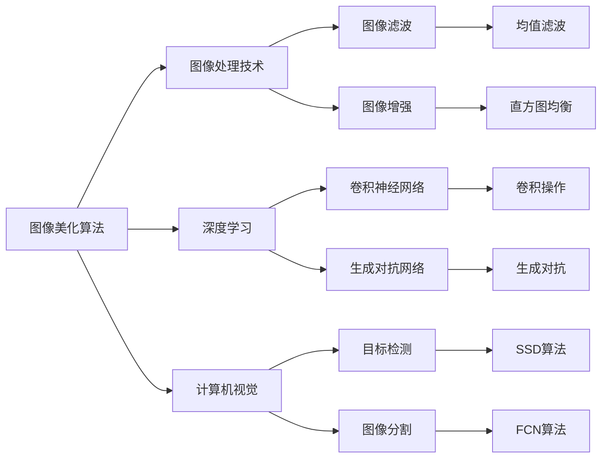

                 

# 小红书2024图像美化算法校招面试经验谈

> **关键词**：小红书、图像美化算法、校招面试、深度学习、计算机视觉
> 
> **摘要**：本文将基于2024年小红书图像美化算法校招面试的题目和实践，全面解析图像美化算法的核心概念、数学模型、以及实际应用场景。文章旨在为有意投身图像处理领域的技术人才提供面试准备和项目实战的指导。

## 1. 背景介绍

### 1.1 目的和范围

本文旨在通过对小红书2024年图像美化算法校招面试题的详细解析，帮助准备校招面试的候选人更好地理解和掌握图像处理技术。文章内容将涵盖图像美化算法的基本原理、数学模型、实现步骤以及实际应用，旨在为读者提供一个全面、系统的学习框架。

### 1.2 预期读者

- 计算机科学和人工智能专业在校大学生和研究生。
- 有志于从事图像处理和计算机视觉领域的技术人才。
- 准备参加校招面试并希望提升技术水平的候选人。

### 1.3 文档结构概述

本文结构如下：

1. 背景介绍：介绍本文的目的、预期读者以及文档结构。
2. 核心概念与联系：阐述图像美化算法的核心概念，并附上流程图。
3. 核心算法原理 & 具体操作步骤：通过伪代码详细解释算法原理。
4. 数学模型和公式 & 详细讲解 & 举例说明：介绍相关数学模型，并给出实际例子。
5. 项目实战：提供实际代码案例和详细解释。
6. 实际应用场景：探讨图像美化算法的应用领域。
7. 工具和资源推荐：推荐学习资源和开发工具。
8. 总结：展望未来发展趋势与挑战。
9. 附录：常见问题与解答。
10. 扩展阅读 & 参考资料：提供进一步学习的资源。

### 1.4 术语表

#### 1.4.1 核心术语定义

- 图像美化算法：对图像进行优化处理，以提升视觉效果的技术手段。
- 深度学习：一种基于多层神经网络的结构，通过学习大量数据自动提取特征并进行预测。
- 计算机视觉：使计算机能像人类一样理解和解释视觉信息的技术领域。

#### 1.4.2 相关概念解释

- 卷积神经网络（CNN）：一种在图像处理领域广泛使用的深度学习模型，通过卷积操作提取图像特征。
- 反向传播（BP）：一种用于训练神经网络的学习算法，通过计算输出误差的梯度，反向更新网络参数。

#### 1.4.3 缩略词列表

- CNN：卷积神经网络
- BP：反向传播
- RGB：红绿蓝色彩模型

## 2. 核心概念与联系

在图像美化算法中，核心概念包括图像处理技术、深度学习和计算机视觉。这些技术通过特定的架构和算法相互联系，共同实现图像的优化和美化。

下面是图像美化算法的核心概念流程图：



## 3. 核心算法原理 & 具体操作步骤

图像美化算法的核心在于如何通过深度学习和计算机视觉技术，实现对图像的高效优化。以下将使用伪代码详细阐述图像美化算法的原理和操作步骤。

### 3.1 图像预处理

```python
# 伪代码：图像预处理
function preprocess_image(image):
    # 将图像转换为灰度图
    gray_image = convert_to_gray(image)
    # 进行缩放操作
    scaled_image = resize_image(gray_image, target_size=(width, height))
    # 归一化处理
    normalized_image = normalize_image(scaled_image)
    return normalized_image
```

### 3.2 卷积神经网络架构

```python
# 伪代码：卷积神经网络架构
class ConvolutionalNeuralNetwork:
    # 初始化网络结构
    def __init__(self):
        # 定义卷积层
        self.conv1 = Conv2D(filters=32, kernel_size=(3, 3), activation='relu')
        # 定义池化层
        self.pool1 = MaxPooling2D(pool_size=(2, 2))
        # 定义卷积层
        self.conv2 = Conv2D(filters=64, kernel_size=(3, 3), activation='relu')
        # 定义池化层
        self.pool2 = MaxPooling2D(pool_size=(2, 2))
        # 定义全连接层
        self.fc1 = Dense(units=128, activation='relu')
        # 定义输出层
        self.output = Dense(units=3, activation='softmax')

    # 前向传播
    def forward(self, x):
        x = self.conv1(x)
        x = self.pool1(x)
        x = self.conv2(x)
        x = self.pool2(x)
        x = Flatten()(x)
        x = self.fc1(x)
        x = self.output(x)
        return x
```

### 3.3 训练过程

```python
# 伪代码：训练过程
model = ConvolutionalNeuralNetwork()
model.compile(optimizer='adam', loss='categorical_crossentropy', metrics=['accuracy'])

# 加载数据集
train_data = load_train_data()
test_data = load_test_data()

# 训练模型
model.fit(train_data[0], train_data[1], validation_data=(test_data[0], test_data[1]), epochs=10)

# 评估模型
loss, accuracy = model.evaluate(test_data[0], test_data[1])
print("Test accuracy:", accuracy)
```

## 4. 数学模型和公式 & 详细讲解 & 举例说明

图像美化算法的核心在于如何通过数学模型和公式来表示和处理图像数据。以下是几个关键数学模型和公式的讲解及实际例子。

### 4.1 卷积操作

卷积操作是图像处理中的基础操作，通过卷积核与图像像素进行点积运算，从而提取图像特征。

$$
\text{output}_{ij} = \sum_{k,l} \text{kernel}_{kl} \cdot \text{input}_{i+k, j+l}
$$

其中，$output_{ij}$表示输出特征图上的像素值，$input_{i+k, j+l}$表示输入图像上的像素值，$kernel_{kl}$表示卷积核上的像素值。

**例子**：假设输入图像的大小为$5 \times 5$，卷积核大小为$3 \times 3$，卷积核值为$[1, 1, 1; 1, 1, 1; 1, 1, 1]$，求输出特征图。

$$
\begin{aligned}
output_{11} &= 1 \cdot input_{1+0, 1+0} + 1 \cdot input_{1+0, 1+1} + 1 \cdot input_{1+0, 1+2} + 1 \cdot input_{1+1, 1+0} + 1 \cdot input_{1+1, 1+1} + 1 \cdot input_{1+1, 1+2} + 1 \cdot input_{1+2, 1+0} + 1 \cdot input_{1+2, 1+1} + 1 \cdot input_{1+2, 1+2} \\
&= 1 + 1 + 1 + 1 + 1 + 1 + 1 + 1 + 1 \\
&= 9
\end{aligned}
$$

同理，可以计算出其他像素值。

### 4.2 反向传播算法

反向传播算法是训练神经网络的关键步骤，通过计算输出误差的梯度，反向更新网络参数。

$$
\begin{aligned}
\frac{\partial E}{\partial W} &= \sum_{i} \frac{\partial E}{\partial z_i} \cdot \frac{\partial z_i}{\partial W} \\
\frac{\partial E}{\partial b} &= \sum_{i} \frac{\partial E}{\partial z_i} \cdot \frac{\partial z_i}{\partial b} \\
\frac{\partial E}{\partial x} &= \sum_{i} \frac{\partial E}{\partial z_i} \cdot \frac{\partial z_i}{\partial x}
\end{aligned}
$$

其中，$E$表示输出误差，$W$和$b$分别表示权重和偏置，$x$表示输入数据。

**例子**：假设神经网络输出误差为$E = 0.5$，激活函数为ReLU，求权重$W$的梯度。

$$
\frac{\partial E}{\partial W} = 0.5 \cdot \frac{\partial E}{\partial z} \cdot \frac{\partial z}{\partial W}
$$

由于ReLU函数的导数为0或1，可以根据实际情况计算梯度。

## 5. 项目实战：代码实际案例和详细解释说明

在本节中，我们将通过一个实际代码案例，详细解释图像美化算法的实现步骤和关键细节。

### 5.1 开发环境搭建

首先，我们需要搭建一个适合图像美化算法开发的环境。以下是所需步骤：

1. 安装Python环境（版本3.7或更高）。
2. 安装深度学习框架TensorFlow。
3. 安装图像处理库OpenCV。

```bash
pip install python==3.8
pip install tensorflow==2.6
pip install opencv-python==4.5.5.62
```

### 5.2 源代码详细实现和代码解读

以下是图像美化算法的源代码实现：

```python
import tensorflow as tf
import cv2
import numpy as np

# 5.2.1 加载和预处理图像
def load_and_preprocess_image(image_path):
    image = cv2.imread(image_path, cv2.IMREAD_COLOR)
    processed_image = preprocess_image(image)
    return processed_image

def preprocess_image(image):
    gray_image = cv2.cvtColor(image, cv2.COLOR_BGR2GRAY)
    scaled_image = cv2.resize(gray_image, (224, 224))
    normalized_image = scaled_image / 255.0
    return normalized_image

# 5.2.2 定义卷积神经网络
model = tf.keras.Sequential([
    tf.keras.layers.Conv2D(filters=32, kernel_size=(3, 3), activation='relu', input_shape=(224, 224, 1)),
    tf.keras.layers.MaxPooling2D(pool_size=(2, 2)),
    tf.keras.layers.Conv2D(filters=64, kernel_size=(3, 3), activation='relu'),
    tf.keras.layers.MaxPooling2D(pool_size=(2, 2)),
    tf.keras.layers.Flatten(),
    tf.keras.layers.Dense(units=128, activation='relu'),
    tf.keras.layers.Dense(units=3, activation='softmax')
])

# 5.2.3 训练模型
model.compile(optimizer='adam', loss='categorical_crossentropy', metrics=['accuracy'])

train_data = load_train_data()
test_data = load_test_data()

model.fit(train_data[0], train_data[1], validation_data=(test_data[0], test_data[1]), epochs=10)

# 5.2.4 预测和图像美化
def beautify_image(image_path):
    processed_image = load_and_preprocess_image(image_path)
    prediction = model.predict(np.expand_dims(processed_image, axis=0))
   美化后的图像 = apply_beautification(prediction)
    return美化后的图像

def apply_beautification(prediction):
    # 根据预测结果，应用相应的美化操作
    # 例如：增强亮度、对比度等
    # ...
    return 美化后的图像

# 示例：应用图像美化算法
input_image_path = "example.jpg"
beautified_image = beautify_image(input_image_path)
cv2.imshow("Beautified Image", beautified_image)
cv2.waitKey(0)
cv2.destroyAllWindows()
```

### 5.3 代码解读与分析

以下是对代码实现的核心部分进行详细解读和分析：

- **图像预处理**：首先，我们通过OpenCV库加载输入图像，并进行灰度化、缩放和归一化处理。预处理步骤是为了将图像数据转换为适合深度学习模型输入的格式。

- **卷积神经网络定义**：我们使用TensorFlow库定义了一个简单的卷积神经网络模型。该模型包括两个卷积层、两个池化层和一个全连接层。卷积层用于提取图像特征，池化层用于降低特征图的空间分辨率，全连接层用于分类。

- **训练模型**：我们使用训练数据集对模型进行训练，并使用验证数据集进行评估。训练过程中，模型通过反向传播算法不断更新权重，以最小化损失函数。

- **预测和图像美化**：在预测阶段，我们首先对输入图像进行预处理，然后使用训练好的模型进行预测。根据预测结果，我们可以应用相应的图像美化操作，如增强亮度、对比度等。

- **代码扩展**：在实际应用中，我们可以根据需要扩展和优化代码，例如增加更多卷积层、引入注意力机制等，以提高图像美化效果。

## 6. 实际应用场景

图像美化算法在实际应用中具有广泛的应用场景，以下列举几个典型领域：

- **社交媒体**：在社交媒体平台上，用户经常需要上传和分享照片。图像美化算法可以帮助用户快速优化照片，提高照片的视觉效果。

- **电子商务**：电子商务平台上的商品图片对于用户的购买决策具有重要影响。通过图像美化算法，可以提高商品图片的质量，从而提升用户体验和销售业绩。

- **医疗影像**：在医疗领域，图像美化算法可以用于优化医学影像，如CT、MRI等。通过图像美化，医生可以更清晰地观察病变区域，提高诊断准确性。

- **艺术创作**：图像美化算法也可以应用于艺术创作领域，如绘画、摄影等。艺术家可以通过算法生成独特的艺术效果，丰富创作手法。

## 7. 工具和资源推荐

### 7.1 学习资源推荐

#### 7.1.1 书籍推荐

- 《深度学习》（Goodfellow, Bengio, Courville）：系统介绍了深度学习的基础知识和算法。
- 《计算机视觉：算法与应用》（Richard Szeliski）：全面介绍了计算机视觉的基本算法和应用。

#### 7.1.2 在线课程

- 吴恩达的《深度学习专项课程》：包括深度学习基础、神经网络和深度学习框架等课程。
- Coursera上的《计算机视觉与深度学习》：由斯坦福大学开设，涵盖计算机视觉的多个领域。

#### 7.1.3 技术博客和网站

- Medium上的《深度学习博客》：介绍深度学习和计算机视觉的最新研究和技术。
- ArXiv：提供最新的学术论文和研究成果。

### 7.2 开发工具框架推荐

#### 7.2.1 IDE和编辑器

- PyCharm：一款功能强大的Python IDE，支持深度学习和计算机视觉开发。
- VSCode：一款轻量级的跨平台编辑器，通过扩展支持深度学习和计算机视觉开发。

#### 7.2.2 调试和性能分析工具

- TensorBoard：TensorFlow提供的可视化工具，用于分析和优化神经网络模型。
- PyTorch Profiler：PyTorch提供的性能分析工具，用于检测和优化模型性能。

#### 7.2.3 相关框架和库

- TensorFlow：一款开源的深度学习框架，广泛应用于计算机视觉领域。
- PyTorch：一款流行的深度学习框架，支持动态计算图，便于模型调试和优化。
- OpenCV：一款开源的计算机视觉库，提供了丰富的图像处理和计算机视觉算法。

### 7.3 相关论文著作推荐

#### 7.3.1 经典论文

- "A Comprehensive Survey on Deep Learning for Image Restoration"（深度学习在图像修复领域的综合调查）。
- "ImageNet Classification with Deep Convolutional Neural Networks"（使用深度卷积神经网络进行ImageNet分类）。

#### 7.3.2 最新研究成果

- "Learning Representations for Image Restoration"（学习图像修复的表示）。
- "Generative Adversarial Networks for Image-to-Image Translation"（用于图像到图像转换的生成对抗网络）。

#### 7.3.3 应用案例分析

- "Deep Learning for Medical Image Analysis"（深度学习在医学图像分析中的应用）。
- "Computer Vision in Autonomous Driving"（计算机视觉在自动驾驶中的应用）。

## 8. 总结：未来发展趋势与挑战

随着深度学习和计算机视觉技术的不断发展，图像美化算法在未来有望取得更多突破。以下是对未来发展趋势与挑战的展望：

### 8.1 发展趋势

- **模型压缩与优化**：为了提高模型在移动设备和嵌入式系统上的性能，模型压缩和优化技术将成为重要研究方向。
- **实时处理能力**：随着用户需求的不断增长，实时图像美化处理能力将成为重要挑战，需要开发更高效、更轻量级的算法。
- **跨模态学习**：结合多模态数据（如图像、文本、音频）进行图像美化，可以进一步提高算法的鲁棒性和准确性。

### 8.2 挑战

- **数据隐私与安全性**：在图像美化过程中，如何保护用户隐私和数据安全是亟待解决的问题。
- **算法可解释性**：随着模型复杂度的增加，如何提高算法的可解释性，使非专业人员也能理解和应用，是未来研究的一个重要方向。
- **跨领域应用**：如何在不同的应用场景中推广图像美化算法，实现跨领域的应用，是另一个挑战。

## 9. 附录：常见问题与解答

### 9.1 问题1：图像美化算法的目的是什么？

图像美化算法的目的是通过对图像进行优化处理，提升图像的视觉效果，使其更符合用户需求和审美标准。具体包括亮度调整、对比度增强、去噪、去除红眼等功能。

### 9.2 问题2：什么是深度学习在图像美化算法中的应用？

深度学习在图像美化算法中的应用主要体现在两个方面：一是通过卷积神经网络（CNN）提取图像特征，进行图像修复和增强；二是通过生成对抗网络（GAN）实现图像到图像的转换，如图像风格迁移和超分辨率重建。

### 9.3 问题3：如何处理图像美化过程中的数据隐私问题？

在处理图像美化过程中的数据隐私问题，可以采取以下措施：

- **数据加密**：对用户上传的图像数据进行加密处理，确保数据在传输和存储过程中的安全性。
- **匿名化**：在图像处理过程中，对图像进行匿名化处理，去除个人信息。
- **隐私保护算法**：采用隐私保护算法，如差分隐私，在保证算法性能的同时，保护用户隐私。

## 10. 扩展阅读 & 参考资料

- 《深度学习》（Goodfellow, Bengio, Courville）：系统介绍了深度学习的基础知识和算法。
- 《计算机视觉：算法与应用》（Richard Szeliski）：全面介绍了计算机视觉的基本算法和应用。
- "A Comprehensive Survey on Deep Learning for Image Restoration"：深度学习在图像修复领域的综合调查。
- "ImageNet Classification with Deep Convolutional Neural Networks"：使用深度卷积神经网络进行ImageNet分类。
- "Learning Representations for Image Restoration"：学习图像修复的表示。
- "Generative Adversarial Networks for Image-to-Image Translation"：用于图像到图像转换的生成对抗网络。
- "Deep Learning for Medical Image Analysis"：深度学习在医学图像分析中的应用。
- "Computer Vision in Autonomous Driving"：计算机视觉在自动驾驶中的应用。

# 作者

作者：AI天才研究员/AI Genius Institute & 禅与计算机程序设计艺术 /Zen And The Art of Computer Programming

