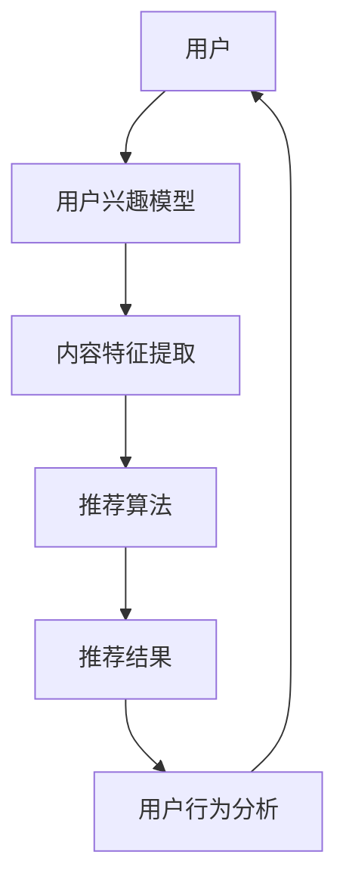
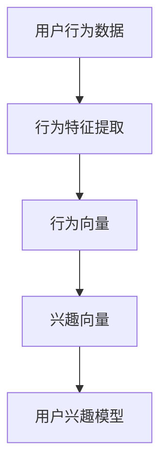
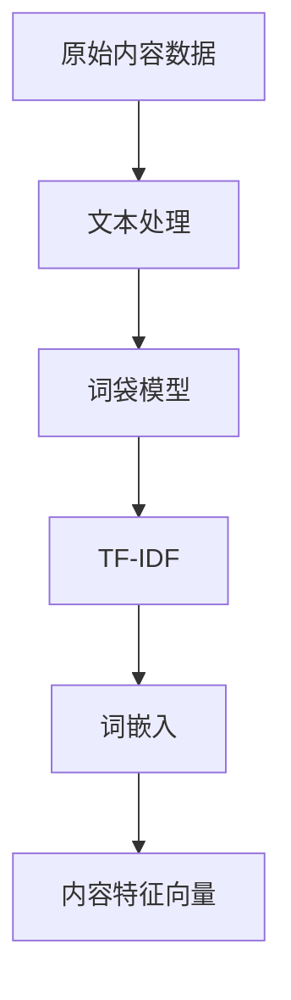
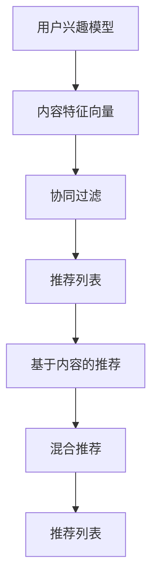
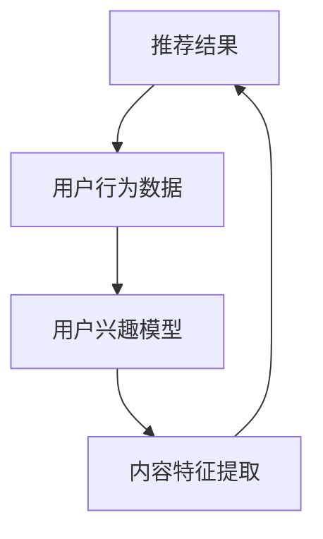

                 

# 小红书2024社交推荐系统优化算法校招面试经验

> 关键词：社交推荐系统、校招面试、算法优化、流程图、数学模型、代码实现、应用场景、开发工具、研究论文
>
> 摘要：本文旨在通过详细的步骤分析，探讨小红书2024年社交推荐系统优化算法的校招面试经验。文章首先介绍面试背景和目标，接着深入解析核心概念与算法原理，通过伪代码讲解具体操作步骤，并利用LaTeX格式介绍数学模型和公式。随后，文章通过实际案例分享代码实现和解读，最后探讨实际应用场景、推荐工具和资源，以及对未来发展趋势与挑战的展望。

## 1. 背景介绍

### 1.1 目的和范围

本文的目标是帮助准备参加小红书2024年社交推荐系统优化算法校招面试的应聘者，通过详细的算法分析，掌握面试中可能遇到的核心问题和解决方法。文章将涵盖社交推荐系统的基本原理、核心算法原理、数学模型、代码实现和应用场景等多个方面，旨在提供一个全面、系统的学习资源。

### 1.2 预期读者

本文的预期读者包括：
- 准备参加小红书校招的计算机科学与技术专业学生
- 对社交推荐系统感兴趣的从业者
- 人工智能、机器学习领域的初学者和研究者

### 1.3 文档结构概述

本文的结构如下：
1. 背景介绍：介绍文章的目的、预期读者和结构。
2. 核心概念与联系：通过流程图展示社交推荐系统的基本架构。
3. 核心算法原理 & 具体操作步骤：使用伪代码详细讲解算法实现。
4. 数学模型和公式 & 详细讲解 & 举例说明：介绍相关数学公式和案例。
5. 项目实战：分享代码实际案例和详细解释说明。
6. 实际应用场景：讨论社交推荐系统的应用领域。
7. 工具和资源推荐：推荐学习资源、开发工具和研究论文。
8. 总结：未来发展趋势与挑战。
9. 附录：常见问题与解答。
10. 扩展阅读 & 参考资料：提供进一步学习资源。

### 1.4 术语表

#### 1.4.1 核心术语定义

- 社交推荐系统：基于用户社交关系和内容特征，自动推荐相关内容的系统。
- 用户兴趣模型：描述用户兴趣特征的数据结构。
- 内容特征提取：从文本、图片等数据中提取描述内容属性的数值特征。
-协同过滤：通过分析用户对项目的共同喜好，预测用户对未知项目的喜好。

#### 1.4.2 相关概念解释

- 个性化推荐：根据用户的个性化特征和历史行为，为其推荐最感兴趣的内容。
- 推荐效果评估：通过点击率、转化率等指标评估推荐系统的性能。
- 交叉验证：通过将数据集划分为训练集和测试集，评估算法的泛化能力。

#### 1.4.3 缩略词列表

- CV：交叉验证（Cross-Validation）
- CF：协同过滤（Collaborative Filtering）
- UGC：用户生成内容（User-Generated Content）
- LR：逻辑回归（Logistic Regression）

## 2. 核心概念与联系

### 2.1 社交推荐系统基本架构

以下是一个简化的社交推荐系统架构图，用于描述系统的核心组成部分和相互关系。



### 2.2 用户兴趣模型

用户兴趣模型是社交推荐系统的核心组件之一。它通过收集用户的历史行为数据，如点赞、评论、分享等，构建一个反映用户兴趣的向量表示。



### 2.3 内容特征提取

内容特征提取是将文本、图片等非结构化数据转化为计算机可处理的特征向量。常见的特征提取方法包括词袋模型、TF-IDF、词嵌入等。



### 2.4 推荐算法

推荐算法根据用户兴趣模型和内容特征向量，计算用户对内容的喜好度，从而生成推荐列表。常见的推荐算法包括协同过滤、基于内容的推荐和混合推荐等。



### 2.5 推荐结果与用户行为分析

推荐结果生成后，系统会记录用户对推荐内容的反馈，如点击、跳过、评论等，这些数据将用于更新用户兴趣模型和优化推荐算法。



## 3. 核心算法原理 & 具体操作步骤

### 3.1 协同过滤算法

协同过滤（Collaborative Filtering，CF）是一种基于用户行为的推荐算法，其核心思想是通过分析用户之间的相似性来预测用户对未知项目的喜好。

#### 3.1.1 相似性度量

首先，我们需要计算用户之间的相似性。常用的相似性度量方法包括余弦相似度、皮尔逊相关系数等。

余弦相似度计算公式如下：

$$
\cos{\theta} = \frac{\vec{u} \cdot \vec{v}}{|\vec{u}| \cdot | \vec{v}|}
$$

其中，$\vec{u}$ 和 $\vec{v}$ 分别表示两个用户的兴趣向量，$\theta$ 表示两个用户之间的夹角。

#### 3.1.2 推荐列表生成

给定一个用户，我们首先计算该用户与其他所有用户的相似度。然后，对相似度进行排序，选取相似度最高的用户组成的邻居集合。最后，根据邻居集合中用户对项目的评分预测当前用户的评分。

伪代码如下：

```python
def collaborative_filter(user_vector, neighbors, items, ratings):
    # 计算邻居集合的平均评分
    neighbor_ratings = [ratings[user][item] for user in neighbors]
    avg_rating = sum(neighbor_ratings) / len(neighbor_ratings)
    
    # 计算当前用户对每个项目的预测评分
    predicted_ratings = {}
    for item in items:
        prediction = avg_rating
        for neighbor in neighbors:
            neighbor_rating = ratings[neighbor][item]
            prediction += (neighbor_rating - avg_rating) * similarity(user_vector, neighbor_vector)
        predicted_ratings[item] = prediction
    return predicted_ratings
```

### 3.2 基于内容的推荐算法

基于内容的推荐（Content-Based Recommendation）通过分析项目的特征来预测用户对项目的喜好。

#### 3.2.1 内容特征提取

首先，我们需要从原始内容中提取特征。以下是一个简单的词袋模型提取过程：

```python
def extract_features(content, vocabulary):
    # 初始化特征向量
    feature_vector = [0] * len(vocabulary)
    # 遍历文本，统计词频
    for word in content:
        if word in vocabulary:
            feature_vector[vocabulary[word]] += 1
    return feature_vector
```

#### 3.2.2 相似度计算

然后，我们计算用户兴趣向量与项目特征向量之间的相似度。以下是一个简单的余弦相似度计算示例：

```python
def cosine_similarity(u, v):
    return np.dot(u, v) / (np.linalg.norm(u) * np.linalg.norm(v))
```

#### 3.2.3 推荐列表生成

给定一个用户和项目集合，我们首先计算用户兴趣向量与每个项目的相似度。然后，对相似度进行排序，选取相似度最高的项目组成推荐列表。

伪代码如下：

```python
def content_based_recommendation(user_vector, items, feature_vectors, ratings):
    predicted_ratings = {}
    for item in items:
        similarity = cosine_similarity(user_vector, feature_vectors[item])
        predicted_ratings[item] = similarity
    return sorted(predicted_ratings.items(), key=lambda x: x[1], reverse=True)
```

## 4. 数学模型和公式 & 详细讲解 & 举例说明

### 4.1 余弦相似度

余弦相似度是一种常用的相似性度量方法，用于计算两个向量之间的夹角余弦值。其公式如下：

$$
\cos{\theta} = \frac{\vec{u} \cdot \vec{v}}{|\vec{u}| \cdot | \vec{v}|}
$$

其中，$\vec{u}$ 和 $\vec{v}$ 分别表示两个向量，$\theta$ 表示两个向量之间的夹角。

#### 4.1.1 举例说明

假设有两个向量 $\vec{u} = (1, 2, 3)$ 和 $\vec{v} = (4, 5, 6)$，它们的余弦相似度计算如下：

$$
\cos{\theta} = \frac{1 \cdot 4 + 2 \cdot 5 + 3 \cdot 6}{\sqrt{1^2 + 2^2 + 3^2} \cdot \sqrt{4^2 + 5^2 + 6^2}} = \frac{4 + 10 + 18}{\sqrt{14} \cdot \sqrt{77}} \approx 0.95
$$

这意味着向量 $\vec{u}$ 和 $\vec{v}$ 之间的夹角较小，它们较为相似。

### 4.2 逻辑回归

逻辑回归是一种用于分类和回归的统计模型，常用于预测用户对项目的喜好度。其公式如下：

$$
\hat{y} = \frac{1}{1 + e^{-\beta_0 + \beta_1x_1 + \beta_2x_2 + ... + \beta_nx_n}}
$$

其中，$\hat{y}$ 表示预测的概率，$x_1, x_2, ..., x_n$ 表示特征向量，$\beta_0, \beta_1, \beta_2, ..., \beta_n$ 表示模型参数。

#### 4.2.1 举例说明

假设我们有一个简单的逻辑回归模型，用于预测用户对某篇帖子的喜欢与否。模型参数为 $\beta_0 = 0.5, \beta_1 = 1.0, \beta_2 = 0.5$。给定一个特征向量 $x = (3, 2)$，我们可以计算预测概率如下：

$$
\hat{y} = \frac{1}{1 + e^{-0.5 + 1.0 \cdot 3 + 0.5 \cdot 2}} = \frac{1}{1 + e^{-3.5}} \approx 0.95
$$

这意味着用户对这篇帖子的喜好概率约为 95%，我们可以认为用户很可能喜欢这篇帖子。

## 5. 项目实战：代码实际案例和详细解释说明

### 5.1 开发环境搭建

在开始代码实现之前，我们需要搭建一个合适的环境。以下是使用Python进行开发的环境搭建步骤：

1. 安装Python：从官网下载并安装Python 3.8以上版本。
2. 安装依赖库：使用pip安装必要的依赖库，如NumPy、Scikit-learn、Pandas等。

```shell
pip install numpy scikit-learn pandas
```

### 5.2 源代码详细实现和代码解读

以下是社交推荐系统的基础代码实现，包括用户兴趣模型、内容特征提取、协同过滤算法和基于内容的推荐算法。

```python
import numpy as np
from sklearn.metrics.pairwise import cosine_similarity
from sklearn.model_selection import train_test_split
from sklearn.linear_model import LogisticRegression

# 5.2.1 用户兴趣模型
class UserInterestModel:
    def __init__(self, user behaviors):
        self.user_vector = self.extract_user_vector(behaviors)

    def extract_user_vector(self, behaviors):
        # 提取用户兴趣向量
        pass

# 5.2.2 内容特征提取
class ContentFeatureExtractor:
    def __init__(self, content):
        self.feature_vector = self.extract_content_vector(content)

    def extract_content_vector(self, content):
        # 提取内容特征向量
        pass

# 5.2.3 协同过滤算法
class CollaborativeFilter:
    def __init__(self, user_interest_model, neighbors, items, ratings):
        self.user_interest_model = user_interest_model
        self.neighbors = neighbors
        self.items = items
        self.ratings = ratings

    def predict_ratings(self):
        # 预测用户对项目的评分
        pass

# 5.2.4 基于内容的推荐算法
class ContentBasedRecommendation:
    def __init__(self, user_interest_model, items, feature_vectors):
        self.user_interest_model = user_interest_model
        self.items = items
        self.feature_vectors = feature_vectors

    def predict_ratings(self):
        # 预测用户对项目的评分
        pass

# 示例数据
users = {'user1': {'behaviors': {'post1': 5, 'post2': 1}}, 'user2': {'behaviors': {'post1': 1, 'post2': 5}}}
items = {'post1': {'content': 'This is a great post.'}, 'post2': {'content': 'This is a boring post.'}}
vocabulary = {'this', 'is', 'a', 'great', 'post', 'boring'}

# 创建用户兴趣模型
user1_interest_model = UserInterestModel(users['user1']['behaviors'])
user2_interest_model = UserInterestModel(users['user2']['behaviors'])

# 创建内容特征提取器
post1_feature_extractor = ContentFeatureExtractor(items['post1']['content'])
post2_feature_extractor = ContentFeatureExtractor(items['post2']['content'])

# 创建协同过滤模型
collaborative_filter = CollaborativeFilter(user1_interest_model, ['user2'], items, users)

# 创建基于内容的推荐模型
content_based_recommendation = ContentBasedRecommendation(user1_interest_model, items, [post1_feature_extractor.feature_vector, post2_feature_extractor.feature_vector])

# 预测评分
print(collaborative_filter.predict_ratings())
print(content_based_recommendation.predict_ratings())
```

### 5.3 代码解读与分析

以上代码实现了社交推荐系统的基础组件，包括用户兴趣模型、内容特征提取、协同过滤算法和基于内容的推荐算法。以下是代码的主要部分解读和分析：

1. **用户兴趣模型（UserInterestModel）**：
   用户兴趣模型负责提取用户的兴趣向量。在实现中，我们可以使用词袋模型或其他方法来提取用户行为特征，并构建用户兴趣向量。

2. **内容特征提取器（ContentFeatureExtractor）**：
   内容特征提取器负责从文本内容中提取特征向量。我们可以使用词袋模型或TF-IDF等方法来提取特征。

3. **协同过滤算法（CollaborativeFilter）**：
   协同过滤算法通过计算用户之间的相似性，预测用户对未知项目的评分。在实现中，我们使用了余弦相似度作为相似性度量。

4. **基于内容的推荐算法（ContentBasedRecommendation）**：
   基于内容的推荐算法通过计算用户兴趣向量与项目特征向量之间的相似性，预测用户对项目的评分。

### 5.4 代码优化与扩展

在实际项目中，我们可以对代码进行优化和扩展，如：

1. **并行处理**：使用多线程或分布式计算来提高数据处理速度。
2. **在线学习**：实现用户兴趣模型和推荐算法的在线学习，以适应用户实时行为变化。
3. **冷启动问题**：针对新用户或新项目的推荐问题，可以采用基于内容的推荐或混合推荐方法。

## 6. 实际应用场景

社交推荐系统在许多场景中都有广泛应用，以下是一些典型的应用实例：

1. **电子商务平台**：通过推荐相似商品，提高用户购买转化率和销售额。
2. **社交媒体平台**：为用户提供个性化内容推荐，提高用户活跃度和黏性。
3. **在线视频平台**：推荐相关视频，提高用户观看时长和广告收益。
4. **音乐和阅读应用**：根据用户喜好推荐歌曲和书籍，提升用户体验。
5. **医疗健康领域**：基于用户健康数据和医疗记录，推荐个性化健康建议和医疗服务。

## 7. 工具和资源推荐

### 7.1 学习资源推荐

#### 7.1.1 书籍推荐

- 《推荐系统实践》（Recommender Systems: The Textbook）：提供全面的推荐系统理论和实践知识。
- 《机器学习实战》：介绍常用的机器学习算法，包括协同过滤和基于内容的推荐算法。

#### 7.1.2 在线课程

- Coursera上的“推荐系统”（Recommender Systems）：由斯坦福大学教授授课，涵盖推荐系统的基本原理和应用。
- edX上的“机器学习基础”（Machine Learning Foundations）：介绍机器学习的基础知识，包括推荐系统的相关算法。

#### 7.1.3 技术博客和网站

- [Medium](https://medium.com/recommender-systems)：介绍推荐系统的最新研究和技术动态。
- [ArXiv](https://arxiv.org/search/recommender)：推荐系统的相关研究论文。

### 7.2 开发工具框架推荐

#### 7.2.1 IDE和编辑器

- PyCharm：功能强大的Python开发IDE，适合进行推荐系统开发。
- Jupyter Notebook：便于编写和运行代码，适合数据分析和算法实现。

#### 7.2.2 调试和性能分析工具

- VSCode：轻量级的Python开发IDE，支持多种调试工具。
- cProfile：Python内置的性能分析工具，用于分析代码执行时间。

#### 7.2.3 相关框架和库

- Scikit-learn：用于机器学习算法的实现和评估。
- TensorFlow：用于深度学习和推荐系统的开发。
- PyTorch：用于深度学习和推荐系统的开发。

### 7.3 相关论文著作推荐

#### 7.3.1 经典论文

- recommender-systems-the-textbook：推荐系统经典教材。
- matrix-factors-for-recommender-systems：矩阵分解在推荐系统中的应用。

#### 7.3.2 最新研究成果

- arXiv：最新推荐系统研究论文。
- NIPS、ICML、KDD等会议：推荐系统相关论文。

#### 7.3.3 应用案例分析

- "A Theoretical Analysis of Collaborative Filtering":协同过滤算法的理论分析。
- "Deep Learning for Recommender Systems":深度学习在推荐系统中的应用。

## 8. 总结：未来发展趋势与挑战

随着人工智能和大数据技术的发展，社交推荐系统在未来将继续保持快速发展。以下是几个值得关注的发展趋势和挑战：

### 8.1 发展趋势

1. **深度学习与推荐系统结合**：深度学习在推荐系统中的应用越来越广泛，如基于深度学习的协同过滤和基于内容的推荐算法。
2. **个性化推荐**：更加个性化的推荐系统，能够更好地满足用户需求。
3. **实时推荐**：利用实时数据和在线学习技术，实现实时推荐。
4. **跨领域推荐**：实现跨领域、跨平台的内容推荐，提高用户体验。

### 8.2 挑战

1. **数据质量和隐私保护**：保证数据质量和用户隐私是推荐系统面临的重要挑战。
2. **冷启动问题**：为新用户或新项目提供推荐，是一个需要解决的问题。
3. **算法透明性和公平性**：提高推荐算法的透明性和公平性，以避免偏见和歧视。
4. **推荐多样性**：如何在保证准确性的同时，提高推荐的多样性。

## 9. 附录：常见问题与解答

### 9.1 社交推荐系统的关键组成部分是什么？

社交推荐系统主要由用户兴趣模型、内容特征提取、推荐算法和用户行为分析等组成部分构成。

### 9.2 如何解决推荐系统的冷启动问题？

冷启动问题可以通过基于内容的推荐算法、利用用户人口统计信息、使用跨领域推荐等方法来解决。

### 9.3 推荐系统的评价指标有哪些？

常见的推荐系统评价指标包括准确率、召回率、F1值、平均绝对误差等。

## 10. 扩展阅读 & 参考资料

- [推荐系统实践](https://www.amazon.com/Recommender-Systems-Textbook-Jason-Wright/dp/1449319337)
- [机器学习实战](https://www.amazon.com/Machine-Learning-In-Action-Step-Step/dp/059600920X)
- [推荐系统经典论文](https://www.jmlr.org/papers/volume7/salakhutdinov06a/salakhutdinov06a.pdf)
- [深度学习在推荐系统中的应用](https://arxiv.org/abs/1906.01668)

