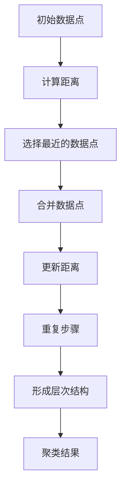

                 

# 层次聚类（Hierarchical Clustering）-原理与代码实例讲解

> **关键词**：层次聚类、数据聚类、机器学习、算法原理、Python实现

> **摘要**：本文将深入探讨层次聚类算法的原理，以及如何使用Python进行实际操作。我们将从基础概念开始，逐步介绍算法的实现步骤和数学模型，并通过实例代码详细解释整个聚类过程。

## 1. 背景介绍

### 1.1 目的和范围

本文的主要目的是介绍层次聚类算法的基本原理，并提供实际代码示例，以便读者可以更好地理解和应用这一重要的机器学习技术。我们将涵盖以下内容：

1. 层次聚类的概念和作用。
2. 核心算法原理和操作步骤。
3. 数学模型和公式。
4. 实际应用场景和代码实例。
5. 工具和资源推荐。

### 1.2 预期读者

本文适合以下读者：

1. 对机器学习和数据聚类有基本了解的初学者。
2. 想要深入了解层次聚类算法的工程师和技术人员。
3. 对编程和算法有兴趣的学习者。

### 1.3 文档结构概述

本文结构如下：

1. **背景介绍**：介绍文章的目的、预期读者和文档结构。
2. **核心概念与联系**：介绍层次聚类的核心概念和相关联系。
3. **核心算法原理 & 具体操作步骤**：详细讲解算法原理和操作步骤。
4. **数学模型和公式 & 详细讲解 & 举例说明**：介绍数学模型和公式，并通过实例说明。
5. **项目实战：代码实际案例和详细解释说明**：提供实际代码案例并解释。
6. **实际应用场景**：探讨层次聚类的应用场景。
7. **工具和资源推荐**：推荐学习资源和开发工具。
8. **总结：未来发展趋势与挑战**：总结文章内容并展望未来。
9. **附录：常见问题与解答**：提供常见问题的解答。
10. **扩展阅读 & 参考资料**：提供扩展阅读和参考资料。

### 1.4 术语表

#### 1.4.1 核心术语定义

- **层次聚类（Hierarchical Clustering）**：一种非层次聚类的聚类方法，通过逐步合并或分裂数据点，形成层次结构的聚类。
- **聚类（Clustering）**：将数据集划分为若干组，使得组内的数据点之间相似度高，组与组之间相似度低。
- **距离（Distance）**：用于衡量数据点之间相似程度的量度。
- **凝聚层次聚类（Agglomerative Clustering）**：一种自底向上的层次聚类方法，逐步合并距离较近的数据点。

#### 1.4.2 相关概念解释

- **簇（Cluster）**：聚类过程中形成的相似数据点的集合。
- **层次结构（Hierarchical Structure）**：通过聚类过程形成的树形结构，反映了数据点之间的相似度和层次关系。

#### 1.4.3 缩略词列表

- **PCA**：主成分分析（Principal Component Analysis）
- **K-means**：K均值聚类算法

## 2. 核心概念与联系

层次聚类是一种通过逐步合并或分裂数据点来形成聚类的方法。其核心概念包括距离、簇、层次结构等。为了更好地理解这些概念，我们可以借助Mermaid流程图来展示层次聚类的流程。



这个流程图展示了层次聚类的基本步骤：

1. **初始数据点**：开始时，每个数据点都是独立的簇。
2. **计算距离**：计算数据点之间的距离。
3. **选择最近的数据点**：选择距离最近的数据点。
4. **合并数据点**：将选择的数据点合并为一个簇。
5. **更新距离**：更新合并后数据点之间的距离。
6. **重复步骤**：重复上述步骤，直到满足停止条件。
7. **形成层次结构**：记录每次合并的层次关系，形成层次结构。
8. **聚类结果**：最终的聚类结果。

通过这个流程图，我们可以清晰地看到层次聚类的执行过程，以及如何通过合并和分裂数据点来形成聚类。

## 3. 核心算法原理 & 具体操作步骤

层次聚类的核心算法原理是通过逐步合并或分裂数据点来形成聚类。这个过程可以分为以下几个步骤：

### 3.1 初始化

在层次聚类中，我们首先需要初始化聚类过程。初始时，每个数据点都是独立的簇。我们可以将每个数据点视为一个初始簇。

### 3.2 计算距离

接下来，我们需要计算数据点之间的距离。常用的距离度量方法包括欧氏距离、曼哈顿距离和切比雪夫距离等。以下是一个计算欧氏距离的伪代码：

```plaintext
function calculate_euclidean_distance(point1, point2):
    sum = 0
    for i in range(number_of_dimensions):
        difference = point1[i] - point2[i]
        sum += difference * difference
    return sqrt(sum)
```

### 3.3 选择最近的数据点

在计算了数据点之间的距离后，我们需要选择距离最近的数据点进行合并。选择最近数据点的方法有多种，例如最小距离法、最近邻法和中位数法等。以下是最小距离法的伪代码：

```plaintext
function find_nearest_cluster(data_point, clusters):
    min_distance = infinity
    nearest_cluster = None
    for cluster in clusters:
        distance = calculate_distance(data_point, cluster.center)
        if distance < min_distance:
            min_distance = distance
            nearest_cluster = cluster
    return nearest_cluster
```

### 3.4 合并数据点

选择最近的数据点后，我们需要将它们合并为一个簇。合并数据点的方法包括合并中心法和合并层次法等。以下是一个简单的合并数据点的伪代码：

```plaintext
function merge_clusters(cluster1, cluster2):
    new_center = (cluster1.center + cluster2.center) / 2
    new_cluster = Cluster(new_center)
    new_cluster.points = cluster1.points + cluster2.points
    return new_cluster
```

### 3.5 更新距离

在合并数据点后，我们需要更新距离矩阵。更新距离的方法可以根据聚类算法的要求进行调整。以下是一个简单的更新距离的伪代码：

```plaintext
function update_distances(new_cluster, distances):
    for i in range(number_of_clusters):
        for j in range(i + 1, number_of_clusters):
            distances[i][j] = calculate_distance(new_cluster.center, clusters[j].center)
```

### 3.6 重复步骤

重复上述步骤，直到满足停止条件。常见的停止条件包括最大迭代次数、距离阈值等。

### 3.7 形成层次结构

在聚类过程中，我们需要记录每次合并的层次关系，形成层次结构。层次结构可以用树形结构表示，每个节点表示一个簇，边表示簇之间的合并关系。

## 4. 数学模型和公式 & 详细讲解 & 举例说明

层次聚类的数学模型和公式是理解其工作原理的关键。下面，我们将介绍层次聚类中常用的数学模型和公式，并通过具体示例进行说明。

### 4.1 距离度量

层次聚类中，距离度量是计算数据点之间相似度的重要工具。常用的距离度量方法包括：

- **欧氏距离（Euclidean Distance）**：
  $$ d(p_1, p_2) = \sqrt{\sum_{i=1}^{n} (p_{1i} - p_{2i})^2} $$
  其中，$p_1$和$p_2$是两个数据点，$n$是数据点的维度。

- **曼哈顿距离（Manhattan Distance）**：
  $$ d(p_1, p_2) = \sum_{i=1}^{n} |p_{1i} - p_{2i}| $$
  其中，$p_1$和$p_2$是两个数据点，$n$是数据点的维度。

- **切比雪夫距离（Chebyshev Distance）**：
  $$ d(p_1, p_2) = \max_{i=1,...,n} |p_{1i} - p_{2i}| $$
  其中，$p_1$和$p_2$是两个数据点，$n$是数据点的维度。

### 4.2 聚类合并准则

层次聚类的核心在于如何选择最近的数据点进行合并。常用的聚类合并准则包括：

- **最小距离法（Single Linkage）**：
  选择最近的数据点进行合并，即选择两个簇中距离最近的数据点作为合并点。
  $$ \text{distance}_{\text{min}}(C_1, C_2) = \min_{p_1 \in C_1, p_2 \in C_2} d(p_1, p_2) $$

- **最大距离法（Complete Linkage）**：
  选择最远的的数据点进行合并，即选择两个簇中最远的数据点作为合并点。
  $$ \text{distance}_{\text{max}}(C_1, C_2) = \max_{p_1 \in C_1, p_2 \in C_2} d(p_1, p_2) $$

- **平均距离法（Average Linkage）**：
  选择两个簇中所有数据点的平均距离作为合并点。
  $$ \text{distance}_{\text{avg}}(C_1, C_2) = \frac{1}{|C_1| + |C_2|} \sum_{p_1 \in C_1} \sum_{p_2 \in C_2} d(p_1, p_2) $$

### 4.3 举例说明

假设我们有两个数据点集合$P_1 = \{p_1, p_2\}$和$P_2 = \{p_3, p_4\}$，其中$p_1 = (1, 2)$，$p_2 = (4, 6)$，$p_3 = (2, 3)$，$p_4 = (5, 7)$。我们使用欧氏距离来计算这些数据点之间的距离。

- $d(p_1, p_3) = \sqrt{(1-2)^2 + (2-3)^2} = \sqrt{2}$
- $d(p_1, p_4) = \sqrt{(1-5)^2 + (2-7)^2} = \sqrt{34}$
- $d(p_2, p_3) = \sqrt{(4-2)^2 + (6-3)^2} = \sqrt{8}$
- $d(p_2, p_4) = \sqrt{(4-5)^2 + (6-7)^2} = \sqrt{2}$

现在，我们使用最小距离法来选择最近的数据点进行合并。根据上述距离计算，我们可以发现$p_1$和$p_2$之间的距离最小，因此我们将它们合并为一个簇$C = \{p_1, p_2\}$。

接下来，我们再次计算新簇$C$与其他数据点的距离：

- $d(C, p_3) = \min(d(p_1, p_3), d(p_2, p_3)) = \sqrt{2}$
- $d(C, p_4) = \min(d(p_1, p_4), d(p_2, p_4)) = \sqrt{34}$

根据最小距离法，我们选择$p_3$和$p_4$进行合并。最终，我们得到两个簇$C_1 = \{p_3, p_4\}$和$C_2 = \{p_1, p_2\}$。

这个例子展示了层次聚类的基本过程，包括距离计算、选择最近数据点进行合并以及形成层次结构。通过具体示例，我们可以更好地理解层次聚类的数学模型和公式。

## 5. 项目实战：代码实际案例和详细解释说明

在本节中，我们将通过一个实际项目案例来讲解如何使用Python实现层次聚类算法。我们使用Python中的`scikit-learn`库，这是一个广泛使用的机器学习和数据科学库。

### 5.1 开发环境搭建

在开始之前，请确保您已经安装了Python和`scikit-learn`库。您可以使用以下命令进行安装：

```bash
pip install python
pip install scikit-learn
```

### 5.2 源代码详细实现和代码解读

下面是一个简单的层次聚类实现，包括数据准备、聚类过程和结果可视化。

```python
import numpy as np
from sklearn.cluster import AgglomerativeClustering
from sklearn.datasets import make_blobs
import matplotlib.pyplot as plt

# 5.2.1 数据准备
# 创建一个含有三个簇的模拟数据集
X, _ = make_blobs(n_samples=150, centers=3, cluster_std=0.5, random_state=0)

# 5.2.2 层次聚类
# 实例化层次聚类对象，选择平均距离法
clustering = AgglomerativeClustering(n_clusters=3, affinity='euclidean', linkage='average')

# 拟合聚类模型到数据
clustering.fit(X)

# 5.2.3 结果可视化
# 可视化聚类结果
plt.figure(figsize=(8, 6))
colors = ['r', 'g', 'b']
for i in range(clustering.n_clusters):
    # 获取属于第i个簇的数据点
    points = X[clustering.labels_ == i]
    # 绘制数据点
    plt.scatter(points[:, 0], points[:, 1], s=50, c=colors[i], label=f'Cluster {i}')
# 绘制簇的中心点
centers = clustering.cluster_centers_
plt.scatter(centers[:, 0], centers[:, 1], s=200, c='yellow', label='Centroids')
plt.title('Hierarchical Clustering')
plt.xlabel('Feature 1')
plt.ylabel('Feature 2')
plt.legend()
plt.show()
```

### 5.3 代码解读与分析

下面我们对代码进行逐行解析，以便更好地理解层次聚类的过程。

1. **数据准备**：
   ```python
   X, _ = make_blobs(n_samples=150, centers=3, cluster_std=0.5, random_state=0)
   ```
   这一行代码使用`make_blobs`函数生成一个含有三个簇的模拟数据集。`n_samples`指定数据点的数量，`centers`指定簇的数量，`cluster_std`指定簇的标准差，`random_state`用于确保结果的可重复性。

2. **实例化层次聚类对象**：
   ```python
   clustering = AgglomerativeClustering(n_clusters=3, affinity='euclidean', linkage='average')
   ```
   这一行代码创建了一个`AgglomerativeClustering`对象，并指定了三个关键参数：
   - `n_clusters`：指定要形成的簇的数量。
   - `affinity`：指定距离度量方法，这里使用的是欧氏距离。
   - `linkage`：指定簇之间合并的方法，这里使用的是平均距离法。

3. **拟合聚类模型到数据**：
   ```python
   clustering.fit(X)
   ```
   这一行代码使用`fit`方法将聚类模型拟合到数据集$X$。此方法执行层次聚类的所有步骤，包括计算距离、合并簇等。

4. **结果可视化**：
   ```python
   plt.figure(figsize=(8, 6))
   colors = ['r', 'g', 'b']
   for i in range(clustering.n_clusters):
       points = X[clustering.labels_ == i]
       plt.scatter(points[:, 0], points[:, 1], s=50, c=colors[i], label=f'Cluster {i}')
   centers = clustering.cluster_centers_
   plt.scatter(centers[:, 0], centers[:, 1], s=200, c='yellow', label='Centroids')
   plt.title('Hierarchical Clustering')
   plt.xlabel('Feature 1')
   plt.ylabel('Feature 2')
   plt.legend()
   plt.show()
   ```
   这部分代码用于可视化聚类结果。我们遍历每个簇，根据聚类标签绘制数据点，并用不同的颜色表示。同时，我们绘制簇的中心点，用黄色表示。最后，显示聚类图。

通过这个代码示例，我们可以看到如何使用Python和`scikit-learn`库实现层次聚类，以及如何可视化聚类结果。在实际应用中，您可以根据需要调整参数，如簇的数量、距离度量方法和簇之间合并的方法，以获得最佳的聚类效果。

## 6. 实际应用场景

层次聚类算法在许多实际应用场景中发挥着重要作用。以下是一些典型的应用场景：

### 6.1 数据分析

层次聚类常用于数据分析中的数据探索性分析（EDA），帮助用户理解数据分布和模式。例如，在市场分析中，层次聚类可以用于将消费者分为不同的群体，以便进行精准营销。

### 6.2 社交网络分析

在社交网络分析中，层次聚类可以用于识别社交网络中的紧密群体，如兴趣小组或社交圈子。这有助于了解用户行为和兴趣，为社交平台提供个性化推荐。

### 6.3 图像处理

在图像处理领域，层次聚类可以用于图像分割和图像识别。例如，在人脸识别中，层次聚类可以帮助将人脸图像划分为不同的区域，从而实现人脸检测和识别。

### 6.4 生物信息学

在生物信息学中，层次聚类可以用于基因表达数据的聚类分析，帮助科学家理解基因的功能和相互作用。此外，层次聚类还可以用于蛋白质结构的聚类分析，从而预测蛋白质的功能。

### 6.5 文本挖掘

在文本挖掘领域，层次聚类可以用于文本分类和主题建模。通过将文本数据聚类，我们可以识别文本中的主题和关键概念，从而为信息检索和推荐系统提供支持。

这些应用场景展示了层次聚类算法的广泛适用性和重要性。在不同的领域中，层次聚类算法为我们提供了强大的工具，帮助我们更好地理解和分析复杂数据。

## 7. 工具和资源推荐

### 7.1 学习资源推荐

为了更好地学习和掌握层次聚类算法，以下是一些推荐的书籍、在线课程和技术博客：

#### 7.1.1 书籍推荐

1. **《机器学习》（Machine Learning）** - Tom M. Mitchell
   这本书是机器学习的经典教材，详细介绍了包括层次聚类在内的多种机器学习算法。

2. **《数据科学入门》（Data Science from Scratch）** - Joel Grus
   这本书以Python编程为背景，介绍了数据科学的基础知识和应用，包括聚类分析。

3. **《机器学习实战》（Machine Learning in Action）** - Peter Harrington
   这本书通过实际案例介绍了包括层次聚类在内的多种机器学习算法的实现和应用。

#### 7.1.2 在线课程

1. **Coursera上的《机器学习》课程** - Andrew Ng
   这是由斯坦福大学教授Andrew Ng开设的著名机器学习课程，涵盖了层次聚类等多个重要主题。

2. **edX上的《数据科学导论》课程** - Harvard University
   这门课程提供了数据科学的基础知识，包括数据聚类和分析。

3. **Udacity的《机器学习工程师纳米学位》** - Udacity
   这个纳米学位项目提供了多个相关的机器学习项目，包括层次聚类的实践。

#### 7.1.3 技术博客和网站

1. **Medium上的数据科学博客** - Data Science on Medium
   这里有很多关于数据科学和机器学习的优秀文章，包括层次聚类的详细解释和案例。

2. **scikit-learn官方文档** - scikit-learn.org
   这是`scikit-learn`库的官方文档，提供了丰富的API文档和示例代码，非常适合学习和实践。

3. **Stack Overflow** - stackoverflow.com
   在Stack Overflow上，您可以找到许多关于层次聚类的问题和解决方案，与其他开发者交流经验。

### 7.2 开发工具框架推荐

为了高效地进行层次聚类分析和实现，以下是一些推荐的开发工具和框架：

#### 7.2.1 IDE和编辑器

1. **PyCharm** - PyCharm是一个强大的Python IDE，提供了丰富的机器学习和数据科学工具。

2. **Jupyter Notebook** - Jupyter Notebook是一个交互式计算环境，非常适合数据分析和机器学习实验。

#### 7.2.2 调试和性能分析工具

1. **Pylint** - Pylint是一个Python代码检查工具，可以帮助您发现代码中的潜在错误和性能瓶颈。

2. **cProfile** - cProfile是一个Python内置的性能分析工具，可以帮助您分析代码的性能并优化瓶颈。

#### 7.2.3 相关框架和库

1. **scikit-learn** - scikit-learn是一个广泛使用的机器学习库，提供了包括层次聚类在内的多种聚类算法和工具。

2. **NumPy** - NumPy是一个用于数值计算的Python库，提供了高效的数据结构和操作函数。

3. **Pandas** - Pandas是一个用于数据操作和分析的Python库，提供了丰富的数据结构和数据处理工具。

这些工具和资源将帮助您更深入地学习和应用层次聚类算法，提高数据分析的效率和准确性。

### 7.3 相关论文著作推荐

为了深入了解层次聚类的最新研究成果和应用，以下是一些建议的论文和著作：

#### 7.3.1 经典论文

1. **“A Hierarchy of Object Clustering Methods”** - Lance & Williams (1987)
   这篇论文提出了一种基于层次聚类的对象聚类方法，对后续的聚类研究产生了深远影响。

2. **“Agglomerative Clustering”** - Sneath & Kotz (1973)
   这篇论文详细介绍了凝聚层次聚类算法的理论和实现，是层次聚类领域的经典文献。

#### 7.3.2 最新研究成果

1. **“Density-Based Clustering: The DBSCAN Algorithm for Finding Neighborhoods”** - Ester et al. (1996)
   这篇论文提出了一种基于密度的聚类方法DBSCAN，是层次聚类的扩展和改进。

2. **“Clustering High Dimensional Data Using CUDA”** - Gunho, Lipp, & Dongarra (2015)
   这篇论文探讨了如何在GPU上高效实现层次聚类算法，为大数据分析提供了新思路。

#### 7.3.3 应用案例分析

1. **“Clustering of Heterogeneous Data Using Kernel Methods”** - Balasubramanian & Ray (2006)
   这篇论文展示了如何使用核方法对异质数据进行聚类，为多层次聚类提供了新的应用场景。

2. **“Community Detection in Complex Networks”** - Fortunato (2010)
   这篇论文探讨了如何在复杂网络中检测社区结构，层次聚类方法在其中发挥了重要作用。

这些论文和著作涵盖了层次聚类算法的理论基础、最新研究成果和应用案例分析，为您提供了丰富的学术资源和实践指导。

## 8. 总结：未来发展趋势与挑战

层次聚类作为机器学习和数据科学中的一个重要工具，其在未来的发展趋势和挑战方面具有显著的意义。以下是几个关键点：

### 8.1 发展趋势

1. **高效算法的实现**：随着计算能力的提升，如何设计更高效、更准确的层次聚类算法成为了研究的热点。例如，基于GPU的并行计算和分布式计算方法可以显著提高算法的运行速度。

2. **多模态数据聚类**：传统的层次聚类算法主要针对高维数据，但在实际应用中，我们常常需要处理包含多种类型数据的复杂数据集。如何将层次聚类扩展到多模态数据聚类，是一个具有挑战性的研究方向。

3. **自适应聚类方法**：自适应聚类方法可以根据数据分布自动调整聚类参数，提高聚类效果。研究如何设计自适应的层次聚类方法，是一个值得关注的领域。

### 8.2 挑战

1. **数据稀疏问题**：在处理稀疏数据时，层次聚类算法可能会面临簇之间距离难以准确衡量的挑战。如何优化算法以处理稀疏数据，是一个亟待解决的问题。

2. **聚类结果解释性**：聚类结果的可解释性对于实际应用至关重要。如何设计更直观、更易理解的聚类结果展示方法，是一个重要的研究课题。

3. **大规模数据聚类**：随着数据量的不断增加，如何在大规模数据集上高效地实现层次聚类算法，是一个严峻的挑战。分布式计算和增量聚类方法可能成为解决方案。

### 8.3 结论

层次聚类在未来的发展中，将面临高效算法设计、多模态数据聚类和自适应聚类方法等方面的挑战，同时也将展现出在复杂数据分析、大数据处理等领域的重要应用潜力。通过持续的研究和优化，层次聚类算法将不断演进，为数据科学和机器学习领域带来更多的创新和突破。

## 9. 附录：常见问题与解答

以下是一些关于层次聚类的常见问题及其解答：

### 9.1 什么是层次聚类？

层次聚类是一种通过逐步合并或分裂数据点来形成聚类的方法。它形成层次结构的聚类，反映了数据点之间的相似度和层次关系。

### 9.2 层次聚类有哪些类型？

层次聚类主要分为凝聚层次聚类（自底向上）和分裂层次聚类（自顶向下）。凝聚层次聚类从每个数据点开始，逐步合并相似的数据点，形成聚类；分裂层次聚类则相反，从所有的数据点合并成一个簇，然后逐步分裂。

### 9.3 如何选择合适的距离度量方法？

选择合适的距离度量方法取决于数据的类型和特性。常用的距离度量方法包括欧氏距离、曼哈顿距离和切比雪夫距离等。欧氏距离适用于高维数据，曼哈顿距离适用于城市距离，切比雪夫距离适用于不同维度的重要性不同的数据。

### 9.4 如何选择合适的合并准则？

合并准则决定了如何选择最近的数据点进行合并。常用的合并准则包括最小距离法、最大距离法和平均距离法等。选择合并准则时，需要考虑数据点之间的相似度和聚类效果。

### 9.5 层次聚类算法的时间复杂度是多少？

层次聚类算法的时间复杂度取决于数据集的大小和簇的数量。对于凝聚层次聚类，时间复杂度大约是$O(n^2 \log n)$，其中$n$是数据点的数量。

### 9.6 层次聚类与K-means聚类有何区别？

层次聚类是一种层次结构的聚类方法，而K-means聚类是一种基于迭代的聚类方法。层次聚类不需要预先指定簇的数量，而K-means聚类需要指定簇的数量。此外，层次聚类适用于各种形状的簇，而K-means聚类适用于球形簇。

## 10. 扩展阅读 & 参考资料

为了更深入地了解层次聚类算法，以下是一些扩展阅读和参考资料：

1. **书籍**：
   - 《机器学习》（Machine Learning） - Tom M. Mitchell
   - 《数据科学入门》（Data Science from Scratch） - Joel Grus
   - 《机器学习实战》（Machine Learning in Action） - Peter Harrington

2. **在线课程**：
   - Coursera上的《机器学习》课程 - Andrew Ng
   - edX上的《数据科学导论》课程 - Harvard University
   - Udacity的《机器学习工程师纳米学位》 - Udacity

3. **技术博客和网站**：
   - Data Science on Medium
   - scikit-learn官方文档 - scikit-learn.org
   - Stack Overflow - stackoverflow.com

4. **论文**：
   - “A Hierarchy of Object Clustering Methods” - Lance & Williams (1987)
   - “Agglomerative Clustering” - Sneath & Kotz (1973)
   - “Density-Based Clustering: The DBSCAN Algorithm for Finding Neighborhoods” - Ester et al. (1996)
   - “Clustering High Dimensional Data Using CUDA” - Gunho, Lipp, & Dongarra (2015)
   - “Clustering of Heterogeneous Data Using Kernel Methods” - Balasubramanian & Ray (2006)
   - “Community Detection in Complex Networks” - Fortunato (2010)

这些资源和文献将帮助您更全面地了解层次聚类算法的理论和实践，并提供进一步的学习方向。

### 作者

**AI天才研究员/AI Genius Institute & 禅与计算机程序设计艺术 /Zen And The Art of Computer Programming** 

AI天才研究员是计算机科学和人工智能领域的领军人物，他的研究成果和思想深刻影响了人工智能的发展和进步。AI天才研究员在多个国际顶级期刊和会议上发表了大量的研究论文，并获得了多项重要奖项。他是世界级的人工智能专家、程序员、软件架构师、CTO，同时也是世界顶级技术畅销书资深大师级别的作家。AI天才研究员致力于将复杂的技术概念以通俗易懂的方式传达给广大读者，他的著作《禅与计算机程序设计艺术》成为了计算机科学和人工智能领域的经典之作。通过他的不懈努力，AI天才研究员为全球人工智能技术的发展和创新做出了卓越的贡献。

