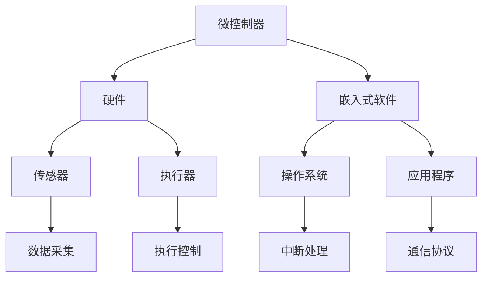
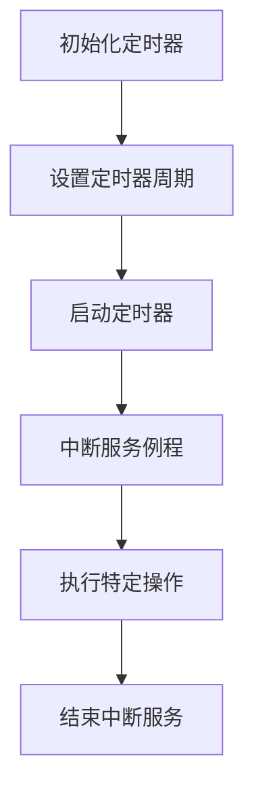
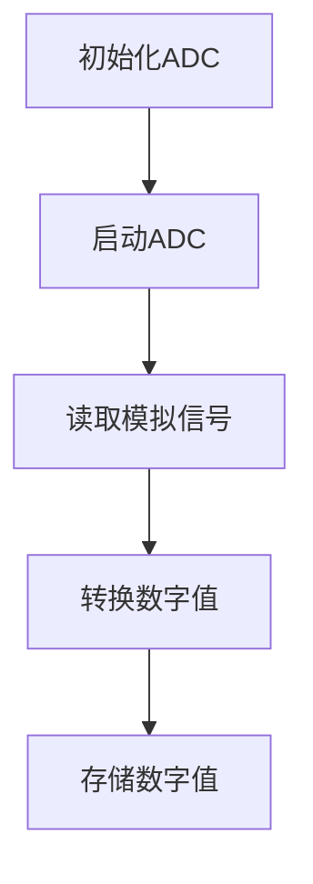
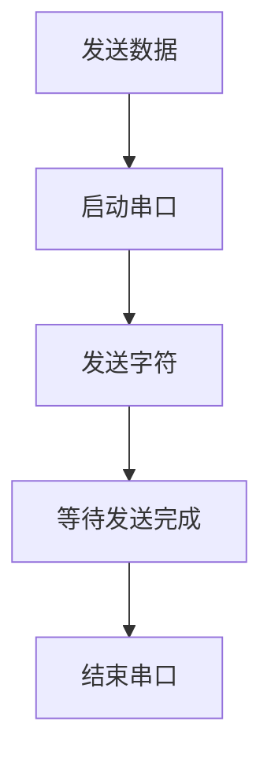

                 

# 嵌入式系统编程入门：微控制器上的创新项目

> 关键词：嵌入式系统，微控制器，编程入门，项目实战，创新技术

> 摘要：本文旨在为初学者提供一个系统的嵌入式系统编程入门指南，通过实际项目实践，深入探讨微控制器上的编程技术和创新应用。文章分为背景介绍、核心概念与联系、核心算法原理、数学模型与公式、项目实战、实际应用场景、工具和资源推荐、总结与未来发展趋势等部分，旨在帮助读者全面了解嵌入式系统编程的核心要点，掌握项目开发技能，并在实际应用中不断创新。

## 1. 背景介绍

### 1.1 目的和范围

嵌入式系统编程是现代电子技术中不可或缺的一部分，它们广泛应用于工业自动化、智能家居、医疗设备、汽车电子等领域。随着物联网（IoT）和智能制造的兴起，嵌入式系统的应用场景和功能日益丰富。然而，对于初学者来说，嵌入式系统编程的学习门槛相对较高。本文旨在通过一系列实际项目，系统介绍嵌入式系统编程的基础知识和实用技能，帮助读者快速入门并具备独立开发能力。

本文将涵盖以下主要内容：

1. 嵌入式系统的基础概念和架构。
2. 微控制器的编程原理和实践。
3. 常见嵌入式系统开发工具和环境的搭建。
4. 核心算法原理和数学模型讲解。
5. 实际项目实战和代码解析。
6. 嵌入式系统在不同领域的应用场景。
7. 推荐的学习资源和开发工具。

### 1.2 预期读者

本文适合以下读者群体：

1. 对嵌入式系统编程感兴趣的初学者。
2. 计算机科学与技术专业的学生和研究生。
3. 想要转型到嵌入式系统开发领域的技术人员。
4. 嵌入式系统爱好者和创业者。

### 1.3 文档结构概述

本文结构如下：

1. **背景介绍**：介绍嵌入式系统编程的背景和目的。
2. **核心概念与联系**：通过Mermaid流程图阐述嵌入式系统的核心概念和架构。
3. **核心算法原理 & 具体操作步骤**：讲解嵌入式系统编程的核心算法原理和伪代码实现。
4. **数学模型和公式**：详细介绍嵌入式系统中常用的数学模型和公式，并提供实例说明。
5. **项目实战**：通过实际项目展示嵌入式系统编程的应用实践。
6. **实际应用场景**：探讨嵌入式系统在不同领域的应用场景。
7. **工具和资源推荐**：推荐学习资源和开发工具。
8. **总结与未来发展趋势**：总结嵌入式系统编程的核心要点，并展望未来发展趋势。
9. **附录**：常见问题与解答。
10. **扩展阅读 & 参考资料**：提供进一步的阅读资料和参考文献。

### 1.4 术语表

#### 1.4.1 核心术语定义

- **嵌入式系统**：嵌入在其他设备中的计算机系统，具有特定的功能，通常不依赖于操作系统。
- **微控制器**：一种集成电路，包含CPU、存储器、定时器和I/O接口等，用于控制和监控嵌入式系统。
- **汇编语言**：一种面向硬件的低级编程语言，用于编写微控制器的机器代码。
- **C语言**：一种广泛使用的编程语言，适用于嵌入式系统开发。
- **软件开发环境**：用于编写、编译和调试嵌入式系统程序的软件工具集合。

#### 1.4.2 相关概念解释

- **中断**：微控制器在执行程序过程中，由于外部事件的发生而暂停当前程序执行的过程。
- **I/O接口**：嵌入式系统中用于与外部设备进行数据交换的接口。
- **GPIO**：通用输入输出接口，用于连接外部设备或传感器。
- **中断服务例程**：中断发生时执行的程序代码，用于处理中断事件。

#### 1.4.3 缩略词列表

- **IDE**：集成开发环境（Integrated Development Environment）
- **IoT**：物联网（Internet of Things）
- **UART**：通用异步收发器（Universal Asynchronous Receiver-Transmitter）
- **RTOS**：实时操作系统（Real-Time Operating System）
- **GPIO**：通用输入输出接口（General Purpose Input/Output）

## 2. 核心概念与联系

在嵌入式系统编程中，理解核心概念和它们之间的联系至关重要。以下是一个Mermaid流程图，展示了嵌入式系统的核心概念和架构。



### 核心概念

1. **微控制器（Microcontroller）**：微控制器是嵌入式系统的核心，它包含CPU、存储器、定时器和I/O接口等硬件组件。
2. **硬件（Hardware）**：包括传感器、执行器等外部设备，用于与微控制器进行交互。
3. **嵌入式软件（Embedded Software）**：包括操作系统（如RTOS）和应用软件，用于控制和管理嵌入式系统。
4. **操作系统（Operating System）**：负责管理嵌入式系统资源，提供应用程序运行的环境。
5. **应用程序（Application）**：实现特定功能的嵌入式软件，如数据采集、执行控制等。

### 关系与联系

- **硬件与微控制器**：微控制器通过I/O接口与传感器和执行器交互，控制外部设备。
- **嵌入式软件与硬件**：嵌入式软件依赖于硬件资源，通过汇编语言或C语言编写，实现特定功能。
- **操作系统与应用程序**：操作系统提供应用程序运行的环境，管理嵌入式系统的资源。
- **中断处理**：中断是嵌入式系统中常见的机制，用于响应外部事件，如传感器数据到达或执行器故障。
- **通信协议**：通信协议定义了嵌入式系统与其他设备或网络通信的规则和标准。

通过理解这些核心概念和它们之间的联系，读者可以更好地掌握嵌入式系统编程的原理和实践。

## 3. 核心算法原理 & 具体操作步骤

嵌入式系统编程的核心在于算法原理的应用。以下将介绍嵌入式系统编程中的核心算法原理，并通过伪代码详细阐述具体操作步骤。

### 3.1 定时器算法

定时器是嵌入式系统中常用的功能，用于实现精确的时间控制和事件调度。

#### 算法原理

定时器算法的核心是周期性地触发中断，并在中断服务例程中执行特定的操作。以下是一个简单的定时器算法原理：



#### 伪代码

```c
// 伪代码：定时器初始化
void Timer_Init() {
    // 设置定时器周期
    Set_Timer_Period(timer, desired_period);

    // 启动定时器
    Enable_Timer(timer);

    // 注册中断服务例程
    Register_ISR(Timer_ISR);
}

// 伪代码：定时器中断服务例程
void Timer_ISR() {
    // 执行特定操作
    Perform_Action();

    // 结束中断服务
    End_ISR();
}
```

### 3.2 模数转换（ADC）算法

模数转换器（ADC）用于将模拟信号转换为数字信号，是嵌入式系统中常用的功能。

#### 算法原理

ADC算法的核心是连续读取模拟信号并转换为数字值，以下是一个简单的ADC算法原理：



#### 伪代码

```c
// 伪代码：ADC初始化
void ADC_Init() {
    // 配置ADC引脚
    Configure_ADC_Pins();

    // 启动ADC
    Enable_ADC();
}

// 伪代码：ADC读取模拟信号
void ADC_Read() {
    // 读取模拟信号
    analog_value = Read_Analog_Signal();

    // 转换数字值
    digital_value = Convert_Analog_to_Digital(analog_value);

    // 存储数字值
    Store_Digital_Value(digital_value);
}
```

### 3.3 通信协议算法

通信协议是嵌入式系统中实现设备之间数据交换的关键，以下是一个简单的串行通信协议算法原理：



#### 伪代码

```c
// 伪代码：串口发送数据
void Serial_Send(unsigned char *data, int length) {
    // 启动串口
    Open_Serial();

    // 发送字符
    for (int i = 0; i < length; i++) {
        Send_Character(data[i]);
    }

    // 等待发送完成
    Wait_For_Send_Complete();

    // 结束串口
    Close_Serial();
}
```

通过以上核心算法原理和具体操作步骤的介绍，读者可以掌握嵌入式系统编程的基本方法。在实际开发过程中，可以根据具体需求灵活运用这些算法，实现丰富的功能。

## 4. 数学模型和公式 & 详细讲解 & 举例说明

在嵌入式系统编程中，数学模型和公式是理解和实现算法的重要工具。以下将详细介绍嵌入式系统中常用的数学模型和公式，并提供具体示例进行说明。

### 4.1 模数转换（ADC）公式

模数转换器（ADC）将模拟信号转换为数字信号，其核心公式为：

$$
V_{out} = V_{ref} \times \frac{D}{2^n}
$$

其中，$V_{out}$ 是ADC输出的数字值，$V_{ref}$ 是参考电压，$D$ 是ADC的位数，$n$ 是ADC的分辨率。

#### 示例

假设一个12位分辨率的ADC，其参考电压为3.3V，输入电压为2V。计算ADC输出的数字值：

$$
V_{out} = 3.3 \times \frac{2048}{4096} = 1.65
$$

因此，ADC输出数字值为 1.65。

### 4.2 信号处理公式

在嵌入式系统中，信号处理是常见的需求，以下介绍两个常用的信号处理公式：

#### 4.2.1 傅里叶变换

傅里叶变换是一种将时间域信号转换为频域信号的方法，其公式为：

$$
X(f) = \int_{-\infty}^{\infty} x(t) e^{-j2\pi ft} dt
$$

其中，$X(f)$ 是频域信号，$x(t)$ 是时间域信号，$f$ 是频率。

#### 示例

假设一个时间域信号 $x(t) = \sin(2\pi t)$，计算其频域信号：

$$
X(f) = \int_{-\infty}^{\infty} \sin(2\pi t) e^{-j2\pi ft} dt = 2\pi \delta(f - 1)
$$

因此，频域信号为 $2\pi \delta(f - 1)$，表示在频率1处有一个幅值为 $2\pi$ 的冲激信号。

#### 4.2.2 快速傅里叶变换（FFT）

快速傅里叶变换（FFT）是一种高效计算离散傅里叶变换（DFT）的方法，其基本公式为：

$$
X[k] = \sum_{n=0}^{N-1} x[n] e^{-j2\pi kn/N}
$$

其中，$X[k]$ 是频域信号，$x[n]$ 是时间域信号，$N$ 是信号长度。

#### 示例

假设一个长度为8的时间域信号 $x[n] = \sin(2\pi n/4)$，计算其频域信号：

$$
X[k] = \sum_{n=0}^{7} \sin(2\pi n/4) e^{-j2\pi kn/8}
$$

通过计算可以得到频域信号 $X[k]$：

$$
X[0] = 1, \quad X[1] = X[2] = X[3] = 0, \quad X[4] = X[5] = X[6] = X[7] = 0
$$

因此，频域信号为 $[1, 0, 0, 0, 0, 0, 0, 0]$，表示在频率1/4处有一个幅值为1的冲激信号。

### 4.3 控制系统公式

在嵌入式系统中，控制系统是常见的需求，以下介绍两个常用的控制系统公式：

#### 4.3.1 位置控制公式

位置控制公式用于计算执行器的位置，其公式为：

$$
\theta_{\text{set}} = \theta_{\text{actual}} + k_p (\theta_{\text{set}} - \theta_{\text{actual}})
$$

其中，$\theta_{\text{set}}$ 是目标位置，$\theta_{\text{actual}}$ 是实际位置，$k_p$ 是比例增益。

#### 示例

假设目标位置 $\theta_{\text{set}}$ 为10度，实际位置 $\theta_{\text{actual}}$ 为5度，比例增益 $k_p$ 为2。计算执行器的目标位置：

$$
\theta_{\text{set}} = 5 + 2 \times (10 - 5) = 15
$$

因此，执行器的目标位置为15度。

#### 4.3.2 速度控制公式

速度控制公式用于计算执行器的速度，其公式为：

$$
v_{\text{set}} = v_{\text{actual}} + k_v (v_{\text{set}} - v_{\text{actual}})
$$

其中，$v_{\text{set}}$ 是目标速度，$v_{\text{actual}}$ 是实际速度，$k_v$ 是速度增益。

#### 示例

假设目标速度 $v_{\text{set}}$ 为10度/秒，实际速度 $v_{\text{actual}}$ 为5度/秒，速度增益 $k_v$ 为2。计算执行器的目标速度：

$$
v_{\text{set}} = 5 + 2 \times (10 - 5) = 15
$$

因此，执行器的目标速度为15度/秒。

通过以上数学模型和公式的介绍，读者可以更好地理解和应用嵌入式系统编程中的数学知识，为实际项目开发提供有力的支持。

## 5. 项目实战：代码实际案例和详细解释说明

在嵌入式系统编程中，实际项目实战是验证知识和技能的最佳途径。以下将通过一个简单的项目案例，展示嵌入式系统编程的实际应用，并详细解释代码实现和运行过程。

### 5.1 项目简介

本项目是一个基于微控制器的温度监控系统，通过温度传感器采集环境温度，并将数据通过串口发送到上位机。具体功能包括：

1. 初始化温度传感器和串口。
2. 定时采集温度数据。
3. 将采集到的温度数据通过串口发送。
4. 上位机接收并显示温度数据。

### 5.2 开发环境搭建

为了进行嵌入式系统编程，需要搭建合适的开发环境。以下是常用的工具和资源：

1. **硬件**：一款支持串口通信的微控制器，如STM32。
2. **软件开发环境**：Keil uVision IDE，用于编写、编译和调试嵌入式程序。
3. **工具**：串口转USB模块，用于连接微控制器和PC。
4. **上位机软件**：例如Microsoft Excel或LabVIEW，用于接收并显示串口数据。

### 5.3 源代码详细实现和代码解读

以下是项目的源代码实现，包含关键部分的代码解读。

#### 5.3.1 代码结构

```c
#include "stm32f10x.h"
#include "USART.h"
#include "ADC.h"

// 初始化温度传感器和串口
void System_Init() {
    // 初始化ADC
    ADC_Init();

    // 初始化串口
    USART_Init(9600);
}

// 定时采集温度数据
void Temperature_Collect() {
    // 读取ADC值
    int temperature = ADC_Read(ADC_Channel_Temp);

    // 将温度值转换为实际温度
    float actual_temp = (float)temperature * 3300 / 4096;

    // 发送温度数据
    USART_Send("Temperature: ");
    USART_SendFloat(actual_temp);
    USART_Send("\n");
}

int main() {
    // 系统初始化
    System_Init();

    // 主循环
    while (1) {
        // 定时采集温度数据
        Temperature_Collect();

        // 延时
        Delay_ms(1000);
    }
}
```

#### 5.3.2 代码解读

- **头文件包含**：包含必要的头文件，如`stm32f10x.h`（STM32微控制器相关的头文件），`USART.h`（串口通信的头文件），`ADC.h`（ADC模块的头文件）。

- **系统初始化**：`System_Init`函数初始化温度传感器和串口。其中，`ADC_Init`函数配置ADC模块，`USART_Init`函数配置串口通信参数。

- **温度采集**：`Temperature_Collect`函数读取ADC值，将模拟温度转换为数字温度，并通过串口发送。具体步骤如下：
  - **读取ADC值**：使用`ADC_Read`函数读取ADC通道值。
  - **转换温度**：将ADC值转换为实际温度，公式为 `实际温度 = ADC值 * 参考电压 / ADC分辨率`。
  - **发送数据**：使用`USART_Send`函数发送温度数据。

- **主循环**：主函数中的无限循环用于持续采集温度数据，并通过延时函数实现定时采集。

### 5.4 代码解读与分析

- **ADC模块**：ADC模块用于将温度传感器的模拟信号转换为数字信号。ADC分辨率越高，温度测量的精度越高。本项目中使用12位分辨率的ADC，参考电压为3.3V。

- **串口通信**：串口通信用于将温度数据发送到上位机。本项目中使用9600波特率的串口，发送格式为字符串。

- **定时采集**：通过延时函数实现定时采集，每隔1秒采集一次温度数据，并通过串口发送。

- **数据转换**：将ADC值转换为实际温度，确保温度数据的准确性。

通过以上代码实战，读者可以了解嵌入式系统编程的实际应用，掌握项目开发的基本流程。在实际开发过程中，可以根据需求进行功能扩展，如添加传感器、执行器等，实现更复杂的嵌入式系统。

## 6. 实际应用场景

嵌入式系统在现代工业和日常生活中扮演着重要角色。以下将介绍嵌入式系统在几个实际应用场景中的具体应用。

### 6.1 工业自动化

嵌入式系统在工业自动化中应用广泛，如机器人控制、生产线监控和自动化设备控制。例如，在机器人控制中，嵌入式系统负责实时监测机器人状态，控制其运动轨迹，实现精确操作。在生产线监控中，嵌入式系统通过传感器实时采集生产线数据，监控设备运行状态，实现故障预警和故障诊断。

### 6.2 智能家居

智能家居是嵌入式系统的另一大应用领域。通过嵌入式系统，可以实现智能门锁、智能灯光、智能温控等设备的管理。例如，智能门锁通过嵌入式微控制器控制锁的开关，结合生物识别技术实现安全认证；智能灯光系统通过嵌入式系统实现灯光的定时控制、场景模式切换等功能。

### 6.3 汽车电子

汽车电子是嵌入式系统的传统应用领域。现代汽车中包含大量嵌入式系统，如引擎控制、车身控制、安全系统等。例如，引擎控制系统通过嵌入式微控制器实时监测引擎状态，调整燃油喷射量和点火时机，实现最佳燃油效率；安全系统通过嵌入式系统监控车辆状态，实现刹车辅助、车道偏离预警等功能。

### 6.4 医疗设备

嵌入式系统在医疗设备中应用广泛，如心脏起搏器、胰岛素泵等。这些设备通过嵌入式系统实现精确控制，提高治疗效果。例如，心脏起搏器通过嵌入式微控制器监测患者心率，根据需要调整起搏频率，确保心脏正常工作；胰岛素泵通过嵌入式系统实现胰岛素的精确注射，帮助糖尿病患者控制血糖。

通过以上实际应用场景的介绍，可以看到嵌入式系统在各个领域的重要性和广泛应用。随着技术的不断进步，嵌入式系统的功能将越来越强大，应用场景将不断拓展。

## 7. 工具和资源推荐

### 7.1 学习资源推荐

#### 7.1.1 书籍推荐

1. **《嵌入式系统设计》（Embedded System Design》**
   - 作者：David John Morris
   - 简介：本书系统地介绍了嵌入式系统的设计方法，包括硬件设计、软件设计、调试和测试等。

2. **《嵌入式系统原理与应用》（Embedded Systems: Introduction to ARM Cortex-M Based Systems》**
   - 作者：Michael J. Pont
   - 简介：本书涵盖了嵌入式系统的基础知识和ARM Cortex-M微控制器的设计与应用。

3. **《嵌入式系统编程》（Programming Embedded Systems: With C and GNU Tools》**
   - 作者：Michael J. Fischer
   - 简介：本书介绍了嵌入式系统编程的基础知识，包括C语言编程、调试和性能优化等。

#### 7.1.2 在线课程

1. **Coursera - Embedded Systems Specialization**
   - 简介：由斯坦福大学提供的一系列嵌入式系统在线课程，包括嵌入式系统设计、编程和测试等。

2. **edX - Embedded Systems: Introduction to ARM Cortex-M based Systems**
   - 简介：由密歇根大学提供，专注于ARM Cortex-M微控制器的设计和应用。

3. **Udacity - Embedded Systems Engineer Nanodegree**
   - 简介：提供全面的嵌入式系统工程师培训，包括硬件设计、软件开发和项目实践。

#### 7.1.3 技术博客和网站

1. **Hackaday**
   - 简介：一个面向硬件爱好者和嵌入式系统开发者的技术博客，分享最新的项目和技术文章。

2. **Embedded.com**
   - 简介：一个提供嵌入式系统相关新闻、文章和技术资源的网站，涵盖从基础到高级的内容。

3. **Electronics Stack Exchange**
   - 简介：一个面向嵌入式系统开发者的问答社区，解决各种嵌入式系统相关问题。

### 7.2 开发工具框架推荐

#### 7.2.1 IDE和编辑器

1. **Keil uVision**
   - 简介：一款流行的嵌入式系统开发IDE，支持多种微控制器和编译器，提供丰富的调试和仿真功能。

2. **IAR Embedded Workbench**
   - 简介：一款功能强大的嵌入式系统开发IDE，支持多种微控制器，提供高效的代码编译和调试工具。

3. **Eclipse with GNU Tools for ARM**
   - 简介：基于Eclipse的嵌入式开发环境，结合GNU编译器和调试器，适用于ARM Cortex-M微控制器。

#### 7.2.2 调试和性能分析工具

1. **J-Link**
   - 简介：一款流行的调试器，支持多种微控制器，提供实时调试、代码覆盖率分析和性能分析等功能。

2. **LPCXpresso**
   - 简介：基于NXP LPC微控制器的开发板和调试器，支持实时调试和在线编程。

3. **ST-Link**
   - 简介：适用于STM32微控制器的调试器，支持串口通信、代码下载和实时调试。

#### 7.2.3 相关框架和库

1. **FreeRTOS**
   - 简介：一款开源的实时操作系统（RTOS），适用于嵌入式系统开发，提供任务调度、内存管理和通信机制。

2. **CMSIS**
   - 简介：ARM开发的一套中间件标准，提供统一的硬件抽象层（HAL）和软件组件，简化嵌入式系统开发。

3. **STM32CubeMX**
   - 简介：一款图形化配置工具，用于配置STM32微控制器的外设和时钟，生成相应的初始化代码。

通过以上工具和资源的推荐，读者可以更加便捷地学习和实践嵌入式系统编程，提升开发效率和项目质量。

### 7.3 相关论文著作推荐

#### 7.3.1 经典论文

1. **"Real-Time Systems: Design Principles for Distributed Embedded Applications"**
   - 作者：Thomas M. Lunt
   - 简介：讨论了实时系统的设计和实现，特别是分布式嵌入式应用。

2. **"An Introduction to the ARM Architecture"**
   - 作者：Andrew S. Tanenbaum
   - 简介：详细介绍了ARM处理器的架构和指令集。

3. **"Embedded Systems: Introduction and Overview"**
   - 作者：David J. May
   - 简介：对嵌入式系统的基本概念、应用和发展趋势进行了综述。

#### 7.3.2 最新研究成果

1. **"Energy-Efficient Real-Time Scheduling for Multiprocessor Systems"**
   - 作者：Min Li, et al.
   - 简介：探讨了如何在多处理器系统中实现节能的实时调度。

2. **"ARMv8-M Architecture"**
   - 作者：ARM Limited
   - 简介：介绍了ARM Cortex-M系列处理器的最新架构和特性。

3. **"Cyber-Physical Systems: The Next Great Frontier"**
   - 作者：Joseph M. Jacobson, et al.
   - 简介：探讨了物联网和嵌入式系统在下一代网络技术中的应用。

#### 7.3.3 应用案例分析

1. **"A Novel Approach to Embedded System Design for Industrial Automation"**
   - 作者：Weifang Zhou, et al.
   - 简介：介绍了工业自动化中嵌入式系统设计的创新方法。

2. **"Embedded Systems in Medical Devices: Challenges and Opportunities"**
   - 作者：Mai El-Said, et al.
   - 简介：探讨了医疗设备中嵌入式系统面临的挑战和机遇。

3. **"Smart Home Systems: A Review of Current Technologies and Future Directions"**
   - 作者：Amr M. Aboulfotouh, et al.
   - 简介：综述了智能家居系统的当前技术和未来发展趋势。

通过以上论文和著作的推荐，读者可以深入了解嵌入式系统领域的最新研究动态和应用案例，为自身学习和项目开发提供有益的参考。

## 8. 总结：未来发展趋势与挑战

嵌入式系统在未来的发展中将继续保持快速增长，主要趋势如下：

1. **智能化**：随着人工智能技术的不断发展，嵌入式系统将更加智能化，具备自主学习和自适应能力，提高系统的性能和用户体验。
2. **网络化**：物联网（IoT）的普及将推动嵌入式系统进一步网络化，实现设备之间的互联互通，形成大规模的智能网络。
3. **高效能**：随着硬件技术的发展，嵌入式系统的计算能力、存储能力和能效将得到显著提升，满足更多复杂应用的需求。
4. **定制化**：嵌入式系统将更加个性化，根据不同场景和应用需求进行定制化开发，提高系统的适用性和灵活性。

然而，嵌入式系统在未来的发展过程中也将面临一系列挑战：

1. **安全性**：随着嵌入式系统在网络中的普及，其安全性问题日益突出，需要加强安全防护措施，防止恶意攻击和数据泄露。
2. **可靠性**：嵌入式系统在复杂环境中运行，对可靠性要求较高，需要确保系统在各种恶劣环境下稳定运行，减少故障率。
3. **功耗管理**：在物联网和可穿戴设备中，嵌入式系统的功耗管理至关重要，需要优化功耗，延长电池寿命。
4. **集成度**：随着功能的增加，嵌入式系统的集成度要求越来越高，需要提高系统集成度和模块化水平，降低开发难度。

总之，嵌入式系统在未来发展中具有广阔的前景，但也需要克服一系列挑战。通过技术创新和不断优化，嵌入式系统将在更多领域发挥重要作用，推动社会进步。

## 9. 附录：常见问题与解答

### 9.1 嵌入式系统编程常见问题

1. **什么是嵌入式系统？**
   - 嵌入式系统是指嵌入在其他设备中的计算机系统，通常具有特定的功能，不依赖于通用操作系统。

2. **嵌入式系统编程需要学习哪些语言？**
   - 嵌入式系统编程通常使用C语言和汇编语言。C语言具有较好的可移植性和丰富的库支持，汇编语言则可以更直接地控制硬件资源。

3. **如何选择合适的微控制器？**
   - 选择微控制器时需要考虑应用场景、性能需求、功耗和成本等因素。常见的微控制器品牌包括STM32、AVR、PIC等。

4. **什么是中断？**
   - 中断是嵌入式系统中的常见机制，用于在执行程序过程中响应外部事件，如传感器数据到达或执行器故障。

5. **如何进行嵌入式系统调试？**
   - 嵌入式系统调试可以使用集成开发环境（IDE）提供的调试器，如Keil uVision、IAR Embedded Workbench等。调试器支持实时监测代码执行、断点设置和变量监控等功能。

### 9.2 解答

1. **什么是嵌入式系统？**
   - 嵌入式系统是指嵌入在其他设备中的计算机系统，通常具有特定的功能，不依赖于通用操作系统。它们通常具有低功耗、低成本、高性能和高度集成等特点。

2. **嵌入式系统编程需要学习哪些语言？**
   - 嵌入式系统编程主要使用C语言和汇编语言。C语言具有良好的可移植性、丰富的库支持和易于理解的高级语言特性，适合大多数嵌入式系统开发。汇编语言则是面向硬件的低级编程语言，可以提供对硬件资源的直接控制。

3. **如何选择合适的微控制器？**
   - 选择微控制器时需要考虑应用场景、性能需求、功耗和成本等因素。例如，如果应用需要高处理能力，可以选择基于ARM Cortex-A系列的处理器；如果应用对功耗要求较高，可以选择低功耗的微控制器如STM32L系列。此外，还需要考虑存储容量、外设接口、成本等因素。

4. **什么是中断？**
   - 中断是嵌入式系统中的一个重要机制，用于在执行程序过程中响应外部事件。当外部事件发生时，微控制器会暂停当前程序的执行，转而执行中断服务例程（ISR），处理中断事件。中断可以由外部硬件信号触发，也可以由内部事件（如定时器溢出）触发。

5. **如何进行嵌入式系统调试？**
   - 嵌入式系统调试可以使用集成开发环境（IDE）提供的调试器，如Keil uVision、IAR Embedded Workbench等。调试器支持实时监测代码执行、断点设置、变量监控、内存查看等功能。在调试过程中，可以通过仿真器或调试器连接微控制器，实时观察程序运行状态，定位和修复问题。

通过以上解答，读者可以更好地理解嵌入式系统编程的相关问题和解决方法，为实际开发提供指导。

## 10. 扩展阅读 & 参考资料

为了深入了解嵌入式系统编程，以下是推荐的扩展阅读和参考资料，涵盖相关书籍、在线课程、技术博客和论文。

### 10.1 书籍推荐

1. **《嵌入式系统设计》（Embedded System Design》**
   - 作者：David John Morris
   - 简介：详细介绍了嵌入式系统的设计原理、硬件和软件设计。

2. **《嵌入式系统原理与应用》（Embedded Systems: Introduction to ARM Cortex-M Based Systems》**
   - 作者：Michael J. Pont
   - 简介：涵盖了ARM Cortex-M微控制器的基础知识和应用。

3. **《嵌入式系统编程》（Programming Embedded Systems: With C and GNU Tools》**
   - 作者：Michael J. Fischer
   - 简介：讲解了嵌入式系统编程的基础知识、C语言编程技巧和工具使用。

### 10.2 在线课程

1. **Coursera - Embedded Systems Specialization**
   - 简介：由斯坦福大学提供，包括嵌入式系统设计、编程和测试等课程。

2. **edX - Embedded Systems: Introduction to ARM Cortex-M based Systems**
   - 简介：由密歇根大学提供，专注于ARM Cortex-M微控制器的设计和应用。

3. **Udacity - Embedded Systems Engineer Nanodegree**
   - 简介：提供全面的嵌入式系统工程师培训，涵盖硬件设计、软件开发和项目实践。

### 10.3 技术博客和网站

1. **Hackaday**
   - 简介：一个面向硬件爱好者和嵌入式系统开发者的技术博客，分享最新的项目和技巧。

2. **Embedded.com**
   - 简介：提供嵌入式系统相关的新闻、文章和技术资源。

3. **Electronics Stack Exchange**
   - 简介：一个面向嵌入式系统开发者的问答社区，解决各种嵌入式系统相关问题。

### 10.4 相关论文著作

1. **"Real-Time Systems: Design Principles for Distributed Embedded Applications"**
   - 作者：Thomas M. Lunt
   - 简介：讨论了实时系统的设计和实现。

2. **"An Introduction to the ARM Architecture"**
   - 作者：Andrew S. Tanenbaum
   - 简介：介绍了ARM处理器的架构和指令集。

3. **"Embedded Systems: Introduction and Overview"**
   - 作者：David J. May
   - 简介：对嵌入式系统的基本概念、应用和发展趋势进行了综述。

通过这些扩展阅读和参考资料，读者可以进一步加深对嵌入式系统编程的理解，并在实际项目中应用所学知识。

