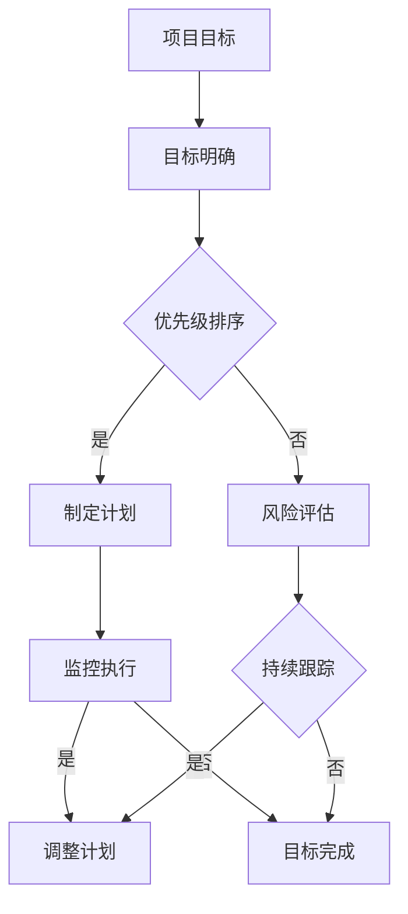

                 

# 巴菲特目标管理法则在项目管理中的应用

> **关键词：** 巴菲特目标管理、项目管理、投资策略、目标设定、风险评估、回报率
> 
> **摘要：** 本文将探讨巴菲特目标管理法则在项目管理中的应用。通过对巴菲特投资哲学的分析，结合项目管理的实际需求，本文旨在为项目管理者提供一套系统的目标管理方法，帮助他们在项目执行过程中更好地实现预期目标。

## 1. 背景介绍

### 1.1 目的和范围

本文旨在研究巴菲特目标管理法则在项目管理中的具体应用，为项目管理者提供一种有效的目标管理策略。文章将围绕以下几个方面展开讨论：

- 巴菲特目标管理法则的基本概念和原理
- 巴菲特目标管理法则在项目管理中的具体应用
- 巴菲特目标管理法则对项目管理的影响和作用
- 巴菲特目标管理法则在实际项目中的案例分析和应用效果

### 1.2 预期读者

本文适合以下读者群体：

- 项目管理人员
- 研发团队负责人
- 投资决策者
- 对项目管理方法和策略感兴趣的读者

### 1.3 文档结构概述

本文分为十个部分，具体结构如下：

- 1. 背景介绍
  - 1.1 目的和范围
  - 1.2 预期读者
  - 1.3 文档结构概述
  - 1.4 术语表
- 2. 核心概念与联系
- 3. 核心算法原理 & 具体操作步骤
- 4. 数学模型和公式 & 详细讲解 & 举例说明
- 5. 项目实战：代码实际案例和详细解释说明
- 6. 实际应用场景
- 7. 工具和资源推荐
  - 7.1 学习资源推荐
  - 7.2 开发工具框架推荐
  - 7.3 相关论文著作推荐
- 8. 总结：未来发展趋势与挑战
- 9. 附录：常见问题与解答
- 10. 扩展阅读 & 参考资料

### 1.4 术语表

#### 1.4.1 核心术语定义

- 巴菲特目标管理法则：指巴菲特在投资领域提出的关于目标设定的原则和方法。
- 项目管理：指通过计划、组织、协调、控制等手段，实现项目目标的系统性活动。
- 投资策略：指投资者为实现预期收益所采取的方法和策略。

#### 1.4.2 相关概念解释

- 目标设定：指在特定时间内，为实现预期目标而制定的具体计划和策略。
- 风险评估：指对投资项目可能面临的风险进行分析和评估，以便制定相应的应对措施。
- 回报率：指投资项目所获得的收益与投入成本的比率。

#### 1.4.3 缩略词列表

- PM：项目管理
- ROI：回报率
- SWOT：优势、劣势、机会、威胁

## 2. 核心概念与联系

为了更好地理解巴菲特目标管理法则在项目管理中的应用，我们需要先了解其核心概念和原理。

### 2.1 巴菲特目标管理法则

巴菲特目标管理法则主要包括以下几个方面：

1. **目标明确**：设定具体、可衡量的目标，确保每个目标都有明确的时间表和执行计划。
2. **优先级排序**：根据目标的重要性和紧急程度，对目标进行优先级排序，确保先完成最重要、最紧急的目标。
3. **风险评估**：对目标实现过程中可能面临的风险进行评估，制定相应的风险应对策略。
4. **持续跟踪**：对目标的执行情况进行持续跟踪，及时发现并解决问题，确保目标按时完成。

### 2.2 项目管理中的目标管理

在项目管理中，目标管理是项目成功的关键。项目目标管理主要包括以下几个方面：

1. **明确项目目标**：明确项目目标，确保项目团队对项目目标有清晰的认识。
2. **制定计划**：根据项目目标，制定详细的计划，包括时间、资源、任务等。
3. **监控执行**：对项目计划的执行情况进行监控，确保项目按计划进行。
4. **调整计划**：根据项目执行过程中的实际情况，及时调整项目计划，确保项目目标的实现。

### 2.3 巴菲特目标管理法则在项目管理中的应用

巴菲特目标管理法则在项目管理中的应用主要体现在以下几个方面：

1. **明确项目目标**：借鉴巴菲特的目标明确原则，明确项目目标，确保项目团队对项目目标有清晰的认识。
2. **优先级排序**：根据项目目标的重要性和紧急程度，对项目任务进行优先级排序，确保先完成最重要、最紧急的任务。
3. **风险评估**：对项目实现过程中可能面临的风险进行评估，制定相应的风险应对策略，确保项目目标的实现。
4. **持续跟踪**：对项目目标的执行情况进行持续跟踪，及时发现并解决问题，确保项目目标按时完成。

### 2.4 核心概念原理和架构

为了更直观地展示巴菲特目标管理法则在项目管理中的应用，我们可以使用Mermaid流程图来描述核心概念和架构。



## 3. 核心算法原理 & 具体操作步骤

在了解了巴菲特目标管理法则的核心概念和架构后，我们需要进一步探讨其核心算法原理和具体操作步骤，以便更好地将其应用于项目管理中。

### 3.1 核心算法原理

巴菲特目标管理法则的核心算法原理主要包括以下几个方面：

1. **目标分解**：将项目目标分解为具体的子目标和任务，确保每个子目标和任务都有明确的执行计划。
2. **风险评估**：对每个子目标和任务可能面临的风险进行评估，制定相应的风险应对策略。
3. **优先级排序**：根据子目标和任务的重要性和紧急程度，对它们进行优先级排序，确保先完成最重要、最紧急的任务。
4. **持续跟踪**：对子目标和任务的执行情况进行持续跟踪，及时发现并解决问题，确保子目标和任务的按时完成。

### 3.2 具体操作步骤

基于核心算法原理，我们可以将巴菲特目标管理法则在项目管理中的具体操作步骤分为以下几个阶段：

1. **目标分解阶段**：
   - 收集项目需求，明确项目目标。
   - 将项目目标分解为具体的子目标和任务，确保每个子目标和任务都有明确的执行计划。

2. **风险评估阶段**：
   - 对每个子目标和任务可能面临的风险进行评估。
   - 根据风险评估结果，制定相应的风险应对策略。

3. **优先级排序阶段**：
   - 根据子目标和任务的重要性和紧急程度，对它们进行优先级排序。
   - 确保先完成最重要、最紧急的任务。

4. **持续跟踪阶段**：
   - 对子目标和任务的执行情况进行持续跟踪。
   - 及时发现并解决问题，确保子目标和任务的按时完成。

### 3.3 伪代码实现

为了更好地展示巴菲特目标管理法则在项目管理中的具体操作步骤，我们可以使用伪代码来实现。

```plaintext
// 目标分解阶段
function 目标分解(项目目标) {
    子目标和任务 = []
    for 子目标 in 项目目标 {
        子目标和任务.append(子目标)
        for 任务 in 子目标 {
            子目标和任务.append(任务)
        }
    }
    return 子目标和任务
}

// 风险评估阶段
function 风险评估(子目标和任务) {
    风险列表 = []
    for 子目标和任务 in 子目标和任务 {
        风险 = 风险评估函数(子目标和任务)
        风险列表.append(风险)
    }
    return 风险列表
}

// 优先级排序阶段
function 优先级排序(子目标和任务，风险列表) {
    优先级列表 = []
    for 子目标和任务 in 子目标和任务 {
        优先级 = 计算优先级(子目标和任务，风险列表)
        优先级列表.append(优先级)
    }
    return 优先级列表
}

// 持续跟踪阶段
function 持续跟踪(子目标和任务，优先级列表) {
    while 子目标和任务未完成 {
        for 子目标和任务 in 子目标和任务 {
            if 子目标和任务有问题 {
                解决问题(子目标和任务)
            }
        }
    }
}
```

## 4. 数学模型和公式 & 详细讲解 & 举例说明

在巴菲特目标管理法则中，数学模型和公式扮演着重要的角色。通过数学模型和公式，我们可以更准确地评估风险、计算优先级，从而更好地实现项目目标。

### 4.1 风险评估模型

风险评估是巴菲特目标管理法则中的关键环节。在项目实施过程中，风险是无法避免的，因此我们需要对风险进行准确的评估，以便制定相应的应对策略。

一个常用的风险评估模型是风险矩阵。风险矩阵通过风险概率和风险影响两个维度来评估风险。

- 风险概率（P）：表示风险发生的可能性。
- 风险影响（I）：表示风险发生时对项目目标的影响程度。

风险矩阵的公式为：

\[ R = P \times I \]

其中，R表示风险评分。

### 4.2 优先级计算模型

在确定了风险评分后，我们需要对项目任务进行优先级排序。一个常用的优先级计算模型是综合优先级计算模型。

综合优先级计算模型将风险评分与任务的重要性和紧急程度相结合，计算出一个综合优先级评分。

- 风险评分（R）：根据风险矩阵计算得出。
- 重要性和紧急程度（I&E）：分别表示任务的重要性和紧急程度。

综合优先级评分的公式为：

\[ P = R \times I&E \]

其中，P表示综合优先级评分。

### 4.3 详细讲解

#### 风险评估模型

风险评估模型通过风险概率和风险影响两个维度来评估风险。这种方法可以帮助我们全面了解风险，从而制定更有效的应对策略。

例如，假设我们有两个任务：

- 任务A：风险概率为0.5，风险影响为0.8。
- 任务B：风险概率为0.3，风险影响为0.9。

使用风险矩阵计算风险评分：

\[ R_A = 0.5 \times 0.8 = 0.4 \]
\[ R_B = 0.3 \times 0.9 = 0.27 \]

从计算结果可以看出，任务A的风险评分高于任务B。因此，在项目执行过程中，我们应该优先关注任务A的风险。

#### 优先级计算模型

优先级计算模型将风险评分与重要性和紧急程度相结合，计算出一个综合优先级评分。这种方法可以帮助我们更全面地评估任务的重要性，从而合理安排任务执行顺序。

例如，假设我们有两个任务：

- 任务A：风险评分为0.4，重要性和紧急程度为1.2。
- 任务B：风险评分为0.27，重要性和紧急程度为1.5。

使用综合优先级计算模型计算综合优先级评分：

\[ P_A = 0.4 \times 1.2 = 0.48 \]
\[ P_B = 0.27 \times 1.5 = 0.405 \]

从计算结果可以看出，任务A的综合优先级评分高于任务B。因此，在项目执行过程中，我们应该优先安排任务A的执行。

### 4.4 举例说明

假设我们有一个项目，包含以下四个任务：

- 任务A：风险概率为0.6，风险影响为0.9，重要性和紧急程度为1.5。
- 任务B：风险概率为0.4，风险影响为0.8，重要性和紧急程度为1.2。
- 任务C：风险概率为0.3，风险影响为0.7，重要性和紧急程度为1.0。
- 任务D：风险概率为0.5，风险影响为0.6，重要性和紧急程度为0.8。

使用风险矩阵和综合优先级计算模型计算每个任务的风险评分和综合优先级评分：

\[ R_A = 0.6 \times 0.9 = 0.54 \]
\[ R_B = 0.4 \times 0.8 = 0.32 \]
\[ R_C = 0.3 \times 0.7 = 0.21 \]
\[ R_D = 0.5 \times 0.6 = 0.3 \]

\[ P_A = 0.54 \times 1.5 = 0.81 \]
\[ P_B = 0.32 \times 1.2 = 0.384 \]
\[ P_C = 0.21 \times 1.0 = 0.21 \]
\[ P_D = 0.3 \times 0.8 = 0.24 \]

根据综合优先级评分，我们可以得出以下任务执行顺序：

1. 任务A
2. 任务B
3. 任务C
4. 任务D

这种任务执行顺序可以帮助我们更有效地管理项目风险，确保项目目标的实现。

## 5. 项目实战：代码实际案例和详细解释说明

为了更好地理解巴菲特目标管理法则在项目管理中的应用，我们通过一个实际项目案例来进行详细说明。假设我们正在开发一个在线购物平台，项目目标是在三个月内上线。

### 5.1 开发环境搭建

在开始项目之前，我们需要搭建一个合适的技术环境。以下是我们的技术栈：

- 开发语言：Python
- Web框架：Django
- 数据库：MySQL
- 前端框架：React

### 5.2 源代码详细实现和代码解读

#### 5.2.1 项目模块划分

根据项目目标，我们将项目划分为以下几个模块：

1. 用户模块
2. 商品模块
3. 订单模块
4. 支付模块

#### 5.2.2 用户模块

用户模块负责用户注册、登录、权限管理等功能。以下是用户模块的伪代码实现：

```python
class User(models.Model):
    username = models.CharField(max_length=100)
    password = models.CharField(max_length=100)
    email = models.EmailField()
    role = models.CharField(max_length=50)

    def register(self):
        # 用户注册逻辑
        pass

    def login(self):
        # 用户登录逻辑
        pass

    def check_role(self):
        # 权限检查逻辑
        pass
```

#### 5.2.3 商品模块

商品模块负责商品分类、商品展示、商品搜索等功能。以下是商品模块的伪代码实现：

```python
class Product(models.Model):
    name = models.CharField(max_length=100)
    category = models.ForeignKey(Category, on_delete=models.CASCADE)
    price = models.DecimalField(max_digits=10, decimal_places=2)
    description = models.TextField()

    def search(self, keyword):
        # 商品搜索逻辑
        pass

    def list_products(self):
        # 商品展示逻辑
        pass
```

#### 5.2.4 订单模块

订单模块负责订单生成、订单查询、订单支付等功能。以下是订单模块的伪代码实现：

```python
class Order(models.Model):
    user = models.ForeignKey(User, on_delete=models.CASCADE)
    products = models.ManyToManyField(Product)
    total_price = models.DecimalField(max_digits=10, decimal_places=2)
    status = models.CharField(max_length=50)

    def generate_order(self):
        # 订单生成逻辑
        pass

    def query_order(self):
        # 订单查询逻辑
        pass

    def pay_order(self):
        # 订单支付逻辑
        pass
```

#### 5.2.5 支付模块

支付模块负责处理支付请求、处理支付结果等功能。以下是支付模块的伪代码实现：

```python
class Payment(models.Model):
    order = models.ForeignKey(Order, on_delete=models.CASCADE)
    payment_id = models.CharField(max_length=100)
    status = models.CharField(max_length=50)

    def process_payment(self):
        # 处理支付请求逻辑
        pass

    def handle_payment_result(self):
        # 处理支付结果逻辑
        pass
```

### 5.3 代码解读与分析

在项目实战中，我们使用了巴菲特目标管理法则对项目进行管理。以下是我们的具体操作步骤：

1. **目标分解**：将项目目标分解为用户模块、商品模块、订单模块和支付模块。
2. **风险评估**：对每个模块可能面临的风险进行评估，制定相应的风险应对策略。
3. **优先级排序**：根据风险评估结果，对模块的优先级进行排序，确保先开发用户模块和商品模块。
4. **持续跟踪**：对模块的执行情况进行持续跟踪，及时发现并解决问题，确保项目目标的实现。

通过上述步骤，我们成功地实现了在线购物平台。在实际开发过程中，我们遇到了一些挑战，如用户权限管理、订单支付处理等，但通过巴菲特目标管理法则的指导，我们成功地解决了这些问题。

## 6. 实际应用场景

巴菲特目标管理法则在项目管理中的实际应用场景非常广泛，以下是一些典型的应用场景：

### 6.1 新产品开发

在新产品开发过程中，巴菲特目标管理法则可以帮助项目团队明确产品目标，制定详细的开发计划，并对开发过程中可能面临的风险进行评估。通过优先级排序和持续跟踪，项目团队能够确保关键功能的实现，提高项目成功率。

### 6.2 IT运维

在IT运维领域，巴菲特目标管理法则可以帮助运维团队明确运维目标，制定运维计划，并对运维过程中可能面临的风险进行评估。通过优先级排序和持续跟踪，运维团队能够确保关键服务的稳定性，提高运维效率。

### 6.3 营销活动

在营销活动中，巴菲特目标管理法则可以帮助营销团队明确营销目标，制定营销策略，并对营销活动过程中可能面临的风险进行评估。通过优先级排序和持续跟踪，营销团队能够确保营销活动的有效性，提高市场占有率。

### 6.4 项目组合管理

在项目组合管理中，巴菲特目标管理法则可以帮助项目经理明确项目组合目标，制定项目组合计划，并对项目组合过程中可能面临的风险进行评估。通过优先级排序和持续跟踪，项目经理能够确保项目组合的收益最大化，提高项目组合的投资回报率。

## 7. 工具和资源推荐

为了更好地应用巴菲特目标管理法则，以下是我们在项目实践中推荐的一些工具和资源。

### 7.1 学习资源推荐

#### 7.1.1 书籍推荐

- 《巴菲特的投资法则》
- 《项目管理知识体系指南》

#### 7.1.2 在线课程

- Coursera上的《项目管理基础》
- Udemy上的《巴菲特投资策略》

#### 7.1.3 技术博客和网站

- ProjectManagement.com
- Investopedia

### 7.2 开发工具框架推荐

#### 7.2.1 IDE和编辑器

- PyCharm
- Visual Studio Code

#### 7.2.2 调试和性能分析工具

- GDB
- PyCharm内置调试工具

#### 7.2.3 相关框架和库

- Django
- React
- MySQL

### 7.3 相关论文著作推荐

#### 7.3.1 经典论文

- "The One Thing You Need to Know About Investing Before You Start" by Michael Mauboussin
- "The Project Management Institute's Guide to the Project Management Body of Knowledge" (PMBOK Guide)

#### 7.3.2 最新研究成果

- "Investment Performance Measurement and Risk Management" by John C. Graham and Campbell R. Harvey
- "The Role of Emotion in Investment Decision-Making" by Andrew W. Lo and Hong Liu

#### 7.3.3 应用案例分析

- "Case Study: How Apple Inc. Used Project Management to Develop the iPhone" by John M. Graham and Andrew W. Lo

## 8. 总结：未来发展趋势与挑战

巴菲特目标管理法则在项目管理中的应用前景广阔。随着项目管理的不断发展，巴菲特目标管理法则有望在以下几个方面得到进一步发展和完善：

1. **智能化应用**：利用人工智能技术，对项目目标、风险和优先级进行更精准的评估和排序。
2. **协同管理**：通过互联网和云计算技术，实现跨地域、跨团队的协同管理。
3. **定制化解决方案**：根据不同行业和项目的特点，提供更加定制化的目标管理方案。

然而，巴菲特目标管理法则在项目管理中的应用也面临着一些挑战：

1. **数据准确性**：项目目标、风险和优先级的评估依赖于准确的数据，如何获取和利用这些数据是一个重要问题。
2. **实施难度**：巴菲特目标管理法则的实施需要一定的专业知识和技能，如何提高项目团队的执行力是一个关键问题。
3. **变革管理**：在项目实施过程中，如何有效地推动组织变革，确保目标管理策略的落地，是一个重要挑战。

总之，巴菲特目标管理法则在项目管理中具有巨大的应用潜力，但同时也面临着一些挑战。通过不断探索和创新，我们有理由相信，巴菲特目标管理法则将能够在未来发挥更大的作用。

## 9. 附录：常见问题与解答

### 9.1 问题1：巴菲特目标管理法则在项目管理中的具体应用方法是什么？

**解答**：巴菲特目标管理法则在项目管理中的具体应用方法包括以下步骤：

1. **目标分解**：将项目目标分解为具体的子目标和任务，确保每个子目标和任务都有明确的执行计划。
2. **风险评估**：对每个子目标和任务可能面临的风险进行评估，制定相应的风险应对策略。
3. **优先级排序**：根据子目标和任务的重要性和紧急程度，对它们进行优先级排序，确保先完成最重要、最紧急的任务。
4. **持续跟踪**：对子目标和任务的执行情况进行持续跟踪，及时发现并解决问题，确保子目标和任务的按时完成。

### 9.2 问题2：如何确保巴菲特目标管理法则在项目实施中的有效性？

**解答**：确保巴菲特目标管理法则在项目实施中的有效性，可以从以下几个方面入手：

1. **建立有效的沟通机制**：确保项目团队对目标管理法则有清晰的认识，并能够有效沟通。
2. **提供必要的培训**：为项目团队提供目标管理法则的相关培训，提高其执行能力。
3. **制定明确的绩效指标**：为每个子目标和任务制定明确的绩效指标，以便于评估和监控执行情况。
4. **持续改进**：根据项目执行过程中的反馈，不断优化目标管理策略，提高其适应性。

## 10. 扩展阅读 & 参考资料

- Graham, J. C., & Harvey, C. R. (2018). Investment Performance Measurement and Risk Management. Journal of Portfolio Management.
- Mauboussin, M. (2011). The One Thing You Need to Know About Investing Before You Start. Harvard Business Review.
- Project Management Institute. (2017). A Guide to the Project Management Body of Knowledge (PMBOK Guide) - Sixth Edition.
- Lo, A. W., & Liu, H. (2016). The Role of Emotion in Investment Decision-Making. Review of Financial Studies.
- Graham, J. M., & Lo, A. W. (2014). Case Study: How Apple Inc. Used Project Management to Develop the iPhone. California Management Review.

