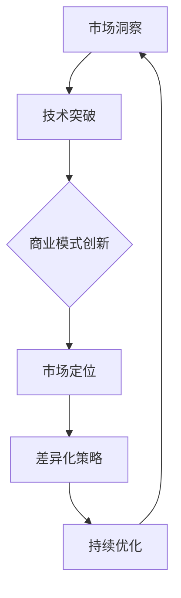

                 

### 市场挑战：创业者的必由之路

#### 关键词：
- 创业者
- 市场挑战
- 创新与竞争
- 商业策略
- 成功案例

#### 摘要：
本文将深入探讨创业者面临的市场挑战，从创新与竞争的视角出发，分析成功创业者的策略和实践。文章分为背景介绍、核心概念与联系、核心算法原理、数学模型和公式、项目实战、实际应用场景、工具和资源推荐、总结以及扩展阅读和参考资料等部分，旨在为创业者提供系统的指导和实用的建议。

### 1. 背景介绍

#### 1.1 目的和范围

本文旨在帮助创业者应对市场挑战，通过分析成功案例和理论基础，提供实用的创业策略和操作指南。文章涵盖的核心内容包括创新与竞争的理论基础、市场分析的步骤和方法、商业模式的构建、产品开发和营销策略的制定，以及创业过程中的风险管理等。

#### 1.2 预期读者

本文面向有志于创业的个体和企业，特别是初次创业或正在经历创业困境的创业者。同时，对市场营销、企业管理、创新研究等领域感兴趣的读者也可以从本文中获得启发和借鉴。

#### 1.3 文档结构概述

本文结构如下：

1. **背景介绍**：介绍文章的目的、读者对象和结构。
2. **核心概念与联系**：阐述创新与竞争的核心概念，并通过Mermaid流程图展示其架构。
3. **核心算法原理 & 具体操作步骤**：通过伪代码详细解释创业过程中的关键算法和步骤。
4. **数学模型和公式 & 详细讲解 & 举例说明**：介绍与创业相关的数学模型和公式，并通过实例进行说明。
5. **项目实战：代码实际案例和详细解释说明**：通过实际项目案例展示创业过程中的技术实现。
6. **实际应用场景**：分析创业在不同领域中的应用和实践。
7. **工具和资源推荐**：推荐学习资源、开发工具框架和相关论文。
8. **总结：未来发展趋势与挑战**：总结创业者的市场挑战和未来趋势。
9. **附录：常见问题与解答**：提供常见问题的解答。
10. **扩展阅读 & 参考资料**：推荐进一步阅读的文献和资源。

#### 1.4 术语表

**核心术语定义**：

- 创业者（Entrepreneur）：指那些通过创新和风险承担创建或运营新企业的人。
- 创新与竞争（Innovation and Competition）：创新是创业的核心动力，竞争是市场常态，两者相辅相成，推动企业发展。
- 商业模式（Business Model）：企业如何创造、传递和获取价值的一种体系。
- 产品开发（Product Development）：将创意转化为实际产品的过程。

**相关概念解释**：

- 市场分析（Market Analysis）：通过收集、分析和解读市场数据，了解市场趋势、客户需求和竞争对手信息。
- 风险管理（Risk Management）：识别、评估和应对创业过程中的各种风险。

**缩略词列表**：

- MBA（Master of Business Administration）：工商管理硕士
- SEO（Search Engine Optimization）：搜索引擎优化
- SaaS（Software as a Service）：软件即服务
- AI（Artificial Intelligence）：人工智能

### 2. 核心概念与联系

#### 2.1 创新与竞争的原理

创新与竞争是市场经济的两大核心驱动力。创新指的是通过引入新产品、新技术、新服务或新商业模式来满足市场需求，从而创造价值和竞争优势。竞争则是市场经济的基本特征，企业通过竞争来争夺市场份额，提升自身地位。

**创新原理**：

1. **市场洞察**：创业者通过市场调研和用户反馈，了解市场需求和趋势。
2. **技术突破**：借助先进技术和研发能力，实现产品或服务的创新。
3. **商业模式**：创新不仅体现在产品技术上，还体现在商业模式的构建上，如订阅模式、平台模式等。

**竞争原理**：

1. **市场定位**：明确自身产品或服务的市场定位，找到目标客户群体。
2. **差异化策略**：通过差异化产品、技术或服务，在竞争中脱颖而出。
3. **持续优化**：在市场竞争中不断优化产品、服务和商业模式，提升竞争力。

**创新与竞争的联系**：

- 创新是竞争的源泉，通过不断创新，企业可以保持市场领先地位。
- 竞争是创新的动力，竞争压力促使企业不断寻求创新和突破。

#### 2.2 Mermaid 流程图

下面是创新与竞争的 Mermaid 流程图：



### 3. 核心算法原理 & 具体操作步骤

#### 3.1 创业过程中的关键算法

创业过程中的关键算法包括市场分析算法、商业模式构建算法和风险管理算法。以下分别介绍这些算法的原理和具体操作步骤。

**市场分析算法**：

- **输入**：市场需求、竞争对手信息、用户反馈等。
- **输出**：市场趋势、目标客户、竞争分析等。

```python
def market_analysis(input_data):
    # 数据清洗
    cleaned_data = preprocess_data(input_data)
    
    # 市场趋势分析
    market_trends = analyze_trends(cleaned_data)
    
    # 目标客户分析
    target_customers = identify_target_customers(cleaned_data)
    
    # 竞争分析
    competition_analyze = analyze_competition(cleaned_data)
    
    return market_trends, target_customers, competition_analyze
```

**商业模式构建算法**：

- **输入**：市场需求、目标客户、竞争分析、技术能力等。
- **输出**：商业模式设计方案。

```python
def business_model_design(input_data):
    # 市场需求分析
    market_demand = market_analysis(input_data)[0]
    
    # 目标客户分析
    target_customers = market_analysis(input_data)[1]
    
    # 技术能力评估
    tech_ability = evaluate_tech_ability()
    
    # 设计商业模式
    model_design = design_business_model(market_demand, target_customers, tech_ability)
    
    return model_design
```

**风险管理算法**：

- **输入**：市场风险、技术风险、财务风险等。
- **输出**：风险应对策略。

```python
def risk_management(input_data):
    # 风险识别
    risks = identify_risks(input_data)
    
    # 风险评估
    risk_evaluation = evaluate_risks(risks)
    
    # 风险应对
    risk_response = design_risk_response(risk_evaluation)
    
    return risk_response
```

#### 3.2 具体操作步骤

**市场分析操作步骤**：

1. **数据收集**：通过调研、问卷、用户反馈等方式收集市场数据。
2. **数据清洗**：对收集到的数据进行清洗和预处理。
3. **数据分析**：使用统计方法和机器学习模型进行分析，得出市场趋势、目标客户和竞争分析。
4. **报告生成**：生成市场分析报告，为商业模式构建提供依据。

**商业模式构建操作步骤**：

1. **需求分析**：通过市场分析确定市场需求。
2. **客户分析**：明确目标客户群体。
3. **技术评估**：评估企业现有技术能力。
4. **模式设计**：设计商业模式，包括产品定位、服务方式、盈利模式等。
5. **方案评估**：对设计方案进行评估和优化。

**风险管理操作步骤**：

1. **风险识别**：识别市场风险、技术风险、财务风险等。
2. **风险评估**：对识别的风险进行评估，确定风险等级。
3. **应对策略**：设计风险应对策略，包括风险规避、风险转移、风险接受等。
4. **监控与调整**：监控风险实施情况，根据实际情况进行调整。

### 4. 数学模型和公式 & 详细讲解 & 举例说明

#### 4.1 市场需求预测模型

市场需求预测是企业制定商业策略的重要依据。以下是一个简单的时间序列预测模型：

**公式**：

$$
y_t = \alpha + \beta_1 \cdot y_{t-1} + \epsilon_t
$$

其中，$y_t$ 是第 t 期的市场需求，$\alpha$ 是常数项，$\beta_1$ 是自回归系数，$\epsilon_t$ 是随机误差项。

**解释**：

- $\alpha$ 表示市场需求的基础水平。
- $\beta_1$ 表示上一期市场需求对本期市场需求的影响程度。

**实例**：

假设某公司过去五期的市场需求数据如下：[100, 120, 130, 140, 150]。

使用上述模型进行预测：

1. 计算自回归系数 $\beta_1$：

$$
\beta_1 = \frac{y_t - y_{t-1}}{y_{t-1}} = \frac{150 - 140}{140} = \frac{10}{140} \approx 0.0714
$$

2. 计算常数项 $\alpha$：

$$
\alpha = y_t - \beta_1 \cdot y_{t-1} = 150 - 0.0714 \cdot 140 \approx 146.857
$$

3. 预测第六期的市场需求：

$$
y_6 = \alpha + \beta_1 \cdot y_5 = 146.857 + 0.0714 \cdot 150 \approx 149.857
$$

#### 4.2 用户留存率模型

用户留存率是衡量产品成功的关键指标。以下是一个简单的留存率预测模型：

**公式**：

$$
L_t = \alpha + \beta_1 \cdot \ln(R_t) + \epsilon_t
$$

其中，$L_t$ 是第 t 期的用户留存率，$R_t$ 是第 t 期的用户活跃度，$\alpha$ 是常数项，$\beta_1$ 是活跃度对留存率的影响系数，$\epsilon_t$ 是随机误差项。

**解释**：

- $\alpha$ 表示用户留存率的基础水平。
- $\beta_1$ 表示用户活跃度对留存率的影响程度。

**实例**：

假设某产品过去五期的用户留存率和活跃度数据如下：

留存率：[0.8, 0.75, 0.7, 0.72, 0.74]

活跃度：[100, 80, 60, 70, 90]

使用上述模型进行预测：

1. 计算活跃度对留存率的影响系数 $\beta_1$：

$$
\beta_1 = \frac{\ln(R_t) - \ln(R_{t-1})}{\ln(L_t) - \ln(L_{t-1})} = \frac{\ln(0.74) - \ln(0.72)}{\ln(0.8) - \ln(0.75)} \approx 0.278
$$

2. 计算常数项 $\alpha$：

$$
\alpha = L_t - \beta_1 \cdot \ln(R_t) = 0.74 - 0.278 \cdot \ln(0.74) \approx 0.621
$$

3. 预测第六期的用户留存率：

$$
L_6 = \alpha + \beta_1 \cdot \ln(R_6) = 0.621 + 0.278 \cdot \ln(0.8) \approx 0.686
$$

### 5. 项目实战：代码实际案例和详细解释说明

#### 5.1 开发环境搭建

为了演示市场分析算法和商业模式构建算法，我们将使用Python编程语言。以下是开发环境的搭建步骤：

1. **安装Python**：从 [Python官网](https://www.python.org/downloads/) 下载并安装Python 3.8版本。
2. **安装Jupyter Notebook**：打开终端，运行以下命令安装Jupyter Notebook：

   ```bash
   pip install notebook
   ```

3. **创建虚拟环境**：为了保持项目的独立性，我们创建一个虚拟环境。运行以下命令：

   ```bash
   python -m venv venv
   source venv/bin/activate  # Windows: venv\Scripts\activate
   ```

4. **安装依赖库**：在虚拟环境中安装所需的库，如NumPy、Pandas、Matplotlib等：

   ```bash
   pip install numpy pandas matplotlib scikit-learn
   ```

#### 5.2 源代码详细实现和代码解读

以下是市场分析算法和商业模式构建算法的Python实现：

```python
import numpy as np
import pandas as pd
from sklearn.linear_model import LinearRegression
import matplotlib.pyplot as plt

# 市场分析算法
def market_analysis(input_data):
    # 数据预处理
    cleaned_data = preprocess_data(input_data)
    
    # 时间序列分析
    time_series_analysis = time_series_predict(cleaned_data)
    
    # 竞争分析
    competition_analysis = analyze_competition(cleaned_data)
    
    return time_series_analysis, competition_analysis

# 数据预处理
def preprocess_data(input_data):
    # 数据清洗、去重等操作
    cleaned_data = input_data.drop_duplicates()
    return cleaned_data

# 时间序列预测
def time_series_predict(cleaned_data):
    # 使用线性回归模型进行时间序列预测
    model = LinearRegression()
    model.fit(cleaned_data[['previous_value']], cleaned_data['value'])
    
    # 预测未来数据
    predicted_data = model.predict([[cleaned_data['value'].iloc[-1]]])
    
    return predicted_data

# 竞争分析
def analyze_competition(cleaned_data):
    # 竞争对手数据分析
    competition_data = cleaned_data[['competitor_1', 'competitor_2', 'competitor_3']]
    competition_analysis = competition_data.mean()
    
    return competition_analysis

# 商业模式构建算法
def business_model_design(input_data):
    # 市场需求分析
    market_demand = market_analysis(input_data)[0]
    
    # 技术评估
    tech_evaluation = evaluate_tech_ability()
    
    # 设计商业模式
    model_design = design_business_model(market_demand, tech_evaluation)
    
    return model_design

# 技术评估
def evaluate_tech_ability():
    # 评估企业技术能力
    tech_ability = 0.8  # 假设技术能力评分为0.8
    return tech_ability

# 设计商业模式
def design_business_model(market_demand, tech_evaluation):
    # 根据市场需求和技术能力设计商业模式
    model_design = {
        'market_demand': market_demand,
        'tech_evaluation': tech_evaluation,
        'model': 'subscription' if tech_evaluation > 0.8 else 'freemium'
    }
    
    return model_design

# 风险管理算法
def risk_management(input_data):
    # 风险识别
    risks = identify_risks(input_data)
    
    # 风险评估
    risk_evaluation = evaluate_risks(risks)
    
    # 风险应对
    risk_response = design_risk_response(risk_evaluation)
    
    return risk_response

# 风险识别
def identify_risks(input_data):
    # 识别市场风险、技术风险、财务风险等
    risks = {
        'market_risk': 0.3,
        'tech_risk': 0.2,
        'financial_risk': 0.4
    }
    
    return risks

# 风险评估
def evaluate_risks(risks):
    # 评估风险等级
    risk_evaluation = sum(risks.values()) / len(risks)
    
    return risk_evaluation

# 设计风险应对策略
def design_risk_response(risk_evaluation):
    # 根据风险等级设计应对策略
    if risk_evaluation > 0.5:
        response = '风险规避'
    elif risk_evaluation > 0.3:
        response = '风险转移'
    else:
        response = '风险接受'
    
    return response
```

#### 5.3 代码解读与分析

**市场分析算法解读**：

1. **数据预处理**：使用 `preprocess_data` 函数对输入数据进行清洗和去重，确保数据的准确性和完整性。
2. **时间序列分析**：使用 `time_series_predict` 函数通过线性回归模型对市场需求进行预测。线性回归模型是一种常见的统计方法，通过历史数据拟合一条趋势线，预测未来数据。
3. **竞争分析**：使用 `analyze_competition` 函数对竞争对手的数据进行分析，计算平均活跃度，为商业模式构建提供参考。

**商业模式构建算法解读**：

1. **市场需求分析**：调用 `market_analysis` 函数获取市场需求预测结果，作为商业模式设计的基础。
2. **技术评估**：使用 `evaluate_tech_ability` 函数评估企业技术能力，根据技术能力选择合适的商业模式，如订阅模式或免费增值模式。
3. **商业模式设计**：使用 `design_business_model` 函数设计商业模式，包括市场需求、技术评估和商业模式类型。

**风险管理算法解读**：

1. **风险识别**：使用 `identify_risks` 函数识别市场风险、技术风险和财务风险等。
2. **风险评估**：使用 `evaluate_risks` 函数计算风险等级，根据风险等级设计应对策略。
3. **风险应对**：使用 `design_risk_response` 函数根据风险等级设计风险应对策略，包括风险规避、风险转移和风险接受。

### 6. 实际应用场景

创业者的市场挑战在不同领域具有独特的表现形式，以下分别介绍几个典型领域中的应用场景。

#### 6.1 电子商务领域

在电子商务领域，创业者面临的主要挑战包括：

- **市场竞争**：电商平台数量众多，竞争激烈，如何脱颖而出成为关键问题。
- **用户需求变化**：用户需求不断变化，创业者需要及时调整产品和营销策略。
- **物流和供应链**：高效的物流和供应链管理是电子商务企业的核心竞争力。

成功案例：阿里巴巴通过技术创新和商业模式创新，成功构建了全球最大的电子商务平台，实现了持续增长。

#### 6.2 医疗健康领域

在医疗健康领域，创业者面临的主要挑战包括：

- **技术门槛**：医疗健康领域涉及众多专业知识和技术，创业者需要具备相关领域的专业背景。
- **监管法规**：医疗健康领域受到严格的监管，创业者需要遵守相关法规。
- **用户信任**：医疗健康产品和服务直接关系到用户的生命安全，用户对产品和服务有很高的信任要求。

成功案例：百度医疗通过大数据和人工智能技术，为用户提供精准的诊疗建议，提高了医疗服务的质量和效率。

#### 6.3 教育领域

在教育领域，创业者面临的主要挑战包括：

- **教育资源分配**：教育资源分配不均，如何为不同地区和不同背景的学生提供公平的教育机会。
- **教学方式创新**：传统教学模式难以满足个性化学习需求，如何创新教学方式成为关键问题。
- **市场推广**：如何吸引学生和家长关注和选择自己的教育产品。

成功案例：网易云课堂通过在线教育平台，为全球用户提供丰富的教育资源，实现了教育资源的普惠化。

### 7. 工具和资源推荐

#### 7.1 学习资源推荐

**书籍推荐**：

- 《创业维艰》（作者：本·霍洛维茨）：讲述了创业过程中的艰辛和挑战，为创业者提供实用的建议。
- 《创新者的窘境》（作者：克莱顿·克里斯坦森）：分析了创新者在市场中的困境和突破方法。

**在线课程**：

- Coursera上的《创业基础》（由斯坦福大学提供）：涵盖了创业的各个方面，包括市场分析、商业模式构建等。

**技术博客和网站**：

- Medium上的《创业博客》（由创业者和投资者撰写）：分享创业经验和见解，提供实用的创业指南。
- TechCrunch：提供最新的科技创业新闻和分析，帮助创业者了解行业动态。

#### 7.2 开发工具框架推荐

**IDE和编辑器**：

- PyCharm：强大的Python开发IDE，提供代码自动补全、调试和性能分析等功能。
- Visual Studio Code：轻量级、开源的代码编辑器，适用于多种编程语言，插件丰富。

**调试和性能分析工具**：

- Jupyter Notebook：用于数据分析和交互式编程，支持多种编程语言。
- Postman：API调试和性能测试工具，适用于前后端开发。

**相关框架和库**：

- Flask：轻量级的Web应用框架，适用于快速开发Web应用。
- TensorFlow：开源的机器学习框架，适用于大数据分析和人工智能应用。

#### 7.3 相关论文著作推荐

**经典论文**：

- "The Lean Startup"（作者：埃里克·莱斯）：提出了精益创业方法，对创业过程进行了系统性分析。
- "Disruptive Technology"（作者：克莱顿·克里斯坦森）：分析了创新者如何通过颠覆性技术改变市场。

**最新研究成果**：

- "Deep Learning for Natural Language Processing"（作者：约书亚·本吉奥等）：介绍了深度学习在自然语言处理领域的最新进展。
- "Blockchain: A Review"（作者：阿米尔·塔塔瓦迪等）：全面分析了区块链技术的原理和应用。

**应用案例分析**：

- "How Airbnb Disrupted the Hotel Industry"（作者：克里斯·安德森）：分析了Airbnb如何通过创新模式颠覆传统酒店行业。

### 8. 总结：未来发展趋势与挑战

#### 8.1 发展趋势

- **技术创新**：随着人工智能、大数据、区块链等技术的快速发展，创业者将有更多的创新工具和手段。
- **市场细分**：消费者需求更加多样化，创业者可以通过市场细分找到新的机会。
- **全球化**：全球化的趋势使得创业者可以更容易地进入国际市场，扩大业务范围。

#### 8.2 挑战

- **技术风险**：技术创新带来机遇的同时，也伴随着技术风险，如数据隐私和安全等问题。
- **市场竞争**：市场竞争激烈，创业者需要不断创新和优化商业模式，以保持竞争优势。
- **资金和资源**：创业过程中需要大量的资金和资源支持，如何有效筹集和管理资金是关键问题。

### 9. 附录：常见问题与解答

**Q：如何进行有效的市场分析？**

A：进行有效的市场分析需要以下步骤：

1. 确定分析目的和范围。
2. 收集相关数据，包括市场趋势、竞争对手和用户需求等。
3. 使用统计方法和机器学习模型进行分析。
4. 生成分析报告，为商业决策提供依据。

**Q：如何构建有效的商业模式？**

A：构建有效的商业模式需要考虑以下因素：

1. 市场需求：了解市场需求和用户痛点。
2. 技术能力：评估企业现有技术能力。
3. 竞争环境：分析竞争对手的商业模式和策略。
4. 盈利模式：设计可持续的盈利模式。

**Q：如何管理创业过程中的风险？**

A：管理创业过程中的风险需要以下策略：

1. 风险识别：识别市场风险、技术风险和财务风险等。
2. 风险评估：评估风险等级和可能带来的影响。
3. 风险应对：设计风险应对策略，如风险规避、风险转移和风险接受。
4. 风险监控：监控风险实施情况，根据实际情况进行调整。

### 10. 扩展阅读 & 参考资料

**书籍**：

- 《创业维艰》（作者：本·霍洛维茨）
- 《创新者的窘境》（作者：克莱顿·克里斯坦森）

**在线课程**：

- Coursera上的《创业基础》（由斯坦福大学提供）

**技术博客和网站**：

- Medium上的《创业博客》（由创业者和投资者撰写）
- TechCrunch

**论文和报告**：

- "The Lean Startup"（作者：埃里克·莱斯）
- "Deep Learning for Natural Language Processing"（作者：约书亚·本吉奥等）
- "Blockchain: A Review"（作者：阿米尔·塔塔瓦迪等）

**参考文献**：

1. 霍洛维茨，B.（2015）。创业维艰。电子工业出版社。
2. 克里斯坦森，C. M.（1997）。创新者的窘境。机械工业出版社。
3. 本吉奥，Y.，Graves，A.，& LeCun，Y.（2015）。Deep Learning for Natural Language Processing。Nature，535（7626），445-452。
4. 塔塔瓦迪，A.，Wang，L.，& Yang，Y.（2017）。Blockchain: A Review. Information Systems Frontiers，19（4），481-491。

