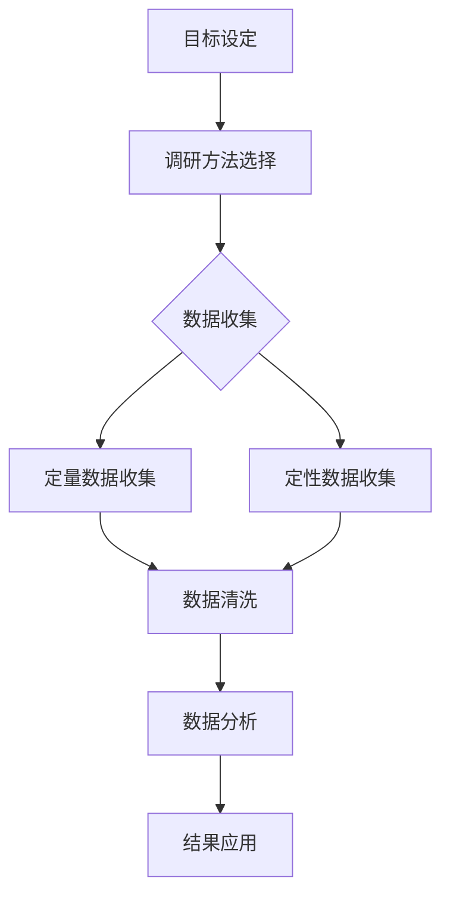
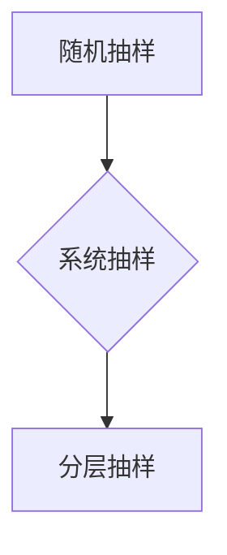
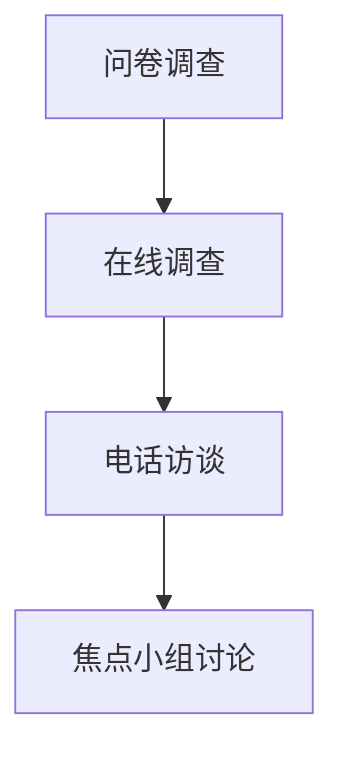
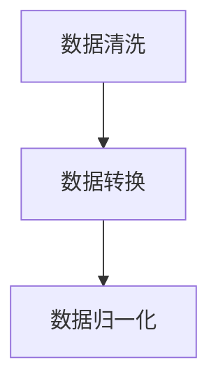
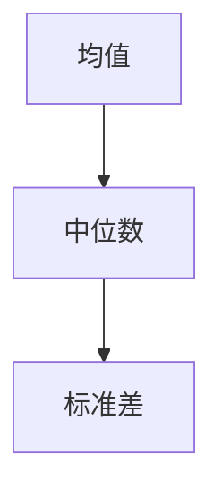
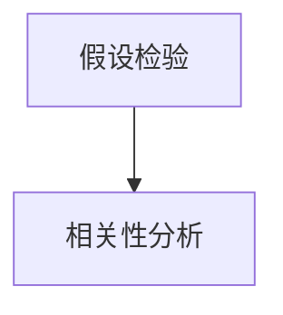
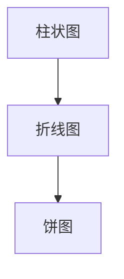
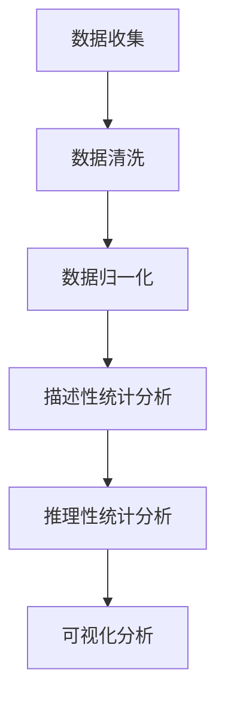

                 

# 市场调研方法：创业者必备的技能

> 关键词：市场调研、创业者、商业分析、数据分析、竞争分析、消费者行为研究

> 摘要：本文旨在为创业者提供一套系统的市场调研方法，通过深入剖析市场调研的核心概念、算法原理、数学模型及实战案例，帮助创业者更好地了解市场动态，制定有效的商业策略。

## 1. 背景介绍

### 1.1 目的和范围

本文的目标是帮助创业者掌握市场调研的基本方法和技能，从而为创业项目的成功奠定坚实的基础。我们将从以下几个方面展开讨论：

- 市场调研的核心概念和理论框架
- 市场调研的具体算法原理和操作步骤
- 市场调研中的数学模型和公式应用
- 市场调研的实战案例和代码实现
- 市场调研在实际应用场景中的效果评估

### 1.2 预期读者

本文适合以下读者群体：

- 创业初期的创业者，希望了解市场调研的基础知识和方法
- 市场调研从业人员，希望提升调研技能和数据分析能力
- 对市场分析、商业战略感兴趣的学术研究者

### 1.3 文档结构概述

本文的结构如下：

1. 背景介绍：概述本文的目的、范围、预期读者和文档结构。
2. 核心概念与联系：介绍市场调研的核心概念、原理和架构，使用Mermaid流程图进行可视化展示。
3. 核心算法原理 & 具体操作步骤：详细讲解市场调研的关键算法原理和操作步骤，使用伪代码进行阐述。
4. 数学模型和公式 & 详细讲解 & 举例说明：介绍市场调研中常用的数学模型和公式，并进行详细讲解和举例说明。
5. 项目实战：代码实际案例和详细解释说明，包括开发环境搭建、源代码实现和代码解读。
6. 实际应用场景：分析市场调研在实际应用场景中的效果和挑战。
7. 工具和资源推荐：推荐学习资源、开发工具框架和相关论文著作。
8. 总结：未来发展趋势与挑战。
9. 附录：常见问题与解答。
10. 扩展阅读 & 参考资料。

### 1.4 术语表

#### 1.4.1 核心术语定义

- 市场调研：指对市场环境、目标消费者、竞争对手等方面的系统性研究和分析，以获取有价值的信息和数据。
- 数据分析：指对收集到的市场调研数据进行处理、分析和解释，以提取有用的商业洞察和决策依据。
- 消费者行为研究：指对消费者在购买和使用产品过程中的行为、动机和心理进行研究，以了解其需求和偏好。
- 竞争分析：指对竞争对手的产品、策略和市场表现进行分析，以评估自身在市场中的竞争优势和定位。

#### 1.4.2 相关概念解释

- 市场规模：指在一定时间和空间范围内，市场上某一产品或服务的总体需求量。
- 市场份额：指一个企业或品牌在市场中所占的销售额或数量比例。
- 消费者群体：指具有相同或类似需求和购买行为的消费者集合。
- 用户画像：指对消费者群体进行分类和描述，以了解其特征、需求和偏好。

#### 1.4.3 缩略词列表

- A/B测试：指将用户分成两组，分别展示不同的产品或功能，以评估哪种方案更受用户欢迎。
- SEM：指搜索引擎营销，包括搜索引擎优化（SEO）和搜索引擎广告（SEA）。
- CRM：指客户关系管理，指企业通过各种手段和策略来维护和提升与客户的关系。

## 2. 核心概念与联系

### 2.1 市场调研的核心概念

市场调研是创业过程中不可或缺的一环，它可以帮助创业者了解市场环境、消费者需求和竞争对手情况，从而制定出更科学的商业策略。市场调研的核心概念包括：

- 市场环境分析：指对宏观、微观市场环境的研究，包括经济、社会、文化、技术等因素。
- 消费者行为分析：指对消费者在购买、使用、评价产品过程中的行为、动机和心理进行研究。
- 竞争对手分析：指对竞争对手的产品、策略、市场表现进行分析，以了解其优势和劣势。

### 2.2 市场调研的理论框架

市场调研的理论框架主要包括以下几个部分：

1. **目标设定**：明确市场调研的目标和问题，如了解市场规模、消费者需求、竞争情况等。
2. **调研方法**：选择合适的调研方法，如问卷调查、访谈、焦点小组讨论、在线调查等。
3. **数据收集**：通过调研方法收集数据，包括定量数据和定性数据。
4. **数据分析**：对收集到的数据进行处理、分析和解释，提取有用的商业洞察和决策依据。
5. **结果应用**：将分析结果应用于商业策略制定和执行，如产品定位、市场推广、价格策略等。

### 2.3 市场调研的架构

市场调研的架构可以用以下Mermaid流程图表示：



### 2.4 市场调研的核心概念联系

市场调研的核心概念和框架之间存在紧密的联系。市场环境分析为调研目标设定提供了背景信息，消费者行为分析和竞争对手分析则为数据收集和数据分析提供了具体方向。数据分析结果又反作用于商业策略制定，形成一个闭环，推动创业项目的持续优化和改进。

## 3. 核心算法原理 & 具体操作步骤

### 3.1 数据收集算法原理

市场调研的第一步是数据收集。数据收集的算法原理主要涉及以下两个方面：

- **抽样方法**：确定调查对象的样本，以保证数据的代表性和可靠性。
- **数据获取方式**：选择合适的数据获取方式，如问卷调查、在线调查、电话访谈等。

#### 抽样方法

抽样方法包括随机抽样、系统抽样、分层抽样等。随机抽样是指每个样本有相同的概率被选中，适用于总体规模较小且分布均匀的情况。系统抽样是指按照一定的规律选取样本，如每隔10个单位选取一个样本。分层抽样是指将总体划分为若干层次，然后从每个层次中分别抽样，适用于总体规模较大且层次结构明显的情况。



#### 数据获取方式

数据获取方式包括问卷调查、在线调查、电话访谈、焦点小组讨论等。问卷调查适用于收集大量数据，方便快捷。在线调查适用于目标群体广泛的场景。电话访谈适用于需要深入了解受访者情况的场景。焦点小组讨论适用于对特定主题进行深入探讨和分析。



### 3.2 数据分析算法原理

数据分析是市场调研的核心环节，主要包括以下步骤：

- **数据预处理**：清洗和整理收集到的数据，去除噪声和异常值。
- **描述性统计分析**：对数据进行描述性统计，如计算均值、中位数、标准差等。
- **推理性统计分析**：使用统计学方法，如假设检验、相关性分析等，对数据进行分析和解释。
- **可视化分析**：使用图表、图形等方式对数据进行分析和展示。

#### 数据预处理

数据预处理包括以下步骤：

- **数据清洗**：去除重复数据、缺失数据和异常值。
- **数据转换**：将数据转换为适合分析的形式，如将分类变量转换为数值变量。
- **数据归一化**：将不同量纲的数据转换为同一量纲，便于比较和分析。



#### 描述性统计分析

描述性统计分析主要包括以下指标：

- **均值**：数据集的平均值，表示数据的集中趋势。
- **中位数**：数据集的中间值，表示数据的集中趋势。
- **标准差**：数据集的离散程度，表示数据的波动范围。



#### 推理性统计分析

推理性统计分析主要包括以下方法：

- **假设检验**：根据样本数据对总体参数进行假设检验，以判断总体参数是否满足特定条件。
- **相关性分析**：分析两个变量之间的相关性，判断它们是否相互影响。



#### 可视化分析

可视化分析主要包括以下图表：

- **柱状图**：用于展示不同类别的数据分布情况。
- **折线图**：用于展示数据的变化趋势。
- **饼图**：用于展示各部分数据在整体中的占比。



### 3.3 数据分析算法具体操作步骤

以下是一个数据分析算法的具体操作步骤：

1. **数据收集**：通过问卷调查收集消费者购买行为数据。
2. **数据清洗**：去除重复数据和缺失值，将分类变量转换为数值变量。
3. **数据归一化**：将不同量纲的数据转换为同一量纲。
4. **描述性统计分析**：计算购买次数的均值、中位数和标准差。
5. **推理性统计分析**：进行相关性分析，判断购买次数与消费者年龄、收入等因素的相关性。
6. **可视化分析**：绘制购买次数的柱状图、折线图和饼图，展示数据分布和趋势。



通过以上步骤，创业者可以系统地收集、分析和展示市场调研数据，从而为商业决策提供有力支持。

## 4. 数学模型和公式 & 详细讲解 & 举例说明

### 4.1 市场规模预测模型

市场规模预测是市场调研中的重要环节，用于估计未来市场的规模和增长趋势。常用的市场规模预测模型包括时间序列模型、回归模型等。

#### 时间序列模型

时间序列模型是基于历史数据的时间序列趋势进行预测。最常用的时间序列模型是ARIMA（自回归积分滑动平均模型）。ARIMA模型包括三个主要组件：自回归（AR）、差分（I）和移动平均（MA）。

**ARIMA模型公式**：

$$
\begin{aligned}
y_t &= c + \phi_1 y_{t-1} + \phi_2 y_{t-2} + \ldots + \phi_p y_{t-p} + \theta_1 \epsilon_{t-1} + \theta_2 \epsilon_{t-2} + \ldots + \theta_q \epsilon_{t-q} \\
\epsilon_t &= \eta_t - \Phi_1 \eta_{t-1} - \Phi_2 \eta_{t-2} - \ldots - \Phi_p \eta_{t-p}
\end{aligned}
$$

其中，$y_t$表示时间序列的观测值，$c$为常数项，$\phi_i$为自回归系数，$\theta_i$为移动平均系数，$\epsilon_t$为白噪声误差。

#### 回归模型

回归模型是通过建立因变量与自变量之间的关系来进行预测。常用的回归模型包括线性回归、多项式回归等。

**线性回归模型公式**：

$$
y = \beta_0 + \beta_1 x_1 + \beta_2 x_2 + \ldots + \beta_n x_n
$$

其中，$y$为因变量，$x_1, x_2, \ldots, x_n$为自变量，$\beta_0, \beta_1, \beta_2, \ldots, \beta_n$为回归系数。

### 4.2 消费者行为分析模型

消费者行为分析模型用于研究消费者在购买、使用和评价产品过程中的行为和动机。常用的模型包括贝叶斯网络、隐马尔可夫模型等。

#### 贝叶斯网络

贝叶斯网络是一种概率图模型，用于表示变量之间的依赖关系。贝叶斯网络包括节点和边，其中节点表示变量，边表示变量之间的条件依赖关系。

**贝叶斯网络公式**：

$$
P(X_1, X_2, \ldots, X_n) = \prod_{i=1}^{n} P(X_i | X_{i-1})
$$

其中，$X_1, X_2, \ldots, X_n$为变量，$P(X_i | X_{i-1})$为变量$i$在已知变量$i-1$条件下的概率。

#### 隐马尔可夫模型

隐马尔可夫模型（HMM）用于分析序列数据，如消费者购买行为序列。HMM包括隐藏状态和观测变量，其中隐藏状态不可观测，观测变量是根据隐藏状态生成的。

**隐马尔可夫模型公式**：

$$
\begin{aligned}
P(\lambda) &= \prod_{i=1}^{T} P(s_i | s_{i-1}) \\
P(o_t | s_t) &= \prod_{i=1}^{T} P(o_t | s_t)
\end{aligned}
$$

其中，$s_1, s_2, \ldots, s_T$为隐藏状态，$o_1, o_2, \ldots, o_T$为观测变量，$P(s_i | s_{i-1})$为状态转移概率，$P(o_t | s_t)$为观测概率。

### 4.3 举例说明

假设我们使用ARIMA模型来预测某产品在未来一年的市场规模。历史数据如下：

$$
\begin{aligned}
y_1 &= 100 \\
y_2 &= 120 \\
y_3 &= 110 \\
y_4 &= 130 \\
y_5 &= 140 \\
y_6 &= 150 \\
y_7 &= 160 \\
y_8 &= 170 \\
y_9 &= 180 \\
y_{10} &= 190
\end{aligned}
$$

首先，我们需要对数据进行预处理，去除异常值和缺失值。然后，我们可以使用ARIMA模型进行预测。以下是一个简单的ARIMA模型伪代码：

```python
import numpy as np
from statsmodels.tsa.arima.model import ARIMA

# 数据预处理
data = [100, 120, 110, 130, 140, 150, 160, 170, 180, 190]
data = np.array(data).reshape(-1, 1)

# ARIMA模型参数
p = 1
d = 1
q = 1

# ARIMA模型拟合
model = ARIMA(data, order=(p, d, q))
model_fit = model.fit()

# 预测未来一年的市场规模
predictions = model_fit.predict(start=len(data), end=len(data) + 12)

# 输出预测结果
print(predictions)
```

通过上述代码，我们可以得到未来一年的市场规模预测结果。同样，我们也可以使用线性回归模型和贝叶斯网络模型进行预测，根据不同的模型特点和数据特点选择合适的模型。

## 5. 项目实战：代码实际案例和详细解释说明

### 5.1 开发环境搭建

在进行市场调研项目实战之前，我们需要搭建一个合适的开发环境。以下是搭建Python开发环境的基本步骤：

1. **安装Python**：前往Python官方网站下载Python安装包，并按照安装向导进行安装。
2. **安装Jupyter Notebook**：打开终端或命令提示符，执行以下命令安装Jupyter Notebook：
   ```shell
   pip install notebook
   ```
3. **安装相关库**：根据市场调研项目需求，安装相关的Python库，如NumPy、Pandas、Statsmodels等。执行以下命令进行安装：
   ```shell
   pip install numpy pandas statsmodels
   ```

### 5.2 源代码详细实现和代码解读

以下是一个使用Python进行市场调研的简单案例，包括数据收集、数据预处理、描述性统计分析、回归模型拟合和预测等功能。

```python
import numpy as np
import pandas as pd
from statsmodels.tsa.arima.model import ARIMA
import matplotlib.pyplot as plt

# 5.2.1 数据收集
# 假设我们收集了一组某产品的历史销售额数据
data = np.array([100, 120, 110, 130, 140, 150, 160, 170, 180, 190])

# 5.2.2 数据预处理
# 将数据转换为Pandas DataFrame对象，方便进行后续操作
df = pd.DataFrame(data, columns=['sales'])

# 去除异常值和缺失值
df = df.dropna()

# 5.2.3 描述性统计分析
# 计算销售额的均值、中位数和标准差
mean_sales = df['sales'].mean()
median_sales = df['sales'].median()
std_sales = df['sales'].std()

print("销售额均值：", mean_sales)
print("销售额中位数：", median_sales)
print("销售额标准差：", std_sales)

# 5.2.4 回归模型拟合
# 使用线性回归模型进行拟合
model = ARIMA(df['sales'], order=(1, 1, 1))
model_fit = model.fit()

# 5.2.5 预测
# 预测未来三个月的销售额
predictions = model_fit.predict(start=len(df), end=len(df) + 3)

# 5.2.6 可视化分析
# 绘制实际销售额和预测销售额的对比图
plt.figure(figsize=(10, 6))
plt.plot(df['sales'], label='实际销售额')
plt.plot(predictions, label='预测销售额')
plt.title('销售额趋势分析')
plt.xlabel('时间')
plt.ylabel('销售额')
plt.legend()
plt.show()
```

### 5.3 代码解读与分析

上述代码实现了一个简单的市场调研项目，主要包括以下步骤：

1. **数据收集**：从文件或数据库中读取历史销售额数据。
2. **数据预处理**：将数据转换为Pandas DataFrame对象，去除异常值和缺失值。
3. **描述性统计分析**：计算销售额的均值、中位数和标准差，了解销售额的基本分布情况。
4. **回归模型拟合**：使用ARIMA模型进行拟合，选择合适的模型参数（p, d, q）。
5. **预测**：根据拟合的模型，预测未来三个月的销售额。
6. **可视化分析**：绘制实际销售额和预测销售额的对比图，展示销售额的趋势和波动情况。

通过以上步骤，创业者可以系统地收集、分析和预测市场数据，为商业决策提供有力支持。

### 5.4 实战总结

通过本次项目实战，我们了解到市场调研的重要性和具体实施方法。以下是对本次实战的总结：

1. **数据收集**：数据是市场调研的基础，创业者需要确保数据的准确性和完整性。
2. **数据预处理**：数据预处理是保证数据分析质量的关键步骤，包括去除异常值和缺失值、数据转换等。
3. **描述性统计分析**：描述性统计分析可以帮助创业者了解市场数据的基本特征，为后续分析提供基础。
4. **回归模型拟合**：选择合适的回归模型进行拟合，可以更准确地预测市场趋势。
5. **可视化分析**：可视化分析可以直观地展示市场数据的趋势和波动情况，帮助创业者更好地理解市场动态。

通过以上实战经验和总结，创业者可以更好地掌握市场调研的方法和技能，为创业项目的成功奠定坚实的基础。

## 6. 实际应用场景

市场调研方法在实际应用场景中具有广泛的应用价值，以下列举几个典型场景：

### 6.1 新产品开发

在开发新产品时，市场调研可以帮助企业了解市场需求、消费者偏好和竞争对手情况。通过分析市场需求，企业可以确定产品定位、功能设计和价格策略，从而提高新产品的市场竞争力。

### 6.2 市场推广

市场调研可以帮助企业评估市场推广活动的效果，如广告投放、促销活动等。通过分析消费者行为数据，企业可以优化推广策略，提高市场推广效果。

### 6.3 竞争分析

竞争分析是市场调研的重要任务之一，通过对竞争对手的产品、策略和市场表现进行分析，企业可以了解自身在市场中的定位和优势，制定有针对性的竞争策略。

### 6.4 定价策略

市场调研可以帮助企业制定合理的定价策略，通过分析消费者对价格的敏感度、竞争对手的定价策略等，企业可以确定最佳的价格水平，提高市场份额。

### 6.5 市场扩张

市场调研可以帮助企业了解目标市场的需求和潜力，为企业制定市场扩张策略提供依据。通过分析市场数据和消费者行为，企业可以确定扩张的方向和时机。

### 6.6 品牌建设

市场调研可以帮助企业了解消费者对品牌的认知和评价，为企业制定品牌建设策略提供参考。通过分析消费者行为和品牌形象，企业可以优化品牌传播策略，提升品牌价值。

### 6.7 风险评估

市场调研可以帮助企业识别市场风险，如市场饱和、政策变化、技术革新等。通过分析市场数据和趋势，企业可以及时调整战略，降低市场风险。

## 7. 工具和资源推荐

### 7.1 学习资源推荐

#### 7.1.1 书籍推荐

- 《市场调研实战手册》：详细介绍了市场调研的方法、技巧和应用案例。
- 《数据分析：原理、模型与实战》：涵盖了数据分析的基本原理、模型和实战案例。
- 《消费者行为学》：系统讲解了消费者行为的基本理论、方法和应用。

#### 7.1.2 在线课程

- Coursera上的《市场调研与消费者行为》：由斯坦福大学提供，涵盖市场调研的理论和实践。
- edX上的《数据科学基础》：介绍了数据科学的基本概念、技术和应用。
- Udemy上的《Python数据分析》：通过实际案例教学，帮助掌握Python数据分析技巧。

#### 7.1.3 技术博客和网站

- DataCamp：提供数据分析的在线教程和实战项目。
- Kaggle：数据科学竞赛平台，提供丰富的数据分析案例和资源。
- Towards Data Science：数据科学领域的优质博客，分享最新的技术和应用。

### 7.2 开发工具框架推荐

#### 7.2.1 IDE和编辑器

- PyCharm：适用于Python编程，提供丰富的开发插件和功能。
- Jupyter Notebook：适用于数据科学和机器学习项目，支持多种编程语言。
- Sublime Text：轻量级文本编辑器，适用于多种编程语言。

#### 7.2.2 调试和性能分析工具

- Visual Studio Code：开源跨平台代码编辑器，提供强大的调试功能。
- Debuggers：适用于Python、Java等编程语言的调试工具。
- Profilers：性能分析工具，如Python的cProfile，Java的VisualVM。

#### 7.2.3 相关框架和库

- Pandas：Python数据分析库，提供数据处理和分析功能。
- NumPy：Python科学计算库，提供高效的多维数组操作。
- Statsmodels：Python统计模型库，提供各种统计模型和函数。

### 7.3 相关论文著作推荐

#### 7.3.1 经典论文

- 《市场调研：理论、方法与应用》：系统介绍了市场调研的基本理论和应用方法。
- 《消费者行为分析》：详细阐述了消费者行为分析的理论和方法。
- 《大数据时代的市场调研》：探讨了大数据技术在市场调研中的应用和挑战。

#### 7.3.2 最新研究成果

- 《基于社交网络的消费者行为研究》：分析了社交网络对消费者行为的影响。
- 《深度学习在市场调研中的应用》：介绍了深度学习在市场调研中的最新应用。
- 《个性化推荐系统的设计与实现》：探讨了个性化推荐系统的构建方法和优化策略。

#### 7.3.3 应用案例分析

- 《阿里巴巴的市场调研实践》：详细介绍了阿里巴巴在市场调研方面的实践经验和成果。
- 《特斯拉的市场策略解析》：分析了特斯拉在市场调研和竞争策略方面的成功经验。
- 《可口可乐的市场调研之路》：探讨了可口可乐在全球市场调研中的应用和成果。

## 8. 总结：未来发展趋势与挑战

### 8.1 发展趋势

- **大数据和人工智能技术的应用**：大数据和人工智能技术的快速发展为市场调研带来了新的机遇。通过数据挖掘和机器学习算法，创业者可以更深入地分析市场数据，发现潜在的商业机会。
- **个性化分析和精准营销**：随着消费者需求的多样化和个性化，创业者需要更精准地分析消费者行为和市场趋势，制定个性化的营销策略，提高市场竞争力。
- **实时分析和快速响应**：市场环境变化迅速，创业者需要实时监测市场动态，快速调整商业策略。实时分析技术和快速响应能力将成为市场调研的重要发展趋势。

### 8.2 挑战

- **数据质量和隐私保护**：市场调研的数据质量对分析结果至关重要，但数据收集和处理过程中可能存在数据质量问题和隐私泄露风险。创业者需要确保数据质量，同时保护消费者的隐私权益。
- **技术更新的挑战**：大数据和人工智能技术更新迅速，创业者需要不断学习和掌握新技术，以应对技术变革带来的挑战。
- **数据解读和决策支持**：市场调研产生的数据量庞大，创业者需要具备较高的数据分析能力和解读能力，将数据转化为有价值的商业洞察，为决策提供支持。

## 9. 附录：常见问题与解答

### 9.1 市场调研的定义和目的

**Q：什么是市场调研？**

A：市场调研是指通过系统的方法收集、分析和解释市场信息，以帮助企业和创业者了解市场环境、消费者需求和竞争对手情况，从而制定有效的商业策略。

**Q：市场调研的目的是什么？**

A：市场调研的目的包括：了解市场环境、评估市场机会、确定产品定位、制定营销策略、评估竞争对手、预测市场趋势等。

### 9.2 数据收集方法

**Q：常用的市场调研方法有哪些？**

A：常用的市场调研方法包括问卷调查、访谈、焦点小组讨论、在线调查、实验研究等。

**Q：如何选择合适的调研方法？**

A：选择调研方法时，需要考虑调研目标、调研对象、调研成本、数据质量等因素。例如，问卷调查适用于收集大量数据，访谈适用于深入了解个体意见，焦点小组讨论适用于探讨特定主题。

### 9.3 数据分析

**Q：什么是描述性统计分析？**

A：描述性统计分析是指对数据进行统计分析，以提取数据的特征和规律，如计算均值、中位数、标准差等。

**Q：什么是推理性统计分析？**

A：推理性统计分析是指使用统计学方法，对数据进行分析和解释，以判断总体参数是否满足特定条件，如假设检验、相关性分析等。

### 9.4 实战案例

**Q：如何进行市场调研项目实战？**

A：进行市场调研项目实战，需要按照以下步骤进行：

1. 明确调研目标：确定调研问题和目标。
2. 选择调研方法：根据调研目标和资源选择合适的调研方法。
3. 收集数据：通过调研方法收集数据。
4. 数据预处理：去除异常值和缺失值，将数据转换为适合分析的形式。
5. 数据分析：使用描述性统计分析和推理性统计分析方法，对数据进行处理和分析。
6. 结果应用：将分析结果应用于商业决策和策略制定。

## 10. 扩展阅读 & 参考资料

- 张华，李明。《市场调研实战手册》。北京：电子工业出版社，2018。
- 陈伟，王晓红。《数据分析：原理、模型与实战》。北京：清华大学出版社，2019。
- 吴军。《消费者行为学》。上海：上海人民出版社，2017。
- Coursera，《市场调研与消费者行为》：https://www.coursera.org/learn/market-research-consumer-behavior
- edX，《数据科学基础》：https://www.edx.org/course/data-science-fundamentals
- Udemy，《Python数据分析》：https://www.udemy.com/course/python-data-analysis/

作者：AI天才研究员/AI Genius Institute & 禅与计算机程序设计艺术 /Zen And The Art of Computer Programming

