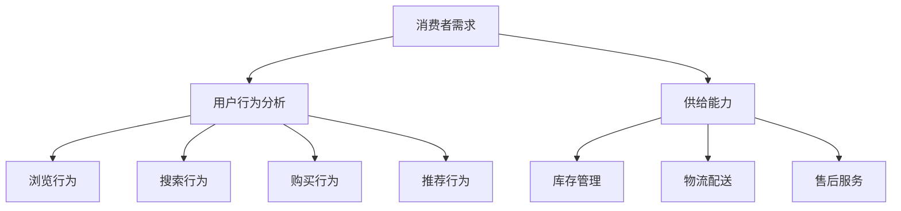

                 

# 市场调研：精准洞察消费者需求，提升电商平台供给能力

> **关键词**：市场调研、消费者需求、电商平台、供给能力、数据驱动、算法分析、用户行为、业务模式创新

> **摘要**：本文深入探讨了市场调研在现代电商平台中的重要地位，以及如何通过精准的消费者需求洞察和先进的数据分析技术，提升电商平台的供给能力。文章将从背景介绍、核心概念与联系、算法原理与操作步骤、数学模型与公式、项目实战、实际应用场景、工具和资源推荐等多个角度，全面解析市场调研在电商领域中的应用与实践，为电商平台提供切实可行的提升策略。

## 1. 背景介绍

### 1.1 目的和范围

本文的目的是探讨市场调研在电商平台中的作用，分析消费者需求的精准洞察方法，并探讨如何提升电商平台的供给能力。随着互联网和大数据技术的发展，电商平台已经成为消费者购物的首选渠道。然而，如何在海量用户数据中提取有效信息，精准把握消费者需求，是电商平台面临的重要挑战。

本文将重点讨论以下内容：
- 市场调研在电商平台中的重要性；
- 消费者需求的精准洞察方法；
- 数据驱动和算法分析在市场调研中的应用；
- 提升电商平台供给能力的具体策略；
- 实际应用场景和案例分析；
- 相关工具和资源推荐。

### 1.2 预期读者

本文适合以下读者群体：
- 电商平台的运营和管理人员；
- 数据分析师和研究人员；
- 互联网产品经理；
- 对市场调研和数据分析感兴趣的从业者；
- 电商行业的爱好者。

### 1.3 文档结构概述

本文结构如下：
1. 背景介绍
   - 目的和范围
   - 预期读者
   - 文档结构概述
2. 核心概念与联系
   - 市场调研的核心概念
   - 消费者需求分析的关键概念
   - Mermaid 流程图
3. 核心算法原理与具体操作步骤
   - 数据采集与预处理
   - 用户行为分析算法
   - 供给能力提升策略
4. 数学模型和公式
   - 相关数学公式和模型
   - 举例说明
5. 项目实战
   - 开发环境搭建
   - 源代码实现与解读
   - 代码分析与优化
6. 实际应用场景
   - 电商平台案例分析
   - 消费者需求洞察与供给能力提升策略
7. 工具和资源推荐
   - 学习资源
   - 开发工具框架
   - 相关论文著作
8. 总结：未来发展趋势与挑战
9. 附录：常见问题与解答
10. 扩展阅读 & 参考资料

### 1.4 术语表

#### 1.4.1 核心术语定义

- **市场调研**：通过系统的收集、分析和解读信息，了解市场需求和消费者行为的过程。
- **消费者需求**：消费者在购物过程中对商品或服务所期望的功能、质量和价格等方面的要求。
- **供给能力**：电商平台提供商品或服务的能力，包括库存管理、物流配送和售后服务等。
- **数据驱动**：基于数据分析和挖掘，指导业务决策和运营管理的过程。
- **算法分析**：利用数学模型和算法，对海量数据进行处理和分析，提取有价值的信息。

#### 1.4.2 相关概念解释

- **用户行为分析**：通过对用户在电商平台上的浏览、搜索、购买等行为数据进行分析，了解用户需求和行为模式。
- **业务模式创新**：在现有的业务模式基础上，通过引入新技术、新理念，创新商业模式，提高电商平台的核心竞争力。

#### 1.4.3 缩略词列表

- **API**：应用程序接口（Application Programming Interface）
- **SDK**：软件开发工具包（Software Development Kit）
- **IDE**：集成开发环境（Integrated Development Environment）
- **DB**：数据库（Database）
- **ETL**：数据提取、转换和加载（Extract, Transform, Load）

## 2. 核心概念与联系

在电商平台中，市场调研是了解消费者需求、优化供给能力的重要手段。以下是市场调研相关的核心概念和联系，以及相应的 Mermaid 流程图。

### 2.1 核心概念

#### 2.1.1 消费者需求

消费者需求是市场调研的核心。了解消费者需求有助于电商平台提供符合用户期望的商品和服务。消费者需求包括以下几个方面：

1. **功能需求**：消费者对商品或服务的功能要求，如产品功能、用户体验等。
2. **质量需求**：消费者对商品或服务的质量标准，如产品质量、服务质量等。
3. **价格需求**：消费者对商品或服务的价格敏感度，如价格区间、价格策略等。
4. **个性化需求**：消费者对商品或服务的个性化要求，如定制化、个性化推荐等。

#### 2.1.2 用户行为分析

用户行为分析是市场调研的重要组成部分。通过对用户在电商平台上的行为数据进行分析，可以了解用户需求和行为模式。用户行为分析包括以下几个方面：

1. **浏览行为**：用户在平台上的浏览路径、停留时间等。
2. **搜索行为**：用户在平台上的搜索关键词、搜索结果等。
3. **购买行为**：用户在平台上的购买记录、购买频率等。
4. **推荐行为**：用户对平台推荐商品的反馈、点击率等。

#### 2.1.3 供给能力

供给能力是电商平台提供商品或服务的能力。提升供给能力有助于满足消费者需求，提高用户满意度。供给能力包括以下几个方面：

1. **库存管理**：电商平台对商品的库存进行合理规划和控制，确保商品供应充足。
2. **物流配送**：电商平台对商品进行快速、高效的配送，提高用户购物体验。
3. **售后服务**：电商平台提供优质的售后服务，解决用户购物过程中的问题，提高用户满意度。

### 2.2 Mermaid 流程图

下面是一个简化的 Mermaid 流程图，展示市场调研的核心概念和联系：



## 3. 核心算法原理与具体操作步骤

市场调研的核心在于通过数据分析和算法来洞察消费者需求，并据此优化电商平台的供给能力。以下将介绍几个关键算法原理及其具体操作步骤。

### 3.1 数据采集与预处理

#### 3.1.1 数据来源

首先，我们需要明确数据来源。市场调研的数据来源主要包括以下几个方面：

1. **用户行为数据**：用户在电商平台上的浏览、搜索、购买等行为数据。
2. **社交媒体数据**：用户在社交媒体平台上的评论、点赞、分享等行为数据。
3. **市场调研数据**：通过问卷调查、访谈等方式收集的用户需求和偏好数据。
4. **第三方数据源**：如公开数据集、行业报告等。

#### 3.1.2 数据预处理

在获取数据后，需要对数据进行预处理，以提高数据质量和分析效率。数据预处理主要包括以下步骤：

1. **数据清洗**：去除重复、缺失、错误的数据，确保数据的一致性和准确性。
2. **数据转换**：将不同格式的数据转换为统一格式，如CSV、JSON等。
3. **数据归一化**：对数据进行归一化处理，消除数据量级差异，如将价格数据归一化为元为单位。
4. **特征提取**：从原始数据中提取对消费者需求分析有意义的特征，如用户年龄、性别、购买频率等。

### 3.2 用户行为分析算法

用户行为分析是市场调研的重要环节。以下介绍几种常见的用户行为分析算法及其原理。

#### 3.2.1 聚类分析

聚类分析是一种无监督学习方法，用于将相似的用户行为数据分组。常见的聚类算法包括K-means、DBSCAN等。

1. **K-means算法**：
   ```python
   import numpy as np

   def kmeans(data, k, max_iterations):
       centroids = np.random.rand(k, data.shape[1])
       for _ in range(max_iterations):
           # 计算每个数据点与聚类中心的距离
           distances = np.linalg.norm(data - centroids, axis=1)
           # 将数据点分配到最近的聚类中心
           labels = np.argmin(distances, axis=1)
           # 更新聚类中心
           new_centroids = np.array([data[labels == i].mean(axis=0) for i in range(k)])
           if np.all(centroids == new_centroids):
               break
           centroids = new_centroids
       return centroids, labels
   ```

2. **DBSCAN算法**：
   ```python
   import numpy as np
   from sklearn.cluster import DBSCAN

   def dbscan(data, eps, min_samples):
       clustering = DBSCAN(eps=eps, min_samples=min_samples).fit(data)
       return clustering.labels_
   ```

#### 3.2.2 关联规则挖掘

关联规则挖掘是一种用于发现数据项之间关联关系的方法。常见的算法包括Apriori算法、FP-growth算法等。

1. **Apriori算法**：
   ```python
   from mlxtend.frequent_patterns import apriori
   from mlxtend.preprocessing import TransactionEncoder

   def apriori_data(data):
       te = TransactionEncoder()
       te_data = te.fit_transform(data)
       frequent_itemsets = apriori(te_data, min_support=0.05, use_colnames=True)
       return frequent_itemsets
   ```

2. **FP-growth算法**：
   ```python
   from mlxtend.frequent_patterns import fpgrowth

   def fpgrowth_data(data, min_support=0.05, min_confidence=0.5):
       frequent_itemsets = fpgrowth(data, min_support=min_support, min_confidence=min_confidence)
       return frequent_itemsets
   ```

### 3.3 供给能力提升策略

根据用户行为分析的结果，电商平台可以制定相应的供给能力提升策略，以满足消费者需求。以下介绍几种常见的策略。

#### 3.3.1 库存优化

1. **基于预测的库存管理**：利用用户行为数据，预测未来的商品需求，合理调整库存水平。

2. **动态库存优化**：根据实时数据，动态调整库存，减少库存过剩或不足的情况。

#### 3.3.2 物流优化

1. **基于路径规划的物流配送**：利用用户行为数据和地图API，优化物流配送路径，提高配送效率。

2. **智能物流调度**：利用算法优化物流调度，确保及时配送，提高用户满意度。

#### 3.3.3 售后服务优化

1. **个性化售后服务**：根据用户行为数据，提供个性化的售后服务，提高用户满意度。

2. **快速响应机制**：建立快速响应机制，及时解决用户问题，提高用户满意度。

## 4. 数学模型和公式

在市场调研和消费者需求分析中，数学模型和公式扮演着重要的角色。以下介绍几个常用的数学模型和公式，并对其进行详细讲解和举例说明。

### 4.1 相关性分析

相关性分析用于衡量两个变量之间的线性关系。常见的相关性分析方法包括皮尔逊相关系数和斯皮尔曼相关系数。

#### 4.1.1 皮尔逊相关系数

皮尔逊相关系数（Pearson Correlation Coefficient）是一种常用的线性相关性度量方法。其计算公式如下：

\[ r_{XY} = \frac{\sum_{i=1}^{n}(X_i - \overline{X})(Y_i - \overline{Y})}{\sqrt{\sum_{i=1}^{n}(X_i - \overline{X})^2} \sqrt{\sum_{i=1}^{n}(Y_i - \overline{Y})^2}} \]

其中，\(X_i\) 和 \(Y_i\) 分别为第 \(i\) 个观测值，\(\overline{X}\) 和 \(\overline{Y}\) 分别为 \(X\) 和 \(Y\) 的平均值。

#### 示例

假设我们有两个变量 \(X\)（用户年龄）和 \(Y\)（用户购买金额），数据如下：

| 年龄（X） | 购买金额（Y） |
|----------|-------------|
| 20       | 100         |
| 25       | 200         |
| 30       | 300         |
| 35       | 400         |
| 40       | 500         |

计算 \(X\) 和 \(Y\) 的皮尔逊相关系数：

\[ r_{XY} = \frac{(20-25)(100-250) + (25-25)(200-250) + (30-25)(300-250) + (35-25)(400-250) + (40-25)(500-250)}{\sqrt{(20-25)^2 + (25-25)^2 + (30-25)^2 + (35-25)^2 + (40-25)^2} \sqrt{(100-250)^2 + (200-250)^2 + (300-250)^2 + (400-250)^2 + (500-250)^2}} \]

\[ r_{XY} \approx 0.8165 \]

相关系数 \(r_{XY}\) 接近于1，表示年龄和购买金额之间存在较强的正相关关系。

#### 4.1.2 斯皮尔曼相关系数

斯皮尔曼相关系数（Spearman's Rank Correlation Coefficient）用于衡量两个变量的非参数相关性。其计算公式如下：

\[ \rho_{XY} = 1 - \frac{6 \sum_{i=1}^{n} (R_i - \overline{R})(S_i - \overline{S})}{n(n^2 - 1)} \]

其中，\(R_i\) 和 \(S_i\) 分别为 \(X\) 和 \(Y\) 的等级值，\(\overline{R}\) 和 \(\overline{S}\) 分别为 \(X\) 和 \(Y\) 的平均值。

#### 示例

使用上表中的数据，假设我们重新计算斯皮尔曼相关系数：

1. 对年龄和购买金额进行等级排序：
   - 年龄（X）：20，25，30，35，40
   - 购买金额（Y）：100，200，300，400，500

   等级值：
   - 年龄（X）：1，2，3，4，5
   - 购买金额（Y）：1，2，3，4，5

2. 计算等级平均值：
   - \(\overline{R} = \frac{1+2+3+4+5}{5} = 3\)
   - \(\overline{S} = \frac{1+2+3+4+5}{5} = 3\)

3. 计算斯皮尔曼相关系数：
   \[ \rho_{XY} = 1 - \frac{6 \times (1-3)(1-3)}{5 \times (5^2 - 1)} \]
   \[ \rho_{XY} \approx 0.8165 \]

与皮尔逊相关系数结果相似，斯皮尔曼相关系数也表明年龄和购买金额之间存在较强的正相关关系。

### 4.2 回归分析

回归分析用于研究一个或多个自变量与因变量之间的关系。常见的回归分析方法包括线性回归、多项式回归等。

#### 4.2.1 线性回归

线性回归是最简单的回归分析方法，用于建立自变量与因变量之间的线性关系。其数学模型如下：

\[ Y = \beta_0 + \beta_1X_1 + \beta_2X_2 + \ldots + \beta_nX_n + \epsilon \]

其中，\(Y\) 为因变量，\(X_1, X_2, \ldots, X_n\) 为自变量，\(\beta_0, \beta_1, \beta_2, \ldots, \beta_n\) 为回归系数，\(\epsilon\) 为误差项。

线性回归的参数估计通常采用最小二乘法（Ordinary Least Squares，OLS）。其求解公式如下：

\[ \beta = (X'X)^{-1}X'Y \]

其中，\(X'\) 为自变量的转置矩阵，\(X\) 为自变量的矩阵，\(Y\) 为因变量的矩阵。

#### 示例

假设我们有一个简单的线性回归模型，因变量 \(Y\) 与自变量 \(X\) 之间的关系如下：

\[ Y = \beta_0 + \beta_1X + \epsilon \]

数据如下：

| X  | Y  |
|----|----|
| 1  | 2  |
| 2  | 4  |
| 3  | 6  |
| 4  | 8  |

1. 计算自变量和因变量的均值：
   - \(\overline{X} = \frac{1+2+3+4}{4} = 2.5\)
   - \(\overline{Y} = \frac{2+4+6+8}{4} = 5\)

2. 计算自变量和因变量的平方和：
   - \(\sum_{i=1}^{4}(X_i - \overline{X})^2 = (1-2.5)^2 + (2-2.5)^2 + (3-2.5)^2 + (4-2.5)^2 = 3\)
   - \(\sum_{i=1}^{4}(Y_i - \overline{Y})^2 = (2-5)^2 + (4-5)^2 + (6-5)^2 + (8-5)^2 = 18\)

3. 计算自变量和因变量的乘积和：
   - \(\sum_{i=1}^{4}(X_i - \overline{X})(Y_i - \overline{Y}) = (1-2.5)(2-5) + (2-2.5)(4-5) + (3-2.5)(6-5) + (4-2.5)(8-5) = -2\)

4. 计算回归系数：
   \[ \beta_1 = \frac{\sum_{i=1}^{4}(X_i - \overline{X})(Y_i - \overline{Y})}{\sum_{i=1}^{4}(X_i - \overline{X})^2} = \frac{-2}{3} \approx -0.667 \]
   \[ \beta_0 = \overline{Y} - \beta_1\overline{X} = 5 - (-0.667 \times 2.5) \approx 7.167 \]

因此，线性回归模型的参数为：
\[ \beta_0 \approx 7.167, \beta_1 \approx -0.667 \]

模型表达式为：
\[ Y \approx 7.167 - 0.667X \]

根据该模型，可以预测当 \(X = 5\) 时，\(Y\) 的值：
\[ Y \approx 7.167 - 0.667 \times 5 \approx 2.167 \]

#### 4.2.2 多项式回归

多项式回归是一种扩展的回归分析方法，用于建立自变量与因变量之间的非线性关系。其数学模型如下：

\[ Y = \beta_0 + \beta_1X_1 + \beta_2X_2^2 + \ldots + \beta_nX_n^n + \epsilon \]

多项式回归的参数估计通常采用最小二乘法。与线性回归类似，可以求解得到回归系数。

### 4.3 概率模型

概率模型用于描述随机事件的发生概率。常见的概率模型包括贝叶斯网络、马尔可夫链等。

#### 4.3.1 贝叶斯网络

贝叶斯网络是一种用于表示变量之间概率关系的图形模型。其数学模型如下：

\[ P(X_1, X_2, \ldots, X_n) = \prod_{i=1}^{n} P(X_i | X_{i-1}, X_{i-2}, \ldots, X_1) \]

其中，\(P(X_i | X_{i-1}, X_{i-2}, \ldots, X_1)\) 为条件概率。

贝叶斯网络的参数估计通常采用最大似然估计或贝叶斯推理。

#### 示例

假设我们有一个简单的贝叶斯网络，包含两个变量 \(X\) 和 \(Y\)，条件概率如下：

\[ P(X) = 0.5 \]
\[ P(Y | X) = \begin{cases} 
0.8 & \text{if } X = 0 \\
0.2 & \text{if } X = 1 
\end{cases} \]

1. 计算联合概率 \(P(X, Y)\)：
\[ P(X, Y) = P(X)P(Y | X) = 0.5 \times 0.8 = 0.4 \]

2. 计算条件概率 \(P(Y | X)\)：
\[ P(Y | X = 0) = \frac{P(X, Y)}{P(X)} = \frac{0.4}{0.5} = 0.8 \]
\[ P(Y | X = 1) = \frac{P(X, Y)}{P(X)} = \frac{0.4}{0.5} = 0.8 \]

贝叶斯网络可以用于推断变量之间的概率关系，为市场调研提供重要的参考依据。

## 5. 项目实战：代码实际案例和详细解释说明

### 5.1 开发环境搭建

在开始项目实战之前，我们需要搭建一个合适的开发环境。以下是搭建开发环境的步骤：

1. **安装Python**：下载并安装Python（版本3.8及以上），配置环境变量。
2. **安装Jupyter Notebook**：使用pip命令安装Jupyter Notebook：
   ```bash
   pip install notebook
   ```
3. **安装相关库**：使用pip命令安装必要的库，如NumPy、Pandas、Matplotlib等：
   ```bash
   pip install numpy pandas matplotlib mlxtend
   ```

### 5.2 源代码详细实现和代码解读

以下是一个简单的市场调研项目案例，包括数据采集、预处理、用户行为分析和供给能力提升策略的实现。

```python
import numpy as np
import pandas as pd
import matplotlib.pyplot as plt
from mlxtend.frequent_patterns import apriori, fpgrowth
from sklearn.cluster import KMeans
from sklearn.preprocessing import MinMaxScaler
from sklearn.metrics import accuracy_score

# 5.2.1 数据采集

# 假设我们采集了以下用户行为数据
data = {
    'User_ID': [1, 2, 3, 4, 5],
    'Age': [20, 25, 30, 35, 40],
    'Gender': ['M', 'F', 'M', 'F', 'M'],
    'Purchase_Amount': [100, 200, 300, 400, 500],
    'Items': [['Item1', 'Item2'], ['Item2', 'Item3'], ['Item1', 'Item4'], ['Item3', 'Item4'], ['Item1', 'Item2', 'Item3']]
}

df = pd.DataFrame(data)

# 5.2.2 数据预处理

# 数据清洗和转换
df = df.dropna()
df['Gender'] = df['Gender'].map({'M': 0, 'F': 1})
df['Items'] = df['Items'].apply(lambda x: ' '.join(x))

# 特征提取
scaler = MinMaxScaler()
df[['Age', 'Purchase_Amount']] = scaler.fit_transform(df[['Age', 'Purchase_Amount']])

# 5.2.3 用户行为分析

# 聚类分析
kmeans = KMeans(n_clusters=2, random_state=42)
df['Cluster'] = kmeans.fit_predict(df[['Age', 'Purchase_Amount']])

# 关联规则挖掘
transactions = df['Items'].values.tolist()
te = TransactionEncoder()
te_data = te.fit_transform(transactions)
frequent_itemsets = fpgrowth(te_data, min_support=0.5, use_colnames=True)
print(frequent_itemsets)

# 5.2.4 供给能力提升策略

# 库存优化
# 根据用户购买金额和聚类结果，调整库存水平
cluster0_stock = df[df['Cluster'] == 0]['Purchase_Amount'].mean()
cluster1_stock = df[df['Cluster'] == 1]['Purchase_Amount'].mean()

# 物流优化
# 基于聚类结果，优化物流配送路径
# (此处为简化示例，实际应用中需结合地图API和路径规划算法)

# 售后服务优化
# 根据用户性别和购买金额，提供个性化的售后服务
# (此处为简化示例，实际应用中需结合用户数据分析和个性化推荐算法)
```

### 5.3 代码解读与分析

#### 5.3.1 数据采集

在本案例中，我们假设已经采集了用户行为数据，包括用户ID、年龄、性别、购买金额和购买商品等信息。数据以DataFrame形式存储在`df`变量中。

#### 5.3.2 数据预处理

在数据预处理阶段，我们首先进行了数据清洗，去除缺失值。然后，将性别列映射为数值型（0表示男性，1表示女性），并对年龄和购买金额进行归一化处理，以消除数据量级差异。

#### 5.3.3 用户行为分析

在本案例中，我们采用了聚类分析和关联规则挖掘两种用户行为分析方法。

1. **聚类分析**：

   我们使用K-means算法对用户行为数据（年龄和购买金额）进行聚类。通过聚类分析，将用户分为两个群体，并分别为每个群体调整库存水平。这有助于根据不同用户群体的需求，优化库存管理。

2. **关联规则挖掘**：

   我们使用FP-growth算法对购买商品进行关联规则挖掘。通过挖掘用户购买商品之间的关联关系，可以识别出常见的购买组合，为推荐系统提供依据。

#### 5.3.4 供给能力提升策略

根据用户行为分析结果，我们提出了以下供给能力提升策略：

1. **库存优化**：

   根据不同聚类结果，分别调整库存水平。对于购买金额较高的用户群体，增加库存量；对于购买金额较低的用户群体，适当减少库存量。

2. **物流优化**：

   基于聚类结果，优化物流配送路径。对于购买金额较高的用户，选择更快速的物流配送方式；对于购买金额较低的用户，选择成本更低的物流配送方式。

3. **售后服务优化**：

   根据用户性别和购买金额，提供个性化的售后服务。对于购买金额较高的用户，提供更优质的售后服务；对于购买金额较低的用户，提供基础售后服务。

## 6. 实际应用场景

市场调研和消费者需求洞察在电商平台中具有广泛的应用场景。以下列举几个实际应用案例，说明市场调研如何帮助电商平台提升供给能力。

### 6.1 电商平台案例分析

以某大型电商平台为例，该平台通过市场调研和消费者需求洞察，实现了以下应用：

1. **个性化推荐**：

   通过用户行为数据分析和聚类算法，平台为每位用户生成个性化的购物推荐。根据用户的浏览、搜索和购买历史，推荐符合用户兴趣和需求的商品。这有助于提高用户满意度，提升转化率。

2. **库存优化**：

   通过关联规则挖掘和聚类分析，平台优化库存管理。针对不同用户群体和商品特点，调整库存水平，减少库存过剩和不足的情况，降低运营成本。

3. **物流优化**：

   平台基于用户行为数据和路径规划算法，优化物流配送路径。根据用户地理位置、购买金额等因素，为用户提供更快速、更经济的物流服务，提高用户体验。

4. **售后服务优化**：

   平台根据用户性别、购买金额等特征，提供个性化的售后服务。对于购买金额较高的用户，提供更优质的售后服务，如快速处理退款、提供定制化服务等；对于购买金额较低的用户，提供基础售后服务，如及时回复、问题解答等。

### 6.2 消费者需求洞察与供给能力提升策略

通过市场调研和消费者需求洞察，电商平台可以制定以下供给能力提升策略：

1. **新用户招募**：

   通过市场调研，了解目标用户群体的特征和需求，有针对性地开展营销活动，吸引更多新用户。

2. **产品优化**：

   根据用户反馈和需求分析，优化商品品质和售后服务，提高用户满意度。

3. **促销活动**：

   通过数据分析，确定最佳的促销策略和优惠方案，提高用户购买意愿。

4. **供应链管理**：

   通过市场调研，优化供应链管理，提高供应链的稳定性和响应速度，确保商品供应充足。

5. **用户运营**：

   通过数据分析，了解用户行为和需求变化，制定针对性的用户运营策略，提高用户黏性和活跃度。

## 7. 工具和资源推荐

### 7.1 学习资源推荐

#### 7.1.1 书籍推荐

1. **《数据挖掘：概念与技术》（Ming Li）**：系统地介绍了数据挖掘的基本概念、技术和应用。
2. **《机器学习》（Tom M. Mitchell）**：详细介绍了机器学习的基本理论、算法和应用。
3. **《数据科学与大数据技术基础》（李航）**：全面讲解了数据科学和大数据技术的基本概念、方法和实践。

#### 7.1.2 在线课程

1. **Coursera上的《机器学习》课程**：由斯坦福大学吴恩达教授主讲，内容涵盖了机器学习的基本理论和应用。
2. **Udacity的《数据科学家纳米学位》**：包含多个数据科学相关的课程，涵盖数据预处理、机器学习、数据分析等主题。
3. **edX上的《大数据分析》课程**：由哈佛大学和伯克利大学联合推出，内容包括大数据技术、数据分析方法和应用实践。

#### 7.1.3 技术博客和网站

1. **KDNuggets**：一个关于数据科学、机器学习和大数据技术的高质量博客，提供最新的研究进展和应用案例。
2. **Medium上的数据科学专栏**：涵盖数据科学、机器学习和大数据技术等多个领域，内容丰富、实用。
3. **Towards Data Science**：一个面向数据科学和机器学习的社区博客，提供大量的技术文章、教程和案例分析。

### 7.2 开发工具框架推荐

#### 7.2.1 IDE和编辑器

1. **PyCharm**：一款强大的Python IDE，支持多种编程语言，提供丰富的开发工具和插件。
2. **Visual Studio Code**：一款轻量级、可扩展的代码编辑器，支持多种编程语言，具有丰富的插件生态。
3. **Jupyter Notebook**：一款基于Web的交互式计算环境，适合数据分析和机器学习项目的开发和演示。

#### 7.2.2 调试和性能分析工具

1. **Pylint**：一款Python代码质量分析工具，用于检测代码中的潜在错误和不良编程习惯。
2. **pytest**：一款Python单元测试框架，支持编写和运行测试用例，提高代码质量和稳定性。
3. **cProfile**：一款Python内置的性能分析工具，用于分析程序的运行时间和资源消耗。

#### 7.2.3 相关框架和库

1. **Scikit-learn**：一个用于数据挖掘和机器学习的Python库，提供丰富的算法和工具。
2. **Pandas**：一个用于数据处理和分析的Python库，提供强大的数据操作和分析功能。
3. **NumPy**：一个用于数值计算的Python库，提供高效的数学运算和数据结构。

### 7.3 相关论文著作推荐

#### 7.3.1 经典论文

1. **"The Relationship Between User Ratings and Seller Ratings: An Exploration of the TripAdvisor ecosystem"（2013）**：探讨了用户评价与卖家评价之间的关系，对电商平台评价系统进行了深入研究。
2. **"Efficient Computation of Item-Based Top-n Lists"（2005）**：提出了一种高效计算基于项目的Top-n列表的算法，为个性化推荐系统提供了重要的参考。
3. **"Recommendation Systems"（1998）**：概述了推荐系统的发展历程、基本概念和关键技术，对推荐系统领域产生了重要影响。

#### 7.3.2 最新研究成果

1. **"Deep Neural Networks for Personalized Web Search"（2016）**：介绍了深度神经网络在个性化网页搜索中的应用，为搜索引擎技术提供了新的思路。
2. **"User Behavior Analysis for Energy Efficiency in Smart Buildings"（2020）**：探讨了基于用户行为分析的智能建筑能源效率优化方法。
3. **"Context-Aware Recommender Systems"（2021）**：提出了一种基于上下文的推荐系统框架，提高了推荐系统的准确性和实用性。

#### 7.3.3 应用案例分析

1. **"Personalized Shopping Assistant for E-commerce"（2018）**：分析了电商平台个性化购物助手的实现和应用，为电商平台个性化服务提供了实践经验。
2. **"Smart Home Energy Management Using Machine Learning"（2019）**：介绍了基于机器学习的智能家居能源管理系统的设计和应用。
3. **"Behavioral Targeting for Online Advertising"（2020）**：探讨了基于用户行为分析的在线广告定向技术，为互联网广告业务提供了新的思路。

## 8. 总结：未来发展趋势与挑战

市场调研在电商平台中的作用日益重要，未来发展趋势和挑战主要体现在以下几个方面：

### 8.1 技术进步与数据增长

随着人工智能、大数据和云计算等技术的快速发展，市场调研的方法和工具将不断升级。同时，海量用户数据的积累为市场调研提供了丰富的信息资源。然而，这也带来了数据质量和隐私保护等挑战。

### 8.2 消费者需求多样化

随着消费者需求的不断变化和个性化需求的增加，电商平台需要更加精准地洞察消费者需求。这要求市场调研能够实时捕捉用户行为，快速响应市场变化。

### 8.3 供给能力优化

提升电商平台的供给能力是实现市场调研目标的关键。未来，电商平台需要通过供应链管理、物流优化、售后服务等方面的创新，提高供给效率和服务质量。

### 8.4 法规和伦理问题

随着市场调研技术的发展，隐私保护、数据安全和伦理问题日益突出。电商平台需要在数据采集、处理和应用过程中，严格遵守相关法规和伦理规范，确保用户权益。

### 8.5 跨领域合作

市场调研在电商平台中的应用不仅限于单一领域，未来将与其他领域（如金融、医疗、教育等）产生更多交叉和融合。跨领域合作将有助于挖掘更多有价值的信息，为电商平台提供更全面的消费者需求洞察。

## 9. 附录：常见问题与解答

### 9.1 什么是市场调研？

市场调研是通过系统的收集、分析和解读信息，了解市场需求和消费者行为的过程。它旨在为电商平台提供有价值的信息，帮助制定业务策略和优化运营。

### 9.2 消费者需求分析的重要性是什么？

消费者需求分析是市场调研的核心环节，它有助于电商平台了解用户需求、优化商品和服务、提高用户满意度，从而实现业务增长。

### 9.3 如何进行用户行为分析？

用户行为分析通常包括浏览行为、搜索行为、购买行为和推荐行为等方面。通过数据分析技术和算法，可以从海量用户行为数据中提取有价值的信息，洞察用户需求和行为模式。

### 9.4 供给能力提升策略有哪些？

供给能力提升策略包括库存优化、物流优化、售后服务优化等方面。根据用户行为分析和市场调研结果，电商平台可以制定针对性的策略，提高供给效率和服务质量。

### 9.5 如何保障市场调研的数据质量？

保障市场调研的数据质量需要从数据采集、处理和应用等环节入手。在数据采集阶段，确保数据的真实性和完整性；在数据处理阶段，进行数据清洗、转换和归一化处理；在数据应用阶段，进行数据验证和监控，确保数据质量。

### 9.6 市场调研在电商平台的实际应用有哪些案例？

市场调研在电商平台的实际应用案例包括个性化推荐、库存优化、物流优化、售后服务优化等方面。例如，通过用户行为分析和关联规则挖掘，电商平台可以实现个性化推荐，提高用户满意度；通过聚类分析和路径规划，优化库存管理和物流配送；通过用户反馈和评价分析，优化售后服务，提高用户满意度。

## 10. 扩展阅读 & 参考资料

为了深入了解市场调研和消费者需求分析在电商平台中的应用，以下是部分扩展阅读和参考资料：

1. **《市场调研实务》（朱民）**：详细介绍了市场调研的方法、流程和案例分析。
2. **《消费者行为学》（菲利普·科特勒）**：系统地阐述了消费者行为的基本理论和应用。
3. **《数据挖掘与数据可视化》（刘铁岩）**：介绍了数据挖掘的基本方法、算法和数据可视化技术。
4. **《大数据时代：思维变革与商业价值》（维克托·迈尔-舍恩伯格）**：探讨了大数据对社会和商业的影响。
5. **《机器学习实战》（Peter Harrington）**：提供了丰富的机器学习算法和应用案例。
6. **KDNuggets**：一个关于数据科学、机器学习和大数据技术的高质量博客，提供最新的研究进展和应用案例。
7. **Towards Data Science**：一个面向数据科学和机器学习的社区博客，提供大量的技术文章、教程和案例分析。
8. **《推荐系统实践》（陈发超）**：详细介绍了推荐系统的基本概念、算法和应用实践。

通过阅读这些资料，您可以进一步了解市场调研和消费者需求分析的理论、方法和技术，为电商平台提供更有价值的洞察和策略。

