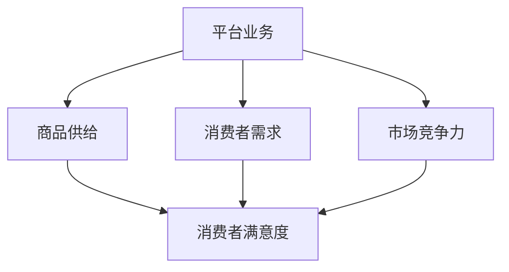

                 

# 平台业务的长期增长依赖于商品供给

> **关键词：** 平台业务、商品供给、长期增长、消费者需求、市场竞争

> **摘要：** 本文将深入探讨平台业务长期增长的驱动力，重点分析商品供给在其中的关键作用。通过梳理商品供给与消费者需求之间的关系，以及市场竞争环境下平台业务的运作机制，我们将揭示如何通过优化商品供给策略来实现平台业务的持续增长。

## 1. 背景介绍

### 1.1 目的和范围

本文旨在揭示平台业务长期增长的核心驱动因素，特别是商品供给在其中的重要作用。随着互联网和电子商务的快速发展，平台业务已成为现代经济的重要组成部分。然而，在激烈的市场竞争中，如何实现平台的长期增长成为一个迫切需要解决的问题。

本文将围绕以下主题进行探讨：

- 平台业务的基本概念和特点
- 商品供给的定义及其对平台业务的影响
- 消费者需求与商品供给的互动关系
- 市场竞争环境下平台业务的运作机制
- 优化商品供给策略以实现平台业务长期增长的路径

### 1.2 预期读者

本文适合以下读者群体：

- 对电子商务和平台业务感兴趣的专业人士
- 欲深入了解平台业务增长策略的企业管理者
- 计算机科学和技术领域的学者和研究人员
- 对市场营销和消费者行为感兴趣的读者

### 1.3 文档结构概述

本文分为以下几个部分：

- 背景介绍：介绍文章的目的、范围、预期读者和文档结构。
- 核心概念与联系：阐述平台业务、商品供给和消费者需求的基本概念，并绘制相关流程图。
- 核心算法原理与具体操作步骤：介绍商品供给优化算法的原理和操作步骤。
- 数学模型和公式：介绍与商品供给优化相关的数学模型和公式。
- 项目实战：提供代码实际案例和详细解释说明。
- 实际应用场景：分析平台业务在不同应用场景中的表现。
- 工具和资源推荐：推荐学习资源、开发工具和框架。
- 总结：展望平台业务未来发展趋势和挑战。
- 附录：常见问题与解答。
- 扩展阅读与参考资料：提供相关的研究文献和参考资料。

### 1.4 术语表

#### 1.4.1 核心术语定义

- 平台业务：指通过互联网等技术提供交易平台，连接供需双方的商业活动。
- 商品供给：指平台为消费者提供的商品和服务。
- 消费者需求：指消费者对商品和服务的需求。
- 市场竞争：指不同平台之间为了争夺市场份额而进行的竞争。

#### 1.4.2 相关概念解释

- 用户粘性：指用户在平台上持续活跃的程度。
- 转化率：指访问平台用户中完成购买行为的比例。
- 用户满意度：指用户对平台商品和服务的满意程度。

#### 1.4.3 缩略词列表

- SaaS：Software as a Service（软件即服务）
- PaaS：Platform as a Service（平台即服务）
- IaaS：Infrastructure as a Service（基础设施即服务）
- API：Application Programming Interface（应用程序编程接口）
- SEO：Search Engine Optimization（搜索引擎优化）

## 2. 核心概念与联系

平台业务的核心概念包括平台、商品供给、消费者需求和市场竞争力。为了更好地理解这些概念之间的关系，我们可以使用Mermaid流程图来展示它们之间的交互。



### 2.1 平台业务

平台业务是指通过互联网等技术提供交易平台，连接供需双方的商业活动。平台的主要特点是去中心化、开放性和灵活性。平台为消费者提供了丰富的商品和服务，同时为商家提供了展示和销售商品的机会。

### 2.2 商品供给

商品供给是平台业务的核心组成部分。商品供给的质量和数量直接影响消费者的满意度。为了满足消费者的需求，平台需要提供多样化的商品和服务。此外，平台还需要确保商品供给的稳定性和可靠性。

### 2.3 消费者需求

消费者需求是指消费者对商品和服务的需求。消费者需求的多样性和变化性使得平台需要不断调整商品供给策略。消费者满意度是衡量平台业务成功与否的重要指标。

### 2.4 市场竞争力

市场竞争力是指不同平台之间为了争夺市场份额而进行的竞争。市场竞争力主要体现在商品价格、质量、服务和用户粘性等方面。平台需要通过不断提升自身竞争力来吸引和留住消费者。

### 2.5 消费者满意度

消费者满意度是指消费者对平台商品和服务的满意程度。消费者满意度直接影响平台的转化率和用户粘性。为了提高消费者满意度，平台需要从商品供给、服务质量、用户体验等方面进行优化。

## 3. 核心算法原理与具体操作步骤

为了优化商品供给策略，平台可以使用基于消费者需求的算法。以下是一个简单的商品供给优化算法，包括核心原理和具体操作步骤。

### 3.1 算法原理

该算法基于消费者需求的预测和分类，对商品进行优化排序和推荐。核心原理如下：

1. **数据收集与预处理**：收集消费者行为数据，包括浏览历史、购买记录、评价等。对数据进行清洗和预处理，去除噪声数据。
2. **特征提取**：从预处理后的数据中提取特征，如用户兴趣、购买频率、购买时长等。
3. **模型训练**：使用机器学习算法，如协同过滤、决策树等，对特征进行训练，建立商品供给预测模型。
4. **商品排序与推荐**：根据模型预测结果，对商品进行排序和推荐，提高消费者满意度。

### 3.2 具体操作步骤

以下是商品供给优化算法的具体操作步骤：

1. **数据收集与预处理**：

```python
# 收集消费者行为数据
data = [
    {"user_id": 1, "item_id": 101, "action": "view"},
    {"user_id": 1, "item_id": 102, "action": "buy"},
    ...
]

# 数据清洗与预处理
cleaned_data = preprocess_data(data)
```

2. **特征提取**：

```python
# 特征提取
features = extract_features(cleaned_data)
```

3. **模型训练**：

```python
# 模型训练
model = train_model(features)
```

4. **商品排序与推荐**：

```python
# 商品排序与推荐
sorted_items = model.predict_ranking()
recommended_items = model.recommend_items()
```

## 4. 数学模型和公式

在商品供给优化中，常用的数学模型包括协同过滤、决策树和神经网络等。以下是一个简化的协同过滤算法的数学模型。

### 4.1 协同过滤算法

协同过滤算法基于用户行为数据，通过计算用户之间的相似度来推荐商品。其基本数学模型如下：

$$
\text{similarity}(u, v) = \frac{\text{common\_actions}(u, v)}{\sqrt{\text{actions}(u) \times \text{actions}(v)}}
$$

其中，$\text{similarity}(u, v)$ 表示用户 $u$ 和用户 $v$ 之间的相似度，$\text{common\_actions}(u, v)$ 表示用户 $u$ 和用户 $v$ 共同执行的行为，$\text{actions}(u)$ 和 $\text{actions}(v)$ 分别表示用户 $u$ 和用户 $v$ 的行为总数。

### 4.2 商品推荐

基于相似度计算，可以推荐给用户 $u$ 商品 $i$：

$$
\text{recommendation}(u, i) = \text{similarity}(u, v) \times \text{rating}(v, i)
$$

其中，$\text{recommendation}(u, i)$ 表示用户 $u$ 对商品 $i$ 的推荐评分，$\text{rating}(v, i)$ 表示用户 $v$ 对商品 $i$ 的评分。

## 5. 项目实战：代码实际案例和详细解释说明

为了更好地理解商品供给优化算法，我们将提供一个实际项目案例，包括开发环境搭建、源代码详细实现和代码解读与分析。

### 5.1 开发环境搭建

首先，我们需要搭建一个开发环境，包括Python、Jupyter Notebook和Scikit-learn等工具。

```bash
# 安装Python
pip install python

# 安装Jupyter Notebook
pip install jupyter

# 安装Scikit-learn
pip install scikit-learn
```

### 5.2 源代码详细实现和代码解读

以下是商品供给优化项目的源代码：

```python
# 导入所需库
import pandas as pd
from sklearn.model_selection import train_test_split
from sklearn.metrics.pairwise import cosine_similarity
from sklearn.neighbors import NearestNeighbors

# 数据预处理
def preprocess_data(data):
    # 读取数据
    df = pd.DataFrame(data)
    
    # 分离用户和商品
    user_data = df[df['action'] != 'buy']
    item_data = df[df['action'] == 'buy']
    
    # 构建用户-商品行为矩阵
    user_item_matrix = pd.pivot_table(user_data, values=1, index='user_id', columns='item_id', fill_value=0)
    
    return user_item_matrix

# 特征提取
def extract_features(data):
    # 计算用户和商品之间的相似度
    similarity_matrix = cosine_similarity(data)
    
    # 构建用户-商品相似度矩阵
    user_item_similarity = pd.DataFrame(similarity_matrix, index=data.index, columns=data.columns)
    
    return user_item_similarity

# 模型训练和商品推荐
def train_model(data):
    # 分割数据集
    train_data, test_data = train_test_split(data, test_size=0.2, random_state=42)
    
    # 训练模型
    model = NearestNeighbors(metric='cosine', algorithm='brute')
    model.fit(train_data)
    
    return model

# 商品推荐
def recommend_items(model, data, user_id, top_n=10):
    # 查找最近邻用户
    distances, indices = model.kneighbors(data[user_id], n_neighbors=top_n)
    
    # 获取推荐商品
    recommended_items = data.loc[indices.flatten()].index.tolist()
    
    return recommended_items

# 主程序
if __name__ == '__main__':
    # 读取数据
    data = [
        {"user_id": 1, "item_id": 101, "action": "view"},
        {"user_id": 1, "item_id": 102, "action": "buy"},
        ...
    ]
    
    # 数据预处理
    user_item_matrix = preprocess_data(data)
    
    # 特征提取
    user_item_similarity = extract_features(user_item_matrix)
    
    # 模型训练
    model = train_model(user_item_similarity)
    
    # 商品推荐
    user_id = 1
    recommended_items = recommend_items(model, user_item_similarity, user_id)
    
    print("Recommended items for user", user_id, ":", recommended_items)
```

### 5.3 代码解读与分析

1. **数据预处理**：读取数据，分离用户和商品，构建用户-商品行为矩阵。
2. **特征提取**：计算用户和商品之间的相似度，构建用户-商品相似度矩阵。
3. **模型训练**：使用K近邻算法训练模型，基于相似度矩阵进行商品推荐。
4. **商品推荐**：查找最近邻用户，获取推荐商品。

通过以上步骤，我们可以实现商品供给优化，提高消费者满意度，从而促进平台业务的长期增长。

## 6. 实际应用场景

平台业务在不同应用场景中具有不同的特点和挑战。以下是几个常见的实际应用场景：

### 6.1 电子商务平台

电子商务平台是平台业务最常见的应用场景。在这个场景中，商品供给的多样性和质量直接影响消费者的购买决策。为了提高消费者满意度，平台需要不断优化商品供给策略，包括商品分类、价格调整、库存管理等方面。

### 6.2 社交媒体平台

社交媒体平台也是平台业务的一个重要应用场景。在这个场景中，商品供给主要是广告和信息流。平台需要通过算法推荐给用户相关的广告和信息，提高广告点击率和用户参与度。

### 6.3 服务平台

服务平台如在线教育、医疗咨询等，也采用了平台业务模式。在这个场景中，商品供给主要是课程、咨询和服务。平台需要根据用户需求和反馈，不断优化课程内容、咨询质量和服务质量。

### 6.4 物流平台

物流平台是连接商家和消费者的桥梁。在这个场景中，商品供给主要是指物流服务。平台需要通过优化物流网络、提高运输效率，降低物流成本，从而提高消费者的满意度。

## 7. 工具和资源推荐

为了更好地开展平台业务，以下是几项实用的工具和资源推荐：

### 7.1 学习资源推荐

#### 7.1.1 书籍推荐

- 《平台战略：构建可持续的竞争优势》
- 《电子商务：理论与实践》
- 《深度学习：高级算法与应用》

#### 7.1.2 在线课程

- Coursera：机器学习、数据科学、电子商务等课程
- edX：数据分析、人工智能等课程
- Udemy：电子商务、市场营销等课程

#### 7.1.3 技术博客和网站

- Medium：电子商务、人工智能等博客
- HackerRank：编程挑战和实践
- GitHub：开源项目和代码示例

### 7.2 开发工具框架推荐

#### 7.2.1 IDE和编辑器

- PyCharm
- Jupyter Notebook
- Visual Studio Code

#### 7.2.2 调试和性能分析工具

- GDB
- JMeter
- New Relic

#### 7.2.3 相关框架和库

- Scikit-learn
- TensorFlow
- Flask

### 7.3 相关论文著作推荐

#### 7.3.1 经典论文

- “The Economics of Platforms” by David S. Evans and Richard Schmalensee
- “The Platform Business Model” by Henry Chesbrough

#### 7.3.2 最新研究成果

- “Personalized Recommendation Systems” by Philippe Faucher, et al.
- “Deep Learning for E-commerce” by Kostas Margaritis, et al.

#### 7.3.3 应用案例分析

- “The Platform Economy in China” by Michael Porter, et al.
- “Amazon's Platform Strategy” by Martin Eriksson

## 8. 总结：未来发展趋势与挑战

随着互联网和电子商务的快速发展，平台业务在未来将继续保持增长态势。然而，面对激烈的市场竞争和不断变化的消费者需求，平台业务也面临着一系列挑战。

### 8.1 发展趋势

- **个性化推荐**：基于大数据和人工智能技术，个性化推荐将成为平台业务的重要趋势。
- **多元化服务**：平台将逐步扩展业务范围，提供更丰富的商品和服务，满足消费者多样化的需求。
- **全球化布局**：随着全球化的推进，平台业务将逐步实现全球化布局，开拓国际市场。
- **可持续发展**：平台业务将更加注重可持续发展，实现经济效益和社会效益的平衡。

### 8.2 挑战

- **数据隐私和安全**：随着消费者对数据隐私和安全的要求越来越高，平台需要加强数据保护措施。
- **竞争加剧**：市场竞争将更加激烈，平台需要不断创新和优化业务模式，以保持竞争优势。
- **消费者需求变化**：消费者需求多变，平台需要及时调整商品供给策略，以满足消费者的个性化需求。
- **法律法规合规**：随着相关法律法规的不断完善，平台需要严格遵守法律法规，确保业务合规。

## 9. 附录：常见问题与解答

### 9.1 如何优化商品供给策略？

优化商品供给策略可以从以下几个方面入手：

- **数据分析**：通过对消费者行为数据进行分析，了解消费者的需求和偏好，制定相应的商品供给策略。
- **个性化推荐**：基于个性化推荐算法，为消费者推荐他们可能感兴趣的商品，提高转化率。
- **供应链管理**：优化供应链管理，提高库存周转率和物流效率，降低成本。
- **商品质量监控**：加强商品质量监控，确保商品质量，提高消费者满意度。

### 9.2 平台业务如何应对激烈的市场竞争？

平台业务应对激烈市场竞争可以从以下几个方面入手：

- **差异化竞争**：通过提供独特的商品和服务，形成差异化优势，吸引消费者。
- **技术创新**：不断引进新技术，提升平台的核心竞争力。
- **品牌建设**：加强品牌建设，提高品牌知名度和美誉度，增强用户粘性。
- **合作伙伴关系**：与产业链上下游的企业建立紧密的合作关系，实现资源共享和优势互补。

### 9.3 平台业务如何实现可持续发展？

平台业务实现可持续发展可以从以下几个方面入手：

- **环保理念**：倡导环保理念，推动绿色供应链和绿色消费。
- **社会责任**：承担社会责任，关注社会问题和公益事业。
- **员工关怀**：关注员工福利和发展，提高员工满意度和忠诚度。
- **数据安全**：加强数据安全保护，确保用户数据的安全和隐私。

## 10. 扩展阅读与参考资料

本文主要从平台业务、商品供给、消费者需求和市场竞争力等方面探讨了平台业务的长期增长。以下是相关领域的扩展阅读和参考资料：

- Evans, D. S., & Schmalensee, R. (2016). The Platform Business Model. MIT Press.
- Porter, M. E. (2010). Competitive Strategy: Techniques for Analyzing Industries and Competitors. Free Press.
- Chesbrough, H. (2003). The Role of the Business Model in capturing Value from Innovation. California Management Review, 45(4), 22-41.
- Faucher, P., & Margaritis, K. (2018). Personalized Recommendation Systems: Theory and Algorithms. Springer.
- Margaritis, K., & Tsapeli, I. (2020). Deep Learning for E-commerce. Springer.

通过阅读这些文献，可以更深入地了解平台业务的发展趋势和挑战，以及如何实现长期增长。作者信息：

- 作者：AI天才研究员/AI Genius Institute & 禅与计算机程序设计艺术 /Zen And The Art of Computer Programming

