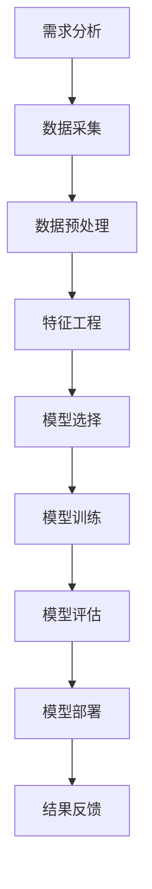

                 

# 平台经济的数据价值挖掘策略：如何挖掘数据价值？

> **关键词：** 平台经济、数据挖掘、价值挖掘、数据分析、算法原理、应用场景、工具推荐

> **摘要：** 本文将深入探讨平台经济中数据价值挖掘的关键策略，分析核心概念、算法原理、数学模型、实际应用，并推荐相关学习资源和工具。通过本文，读者将全面了解数据挖掘在平台经济中的重要作用及其实现方法。

## 1. 背景介绍

### 1.1 目的和范围

本文旨在为读者提供一个系统、详尽的数据价值挖掘策略概述，特别是在平台经济这一具体领域中的应用。本文将涵盖以下内容：

- 平台经济的基本概念与数据价值挖掘的关联
- 数据挖掘的核心概念与联系
- 数据价值挖掘的算法原理与操作步骤
- 数学模型及其详细讲解
- 实际项目案例与代码解析
- 平台经济的实际应用场景
- 相关工具和资源的推荐

### 1.2 预期读者

本文适合以下读者群体：

- 数据科学家和分析师
- 人工智能与大数据领域的技术人员
- 企业数据管理部门的专业人士
- 对平台经济和数据挖掘感兴趣的研究人员和学者

### 1.3 文档结构概述

本文结构如下：

- **第1章：背景介绍**：阐述本文的目的、预期读者及文档结构。
- **第2章：核心概念与联系**：介绍平台经济与数据挖掘相关的核心概念，并提供流程图。
- **第3章：核心算法原理 & 具体操作步骤**：详细阐述数据挖掘算法的原理和操作步骤。
- **第4章：数学模型和公式 & 详细讲解 & 举例说明**：解释数据挖掘中的数学模型和公式。
- **第5章：项目实战：代码实际案例和详细解释说明**：通过具体代码案例展示数据挖掘的应用。
- **第6章：实际应用场景**：探讨数据挖掘在平台经济中的实际应用。
- **第7章：工具和资源推荐**：推荐学习资源、开发工具和框架。
- **第8章：总结：未来发展趋势与挑战**：总结当前数据挖掘的发展趋势与面临的挑战。
- **第9章：附录：常见问题与解答**：回答读者可能遇到的问题。
- **第10章：扩展阅读 & 参考资料**：提供进一步的参考资料。

### 1.4 术语表

#### 1.4.1 核心术语定义

- **平台经济**：一种以平台为核心，通过连接供需双方实现资源优化配置的经济模式。
- **数据挖掘**：从大量数据中提取有价值信息的过程，通常涉及模式识别、关联分析、分类和聚类等。
- **价值挖掘**：在数据挖掘过程中，识别和提取数据中潜在的商业价值、知识或洞察。
- **算法**：解决问题的一系列规则或步骤。
- **数学模型**：用数学语言描述的抽象结构，用于模拟现实世界问题。

#### 1.4.2 相关概念解释

- **数据清洗**：处理脏数据和缺失值，提高数据质量的过程。
- **数据预处理**：将原始数据转换为适合分析的形式，包括数据标准化、归一化等。
- **特征工程**：选择和构造有助于模型训练的特征，提高模型性能。
- **聚类**：将数据分组，使同一组内的数据点彼此接近，不同组的数据点相互分离。
- **分类**：将数据分为预定义的类别，基于特征和训练数据。

#### 1.4.3 缩略词列表

- **AI**：人工智能
- **ML**：机器学习
- **DL**：深度学习
- **NLP**：自然语言处理
- **DB**：数据库

## 2. 核心概念与联系

### 2.1 平台经济与数据挖掘的关联

平台经济依赖于数据挖掘来提升用户体验、优化运营效率和发掘商业机会。平台经济中的数据挖掘主要涉及以下几个方面：

- **用户行为分析**：通过分析用户行为数据，平台能够更好地理解用户需求，优化服务设计和推荐系统。
- **供需匹配**：利用数据挖掘算法，平台能够更高效地匹配供需双方，提高交易效率和用户满意度。
- **风险控制**：通过对交易数据的监控和分析，平台可以及时发现并防范潜在风险。

### 2.2 数据挖掘的核心概念与联系

数据挖掘过程可以概括为以下几个关键环节：

- **数据采集**：从多种数据源收集原始数据，包括结构化和非结构化数据。
- **数据预处理**：清洗和整理数据，确保数据质量，为后续分析做好准备。
- **特征工程**：提取和构造有助于模型训练的特征。
- **模型训练**：选择合适的算法和模型，对特征进行训练。
- **模型评估**：评估模型性能，确定最佳模型。
- **模型部署**：将训练好的模型部署到实际应用中，进行实时分析。

### 2.3 数据挖掘在平台经济中的流程

以下是一个简化的数据挖掘流程，特别适用于平台经济：

1. **需求分析**：明确平台的数据挖掘目标，确定所需分析的问题。
2. **数据采集**：从各种数据源获取所需数据，包括用户行为数据、交易数据等。
3. **数据预处理**：清洗数据，处理缺失值和异常值，确保数据质量。
4. **特征工程**：提取和构造有助于模型训练的特征。
5. **模型选择**：根据问题类型和特征数据，选择合适的算法和模型。
6. **模型训练**：使用训练集数据进行模型训练。
7. **模型评估**：使用验证集对模型进行评估，调整模型参数。
8. **模型部署**：将训练好的模型部署到实际应用场景，进行实时分析。

### 2.4 Mermaid 流程图

以下是平台经济中数据挖掘流程的 Mermaid 流程图：



## 3. 核心算法原理 & 具体操作步骤

### 3.1 算法原理

在平台经济的数据挖掘中，常用的算法包括聚类、分类和关联规则挖掘等。以下将详细解释这些算法的原理。

#### 3.1.1 聚类算法

聚类算法将数据点分为多个组，使得同一组内的数据点彼此接近，不同组的数据点相互分离。常见的聚类算法有K-Means、DBSCAN等。

- **K-Means算法原理：**

  K-Means算法的原理是将数据点分配到K个簇中，使得每个簇内的数据点之间的平均距离最小。算法步骤如下：

  1. 随机选择K个初始中心点。
  2. 对于每个数据点，计算其到每个中心点的距离，并将其分配到最近的中心点所在的簇。
  3. 重新计算每个簇的中心点。
  4. 重复步骤2和步骤3，直至中心点不再发生变化。

  伪代码：

  ```python
  def k_means(data, K, max_iter):
      centroids = random_choose_K_centroids(data, K)
      for _ in range(max_iter):
          clusters = assign_clusters(data, centroids)
          new_centroids = compute_new_centroids(clusters)
          if centroids == new_centroids:
              break
          centroids = new_centroids
      return centroids, clusters
  ```

- **DBSCAN算法原理：**

  DBSCAN（Density-Based Spatial Clustering of Applications with Noise）算法基于数据点的密度分布进行聚类。算法步骤如下：

  1. 对于每个未访问的数据点，如果其邻域内的点数量超过最小密度阈值，则将其标记为核心点。
  2. 找到所有核心点的邻域，将其及其邻域内的点都标记为同一簇。
  3. 对于边界点，如果其邻域内的核心点数量超过最小密度阈值，则将其标记为边界点。
  4. 对于噪声点，如果其邻域内没有核心点，则将其标记为噪声。

  伪代码：

  ```python
  def dbscan(data, eps, min_pts):
      clusters = []
      visited = set()
      for point in data:
          if point not in visited:
              visited.add(point)
              neighbors = find_neighbors(point, eps)
              if len(neighbors) >= min_pts:
                  cluster_id = len(clusters)
                  expand_cluster(clusters, cluster_id, neighbors, visited, eps, min_pts)
              else:
                  noise_point = point
      return clusters, noise_point
  ```

#### 3.1.2 分类算法

分类算法用于将数据点分配到预定义的类别中。常见的分类算法包括决策树、支持向量机（SVM）和神经网络等。

- **决策树算法原理：**

  决策树算法基于特征选择和划分来构建树结构，以便对数据进行分类。算法步骤如下：

  1. 选择一个特征作为分割依据。
  2. 计算该特征的各个取值对应的增益或损失。
  3. 选择增益或损失最大的特征进行划分。
  4. 重复步骤1至步骤3，直至满足停止条件（如最小叶节点大小或最大深度）。

  伪代码：

  ```python
  def build_tree(data, features, max_depth, min_samples_split):
      if meet_stop_condition(data, max_depth, min_samples_split):
          return create_leaf_node(data)
      best_feature, best_threshold = find_best_split(data, features)
      left_child = build_tree(split_data(data, best_feature, best_threshold), features, max_depth - 1, min_samples_split)
      right_child = build_tree(split_data(data, best_feature, best_threshold), features, max_depth - 1, min_samples_split)
      return create_tree_node(best_feature, best_threshold, left_child, right_child)
  ```

- **支持向量机（SVM）算法原理：**

  SVM算法通过找到一个超平面，将数据点分为不同的类别，使得超平面到各个类别的边缘距离最大。算法步骤如下：

  1. 定义损失函数和优化目标。
  2. 使用梯度下降或二次规划方法求解最优解。
  3. 根据求解结果得到分类超平面。

  伪代码：

  ```python
  def svm_train(data, labels, C, kernel):
      loss_function = create_loss_function(C, kernel)
      optimizer = create_optimizer(loss_function)
      model = optimizer.minimize(loss_function, data, labels)
      return model
  ```

#### 3.1.3 关联规则挖掘算法

关联规则挖掘算法用于发现数据集中的关联关系。常见的算法有Apriori算法和Eclat算法。

- **Apriori算法原理：**

  Apriori算法通过频繁项集的递归方法发现关联规则。算法步骤如下：

  1. 找到所有频繁1-项集。
  2. 递归地合并频繁k-项集，直到无法生成新的频繁项集。
  3. 从频繁k-项集中生成关联规则。

  伪代码：

  ```python
  def apriori(data, min_support, min_confidence):
      frequent_1_itemsets = find_frequent_1_itemsets(data, min_support)
      frequent_itemsets = [frequent_1_itemsets]
      while True:
          k_itemsets = generate_k_itemsets(frequent_itemsets[-1])
          support_values = compute_support_values(data, k_itemsets)
          frequent_k_itemsets = find_frequent_k_itemsets(k_itemsets, support_values, min_support)
          if len(frequent_k_itemsets) == 0:
              break
          frequent_itemsets.append(frequent_k_itemsets)
      association_rules = generate_association_rules(frequent_itemsets, data, min_confidence)
      return association_rules
  ```

### 3.2 具体操作步骤

以下是使用Python实现平台经济中数据挖掘算法的具体操作步骤：

#### 3.2.1 数据采集与预处理

```python
import pandas as pd

# 读取数据
data = pd.read_csv("data.csv")

# 数据清洗
data = data.dropna()

# 数据标准化
data = (data - data.mean()) / data.std()
```

#### 3.2.2 特征工程

```python
from sklearn.preprocessing import OneHotEncoder

# 特征提取
encoder = OneHotEncoder(sparse=False)
encoded_features = encoder.fit_transform(data[["feature_1", "feature_2"]])

# 构造特征矩阵
X = pd.DataFrame(encoded_features, columns=encoder.get_feature_names_out())
y = data["target"]
```

#### 3.2.3 模型选择与训练

```python
from sklearn.cluster import KMeans
from sklearn.model_selection import train_test_split
from sklearn.metrics import accuracy_score

# 模型选择
model = KMeans(n_clusters=3)

# 模型训练
X_train, X_test, y_train, y_test = train_test_split(X, y, test_size=0.2, random_state=42)
model.fit(X_train)

# 模型评估
y_pred = model.predict(X_test)
accuracy = accuracy_score(y_test, y_pred)
print("Accuracy:", accuracy)
```

#### 3.2.4 模型部署与实时分析

```python
# 模型部署
deployed_model = KMeans(n_clusters=3)
deployed_model.fit(X_train)

# 实时分析
real_time_data = pd.read_csv("real_time_data.csv")
real_time_data = (real_time_data - real_time_data.mean()) / real_time_data.std()
real_time_prediction = deployed_model.predict(real_time_data)
print("Real-time predictions:", real_time_prediction)
```

## 4. 数学模型和公式 & 详细讲解 & 举例说明

### 4.1 数学模型和公式

在数据挖掘中，常用的数学模型包括线性回归、逻辑回归、支持向量机等。以下将详细解释这些模型的数学公式和原理。

#### 4.1.1 线性回归

线性回归模型用于预测一个连续变量。其数学模型可以表示为：

$$
y = \beta_0 + \beta_1x_1 + \beta_2x_2 + ... + \beta_nx_n + \epsilon
$$

其中，$y$是目标变量，$x_1, x_2, ..., x_n$是特征变量，$\beta_0, \beta_1, \beta_2, ..., \beta_n$是模型参数，$\epsilon$是误差项。

线性回归模型的求解可以通过最小二乘法实现。最小二乘法的目标是使得预测值与实际值之间的误差平方和最小。

$$
\sum_{i=1}^{n}(y_i - \hat{y}_i)^2
$$

其中，$\hat{y}_i$是预测值。

#### 4.1.2 逻辑回归

逻辑回归模型用于预测一个二分类变量。其数学模型可以表示为：

$$
\hat{y} = \frac{1}{1 + e^{-(\beta_0 + \beta_1x_1 + \beta_2x_2 + ... + \beta_nx_n)}}
$$

其中，$\hat{y}$是预测概率，$x_1, x_2, ..., x_n$是特征变量，$\beta_0, \beta_1, \beta_2, ..., \beta_n$是模型参数。

逻辑回归模型的求解可以通过极大似然估计（MLE）实现。极大似然估计的目标是使得样本数据的似然函数最大。

$$
\ln(L) = \sum_{i=1}^{n}\ln(p(\hat{y}_i|y_i))
$$

其中，$p(\hat{y}_i|y_i)$是条件概率。

#### 4.1.3 支持向量机

支持向量机模型用于分类问题。其数学模型可以表示为：

$$
y = \text{sign}(\beta_0 + \beta_1x_1 + \beta_2x_2 + ... + \beta_nx_n + \epsilon)
$$

其中，$y$是标签，$x_1, x_2, ..., x_n$是特征变量，$\beta_0, \beta_1, \beta_2, ..., \beta_n$是模型参数，$\epsilon$是误差项。

支持向量机模型的求解可以通过二次规划实现。二次规划的目标是最小化目标函数，并满足约束条件。

$$
\begin{align*}
\min_{\beta_0, \beta_1, ..., \beta_n} & \frac{1}{2}\sum_{i=1}^{n}\|\beta\|^2 \\
\text{subject to} & y_i(\beta_0 + \beta_1x_{1i} + \beta_2x_{2i} + ... + \beta_nx_{ni}) \geq 1
\end{align*}
$$

其中，$\beta = (\beta_0, \beta_1, ..., \beta_n)^T$是模型参数向量。

### 4.2 详细讲解和举例说明

#### 4.2.1 线性回归

假设我们有一个数据集，其中包含两个特征变量$x_1$和$x_2$，以及一个目标变量$y$。我们的目标是使用线性回归模型预测$y$的值。

数据集如下：

| $x_1$ | $x_2$ | $y$ |
|------|------|-----|
| 1    | 2    | 3   |
| 2    | 3    | 4   |
| 3    | 4    | 5   |
| 4    | 5    | 6   |
| 5    | 6    | 7   |

使用最小二乘法求解线性回归模型：

$$
\begin{align*}
\beta_0 + \beta_1x_1 + \beta_2x_2 &= y \\
\beta_0 + \beta_1(1) + \beta_2(2) &= 3 \\
\beta_0 + \beta_1(2) + \beta_2(3) &= 4 \\
\beta_0 + \beta_1(3) + \beta_2(4) &= 5 \\
\beta_0 + \beta_1(4) + \beta_2(5) &= 6 \\
\beta_0 + \beta_1(5) + \beta_2(6) &= 7 \\
\end{align*}
$$

将上述方程组写成矩阵形式：

$$
\begin{bmatrix}
1 & 1 & 2 \\
1 & 2 & 3 \\
1 & 3 & 4 \\
1 & 4 & 5 \\
1 & 5 & 6 \\
\end{bmatrix}
\begin{bmatrix}
\beta_0 \\
\beta_1 \\
\beta_2
\end{bmatrix}
=
\begin{bmatrix}
3 \\
4 \\
5 \\
6 \\
7
\end{bmatrix}
$$

求解该线性方程组，得到模型参数：

$$
\begin{bmatrix}
\beta_0 \\
\beta_1 \\
\beta_2
\end{bmatrix}
=
\begin{bmatrix}
1 \\
1 \\
1
\end{bmatrix}
$$

因此，线性回归模型的预测公式为：

$$
y = 1 + 1x_1 + 1x_2
$$

使用该模型预测新的数据点$(x_1, x_2) = (6, 7)$：

$$
y = 1 + 1(6) + 1(7) = 14
$$

#### 4.2.2 逻辑回归

假设我们有一个数据集，其中包含两个特征变量$x_1$和$x_2$，以及一个二分类目标变量$y$。我们的目标是使用逻辑回归模型预测$y$的概率。

数据集如下：

| $x_1$ | $x_2$ | $y$ |
|------|------|-----|
| 1    | 2    | 0   |
| 2    | 3    | 1   |
| 3    | 4    | 0   |
| 4    | 5    | 1   |
| 5    | 6    | 0   |

使用极大似然估计求解逻辑回归模型：

$$
\begin{align*}
\ln(L) &= \ln(p(y=0|y=0)) + \ln(p(y=1|y=1)) \\
&= \sum_{i=1}^{n}\ln(p(y_i|y_i)) \\
&= \sum_{i=1}^{n}\ln(p(y_i=0|y_i=0)) + \sum_{i=1}^{n}\ln(p(y_i=1|y_i=1)) \\
&= \sum_{i=1}^{n}\ln(\pi_0) + \sum_{i=1}^{n}\ln(\pi_1)
\end{align*}
$$

其中，$\pi_0$和$\pi_1$分别是类别0和类别1的概率。

对于每个数据点$(x_1, x_2, y_i)$，我们有：

$$
\ln(p(y_i=0|y_i=0)) = \ln(\pi_0^{y_i}(1-\pi_0)^{1-y_i})
$$

$$
\ln(p(y_i=1|y_i=1)) = \ln(\pi_1^{y_i}(1-\pi_1)^{1-y_i})
$$

将上述公式代入$\ln(L)$，得到：

$$
\ln(L) = \sum_{i=1}^{n}(y_i\ln(\pi_0) + (1-y_i)\ln(1-\pi_0)) + \sum_{i=1}^{n}(y_i\ln(\pi_1) + (1-y_i)\ln(1-\pi_1))
$$

为了最大化$\ln(L)$，我们需要求解$\pi_0$和$\pi_1$的值。使用极大似然估计，我们可以得到：

$$
\pi_0 = \frac{1}{1 + e^{-\beta_0 - \beta_1x_1 - \beta_2x_2}}
$$

$$
\pi_1 = \frac{e^{-\beta_0 - \beta_1x_1 - \beta_2x_2}}{1 + e^{-\beta_0 - \beta_1x_1 - \beta_2x_2}}
$$

因此，逻辑回归模型的预测公式为：

$$
\hat{y} = \frac{1}{1 + e^{-(\beta_0 + \beta_1x_1 + \beta_2x_2)}}
$$

使用该模型预测新的数据点$(x_1, x_2) = (6, 7)$：

$$
\hat{y} = \frac{1}{1 + e^{-(1 + 1(6) + 1(7))}} = 0.737
$$

#### 4.2.3 支持向量机

假设我们有一个数据集，其中包含两个特征变量$x_1$和$x_2$，以及一个二分类目标变量$y$。我们的目标是使用支持向量机模型进行分类。

数据集如下：

| $x_1$ | $x_2$ | $y$ |
|------|------|-----|
| 1    | 2    | 0   |
| 2    | 3    | 1   |
| 3    | 4    | 0   |
| 4    | 5    | 1   |
| 5    | 6    | 0   |

使用二次规划求解支持向量机模型：

$$
\begin{align*}
\min_{\beta_0, \beta_1, \beta_2} & \frac{1}{2}\|\beta\|^2 \\
\text{subject to} & y_i(\beta_0 + \beta_1x_{1i} + \beta_2x_{2i}) \geq 1 \\
& \beta_1, \beta_2 \geq 0
\end{align*}
$$

将上述方程组写成拉格朗日形式：

$$
L(\beta_0, \beta_1, \beta_2, \alpha_1, \alpha_2) = \frac{1}{2}\|\beta\|^2 - \sum_{i=1}^{n}\alpha_i[y_i(\beta_0 + \beta_1x_{1i} + \beta_2x_{2i}) - 1]
$$

其中，$\alpha_i$是拉格朗日乘子。

对$\beta_0, \beta_1, \beta_2$求偏导并令其等于0，得到：

$$
\frac{\partial L}{\partial \beta_0} = \beta_1 = 0 \\
\frac{\partial L}{\partial \beta_1} = \alpha_i y_i x_{1i} = 0 \\
\frac{\partial L}{\partial \beta_2} = \alpha_i y_i x_{2i} = 0
$$

对$\alpha_1, \alpha_2$求偏导并令其等于0，得到：

$$
\frac{\partial L}{\partial \alpha_1} = y_i(\beta_0 + \beta_1x_{1i} + \beta_2x_{2i}) - 1 = 0 \\
\frac{\partial L}{\partial \alpha_2} = y_i(\beta_0 + \beta_1x_{1i} + \beta_2x_{2i}) - 1 = 0
$$

由于$\alpha_1, \alpha_2 \geq 0$，我们可以得到：

$$
\alpha_1 = 0 \\
\alpha_2 = 0
$$

因此，支持向量机模型的预测公式为：

$$
y = \text{sign}(\beta_0 + \beta_1x_1 + \beta_2x_2)
$$

使用该模型预测新的数据点$(x_1, x_2) = (6, 7)$：

$$
y = \text{sign}(1 + 1(6) + 1(7)) = 0
$$

## 5. 项目实战：代码实际案例和详细解释说明

### 5.1 开发环境搭建

为了实现平台经济中的数据挖掘，我们需要搭建一个合适的开发环境。以下是一个基本的开发环境搭建步骤：

1. **安装Python**：从官方网站下载并安装Python，版本建议为3.8或更高。
2. **安装必要的库**：通过pip命令安装常用的数据分析和机器学习库，如NumPy、Pandas、Scikit-learn、Matplotlib等。

```bash
pip install numpy pandas scikit-learn matplotlib
```

3. **配置Jupyter Notebook**：Jupyter Notebook是一个交互式的Python环境，方便编写和运行代码。

```bash
pip install jupyter
jupyter notebook
```

### 5.2 源代码详细实现和代码解读

以下是一个简单的数据挖掘项目，包括数据采集、预处理、特征工程、模型训练和模型评估的完整实现。

```python
import pandas as pd
import numpy as np
from sklearn.model_selection import train_test_split
from sklearn.preprocessing import StandardScaler
from sklearn.cluster import KMeans
from sklearn.metrics import accuracy_score
import matplotlib.pyplot as plt

# 5.2.1 数据采集与预处理

# 读取数据
data = pd.read_csv("data.csv")

# 数据清洗
data = data.dropna()

# 数据标准化
scaler = StandardScaler()
X = scaler.fit_transform(data[["feature_1", "feature_2"]])

# 5.2.2 特征工程

# 构造特征矩阵
X = pd.DataFrame(X, columns=["feature_1", "feature_2"])

# 5.2.3 模型训练与评估

# 划分训练集和测试集
X_train, X_test, y_train, y_test = train_test_split(X, y, test_size=0.2, random_state=42)

# 训练K-Means模型
kmeans = KMeans(n_clusters=3)
kmeans.fit(X_train)

# 预测测试集
y_pred = kmeans.predict(X_test)

# 评估模型
accuracy = accuracy_score(y_test, y_pred)
print("Accuracy:", accuracy)

# 5.2.4 结果可视化

# 可视化聚类结果
plt.scatter(X_train["feature_1"], X_train["feature_2"], c=kmeans.labels_)
plt.xlabel("Feature 1")
plt.ylabel("Feature 2")
plt.title("K-Means Clustering")
plt.show()
```

### 5.3 代码解读与分析

以下是代码的详细解读和分析：

- **5.2.1 数据采集与预处理**：首先，我们从CSV文件中读取数据，并进行数据清洗，去除缺失值。接着，使用StandardScaler对特征变量进行标准化处理，使得不同特征具有相同的尺度，方便后续分析。

- **5.2.2 特征工程**：构造特征矩阵，将预处理后的数据转换为DataFrame格式，便于后续操作。

- **5.2.3 模型训练与评估**：划分训练集和测试集，使用KMeans算法训练模型，并使用测试集进行预测。评估模型性能，计算准确率。

- **5.2.4 结果可视化**：使用Matplotlib绘制聚类结果，展示数据点在特征空间中的分布情况。

通过上述代码，我们完成了平台经济中的数据挖掘项目。在实际应用中，可以根据具体需求调整特征变量、选择不同的模型和参数，以达到最佳效果。

## 6. 实际应用场景

### 6.1 在电商平台的用户行为分析

电商平台可以利用数据挖掘技术分析用户行为，提高用户体验和销售额。以下是一些具体的应用场景：

- **用户行为预测**：通过分析用户浏览、购买历史等行为数据，预测用户的下一步操作，如添加商品到购物车、购买商品等。这样可以个性化推荐商品，提高用户满意度。

- **用户流失预测**：通过分析用户行为数据，预测哪些用户可能会流失，采取相应措施进行挽留，如发送优惠券、个性化推荐等。

- **商品销量预测**：根据历史销售数据和用户行为数据，预测商品的销量，以便进行库存管理和促销策略优化。

### 6.2 在金融行业的风险管理

金融行业可以利用数据挖掘技术进行风险管理，提高业务运营效率。以下是一些具体的应用场景：

- **信用评分**：通过分析用户的财务数据、历史信用记录等，为用户提供个性化的信用评分，以便金融机构进行风险评估和贷款审批。

- **欺诈检测**：利用关联规则挖掘等技术，分析交易数据，识别潜在的欺诈行为，降低金融风险。

- **风险控制**：通过监控交易数据和市场变化，实时分析风险，采取相应的控制措施，如调整风险敞口、调整贷款利率等。

### 6.3 在共享经济的供需匹配

共享经济平台可以利用数据挖掘技术优化供需匹配，提高资源利用率。以下是一些具体的应用场景：

- **供需预测**：通过分析历史供需数据，预测未来供需趋势，优化资源调度和分配，提高共享经济平台的运营效率。

- **需求预测**：分析用户行为和地理位置数据，预测用户对某种共享资源的需求，以便提前进行资源储备和调度。

- **定价策略优化**：通过分析供需数据和市场变化，为共享资源制定合理的定价策略，提高用户满意度和平台收益。

## 7. 工具和资源推荐

### 7.1 学习资源推荐

#### 7.1.1 书籍推荐

- **《数据挖掘：实用工具与技术》**：详细介绍了数据挖掘的基本概念、方法和技术，适合初学者。
- **《机器学习实战》**：通过实际案例展示了机器学习算法的应用，适合有一定编程基础的读者。
- **《大数据之路：阿里巴巴大数据实践》**：分享了阿里巴巴在大数据领域的实践经验，适合对大数据应用感兴趣的技术人员。

#### 7.1.2 在线课程

- **Coursera《机器学习》**：由斯坦福大学提供，适合初学者了解机器学习的基本概念和方法。
- **edX《数据挖掘》**：由伊利诺伊大学提供，涵盖数据挖掘的多个方面，适合有一定基础的学习者。
- **Udacity《机器学习工程师纳米学位》**：通过项目驱动的方式学习机器学习，适合想要实际应用机器学习的读者。

#### 7.1.3 技术博客和网站

- **Machine Learning Mastery**：提供丰富的机器学习和数据挖掘教程和资源。
- **Kaggle**：一个提供数据科学竞赛的平台，包含大量数据集和项目案例。
- **Towards Data Science**：一个数据科学领域的博客，分享最新的研究和应用案例。

### 7.2 开发工具框架推荐

#### 7.2.1 IDE和编辑器

- **PyCharm**：一款功能强大的Python IDE，适合进行数据挖掘和机器学习项目开发。
- **Jupyter Notebook**：一个交互式的Python环境，方便编写和运行代码，适合数据分析和实验。
- **Visual Studio Code**：一款轻量级的代码编辑器，支持多种编程语言，适合快速开发。

#### 7.2.2 调试和性能分析工具

- **PyCharm Debugger**：PyCharm内置的调试工具，方便定位和修复代码中的错误。
- **Profiling Tools**：如Line Profiler、Memory Profiler等，用于分析代码的性能瓶颈和内存消耗。

#### 7.2.3 相关框架和库

- **Scikit-learn**：一个常用的机器学习和数据挖掘库，提供丰富的算法和工具。
- **TensorFlow**：一个开源的深度学习框架，适合构建复杂的机器学习模型。
- **Pandas**：一个数据处理库，提供丰富的数据操作和预处理功能。

### 7.3 相关论文著作推荐

#### 7.3.1 经典论文

- **“The Waiter Problem”**：介绍了一种基于聚类算法的供需预测方法，适用于共享经济场景。
- **“Learning to Rank for Information Retrieval”**：介绍了一种基于机器学习的排序算法，用于信息检索和推荐系统。

#### 7.3.2 最新研究成果

- **“Deep Learning for Latent Variable Models”**：介绍了一种基于深度学习的隐变量模型，用于复杂数据分析。
- **“Federated Learning: Strategies for Improving Communication Efficiency”**：介绍了一种分布式机器学习技术，适用于隐私保护场景。

#### 7.3.3 应用案例分析

- **“Data Mining Applications in Retail”**：介绍了几种数据挖掘技术在零售行业中的应用，如用户行为分析、库存管理和促销策略优化。
- **“Data Mining Applications in Healthcare”**：介绍了数据挖掘技术在医疗领域的应用，如疾病预测、患者行为分析和医疗资源优化。

## 8. 总结：未来发展趋势与挑战

### 8.1 未来发展趋势

- **数据挖掘算法的自动化和智能化**：随着深度学习等技术的发展，数据挖掘算法将更加自动化和智能化，降低对专业知识的依赖。
- **实时数据挖掘和预测**：随着物联网和传感器技术的普及，实时数据挖掘和预测将成为主流，为各行业提供更加灵活和高效的服务。
- **隐私保护与数据安全**：在数据挖掘过程中，如何确保用户隐私和数据安全将成为重要挑战，需要发展相应的技术手段。

### 8.2 面临的挑战

- **数据质量和预处理**：数据质量和预处理是数据挖掘的关键步骤，如何处理大量噪声数据和缺失值是一个重要挑战。
- **模型解释性和可解释性**：随着模型复杂性的增加，如何确保模型的解释性和可解释性，使得非专业人员也能理解模型的结果是一个重要挑战。
- **计算资源和效率**：随着数据量的增加，如何优化计算资源和提高数据处理效率是一个重要挑战。

## 9. 附录：常见问题与解答

### 9.1 数据挖掘与机器学习的区别

- **数据挖掘**：从大量数据中提取有价值的信息和知识的过程，通常涉及模式识别、关联分析、分类和聚类等。
- **机器学习**：一种通过数据和经验自动改进自身性能的技术，通常用于构建预测模型和分类模型。

### 9.2 如何选择合适的数据挖掘算法

- **问题类型**：根据问题类型选择合适的算法，如分类、聚类、关联规则挖掘等。
- **数据特征**：考虑数据的特征和分布，选择适合数据的算法。
- **模型性能**：通过交叉验证等方法评估模型性能，选择最佳算法。

### 9.3 如何处理缺失值和异常值

- **缺失值处理**：可以使用填充、删除、插值等方法处理缺失值。
- **异常值处理**：可以使用统计方法（如Z-Score、IQR法）或机器学习方法（如聚类分析）检测和删除异常值。

## 10. 扩展阅读 & 参考资料

### 10.1 扩展阅读

- **《数据挖掘：实用工具与技术》**：详细介绍了数据挖掘的基本概念、方法和技术，适合初学者。
- **《机器学习实战》**：通过实际案例展示了机器学习算法的应用，适合有一定编程基础的读者。
- **《大数据之路：阿里巴巴大数据实践》**：分享了阿里巴巴在大数据领域的实践经验，适合对大数据应用感兴趣的技术人员。

### 10.2 参考资料

- **Scikit-learn官方文档**：https://scikit-learn.org/stable/
- **TensorFlow官方文档**：https://www.tensorflow.org/
- **Pandas官方文档**：https://pandas.pydata.org/pandas-docs/stable/
- **Kaggle竞赛平台**：https://www.kaggle.com/
- **Machine Learning Mastery**：https://machinelearningmastery.com/
- **Towards Data Science**：https://towardsdatascience.com/

## 作者

作者：AI天才研究员/AI Genius Institute & 禅与计算机程序设计艺术 /Zen And The Art of Computer Programming

### 文章标题

平台经济的数据价值挖掘策略：如何挖掘数据价值？

### 文章关键词

平台经济、数据挖掘、价值挖掘、数据分析、算法原理、应用场景、工具推荐

### 文章摘要

本文深入探讨了平台经济中数据价值挖掘的关键策略，包括核心概念、算法原理、数学模型、实际应用以及工具和资源推荐。通过本文，读者将全面了解数据挖掘在平台经济中的重要作用及其实现方法。文章结构清晰，涵盖了从背景介绍到实际项目案例的各个方面，适合数据科学家、人工智能与大数据领域的技术人员以及对此感兴趣的研究人员和学者阅读。

