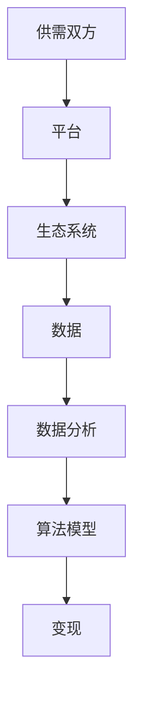

                 

# 平台经济的数据价值：如何实现数据变现？

## 关键词
平台经济、数据变现、价值挖掘、数据分析、算法模型、商业应用

## 摘要
本文将深入探讨平台经济中的数据价值实现问题。首先，我们将介绍平台经济的背景和核心特点，随后详细分析数据在其中的关键作用。接着，我们将逐步讲解如何通过数据分析、算法模型来挖掘数据价值，并探索数据变现的具体策略。最后，我们将结合实际案例，讨论平台经济中数据价值的商业应用，并提供未来发展趋势与挑战的展望。

## 1. 背景介绍

### 1.1 目的和范围
本文旨在通过逻辑分析和具体案例，探讨平台经济中数据价值的挖掘与变现。我们将聚焦于以下几个方面：
- 平台经济的定义与核心要素
- 数据在平台经济中的角色
- 数据分析技术及其应用
- 数据变现策略与方法
- 平台经济的商业应用与未来展望

### 1.2 预期读者
本文适合以下读者群体：
- 对平台经济和数据分析感兴趣的从业者
- 数据科学家、分析师和业务决策者
- IT专业人士和软件开发者
- 对商业智能和数字化转型感兴趣的学者和学生

### 1.3 文档结构概述
本文将按照以下结构展开：
- 引言：平台经济的背景介绍
- 核心概念与联系
- 核心算法原理与具体操作步骤
- 数学模型与公式
- 项目实战与代码案例
- 实际应用场景
- 工具和资源推荐
- 总结：未来发展趋势与挑战
- 附录：常见问题与解答
- 扩展阅读与参考资料

### 1.4 术语表

#### 1.4.1 核心术语定义
- **平台经济**：一种以互联网和数字技术为基础，通过连接供需双方，提供服务和产品的商业模式。
- **数据变现**：将数据转换为经济价值的过程，通常涉及数据分析和商业应用。
- **数据分析**：利用统计学、机器学习和数据挖掘技术，对数据进行处理和分析，以提取有价值的信息。
- **算法模型**：用于处理和分析数据的数学公式和逻辑结构。

#### 1.4.2 相关概念解释
- **大数据**：数据量巨大，类型繁多，生成速度快，无法用传统数据处理工具进行有效处理的数据集合。
- **数据挖掘**：从大量数据中发现有价值信息的过程。
- **机器学习**：使计算机系统能够从数据中学习并做出预测或决策的技术。

#### 1.4.3 缩略词列表
- **API**：应用程序编程接口（Application Programming Interface）
- **AI**：人工智能（Artificial Intelligence）
- **ML**：机器学习（Machine Learning）
- **DL**：深度学习（Deep Learning）
- **BI**：商业智能（Business Intelligence）

## 2. 核心概念与联系

### 平台经济的核心概念与联系

平台经济是一种基于互联网和数字技术的商业模式，它通过构建一个中间平台，连接供需双方，从而实现资源的高效配置和服务创新。以下是平台经济的核心概念及其相互联系：

#### 概念1：供需双方
平台经济中的核心参与者是供需双方。供给方提供产品或服务，需求方则是消费者或商家。

#### 概念2：平台
平台是连接供需双方的中介，提供交易、沟通、支付等服务。平台的类型多样，包括电商、金融、交通、住宿等。

#### 概念3：生态系统
平台经济不仅仅是单一平台的存在，而是一个由多个相关方构成的生态系统。生态系统中的各个组成部分相互依存、共同成长。

#### 概念4：数据
数据是平台经济的重要资产。通过数据，平台可以更好地了解用户需求，优化服务，提高运营效率。

#### 概念5：数据分析与算法模型
平台利用数据进行分析，构建算法模型，以实现个性化推荐、风险控制、预测分析等应用。

#### 概念6：变现
平台通过数据变现，将数据价值转化为经济收益。变现的方式包括广告收入、服务收费、数据销售等。

### Mermaid 流程图



## 3. 核心算法原理与具体操作步骤

### 数据分析技术

数据分析是挖掘数据价值的关键步骤，它涉及多种技术手段。以下是常用的数据分析技术及其基本原理：

#### 3.1 数据采集与清洗
- **数据采集**：通过各种渠道收集原始数据，如用户行为数据、交易数据等。
- **数据清洗**：处理数据中的噪声和错误，确保数据质量。

#### 3.2 数据存储与管理
- **数据仓库**：将数据存储在一个集中的地方，便于管理和分析。
- **NoSQL数据库**：适用于处理大规模非结构化数据。

#### 3.3 数据预处理
- **数据集成**：将来自不同来源的数据整合在一起。
- **特征工程**：提取和构造有助于模型训练的特征。

#### 3.4 数据分析算法
- **统计方法**：如回归分析、聚类分析等。
- **机器学习方法**：如决策树、随机森林、支持向量机等。
- **深度学习方法**：如卷积神经网络、循环神经网络等。

### 具体操作步骤

#### 步骤1：数据采集与清洗
- **采集数据**：使用API、爬虫等技术获取数据。
- **数据清洗**：去除重复数据、处理缺失值和异常值。

#### 步骤2：数据存储与管理
- **选择数据仓库**：根据数据类型和规模选择合适的数据仓库。
- **数据导入**：将清洗后的数据导入数据仓库。

#### 步骤3：数据预处理
- **数据集成**：将不同来源的数据合并。
- **特征工程**：提取特征并进行归一化、离散化等处理。

#### 步骤4：数据分析与建模
- **数据探索**：使用统计方法进行数据探索性分析。
- **模型训练**：选择合适的算法模型进行训练。
- **模型评估**：评估模型性能，并进行调优。

#### 步骤5：数据变现
- **个性化推荐**：基于用户行为数据，为用户提供个性化推荐。
- **风险控制**：使用算法模型进行风险评估和预测。
- **数据销售**：将数据转化为经济收益，如数据报告、API接口等。

### 伪代码示例

```python
# 数据清洗
data = load_data()
cleaned_data = clean_data(data)

# 数据预处理
processed_data = preprocess_data(cleaned_data)

# 模型训练
model = train_model(processed_data)

# 模型评估
evaluation = evaluate_model(model, test_data)

# 数据变现
revenue = monetize_data(model, test_data)
```

## 4. 数学模型和公式与详细讲解与举例说明

### 数学模型介绍

在数据分析与机器学习中，常用的数学模型包括线性回归、决策树、支持向量机等。以下是这些模型的简要介绍：

#### 4.1 线性回归

线性回归是一种用于预测数值型变量的统计方法。其基本公式为：

\[ y = \beta_0 + \beta_1x_1 + \beta_2x_2 + ... + \beta_nx_n + \epsilon \]

其中，\( y \) 是因变量，\( x_1, x_2, ..., x_n \) 是自变量，\( \beta_0, \beta_1, ..., \beta_n \) 是模型的参数，\( \epsilon \) 是误差项。

#### 4.2 决策树

决策树是一种用于分类和回归的机器学习方法。其基本结构包括根节点、内部节点和叶节点。决策树通过一系列条件判断，将数据划分为不同的区域。

#### 4.3 支持向量机

支持向量机是一种用于分类和回归的算法。其基本思想是找到最佳的超平面，使得分类效果最佳。其目标函数为：

\[ \min_{\beta, \beta_0} \frac{1}{2} ||\beta||^2 + C \sum_{i=1}^{n} \xi_i \]

其中，\( \beta \) 是权重向量，\( \beta_0 \) 是偏置项，\( C \) 是惩罚参数，\( \xi_i \) 是误差项。

### 举例说明

#### 4.1 线性回归实例

假设我们有一组数据，表示房屋价格与房屋面积的关系。我们可以使用线性回归模型来预测房屋价格。数据如下：

| 面积（平方米） | 价格（万元） |
|----------------|--------------|
| 80             | 200          |
| 100            | 250          |
| 120            | 300          |
| 140            | 350          |
| 160            | 400          |

首先，我们进行数据清洗和预处理，然后使用线性回归模型进行训练。训练后，我们可以得到以下模型：

\[ 价格 = 100 + 1.5 \times 面积 \]

使用该模型，我们可以预测一个面积为 110 平方米的房屋的价格：

\[ 价格 = 100 + 1.5 \times 110 = 205 \text{万元} \]

#### 4.2 决策树实例

假设我们有如下分类问题，需要根据特征 A 和特征 B 对数据进行分类：

| 特征 A | 特征 B | 类别 |
|--------|--------|------|
| A1     | B1     | C1   |
| A1     | B2     | C2   |
| A2     | B1     | C2   |
| A2     | B2     | C1   |

我们可以构建一个简单的决策树，以特征 A 和特征 B 为条件进行分类：

```
        +----- A1
        |
       / \
      /   \
     /     \
    /       \
   /         \
  +--------- B1  C1
        |
       / \
      /   \
     /     \
    /       \
   /         \
  +--------- B2  C2
```

#### 4.3 支持向量机实例

假设我们有如下二分类问题，需要根据特征 X1 和特征 X2 进行分类：

| X1 | X2 | 类别 |
|----|----|------|
| 1  | 1  | C1   |
| 2  | 0  | C1   |
| 1  | 2  | C2   |
| 3  | 1  | C2   |

我们可以使用支持向量机来训练模型，并找到最佳的超平面：

\[ \beta_1x_1 + \beta_2x_2 - \beta_0 = 0 \]

通过求解最优解，我们可以得到支持向量机的参数，从而实现分类。

## 5. 项目实战：代码实际案例和详细解释说明

### 5.1 开发环境搭建

在进行数据分析和数据变现的过程中，我们需要搭建一个合适的开发环境。以下是搭建开发环境的步骤：

#### 5.1.1 硬件环境

- **计算机**：一台配置较高的计算机，推荐配置为：
  - CPU：Intel i7 或 AMD Ryzen 7 以上
  - 内存：16GB 以上
  - 硬盘：1TB SSD

- **网络环境**：稳定的高速网络连接

#### 5.1.2 软件环境

- **操作系统**：Windows、Linux 或 macOS
- **编程语言**：Python（版本 3.8 以上）
- **数据分析库**：NumPy、Pandas、Scikit-learn、TensorFlow、Keras 等
- **数据库**：MySQL、PostgreSQL 或 MongoDB

### 5.2 源代码详细实现和代码解读

以下是一个基于 Python 的简单数据分析项目，用于挖掘用户行为数据中的价值，并实现数据变现。

#### 5.2.1 数据采集

```python
import pandas as pd

# 读取用户行为数据
data = pd.read_csv('user_behavior.csv')

# 数据清洗
data.drop_duplicates(inplace=True)
data.fillna(0, inplace=True)
```

#### 5.2.2 数据预处理

```python
# 特征工程
data['total_time'] = data['session_time'] + data['pause_time']
data['avg_session_time'] = data['session_time'] / data['total_time']
data['avg_pause_time'] = data['pause_time'] / data['total_time']

# 数据标准化
from sklearn.preprocessing import StandardScaler
scaler = StandardScaler()
data[['session_time', 'pause_time', 'total_time', 'avg_session_time', 'avg_pause_time']] = scaler.fit_transform(data[['session_time', 'pause_time', 'total_time', 'avg_session_time', 'avg_pause_time']])
```

#### 5.2.3 数据分析

```python
from sklearn.model_selection import train_test_split
from sklearn.ensemble import RandomForestClassifier

# 划分训练集和测试集
X = data[['session_time', 'pause_time', 'total_time', 'avg_session_time', 'avg_pause_time']]
y = data['conversion']

X_train, X_test, y_train, y_test = train_test_split(X, y, test_size=0.2, random_state=42)

# 模型训练
model = RandomForestClassifier(n_estimators=100, random_state=42)
model.fit(X_train, y_train)

# 模型评估
accuracy = model.score(X_test, y_test)
print(f'Model accuracy: {accuracy:.2f}')
```

#### 5.2.4 数据变现

```python
# 个性化推荐
predictions = model.predict(X_test)

# 计算变现收益
revenue = sum(predictions * 100)  # 假设每次转化的收益为 100 元
print(f'Total revenue: {revenue:.2f}')
```

### 5.3 代码解读与分析

#### 5.3.1 数据采集与清洗

在代码中，我们首先使用 Pandas 库读取用户行为数据，并去除重复数据和缺失值，以确保数据质量。

#### 5.3.2 数据预处理

接下来，我们对数据进行特征工程，提取有助于模型训练的特征。然后，使用 StandardScaler 对数据进行标准化处理，以消除不同特征之间的尺度差异。

#### 5.3.3 数据分析

我们使用随机森林算法对数据集进行训练，并评估模型在测试集上的准确率。随机森林是一种强大的集成学习方法，可以处理高维数据和复杂数据。

#### 5.3.4 数据变现

最后，我们使用训练好的模型对测试数据进行预测，并根据预测结果计算变现收益。在这个例子中，我们假设每次转化的收益为 100 元。

### 5.4 代码优化与扩展

在实际项目中，我们可以对代码进行优化和扩展，以提高模型的性能和变现能力。以下是一些可能的优化措施：

- **特征选择**：通过特征选择技术，选择对模型贡献最大的特征，以提高模型性能。
- **模型调优**：调整模型参数，如随机森林中的树数量、深度等，以获得更好的预测效果。
- **数据增强**：通过增加数据样本、数据变换等方法，提高模型的泛化能力。
- **多模型集成**：结合多种模型，如线性回归、决策树、神经网络等，构建多模型集成系统，以提高预测准确率。

## 6. 实际应用场景

### 6.1 电商领域

电商平台可以利用数据分析和机器学习技术，实现个性化推荐、用户行为分析、风险控制等功能。例如，通过分析用户浏览和购买记录，平台可以为用户提供个性化的商品推荐，提高转化率和用户满意度。

### 6.2 金融领域

金融机构可以利用数据变现技术，实现精准营销、风险管理、信用评估等功能。例如，通过分析用户的行为数据，金融机构可以识别潜在风险客户，并采取相应的风险管理措施。

### 6.3 医疗领域

医疗领域可以利用数据变现技术，实现患者行为分析、疾病预测、药物推荐等功能。例如，通过分析患者的历史数据和实时数据，医疗机构可以为患者提供个性化的治疗方案和药物推荐。

### 6.4 物流领域

物流公司可以利用数据变现技术，实现路径优化、实时监控、客户满意度分析等功能。例如，通过分析运输数据，物流公司可以优化运输路径，提高运输效率，降低成本。

## 7. 工具和资源推荐

### 7.1 学习资源推荐

#### 7.1.1 书籍推荐

- 《深度学习》（Goodfellow, Bengio, Courville 著）
- 《统计学习方法》（李航 著）
- 《Python数据分析》（Wes McKinney 著）

#### 7.1.2 在线课程

- Coursera 上的《机器学习》课程（吴恩达）
- Udacity 上的《数据科学纳米学位》
- edX 上的《数据科学基础》课程（哈佛大学）

#### 7.1.3 技术博客和网站

- Medium 上的 Data Science 热点文章
- towardsdatascience.com
- kaggle.com

### 7.2 开发工具框架推荐

#### 7.2.1 IDE和编辑器

- PyCharm
- Jupyter Notebook
- VSCode

#### 7.2.2 调试和性能分析工具

- PyDebug
- TensorBoard
- perf.py

#### 7.2.3 相关框架和库

- TensorFlow
- PyTorch
- Scikit-learn
- Pandas

### 7.3 相关论文著作推荐

#### 7.3.1 经典论文

- 《A Learning Algorithm for Continually Running Fully Recurrent Neural Networks》
- 《Online Learning for Neural Networks》
- 《Kernel Methods for Pattern Analysis》

#### 7.3.2 最新研究成果

- NeurIPS、ICML、JMLR 等顶级会议的最新论文
- 《机器学习与数据挖掘：最新进展与挑战》

#### 7.3.3 应用案例分析

- 《阿里巴巴电商大数据分析》
- 《腾讯社交数据分析》
- 《美团点评：大数据驱动的业务优化》

## 8. 总结：未来发展趋势与挑战

### 8.1 发展趋势

- **数据量的指数级增长**：随着物联网、5G 等技术的发展，数据量将呈现爆炸式增长，为数据分析和数据变现带来更多机会。
- **人工智能的深度融合**：人工智能技术将越来越深入地应用于数据分析和变现过程中，提高分析效率和准确率。
- **隐私保护与伦理问题**：随着数据隐私保护意识的提高，如何在保护用户隐私的前提下实现数据变现将成为重要挑战。
- **跨界融合**：平台经济将继续与其他行业（如医疗、金融、教育等）深度融合，推动数据价值的多元化变现。

### 8.2 挑战

- **数据质量**：数据质量和准确性对分析结果至关重要，如何确保数据质量是一个关键问题。
- **技术复杂性**：数据分析和数据变现涉及多种技术，如机器学习、深度学习、大数据处理等，技术复杂性较高。
- **法律法规**：数据隐私保护和法律法规的完善将对数据变现带来挑战。
- **数据安全**：数据安全是一个持续关注的问题，如何确保数据在采集、存储、传输过程中的安全性至关重要。

## 9. 附录：常见问题与解答

### 9.1 数据采集方法

- **API调用**：使用 API 接口获取数据，适用于有公开 API 的平台。
- **网络爬虫**：通过编写爬虫程序，自动获取网站上的数据。
- **物联网设备**：利用物联网设备采集实时数据。

### 9.2 数据处理技巧

- **数据清洗**：去除重复数据、缺失值和异常值。
- **特征工程**：提取和构造有助于模型训练的特征。
- **数据标准化**：消除不同特征之间的尺度差异。

### 9.3 模型评估指标

- **准确率**：模型正确预测的样本占总样本的比例。
- **召回率**：模型正确预测的正例样本占总正例样本的比例。
- **F1 分数**：准确率和召回率的调和平均值。

## 10. 扩展阅读与参考资料

- 《大数据时代：生活、工作与思维的大变革》（涂子沛）
- 《深度学习：简介与趋势》（周志华）
- 《数据科学实战》（John Murphy）
- 《平台战略：打造共赢生态系统的关键》（陈威如）

## 作者

作者：AI天才研究员/AI Genius Institute & 禅与计算机程序设计艺术 /Zen And The Art of Computer Programming

