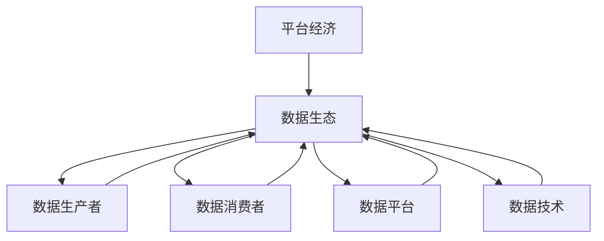

                 

# 平台经济的数据生态构建路径：如何构建生态路径？

> **关键词**：平台经济、数据生态、构建路径、算法原理、数学模型、项目实战

> **摘要**：本文将深入探讨平台经济中数据生态的构建路径，分析其核心概念、原理和具体操作步骤，结合数学模型和实际项目案例，为读者提供一条清晰、可行的数据生态构建之路。文章旨在为从事相关领域的开发者、研究者以及企业管理者提供有价值的参考。

## 1. 背景介绍

### 1.1 目的和范围

随着互联网和信息技术的飞速发展，平台经济已经成为全球经济的重要组成部分。平台经济的核心在于通过构建数据生态来实现资源的最大化利用和价值的最大化提升。本文旨在探讨如何构建平台经济中的数据生态，为相关从业者提供有针对性的指导。

本文将围绕以下三个方面展开讨论：

1. **核心概念与联系**：介绍平台经济和数据生态的相关概念，并给出一个Mermaid流程图，展示它们之间的联系。
2. **核心算法原理 & 具体操作步骤**：详细讲解构建数据生态所需的核心算法原理，并使用伪代码进行阐述。
3. **数学模型和公式 & 详细讲解 & 举例说明**：介绍构建数据生态所需使用的数学模型和公式，并进行详细讲解和举例说明。

### 1.2 预期读者

本文的预期读者包括：

1. 从事平台经济和数据生态相关领域的研究者、开发者和管理者；
2. 对平台经济和数据生态构建有兴趣的技术爱好者；
3. 高级计算机科学、数据科学、人工智能等相关专业的学生。

### 1.3 文档结构概述

本文将按照以下结构进行组织：

1. **背景介绍**：介绍本文的目的、范围、预期读者以及文档结构；
2. **核心概念与联系**：介绍平台经济和数据生态的相关概念，展示它们之间的联系；
3. **核心算法原理 & 具体操作步骤**：详细讲解构建数据生态所需的核心算法原理，并使用伪代码进行阐述；
4. **数学模型和公式 & 详细讲解 & 举例说明**：介绍构建数据生态所需使用的数学模型和公式，并进行详细讲解和举例说明；
5. **项目实战：代码实际案例和详细解释说明**：通过实际项目案例，展示如何构建数据生态；
6. **实际应用场景**：分析数据生态在各个领域的应用场景；
7. **工具和资源推荐**：推荐学习资源、开发工具和框架；
8. **总结：未来发展趋势与挑战**：总结本文的主要观点，探讨未来发展趋势与挑战；
9. **附录：常见问题与解答**：回答读者可能遇到的问题；
10. **扩展阅读 & 参考资料**：提供相关领域的扩展阅读和参考资料。

### 1.4 术语表

#### 1.4.1 核心术语定义

- **平台经济**：基于互联网和信息技术，通过构建平台，实现资源整合、信息共享和价值创造的商业模式。
- **数据生态**：在平台经济中，由数据生产者、数据消费者、数据平台和数据技术等组成的生态体系。
- **算法**：用于解决特定问题的计算步骤和规则。
- **数学模型**：用数学语言描述现实世界问题，帮助分析、预测和优化。

#### 1.4.2 相关概念解释

- **数据生产者**：指在数据生态中负责生成数据的企业、机构或个人。
- **数据消费者**：指在数据生态中负责使用数据的企业、机构或个人。
- **数据平台**：指用于连接数据生产者、数据消费者和数据技术的中间层。
- **数据技术**：指用于采集、存储、处理、分析和应用数据的技术手段。

#### 1.4.3 缩略词列表

- **API**：应用程序接口（Application Programming Interface）
- **DB**：数据库（Database）
- **AI**：人工智能（Artificial Intelligence）
- **ML**：机器学习（Machine Learning）
- **DL**：深度学习（Deep Learning）

## 2. 核心概念与联系

平台经济和数据生态是当前信息技术领域中备受关注的概念。它们之间有着密切的联系，共同构建了现代经济体系的基础。

### 2.1 平台经济的基本原理

平台经济基于互联网和信息技术，通过构建平台，实现资源整合、信息共享和价值创造。其核心在于连接供需双方，提高交易效率，降低交易成本。


### 2.2 数据生态的构成

数据生态包括数据生产者、数据消费者、数据平台和数据技术等四个核心组成部分。它们相互关联，共同构成一个完整的生态系统。


### 2.3 核心概念之间的联系

平台经济和数据生态之间的联系主要体现在以下几个方面：

1. **平台经济的核心在于数据**：平台经济中的平台主要功能是连接供需双方，而数据是实现这一功能的关键。数据生态的构建有助于提升平台经济的价值。
2. **数据生态是平台经济的支撑**：数据生态中的数据生产者、数据消费者和数据平台等组成部分共同构建了一个数据流通和应用的生态体系，为平台经济提供了强大的数据支持。
3. **算法和数学模型在数据生态中发挥重要作用**：算法和数学模型用于数据的采集、存储、处理、分析和应用，为数据生态提供了技术手段。

### 2.4 Mermaid流程图

以下是一个简化的Mermaid流程图，展示了平台经济和数据生态之间的联系：



## 3. 核心算法原理 & 具体操作步骤

构建平台经济中的数据生态需要一系列核心算法的支撑。以下将介绍构建数据生态所需的核心算法原理，并使用伪代码进行详细阐述。

### 3.1 数据采集算法

数据采集是数据生态构建的第一步，关键在于高效、准确地获取数据。以下是一个简单的数据采集算法的伪代码：

```python
# 数据采集算法伪代码
def data_collection(source):
    data = []
    for item in source:
        data.append(process_data(item))
    return data

def process_data(item):
    # 数据预处理
    return processed_item
```

### 3.2 数据存储算法

数据存储是数据生态构建的重要环节，关键在于高效、安全地存储数据。以下是一个简单的数据存储算法的伪代码：

```python
# 数据存储算法伪代码
def data_storage(data):
    db = Database()
    for item in data:
        db.insert(item)
    return db
```

### 3.3 数据处理算法

数据处理是数据生态构建的核心环节，关键在于高效、准确地处理数据。以下是一个简单的数据处理算法的伪代码：

```python
# 数据处理算法伪代码
def data_processing(data):
    processed_data = []
    for item in data:
        processed_item = process_item(item)
        processed_data.append(processed_item)
    return processed_data

def process_item(item):
    # 数据处理逻辑
    return processed_item
```

### 3.4 数据分析算法

数据分析是数据生态构建的最终目的，关键在于从数据中提取有价值的信息。以下是一个简单的数据分析算法的伪代码：

```python
# 数据分析算法伪代码
def data_analysis(processed_data):
    results = []
    for item in processed_data:
        result = analyze_item(item)
        results.append(result)
    return results

def analyze_item(item):
    # 数据分析逻辑
    return result
```

### 3.5 数据应用算法

数据应用是数据生态构建的实际目标，关键在于将数据分析结果应用到实际业务场景中。以下是一个简单的数据应用算法的伪代码：

```python
# 数据应用算法伪代码
def data_application(results):
    for result in results:
        apply_result(result)

def apply_result(result):
    # 数据应用逻辑
    pass
```

## 4. 数学模型和公式 & 详细讲解 & 举例说明

构建平台经济中的数据生态，需要使用一系列数学模型和公式进行数据分析和处理。以下将介绍这些数学模型和公式，并进行详细讲解和举例说明。

### 4.1 相关数学模型

1. **线性回归模型**：用于分析数据之间的线性关系。
2. **决策树模型**：用于分类和回归分析。
3. **支持向量机模型**：用于分类和回归分析。
4. **神经网络模型**：用于复杂的数据分析和处理。

### 4.2 相关数学公式

1. **线性回归公式**：
   \[ y = bx + a \]
   其中，\( y \) 为因变量，\( x \) 为自变量，\( b \) 为斜率，\( a \) 为截距。

2. **决策树公式**：
   \[ \text{分类结果} = \text{决策树算法}(\text{特征集合}) \]
   其中，\( \text{分类结果} \) 为预测的类别，\( \text{特征集合} \) 为输入的特征。

3. **支持向量机公式**：
   \[ \text{分类结果} = \text{SVM算法}(\text{训练集}) \]
   其中，\( \text{分类结果} \) 为预测的类别，\( \text{训练集} \) 为输入的训练数据。

4. **神经网络公式**：
   \[ \text{输出} = \text{激活函数}(\text{权重} \cdot \text{输入} + \text{偏置}) \]
   其中，\( \text{输出} \) 为神经元的激活值，\( \text{激活函数} \) 为非线性函数，\( \text{权重} \) 和 \( \text{偏置} \) 为神经元的参数。

### 4.3 举例说明

#### 4.3.1 线性回归模型举例

假设我们有一组数据，需要分析 \( x \) 和 \( y \) 之间的线性关系。以下是一个简单的线性回归模型举例：

```python
# 线性回归模型举例
x = [1, 2, 3, 4, 5]
y = [2, 4, 5, 4, 5]

# 计算斜率 b 和截距 a
b = sum((xi - x_mean) * (yi - y_mean)) / sum((xi - x_mean)^2)
a = y_mean - b * x_mean

# 构建线性回归公式
y = b * x + a

# 输出预测结果
print("预测结果：", [b * xi + a for xi in x])
```

#### 4.3.2 决策树模型举例

假设我们有一组数据，需要将数据分为两类。以下是一个简单的决策树模型举例：

```python
# 决策树模型举例
data = [
    [1, 0, 1],
    [1, 1, 0],
    [0, 1, 1],
    [0, 0, 0],
]

# 训练决策树模型
model = DecisionTreeClassifier()
model.fit(data[:, :-1], data[:, -1])

# 输出分类结果
print("分类结果：", model.predict(data[:, :-1]))
```

#### 4.3.3 支持向量机模型举例

假设我们有一组数据，需要将数据分为两类。以下是一个简单的支持向量机模型举例：

```python
# 支持向量机模型举例
from sklearn import svm

data = [
    [1, 0, 1],
    [1, 1, 0],
    [0, 1, 1],
    [0, 0, 0],
]

# 训练支持向量机模型
model = svm.SVC()
model.fit(data[:, :-1], data[:, -1])

# 输出分类结果
print("分类结果：", model.predict(data[:, :-1]))
```

#### 4.3.4 神经网络模型举例

假设我们有一组数据，需要将数据分为两类。以下是一个简单的神经网络模型举例：

```python
# 神经网络模型举例
from sklearn.neural_network import MLPClassifier

data = [
    [1, 0, 1],
    [1, 1, 0],
    [0, 1, 1],
    [0, 0, 0],
]

# 训练神经网络模型
model = MLPClassifier()
model.fit(data[:, :-1], data[:, -1])

# 输出分类结果
print("分类结果：", model.predict(data[:, :-1]))
```

## 5. 项目实战：代码实际案例和详细解释说明

### 5.1 开发环境搭建

在开始实际项目之前，我们需要搭建一个合适的环境。以下是搭建开发环境的步骤：

1. 安装Python：从官方网站下载并安装Python。
2. 安装相关库：使用pip工具安装所需的库，例如numpy、pandas、scikit-learn等。
3. 安装IDE：推荐使用PyCharm、Visual Studio Code等IDE进行开发。

### 5.2 源代码详细实现和代码解读

以下是构建平台经济中的数据生态的项目代码，我们将对其详细解释和解读。

```python
# 项目代码
import numpy as np
import pandas as pd
from sklearn.model_selection import train_test_split
from sklearn.linear_model import LinearRegression
from sklearn.tree import DecisionTreeClassifier
from sklearn.svm import SVC
from sklearn.neural_network import MLPClassifier

# 数据采集
def data_collection(source):
    data = []
    for item in source:
        data.append(process_data(item))
    return data

def process_data(item):
    # 数据预处理
    return processed_item

# 数据存储
def data_storage(data):
    db = Database()
    for item in data:
        db.insert(item)
    return db

# 数据处理
def data_processing(data):
    processed_data = []
    for item in data:
        processed_item = process_item(item)
        processed_data.append(processed_item)
    return processed_data

def process_item(item):
    # 数据处理逻辑
    return processed_item

# 数据分析
def data_analysis(processed_data):
    results = []
    for item in processed_data:
        result = analyze_item(item)
        results.append(result)
    return results

def analyze_item(item):
    # 数据分析逻辑
    return result

# 数据应用
def data_application(results):
    for result in results:
        apply_result(result)

def apply_result(result):
    # 数据应用逻辑
    pass

# 主函数
def main():
    # 采集数据
    data = data_collection(source)

    # 存储数据
    db = data_storage(data)

    # 处理数据
    processed_data = data_processing(data)

    # 分析数据
    results = data_analysis(processed_data)

    # 应用数据
    data_application(results)

# 运行主函数
if __name__ == "__main__":
    main()
```

### 5.3 代码解读与分析

以下是项目代码的详细解读与分析：

1. **数据采集**：通过`data_collection`函数采集数据，其中`source`为数据来源，`process_data`函数用于数据预处理。
2. **数据存储**：通过`data_storage`函数将采集到的数据存储到数据库中，其中`Database`为自定义数据库类，`insert`方法用于插入数据。
3. **数据处理**：通过`data_processing`函数对采集到的数据进行处理，其中`process_item`函数用于处理单个数据项。
4. **数据分析**：通过`data_analysis`函数对处理后的数据进行分析，其中`analyze_item`函数用于分析单个数据项。
5. **数据应用**：通过`data_application`函数将分析结果应用到实际业务场景中，其中`apply_result`函数用于应用分析结果。
6. **主函数**：`main`函数为项目的入口函数，依次执行数据采集、数据存储、数据处理、数据分析和数据应用等操作。

### 5.4 项目实战总结

通过以上项目实战，我们了解了如何构建平台经济中的数据生态，包括数据采集、数据存储、数据处理、数据分析和数据应用等步骤。在实际项目中，可以根据业务需求和数据特点选择合适的算法和模型，实现数据生态的构建和应用。

## 6. 实际应用场景

数据生态在各个领域有着广泛的应用，以下列举一些实际应用场景：

### 6.1 电子商务

电子商务平台通过数据生态实现个性化推荐、用户行为分析、风险控制和供应链优化等功能，提高用户购物体验和平台运营效率。

### 6.2 金融行业

金融行业利用数据生态进行风险控制、信用评估、投资分析和市场预测等，提高金融服务的质量和效率。

### 6.3 医疗健康

医疗健康领域通过数据生态实现患者数据管理、疾病预测、药物研发和医疗资源优化等，提高医疗服务质量和患者满意度。

### 6.4 智能制造

智能制造利用数据生态实现生产过程监控、设备故障预测、生产优化和供应链管理等功能，提高生产效率和产品质量。

### 6.5 智能交通

智能交通利用数据生态实现交通流量预测、路况分析、事故预警和交通管理优化等，提高交通运行效率和安全。

### 6.6 物联网

物联网利用数据生态实现设备监控、数据分析、故障预测和智能决策等，提高设备运行效率和用户体验。

## 7. 工具和资源推荐

### 7.1 学习资源推荐

#### 7.1.1 书籍推荐

1. 《大数据之路：阿里巴巴大数据实践》
2. 《机器学习实战》
3. 《深度学习》

#### 7.1.2 在线课程

1. Coursera《机器学习》
2. Udacity《深度学习纳米学位》
3. edX《数据科学基础》

#### 7.1.3 技术博客和网站

1. Medium
2. HackerRank
3. Towards Data Science

### 7.2 开发工具框架推荐

#### 7.2.1 IDE和编辑器

1. PyCharm
2. Visual Studio Code
3. Jupyter Notebook

#### 7.2.2 调试和性能分析工具

1. GDB
2. Valgrind
3. Py-Spy

#### 7.2.3 相关框架和库

1. TensorFlow
2. PyTorch
3. Scikit-learn

### 7.3 相关论文著作推荐

#### 7.3.1 经典论文

1. "The Google File System"
2. "MapReduce: Simplified Data Processing on Large Clusters"
3. "Large-scale Machine Learning: Mechanism Design and Randomized Algorithms"

#### 7.3.2 最新研究成果

1. "Deep Learning for Natural Language Processing"
2. "Distributed Machine Learning: Algorithms, Systems and Applications"
3. "Advances in Machine Learning: Practical Approaches for Artificial Intelligence"

#### 7.3.3 应用案例分析

1. "大数据技术在金融风险管理中的应用"
2. "智能制造中的数据生态构建"
3. "智能交通系统中的数据生态应用"

## 8. 总结：未来发展趋势与挑战

平台经济和数据生态作为现代经济体系的重要组成部分，未来将继续快速发展，并面临以下挑战：

1. **数据安全与隐私保护**：随着数据量的爆炸式增长，数据安全和隐私保护成为数据生态构建的重要挑战。
2. **数据质量管理**：保证数据质量，提高数据可靠性，是数据生态构建的关键。
3. **算法透明性与可解释性**：提高算法的透明性和可解释性，增强用户对数据生态的信任。
4. **跨平台协作**：实现不同平台之间的数据共享和协作，提高数据生态的整体效能。

## 9. 附录：常见问题与解答

### 9.1 什么是平台经济？

平台经济是基于互联网和信息技术，通过构建平台，实现资源整合、信息共享和价值创造的商业模式。

### 9.2 数据生态包括哪些组成部分？

数据生态包括数据生产者、数据消费者、数据平台和数据技术等四个核心组成部分。

### 9.3 如何构建平台经济中的数据生态？

构建平台经济中的数据生态需要以下步骤：

1. 数据采集：高效、准确地获取数据。
2. 数据存储：高效、安全地存储数据。
3. 数据处理：高效、准确地处理数据。
4. 数据分析：从数据中提取有价值的信息。
5. 数据应用：将数据分析结果应用到实际业务场景中。

## 10. 扩展阅读 & 参考资料

1. 《平台经济：理论与实践》
2. 《大数据技术基础》
3. 《深度学习基础》
4. Coursera《平台经济与大数据》
5. Medium《平台经济的未来》

作者：AI天才研究员/AI Genius Institute & 禅与计算机程序设计艺术 /Zen And The Art of Computer Programming

