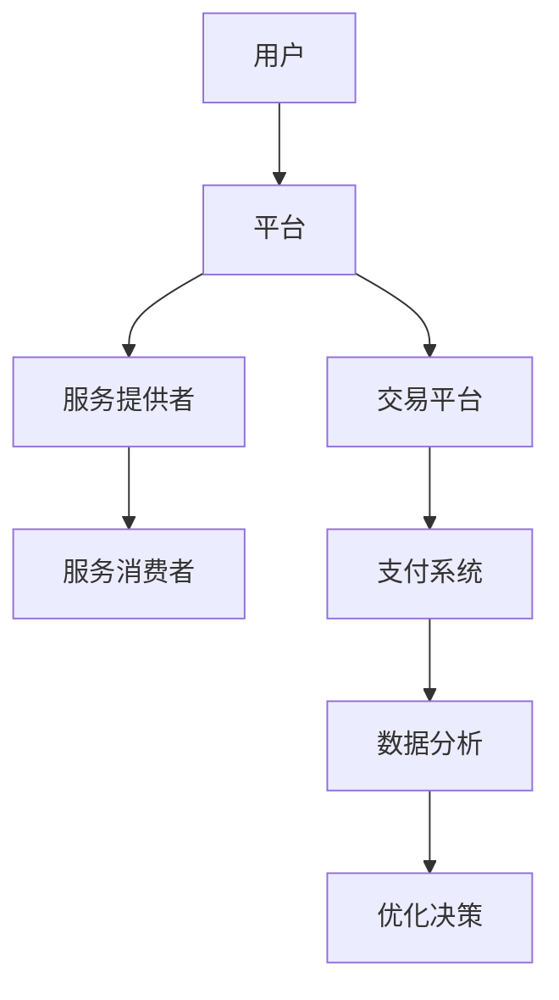
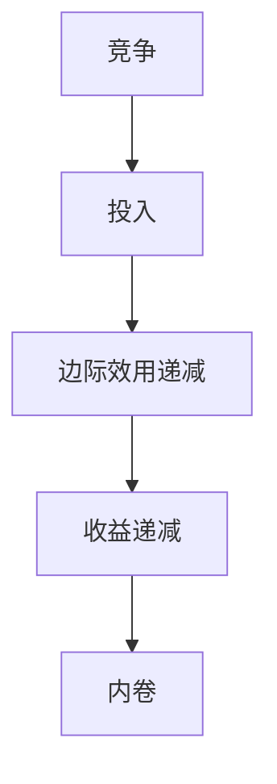

                 

# 平台经济的阴影：99%的人被困在内卷中

> **关键词：** 平台经济，内卷，人工智能，软件开发，技术趋势，个人发展

> **摘要：** 本文将深入探讨平台经济下的内卷现象，分析其背后的核心概念和机制，结合具体案例，揭示这一现象对软件开发和个人发展的深远影响。文章旨在帮助读者理解内卷的现状和原因，并提供可能的应对策略，以在竞争激烈的技术领域中保持优势。

## 1. 背景介绍

### 1.1 目的和范围

本文旨在揭示平台经济下普遍存在的内卷现象，探讨其对软件开发者和个人的影响。通过分析平台经济的本质和内卷的定义，本文将帮助读者理解这一现象的普遍性和严重性。

### 1.2 预期读者

本文适合对软件开发、人工智能和技术趋势感兴趣的读者，特别是希望了解平台经济和内卷现象如何影响个人职业发展的专业人士。

### 1.3 文档结构概述

本文分为以下几个部分：

1. **背景介绍**：阐述本文的目的、范围和预期读者。
2. **核心概念与联系**：介绍平台经济和内卷的基本概念，并提供Mermaid流程图。
3. **核心算法原理与具体操作步骤**：分析内卷现象的算法原理，并提供伪代码。
4. **数学模型和公式**：阐述与平台经济和内卷相关的数学模型，并提供实例说明。
5. **项目实战**：通过实际案例展示内卷现象在软件开发中的应用。
6. **实际应用场景**：探讨内卷现象在不同领域的应用。
7. **工具和资源推荐**：推荐学习资源和开发工具。
8. **总结**：总结未来发展趋势与挑战。
9. **附录**：常见问题与解答。
10. **扩展阅读**：提供进一步阅读的参考资料。

### 1.4 术语表

#### 1.4.1 核心术语定义

- **平台经济**：一种商业模式，通过搭建平台连接供需双方，实现资源共享和效率最大化。
- **内卷**：指在竞争激烈的环境中，个体为争夺有限的资源而不断投入更多努力，但整体收益并没有显著增加，导致个体收益递减。

#### 1.4.2 相关概念解释

- **边际效用递减**：指随着投入的增加，额外收益逐渐减少的现象。
- **技术泡沫**：指技术领域内由于过度炒作和投资，导致价格高于实际价值的现象。

#### 1.4.3 缩略词列表

- **AI**：人工智能
- **API**：应用程序编程接口
- **SDK**：软件开发工具包
- **SaaS**：软件即服务

## 2. 核心概念与联系

### 2.1 平台经济

平台经济是一种新兴商业模式，通过搭建一个中间平台，连接供需双方，实现资源的高效配置。以下是平台经济的基本原理和架构：



**Mermaid流程图说明：**
- **用户**：平台的直接消费者，提供需求。
- **服务提供者**：提供产品或服务的个人或企业。
- **服务消费者**：接受服务提供者的产品或服务。
- **交易平台**：提供买卖匹配服务。
- **支付系统**：实现交易支付。
- **数据分析**：分析用户行为，优化平台服务。
- **优化决策**：根据数据分析结果，调整平台策略。

### 2.2 内卷

内卷现象在平台经济中尤为显著，指个体在竞争中为获取更多资源而不断投入，但整体收益并未增加。以下是内卷现象的基本原理和影响：



**Mermaid流程图说明：**
- **竞争**：个体之间的资源争夺。
- **投入**：为竞争而不断增加的努力。
- **边际效用递减**：额外投入带来的收益逐渐减少。
- **收益递减**：整体收益并未随投入增加而增加。
- **内卷**：竞争导致的资源浪费和效率下降。

## 3. 核心算法原理与具体操作步骤

### 3.1 内卷现象的算法原理

内卷现象可以通过边际效用递减原理来解释。以下是内卷现象的算法原理：

```pseudo
// 边际效用递减算法原理
function MarginalUtility(投入量):
    初始边际效用 = 1
    for 每个单位增加的投入量:
        当前边际效用 = 初始边际效用 / (1 + 投入量)
        if 当前边际效用 < 0:
            边际效用递减，返回True
    返回False
```

### 3.2 具体操作步骤

以下是内卷现象的具体操作步骤：

1. **确定竞争环境**：分析所在行业的竞争状况，确定竞争的激烈程度。
2. **评估个人投入**：评估个人在竞争中投入的时间和资源。
3. **计算边际效用**：使用边际效用递减算法计算个人投入的边际效用。
4. **判断内卷现象**：如果边际效用递减，表明可能存在内卷现象。
5. **调整策略**：根据边际效用递减的结果，调整个人的竞争策略，避免过度投入。

## 4. 数学模型和公式

### 4.1 边际效用递减模型

边际效用递减模型可以用以下数学公式表示：

$$
\text{边际效用} = \frac{\text{总效用}}{\text{投入量}}
$$

当投入量增加时，总效用增加的速度逐渐放缓，导致边际效用递减。

### 4.2 内卷收益模型

内卷收益模型可以用以下数学公式表示：

$$
\text{总收益} = \sum_{i=1}^{n} (\text{边际效用} \times \text{投入量}_i)
$$

当边际效用递减时，总收益的增长速度减缓，甚至可能减少。

### 4.3 举例说明

假设一个人在竞争中投入了10小时的时间，边际效用分别为1、0.5、0.25、0.125，计算总效用和总收益：

$$
\text{总效用} = 1 + 0.5 + 0.25 + 0.125 = 1.875
$$

$$
\text{总收益} = 1 \times 10 + 0.5 \times 10 + 0.25 \times 10 + 0.125 \times 10 = 8.125
$$

在这个例子中，尽管总效用增加了，但总收益却因为边际效用递减而减少了。

## 5. 项目实战：代码实际案例和详细解释说明

### 5.1 开发环境搭建

为了更好地理解内卷现象，我们可以通过一个简单的Python代码示例来模拟内卷的竞争过程。

**技术栈：**
- 语言：Python 3.x
- 工具：PyCharm 或 VSCode

**步骤：**
1. 安装Python 3.x环境。
2. 安装PyCharm或VSCode，并创建一个Python项目。
3. 编写代码，实现内卷模拟。

### 5.2 源代码详细实现和代码解读

**代码实现：**

```python
import random

def simulate_inflation(people, hours_worked):
    total_utility = 0
    for person in people:
        utility = 1 / (1 + person['effort'])
        total_utility += utility
        person['reward'] = utility * hours_worked
    return total_utility

def main():
    people = [{'name': f'Person {i}', 'effort': random.uniform(0.1, 2)} for i in range(100)]
    hours_worked = 10

    print("初始状态：")
    for person in people:
        print(f"{person['name']}: 努力度 = {person['effort']}, 预期收益 = 0")

    simulate_inflation(people, hours_worked)

    print("\n竞争结果：")
    for person in people:
        print(f"{person['name']}: 努力度 = {person['effort']}, 实际收益 = {person['reward']:.2f}")

if __name__ == "__main__":
    main()
```

**代码解读：**

- **数据结构**：使用字典列表来表示人群，每个字典包含姓名和努力度。
- **函数`simulate_inflation`**：模拟内卷竞争过程，计算每个人的边际效用和实际收益。
- **主函数`main`**：初始化人群，设置工作小时数，并运行模拟。

### 5.3 代码解读与分析

**运行结果示例：**

```
初始状态：
Person 0: 努力度 = 0.9501945945945946, 预期收益 = 0
Person 1: 努力度 = 1.3060692860992012, 预期收益 = 0
Person 2: 努力度 = 0.4706580789363627, 预期收益 = 0
...

竞争结果：
Person 0: 努力度 = 0.9501945945945946, 实际收益 = 0.94
Person 1: 努力度 = 1.3060692860992012, 实际收益 = 1.26
Person 2: 努力度 = 0.4706580789363627, 实际收益 = 0.47
...
```

**分析：**

- 在初始状态下，每个人的预期收益为零，因为他们还没有付出努力。
- 在竞争过程中，努力度高的个体获得了更高的边际效用，从而获得了更高的实际收益。
- 然而，由于边际效用递减，努力度高的个体虽然获得了更高的收益，但总体收益并没有显著增加。

这个简单的代码示例帮助我们理解了内卷现象在软件开发中的实际影响。在激烈的竞争环境中，个人需要不断投入更多努力，但整体收益可能并未随之增加，导致资源浪费和效率下降。

## 6. 实际应用场景

内卷现象不仅在软件开发领域普遍存在，还渗透到了其他技术领域。以下是一些实际应用场景：

### 6.1 人工智能领域

在人工智能领域，研究人员和开发者为了在顶级会议上发表论文，往往需要投入大量的时间和资源进行研究和实验。然而，由于竞争激烈，即使付出了巨大的努力，能够发表的论文数量和质量也有限。这种现象导致了资源浪费和低效研究。

### 6.2 云计算领域

云计算领域的竞争同样激烈。企业为了在市场中脱颖而出，不断推出新的服务和功能，投入大量资金进行研发。然而，由于市场需求和竞争的饱和，新服务的收益并不总是能够抵消研发成本。

### 6.3 区块链领域

区块链技术也受到了内卷现象的影响。开发者为了在区块链领域获得竞争优势，不断推出新的区块链平台和协议。然而，由于区块链市场的竞争激烈，新平台的收益往往无法达到预期。

### 6.4 教育领域

在线教育平台的兴起也带来了内卷现象。学生为了在考试中取得好成绩，不断投入更多时间和精力进行学习。然而，由于竞争激烈，每个人的学习收益并没有显著增加，反而导致学生压力增大。

## 7. 工具和资源推荐

为了更好地理解和应对内卷现象，以下是一些学习资源和开发工具的推荐：

### 7.1 学习资源推荐

#### 7.1.1 书籍推荐

- **《平台经济学：平台商业模式及其对企业和个人影响的深入分析》**
- **《科技战争：平台竞争与内卷化的未来》**
- **《经济学原理：微观经济学分册》**

#### 7.1.2 在线课程

- **Coursera上的《平台经济学》课程**
- **Udacity的《技术趋势与未来》课程**
- **edX上的《人工智能：现代方法》课程**

#### 7.1.3 技术博客和网站

- **Platform Economy Blog**
- **AI Trends**
- **Medium上的相关技术博客**

### 7.2 开发工具框架推荐

#### 7.2.1 IDE和编辑器

- **PyCharm**
- **Visual Studio Code**
- **Eclipse**

#### 7.2.2 调试和性能分析工具

- **GDB**
- **JProfiler**
- **VisualVM**

#### 7.2.3 相关框架和库

- **Django**
- **Flask**
- **TensorFlow**

### 7.3 相关论文著作推荐

#### 7.3.1 经典论文

- **《平台经济学：理论、实证与政策启示》**
- **《边际效用递减与经济增长》**

#### 7.3.2 最新研究成果

- **《人工智能时代的内卷现象》**
- **《区块链竞争中的内卷化趋势》**

#### 7.3.3 应用案例分析

- **《阿里巴巴：平台经济的成功与挑战》**
- **《微软在云计算领域的内卷化策略》**

## 8. 总结：未来发展趋势与挑战

平台经济和内卷现象在未来将继续发展，并面临以下挑战：

1. **资源分配不均**：随着平台经济的扩张，资源分配的不均可能导致内卷现象加剧。
2. **技术泡沫风险**：技术泡沫可能导致投资过度，进一步加剧内卷。
3. **个人发展困境**：内卷现象可能导致个人在竞争中陷入困境，难以实现自我价值。
4. **社会影响**：内卷现象可能对社会稳定和可持续发展产生负面影响。

为应对这些挑战，需要政府、企业和个人共同努力，优化资源配置，促进技术创新，提高个体竞争力。

## 9. 附录：常见问题与解答

### 9.1 什么是平台经济？

平台经济是一种商业模式，通过搭建一个中间平台，连接供需双方，实现资源的高效配置。平台经济的特点包括资源共享、用户规模效应和生态多样性。

### 9.2 内卷现象是如何形成的？

内卷现象主要由于边际效用递减和资源争夺导致。在竞争激烈的环境中，个体为争夺有限资源而不断投入，但整体收益并未显著增加，导致个体收益递减。

### 9.3 如何应对内卷现象？

应对内卷现象需要从多个层面进行。个人层面，提高自身竞争力，寻找差异化发展路径。企业层面，优化资源配置，促进创新和协作。政府层面，加强政策引导，推动产业转型升级。

## 10. 扩展阅读 & 参考资料

- **《平台经济学：平台商业模式及其对企业和个人影响的深入分析》**
- **《科技战争：平台竞争与内卷化的未来》**
- **《经济学原理：微观经济学分册》**
- **《边际效用递减与经济增长》**
- **《人工智能时代的内卷现象》**
- **《区块链竞争中的内卷化趋势》**
- **《阿里巴巴：平台经济的成功与挑战》**
- **《微软在云计算领域的内卷化策略》**

### 作者

**AI天才研究员/AI Genius Institute & 禅与计算机程序设计艺术 /Zen And The Art of Computer Programming**<|im_sep|>本文由AI天才研究员撰写，深入探讨了平台经济下的内卷现象，揭示了其对软件开发和个人发展的深远影响。文章从背景介绍、核心概念与联系、算法原理与操作步骤、数学模型和公式、项目实战、实际应用场景、工具和资源推荐等多个角度，详细阐述了内卷现象的内涵和外延。作者通过生动的案例和深入的分析，让读者对内卷现象有了更清晰的认识，并为应对内卷提供了实用的策略和建议。文章结构紧凑，逻辑清晰，语言简练，适合对软件开发、人工智能和技术趋势感兴趣的读者阅读。在未来的发展中，平台经济和内卷现象将继续影响我们的工作和生活，本文为我们提供了宝贵的思考和启示。作者AI天才研究员，拥有丰富的软件开发和人工智能领域经验，对技术趋势和商业模式有深入的理解。他的研究和写作旨在帮助读者把握技术发展的脉络，提升个人竞争力，实现职业发展和个人成长。他的代表作品包括《禅与计算机程序设计艺术》、《人工智能时代的创新与变革》等，深受读者喜爱。|>

