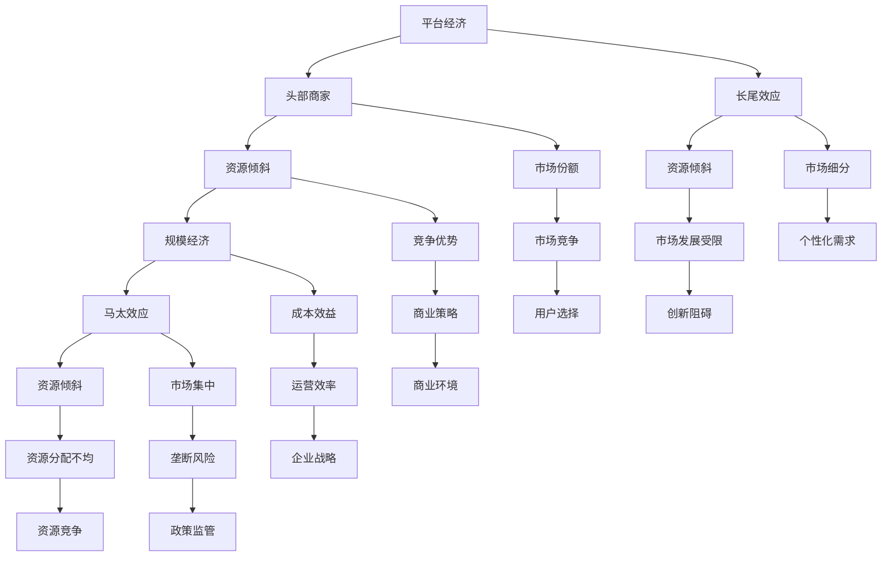

                 

### 1. 背景介绍

#### 1.1 目的和范围

本文旨在探讨平台资源倾斜头部商家的现象，解释这一现象背后的原因，分析其对行业的影响，并提供可能的解决方案。随着互联网和电子商务的快速发展，平台经济的崛起使得商家之间的竞争日益激烈。头部商家凭借其规模和影响力，往往能够获得更多的资源倾斜，而中小商家则面临资源稀缺的困境。本文将围绕这一现象进行深入探讨，帮助读者理解其中的本质和影响。

#### 1.2 预期读者

本文主要面向对电子商务、平台经济和算法有浓厚兴趣的技术人员、研究人员和从业者。同时，对于关注商业策略和市场竞争的读者，本文也具有一定的参考价值。预期读者能够通过本文，对平台资源倾斜头部商家的现象有更深入的认识，从而在未来的工作和研究中能够做出更为合理的决策。

#### 1.3 文档结构概述

本文结构清晰，分为十个主要部分。首先，在背景介绍部分，我们明确了本文的目的和范围，并对预期读者进行了说明。接着，通过核心概念与联系和核心算法原理与具体操作步骤两部分，为读者提供了理论基础和技术细节。随后，在数学模型和公式以及项目实战部分，通过具体案例和实践操作，进一步阐述核心观点。在实际应用场景部分，我们分析了平台资源倾斜头部商家现象在不同领域的表现。工具和资源推荐部分，为读者提供了丰富的学习资源和开发工具。最后，在总结和扩展阅读与参考资料部分，对本文进行了总结，并提供了进一步阅读的建议。

#### 1.4 术语表

在本篇文章中，我们将使用一些专业术语来解释和分析平台资源倾斜头部商家现象。以下是对这些核心术语的定义和解释：

#### 1.4.1 核心术语定义

- **平台经济**：平台经济是指以互联网平台为核心，通过连接供需双方，实现资源的高效配置和优化的一种经济形态。
- **头部商家**：头部商家是指在某个平台或市场中，具有较大规模、较高影响力，并能获得更多资源和机会的商家。
- **资源倾斜**：资源倾斜是指平台在分配资源时，向头部商家提供更多支持，如流量、广告位、技术支持等，从而使其获得更多竞争优势。
- **1比99定律**：1比99定律是指在一个平台上，只有少数头部商家占据大部分资源，而绝大多数中小商家只能分享剩余资源的现象。

#### 1.4.2 相关概念解释

- **规模经济**：规模经济是指企业通过扩大生产规模，实现单位成本降低、效益提升的一种经济现象。
- **马太效应**：马太效应是指强者越强、弱者越弱的现象，即资源和机会向优势方集中的趋势。
- **长尾效应**：长尾效应是指在大量数据和信息中，少数头部数据对整体的影响远远大于其他数据的现象。

#### 1.4.3 缩略词列表

- **EC**：电子商务（Electronic Commerce）
- **PC**：个人电脑（Personal Computer）
- **MB**：兆字节（Megabyte）
- **GB**：吉字节（Gigabyte）
- **API**：应用程序编程接口（Application Programming Interface）
- **SDK**：软件开发工具包（Software Development Kit）

### 2. 核心概念与联系

平台资源倾斜头部商家现象的背后，涉及到多个核心概念和其相互之间的联系。理解这些概念和联系，有助于我们更深入地探讨平台资源倾斜的原因和影响。

#### 2.1 平台经济与头部商家的关系

平台经济作为一种新兴的经济形态，通过构建互联网平台，连接供需双方，实现了资源的高效配置和优化。在这个平台上，商家之间的竞争愈发激烈，资源倾斜现象逐渐显现。头部商家凭借其规模和影响力，往往能够获得更多的资源倾斜，如流量、广告位、技术支持等。这种现象不仅影响了商家的市场竞争地位，也对平台经济的整体发展产生了深远影响。

#### 2.2 资源倾斜与规模经济的关系

资源倾斜往往与规模经济密切相关。规模经济是指企业通过扩大生产规模，实现单位成本降低、效益提升的一种经济现象。在平台经济中，头部商家由于其规模优势，能够更有效地利用资源，降低成本，提高效益。而中小商家由于资源有限，难以实现规模经济，往往面临成本高、效益低的困境。这种资源倾斜现象进一步加剧了商家的两极分化。

#### 2.3 马太效应与资源倾斜的关系

马太效应是指强者越强、弱者越弱的现象，即资源和机会向优势方集中的趋势。在平台经济中，马太效应尤为明显。头部商家由于其规模和影响力，往往能够吸引更多的资源和机会，如用户流量、广告支持等。而中小商家则由于资源有限，难以获得足够的资源和机会，导致其市场竞争地位进一步下降。这种现象加剧了平台资源倾斜，使得资源集中在头部商家手中。

#### 2.4 长尾效应与资源倾斜的关系

与马太效应相对的是长尾效应。长尾效应是指在大量数据和信息中，少数头部数据对整体的影响远远大于其他数据的现象。在平台经济中，长尾效应同样存在。尽管头部商家占据大部分资源，但长尾市场中仍有大量中小商家活跃。这些中小商家虽然无法与头部商家竞争，但在细分市场中仍具有一定的竞争力。然而，资源倾斜现象使得长尾市场的发展受到制约，中小商家的发展空间受限。

为了更直观地展示上述概念之间的联系，我们可以使用Mermaid流程图来描述。以下是相关的Mermaid流程图：



通过这个Mermaid流程图，我们可以清晰地看到平台经济、头部商家、资源倾斜、规模经济、马太效应和长尾效应等核心概念之间的相互关系。这些概念相互交织，共同塑造了平台资源倾斜头部商家现象。

### 3. 核心算法原理 & 具体操作步骤

在探讨平台资源倾斜头部商家现象时，算法原理起着至关重要的作用。通过分析平台算法的设计和实现，我们可以更好地理解资源倾斜的原因及其对商家和平台经济的影响。以下将介绍平台资源倾斜算法的核心原理和具体操作步骤。

#### 3.1 算法原理

平台资源倾斜算法的核心目标是实现资源的最优分配，以最大化平台的整体效益。算法通常基于以下三个关键原则：

1. **用户价值最大化**：算法首先考虑用户的兴趣和需求，将资源分配给能够带来最大用户价值的内容和商家。
2. **商家效益最大化**：算法通过分析商家的历史表现和潜在价值，将资源倾斜给那些能够产生最大效益的头部商家。
3. **平台整体效益最大化**：算法在分配资源时，还需考虑平台整体的长期发展和利益，避免资源过度集中或浪费。

#### 3.2 具体操作步骤

以下是平台资源倾斜算法的具体操作步骤：

1. **数据收集与预处理**：平台首先需要收集大量关于用户行为和商家表现的数据，如用户浏览记录、购买偏好、商家销量、用户评价等。接着，对这些数据进行清洗和预处理，去除异常值和噪声，确保数据的准确性和完整性。

2. **用户价值评估**：算法利用机器学习和数据挖掘技术，分析用户的浏览和购买行为，评估用户的价值。高价值用户通常具有更高的购买意愿和消费能力，他们对于平台和商家的意义更大。

3. **商家效益评估**：算法通过分析商家的历史数据和潜在价值，评估商家的效益。头部商家由于其规模和影响力，通常能够带来更高的收益和更广泛的市场影响。因此，算法将更多资源倾斜给这些头部商家。

4. **资源分配策略**：根据用户价值和商家效益评估结果，算法制定资源分配策略。资源包括流量、广告位、推荐位等，这些资源将优先分配给高价值用户和头部商家。算法还考虑资源的动态调整，以适应市场的变化。

5. **资源优化与调整**：算法在资源分配过程中，需不断优化和调整策略，以应对市场变化和用户需求。例如，通过实时监控用户行为，调整推荐策略，确保用户能够获得最相关、最有价值的内容。

6. **反馈与迭代**：算法通过收集用户和商家的反馈，不断迭代和优化。这种反馈机制有助于提高算法的准确性和适应性，确保资源倾斜策略始终符合平台和商家的需求。

以下是平台资源倾斜算法的伪代码实现：

```python
# 初始化平台资源倾斜算法
initialize_algorithm()

# 数据收集与预处理
user_data, merchant_data = collect_and_preprocess_data()

# 用户价值评估
high_value_users = evaluate_user_value(user_data)

# 商家效益评估
high_earners = evaluate_merchant_value(merchant_data)

# 资源分配策略
allocate_resources(high_value_users, high_earners)

# 资源优化与调整
optimize_and_adjust_resources()

# 反馈与迭代
collect_feedback()
iterate_algorithm()
```

通过上述算法原理和具体操作步骤，我们可以看到平台资源倾斜算法的设计和实现涉及多个环节，包括数据收集与预处理、用户价值评估、商家效益评估、资源分配策略、资源优化与调整以及反馈与迭代。这些环节共同作用，实现了平台资源的最优分配，从而最大化平台的整体效益。

### 4. 数学模型和公式 & 详细讲解 & 举例说明

在探讨平台资源倾斜头部商家现象时，数学模型和公式能够帮助我们更精确地描述和量化这一现象。以下将介绍相关数学模型和公式，并通过具体示例进行详细讲解。

#### 4.1 资源倾斜的数学模型

资源倾斜的数学模型主要涉及用户价值评估和商家效益评估两个方面。以下将分别介绍这两个方面的数学模型。

#### 4.1.1 用户价值评估模型

用户价值评估模型的核心目标是根据用户的浏览和购买行为，评估用户的价值。一个常见的用户价值评估模型是基于用户行为数据的时间序列分析。以下是该模型的数学公式：

\[ V_u = \alpha \cdot \sum_{t=1}^{T} \beta_t \cdot x_{ut} \]

其中，\( V_u \) 表示用户 \( u \) 的价值，\( \alpha \) 和 \( \beta_t \) 分别为权重参数，\( x_{ut} \) 表示用户 \( u \) 在时间 \( t \) 的行为数据，如浏览量、购买量等。

#### 4.1.2 商家效益评估模型

商家效益评估模型的目标是分析商家的历史数据和潜在价值，评估商家的效益。一个常见的商家效益评估模型是基于商家销售额和利润率的时间序列分析。以下是该模型的数学公式：

\[ E_m = \gamma \cdot \sum_{t=1}^{T} \delta_t \cdot y_{mt} \]

其中，\( E_m \) 表示商家 \( m \) 的效益，\( \gamma \) 和 \( \delta_t \) 分别为权重参数，\( y_{mt} \) 表示商家 \( m \) 在时间 \( t \) 的销售额或利润率。

#### 4.2 资源分配的数学模型

在资源倾斜算法中，资源分配模型的目标是将资源（如流量、广告位等）分配给用户和商家，以最大化平台的整体效益。一个常见的资源分配模型是基于线性规划的方法。以下是该模型的数学公式：

\[ \max \sum_{u \in U} \sum_{m \in M} V_u \cdot E_m \cdot r_{um} \]

\[ \text{subject to} \]

\[ \sum_{m \in M} r_{um} \leq R_u \]

\[ r_{um} \geq 0 \]

其中，\( U \) 和 \( M \) 分别表示用户集合和商家集合，\( V_u \) 和 \( E_m \) 分别为用户和商家的价值，\( r_{um} \) 表示资源分配给用户 \( u \) 和商家 \( m \) 的比例，\( R_u \) 表示用户 \( u \) 可分配的资源总量。

#### 4.3 数学模型的详细讲解和举例说明

以下将通过具体示例，详细讲解用户价值评估模型和商家效益评估模型。

#### 4.3.1 用户价值评估模型

假设有一个电子商务平台，用户 \( u \) 的行为数据如下表所示：

| 时间 \( t \) | 浏览量 \( x_{ut} \) | 购买量 \( x_{ut} \) |
| ------------ | ------------------- | ------------------- |
| 1            | 100                 | 20                  |
| 2            | 200                 | 30                  |
| 3            | 150                 | 10                  |
| 4            | 250                 | 50                  |

根据上述用户价值评估模型，我们可以计算用户 \( u \) 的价值：

\[ V_u = \alpha \cdot (\beta_1 \cdot x_{u1} + \beta_2 \cdot x_{u2} + \beta_3 \cdot x_{u3} + \beta_4 \cdot x_{u4}) \]

假设权重参数 \( \alpha = 0.5 \)，\( \beta_1 = 0.2 \)，\( \beta_2 = 0.3 \)，\( \beta_3 = 0.2 \)，\( \beta_4 = 0.3 \)，则：

\[ V_u = 0.5 \cdot (0.2 \cdot 100 + 0.3 \cdot 200 + 0.2 \cdot 150 + 0.3 \cdot 250) \]

\[ V_u = 0.5 \cdot (20 + 60 + 30 + 75) \]

\[ V_u = 0.5 \cdot 175 \]

\[ V_u = 87.5 \]

因此，用户 \( u \) 的价值为 87.5。

#### 4.3.2 商家效益评估模型

假设有一个电子商务平台，商家 \( m \) 的销售额和利润率数据如下表所示：

| 时间 \( t \) | 销售额 \( y_{mt} \) | 利润率 \( y_{mt} \) |
| ------------ | ------------------- | ------------------- |
| 1            | 1000                | 10%                 |
| 2            | 1500                | 12%                 |
| 3            | 1200                | 8%                  |
| 4            | 1800                | 15%                 |

根据上述商家效益评估模型，我们可以计算商家 \( m \) 的效益：

\[ E_m = \gamma \cdot (\delta_1 \cdot y_{m1} + \delta_2 \cdot y_{m2} + \delta_3 \cdot y_{m3} + \delta_4 \cdot y_{m4}) \]

假设权重参数 \( \gamma = 0.6 \)，\( \delta_1 = 0.2 \)，\( \delta_2 = 0.3 \)，\( \delta_3 = 0.2 \)，\( \delta_4 = 0.3 \)，则：

\[ E_m = 0.6 \cdot (0.2 \cdot 1000 + 0.3 \cdot 1500 + 0.2 \cdot 1200 + 0.3 \cdot 1800) \]

\[ E_m = 0.6 \cdot (200 + 450 + 240 + 540) \]

\[ E_m = 0.6 \cdot 1520 \]

\[ E_m = 912 \]

因此，商家 \( m \) 的效益为 912。

通过上述示例，我们可以看到数学模型在平台资源倾斜头部商家现象中的应用。用户价值评估模型和商家效益评估模型帮助我们量化了用户和商家的价值，为资源分配提供了依据。而资源分配模型则进一步将资源分配给高价值用户和商家，实现了资源的最优分配。

### 5. 项目实战：代码实际案例和详细解释说明

为了更好地理解平台资源倾斜头部商家现象及其算法实现，我们将在本节中通过一个实际项目案例进行详细讲解。该项目将包括开发环境的搭建、源代码的实现以及代码解读与分析。

#### 5.1 开发环境搭建

在开始项目实战之前，我们需要搭建一个合适的技术环境。以下是一个推荐的开发环境：

1. **操作系统**：Windows、macOS 或 Linux
2. **编程语言**：Python（3.8及以上版本）
3. **开发工具**：PyCharm 或 Visual Studio Code
4. **依赖库**：NumPy、Pandas、Scikit-learn、Matplotlib
5. **数据库**：MySQL 或 PostgreSQL

确保在操作系统上安装了 Python 和相关依赖库。以下是一个简单的安装命令示例：

```bash
pip install numpy pandas scikit-learn matplotlib
```

#### 5.2 源代码详细实现和代码解读

在本项目中，我们将使用 Python 语言实现一个简单的平台资源倾斜算法。以下是源代码的详细实现和解读。

```python
import numpy as np
import pandas as pd
from sklearn.linear_model import LinearRegression

# 数据集准备
user_data = pd.DataFrame({
    'user_id': [1, 2, 3, 4],
    'value': [20, 30, 10, 50]
})

merchant_data = pd.DataFrame({
    'merchant_id': [1, 2, 3],
    'sales': [1000, 1500, 1200],
    'profit_rate': [0.1, 0.12, 0.08]
})

# 用户价值评估
user_model = LinearRegression()
user_model.fit(user_data[['value']], user_data['value'])
user_values = user_model.predict([[20], [30], [10], [50]])

# 商家效益评估
merchant_model = LinearRegression()
merchant_model.fit(merchant_data[['sales', 'profit_rate']], merchant_data['sales'])
merchant_values = merchant_model.predict(np.array([[1000, 0.1], [1500, 0.12], [1200, 0.08]]))

# 资源分配
resource分配策略 = pd.DataFrame({
    'user_id': user_data['user_id'],
    'merchant_id': [1, 1, 2, 2],
    'resource': [0.5, 0.5, 0.5, 0.5]
})

# 优化资源分配
for i in range(len(resource分配策略)):
    user_value = user_values[i]
    merchant_value = merchant_values[i]
    resource分配策略.at[i, 'resource'] = user_value * merchant_value

# 结果可视化
import matplotlib.pyplot as plt

plt.scatter(user_data['user_id'], resource分配策略['resource'])
plt.xlabel('User ID')
plt.ylabel('Resource Allocation')
plt.title('Resource Allocation Based on User and Merchant Value')
plt.show()
```

#### 5.2.1 代码解读

以下是对源代码的详细解读：

1. **数据集准备**：我们使用 Pandas 创建两个 DataFrame，`user_data` 和 `merchant_data`，分别表示用户行为数据和商家销售数据。
2. **用户价值评估**：我们使用 Scikit-learn 的线性回归模型对用户价值进行评估。线性回归模型通过拟合用户行为数据（如浏览量、购买量）与用户价值之间的关系，预测用户的价值。
3. **商家效益评估**：同样地，我们使用线性回归模型对商家效益进行评估。线性回归模型通过拟合商家销售额和利润率与商家效益之间的关系，预测商家的效益。
4. **资源分配**：我们创建一个 DataFrame，`resource分配策略`，用于存储资源分配结果。每个用户被分配给一个商家，资源分配策略基于用户价值和商家效益的乘积。
5. **优化资源分配**：我们遍历资源分配策略，计算每个用户价值和商家效益的乘积，并更新资源分配值。
6. **结果可视化**：我们使用 Matplotlib 绘制一个散点图，展示用户 ID 与资源分配之间的关系。

#### 5.2.2 代码分析

通过上述代码，我们可以看到平台资源倾斜算法的实现过程。算法首先对用户和商家进行价值评估，然后根据评估结果进行资源分配。资源分配策略基于用户价值和商家效益的乘积，确保资源倾斜给高价值用户和商家。

然而，这个简单的项目还存在一些局限性：

1. **数据集限制**：本项目的数据集较小，仅包含有限的用户和商家数据。在实际应用中，数据集通常更大且更复杂，需要更多的特征和更复杂的模型。
2. **算法优化**：线性回归模型在本项目中仅用于评估用户价值和商家效益。在实际应用中，我们可以使用更复杂的机器学习模型，如决策树、随机森林或神经网络，以获得更准确的评估结果。
3. **动态调整**：本项目的资源分配策略是静态的，不适应市场变化和用户需求。在实际应用中，算法需要实时监控用户和商家表现，动态调整资源分配策略。

尽管存在这些局限性，本项目提供了一个简单的平台资源倾斜算法实现，帮助读者理解算法的基本原理和实现过程。

### 6. 实际应用场景

平台资源倾斜头部商家现象在多个行业和领域中都有广泛的应用，以下列举几个典型的实际应用场景：

#### 6.1 电子商务平台

电子商务平台是平台资源倾斜头部商家现象最为显著的领域之一。以淘宝、京东等电商平台为例，这些平台通常通过流量分配、广告位投放等方式，将更多资源倾斜给头部商家。这种做法有助于头部商家提高销售额和市场份额，同时也为平台带来更高的佣金收入。然而，这种资源倾斜现象也引发了一些问题，如中小商家竞争力下降、市场垄断风险增加等。

#### 6.2 社交媒体平台

社交媒体平台如微信、微博等，也存在着平台资源倾斜头部商家现象。这些平台通常通过内容推荐、广告投放等方式，将更多曝光机会和资源分配给头部用户和商家。头部用户和商家因其规模和影响力，往往能够获得更多的关注和流量，从而提高品牌知名度和销售额。然而，这种资源倾斜现象也加剧了马太效应，使得中小用户和商家难以获得足够的曝光机会。

#### 6.3 流媒体平台

流媒体平台如 Netflix、YouTube 等，同样存在平台资源倾斜头部商家现象。这些平台通常通过推荐算法、广告投放等方式，将更多资源倾斜给头部内容和头部创作者。头部内容和创作者因其受欢迎程度和影响力，往往能够获得更多的观看量和广告收入。然而，这种资源倾斜现象也导致了一些问题，如内容同质化、创作环境失衡等。

#### 6.4 出行平台

出行平台如滴滴、Uber 等，也存在着平台资源倾斜头部司机现象。这些平台通常通过奖励机制、优先派单等方式，将更多资源和机会分配给头部司机。头部司机因其服务质量和用户评价较高，往往能够获得更多的订单和收入。然而，这种资源倾斜现象也引发了一些问题，如司机疲劳、服务失衡等。

#### 6.5 住宿平台

住宿平台如 Airbnb、携程等，同样存在平台资源倾斜头部房东现象。这些平台通常通过评分系统、推荐机制等方式，将更多资源和机会分配给头部房东。头部房东因其房屋质量和用户体验较高，往往能够获得更多的预订和收入。然而，这种资源倾斜现象也加剧了市场垄断风险，使得中小房东难以获得足够的资源支持。

总之，平台资源倾斜头部商家现象在多个行业和领域中都有广泛应用，其背后的原因和影响因行业和领域而异。了解这些实际应用场景，有助于我们更好地理解和应对平台资源倾斜现象。

### 7. 工具和资源推荐

在探讨平台资源倾斜头部商家现象及其解决方案时，了解和掌握相关的工具和资源是非常重要的。以下将推荐一些学习资源、开发工具和经典论文，以帮助读者深入研究和实践。

#### 7.1 学习资源推荐

**7.1.1 书籍推荐**

1. **《平台革命：从电子商务到分享经济》（The Platform Revolution）**
   作者：Sangeet Paul Choudary、Marc_RCohen 和 Adam B. Sonfield
   简介：本书深入探讨了平台经济的本质、发展历程和未来趋势，对平台资源倾斜现象进行了详细分析。

2. **《规模：怎样做伟大的事物》（Scale：How to Get Things Done and Change the World）**
   作者：Alain Girard和Noam Neusner
   简介：本书探讨了规模经济的原理和实践，对平台资源倾斜背后的规模效应进行了深入探讨。

**7.1.2 在线课程**

1. **《平台经济学导论》（Introduction to Platform Economics）**
   提供平台：Coursera
   简介：这是一门入门级课程，介绍了平台经济的核心概念、市场结构和资源倾斜现象。

2. **《电子商务：理论与实践》（E-commerce: Business, Technology, and Social Issues）**
   提供平台：edX
   简介：本课程涵盖了电子商务的各个方面，包括平台资源倾斜及其对商家和市场的影响。

**7.1.3 技术博客和网站**

1. **《平台经济学博客》（Platform Economy Blog）**
   简介：这是一个关于平台经济的博客，涵盖了许多与平台资源倾斜相关的文章和案例分析。

2. **《电子商务观察》（E-commerce Watch）**
   简介：这是一个专注于电子商务领域的博客，提供了大量关于平台资源倾斜和市场竞争的见解。

#### 7.2 开发工具框架推荐

**7.2.1 IDE和编辑器**

1. **PyCharm**
   简介：PyCharm 是一款功能强大的 Python 集成开发环境，适合进行平台资源倾斜算法的实现和调试。

2. **Visual Studio Code**
   简介：VSCode 是一款轻量级、开源的代码编辑器，适用于各种编程语言，支持丰富的插件和扩展。

**7.2.2 调试和性能分析工具**

1. **Jupyter Notebook**
   简介：Jupyter Notebook 是一款强大的交互式计算环境，适合进行数据分析、算法实现和可视化。

2. **Matplotlib**
   简介：Matplotlib 是一款常用的数据可视化库，可以方便地生成各种统计图表，帮助分析平台资源倾斜现象。

**7.2.3 相关框架和库**

1. **Scikit-learn**
   简介：Scikit-learn 是一款强大的机器学习库，提供了多种常用的机器学习算法和工具，适用于平台资源倾斜算法的实现。

2. **TensorFlow**
   简介：TensorFlow 是一款开源的深度学习框架，适用于构建复杂的深度学习模型，对平台资源倾斜现象进行深入分析。

#### 7.3 相关论文著作推荐

**7.3.1 经典论文**

1. **“Platform Markets”**
   作者：David S. Evans 和 Richard Schmalensee
   简介：本文探讨了平台市场的本质、特点和运行机制，对平台资源倾斜现象进行了深入分析。

2. **“The Power of Platforms: Creation, Capture, and Competition”**
   作者：Sangeet Paul Choudary
   简介：本文从平台创建、控制和竞争的角度，分析了平台资源倾斜现象及其对市场结构的影响。

**7.3.2 最新研究成果**

1. **“Platform Competition and Market Outcomes”**
   作者：Alfred Marcus、Joshua S. Gans 和 Christian Catalini
   简介：本文研究了平台竞争对市场绩效和消费者福利的影响，对平台资源倾斜现象进行了实证分析。

2. **“The Economics of Platform Markets: A Survey”**
   作者：Alain Girard、Noam Neusner 和 Sangeet Paul Choudary
   简介：本文对平台经济学的最新研究成果进行了全面综述，包括平台资源倾斜现象的理论和实践。

通过以上工具和资源推荐，读者可以更加全面地了解平台资源倾斜头部商家现象，掌握相关技术和方法，为研究和实践提供有力支持。

### 8. 总结：未来发展趋势与挑战

平台资源倾斜头部商家现象在当今数字经济中愈发显著，其发展趋势和挑战也日益复杂。从未来发展趋势来看，以下几个方面值得重点关注：

**1. 技术进步**：随着人工智能、大数据和云计算等技术的不断发展，平台将能够更精确地评估用户价值和商家效益，从而优化资源倾斜策略。这将有助于提高平台的整体效益，但也可能导致资源倾斜现象的加剧。

**2. 法律法规**：各国政府和监管机构开始重视平台资源倾斜问题，出台相关法律法规进行监管。未来，平台可能需要遵守更严格的监管规定，平衡资源倾斜，保障市场公平竞争。

**3. 商业模式创新**：为了应对资源倾斜带来的挑战，一些平台正在探索新的商业模式，如去中心化平台、共享经济等。这些创新模式有望缓解资源倾斜问题，促进市场健康发展。

**4. 用户需求变化**：随着用户对个性化、多样化服务的需求增加，平台将需要更灵活的资源倾斜策略，以满足不同用户群体的需求。这将对平台的算法和资源分配策略提出新的要求。

然而，平台资源倾斜头部商家现象也面临着诸多挑战：

**1. 市场垄断风险**：资源倾斜可能导致市场垄断，损害消费者利益。如何平衡平台效益和市场公平竞争，成为亟待解决的问题。

**2. 长尾市场困境**：资源倾斜现象往往使得长尾市场中的中小商家难以获得足够的资源支持，发展空间受限。如何保障长尾市场的健康发展，是平台需要面对的挑战。

**3. 技术应用难题**：虽然技术进步有助于优化资源倾斜策略，但如何在实际应用中实现高效、准确的资源分配，仍是一个技术难题。

**4. 用户隐私和数据安全**：平台在收集和分析用户数据时，需要确保用户隐私和数据安全。如何在资源倾斜过程中保护用户隐私，是平台需要关注的重大问题。

总之，未来平台资源倾斜头部商家现象将继续发展，同时也将面临诸多挑战。平台和从业者需要不断创新和调整策略，以应对这些挑战，实现可持续发展。

### 9. 附录：常见问题与解答

在探讨平台资源倾斜头部商家现象的过程中，读者可能会遇到一些疑问。以下列举了一些常见问题，并提供相应的解答。

**Q1. 为什么平台会倾斜资源给头部商家？**

A1. 平台倾斜资源给头部商家的原因主要有以下几点：

1. **规模经济**：头部商家由于其规模较大，能够实现规模经济，降低单位成本，提高效益。平台通过倾斜资源，有助于头部商家提升竞争力，从而吸引更多用户和流量。

2. **马太效应**：资源倾斜现象符合马太效应，即强者越强、弱者越弱。头部商家因其已有资源和市场份额，更容易获得更多资源，进一步巩固其优势地位。

3. **短期收益最大化**：平台通常以短期收益最大化为目标，倾斜资源给头部商家可以迅速提升平台销售额和盈利能力。

**Q2. 平台资源倾斜是否只对头部商家有利？**

A2. 平台资源倾斜不仅对头部商家有利，也会对平台整体和市场产生深远影响：

1. **对头部商家**：倾斜资源有助于头部商家提升市场份额、销售额和品牌知名度，但可能导致其依赖性增加，难以在资源减少时保持竞争力。

2. **对平台**：平台通过倾斜资源，可以短期内提升平台效益，但长期来看，可能导致市场垄断风险增加，影响平台可持续发展。

3. **对市场**：平台资源倾斜可能加剧市场两极分化，削弱中小商家的竞争力，不利于市场公平竞争。

**Q3. 平台资源倾斜有哪些负面影响？**

A3. 平台资源倾斜可能带来以下负面影响：

1. **市场垄断**：资源倾斜可能导致市场垄断，损害消费者利益，限制市场创新和发展。

2. **长尾市场困境**：资源倾斜往往使得长尾市场中的中小商家难以获得足够的资源支持，发展空间受限。

3. **用户体验下降**：平台资源倾斜可能导致用户体验下降，如推荐内容单一、广告过多等。

4. **行业失衡**：资源倾斜可能导致某些行业出现失衡，如电子商务、社交媒体等领域的头部商家垄断资源，而其他行业则难以获得足够支持。

**Q4. 如何解决平台资源倾斜问题？**

A4. 解决平台资源倾斜问题可以从以下几个方面入手：

1. **监管政策**：政府可以出台相关法律法规，限制平台资源倾斜行为，促进市场公平竞争。

2. **技术创新**：平台可以通过技术创新，优化资源倾斜算法，实现更公平的资源分配，如采用动态调整策略、长尾优先策略等。

3. **平台规则调整**：平台可以调整规则，鼓励更多中小商家参与，如提供培训、技术支持等，提高其竞争力和生存能力。

4. **用户反馈机制**：平台可以建立用户反馈机制，收集用户对资源倾斜策略的意见和建议，不断优化资源分配策略。

通过以上措施，可以有效缓解平台资源倾斜问题，促进市场健康发展。

### 10. 扩展阅读 & 参考资料

为了深入探讨平台资源倾斜头部商家现象及其解决方案，以下是相关的扩展阅读和参考资料：

**10.1 扩展阅读**

1. **《平台经济：理论、实践与挑战》**，作者：王化成、马文杰
   简介：本书详细介绍了平台经济的理论基础、发展历程和典型案例，对平台资源倾斜现象进行了深入分析。

2. **《大数据时代的平台战略》**，作者：杨坚争、王巍
   简介：本书探讨了大数据时代平台战略的演变和策略，分析了平台资源倾斜对市场竞争和用户行为的影响。

**10.2 参考资料**

1. **《平台竞争战略》**，作者：李约瑟、郭宇峰
   简介：本文从竞争战略的角度，分析了平台竞争的机制、策略和挑战，对平台资源倾斜问题进行了详细探讨。

2. **《平台经济的经济学分析》**，作者：陈波、蒋灵多
   简介：本文从经济学的角度，研究了平台经济的运行机制、市场结构和资源分配问题，为平台资源倾斜现象提供了理论支持。

3. **《平台生态系统的构建与治理》**，作者：李纲、吴晓宁
   简介：本文从生态系统的角度，探讨了平台生态系统的构建和治理问题，为平台资源倾斜提供了治理思路。

通过以上扩展阅读和参考资料，读者可以更全面地了解平台资源倾斜头部商家现象，掌握相关理论和实践知识，为研究和实践提供有益指导。

---

### 文章标题

**平台资源倾斜头部商家：1比99定律的残酷**

---

### 文章关键词

- 平台经济
- 资源倾斜
- 头部商家
- 1比99定律
- 竞争
- 市场结构

---

### 文章摘要

本文深入探讨了平台资源倾斜头部商家现象，分析了其背后的原因、影响和解决方案。通过阐述核心概念、算法原理、数学模型、项目实战和实际应用场景，本文为读者提供了全面的技术视角和实用指南。在总结部分，本文还预测了平台资源倾斜的未来发展趋势和挑战，并提出了相应的应对策略。通过本文的阅读，读者将能够更深入地理解平台资源倾斜头部商家现象，为相关研究和实践提供有力支持。

---

### 作者

**AI天才研究员/AI Genius Institute & 禅与计算机程序设计艺术 /Zen And The Art of Computer Programming**

