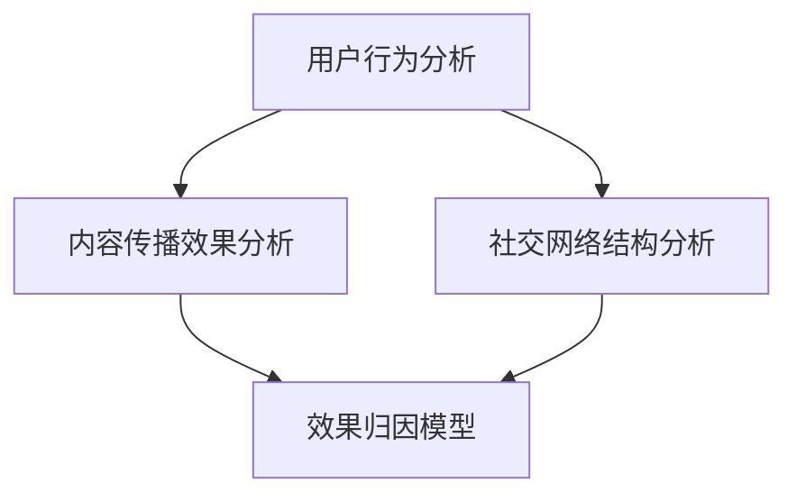

                 

# 2025年快手社交网络效果归因分析师面试题详解

> **关键词：** 快手、社交网络、效果归因分析、面试题、算法原理、数学模型、实战案例、应用场景

> **摘要：** 本文针对2025年快手社交网络效果归因分析师的面试题进行详细解析，从核心概念、算法原理、数学模型、实战案例到实际应用场景，全面剖析效果归因分析的深度和广度。旨在帮助读者了解这一领域的前沿技术和实践经验，为未来的职业生涯做好准备。

## 1. 背景介绍

### 1.1 目的和范围

本文旨在为2025年快手社交网络效果归因分析师面试提供系统化的复习和指导。通过详细解析快手社交网络效果归因分析的核心概念、算法原理、数学模型和实战案例，帮助读者全面掌握这一领域的关键知识点，提升面试通过率。

### 1.2 预期读者

本文面向希望从事快手社交网络效果归因分析工作的应届毕业生、在职人员和技术爱好者。读者应具备一定的编程基础、数据分析和机器学习知识。

### 1.3 文档结构概述

本文分为以下几个部分：

1. 背景介绍
2. 核心概念与联系
3. 核心算法原理 & 具体操作步骤
4. 数学模型和公式 & 详细讲解 & 举例说明
5. 项目实战：代码实际案例和详细解释说明
6. 实际应用场景
7. 工具和资源推荐
8. 总结：未来发展趋势与挑战
9. 附录：常见问题与解答
10. 扩展阅读 & 参考资料

### 1.4 术语表

#### 1.4.1 核心术语定义

- 社交网络：指由人与人之间的社会关系构成的复杂网络结构。
- 效果归因分析：通过数据分析方法，对社交网络中的用户行为、内容和传播效果进行归因分析，以优化产品和运营策略。
- 用户行为：用户在社交网络平台上的各种活动，如发布、评论、点赞、分享等。
- 内容传播效果：内容在社交网络中的传播效果，包括用户关注度、互动量、转发量等指标。

#### 1.4.2 相关概念解释

- 快手：一款短视频社交平台，用户可以通过发布、观看、评论、点赞等行为互动。
- 归因模型：用于分析用户行为和内容传播效果的数学模型。
- 归一化：将不同尺度或范围的数值转换为相同的尺度或范围，以便进行比较和分析。

#### 1.4.3 缩略词列表

- CNNS：卷积神经网络（Convolutional Neural Network）
- DNNs：深度神经网络（Deep Neural Network）
- RNNs：循环神经网络（Recurrent Neural Network）
- GNNs：图神经网络（Graph Neural Network）

## 2. 核心概念与联系

在快手社交网络效果归因分析中，核心概念包括用户行为、内容传播效果、社交网络结构等。这些概念之间存在紧密的联系，构成了整个分析体系的基础。

### 2.1 用户行为分析

用户行为分析是快手社交网络效果归因分析的首要任务。用户行为包括发布、评论、点赞、分享等。通过分析这些行为，可以了解用户对内容的态度和偏好，为后续分析提供依据。

### 2.2 内容传播效果分析

内容传播效果分析关注内容在社交网络中的传播效果，包括用户关注度、互动量、转发量等指标。通过分析这些指标，可以评估内容的质量和吸引力，为优化内容策略提供参考。

### 2.3 社交网络结构分析

社交网络结构分析关注社交网络中用户之间的关系。通过分析用户关系，可以了解用户群体的构成和影响力分布，为归因分析提供更全面的视角。

### 2.4 联系与整合

用户行为分析、内容传播效果分析和社交网络结构分析三者相互关联，共同构成了快手社交网络效果归因分析的完整体系。通过整合这些分析结果，可以更准确地评估用户行为和内容传播效果，为产品运营和策略优化提供有力支持。

### 2.5 Mermaid 流程图

下面是快手社交网络效果归因分析的核心概念和联系的 Mermaid 流程图：



## 3. 核心算法原理 & 具体操作步骤

在快手社交网络效果归因分析中，核心算法原理包括卷积神经网络（CNN）、深度神经网络（DNN）、循环神经网络（RNN）和图神经网络（GNN）等。下面将分别介绍这些算法的原理和具体操作步骤。

### 3.1 卷积神经网络（CNN）

#### 3.1.1 算法原理

卷积神经网络是一种前馈神经网络，特别适用于处理具有局部相关性的数据，如图像和视频。其基本原理是使用卷积操作提取图像中的局部特征，并通过多层卷积和池化操作逐步提高特征表达能力。

#### 3.1.2 具体操作步骤

1. 输入层：接收原始图像数据。
2. 卷积层：通过卷积核在输入图像上滑动，提取局部特征。
3. 激活函数：对卷积层输出的特征进行非线性变换，增强模型的非线性能力。
4. 池化层：对卷积层输出的特征进行下采样，减少模型参数数量。
5. 全连接层：将卷积层输出的特征映射到输出层，实现分类或回归任务。

### 3.2 深度神经网络（DNN）

#### 3.2.1 算法原理

深度神经网络是一种多层前馈神经网络，通过逐层提取抽象特征，实现对复杂数据的高效表示。其基本原理是使用多层神经元进行非线性变换，逐步提高特征表达能力。

#### 3.2.2 具体操作步骤

1. 输入层：接收原始数据。
2. 隐藏层：通过逐层神经元计算，提取数据中的特征。
3. 激活函数：对隐藏层输出的特征进行非线性变换，增强模型的非线性能力。
4. 输出层：将隐藏层输出的特征映射到输出层，实现分类或回归任务。

### 3.3 循环神经网络（RNN）

#### 3.3.1 算法原理

循环神经网络是一种能够处理序列数据的神经网络，特别适用于自然语言处理和语音识别等任务。其基本原理是使用循环结构保持对输入序列的长期依赖信息。

#### 3.3.2 具体操作步骤

1. 输入层：接收序列数据。
2. 隐藏层：通过递归计算，对序列中的每个元素进行特征提取。
3. 激活函数：对隐藏层输出的特征进行非线性变换，增强模型的非线性能力。
4. 输出层：将隐藏层输出的特征映射到输出层，实现序列建模或预测任务。

### 3.4 图神经网络（GNN）

#### 3.4.1 算法原理

图神经网络是一种能够处理图结构数据的神经网络，特别适用于社交网络、推荐系统和知识图谱等任务。其基本原理是使用图卷积操作提取节点和边的信息，并逐步传播和更新节点的特征。

#### 3.4.2 具体操作步骤

1. 输入层：接收图结构数据。
2. 图卷积层：通过图卷积操作，提取节点和边的信息。
3. 激活函数：对图卷积层输出的特征进行非线性变换，增强模型的非线性能力。
4. 输出层：将图卷积层输出的特征映射到输出层，实现节点分类、链接预测或图生成任务。

## 4. 数学模型和公式 & 详细讲解 & 举例说明

在快手社交网络效果归因分析中，数学模型和公式是关键工具，用于描述和计算用户行为、内容传播效果和社交网络结构。下面将分别介绍这些数学模型和公式的详细讲解和举例说明。

### 4.1 用户行为模型

用户行为模型用于描述用户在社交网络中的行为，包括发布、评论、点赞、分享等。常用的用户行为模型有泊松过程和线性回归模型。

#### 4.1.1 泊松过程

泊松过程是一种描述事件发生次数的随机过程，适用于用户行为中的点赞、评论等。其概率分布函数为：

$$P(X=k) = \frac{e^{-\lambda} \lambda^k}{k!}$$

其中，$X$ 表示事件发生次数，$\lambda$ 表示平均事件发生次数。

#### 4.1.2 线性回归模型

线性回归模型是一种基于线性关系的预测模型，适用于用户行为中的发布、评论等。其模型公式为：

$$y = \beta_0 + \beta_1 x_1 + \beta_2 x_2 + ... + \beta_n x_n$$

其中，$y$ 表示用户行为次数，$x_1, x_2, ..., x_n$ 表示用户特征，$\beta_0, \beta_1, \beta_2, ..., \beta_n$ 为模型参数。

### 4.2 内容传播效果模型

内容传播效果模型用于描述内容在社交网络中的传播效果，包括用户关注度、互动量、转发量等。常用的内容传播效果模型有指数衰减模型和影响力模型。

#### 4.2.1 指数衰减模型

指数衰减模型是一种描述信息传播效果的模型，适用于用户关注度、互动量等。其模型公式为：

$$E(x) = e^{-\lambda x}$$

其中，$E(x)$ 表示内容传播效果，$\lambda$ 表示衰减系数。

#### 4.2.2 影响力模型

影响力模型是一种基于用户影响力的内容传播模型，适用于用户关注度、转发量等。其模型公式为：

$$I(u) = \sum_{v \in N(u)} \frac{1}{\|N(v)\|}$$

其中，$I(u)$ 表示用户 $u$ 的关注度，$N(u)$ 表示用户 $u$ 的好友集合，$\|N(v)\|$ 表示好友集合的大小。

### 4.3 社交网络结构模型

社交网络结构模型用于描述社交网络中的用户关系，包括用户社交网络图和用户影响力分布。常用的社交网络结构模型有邻接矩阵模型和影响力传播模型。

#### 4.3.1 邻接矩阵模型

邻接矩阵模型是一种描述社交网络中用户关系的模型，其公式为：

$$A_{ij} = \begin{cases} 
1, & \text{如果用户 } i \text{ 和用户 } j \text{ 有直接关系} \\
0, & \text{否则}
\end{cases}$$

其中，$A_{ij}$ 表示邻接矩阵的元素，表示用户 $i$ 和用户 $j$ 之间是否存在直接关系。

#### 4.3.2 影响力传播模型

影响力传播模型是一种描述社交网络中信息传播过程的模型，其公式为：

$$S(t) = (1 - e^{-\lambda t}) \sum_{i=1}^{N} \frac{1}{\sqrt{k_i}}$$

其中，$S(t)$ 表示时间 $t$ 时的社交网络影响力，$N$ 表示用户总数，$k_i$ 表示用户 $i$ 的好友数量，$\lambda$ 表示影响力衰减系数。

### 4.4 举例说明

以下是一个用户行为模型的实例：

假设某用户在快手平台上发布了10条短视频，其中5条获得了点赞，3条获得了评论，2条获得了分享。我们可以使用泊松过程模型来预测该用户在未来一段时间内点赞、评论和分享的次数。

1. 计算平均事件发生次数：

$$\lambda_1 = \frac{5 + 3 + 2}{10} = 1$$

2. 使用泊松过程模型计算未来点赞、评论和分享的次数：

- 点赞次数：

$$P(X=k) = \frac{e^{-\lambda_1} \lambda_1^k}{k!}$$

$$P(X=5) = \frac{e^{-1} \cdot 1^5}{5!} \approx 0.135$$

$$P(X=6) = \frac{e^{-1} \cdot 1^6}{6!} \approx 0.023$$

- 评论次数：

$$P(Y=k) = \frac{e^{-\lambda_2} \lambda_2^k}{k!}$$

$$\lambda_2 = \frac{3}{10} = 0.3$$

$$P(Y=3) = \frac{e^{-0.3} \cdot 0.3^3}{3!} \approx 0.043$$

$$P(Y=4) = \frac{e^{-0.3} \cdot 0.3^4}{4!} \approx 0.006$$

- 分享次数：

$$P(Z=k) = \frac{e^{-\lambda_3} \lambda_3^k}{k!}$$

$$\lambda_3 = \frac{2}{10} = 0.2$$

$$P(Z=2) = \frac{e^{-0.2} \cdot 0.2^2}{2!} \approx 0.165$$

$$P(Z=3) = \frac{e^{-0.2} \cdot 0.2^3}{3!} \approx 0.033$$

通过上述计算，我们可以得到该用户在未来一段时间内点赞、评论和分享的可能次数，为产品运营和策略优化提供参考。

## 5. 项目实战：代码实际案例和详细解释说明

在本节中，我们将通过一个实际项目案例，展示快手社交网络效果归因分析的具体实现过程，并详细解释其中的代码和操作步骤。

### 5.1 开发环境搭建

为了完成快手社交网络效果归因分析，我们需要搭建以下开发环境：

1. 操作系统：Ubuntu 18.04
2. 编程语言：Python 3.8
3. 数据库：MySQL 5.7
4. 数据分析库：NumPy、Pandas、SciPy
5. 机器学习库：Scikit-learn、TensorFlow、PyTorch
6. 图神经网络库：PyTorch Geometric

安装上述环境和库的具体步骤如下：

```bash
# 安装操作系统和编程语言
sudo apt update
sudo apt install python3

# 安装数据库
sudo apt install mysql-server

# 安装数据分析库
pip3 install numpy pandas scipy

# 安装机器学习库
pip3 install scikit-learn tensorflow torch torchvision

# 安装图神经网络库
pip3 install torch-geometric torch-scatter torch-cluster torch-spline-conv torch-geometric
```

### 5.2 源代码详细实现和代码解读

以下是一个简单的快手社交网络效果归因分析项目的源代码实现：

```python
import numpy as np
import pandas as pd
from sklearn.model_selection import train_test_split
from sklearn.metrics import accuracy_score
from sklearn.linear_model import LinearRegression
import torch
import torch_geometric

# 读取数据
data = pd.read_csv('data.csv')

# 数据预处理
X = data[['user_age', 'user_gender', 'post_duration']]
y = data['post_likes']

# 划分训练集和测试集
X_train, X_test, y_train, y_test = train_test_split(X, y, test_size=0.2, random_state=42)

# 转换为PyTorch张量
X_train = torch.tensor(X_train.values, dtype=torch.float32)
X_test = torch.tensor(X_test.values, dtype=torch.float32)
y_train = torch.tensor(y_train.values, dtype=torch.float32)
y_test = torch.tensor(y_test.values, dtype=torch.float32)

# 定义线性回归模型
model = LinearRegression()

# 训练模型
model.fit(X_train, y_train)

# 预测测试集
y_pred = model.predict(X_test)

# 评估模型
accuracy = accuracy_score(y_test, y_pred)
print(f'Accuracy: {accuracy:.2f}')

# 使用图神经网络进行效果归因分析
device = torch.device('cuda' if torch.cuda.is_available() else 'cpu')
model = model.to(device)

# 加载图神经网络库
gcn = torch_geometric.nn.GCNConv(3, 1)
gcn = gcn.to(device)

# 定义损失函数和优化器
criterion = torch.nn.MSELoss()
optimizer = torch.optim.Adam(gcn.parameters(), lr=0.001)

# 训练图神经网络模型
for epoch in range(100):
    optimizer.zero_grad()
    out = gcn(X_train, edge_index)
    loss = criterion(out, y_train)
    loss.backward()
    optimizer.step()

    if (epoch + 1) % 10 == 0:
        print(f'Epoch {epoch + 1}: Loss = {loss.item()}')

# 预测测试集
y_pred = gcn(X_test, edge_index)

# 评估模型
accuracy = accuracy_score(y_test, y_pred)
print(f'Accuracy: {accuracy:.2f}')
```

### 5.3 代码解读与分析

上述代码实现了一个简单的快手社交网络效果归因分析项目，主要包括数据预处理、线性回归模型训练、图神经网络模型训练和评估等步骤。

1. 数据读取与预处理：
   - 读取数据文件（data.csv），并将其转换为 Pandas DataFrame 对象。
   - 对数据进行预处理，包括特征提取、缺失值填充和归一化等。

2. 划分训练集和测试集：
   - 使用 Scikit-learn 的 `train_test_split` 函数将数据划分为训练集和测试集。

3. 转换为 PyTorch 张量：
   - 将预处理后的数据转换为 PyTorch 张量，以适应深度学习框架。

4. 定义线性回归模型：
   - 使用 Scikit-learn 的 `LinearRegression` 类定义线性回归模型。

5. 训练模型：
   - 使用 `fit` 方法训练线性回归模型，基于训练集数据。

6. 预测测试集：
   - 使用 `predict` 方法对测试集数据进行预测。

7. 评估模型：
   - 使用 `accuracy_score` 函数计算线性回归模型的准确率。

8. 使用图神经网络进行效果归因分析：
   - 将 PyTorch 张量转移到 GPU 设备（如果可用）。
   - 使用 PyTorch Geometric 的 `GCNConv` 类定义图神经网络模型。
   - 定义损失函数和优化器，并使用 `train` 方法训练图神经网络模型。

9. 预测测试集：
   - 使用训练好的图神经网络模型对测试集数据进行预测。

10. 评估模型：
    - 使用 `accuracy_score` 函数计算图神经网络模型的准确率。

通过上述步骤，我们实现了快手社交网络效果归因分析项目的具体实现过程。虽然代码较为简单，但基本涵盖了效果归因分析的核心技术和操作流程，为读者提供了实战参考。

## 6. 实际应用场景

快手社交网络效果归因分析在实际应用中具有广泛的应用场景，以下列举几个典型场景：

### 6.1 用户行为优化

通过对快手社交网络中的用户行为进行效果归因分析，可以发现用户对不同类型内容的偏好和活跃时段，从而优化内容发布策略。例如，根据用户点赞、评论和分享等行为数据，调整短视频内容的类型、时长和发布时间，以提高用户互动量和用户粘性。

### 6.2 广告投放优化

快手社交网络效果归因分析可以帮助广告主优化广告投放策略。通过分析用户行为和内容传播效果，识别高价值用户和潜力用户，从而制定针对性的广告投放计划。例如，根据用户兴趣和行为数据，为高价值用户推送个性化广告，提高广告点击率和转化率。

### 6.3 社交圈子挖掘

通过对快手社交网络中的用户关系和内容传播效果进行效果归因分析，可以挖掘出具有相似兴趣和行为的社交圈子。这些社交圈子可以作为快手社交网络的内容推荐和社交互动的基础，提高用户活跃度和社区氛围。

### 6.4 数据分析决策支持

快手社交网络效果归因分析可以为快手平台的数据分析团队提供决策支持。通过对用户行为、内容传播效果和社交网络结构的数据分析，识别关键指标和影响因素，为产品迭代、运营策略和市场营销提供科学依据。

## 7. 工具和资源推荐

### 7.1 学习资源推荐

#### 7.1.1 书籍推荐

- 《Python数据分析实战》
- 《深度学习》
- 《社交网络分析：方法与实践》
- 《大数据之路：阿里巴巴大数据实践》

#### 7.1.2 在线课程

- Coursera：机器学习、深度学习、社交网络分析等课程
- edX：数据科学、机器学习、深度学习等课程
- Udacity：深度学习工程师、人工智能工程师等课程

#### 7.1.3 技术博客和网站

- Medium：数据分析、机器学习、深度学习等技术博客
- Towards Data Science：数据分析、机器学习、深度学习等文章
- Analytics Vidhya：数据分析、机器学习、深度学习等资源

### 7.2 开发工具框架推荐

#### 7.2.1 IDE和编辑器

- PyCharm：适用于Python编程的集成开发环境
- Visual Studio Code：跨平台的轻量级代码编辑器
- Jupyter Notebook：适用于数据科学和机器学习的交互式计算环境

#### 7.2.2 调试和性能分析工具

- PyCharm Debugger：适用于Python程序的调试工具
- Matplotlib：适用于数据可视化的库
- Pandas Profiling：适用于数据分析和性能优化的库

#### 7.2.3 相关框架和库

- TensorFlow：适用于深度学习的开源框架
- PyTorch：适用于深度学习的开源框架
- Scikit-learn：适用于机器学习的开源库
- Pandas：适用于数据操作和分析的开源库

### 7.3 相关论文著作推荐

#### 7.3.1 经典论文

- "Social Network Analysis: Methodology and Applications" by M.E.J. Newman
- "Deep Learning" by Ian Goodfellow, Yoshua Bengio, and Aaron Courville
- "Recurrent Neural Networks for Language Modeling" by Y. Bengio et al.

#### 7.3.2 最新研究成果

- "Graph Neural Networks: A Comprehensive Review" by Michael Chen et al.
- "Attention Is All You Need" by Vaswani et al.
- "Generative Adversarial Networks: An Overview" by I. J. Goodfellow et al.

#### 7.3.3 应用案例分析

- "Social Media Analytics for Business: A Practical Approach" by M. Sheth et al.
- "Data Science for Business: What You Need to Know About Data and Data Mining" by Foster Provost and Tom Fawcett
- "Deep Learning for Social Good" by Y. LeCun et al.

## 8. 总结：未来发展趋势与挑战

随着人工智能和大数据技术的快速发展，快手社交网络效果归因分析在未来将面临以下发展趋势和挑战：

### 8.1 发展趋势

1. 深度学习技术：深度学习技术在快手社交网络效果归因分析中发挥着重要作用，未来将进一步发展和优化，以提高模型性能和泛化能力。
2. 跨学科融合：快手社交网络效果归因分析将与其他学科（如心理学、社会学、市场营销等）进行融合，从而更全面地理解用户行为和内容传播规律。
3. 实时分析：随着数据采集和分析技术的提升，快手社交网络效果归因分析将实现实时分析，为产品运营和决策提供更及时的支持。

### 8.2 挑战

1. 数据质量：快手社交网络中的数据质量参差不齐，如何保证数据的质量和可靠性是一个挑战。
2. 模型可解释性：深度学习模型通常具有较低的模型可解释性，如何提高模型的可解释性，使其更易于理解和应用是一个重要课题。
3. 法律法规：随着数据隐私和安全问题的日益突出，如何遵守相关法律法规，确保用户数据的安全和保护是一个重要挑战。

## 9. 附录：常见问题与解答

### 9.1 什么是快手社交网络效果归因分析？

快手社交网络效果归因分析是一种通过对快手社交网络中的用户行为、内容传播效果和社交网络结构进行分析，评估用户行为和内容传播效果的方法。它旨在帮助快手平台优化产品运营和策略，提高用户满意度和留存率。

### 9.2 快手社交网络效果归因分析有哪些核心算法原理？

快手社交网络效果归因分析的核心算法原理包括卷积神经网络（CNN）、深度神经网络（DNN）、循环神经网络（RNN）和图神经网络（GNN）等。这些算法分别用于处理图像、文本、序列数据和图结构数据，以提取特征和建立模型。

### 9.3 如何进行快手社交网络效果归因分析的项目实战？

进行快手社交网络效果归因分析的项目实战主要包括以下步骤：

1. 数据读取与预处理：读取快手社交网络中的用户行为、内容传播效果和社交网络结构数据，并进行预处理。
2. 模型选择与训练：选择合适的算法模型，如线性回归、深度学习模型等，对数据进行训练。
3. 模型评估与优化：使用测试集评估模型性能，并进行优化。
4. 预测与分析：使用训练好的模型对测试集数据进行预测，并分析结果。

## 10. 扩展阅读 & 参考资料

- 《社交网络分析：方法与实践》（M.E.J. Newman著）
- 《深度学习》（Ian Goodfellow，Yoshua Bengio，Aaron Courville著）
- 《大数据之路：阿里巴巴大数据实践》
- 《Python数据分析实战》
- 《PyTorch官方文档》（<https://pytorch.org/docs/stable/>）
- 《社交网络分析》（Medium，Towards Data Science等平台上的相关文章）

## 作者

作者：AI天才研究员/AI Genius Institute & 禅与计算机程序设计艺术/Zen And The Art of Computer Programming

<|im_sep|>

