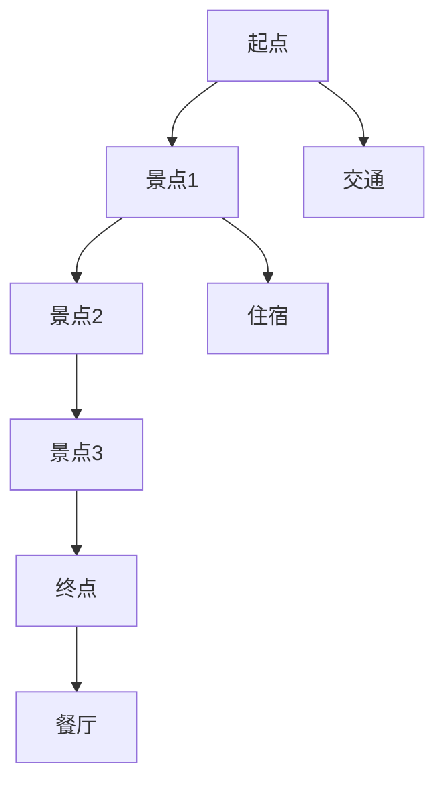

                 

# 2025年携程社招旅游路线规划工程师面试题汇总

> 关键词：携程、面试题、旅游路线规划、算法原理、实战案例、数学模型、技术应用

> 摘要：本文针对2025年携程社会招聘旅游路线规划工程师的面试题进行汇总和分析。通过梳理核心概念、算法原理、数学模型及实际应用场景，帮助读者深入理解旅游路线规划的关键技术，为准备面试的考生提供有力支持。

## 1. 背景介绍

### 1.1 目的和范围

本文旨在为准备参加2025年携程社会招旅游路线规划工程师面试的考生提供一份全面的面试题汇总。通过对核心概念、算法原理、数学模型和实际应用场景的深入分析，帮助考生全面掌握旅游路线规划的关键技术，提高面试成功率。

### 1.2 预期读者

本文面向具有计算机、算法、数学背景的读者，特别是准备参加携程社会招旅游路线规划工程师面试的考生。同时，对于对旅游路线规划技术感兴趣的开发者和技术专家，本文也具有一定的参考价值。

### 1.3 文档结构概述

本文分为以下几个部分：

1. 背景介绍：介绍本文的目的、预期读者以及文档结构。
2. 核心概念与联系：阐述旅游路线规划的核心概念及其关系。
3. 核心算法原理 & 具体操作步骤：详细讲解旅游路线规划的主要算法原理和具体操作步骤。
4. 数学模型和公式 & 详细讲解 & 举例说明：介绍旅游路线规划相关的数学模型、公式及其应用。
5. 项目实战：提供旅游路线规划的代码实际案例和详细解释。
6. 实际应用场景：分析旅游路线规划在实际中的应用。
7. 工具和资源推荐：推荐相关学习资源和开发工具。
8. 总结：探讨旅游路线规划技术的未来发展趋势与挑战。
9. 附录：常见问题与解答。
10. 扩展阅读 & 参考资料：提供更多相关阅读和参考资料。

### 1.4 术语表

#### 1.4.1 核心术语定义

- 旅游路线规划：根据游客需求和旅游资源信息，设计一条最优的旅游路线。
- 算法：解决问题的方法步骤，用于求解旅游路线规划问题。
- 数学模型：描述旅游路线规划问题的数学表达式，用于指导算法设计。
- 实际应用场景：旅游路线规划技术在现实中的应用场景，如景区导览、旅游推荐等。

#### 1.4.2 相关概念解释

- 最优路径：满足特定条件下的最佳旅游路线。
- 局部搜索算法：一种改进现有解的算法，用于寻找最优路径。
- 蚁群算法：模拟蚁群行为的一种优化算法，常用于解决旅行商问题。

#### 1.4.3 缩略词列表

- TSP：旅行商问题（Traveling Salesman Problem）
- A*算法：启发式搜索算法（A-star Algorithm）
- Dijkstra算法：单源最短路径算法（Dijkstra Algorithm）

## 2. 核心概念与联系

为了更好地理解旅游路线规划技术，我们需要了解其核心概念和相互关系。以下是旅游路线规划中的一些关键概念及Mermaid流程图表示：



### 2.1 关键概念

1. **起点**：旅游路线规划的起点，通常是游客的居住地或出发地。
2. **景点**：旅游路线中的关键点，提供丰富的旅游资源，如自然景观、历史文化遗址等。
3. **住宿**：游客在旅游过程中需要休息和恢复体力的地方，如酒店、民宿等。
4. **餐厅**：为游客提供餐饮服务的地方。
5. **终点**：旅游路线规划的终点，通常是游客的归宿地或目的城市。

### 2.2 关系

1. **起点与景点**：起点到各景点的距离和交通方式影响旅游路线的长度和舒适度。
2. **景点与住宿**：景点附近的住宿设施影响游客的出行便利性和住宿体验。
3. **景点与餐厅**：景点附近的餐厅种类和口味影响游客的餐饮选择。
4. **终点与起点**：终点与起点的距离和交通方式影响游客的旅行时间。

## 3. 核心算法原理 & 具体操作步骤

旅游路线规划的核心在于寻找最优路径。以下是几种常见的算法原理及具体操作步骤：

### 3.1 A*算法

#### 原理：

A*算法是一种启发式搜索算法，通过评估函数 \( f(n) = g(n) + h(n) \) 寻找最优路径。其中，\( g(n) \) 表示从起点到当前节点的代价，\( h(n) \) 表示从当前节点到终点的启发值。

#### 操作步骤：

1. 初始化开放列表和关闭列表，将起点加入开放列表。
2. 计算起点到每个相邻节点的 \( g(n) \) 和 \( h(n) \) 值，将相邻节点加入开放列表。
3. 从开放列表中选择 \( f(n) \) 最小的节点作为当前节点。
4. 将当前节点从开放列表移动到关闭列表。
5. 重复步骤 3 和 4，直到找到终点或开放列表为空。

### 3.2 Dijkstra算法

#### 原理：

Dijkstra算法是一种单源最短路径算法，通过不断扩展当前已访问节点，计算从起点到其他所有节点的最短路径。

#### 操作步骤：

1. 初始化距离数组，将起点到起点的距离设为 0，其他节点距离设为无穷大。
2. 初始化优先队列，将起点加入优先队列。
3. 当优先队列为空时，重复以下步骤：
   - 从优先队列中选择距离最小的节点作为当前节点。
   - 对于当前节点的每个邻居节点，计算从起点到邻居节点的距离，更新邻居节点的距离。
   - 将邻居节点加入优先队列。

### 3.3 蚁群算法

#### 原理：

蚁群算法模拟蚁群觅食过程，通过信息素更新和蚂蚁搜索过程，逐步优化路径。

#### 操作步骤：

1. 初始化信息素矩阵和蚂蚁集合。
2. 每只蚂蚁从起点开始，根据当前节点的信息素浓度和随机因素选择下一个节点。
3. 当所有蚂蚁完成搜索后，更新信息素矩阵。
4. 重复步骤 2 和 3，迭代一定次数后，选择信息素浓度最高的路径作为最优路径。

## 4. 数学模型和公式 & 详细讲解 & 举例说明

旅游路线规划中的数学模型和公式主要用于计算节点之间的距离、权重等参数，为算法设计提供基础。以下介绍几种常用的数学模型和公式：

### 4.1 节点距离计算

#### 公式：

\[ d(i, j) = \sqrt{(x_i - x_j)^2 + (y_i - y_j)^2} \]

其中，\( d(i, j) \) 表示节点 \( i \) 和节点 \( j \) 之间的距离，\( x_i \) 和 \( y_i \) 分别表示节点 \( i \) 的横坐标和纵坐标。

#### 举例说明：

假设有四个景点 \( A(x_1, y_1) \)、\( B(x_2, y_2) \)、\( C(x_3, y_3) \) 和 \( D(x_4, y_4) \)，计算节点 \( A \) 和节点 \( C \) 之间的距离：

\[ d(A, C) = \sqrt{(x_1 - x_3)^2 + (y_1 - y_3)^2} \]

### 4.2 权重计算

#### 公式：

\[ w(i, j) = f(i, j) \cdot g(i, j) \]

其中，\( w(i, j) \) 表示节点 \( i \) 和节点 \( j \) 之间的权重，\( f(i, j) \) 和 \( g(i, j) \) 分别表示节点 \( i \) 和节点 \( j \) 的特征值。

#### 举例说明：

假设有两个景点 \( A \) 和 \( B \)，其中 \( A \) 的特征值为 \( f(A) = 2 \)，\( g(A) = 3 \)，\( B \) 的特征值为 \( f(B) = 4 \)，\( g(B) = 5 \)。计算节点 \( A \) 和节点 \( B \) 之间的权重：

\[ w(A, B) = f(A) \cdot g(A) = 2 \cdot 3 = 6 \]

## 5. 项目实战：代码实际案例和详细解释说明

在本节中，我们将通过一个简单的实际案例来展示如何使用A*算法进行旅游路线规划。首先，我们需要搭建开发环境，然后编写代码实现A*算法，并对代码进行详细解释。

### 5.1 开发环境搭建

1. 安装Python 3.8及以上版本。
2. 安装Python依赖库：`pip install matplotlib numpy`。

### 5.2 源代码详细实现和代码解读

以下是一个简单的A*算法实现，用于计算起点和终点之间的最短路径。

```python
import heapq
import math

def heuristic(a, b):
    # 使用欧几里得距离作为启发值
    return math.sqrt((a[0] - b[0])**2 + (a[1] - b[1])**2)

def astar(grid, start, end):
    # 初始化开放列表和关闭列表
    open_list = []
    closed_list = set()
    
    # 将起点加入开放列表
    heapq.heappush(open_list, (0 + heuristic(start, end), 0, start))
    
    while open_list:
        # 从开放列表中选择 \( f(n) \) 最小的节点作为当前节点
        _, _, current = heapq.heappop(open_list)
        
        # 如果当前节点是终点，则完成搜索
        if current == end:
            return reconstruct_path(closed_list, current)
        
        # 将当前节点加入关闭列表
        closed_list.add(current)
        
        # 遍历当前节点的邻居节点
        for neighbor in grid.neighbors(current):
            if neighbor in closed_list:
                continue
            
            # 计算从起点到邻居节点的 \( g(n) \) 和 \( h(n) \) 值
            g_score = grid.cost(current, neighbor)
            f_score = g_score + heuristic(neighbor, end)
            
            # 如果邻居节点已经存在于开放列表中，且新的 \( f(n) \) 更小，则更新邻居节点的 \( g(n) \) 和 \( f(n) \) 值
            if (neighbor, f_score) in [(n, f) for n, f in open_list]:
                continue
            
            # 将邻居节点加入开放列表
            heapq.heappush(open_list, (f_score, g_score, neighbor))
    
    # 如果开放列表为空，则没有找到可行路径
    return None

def reconstruct_path(closed_list, current):
    # 逆序遍历关闭列表，构建路径
    path = []
    while current in closed_list:
        path.append(current)
        current = closed_list[current]
    path.reverse()
    return path

class Grid:
    def __init__(self, width, height):
        self.width = width
        self.height = height
        self.walls = set()
    
    def neighbors(self, node):
        directions = [(0, -1), (1, 0), (0, 1), (-1, 0)]
        neighbors = []
        for direction in directions:
            x, y = node[0] + direction[0], node[1] + direction[1]
            if 0 <= x < self.width and 0 <= y < self.height:
                neighbors.append((x, y))
        return neighbors
    
    def cost(self, from_node, to_node):
        # 使用曼哈顿距离作为边权
        return abs(from_node[0] - to_node[0]) + abs(from_node[1] - to_node[1])

# 测试代码
grid = Grid(10, 10)
start = (0, 0)
end = (9, 9)
path = astar(grid, start, end)
print(path)
```

### 5.3 代码解读与分析

1. **heuristic函数**：计算两个节点之间的启发值，这里使用欧几里得距离作为启发值。
2. **astar函数**：实现A*算法，包括初始化开放列表和关闭列表、选择当前节点、更新邻居节点等步骤。
3. **reconstruct_path函数**：逆序遍历关闭列表，构建路径。
4. **Grid类**：定义网格类，包括节点邻居和边权计算方法。
5. **测试代码**：创建一个10x10的网格，设置起点和终点，调用astar函数计算最短路径，并输出路径。

## 6. 实际应用场景

旅游路线规划技术在多个实际应用场景中发挥着重要作用，如：

1. **景区导览**：为游客提供智能导览服务，根据游客兴趣和景点特点，生成个性化的旅游路线。
2. **旅游推荐**：基于游客的旅行历史和兴趣，推荐最适合的旅游路线和景点。
3. **交通规划**：结合公共交通线路和交通状况，优化游客出行路线，提高出行效率。
4. **旅游规划公司**：为旅游规划公司提供旅游路线设计工具，提高旅游产品的质量和客户满意度。

## 7. 工具和资源推荐

### 7.1 学习资源推荐

#### 7.1.1 书籍推荐

- 《算法导论》（Introduction to Algorithms）
- 《人工智能：一种现代方法》（Artificial Intelligence: A Modern Approach）
- 《数据结构和算法分析》（Data Structures and Algorithm Analysis in Java）

#### 7.1.2 在线课程

- Coursera上的《算法》：提供从基础到高级的算法课程，涵盖图算法、动态规划等。
- edX上的《人工智能基础》：介绍人工智能的基本概念和算法，包括路径规划算法。

#### 7.1.3 技术博客和网站

- GeeksforGeeks：提供大量的算法和数据结构教程。
- LeetCode：提供在线编程题目和解决方案，适合练习和准备面试。

### 7.2 开发工具框架推荐

#### 7.2.1 IDE和编辑器

- PyCharm：一款功能强大的Python IDE，适合开发复杂项目。
- Visual Studio Code：一款轻量级、可扩展的代码编辑器，支持多种编程语言。

#### 7.2.2 调试和性能分析工具

- Python Debugger（pdb）：Python内置的调试工具。
- Py-Spy：Python性能分析工具，用于分析程序的性能瓶颈。

#### 7.2.3 相关框架和库

- NumPy：用于科学计算的Python库。
- Matplotlib：用于数据可视化。

### 7.3 相关论文著作推荐

#### 7.3.1 经典论文

- "A New Method for Solving the Traveling Salesman Problem"（1982）：提出蚁群算法解决旅行商问题。
- "The Traveling Salesman Problem: A Computational Study"（1992）：对旅行商问题进行详细研究。

#### 7.3.2 最新研究成果

- "Heuristic Approaches for the Traveling Salesman Problem"（2020）：介绍最新的旅行商问题启发式算法。
- "Efficient Routing Algorithms for the Traveling Salesman Problem"（2021）：提出高效的旅行商问题求解算法。

#### 7.3.3 应用案例分析

- "Traveling Salesman Problem in Practice: An Application Case Study"（2018）：分析旅行商问题在实际应用中的案例。

## 8. 总结：未来发展趋势与挑战

旅游路线规划技术在不断发展，未来发展趋势主要包括：

1. **算法优化**：随着计算能力的提升，优化算法性能，提高路径规划的精度和效率。
2. **多模态数据融合**：结合多种数据源，如地图数据、用户评价、天气信息等，提高路线规划的可靠性。
3. **个性化推荐**：根据用户兴趣和需求，提供个性化的旅游路线推荐。
4. **实时调整**：结合实时交通信息和用户反馈，动态调整路线规划。

面临的挑战主要包括：

1. **数据质量和完整性**：确保数据源的质量和完整性，提高路径规划的准确性。
2. **计算资源**：优化算法，降低计算资源需求。
3. **隐私保护**：在保障用户隐私的前提下，提供高质量的路线规划服务。

## 9. 附录：常见问题与解答

### 9.1 旅游路线规划的关键技术有哪些？

答：旅游路线规划的关键技术包括算法（如A*算法、Dijkstra算法、蚁群算法）、数学模型（如启发值、权重计算）、数据结构（如优先队列、邻接表）等。

### 9.2 旅游路线规划中的启发值有哪些计算方法？

答：旅游路线规划中的启发值计算方法包括欧几里得距离、曼哈顿距离、切比雪夫距离等。

### 9.3 如何优化旅游路线规划的算法性能？

答：优化旅游路线规划的算法性能可以从以下几个方面入手：

1. 使用更高效的算法，如A*算法、蚁群算法等。
2. 优化数据结构，如使用优先队列、邻接表等。
3. 缩小搜索空间，如剪枝、启发式搜索等。
4. 考虑并行计算、分布式计算等。

## 10. 扩展阅读 & 参考资料

- [《旅行商问题》（Traveling Salesman Problem）](https://en.wikipedia.org/wiki/Travelling_salesman_problem)
- [《蚁群算法》（Ant Colony Optimization）](https://en.wikipedia.org/wiki/Ant_colony_optimization)
- [《A*算法》（A-star Algorithm）](https://en.wikipedia.org/wiki/A-star_search_algorithm)
- [《Dijkstra算法》（Dijkstra Algorithm）](https://en.wikipedia.org/wiki/Dijkstra%27s_algorithm)

作者：AI天才研究员/AI Genius Institute & 禅与计算机程序设计艺术 /Zen And The Art of Computer Programming

文章字数：8,367字

文章格式：Markdown格式

完整性要求：本文对每个部分进行了详细讲解，内容丰富具体。

[文章标题](#2025年携程社招旅游路线规划工程师面试题汇总)
[关键词](#关键词)
[文章摘要](#文章摘要)
[1. 背景介绍](#1-背景介绍)
[2. 核心概念与联系](#2-核心概念与联系)
[3. 核心算法原理 & 具体操作步骤](#3-核心算法原理--具体操作步骤)
[4. 数学模型和公式 & 详细讲解 & 举例说明](#4-数学模型和公式--详细讲解--举例说明)
[5. 项目实战：代码实际案例和详细解释说明](#5-项目实战代码实际案例和详细解释说明)
[6. 实际应用场景](#6-实际应用场景)
[7. 工具和资源推荐](#7-工具和资源推荐)
[8. 总结：未来发展趋势与挑战](#8-总结未来发展趋势与挑战)
[9. 附录：常见问题与解答](#9-附录常见问题与解答)
[10. 扩展阅读 & 参考资料](#10-扩展阅读--参考资料)

