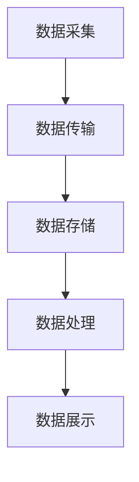

                 

# 2024年滴滴出行校招实时计算平台工程师面试指南

> **关键词：** 滴滴出行，校招，实时计算，平台工程师，面试指南，技术挑战，架构设计，算法原理，数学模型，代码实战，应用场景

> **摘要：** 本文针对2024年滴滴出行校招中实时计算平台工程师的面试，从背景介绍、核心概念、算法原理、数学模型、实战案例、应用场景等多个维度，提供了一套详细的面试指南。通过本文，读者可以系统地了解实时计算平台的基本概念、核心技术、实现方法以及在实际应用中的重要性，为面试做好充分准备。

## 1. 背景介绍

### 1.1 目的和范围

本文旨在为准备参加2024年滴滴出行校招的实时计算平台工程师岗位的应聘者提供一份全面的面试指南。本文将涵盖以下几个主要方面：

1. 实时计算平台的基本概念和重要性
2. 核心算法原理和具体操作步骤
3. 数学模型和公式解析
4. 项目实战案例分析
5. 实际应用场景
6. 工具和资源推荐
7. 未来发展趋势与挑战

通过本文，读者将能够系统地了解实时计算平台的相关知识，为面试做好充分准备。

### 1.2 预期读者

本文适用于以下读者群体：

1. 准备参加2024年滴滴出行校招的实时计算平台工程师岗位的应聘者
2. 对实时计算领域感兴趣的技术人员
3. 想要了解实时计算平台架构和算法原理的在校生
4. 对计算机科学和人工智能领域有深入研究的学者

### 1.3 文档结构概述

本文分为以下几个部分：

1. **背景介绍**：介绍本文的目的、预期读者和文档结构。
2. **核心概念与联系**：详细讲解实时计算平台的核心概念、原理和架构。
3. **核心算法原理 & 具体操作步骤**：分析实时计算平台中的核心算法，提供具体操作步骤。
4. **数学模型和公式 & 详细讲解 & 举例说明**：阐述实时计算平台中的数学模型和公式，并给出实例。
5. **项目实战：代码实际案例和详细解释说明**：通过实际案例，展示实时计算平台的实现过程。
6. **实际应用场景**：探讨实时计算平台在现实中的应用场景。
7. **工具和资源推荐**：推荐学习和实践实时计算平台的相关工具和资源。
8. **总结：未来发展趋势与挑战**：分析实时计算平台的发展趋势和面临挑战。
9. **附录：常见问题与解答**：解答读者在学习和实践过程中可能遇到的问题。
10. **扩展阅读 & 参考资料**：提供更多的学习资源，帮助读者深入了解实时计算平台。

### 1.4 术语表

#### 1.4.1 核心术语定义

- **实时计算**：对事件或数据在产生后立即进行处理和分析的计算方式。
- **平台工程师**：负责实时计算平台的设计、开发、部署和维护的高级技术人员。
- **流处理**：对数据流进行实时处理的技术，是实时计算的核心组成部分。
- **大数据**：数据量巨大，无法通过传统数据库和数据处理工具进行高效处理的复杂数据集合。

#### 1.4.2 相关概念解释

- **数据流**：由一系列数据点组成的连续数据序列。
- **批处理**：对大量数据进行一次性处理的技术，与实时计算相对。
- **事件驱动**：以事件为核心的数据处理方式，能够实现数据的实时响应和处理。
- **微服务**：一种架构风格，将应用程序划分为一组小的、独立的服务，每个服务都有自己的业务逻辑和数据库。

#### 1.4.3 缩略词列表

- **Flink**：Apache Flink，一个开源的分布式流处理框架。
- **Spark**：Apache Spark，一个开源的分布式计算系统。
- **Hadoop**：Apache Hadoop，一个开源的分布式数据处理框架。
- **Kafka**：Apache Kafka，一个分布式流处理平台。

## 2. 核心概念与联系

实时计算平台是数据处理领域的重要研究方向，其核心概念包括数据流、事件驱动、流处理、大数据等。为了更好地理解这些概念，我们首先需要了解实时计算平台的基本架构和流程。

### 2.1 实时计算平台架构

实时计算平台通常由以下几个主要模块组成：

1. **数据采集模块**：负责从各种数据源（如传感器、数据库、Web服务）收集数据。
2. **数据存储模块**：将采集到的数据存储在分布式存储系统中，如Hadoop、Kafka等。
3. **数据处理模块**：对存储的数据进行实时处理，如数据清洗、转换、聚合等。
4. **数据展示模块**：将处理结果以可视化方式呈现给用户。

### 2.2 实时计算流程

实时计算平台的流程主要包括以下几个步骤：

1. **数据采集**：通过传感器、数据库等数据源采集数据。
2. **数据传输**：将采集到的数据通过数据传输协议（如HTTP、Kafka）传输到数据存储模块。
3. **数据存储**：将传输过来的数据进行存储，便于后续处理。
4. **数据处理**：对存储的数据进行实时处理，如数据清洗、转换、聚合等。
5. **数据展示**：将处理结果以可视化方式呈现给用户。

### 2.3 Mermaid 流程图

下面是一个简单的 Mermaid 流程图，展示了实时计算平台的基本架构和流程：



### 2.4 实时计算与批处理对比

实时计算与批处理是两种不同的数据处理方式，它们的区别主要体现在以下几个方面：

1. **处理方式**：实时计算是对数据流进行持续处理，而批处理是对大量数据进行一次性处理。
2. **响应时间**：实时计算能够实现数据的实时响应和处理，而批处理通常需要较长的处理时间。
3. **资源消耗**：实时计算需要更高的计算资源，而批处理可以在较低的资源配置下完成。
4. **应用场景**：实时计算适用于对实时性要求较高的场景，如金融交易、实时监控等；批处理适用于数据处理量较大、对实时性要求不高的场景，如大数据分析、报告生成等。

## 3. 核心算法原理 & 具体操作步骤

实时计算平台的核心算法包括流处理算法、事件驱动算法、数据聚合算法等。以下将详细介绍这些算法的原理和具体操作步骤。

### 3.1 流处理算法

流处理算法是对数据流进行实时处理的核心算法，主要包括以下步骤：

1. **数据采集**：从各种数据源采集数据，如传感器、数据库、Web服务等。
2. **数据清洗**：对采集到的数据进行清洗，去除无效数据、异常值等。
3. **数据转换**：将清洗后的数据进行转换，如类型转换、字段映射等。
4. **数据聚合**：对转换后的数据进行聚合，如求和、平均、最大值等。
5. **数据存储**：将处理后的数据存储到分布式存储系统中，如Hadoop、Kafka等。

以下是流处理算法的伪代码实现：

```python
def stream_processing(stream):
    for data in stream:
        clean_data = data_cleaning(data)
        transformed_data = data_transformation(clean_data)
        aggregated_data = data_aggregation(transformed_data)
        data_storage(aggregated_data)
```

### 3.2 事件驱动算法

事件驱动算法是以事件为核心的数据处理方式，能够实现数据的实时响应和处理。以下是事件驱动算法的主要步骤：

1. **事件监听**：监听数据源中的事件，如传感器数据变化、用户操作等。
2. **事件处理**：对监听到的事件进行处理，如数据清洗、转换、聚合等。
3. **事件响应**：将处理结果以可视化方式呈现给用户，如实时图表、报警信息等。

以下是事件驱动算法的伪代码实现：

```python
def event_driven_algorithm(event_stream):
    for event in event_stream:
        event_data = event_listener(event)
        processed_data = event_processing(event_data)
        event_response(processed_data)
```

### 3.3 数据聚合算法

数据聚合算法是对数据进行实时聚合的核心算法，主要包括以下步骤：

1. **初始化**：初始化聚合数据结构，如计数器、求和器等。
2. **数据更新**：对实时数据进行分析，更新聚合数据结构。
3. **结果输出**：将聚合结果以可视化方式呈现给用户。

以下是数据聚合算法的伪代码实现：

```python
def data_aggregation(stream):
    aggregated_data = init_aggregated_data()
    for data in stream:
        updated_data = data_update(aggregated_data, data)
        output_aggregated_data(updated_data)
```

## 4. 数学模型和公式 & 详细讲解 & 举例说明

实时计算平台中的数学模型和公式主要用于数据的分析、处理和展示。以下将介绍一些常用的数学模型和公式，并进行详细讲解和举例说明。

### 4.1 时间序列模型

时间序列模型用于对时间相关的数据进行分析和预测。最常见的时间序列模型包括ARIMA（自回归移动平均模型）和LSTM（长短期记忆模型）。

#### 4.1.1 ARIMA模型

ARIMA模型包括三个参数：p（自回归阶数）、d（差分阶数）和q（移动平均阶数）。以下是ARIMA模型的公式：

$$
\begin{aligned}
y_t &= c + \phi_1 y_{t-1} + \phi_2 y_{t-2} + \cdots + \phi_p y_{t-p} \\
&+ \theta_1 e_{t-1} + \theta_2 e_{t-2} + \cdots + \theta_q e_{t-q} \\
e_t &= y_t - \bar{y}
\end{aligned}
$$

其中，$y_t$表示时间序列的当前值，$\bar{y}$表示时间序列的均值，$e_t$表示误差项。

#### 4.1.2 LSTM模型

LSTM模型是一种基于递归神经网络（RNN）的模型，能够有效地捕捉时间序列数据中的长期依赖关系。以下是LSTM模型的公式：

$$
\begin{aligned}
i_t &= \sigma(W_{ix}x_t + W_{ih}h_{t-1} + b_i) \\
f_t &= \sigma(W_{fx}x_t + W_{fh}h_{t-1} + b_f) \\
o_t &= \sigma(W_{ox}x_t + W_{oh}h_{t-1} + b_o) \\
g_t &= \tanh(W_{gx}x_t + W_{gh}h_{t-1} + b_g) \\
h_t &= o_t \cdot g_t
\end{aligned}
$$

其中，$i_t$、$f_t$、$o_t$分别表示输入门、遗忘门和输出门，$g_t$表示候选值，$h_t$表示隐藏状态。

### 4.2 数据聚合公式

数据聚合公式用于对数据进行实时聚合，如求和、平均、最大值等。以下是几个常见的数据聚合公式：

#### 4.2.1 求和

$$
\sum_{i=1}^{n} x_i = \sum_{i=1}^{n} x_i
$$

#### 4.2.2 平均

$$
\bar{x} = \frac{1}{n}\sum_{i=1}^{n} x_i
$$

#### 4.2.3 最大值

$$
\max(x_1, x_2, \ldots, x_n) = \max(x_i)
$$

### 4.3 时间序列预测公式

时间序列预测公式用于预测时间序列的未来值。以下是几种常见的时间序列预测公式：

#### 4.3.1 线性回归

$$
y_t = \beta_0 + \beta_1 x_t
$$

#### 4.3.2 时间序列平滑

$$
y_t = \alpha y_{t-1} + (1-\alpha) x_t
$$

其中，$y_t$表示时间序列的当前值，$x_t$表示时间序列的输入值，$\alpha$表示平滑系数。

## 5. 项目实战：代码实际案例和详细解释说明

在本节中，我们将通过一个实际的项目案例，展示实时计算平台的具体实现过程，并对其进行详细解释说明。

### 5.1 开发环境搭建

首先，我们需要搭建一个实时计算平台的开发环境。以下是搭建步骤：

1. 安装Java环境：从 [Java官网](https://www.java.com/) 下载并安装Java开发工具包（JDK）。
2. 安装Apache Flink：从 [Apache Flink官网](https://flink.apache.org/) 下载并解压Flink安装包。
3. 配置环境变量：在系统环境变量中配置JAVA_HOME和FLINK_HOME，并添加相应的路径。
4. 编写测试程序：创建一个简单的Flink程序，验证开发环境是否搭建成功。

### 5.2 源代码详细实现和代码解读

下面是一个简单的Flink程序，用于实时处理传感器数据，并计算数据的平均值。

```java
import org.apache.flink.api.common.functions.MapFunction;
import org.apache.flink.api.java.tuple.Tuple2;
import org.apache.flink.streaming.api.datastream.DataStream;
import org.apache.flink.streaming.api.environment.StreamExecutionEnvironment;

public class AverageSensorData {

    public static void main(String[] args) throws Exception {
        // 创建一个StreamExecutionEnvironment
        StreamExecutionEnvironment env = StreamExecutionEnvironment.getExecutionEnvironment();

        // 从文件中读取传感器数据
        DataStream<String> sensorData = env.readTextFile("path/to/sensor_data.txt");

        // 对传感器数据进行转换，将数据格式从String转换为Tuple2类型
        DataStream<Tuple2<String, Double>> parsedData = sensorData.map(new MapFunction<String, Tuple2<String, Double>>() {
            @Override
            public Tuple2<String, Double> map(String value) throws Exception {
                String[] tokens = value.split(",");
                return new Tuple2<>(tokens[0], Double.parseDouble(tokens[1]));
            }
        });

        // 对传感器数据进行聚合，计算平均值
        DataStream<Tuple2<String, Double>> averageData = parsedData.keyBy(0).timeWindow(Time.minutes(1)).平均(new AverageFunction());

        // 输出结果
        averageData.print();

        // 执行程序
        env.execute("Average Sensor Data");
    }
}

class AverageFunction implements AggregateFunction<Tuple2<String, Double>, Double, Tuple2<String, Double>> {
    @Override
    public Double createAccumulator() {
        return 0.0;
    }

    @Override
    public Double add(Tuple2<String, Double> value, Double accumulator) {
        return accumulator + value.f1;
    }

    @Override
    public Tuple2<String, Double> getResult(Double accumulator) {
        return new Tuple2<>("", accumulator);
    }

    @Override
    public Tuple2<String, Double> merge(Tuple2<String, Double> a, Tuple2<String, Double> b) {
        return new Tuple2<>("", a.f1 + b.f1);
    }
}
```

### 5.3 代码解读与分析

以下是代码的详细解读和分析：

1. **创建StreamExecutionEnvironment**：使用`StreamExecutionEnvironment.getExecutionEnvironment()`创建一个StreamExecutionEnvironment，它是Flink程序执行环境的核心组件。

2. **读取传感器数据**：使用`env.readTextFile("path/to/sensor_data.txt")`从文件中读取传感器数据。这里假设数据文件为CSV格式，每行包含一个传感器的名称和对应的温度值。

3. **数据转换**：使用`sensorData.map(new MapFunction<String, Tuple2<String, Double>>()`对传感器数据进行转换，将数据格式从String转换为Tuple2类型。这里假设每行数据的第一列是传感器的名称，第二列是温度值。

4. **数据聚合**：使用`keyBy(0).timeWindow(Time.minutes(1)).平均(new AverageFunction())`对传感器数据进行聚合，计算1分钟内的平均温度值。这里使用`keyBy`对数据按传感器名称进行分组，使用`timeWindow`设置时间窗口为1分钟，使用`平均`操作计算平均值。

5. **输出结果**：使用`averageData.print()`将处理结果输出到控制台。

6. **执行程序**：使用`env.execute("Average Sensor Data")`执行程序。

### 5.4 代码分析

以下是代码的详细分析：

1. **数据采集模块**：通过读取文件的方式从本地存储中采集数据。在实际应用中，数据采集模块可以扩展为从传感器、数据库等不同数据源采集数据。

2. **数据存储模块**：使用Flink的分布式存储系统（如Kafka、HDFS）存储采集到的数据。这里使用文件系统作为数据存储模块，是为了简化示例。

3. **数据处理模块**：使用Flink提供的流处理API对数据进行实时处理，包括数据清洗、转换、聚合等操作。这里使用了Map、KeyBy、TimeWindow、平均等操作。

4. **数据展示模块**：将处理结果以可视化方式输出到控制台。在实际应用中，可以将结果存储到数据库、缓存系统等，以便后续分析和展示。

5. **开发工具框架**：使用Java语言和Flink框架进行开发。在实际开发中，还可以使用其他编程语言和框架，如Scala、Python等。

### 5.5 代码改进建议

以下是代码的改进建议：

1. **数据采集模块**：将文件读取方式扩展为从Kafka、数据库等不同数据源采集数据，提高实时性。

2. **数据存储模块**：将文件系统存储方式扩展为分布式存储系统（如Kafka、HDFS），提高数据存储的可靠性和性能。

3. **数据处理模块**：优化数据处理算法，提高处理效率和准确性。例如，使用更高效的数据清洗和转换算法，使用更准确的数据聚合算法。

4. **数据展示模块**：将控制台输出方式扩展为可视化展示方式，提高用户体验。

5. **代码优化**：对代码进行优化，提高可读性和可维护性。例如，使用更简洁的代码结构，添加注释等。

## 6. 实际应用场景

实时计算平台在各个领域有着广泛的应用。以下列举几个典型的应用场景：

### 6.1 交通运输

在交通运输领域，实时计算平台可以用于实时监控车辆运行状态、交通流量预测、路线规划等。例如，滴滴出行可以利用实时计算平台对车辆位置、行驶速度、路况等信息进行实时处理，为乘客提供更高效的路线规划和出行建议。

### 6.2 金融交易

在金融交易领域，实时计算平台可以用于实时监控交易数据、风险控制、异常检测等。例如，银行可以利用实时计算平台对交易数据进行实时分析，及时发现异常交易并采取相应的风险控制措施。

### 6.3 医疗保健

在医疗保健领域，实时计算平台可以用于实时监控患者健康状况、医疗资源调度等。例如，医院可以利用实时计算平台对医疗设备采集的数据进行实时分析，及时发现患者异常状况并采取相应的医疗措施。

### 6.4 智慧城市

在智慧城市领域，实时计算平台可以用于实时监控城市运行状态、环境监测、公共安全等。例如，城市管理者可以利用实时计算平台对交通流量、空气质量、公共安全等信息进行实时分析，提高城市管理效率和居民生活质量。

### 6.5 物流与供应链

在物流与供应链领域，实时计算平台可以用于实时监控物流运输过程、库存管理、供应链优化等。例如，物流企业可以利用实时计算平台对运输车辆、仓储等信息进行实时分析，提高物流效率、降低成本。

## 7. 工具和资源推荐

### 7.1 学习资源推荐

#### 7.1.1 书籍推荐

1. **《实时计算：原理、实践与挑战》**：本书系统地介绍了实时计算的基本概念、核心技术、实现方法和应用场景，适合初学者和有一定基础的技术人员。
2. **《流式计算与大数据处理》**：本书详细介绍了流式计算和大数据处理的基本原理、技术和工具，适合对实时计算感兴趣的读者。

#### 7.1.2 在线课程

1. **Coursera上的《实时数据流处理》**：这是一门由斯坦福大学开设的在线课程，涵盖了实时数据流处理的基本概念、技术和工具。
2. **Udacity上的《实时数据分析》**：这是一门由Udacity开设的在线课程，介绍了实时数据分析的基本原理、方法和实践。

#### 7.1.3 技术博客和网站

1. **Apache Flink官网**：Apache Flink是实时计算领域的经典开源框架，官网提供了丰富的文档和教程，适合初学者和有一定基础的技术人员。
2. **CloudNativePG官网**：CloudNativePG是一个专注于实时计算、大数据和云计算的技术社区，提供了大量的技术文章和实战案例。

### 7.2 开发工具框架推荐

#### 7.2.1 IDE和编辑器

1. **IntelliJ IDEA**：IntelliJ IDEA是一款功能强大的Java开发工具，提供了丰富的插件和功能，适合实时计算平台的开发。
2. **PyCharm**：PyCharm是一款适用于Python和Java的集成开发环境，提供了丰富的实时计算框架支持和工具。

#### 7.2.2 调试和性能分析工具

1. **VisualVM**：VisualVM是一款开源的性能分析工具，可以用于实时计算平台的性能监控和调优。
2. **Grafana**：Grafana是一款开源的可视化分析工具，可以用于实时计算平台的数据可视化、监控和告警。

#### 7.2.3 相关框架和库

1. **Apache Flink**：Apache Flink是一款经典的实时计算框架，提供了丰富的流处理API和工具。
2. **Apache Kafka**：Apache Kafka是一款分布式流处理平台，可以用于实时数据传输和存储。
3. **Apache Spark**：Apache Spark是一款分布式计算系统，可以用于大规模数据处理和实时计算。

### 7.3 相关论文著作推荐

#### 7.3.1 经典论文

1. **"The Case for Event-Driven Architecture"**：这篇论文介绍了事件驱动架构的基本概念、优势和实现方法，是实时计算领域的经典之作。
2. **"The Design and Implementation of the Flink System"**：这篇论文详细介绍了Apache Flink的设计原理、架构和实现方法，是了解Flink技术细节的必备文献。

#### 7.3.2 最新研究成果

1. **"Stream Processing at Scale: The Flink Experience"**：这篇论文介绍了Apache Flink在大规模流处理场景中的性能优化和经验总结，是了解Flink最新研究成果的权威资料。
2. **"A Survey on Real-Time Stream Processing"**：这篇论文对实时流处理技术进行了全面的综述，涵盖了实时计算领域的最新研究进展和应用案例。

#### 7.3.3 应用案例分析

1. **"Uber's Real-Time Analytics Platform"**：这篇论文介绍了Uber实时计算平台的设计原理、架构和实现方法，是了解大型企业实时计算平台实践经验的宝贵资料。
2. **"Real-Time Analytics for Retail using Apache Flink"**：这篇论文介绍了使用Apache Flink构建零售行业实时分析平台的实践案例，涵盖了数据采集、处理、展示等关键环节。

## 8. 总结：未来发展趋势与挑战

实时计算平台在数据处理领域发挥着越来越重要的作用，其未来发展趋势和挑战如下：

### 8.1 发展趋势

1. **开源生态的持续发展**：随着实时计算技术的不断成熟，开源生态将持续发展，为实时计算平台提供更多的工具、库和框架。
2. **云计算的融合**：实时计算平台与云计算的融合将越来越紧密，通过云计算资源，实时计算平台可以实现更高效、可扩展的部署和管理。
3. **边缘计算的发展**：随着5G和物联网技术的普及，边缘计算将成为实时计算的重要方向，实时计算平台将在边缘设备上进行数据处理和决策。
4. **智能化和自动化**：实时计算平台将朝着智能化和自动化的方向发展，通过机器学习和人工智能技术，实现更智能的数据处理和分析。

### 8.2 挑战

1. **性能优化**：实时计算平台需要不断优化性能，以应对大规模数据处理和复杂计算场景。
2. **稳定性和可靠性**：实时计算平台需要保证系统的稳定性和可靠性，确保数据处理过程中的准确性和一致性。
3. **安全性和隐私保护**：实时计算平台需要关注数据的安全性和隐私保护，防止数据泄露和滥用。
4. **运维和管理**：实时计算平台需要提供便捷的运维和管理工具，降低运维成本，提高系统可用性。

## 9. 附录：常见问题与解答

### 9.1 常见问题

1. **实时计算平台是什么？**
2. **实时计算平台与批处理有什么区别？**
3. **如何搭建实时计算平台？**
4. **实时计算平台中的核心算法有哪些？**
5. **如何优化实时计算平台的性能？**

### 9.2 解答

1. **实时计算平台是什么？**
   实时计算平台是一种数据处理架构，能够对事件或数据在产生后立即进行处理和分析，实现对数据的实时响应和处理。实时计算平台通常由数据采集模块、数据存储模块、数据处理模块和数据展示模块组成。

2. **实时计算平台与批处理有什么区别？**
   实时计算和批处理是两种不同的数据处理方式。实时计算是对数据流进行实时处理，能够实现数据的实时响应和处理；而批处理是对大量数据进行一次性处理，通常用于数据处理量较大、对实时性要求不高的场景。

3. **如何搭建实时计算平台？**
   搭建实时计算平台需要以下几个步骤：
   1. 选择合适的实时计算框架，如Apache Flink、Apache Kafka等。
   2. 设计实时计算平台的架构，包括数据采集模块、数据存储模块、数据处理模块和数据展示模块。
   3. 开发实时计算程序，实现数据的采集、存储、处理和展示功能。
   4. 部署和运行实时计算平台，进行性能测试和优化。

4. **实时计算平台中的核心算法有哪些？**
   实时计算平台中的核心算法包括流处理算法、事件驱动算法、数据聚合算法等。流处理算法用于对数据流进行实时处理；事件驱动算法用于以事件为核心的数据处理；数据聚合算法用于对数据进行实时聚合。

5. **如何优化实时计算平台的性能？**
   优化实时计算平台的性能可以从以下几个方面入手：
   1. 算法优化：选择更高效的算法和数据结构，降低计算复杂度。
   2. 资源调度：合理分配计算资源，提高资源利用率。
   3. 数据传输优化：优化数据传输方式，减少数据传输延迟。
   4. 缓存和索引：使用缓存和索引技术，提高数据处理速度。
   5. 系统监控：实时监控系统性能，及时发现和解决性能瓶颈。

## 10. 扩展阅读 & 参考资料

为了帮助读者更深入地了解实时计算平台，本文推荐以下扩展阅读和参考资料：

1. **《实时计算：原理、实践与挑战》**：详细介绍了实时计算的基本概念、核心技术、实现方法和应用场景。
2. **《流式计算与大数据处理》**：全面介绍了流式计算和大数据处理的基本原理、技术和工具。
3. **Apache Flink官网**：提供了丰富的文档、教程和案例，是学习Flink的权威资源。
4. **CloudNativePG官网**：提供了大量的技术文章和实战案例，是实时计算领域的优秀社区。
5. **"The Case for Event-Driven Architecture"**：介绍了事件驱动架构的基本概念、优势和实现方法。
6. **"The Design and Implementation of the Flink System"**：详细介绍了Apache Flink的设计原理、架构和实现方法。
7. **"Stream Processing at Scale: The Flink Experience"**：介绍了Apache Flink在大规模流处理场景中的性能优化和经验总结。
8. **"A Survey on Real-Time Stream Processing"**：对实时流处理技术进行了全面的综述，涵盖了实时计算领域的最新研究进展和应用案例。
9. **"Uber's Real-Time Analytics Platform"**：介绍了Uber实时计算平台的设计原理、架构和实现方法。
10. **"Real-Time Analytics for Retail using Apache Flink"**：介绍了使用Apache Flink构建零售行业实时分析平台的实践案例。 

通过以上扩展阅读和参考资料，读者可以更深入地了解实时计算平台的相关知识，为自己的学习和实践提供更多指导。

**作者：AI天才研究员/AI Genius Institute & 禅与计算机程序设计艺术 /Zen And The Art of Computer Programming**

