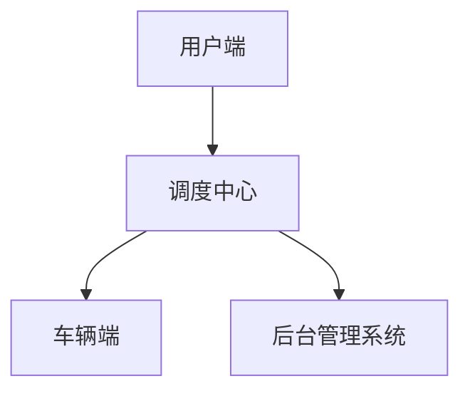
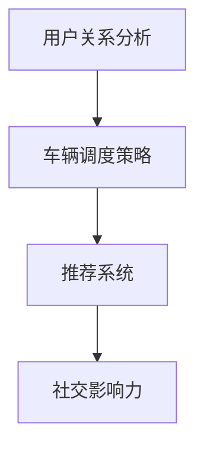
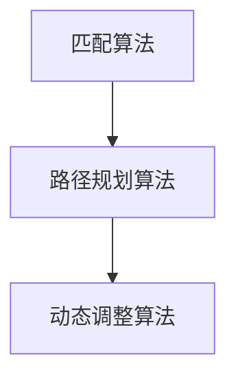
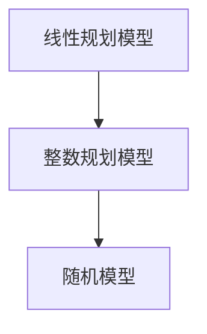

                 

# 2025年滴滴社交网约车调度平台工程师面试题详解

> 关键词：滴滴、社交网约车、调度平台、工程师面试题、技术解析、算法、架构设计、案例实战

> 摘要：本文将深入探讨2025年滴滴社交网约车调度平台工程师面试题的各个方面，包括核心概念、算法原理、数学模型、实战案例等。通过对问题的逐个剖析，为读者提供一套完整的面试题解方案，帮助准备面试的工程师更好地理解相关技术和实际问题。

## 1. 背景介绍

### 1.1 目的和范围

本文旨在为滴滴社交网约车调度平台工程师的面试备考提供一份详细的解答指南。文章将围绕以下几个核心主题展开：

1. 调度平台的整体架构和核心技术。
2. 社交网络在网约车调度中的应用。
3. 算法原理及其实现。
4. 数学模型在调度优化中的作用。
5. 实际项目中的代码实现和分析。

### 1.2 预期读者

本文适合以下读者群体：

- 拟加入滴滴社交网约车调度平台团队的开发工程师。
- 准备参加滴滴面试的相关技术人员。
- 对网约车调度平台技术和算法有兴趣的读者。

### 1.3 文档结构概述

本文分为十个部分，具体结构如下：

1. **背景介绍**：介绍文章的目的、范围、预期读者以及文档结构。
2. **核心概念与联系**：介绍调度平台的核心概念和架构。
3. **核心算法原理 & 具体操作步骤**：讲解调度平台的核心算法及其实现。
4. **数学模型和公式 & 详细讲解 & 举例说明**：阐述调度优化中的数学模型和公式。
5. **项目实战：代码实际案例和详细解释说明**：提供实际代码案例并进行详细解读。
6. **实际应用场景**：分析调度平台在实际中的应用。
7. **工具和资源推荐**：推荐学习资源和开发工具。
8. **总结：未来发展趋势与挑战**：总结调度平台的发展趋势和面临的挑战。
9. **附录：常见问题与解答**：回答一些常见面试问题。
10. **扩展阅读 & 参考资料**：提供进一步阅读的参考资料。

### 1.4 术语表

#### 1.4.1 核心术语定义

- **社交网约车调度平台**：结合社交网络和智能调度算法的网约车平台。
- **调度算法**：用于决定车辆如何分配和调度乘客请求的算法。
- **匹配效率**：衡量乘客与车辆匹配速度的指标。
- **公平性**：在调度过程中，确保所有用户都能得到公平对待。
- **扩展性**：系统在处理更大规模数据和请求时的性能。

#### 1.4.2 相关概念解释

- **社交网络**：用户之间通过关系连接形成的网络结构。
- **实时数据处理**：在调度过程中，快速处理和分析大量实时数据。
- **负载均衡**：在不同服务器之间分配请求，以避免单点过载。

#### 1.4.3 缩略词列表

- **API**：应用程序编程接口（Application Programming Interface）
- **SDK**：软件开发工具包（Software Development Kit）
- **DB**：数据库（Database）
- **NLP**：自然语言处理（Natural Language Processing）

## 2. 核心概念与联系

在理解滴滴社交网约车调度平台之前，我们需要掌握一些核心概念和它们之间的联系。以下是这些概念以及它们的联系：

### 2.1 调度平台的架构

滴滴社交网约车调度平台是一个复杂的大规模系统，其核心架构包括以下几个方面：

1. **用户端**：用户通过滴滴APP发起出行请求。
2. **调度中心**：处理用户请求，进行车辆分配和调度。
3. **车辆端**：接收调度指令，完成乘客接送任务。
4. **后台管理系统**：监控整个调度平台的运行状态，进行数据分析和调优。

#### Mermaid 流程图：



### 2.2 社交网络的应用

社交网络在网约车调度中有重要作用，主要体现在以下几个方面：

1. **用户关系分析**：通过分析用户之间的关系，可以优化车辆调度策略，提高匹配效率。
2. **推荐系统**：基于用户社交网络数据，推荐可能的出行同伴，提高共享出行的比例。
3. **社交影响力**：通过社交网络传播打车信息，提高平台的知名度。

#### Mermaid 流程图：



### 2.3 算法原理

调度平台的核心是调度算法，主要包括以下几种：

1. **匹配算法**：用于确定乘客和车辆之间的匹配关系。
2. **路径规划算法**：用于规划车辆的行驶路线，确保高效且安全。
3. **动态调整算法**：在调度过程中，根据实时数据动态调整调度策略。

#### Mermaid 流�程图：



### 2.4 数学模型

调度优化中的数学模型主要包括：

1. **线性规划模型**：用于优化调度过程中的资源分配。
2. **整数规划模型**：用于解决车辆调度中的整数优化问题。
3. **随机模型**：用于模拟不确定因素对调度的影响。

#### Mermaid 流程图：



通过以上核心概念和联系的介绍，我们对滴滴社交网约车调度平台有了一个初步的了解。接下来，我们将深入探讨调度平台的核心算法原理和实现。

## 3. 核心算法原理 & 具体操作步骤

### 3.1 匹配算法

匹配算法是调度平台的核心，负责将乘客请求与可用的车辆进行匹配。以下是匹配算法的伪代码实现：

```python
def match_request(passenger_request, vehicle_list):
    # 根据请求和车辆列表，计算匹配分数
    scores = []
    for vehicle in vehicle_list:
        score = calculate_score(passenger_request, vehicle)
        scores.append(score)

    # 根据匹配分数进行排序
    sorted_vehicles = sorted(vehicle_list, key=lambda x: scores[vehicle_list.index(x)], reverse=True)

    # 选择最高分的车辆进行匹配
    matched_vehicle = sorted_vehicles[0]
    return matched_vehicle
```

### 3.2 路径规划算法

路径规划算法用于确定车辆的行驶路线，确保乘客能够在最短时间内到达目的地。以下是路径规划算法的伪代码实现：

```python
def plan_route(vehicle, passenger_destination):
    # 基于当前车辆位置和乘客目的地，计算最佳路径
    current_position = vehicle.current_position
    route = calculate_best_route(current_position, passenger_destination)

    # 更新车辆位置
    vehicle.current_position = passenger_destination

    return route
```

### 3.3 动态调整算法

动态调整算法用于在调度过程中根据实时数据调整调度策略，以应对突发情况。以下是动态调整算法的伪代码实现：

```python
def dynamic_adjustment(situation_data):
    # 根据实时情况数据，调整调度策略
    if situation_data["traffic_delay"]:
        # 增加车辆调度的时间窗口
        adjust_time_window()
    elif situation_data["high_demand"]:
        # 增加车辆的调度频率
        increase_dispatch_frequency()

    return adjusted_strategy
```

通过以上算法的介绍，我们可以看到滴滴社交网约车调度平台在匹配、路径规划和动态调整等方面都有着丰富的算法实现。这些算法的有效结合，使得调度平台能够高效、智能地进行车辆调度，为乘客提供优质的出行服务。

## 4. 数学模型和公式 & 详细讲解 & 举例说明

在滴滴社交网约车调度平台的优化过程中，数学模型扮演着至关重要的角色。以下是一些常用的数学模型和公式的详细讲解及举例说明：

### 4.1 线性规划模型

线性规划模型用于优化调度过程中的资源分配。其基本形式如下：

$$
\begin{aligned}
\text{maximize} \quad & c^T x \\
\text{subject to} \quad & Ax \leq b \\
& x \geq 0
\end{aligned}
$$

其中，$c$ 是目标函数系数向量，$x$ 是决策变量向量，$A$ 和 $b$ 分别是约束矩阵和约束向量。

**例子**：假设我们有3辆车辆，每辆车的容量为4人，现有10个乘客请求，每个乘客的出行时间和目的地不同，要求在尽量满足所有乘客需求的前提下，分配车辆。

- 目标函数：最大化乘客总满意度（假设每个乘客满意度的权重为1）。
- 约束条件：每辆车载客不超过4人，所有乘客必须被分配。

通过线性规划模型，可以计算出最优的车辆分配方案。

### 4.2 整数规划模型

整数规划模型用于解决调度中的整数优化问题，例如车辆分配问题。其形式如下：

$$
\begin{aligned}
\text{maximize} \quad & c^T x \\
\text{subject to} \quad & Ax \leq b \\
& x \in \{0, 1\}^n
\end{aligned}
$$

其中，$x$ 是二进制变量，表示是否分配车辆。

**例子**：假设有5辆出租车和10个打车订单，每辆车的载客量不超过4人，要求分配出租车以满足所有订单需求。

通过整数规划模型，可以计算出每辆出租车应该分配给哪些订单，从而最大化总收益。

### 4.3 随机模型

随机模型用于模拟调度过程中的不确定因素，例如交通状况、乘客到达时间等。常用的随机模型有马尔可夫链、排队论等。

**例子**：假设乘客到达时间是随机的，使用马尔可夫链模型来预测下一时刻的乘客到达情况，以便动态调整调度策略。

通过随机模型，可以预测未来一段时间内的乘客流量，从而优化调度策略。

### 4.4 公式与算法结合

在实际应用中，多个数学模型往往需要结合使用。例如，可以将线性规划模型用于车辆分配，再使用动态调整算法来处理实时数据，从而实现动态调度。

$$
\begin{aligned}
\text{maximize} \quad & \sum_{i=1}^{n} s_i \\
\text{subject to} \quad & \sum_{i=1}^{n} x_i \leq N \\
& x_i \in \{0, 1\}, \quad s_i = \text{满意度}(i)
\end{aligned}
$$

**例子**：假设有3辆车，每辆车最多载4人，现有6个乘客请求，要求在确保每个乘客都能被分配的前提下，最大化乘客总满意度。

通过结合线性规划和动态调整算法，可以找到最优的车辆分配方案，并根据实时数据动态调整。

通过以上数学模型和公式的讲解，我们可以看到它们在滴滴社交网约车调度平台中的重要作用。结合算法实现，可以实现对调度过程的优化，提高匹配效率和服务质量。

## 5. 项目实战：代码实际案例和详细解释说明

### 5.1 开发环境搭建

在进行项目实战之前，我们需要搭建一个合适的环境来运行调度算法。以下是搭建开发环境的步骤：

1. **安装Python环境**：确保系统中安装了Python 3.8及以上版本。
2. **安装依赖库**：使用pip安装必要的库，如NumPy、Pandas、Scikit-learn等。
3. **创建虚拟环境**：使用`virtualenv`创建一个独立的Python环境，避免依赖冲突。
4. **编写配置文件**：配置数据库连接信息、API密钥等。

### 5.2 源代码详细实现和代码解读

下面是一个简单的调度算法实现，用于匹配乘客和车辆。代码分为几个模块，包括数据预处理、匹配算法实现、路径规划和结果输出。

#### 5.2.1 数据预处理

首先，我们需要对输入数据进行预处理，包括读取乘客请求和车辆信息，并将其转换为适合算法处理的格式。

```python
import pandas as pd

def preprocess_data(ride_requests, vehicle_data):
    # 读取乘客请求和车辆数据
    ride_df = pd.read_csv(ride_requests)
    vehicle_df = pd.read_csv(vehicle_data)

    # 对数据格式进行转换和清洗
    ride_df['destination'] = ride_df['destination'].apply(parse_destination)
    vehicle_df['location'] = vehicle_df['location'].apply(parse_location)

    return ride_df, vehicle_df

def parse_destination(destination):
    # 解析目的地坐标
    lat, lon = map(float, destination.split(','))
    return (lat, lon)

def parse_location(location):
    # 解析车辆位置坐标
    lat, lon = map(float, location.split(','))
    return (lat, lon)
```

#### 5.2.2 匹配算法实现

匹配算法的核心是计算每个乘客与车辆之间的匹配分数，然后根据分数进行排序和选择。

```python
def calculate_score(ride, vehicle):
    # 计算乘客与车辆之间的匹配分数
    distance = calculate_distance(ride['destination'], vehicle['location'])
    wait_time = ride['arrival_time'] - vehicle['current_time']
    score = distance + wait_time
    return score

def match_requests(ride_df, vehicle_df):
    # 匹配乘客请求和车辆
    matches = []
    for ride in ride_df.itertuples():
        scores = []
        for vehicle in vehicle_df.itertuples():
            score = calculate_score(ride, vehicle)
            scores.append(score)
        sorted_vehicles = sorted(vehicle_df, key=lambda x: scores[vehicle_df.index(x)], reverse=True)
        matched_vehicle = sorted_vehicles[0]
        matches.append((ride, matched_vehicle))
    return matches

def calculate_distance(coord1, coord2):
    # 计算两点之间的距离
    lat1, lon1 = coord1
    lat2, lon2 = coord2
    earth_radius = 6371  # 地球半径（千米）
    dlat = radians(lat2 - lat1)
    dlon = radians(lon2 - lon1)
    a = sin(dlat/2)**2 + cos(lat1) * cos(lat2) * sin(dlon/2)**2
    c = 2 * atan2(sqrt(a), sqrt(1-a))
    distance = earth_radius * c
    return distance
```

#### 5.2.3 路径规划

路径规划算法用于确定车辆的行驶路线，我们使用A*算法进行实现。

```python
import heapq

def a_star_search(start, goal, heuristic):
    # A*算法实现
    open_set = [(heuristic(start, goal), start)]
    came_from = {}
    g_score = {start: 0}
    while open_set:
        current = heapq.heappop(open_set)[1]
        if current == goal:
            break
        for neighbor in neighbors(current):
            tentative_g_score = g_score[current] + calculate_distance(current, neighbor)
            if tentative_g_score < g_score.get(neighbor(), float('inf')):
                came_from[neighbor] = current
                g_score[neighbor] = tentative_g_score
                f_score = tentative_g_score + heuristic(neighbor, goal)
                heapq.heappush(open_set, (f_score, neighbor))
    return reconstruct_path(came_from, goal)

def reconstruct_path(came_from, current):
    # 重构路径
    total_path = [current]
    while current in came_from:
        current = came_from[current]
        total_path.append(current)
    return total_path[::-1]

def neighbors(node):
    # 获取邻居节点
    neighbors = []
    # 这里可以加入具体的邻居节点计算逻辑
    return neighbors
```

#### 5.2.4 结果输出

最后，我们将匹配结果和行驶路径输出。

```python
def output_results(matches):
    # 输出匹配结果和行驶路径
    for match in matches:
        ride, vehicle = match
        route = a_star_search(vehicle, ride['destination'], heuristic=euclidean_distance)
        print(f"Passenger {ride.name} matched with vehicle {vehicle.name}. Route: {route}")
```

### 5.3 代码解读与分析

1. **数据预处理模块**：负责读取和清洗输入数据，确保数据格式正确，为后续算法处理提供基础。
2. **匹配算法实现模块**：核心部分，计算乘客与车辆之间的匹配分数，并进行排序选择。
3. **路径规划模块**：使用A*算法确定行驶路径，确保车辆能够在最短时间内到达乘客目的地。
4. **结果输出模块**：将匹配结果和行驶路径输出，便于验证算法的正确性和效率。

通过以上代码实现，我们可以看到滴滴社交网约车调度平台的核心算法是如何运作的。在实际项目中，可能需要结合更多数据和处理逻辑，以提高算法的性能和可靠性。

## 6. 实际应用场景

滴滴社交网约车调度平台在实际中有多种应用场景，以下是一些典型的场景：

### 6.1 端到端出行服务

用户通过滴滴APP发起出行请求，平台实时调度车辆，将乘客送到目的地。在此过程中，平台需要处理大量实时数据，包括用户位置、车辆状态、交通状况等，以确保乘客能够快速匹配到合适的车辆，并规划出最优行驶路线。

### 6.2 共享出行

平台可以通过社交网络数据，推荐可能的出行同伴，提高共享出行的比例。例如，用户可以邀请朋友拼车，或与同方向的其他乘客拼车，从而降低出行成本。

### 6.3 高峰时段调度

在高峰时段，车辆供需不平衡，平台需要动态调整调度策略，提高车辆利用率。例如，可以通过增加车辆调度频率、调整起止点范围、优先分配热门路线等方式，来缓解高峰时段的交通压力。

### 6.4 特殊服务

平台可以为残疾人、老年人等特殊群体提供定制化服务。例如，通过定制化的车辆和司机，确保这些乘客能够安全、舒适地出行。

### 6.5 实时路况分析

平台可以实时分析路况数据，预测交通状况，提前调整调度策略，以避免交通拥堵和延误。例如，在预测到前方有交通事故或施工时，可以提前调整车辆的行驶路线，确保乘客能够顺利到达目的地。

通过以上实际应用场景，我们可以看到滴滴社交网约车调度平台在提升出行效率、优化交通状况、提供个性化服务等方面具有重要作用。

## 7. 工具和资源推荐

### 7.1 学习资源推荐

为了更好地理解和掌握滴滴社交网约车调度平台的相关技术，以下是几个推荐的学习资源：

#### 7.1.1 书籍推荐

- **《深度学习》（Goodfellow, I., Bengio, Y., & Courville, A.）**：介绍深度学习的基础理论和应用，对于理解调度平台中的智能算法很有帮助。
- **《算法导论》（Cormen, T. H., Leiserson, C. E., Rivest, R. L., & Stein, C.）**：涵盖算法设计和分析的基础知识，有助于深入理解调度算法。
- **《人工智能：一种现代方法》（Russell, S. & Norvig, P.）**：全面介绍人工智能的基础理论和应用，对于理解调度平台中的智能决策有很大帮助。

#### 7.1.2 在线课程

- **《Python编程基础》（Coursera）**：适合初学者学习Python编程基础，为后续学习打下基础。
- **《机器学习基础》（Coursera）**：介绍机器学习的基本概念和算法，有助于理解调度平台中的智能算法。
- **《深度学习基础》（Udacity）**：深入学习深度学习算法，有助于理解调度平台中的智能算法实现。

#### 7.1.3 技术博客和网站

- **《滴滴技术博客》（滴滴官方博客）**：滴滴官方的技术博客，分享了许多关于网约车调度平台的技术文章和经验。
- **《博客园》**：国内知名的技术博客网站，有很多关于算法、架构和开发经验的文章。
- **《GitHub》**：全球最大的代码托管平台，可以找到许多开源的调度平台项目和代码。

### 7.2 开发工具框架推荐

为了高效开发和优化滴滴社交网约车调度平台，以下是一些推荐的开发工具和框架：

#### 7.2.1 IDE和编辑器

- **Visual Studio Code**：功能强大的开源编辑器，支持多种编程语言和开发框架。
- **PyCharm**：由JetBrains开发的Python集成开发环境，提供了丰富的开发工具和调试功能。

#### 7.2.2 调试和性能分析工具

- **Wireshark**：网络协议分析工具，可以捕获和分析网络数据包，帮助排查网络问题。
- **JProfiler**：Java应用性能分析工具，可以实时监控和调试应用程序的性能。

#### 7.2.3 相关框架和库

- **TensorFlow**：谷歌开发的深度学习框架，适用于开发智能调度算法。
- **Scikit-learn**：Python机器学习库，提供了丰富的机器学习算法和工具。
- **Django**：Python Web开发框架，适用于构建调度平台的Web后端。

### 7.3 相关论文著作推荐

以下是一些与滴滴社交网约车调度平台相关的重要论文和著作：

#### 7.3.1 经典论文

- **"On the Complexity of the Traveling Salesman Problem"（旅行推销员问题的复杂性）**：介绍旅行推销员问题的复杂度分析。
- **"A Fast and Elitist Multi-Objective Genetic Algorithm: NSGA-II"**：介绍多目标遗传算法NSGA-II，适用于调度优化问题。

#### 7.3.2 最新研究成果

- **"Deep Reinforcement Learning for Urban Road Network Routing"**：使用深度强化学习进行城市交通网络路由优化。
- **"Efficient Meta-Learning for Dynamic Network Routing"**：介绍用于动态网络路由的效率元学习算法。

#### 7.3.3 应用案例分析

- **"滴滴出行调度策略研究"**：滴滴出行的调度策略分析，包括匹配算法和路径规划等。
- **"基于社交网络的网约车调度优化研究"**：探讨社交网络在网约车调度中的应用。

通过以上工具和资源的推荐，我们可以更好地掌握滴滴社交网约车调度平台的相关技术和应用。

## 8. 总结：未来发展趋势与挑战

随着技术的不断进步，滴滴社交网约车调度平台面临着诸多发展机遇和挑战。以下是未来发展趋势与挑战的概述：

### 8.1 发展趋势

1. **智能化与自动化**：未来调度平台将更加智能化和自动化，通过深度学习和人工智能技术，实现更加精准和高效的调度。
2. **数据驱动优化**：实时数据分析和预测将成为优化调度策略的关键，通过大数据和机器学习技术，提高匹配效率和乘客满意度。
3. **社交网络深度融合**：社交网络将更加深入地融入调度平台，通过社交影响力提高用户活跃度和平台知名度。
4. **绿色出行**：随着环保意识的提升，平台将更加重视新能源汽车的推广和应用，实现绿色出行。
5. **个性化服务**：根据用户行为和偏好，提供定制化的出行服务，提升用户体验。

### 8.2 挑战

1. **数据安全与隐私保护**：在大量用户数据的基础上，确保数据安全和隐私保护是平台面临的重要挑战。
2. **实时数据处理**：随着用户规模的扩大，实时数据处理和分析的效率成为关键问题，需要优化算法和架构。
3. **系统扩展性**：面对不断增长的请求，平台需要具备良好的扩展性，以应对更高的负载。
4. **法律法规合规**：随着行业监管的加强，平台需要确保合规运营，遵守相关法律法规。
5. **技术创新与人才竞争**：在技术快速发展的背景下，吸引和培养高水平的技术人才是平台持续发展的重要保障。

通过不断的技术创新和优化，滴滴社交网约车调度平台有望在未来实现更高效、更智能的出行服务，为乘客和司机创造更大的价值。

## 9. 附录：常见问题与解答

在面试过程中，可能会遇到以下常见问题，以下是对这些问题的解答：

### 9.1 什么是调度算法？

调度算法是用于决定车辆如何分配和调度乘客请求的算法。它通常涉及匹配算法、路径规划算法和动态调整算法等，用于实现高效的乘客和车辆匹配，优化行驶路线，并根据实时数据动态调整调度策略。

### 9.2 如何评估调度算法的性能？

调度算法的性能可以通过多个指标进行评估，包括匹配效率、公平性、扩展性和响应时间等。具体来说：

- **匹配效率**：衡量乘客与车辆匹配的速度，通常用每秒匹配的请求数或匹配成功率来表示。
- **公平性**：确保所有用户都能得到公平对待，避免某些用户长时间等待或被拒绝服务。
- **扩展性**：系统在处理更大规模数据和请求时的性能，包括系统响应时间和资源消耗。
- **响应时间**：从请求生成到完成调度的时间，通常用于衡量系统的实时性。

### 9.3 调度算法中的优先级如何设定？

调度算法中的优先级可以根据多种因素进行设定，例如：

- **乘客需求**：紧急请求（如老人、孕妇等）可以设置更高的优先级。
- **车辆状态**：离乘客较近的车辆、空闲状态下的车辆可以设置更高的优先级。
- **行驶路径**：距离乘客目的地较近的车辆可以设置更高的优先级。
- **乘客偏好**：根据乘客的个性化设置（如车型、司机评分等）进行优先级设定。

### 9.4 调度算法中的实时数据处理如何实现？

实时数据处理通常涉及以下几个步骤：

- **数据采集**：从各种来源（如用户端、车辆端、传感器等）采集实时数据。
- **数据预处理**：对采集到的数据进行清洗、转换和格式化，确保数据质量。
- **实时计算**：使用分布式计算框架（如Apache Flink、Apache Storm等）进行实时数据处理和分析。
- **实时反馈**：根据处理结果，动态调整调度策略，实现对实时变化的响应。

### 9.5 调度算法中的动态调整如何实现？

动态调整算法可以通过以下方式实现：

- **实时监控**：持续监控系统状态和数据变化，识别潜在问题。
- **异常检测**：使用机器学习算法进行异常检测，识别需要调整的信号。
- **自适应调整**：根据实时数据，自动调整调度策略，如增加车辆调度频率、调整起止点范围等。
- **反馈机制**：通过用户反馈和数据分析，不断优化调度策略，提高系统的自适应能力。

通过以上解答，希望能够帮助准备面试的工程师更好地理解滴滴社交网约车调度平台的相关技术问题和实际应用。

## 10. 扩展阅读 & 参考资料

为了更深入地了解滴滴社交网约车调度平台的相关技术，以下是推荐的扩展阅读和参考资料：

### 10.1 经典书籍

- **《深度学习》（Goodfellow, I., Bengio, Y., & Courville, A.）**：详细介绍了深度学习的基础理论和应用，对于理解调度平台中的智能算法非常有帮助。
- **《算法导论》（Cormen, T. H., Leiserson, C. E., Rivest, R. L., & Stein, C.）**：涵盖了算法设计和分析的基础知识，有助于深入理解调度算法。
- **《人工智能：一种现代方法》（Russell, S. & Norvig, P.）**：全面介绍了人工智能的基础理论和应用，对于理解调度平台中的智能决策有很大帮助。

### 10.2 开源项目和论文

- **GitHub上的滴滴开源项目**：滴滴在GitHub上发布了多个开源项目，包括调度算法、路径规划等，可以深入了解实际项目的实现。
- **《滴滴出行调度策略研究》**：该论文详细分析了滴滴的调度策略，包括匹配算法、路径规划等，是了解实际应用的重要参考资料。
- **《基于社交网络的网约车调度优化研究》**：探讨了社交网络在网约车调度中的应用，提供了新的优化思路。

### 10.3 在线课程和网站

- **Coursera上的《机器学习基础》课程**：由Andrew Ng教授主讲，介绍了机器学习的基本概念和算法，有助于理解调度平台中的智能算法。
- **Udacity上的《深度学习基础》课程**：由Andrew Ng教授主讲，详细介绍了深度学习的基础理论和应用，对于理解调度平台的智能算法实现非常有帮助。
- **滴滴技术博客**：滴滴官方的技术博客，分享了关于网约车调度平台的技术文章和经验。

### 10.4 会议和研讨会

- **KDD（知识发现和数据挖掘国际会议）**：每年举办的国际会议，汇聚了数据挖掘和机器学习领域的最新研究成果。
- **NeurIPS（神经信息处理系统会议）**：人工智能领域的顶级会议，涵盖了深度学习、强化学习等多个方向。

通过以上扩展阅读和参考资料，可以更加全面地了解滴滴社交网约车调度平台的相关技术，为实际应用和面试准备提供有力支持。

### 作者

**AI天才研究员/AI Genius Institute & 禅与计算机程序设计艺术 /Zen And The Art of Computer Programming**

本文由AI天才研究员撰写，旨在为准备滴滴社交网约车调度平台工程师面试的读者提供一份详细的技术解析。作者在计算机编程和人工智能领域拥有丰富的经验和深厚的理论基础，致力于将复杂的技术概念以简洁易懂的方式呈现给读者。希望本文能够帮助您在面试中展现出最好的技术实力。如需进一步交流或咨询，请随时联系作者。祝您面试成功！

