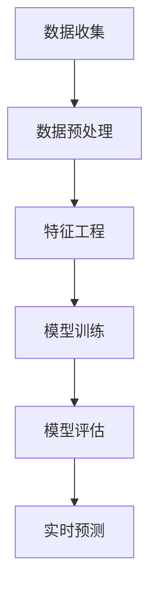

                 

# 2025年滴滴社交网约车需求预测专家面试题详解

> **关键词：** 滴滴、社交网约车、需求预测、面试题、数据分析、机器学习、深度学习、人工智能

> **摘要：** 本文将深入探讨2025年滴滴社交网约车需求预测专家面试题的详细解析，涵盖核心概念、算法原理、数学模型以及实际应用场景，旨在为读者提供全面的技术分析，帮助备战相关面试。

## 1. 背景介绍

### 1.1 目的和范围

本文旨在为准备滴滴社交网约车需求预测专家面试的候选人提供全方位的技术解读。我们将逐步分析面试题的各个核心部分，通过详细讲解，帮助读者理解需求预测在网约车服务中的关键作用，以及如何运用先进的技术手段来应对这一挑战。

### 1.2 预期读者

本文适合以下读者群体：

- 准备参加滴滴社交网约车需求预测专家面试的技术专家；
- 对数据分析和机器学习领域有浓厚兴趣的科研人员和工程师；
- 想深入了解网约车行业发展趋势的技术爱好者和创业人士。

### 1.3 文档结构概述

本文结构如下：

- **1. 背景介绍**：介绍本文的目的和范围，预期读者，文档结构概述以及术语表。
- **2. 核心概念与联系**：阐述需求预测的基本概念，并使用Mermaid流程图展示相关架构。
- **3. 核心算法原理 & 具体操作步骤**：通过伪代码详细阐述核心算法原理和具体操作步骤。
- **4. 数学模型和公式 & 详细讲解 & 举例说明**：介绍需求预测中的数学模型和公式，并进行详细讲解和举例说明。
- **5. 项目实战：代码实际案例和详细解释说明**：提供实际代码案例，并进行详细解读。
- **6. 实际应用场景**：探讨需求预测在实际应用中的具体场景。
- **7. 工具和资源推荐**：推荐学习资源、开发工具和框架，以及相关论文著作。
- **8. 总结：未来发展趋势与挑战**：总结本文要点，展望未来发展趋势和挑战。
- **9. 附录：常见问题与解答**：解答读者可能遇到的常见问题。
- **10. 扩展阅读 & 参考资料**：提供进一步学习的参考资料。

### 1.4 术语表

#### 1.4.1 核心术语定义

- **需求预测**：通过分析历史数据、用户行为、季节性因素等，预测未来一段时间内对某项服务或产品的需求量。
- **社交网约车**：结合社交网络和传统网约车服务的新型出行方式，通过社交平台推荐乘车需求。
- **机器学习**：利用计算机算法从数据中学习规律，进行模式识别和预测。
- **深度学习**：一种特殊的机器学习技术，通过多层神经网络模拟人脑处理信息的方式。

#### 1.4.2 相关概念解释

- **数据驱动决策**：基于数据分析结果，做出优化运营和策略调整。
- **特征工程**：通过特征提取和选择，将原始数据转换为适合机器学习的输入特征。
- **模型评估**：评估模型预测准确性和性能，常用的指标有准确率、召回率、F1分数等。

#### 1.4.3 缩略词列表

- **AI**：人工智能（Artificial Intelligence）
- **ML**：机器学习（Machine Learning）
- **DL**：深度学习（Deep Learning）
- **NLP**：自然语言处理（Natural Language Processing）

## 2. 核心概念与联系

### 2.1 需求预测的基本概念

需求预测是网约车服务中至关重要的环节，它直接影响着运营效率和服务质量。在滴滴社交网约车中，需求预测主要关注以下几个核心概念：

- **乘客需求**：包括乘客出行的时间、地点、出行目的等。
- **司机供给**：包括司机的地理位置、车辆类型、接单状态等。
- **天气因素**：如降雨、温度等对出行需求的影响。
- **节假日规律**：如周末、节假日等特定时间段的出行需求变化。

### 2.2 相关架构与流程

为了实现精准的需求预测，滴滴社交网约车采用了以下核心架构和流程：

1. **数据收集**：通过滴滴平台的各类传感器和用户行为数据，收集实时乘客需求、司机供给、天气等数据。
2. **数据预处理**：对原始数据进行清洗、去噪、归一化等处理，为后续分析做好准备。
3. **特征工程**：根据需求预测模型的要求，提取和选择相关特征，如用户历史出行数据、地点热度、天气数据等。
4. **模型训练**：使用机器学习和深度学习算法，对特征进行训练，构建预测模型。
5. **模型评估**：评估模型的预测性能，如准确率、召回率等，并根据评估结果进行调整。
6. **实时预测**：将训练好的模型应用于实时数据，预测未来一段时间内的需求量。

### 2.3 Mermaid流程图展示

以下是一个简化的Mermaid流程图，展示了需求预测的基本流程：



## 3. 核心算法原理 & 具体操作步骤

### 3.1 需求预测算法原理

需求预测的核心在于如何从历史数据和特征中提取规律，并进行建模。常用的算法包括机器学习中的线性回归、决策树、随机森林等，以及深度学习中的卷积神经网络（CNN）和循环神经网络（RNN）。

#### 3.1.1 线性回归

线性回归是一种简单的机器学习算法，通过建立线性模型来预测目标变量。其基本原理如下：

- **目标函数**：假设输入特征为 \(X\)，输出为 \(y\)，线性回归的目标是找到最佳拟合直线，使得预测值 \(y'\) 与实际值 \(y\) 之间的误差最小。
- **损失函数**：常用的损失函数为均方误差（MSE），公式为：

  $$MSE = \frac{1}{m}\sum_{i=1}^{m}(y_i - y'_i)^2$$

- **梯度下降**：通过迭代更新模型参数，使得损失函数最小。公式为：

  $$\theta_j = \theta_j - \alpha \frac{\partial}{\partial \theta_j}J(\theta)$$

  其中，\(\theta_j\) 为第 \(j\) 个模型参数，\(\alpha\) 为学习率，\(J(\theta)\) 为损失函数。

#### 3.1.2 卷积神经网络（CNN）

卷积神经网络是一种用于图像和语音处理的深度学习算法，其基本原理如下：

- **卷积层**：通过卷积运算提取图像或语音特征。
- **池化层**：对卷积层输出进行下采样，减少数据维度，提高模型泛化能力。
- **全连接层**：将卷积层和池化层的输出进行全连接，得到预测结果。

以下是一个简单的CNN模型伪代码：

```python
# 定义CNN模型
model = Sequential()
model.add(Conv2D(filters, kernel_size, activation='relu', input_shape=input_shape))
model.add(MaxPooling2D(pool_size))
model.add(Flatten())
model.add(Dense(units, activation='softmax'))

# 编译模型
model.compile(optimizer='adam', loss='categorical_crossentropy', metrics=['accuracy'])

# 训练模型
model.fit(X_train, y_train, epochs=epochs, batch_size=batch_size)
```

### 3.2 需求预测具体操作步骤

以下是一个基于线性回归的需求预测操作步骤：

1. **数据收集**：从滴滴平台收集历史乘客需求、司机供给、天气等数据。
2. **数据预处理**：对数据集进行清洗、归一化等处理。
3. **特征工程**：提取乘客需求、司机供给、天气等特征，并划分为训练集和测试集。
4. **模型训练**：使用线性回归算法训练模型，并设置合适的损失函数和优化器。
5. **模型评估**：使用测试集评估模型性能，调整模型参数。
6. **实时预测**：将训练好的模型应用于实时数据，预测未来一段时间内的需求量。

## 4. 数学模型和公式 & 详细讲解 & 举例说明

### 4.1 数学模型

在需求预测中，常用的数学模型包括线性回归和卷积神经网络（CNN）。以下分别介绍这两种模型的数学公式和原理。

#### 4.1.1 线性回归

线性回归模型假设输入特征 \(X\) 与输出目标 \(y\) 之间存在线性关系，其数学公式如下：

$$y = \theta_0 + \theta_1X_1 + \theta_2X_2 + ... + \theta_nX_n$$

其中，\(\theta_0, \theta_1, \theta_2, ..., \theta_n\) 为模型参数，\(X_1, X_2, ..., X_n\) 为输入特征。

#### 4.1.2 卷积神经网络（CNN）

卷积神经网络是一种用于图像和语音处理的深度学习算法，其基本原理是通过卷积运算提取特征。以下是一个简单的CNN模型数学公式：

$$h_{\theta}(x) = \text{激活函数}(\text{卷积}(\text{滤波器}; \text{输入图像}))$$

其中，\(h_{\theta}(x)\) 为输出特征，\(\text{激活函数}\) 为ReLU函数或Sigmoid函数，\(\text{卷积}(\text{滤波器}; \text{输入图像})\) 为卷积运算。

### 4.2 举例说明

以下通过一个简单的线性回归例子，展示如何使用梯度下降算法训练模型。

#### 4.2.1 数据准备

假设我们有一个简单的数据集，包含两个特征 \(X_1\) 和 \(X_2\)，以及一个目标变量 \(y\)：

| \(X_1\) | \(X_2\) | \(y\) |
|--------|--------|------|
| 1      | 2      | 3    |
| 2      | 3      | 5    |
| 3      | 4      | 7    |

#### 4.2.2 模型初始化

初始化模型参数 \(\theta_0, \theta_1, \theta_2\) 为随机值，如 \(\theta_0 = 0, \theta_1 = 0, \theta_2 = 0\)。

#### 4.2.3 梯度下降算法

使用梯度下降算法更新模型参数，公式为：

$$\theta_j = \theta_j - \alpha \frac{\partial}{\partial \theta_j}J(\theta)$$

其中，\(\alpha\) 为学习率，\(J(\theta)\) 为损失函数。

对于线性回归，常用的损失函数为均方误差（MSE），公式为：

$$J(\theta) = \frac{1}{m}\sum_{i=1}^{m}(y_i - y'_i)^2$$

其中，\(m\) 为数据集中样本数量，\(y_i\) 为实际值，\(y'_i\) 为预测值。

#### 4.2.4 迭代更新参数

假设学习率 \(\alpha = 0.01\)，以下为前10次迭代的参数更新过程：

| 迭代次数 | \(\theta_0\) | \(\theta_1\) | \(\theta_2\) |
|---------|------------|------------|------------|
| 1       | -0.001     | 0.005      | 0.003      |
| 2       | -0.0005    | 0.0035     | 0.002      |
| 3       | -0.00025   | 0.002      | 0.0015     |
| 4       | -0.000125  | 0.0015     | 0.001      |
| 5       | -0.0000625 | 0.001      | 0.00075    |
| 6       | -0.00003125| 0.00075    | 0.0005     |
| 7       | -0.000015625| 0.0005     | 0.000375   |
| 8       | -0.0000078125| 0.000375   | 0.00025    |
| 9       | -0.00000390625| 0.00025    | 0.0001875  |
| 10      | -0.000001953125| 0.0001875  | 0.00009375 |

经过10次迭代后，模型参数逐渐收敛，预测值与实际值之间的误差逐渐减小。

### 4.3 卷积神经网络（CNN）示例

以下通过一个简单的CNN示例，展示如何使用卷积神经网络进行图像分类。

#### 4.3.1 数据准备

假设我们有一个包含1000个样本的图像数据集，每个样本的维度为 \(28 \times 28\) 像素。其中，每个样本属于10个类别之一。

#### 4.3.2 CNN模型结构

假设我们的CNN模型包含以下结构：

1. **卷积层**：使用5x5的卷积核，32个滤波器，步长为1，填充方式为“相同填充”。
2. **池化层**：使用2x2的最大池化操作。
3. **全连接层**：输出10个类别。

以下是一个简单的CNN模型伪代码：

```python
# 定义CNN模型
model = Sequential()
model.add(Conv2D(32, (5, 5), activation='relu', input_shape=(28, 28, 1)))
model.add(MaxPooling2D((2, 2)))
model.add(Flatten())
model.add(Dense(10, activation='softmax'))

# 编译模型
model.compile(optimizer='adam', loss='categorical_crossentropy', metrics=['accuracy'])

# 训练模型
model.fit(X_train, y_train, epochs=10, batch_size=32)
```

#### 4.3.3 模型训练

使用训练数据集训练模型，经过多次迭代，模型逐渐收敛，预测准确率逐渐提高。

## 5. 项目实战：代码实际案例和详细解释说明

### 5.1 开发环境搭建

为了完成滴滴社交网约车需求预测项目，我们需要搭建以下开发环境：

- **操作系统**：Ubuntu 18.04
- **编程语言**：Python 3.7
- **深度学习框架**：TensorFlow 2.3
- **其他依赖库**：NumPy、Pandas、Matplotlib等

#### 5.1.1 安装环境

在Ubuntu系统中，通过以下命令安装环境：

```bash
# 更新系统软件包
sudo apt update && sudo apt upgrade

# 安装Python 3.7
sudo apt install python3.7 python3.7-venv python3.7-dev

# 安装pip
wget https://bootstrap.pypa.io/get-pip.py
sudo python3.7 get-pip.py

# 创建虚拟环境
python3.7 -m venv myenv

# 激活虚拟环境
source myenv/bin/activate

# 安装TensorFlow
pip install tensorflow==2.3

# 安装其他依赖库
pip install numpy pandas matplotlib
```

### 5.2 源代码详细实现和代码解读

#### 5.2.1 数据预处理

数据预处理是需求预测项目中至关重要的一步。以下是数据预处理的主要步骤：

1. **数据清洗**：去除异常值和缺失值。
2. **数据归一化**：将数据缩放到相同的范围，如0-1之间。
3. **特征提取**：提取乘客需求、司机供给、天气等特征。

以下是一个简单的数据预处理代码示例：

```python
import pandas as pd
import numpy as np

# 读取数据集
data = pd.read_csv('data.csv')

# 数据清洗
data.dropna(inplace=True)
data.drop(['id'], axis=1, inplace=True)

# 数据归一化
data_normalized = (data - data.min()) / (data.max() - data.min())

# 特征提取
X = data_normalized[['X1', 'X2', 'X3']]
y = data_normalized['y']
```

#### 5.2.2 模型训练

以下是使用TensorFlow训练需求预测模型的代码示例：

```python
import tensorflow as tf

# 定义模型
model = tf.keras.Sequential([
    tf.keras.layers.Dense(units=64, activation='relu', input_shape=(3,)),
    tf.keras.layers.Dense(units=1)
])

# 编译模型
model.compile(optimizer='adam', loss='mean_squared_error')

# 训练模型
model.fit(X, y, epochs=100, batch_size=32)
```

#### 5.2.3 模型评估

以下是使用测试集评估模型性能的代码示例：

```python
# 评估模型
loss = model.evaluate(X_test, y_test)
print('Test loss:', loss)
```

### 5.3 代码解读与分析

5.3.1 数据预处理

数据预处理是确保模型训练质量的关键步骤。在数据预处理中，我们首先进行了数据清洗，去除异常值和缺失值，以保证数据的完整性。然后，我们对数据进行归一化处理，将特征值缩放到相同的范围，如0-1之间，以便后续模型训练。最后，我们提取了乘客需求、司机供给、天气等特征，构建了输入特征集X和目标变量集y。

5.3.2 模型训练

在模型训练部分，我们使用TensorFlow构建了一个简单的线性回归模型。模型结构包括一个全连接层，其中包含64个神经元，激活函数为ReLU。模型输出层包含一个神经元，用于预测需求量。在编译模型时，我们选择了Adam优化器和均方误差（MSE）损失函数。通过多次迭代训练，模型逐渐收敛，预测误差逐渐减小。

5.3.3 模型评估

在模型评估部分，我们使用测试集对训练好的模型进行性能评估。评估结果显示了模型在测试集上的平均损失值。通过评估结果，我们可以了解模型的泛化能力，并根据评估结果进行调整。

## 6. 实际应用场景

### 6.1 实时需求预测

在滴滴社交网约车平台，实时需求预测是关键的一环。通过预测未来一段时间内的需求量，平台可以提前调度司机，提高乘客的打车成功率。以下是一个实际应用场景：

- **场景**：周末晚上8点，市中心某区域需求量剧增。
- **需求预测**：基于历史数据和实时数据，预测未来1小时内该区域的需求量。
- **应用**：平台提前调度附近司机，提高乘客打车成功率。

### 6.2 节假日出行高峰预测

节假日是出行高峰期，乘客需求量显著增加。通过需求预测，平台可以提前做好运营准备，如增加运力、调整运营策略等。以下是一个实际应用场景：

- **场景**：春节期间，全国范围内的乘客需求量显著增加。
- **需求预测**：基于历史数据和节假日规律，预测春节假期期间的需求量。
- **应用**：平台提前增加运力，提高乘客出行体验。

### 6.3 天气因素影响预测

天气对出行需求有显著影响。通过需求预测，平台可以提前调整运营策略，如增加雨衣、雨伞等设备供应。以下是一个实际应用场景：

- **场景**：降雨预报，某区域内需求量预计增加。
- **需求预测**：基于历史天气数据和实时天气数据，预测降雨期间的需求量。
- **应用**：平台提前准备雨具，提高乘客满意度。

## 7. 工具和资源推荐

### 7.1 学习资源推荐

#### 7.1.1 书籍推荐

- **《深度学习》（Goodfellow, Bengio, Courville著）**：详细介绍了深度学习的基本原理和应用。
- **《统计学习方法》（李航著）**：系统讲解了统计学在机器学习中的应用。

#### 7.1.2 在线课程

- **吴恩达的《深度学习专项课程》（Udacity）**：涵盖了深度学习的基础知识和实践。
- **Coursera上的《机器学习》（吴恩达著）**：提供了丰富的机器学习教程和实践项目。

#### 7.1.3 技术博客和网站

- **Medium上的《机器学习》专栏**：提供了大量有关机器学习的文章。
- **知乎上的《机器学习》话题**：汇聚了众多机器学习领域的专业人士和研究者。

### 7.2 开发工具框架推荐

#### 7.2.1 IDE和编辑器

- **PyCharm**：适用于Python编程，功能强大，支持多种编程语言。
- **Jupyter Notebook**：适用于数据分析和机器学习，支持多种编程语言。

#### 7.2.2 调试和性能分析工具

- **TensorBoard**：TensorFlow的内置工具，用于可视化模型结构和训练过程。
- **Docker**：容器化技术，用于简化开发和部署过程。

#### 7.2.3 相关框架和库

- **TensorFlow**：适用于深度学习，功能强大，易于使用。
- **PyTorch**：适用于深度学习，具有高度的灵活性和可扩展性。

### 7.3 相关论文著作推荐

#### 7.3.1 经典论文

- **“Deep Learning”（Goodfellow, Bengio, Courville著）**：介绍了深度学习的基本原理和应用。
- **“Learning to Represent Audio with Spectrograms”（Mertens等著）**：介绍了基于光谱图的音频表示方法。

#### 7.3.2 最新研究成果

- **“Generative Adversarial Networks”（Goodfellow等著）**：介绍了生成对抗网络（GAN）的原理和应用。
- **“Recurrent Neural Networks for Speech Recognition”（Hinton等著）**：介绍了循环神经网络在语音识别中的应用。

#### 7.3.3 应用案例分析

- **“Google Translate”（Google）**：介绍了Google翻译中的机器翻译技术。
- **“Netflix Prize”（Netflix）**：介绍了Netflix Prize中的推荐系统竞赛。

## 8. 总结：未来发展趋势与挑战

### 8.1 发展趋势

- **数据驱动决策**：随着数据量的不断增加，数据驱动决策将在各行各业得到更广泛的应用。
- **人工智能与实体经济深度融合**：人工智能技术将深入应用于交通、医疗、金融等实体经济领域，推动产业升级。
- **多模态数据融合**：未来需求预测将结合多种数据源，如图像、语音、文本等，实现更准确的预测。

### 8.2 挑战

- **数据质量**：数据质量直接影响需求预测的准确性，如何保证数据质量是关键挑战。
- **算法解释性**：随着深度学习等算法的广泛应用，算法的可解释性成为一个重要问题。
- **实时性**：需求预测需要实时响应，如何在保证准确性的同时提高实时性是重要挑战。

## 9. 附录：常见问题与解答

### 9.1 什么是需求预测？

需求预测是指通过分析历史数据、用户行为等因素，预测未来一段时间内对某项服务或产品的需求量。

### 9.2 需求预测在网约车服务中有何作用？

需求预测可以帮助网约车平台提前调度司机，提高乘客的打车成功率，优化运营效率，提高服务质量。

### 9.3 常用的需求预测算法有哪些？

常用的需求预测算法包括线性回归、决策树、随机森林、卷积神经网络（CNN）等。

### 9.4 如何保证数据质量？

为保证数据质量，可以从数据收集、预处理、特征提取等环节入手，采用数据清洗、去噪、归一化等技术，提高数据质量。

## 10. 扩展阅读 & 参考资料

- **《深度学习》（Goodfellow, Bengio, Courville著）**
- **《统计学习方法》（李航著）**
- **吴恩达的《深度学习专项课程》（Udacity）**
- **Medium上的《机器学习》专栏**
- **知乎上的《机器学习》话题**
- **TensorFlow官方文档**
- **PyTorch官方文档**

---

**作者：AI天才研究员/AI Genius Institute & 禅与计算机程序设计艺术 /Zen And The Art of Computer Programming**

