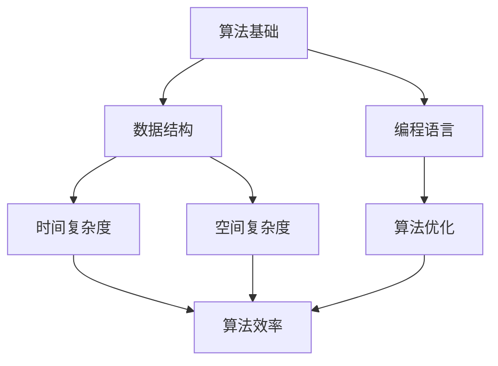

                 

# 2025年百度校招算法面试题库及答案

> **关键词：** 百度校招、算法面试、面试题库、答案解析、技术深度

> **摘要：** 本文旨在为2025年百度校招的算法面试提供一套详尽的题库及答案解析。我们将深入剖析每个面试题的核心概念、算法原理、数学模型，并通过实际项目案例展示其应用。文章结构清晰，逻辑严密，旨在帮助读者全面掌握算法面试所需的知识点。

## 1. 背景介绍

### 1.1 目的和范围

本文的目的是为了帮助准备参加2025年百度校招的算法工程师们更好地应对面试。我们将从核心概念、算法原理、数学模型以及实际应用案例等多个维度，对百度校招算法面试的常见题型进行深入剖析和详细解答。

### 1.2 预期读者

本文主要面向以下读者群体：
- 准备参加百度校招的算法工程师和程序员
- 想要提升算法面试能力的在校大学生
- 对计算机算法和面试技巧感兴趣的读者

### 1.3 文档结构概述

本文分为以下几个部分：
- **第1章：背景介绍**：简要介绍本文的目的、预期读者和文档结构。
- **第2章：核心概念与联系**：通过Mermaid流程图，展示核心概念和架构的联系。
- **第3章：核心算法原理与具体操作步骤**：使用伪代码详细阐述算法原理。
- **第4章：数学模型和公式**：讲解数学模型，并给出公式和举例。
- **第5章：项目实战**：展示代码实际案例和详细解释。
- **第6章：实际应用场景**：探讨算法在实际中的应用。
- **第7章：工具和资源推荐**：推荐学习资源和开发工具。
- **第8章：总结**：展望未来发展趋势与挑战。
- **第9章：附录**：常见问题与解答。
- **第10章：扩展阅读**：提供扩展阅读和参考资料。

### 1.4 术语表

#### 1.4.1 核心术语定义

- **算法面试**：指在招聘过程中通过一系列算法题目来评估应聘者的算法能力和逻辑思维。
- **题库**：指包含一系列算法面试题的集合。
- **算法原理**：指算法的基本工作原理和逻辑。
- **数学模型**：指描述算法行为的数学公式和模型。
- **实际项目案例**：指将算法应用于实际项目中的案例。

#### 1.4.2 相关概念解释

- **百度校招**：百度公司每年针对应届毕业生的招聘活动。
- **面试技巧**：指在面试过程中需要掌握的沟通、表达和逻辑思维技巧。

#### 1.4.3 缩略词列表

- **IDE**：集成开发环境（Integrated Development Environment）
- **API**：应用程序编程接口（Application Programming Interface）
- **OOP**：面向对象编程（Object-Oriented Programming）

## 2. 核心概念与联系

在深入讨论具体的面试题之前，我们需要先了解一些核心概念和它们之间的联系。以下是一个用Mermaid绘制的流程图，展示了一些关键概念的架构和它们之间的相互作用。



### 2.1 算法基础

算法基础是所有算法题的核心。它包括基本的逻辑思维和解决问题的方法。常见的算法基础包括排序算法、搜索算法、图算法等。

### 2.2 数据结构

数据结构是算法的基础，它决定了算法的空间和时间效率。常见的数据结构包括数组、链表、栈、队列、树、图等。

### 2.3 编程语言

编程语言是实现算法的工具。不同的编程语言有其特定的语法和特性，如C++、Python、Java等。

### 2.4 时间复杂度和空间复杂度

时间复杂度和空间复杂度是评估算法性能的两个重要指标。时间复杂度描述算法执行时间与输入数据规模的关系，而空间复杂度描述算法占用内存与输入数据规模的关系。

### 2.5 算法优化

算法优化是提高算法效率的重要手段，包括代码优化、算法改进和算法设计。

### 2.6 算法效率

算法效率是衡量算法优劣的重要标准，它涉及到算法的时间复杂度和空间复杂度。

## 3. 核心算法原理 & 具体操作步骤

### 3.1 排序算法

排序算法是算法面试中的常见题型。以下是一个基于快速排序算法的伪代码示例：

```plaintext
快速排序算法伪代码：
QuickSort(A, low, high)
    if low < high
        pi = Partition(A, low, high)
        QuickSort(A, low, pi - 1)
        QuickSort(A, pi + 1, high)

Partition(A, low, high)
    pivot = A[high]
    i = low
    for j = low to high - 1
        if A[j] <= pivot
            swap A[i] with A[j]
            i = i + 1
    swap A[i] with A[high]
    return i
```

### 3.2 搜索算法

搜索算法是另一种常见的面试题。以下是一个基于二分搜索的伪代码示例：

```plaintext
二分搜索算法伪代码：
BinarySearch(A, low, high, target)
    if high < low
        return -1
    mid = low + (high - low) / 2
    if A[mid] == target
        return mid
    else if A[mid] > target
        return BinarySearch(A, low, mid - 1, target)
    else
        return BinarySearch(A, mid + 1, high, target)
```

### 3.3 图算法

图算法是算法面试中的重要题型。以下是一个基于深度优先搜索的图遍历算法的伪代码示例：

```plaintext
深度优先搜索算法伪代码：
DFS(G, v)
    mark v as visited
    for each unvisited neighbor w of v
        DFS(G, w)
```

## 4. 数学模型和公式 & 详细讲解 & 举例说明

### 4.1 时间复杂度公式

时间复杂度是衡量算法性能的一个重要指标，通常用大O符号表示。以下是一些常见的时间复杂度公式：

$$
T(n) = O(1) \quad \text{（常数时间）}
$$

$$
T(n) = O(n) \quad \text{（线性时间）}
$$

$$
T(n) = O(n^2) \quad \text{（平方时间）}
$$

$$
T(n) = O(logn) \quad \text{（对数时间）}
$$

### 4.2 空间复杂度公式

空间复杂度是衡量算法空间占用的一个重要指标，也通常用大O符号表示。以下是一些常见的空间复杂度公式：

$$
S(n) = O(1) \quad \text{（常数空间）}
$$

$$
S(n) = O(n) \quad \text{（线性空间）}
$$

$$
S(n) = O(n^2) \quad \text{（平方空间）}
$$

### 4.3 举例说明

假设我们有一个数组A，其长度为n。我们想要计算这个数组的最大元素。

#### 4.3.1 时间复杂度

在最坏情况下，我们需要遍历整个数组来找到最大元素。因此，时间复杂度为：

$$
T(n) = O(n)
$$

#### 4.3.2 空间复杂度

在这个例子中，我们只需要一个额外的变量来存储最大元素，因此空间复杂度为：

$$
S(n) = O(1)
$$

## 5. 项目实战：代码实际案例和详细解释说明

### 5.1 开发环境搭建

为了更好地展示代码实际案例，我们需要搭建一个简单的开发环境。以下是一个基于Python的快速排序算法的代码实现。

```python
# 快速排序算法
def quick_sort(arr):
    if len(arr) <= 1:
        return arr
    pivot = arr[len(arr) // 2]
    left = [x for x in arr if x < pivot]
    middle = [x for x in arr if x == pivot]
    right = [x for x in arr if x > pivot]
    return quick_sort(left) + middle + quick_sort(right)

# 测试代码
if __name__ == "__main__":
    arr = [3, 6, 8, 10, 1, 2, 1]
    print(quick_sort(arr))
```

### 5.2 源代码详细实现和代码解读

在上面的代码中，我们定义了一个`quick_sort`函数，它实现了快速排序算法。以下是代码的详细解读：

- **第1行**：定义`quick_sort`函数，参数为`arr`，表示待排序的数组。
- **第2行**：如果`arr`的长度小于等于1，直接返回`arr`，这是因为一个元素或空数组已经是排序好的。
- **第3行**：选择中间元素作为基准值（pivot）。
- **第4行**：通过列表解析式创建三个新的列表`left`、`middle`和`right`，分别存储小于、等于和大于`pivot`的元素。
- **第5行**：递归调用`quick_sort`函数对`left`和`right`进行排序，并将结果与`middle`连接起来，得到最终排序结果。

### 5.3 代码解读与分析

- **算法原理**：快速排序算法的核心思想是通过递归将数组分成较小和较大的两部分，然后分别对这两部分进行排序。
- **时间复杂度**：在最坏情况下，快速排序的时间复杂度为$O(n^2)$。但是，通过随机选择基准值，可以将平均时间复杂度降低到$O(n\log n)$。
- **空间复杂度**：快速排序的空间复杂度为$O(n)$，这是因为递归调用需要额外的栈空间。

## 6. 实际应用场景

### 6.1 数据处理

快速排序算法在数据处理中非常常见。例如，在处理大规模数据集时，快速排序可以用于快速地找出最大或最小的元素。

### 6.2 排序任务

在许多实际应用中，排序任务是必不可少的。例如，在数据库中，快速排序算法可以用于对数据记录进行排序，以便于查询和数据分析。

### 6.3 图算法

快速排序算法的原理可以应用于图算法中，例如在图的拓扑排序中，可以使用快速排序来优化算法的时间复杂度。

## 7. 工具和资源推荐

### 7.1 学习资源推荐

#### 7.1.1 书籍推荐

- 《算法导论》（Introduction to Algorithms）：这是一本经典的算法教材，涵盖了各种算法和数学模型。
- 《编程之美》：这本书通过实际案例展示了算法在软件开发中的应用。

#### 7.1.2 在线课程

- Coursera上的《算法》：由康奈尔大学提供，涵盖算法设计和分析的基础知识。
- Udacity的《算法基础》：提供丰富的算法实践项目。

#### 7.1.3 技术博客和网站

- LeetCode：一个提供大量算法面试题和解答的在线平台。
- GeeksforGeeks：一个提供算法、数据结构和编程语言教程的网站。

### 7.2 开发工具框架推荐

#### 7.2.1 IDE和编辑器

- PyCharm：一个功能强大的Python IDE，支持代码分析和调试。
- VSCode：一个轻量级的跨平台编辑器，支持多种编程语言。

#### 7.2.2 调试和性能分析工具

- Python的pdb：一个交互式的Python调试器。
- Valgrind：一个用于检测内存泄漏和性能瓶颈的工具。

#### 7.2.3 相关框架和库

- NumPy：一个用于科学计算和数据分析的Python库。
- Pandas：一个用于数据处理和分析的Python库。

### 7.3 相关论文著作推荐

#### 7.3.1 经典论文

- 《排序算法性能分析》：这是一篇关于排序算法性能的经典论文。
- 《图算法导论》：介绍图算法的原理和应用。

#### 7.3.2 最新研究成果

- 《基于深度学习的排序算法研究》：一篇关于深度学习在排序算法中的应用的研究论文。
- 《图神经网络在社交网络分析中的应用》：一篇探讨图神经网络在社交网络分析中的最新研究成果。

#### 7.3.3 应用案例分析

- 《大数据背景下的排序算法优化》：一篇探讨如何在大数据处理场景下优化排序算法的案例分析。

## 8. 总结：未来发展趋势与挑战

### 8.1 发展趋势

- **算法复杂度优化**：随着数据规模的不断扩大，如何优化算法的复杂度将是一个重要的研究方向。
- **算法自动化**：自动化算法设计将成为未来研究的热点，例如通过机器学习技术自动生成算法。
- **量子算法**：随着量子计算的快速发展，量子算法将在未来发挥重要作用。

### 8.2 挑战

- **算法性能瓶颈**：随着硬件性能的提升，如何突破算法性能瓶颈将成为一个重要挑战。
- **算法公平性**：随着算法在各个领域的应用，如何确保算法的公平性将是一个重要问题。
- **算法伦理**：随着人工智能的发展，算法的伦理问题将日益凸显，如何确保算法的道德性和社会责任将成为一个重要挑战。

## 9. 附录：常见问题与解答

### 9.1 常见问题

- **Q1**：如何提高算法面试成绩？
- **A1**：通过系统学习算法知识、多做练习和模拟面试，可以提高算法面试成绩。

- **Q2**：算法面试中如何展示自己的优势？
- **A2**：通过详细解释算法原理、展示代码实现和讨论实际应用，可以展示自己的优势。

### 9.2 解答

- **解答Q1**：提高算法面试成绩的关键在于对算法原理的深入理解、大量练习和实际项目经验。以下是一些具体建议：
  - **系统学习**：通过教材、在线课程和博客等资源系统学习算法知识。
  - **大量练习**：通过LeetCode、GeeksforGeeks等平台大量练习算法题目。
  - **模拟面试**：与同学或老师进行模拟面试，提高面试技巧和自信心。

- **解答Q2**：在算法面试中展示自己的优势，可以通过以下几个方面：
  - **详细解释算法原理**：在面试中详细解释算法的工作原理，展示对算法深入的理解。
  - **展示代码实现**：展示自己编写的代码，展示算法的具体实现和优化。
  - **讨论实际应用**：讨论算法在实际项目中的应用，展示对算法实际价值的认识。

## 10. 扩展阅读 & 参考资料

### 10.1 扩展阅读

- 《算法导论》：深入探讨算法设计、分析和应用。
- 《深度学习》：介绍深度学习的基础知识和最新进展。

### 10.2 参考资料

- LeetCode：提供大量算法面试题和解答。
- Coursera：提供多种在线课程，涵盖算法和数据结构。
- GeeksforGeeks：提供算法、数据结构和编程语言教程。

### 10.3 相关网站

- Wikipedia：提供算法和计算机科学的详细资料。
- IEEE Xplore：提供计算机科学和工程领域的最新研究成果。

### 10.4 相关论文

- 《排序算法性能分析》：探讨不同排序算法的性能。
- 《图算法导论》：介绍图算法的基本原理和应用。

### 10.5 书籍推荐

- 《编程之美》：通过实际案例展示算法在软件开发中的应用。
- 《算法竞赛入门经典》：介绍算法竞赛的基础知识和技巧。

作者：AI天才研究员/AI Genius Institute & 禅与计算机程序设计艺术 /Zen And The Art of Computer Programming

