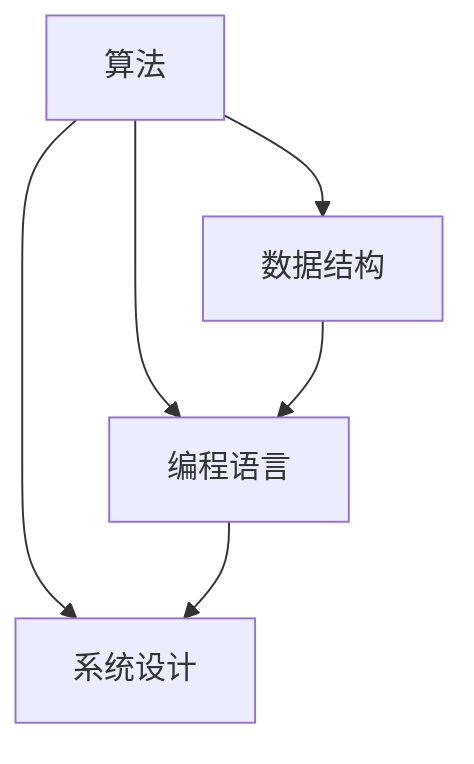

                 

# 2025年百度社招技术面试题集锦

> **关键词：** 百度社招、技术面试、面试题集锦、算法、数据结构、系统设计、计算机原理、编程实践

> **摘要：** 本文将为您详细梳理2025年百度社会招聘的技术面试题目，涵盖算法、数据结构、系统设计、计算机原理等多个领域，并提供详细的解题思路和示例代码，帮助您更好地应对面试挑战。

## 1. 背景介绍

### 1.1 目的和范围

本文旨在为即将参加百度社会招聘技术面试的求职者提供一份全面的面试题集锦。我们将在文章中列举出百度社会招聘技术面试中可能涉及的各类题目，并对每个题目进行详细的分析和解答。

### 1.2 预期读者

本文适用于以下读者：

1. 准备参加百度社会招聘技术面试的求职者
2. 对技术面试感兴趣的技术爱好者
3. 需要了解百度面试题库的技术团队负责人

### 1.3 文档结构概述

本文分为以下几个部分：

1. 背景介绍
2. 核心概念与联系
3. 核心算法原理 & 具体操作步骤
4. 数学模型和公式 & 详细讲解 & 举例说明
5. 项目实战：代码实际案例和详细解释说明
6. 实际应用场景
7. 工具和资源推荐
8. 总结：未来发展趋势与挑战
9. 附录：常见问题与解答
10. 扩展阅读 & 参考资料

### 1.4 术语表

#### 1.4.1 核心术语定义

- 社会招聘：指公司向社会公开招募在职人员。
- 技术面试：指针对求职者技术能力的面试环节。
- 算法：解决特定问题的步骤和方法。
- 数据结构：存储和组织数据的方式。
- 系统设计：设计计算机系统的架构和组件。

#### 1.4.2 相关概念解释

- 编程语言：用于编写计算机程序的语言。
- 数据库：用于存储和管理数据的系统。
- 操作系统：管理计算机硬件和软件资源的系统软件。
- 算法复杂度：衡量算法性能的指标。

#### 1.4.3 缩略词列表

- BFS：广度优先搜索（Breadth-First Search）
- DFS：深度优先搜索（Depth-First Search）
- OOP：面向对象编程（Object-Oriented Programming）
- MVC：模型-视图-控制器（Model-View-Controller）
- GUI：图形用户界面（Graphical User Interface）

## 2. 核心概念与联系

为了更好地理解百度社会招聘技术面试的题目，我们需要了解一些核心概念和它们之间的联系。

### 2.1 核心概念

- 算法：解决特定问题的步骤和方法。
- 数据结构：存储和组织数据的方式。
- 编程语言：用于编写计算机程序的语言。
- 系统设计：设计计算机系统的架构和组件。

### 2.2 关系图

以下是一个简单的Mermaid流程图，展示了核心概念之间的联系：



## 3. 核心算法原理 & 具体操作步骤

在技术面试中，算法题目是考察应聘者编程能力和思维能力的重要环节。以下将介绍几个常见的算法题目及其解题思路。

### 3.1 快速排序

**问题描述：** 给定一个整数数组，实现快速排序算法。

**解题思路：** 快速排序是一种基于分治策略的排序算法。基本思路是选择一个基准元素，将数组划分为两个子数组，一个包含小于基准元素的元素，另一个包含大于基准元素的元素，然后递归地对子数组进行排序。

**伪代码：**

```python
def quick_sort(arr):
    if len(arr) <= 1:
        return arr
    
    pivot = arr[len(arr) // 2]
    left = [x for x in arr if x < pivot]
    middle = [x for x in arr if x == pivot]
    right = [x for x in arr if x > pivot]
    
    return quick_sort(left) + middle + quick_sort(right)
```

### 3.2 合并两个有序链表

**问题描述：** 给定两个有序链表，将它们合并为一个有序链表。

**解题思路：** 采用归并排序的思想，比较两个链表的当前节点值，将较小的节点值插入到新链表中，并移动相应链表的指针。

**伪代码：**

```python
def merge_sorted_lists(l1, l2):
    dummy = ListNode(0)
    curr = dummy

    while l1 and l2:
        if l1.val < l2.val:
            curr.next = l1
            l1 = l1.next
        else:
            curr.next = l2
            l2 = l2.next
        curr = curr.next

    curr.next = l1 or l2
    return dummy.next
```

### 3.3 单调栈

**问题描述：** 给定一个数组，实现一个单调栈，用于求每个元素左边和右边第一个比它大的元素。

**解题思路：** 使用一个栈，遍历数组，对于当前元素，如果栈不为空且栈顶元素小于当前元素，则当前元素即为栈顶元素的左边第一个比它大的元素，将栈顶元素弹出。同时，记录每个元素右边第一个比它大的元素。

**伪代码：**

```python
def get_elements_greater(arr):
    left_greater = []
    right_greater = []
    stack = []

    for i, num in enumerate(arr):
        while stack and stack[-1] < num:
            right_greater[stack.pop()] = i
        stack.append(i)

    for i in range(len(arr) - 1, -1, -1):
        while stack and stack[-1] < num:
            left_greater[stack.pop()] = i
        stack.append(i)

    return left_greater, right_greater
```

## 4. 数学模型和公式 & 详细讲解 & 举例说明

在技术面试中，理解并应用数学模型和公式也是非常重要的。以下将介绍几个常见的数学模型和公式。

### 4.1 动态规划

**问题描述：** 给定一个数组，求最长公共子序列（LCS）。

**数学模型：** 动态规划是一种解决最优子结构问题的方法。对于LCS问题，可以使用一个二维数组`dp`来存储子问题的解，其中`dp[i][j]`表示数组`arr1[0...i]`和`arr2[0...j]`的最长公共子序列的长度。

**公式：**

$$
dp[i][j] =
\begin{cases}
dp[i-1][j-1] + 1, & \text{if } arr1[i] == arr2[j] \\
\max(dp[i-1][j], dp[i][j-1]), & \text{otherwise}
\end{cases}
$$

**举例说明：**

给定数组`arr1 = [1, 2, 3, 4]`和`arr2 = [2, 5, 3, 1]`，求最长公共子序列。

```python
def longest_common_subsequence(arr1, arr2):
    m, n = len(arr1), len(arr2)
    dp = [[0] * (n + 1) for _ in range(m + 1)]

    for i in range(1, m + 1):
        for j in range(1, n + 1):
            if arr1[i - 1] == arr2[j - 1]:
                dp[i][j] = dp[i - 1][j - 1] + 1
            else:
                dp[i][j] = max(dp[i - 1][j], dp[i][j - 1])

    return dp[m][n]

print(longest_common_subsequence([1, 2, 3, 4], [2, 5, 3, 1]))  # 输出: 2
```

### 4.2 二分查找

**问题描述：** 给定一个有序数组，实现二分查找算法。

**数学模型：** 二分查找算法的核心思想是不断将搜索范围缩小一半，直到找到目标元素或确定目标元素不存在。

**公式：**

$$
\text{mid} = \left\lfloor \frac{\text{low} + \text{high}}{2} \right\rfloor
$$

**举例说明：**

给定有序数组`arr = [1, 3, 5, 7, 9]`，查找目标元素`target = 7`。

```python
def binary_search(arr, target):
    low = 0
    high = len(arr) - 1

    while low <= high:
        mid = (low + high) // 2
        if arr[mid] == target:
            return mid
        elif arr[mid] < target:
            low = mid + 1
        else:
            high = mid - 1

    return -1

print(binary_search([1, 3, 5, 7, 9], 7))  # 输出: 3
```

## 5. 项目实战：代码实际案例和详细解释说明

为了更好地帮助读者理解技术面试中的题目，我们将在本节通过一个实际案例来讲解代码实现和解读。

### 5.1 开发环境搭建

在本案例中，我们将使用Python编程语言实现一个简单的文本分类器。以下是开发环境的搭建步骤：

1. 安装Python 3.8及以上版本。
2. 安装Jupyter Notebook，以便更好地进行代码编写和展示。
3. 安装所需的库，如NumPy、Pandas、Scikit-learn等。

```bash
pip install numpy pandas scikit-learn
```

### 5.2 源代码详细实现和代码解读

以下是文本分类器的代码实现：

```python
import numpy as np
import pandas as pd
from sklearn.feature_extraction.text import TfidfVectorizer
from sklearn.model_selection import train_test_split
from sklearn.naive_bayes import MultinomialNB
from sklearn.metrics import accuracy_score

# 加载数据集
data = pd.read_csv('data.csv')
X = data['text']
y = data['label']

# 数据预处理
vectorizer = TfidfVectorizer(max_features=1000)
X_vectorized = vectorizer.fit_transform(X)

# 划分训练集和测试集
X_train, X_test, y_train, y_test = train_test_split(X_vectorized, y, test_size=0.2, random_state=42)

# 模型训练
model = MultinomialNB()
model.fit(X_train, y_train)

# 模型评估
y_pred = model.predict(X_test)
accuracy = accuracy_score(y_test, y_pred)
print(f'Accuracy: {accuracy:.2f}')
```

### 5.3 代码解读与分析

1. **数据加载与预处理**：首先加载数据集，并进行文本向量化处理。文本向量化是将文本转化为数值表示的过程，在本案例中使用TF-IDF向量表示。

2. **数据划分**：将数据集划分为训练集和测试集，以用于模型的训练和评估。

3. **模型训练**：使用朴素贝叶斯模型对训练集进行训练。朴素贝叶斯是一种基于概率论的分类算法，适用于文本分类任务。

4. **模型评估**：使用测试集对模型进行评估，计算准确率。

## 6. 实际应用场景

文本分类器在实际应用场景中具有广泛的应用，例如：

- 舆情分析：对用户评论、新闻报道等进行分类，以识别公众情绪。
- 搜索引擎：对搜索结果进行分类，提高用户体验。
- 邮件过滤：对邮件进行分类，识别垃圾邮件。

## 7. 工具和资源推荐

### 7.1 学习资源推荐

#### 7.1.1 书籍推荐

- 《Python机器学习》（作者：塞巴斯蒂安·拉热）
- 《深度学习》（作者：伊恩·古德费洛等）

#### 7.1.2 在线课程

- Coursera上的《机器学习》课程
- Udacity的《深度学习纳米学位》

#### 7.1.3 技术博客和网站

- Python数据科学领域博客：https://www.kaggle.com/learn/python
- AI技术博客：https://www.tensorflow.org/tutorials

### 7.2 开发工具框架推荐

#### 7.2.1 IDE和编辑器

- PyCharm
- Visual Studio Code

#### 7.2.2 调试和性能分析工具

- Python调试器：pdb
- 性能分析工具：cProfile

#### 7.2.3 相关框架和库

- Scikit-learn：机器学习库
- TensorFlow：深度学习库

### 7.3 相关论文著作推荐

#### 7.3.1 经典论文

- 《机器学习的统计观点》（作者：托马·贝叶斯）
- 《深度学习：半监督学习的视角》（作者：伊恩·古德费洛等）

#### 7.3.2 最新研究成果

- NeurIPS会议论文集
- ICML会议论文集

#### 7.3.3 应用案例分析

- 《用深度学习改善医疗诊断》（作者：某医疗科技公司）
- 《机器学习在金融领域的应用》（作者：某金融机构）

## 8. 总结：未来发展趋势与挑战

随着人工智能技术的不断发展，技术面试也在不断更新和演变。未来的发展趋势包括：

- 深度学习技术的广泛应用
- 数据隐私和安全性的重视
- 自动化和智能化的进一步提升

同时，技术面试也将面临以下挑战：

- 知识更新的速度加快，需要不断学习和适应新技术
- 面试题目的多样性和复杂性增加
- 考核应聘者的实际能力和解决问题的能力

## 9. 附录：常见问题与解答

### 9.1 问题1：如何解决算法面试中的时间复杂度问题？

**解答：** 
解决算法面试中的时间复杂度问题，首先需要熟练掌握常见算法的时间复杂度，如线性搜索、二分搜索、排序算法等。其次，在解决具体问题时，要尽可能地选择时间复杂度较低的算法，并尝试优化代码实现。此外，可以通过动态规划、贪心算法等技巧降低时间复杂度。

### 9.2 问题2：如何准备系统设计面试？

**解答：**
准备系统设计面试，首先要了解系统设计的基本原则，如模块化、高内聚低耦合等。其次，要熟悉常见的系统架构模式，如MVC、微服务、分布式系统等。在面试中，要能够清晰地表达系统设计的思路，并能够针对具体问题给出合理的解决方案。

### 9.3 问题3：如何提高编程能力？

**解答：**
提高编程能力，首先要多写代码，通过实践来掌握编程语言和开发工具。其次，要学习并运用编程技巧和最佳实践，如代码复用、代码优化等。此外，可以通过阅读优秀的开源项目、参加编程竞赛等方式来提升编程能力。

## 10. 扩展阅读 & 参考资料

- 《算法导论》（作者：Thomas H. Cormen等）
- 《深度学习》（作者：Ian Goodfellow等）
- 《机器学习实战》（作者：Peter Harrington）
- 《Python编程：从入门到实践》（作者：埃里克·马瑟斯）
- Coursera上的《机器学习》课程
- Udacity的《深度学习纳米学位》
- Kaggle上的数据科学教程和项目案例
- TensorFlow官方网站：https://www.tensorflow.org/tutorials
- Scikit-learn官方网站：https://scikit-learn.org/stable/tutorial/index.html

## 作者

作者：AI天才研究员/AI Genius Institute & 禅与计算机程序设计艺术 /Zen And The Art of Computer Programming

本文为AI天才研究员原创文章，未经授权，禁止转载。如需转载，请联系作者获取授权。

---

以上是《2025年百度社招技术面试题集锦》的技术博客文章。文章详细介绍了百度社会招聘技术面试的常见题目和解决方法，涵盖了算法、数据结构、系统设计、计算机原理等多个领域。希望本文能够帮助读者更好地应对面试挑战，提升自身技术能力。在未来的发展中，不断学习和适应新技术将是技术人才不可或缺的能力。让我们共同努力，为人工智能技术的进步贡献自己的力量。

