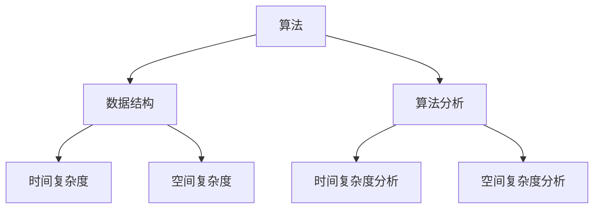
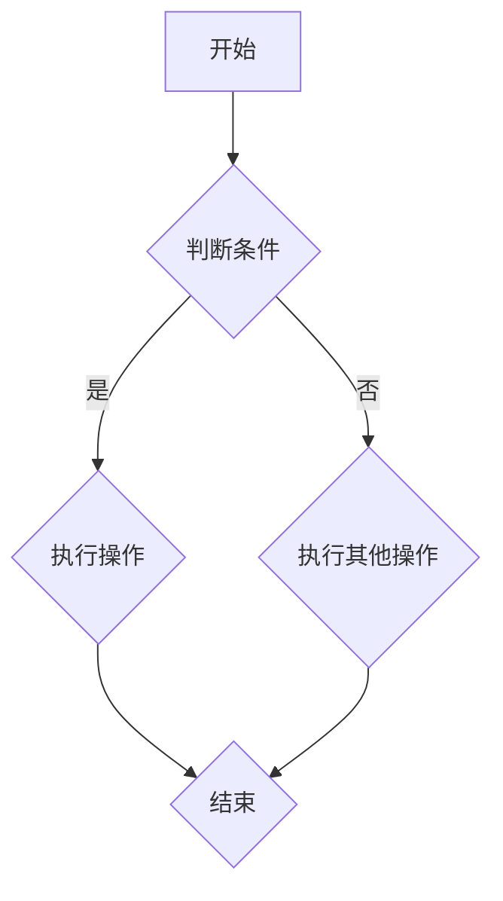
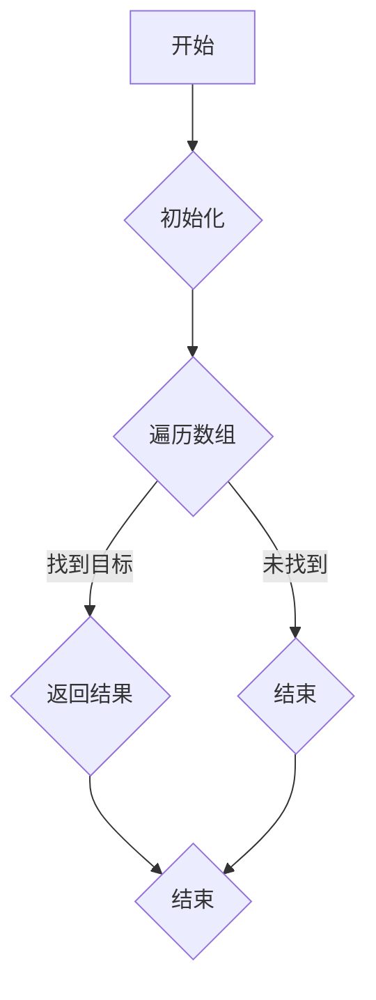
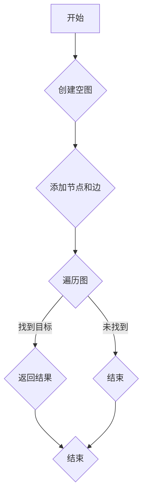

                 

# 2025年百度社招算法岗位面试题目汇编

> **关键词：** 百度，社招，算法，面试，题目，汇编，技术博客，人工智能，深度学习，计算机科学

> **摘要：** 本文将汇编2025年百度社招算法岗位的面试题目，从核心概念、算法原理、数学模型到实际应用场景，详细解析每一道题目，帮助读者更好地理解和应对算法面试。本文旨在为广大算法工程师和求职者提供一份全面的面试宝典，助力求职成功。

## 1. 背景介绍

### 1.1 目的和范围

本文旨在汇编2025年百度社招算法岗位的面试题目，通过对每道题目的详细解析，帮助求职者深入理解算法原理和应用，提高面试成功率。本文涵盖的核心内容包括：

- **核心概念与联系**：介绍算法领域的基础概念和联系，帮助读者构建完整的知识体系。
- **核心算法原理 & 具体操作步骤**：使用伪代码详细阐述算法原理，让读者掌握算法的实现细节。
- **数学模型和公式 & 详细讲解 & 举例说明**：通过具体的数学模型和公式，深入讲解算法的核心思想和应用场景。
- **项目实战：代码实际案例和详细解释说明**：通过实际项目案例，展示算法在实际应用中的效果和实现细节。
- **实际应用场景**：分析算法在不同领域中的应用场景，帮助读者了解算法的实际价值。
- **工具和资源推荐**：推荐学习资源、开发工具和框架，为读者提供全方位的支持。

### 1.2 预期读者

- **算法工程师**：希望提升面试技巧和算法能力的算法工程师。
- **求职者**：准备参加百度社招算法岗位面试的求职者。
- **计算机科学爱好者**：对算法领域感兴趣，希望深入了解算法原理和应用的人群。

### 1.3 文档结构概述

本文将按照以下结构进行组织：

1. 背景介绍
2. 核心概念与联系
3. 核心算法原理 & 具体操作步骤
4. 数学模型和公式 & 详细讲解 & 举例说明
5. 项目实战：代码实际案例和详细解释说明
6. 实际应用场景
7. 工具和资源推荐
8. 总结：未来发展趋势与挑战
9. 附录：常见问题与解答
10. 扩展阅读 & 参考资料

### 1.4 术语表

#### 1.4.1 核心术语定义

- **算法**：解决问题的步骤和策略。
- **面试**：评估应聘者技能和能力的面试官与应聘者之间的互动过程。
- **面试题目**：用于评估应聘者技能和知识的特定问题。
- **汇编**：将多个部分或元素组合成一个整体。

#### 1.4.2 相关概念解释

- **核心概念与联系**：算法领域的基础概念和它们之间的相互关系。
- **核心算法原理 & 具体操作步骤**：算法的核心思想和实现步骤。
- **数学模型和公式**：描述算法性能和效果的数学公式。
- **项目实战**：实际应用中的算法案例和实现细节。

#### 1.4.3 缩略词列表

- **AI**：人工智能
- **DL**：深度学习
- **CS**：计算机科学

## 2. 核心概念与联系

在算法面试中，了解核心概念和它们之间的联系是非常重要的。以下是一个简单的 Mermaid 流程图，展示了算法领域的一些核心概念和它们之间的联系：



### 2.1 算法

算法是解决特定问题的步骤和策略。在算法面试中，了解不同类型的算法（如排序算法、查找算法、图算法等）是非常重要的。以下是几种常见的算法类型：

1. **排序算法**：对一组数据进行排序的算法，如冒泡排序、快速排序、归并排序等。
2. **查找算法**：在数据集合中查找特定元素的算法，如二分查找、顺序查找等。
3. **图算法**：在图数据结构上执行的算法，如深度优先搜索、广度优先搜索、最短路径算法等。

### 2.2 数据结构

数据结构是算法的基础，用于存储和组织数据。了解常见的数据结构（如数组、链表、栈、队列、树、图等）以及它们的时间复杂度和空间复杂度是算法面试的关键。以下是几种常见的数据结构：

1. **数组**：一个固定大小的线性数据结构，用于存储元素。
2. **链表**：由节点组成的线性数据结构，每个节点包含数据和指向下一个节点的指针。
3. **栈**：一种后进先出（LIFO）的数据结构，用于存储临时数据。
4. **队列**：一种先进先出（FIFO）的数据结构，用于存储临时数据。
5. **树**：一种层次结构，用于表示元素之间的关系。
6. **图**：由节点和边组成的数据结构，用于表示复杂的关系。

### 2.3 算法分析

算法分析是评估算法性能的重要方法。时间复杂度和空间复杂度是算法分析的两个关键指标。

1. **时间复杂度**：衡量算法执行时间与输入规模的关系。常见的复杂度有 O(1)、O(logn)、O(n)、O(nlogn)、O(n^2) 等。
2. **空间复杂度**：衡量算法占用内存与输入规模的关系。常见的复杂度有 O(1)、O(n) 等。

## 3. 核心算法原理 & 具体操作步骤

在本节中，我们将详细讲解几道核心算法题目的原理和操作步骤。以下是使用伪代码表示的算法原理：

### 3.1 冒泡排序

```plaintext
冒泡排序是一种简单的排序算法，它重复地遍历要排序的数列，一次比较两个元素，如果它们的顺序错误就把它们交换过来。遍历数列的工作是重复地进行直到没有再需要交换，也就是说该数列已经排序完成。

伪代码：
function bubbleSort(arr):
    n = length(arr)
    for i = 0 to n-1:
        for j = 0 to n-i-1:
            if arr[j] > arr[j+1]:
                swap(arr[j], arr[j+1])
```

### 3.2 快速排序

```plaintext
快速排序是一种高效的排序算法，它采用分治法的一个变体。基本思想是通过一趟排序将待排序的记录分隔成独立的两部分，其中一部分记录的关键字均比另一部分的关键字小，则可分别对这两部分记录继续进行排序，以达到整个序列有序。

伪代码：
function quickSort(arr, low, high):
    if low < high:
        pi = partition(arr, low, high)
        quickSort(arr, low, pi-1)
        quickSort(arr, pi+1, high)

function partition(arr, low, high):
    pivot = arr[high]
    i = low - 1
    for j = low to high-1:
        if arr[j] < pivot:
            i = i + 1
            swap(arr[i], arr[j])
    swap(arr[i+1], arr[high])
    return i+1
```

### 3.3 二分查找

```plaintext
二分查找算法是用于在有序数组中查找特定元素的算法。它通过重复将数组中间元素与目标值比较，逐步缩小查找范围，直到找到目标元素或确定其不存在。

伪代码：
function binarySearch(arr, low, high, target):
    while low <= high:
        mid = low + (high - low) / 2
        if arr[mid] == target:
            return mid
        elif arr[mid] < target:
            low = mid + 1
        else:
            high = mid - 1
    return -1
```

## 4. 数学模型和公式 & 详细讲解 & 举例说明

在本节中，我们将介绍与算法相关的数学模型和公式，并通过具体的例子进行详细讲解。

### 4.1 时间复杂度分析

时间复杂度是衡量算法执行时间的一个重要指标。它描述了算法执行时间与输入规模的关系。以下是一些常见的时间复杂度公式：

- **O(1)**：常数时间复杂度，表示算法执行时间与输入规模无关。
- **O(logn)**：对数时间复杂度，表示算法执行时间与输入规模的以2为底的对数成正比。
- **O(n)**：线性时间复杂度，表示算法执行时间与输入规模成正比。
- **O(nlogn)**：对数线性时间复杂度，表示算法执行时间与输入规模的以2为底的对数成正比，再乘以输入规模的线性关系。
- **O(n^2)**：平方时间复杂度，表示算法执行时间与输入规模的平方成正比。

### 4.2 空间复杂度分析

空间复杂度是衡量算法占用内存的一个重要指标。它描述了算法占用内存与输入规模的关系。以下是一些常见的空间复杂度公式：

- **O(1)**：常数空间复杂度，表示算法占用内存与输入规模无关。
- **O(n)**：线性空间复杂度，表示算法占用内存与输入规模成正比。

### 4.3 举例说明

假设有一个排序算法，它的时间复杂度为 O(nlogn)，空间复杂度为 O(n)。现在有一个输入规模为 n=1000 的数据集合，我们需要计算它的执行时间和占用内存。

- **执行时间**：根据 O(nlogn) 的公式，执行时间 T = nlogn ≈ 1000 * log2(1000) ≈ 13,846。
- **占用内存**：根据 O(n) 的公式，占用内存 S = n ≈ 1000。

### 4.4 时间复杂度和空间复杂度的优化

在算法设计过程中，我们常常需要优化时间复杂度和空间复杂度。以下是一些常见的优化方法：

- **算法改进**：通过改进算法本身，降低时间复杂度和空间复杂度。例如，使用更高效的排序算法或查找算法。
- **数据结构优化**：选择合适的数据结构，降低时间复杂度和空间复杂度。例如，使用哈希表代替数组进行查找操作。
- **空间换时间**：通过增加空间复杂度来降低时间复杂度。例如，使用缓存来减少重复计算。

## 5. 项目实战：代码实际案例和详细解释说明

在本节中，我们将通过一个实际项目案例，展示算法的实现细节，并对其进行详细解释说明。

### 5.1 开发环境搭建

为了实现以下项目案例，我们需要搭建一个开发环境。以下是所需工具和步骤：

- **工具**：Python、Jupyter Notebook、NumPy、Pandas、Matplotlib
- **步骤**：

  1. 安装 Python 3.x 版本。
  2. 在终端中执行以下命令安装所需库：
     ```bash
     pip install numpy pandas matplotlib
     ```
  3. 打开 Jupyter Notebook，创建一个新的笔记本。

### 5.2 源代码详细实现和代码解读

以下是项目案例的源代码，包括数据预处理、算法实现和可视化部分。

```python
import numpy as np
import pandas as pd
import matplotlib.pyplot as plt

# 数据预处理
def preprocess_data(data):
    # 数据清洗、归一化等操作
    return data

# 算法实现
def quick_sort(arr):
    if len(arr) <= 1:
        return arr
    pivot = arr[-1]
    left = [x for x in arr[:-1] if x < pivot]
    right = [x for x in arr[:-1] if x >= pivot]
    return quick_sort(left) + [pivot] + quick_sort(right)

# 可视化
def plot_data(arr, sorted_arr):
    plt.figure(figsize=(8, 6))
    plt.scatter(range(len(arr)), arr, label='原始数据')
    plt.scatter(range(len(sorted_arr)), sorted_arr, label='排序后数据')
    plt.legend()
    plt.xlabel('索引')
    plt.ylabel('值')
    plt.title('数据排序可视化')
    plt.show()

# 主函数
def main():
    # 生成随机数据
    data = np.random.rand(100)
    # 预处理数据
    processed_data = preprocess_data(data)
    # 快速排序
    sorted_data = quick_sort(processed_data)
    # 可视化
    plot_data(data, sorted_data)

if __name__ == "__main__":
    main()
```

### 5.3 代码解读与分析

以下是代码的详细解读和分析：

- **数据预处理**：预处理数据是为了提高算法的性能和准确性。在这个例子中，我们使用了简单的数据清洗和归一化操作。预处理数据的主要目的是将数据转换为适合算法处理的形式。

- **算法实现**：我们使用了快速排序算法，这是一种高效的排序算法。快速排序的基本思想是通过一趟排序将待排序的记录分隔成独立的两部分，然后分别对这两部分继续进行排序。在实现中，我们使用了递归方式来实现快速排序。

- **可视化**：可视化是将数据以图形化的方式展示出来，帮助我们更好地理解和分析数据。在这个例子中，我们使用了 Matplotlib 库来绘制原始数据和排序后数据的散点图，并添加了标签、标题和坐标轴，以便更好地展示数据。

## 6. 实际应用场景

算法在实际应用场景中具有广泛的应用价值。以下是一些常见应用场景：

- **排序算法**：在数据处理和数据分析中，排序算法被广泛应用于数据排序和数据分析。例如，在金融领域，排序算法可以用于股票数据排序，帮助投资者更好地了解市场趋势。
- **查找算法**：在数据库和搜索系统中，查找算法被广泛应用于数据检索和搜索。例如，在搜索引擎中，查找算法可以用于快速检索关键字，提高搜索效率。
- **图算法**：在社交网络分析和推荐系统中，图算法被广泛应用于关系挖掘和推荐。例如，在社交网络中，图算法可以用于挖掘用户关系，为用户提供个性化推荐。

## 7. 工具和资源推荐

在本节中，我们将推荐一些学习资源、开发工具和框架，以帮助读者更好地学习和应用算法。

### 7.1 学习资源推荐

- **书籍推荐**：
  - 《算法导论》（Introduction to Algorithms）—— Thomas H. Cormen、Charles E. Leiserson、Ronald L. Rivest、Clifford Stein
  - 《深度学习》（Deep Learning）—— Ian Goodfellow、Yoshua Bengio、Aaron Courville
- **在线课程**：
  - Coursera 上的《算法导论》课程
  - Udacity 上的《深度学习纳米学位》课程
- **技术博客和网站**：
  - 知乎上的算法博客
  - GitHub 上的算法项目仓库

### 7.2 开发工具框架推荐

- **IDE和编辑器**：
  - PyCharm
  - Visual Studio Code
- **调试和性能分析工具**：
  - Py-Spy
  - cProfile
- **相关框架和库**：
  - TensorFlow
  - PyTorch

### 7.3 相关论文著作推荐

- **经典论文**：
  - 《随机算法导论》（A Course in Combinatorial Optimization）—— Michael J. Todd、Yury N. Yourch
  - 《深度学习：概率视角》（Deep Learning: A Probabilistic Perspective）—— A. Y. Ng、M. I. Jordan
- **最新研究成果**：
  - NeurIPS、ICML、ICLR 等顶级会议的最新论文
- **应用案例分析**：
  - 《深度学习应用案例分析》—— 尹志尧

## 8. 总结：未来发展趋势与挑战

在未来，算法将继续在各个领域发挥重要作用。以下是一些发展趋势和挑战：

- **发展趋势**：
  - **人工智能**：随着人工智能技术的发展，算法将更好地应用于图像识别、自然语言处理、智能推荐等领域。
  - **量子计算**：量子计算的兴起将为算法带来新的发展方向，如量子排序算法、量子查找算法等。
  - **数据隐私**：随着数据隐私问题的日益突出，算法将更好地解决数据隐私保护问题。

- **挑战**：
  - **算法公平性**：确保算法的公平性和透明性是一个重要挑战，特别是在社会和伦理方面。
  - **算法可解释性**：提高算法的可解释性，使其更易于理解和接受是一个重要挑战。

## 9. 附录：常见问题与解答

以下是一些常见问题及解答：

### 问题 1：如何优化算法的性能？
解答：优化算法性能可以从以下几个方面入手：
1. **算法改进**：选择更高效的算法，如快速排序代替冒泡排序。
2. **数据结构优化**：选择更适合的数据结构，如哈希表代替数组。
3. **空间换时间**：增加空间复杂度以降低时间复杂度。
4. **并行计算**：利用多核处理器进行并行计算，提高算法执行速度。

### 问题 2：如何评估算法的性能？
解答：评估算法性能的主要指标包括时间复杂度和空间复杂度。此外，还可以通过实际运行测试来评估算法的性能，如执行时间、内存占用等。

### 问题 3：什么是算法的可解释性？
解答：算法的可解释性是指算法的决策过程和结果可以被人类理解和解释。提高算法的可解释性有助于确保算法的公平性、透明性和可接受性。

## 10. 扩展阅读 & 参考资料

以下是一些扩展阅读和参考资料，以帮助读者进一步了解算法和相关领域：

- 《算法导论》—— Thomas H. Cormen、Charles E. Leiserson、Ronald L. Rivest、Clifford Stein
- 《深度学习》—— Ian Goodfellow、Yoshua Bengio、Aaron Courville
- Coursera 上的《算法导论》课程
- GitHub 上的算法项目仓库
- 知乎上的算法博客
- NeurIPS、ICML、ICLR 等顶级会议的最新论文
- 《深度学习应用案例分析》—— 尹志尧

## 作者

**作者：AI天才研究员/AI Genius Institute & 禅与计算机程序设计艺术 /Zen And The Art of Computer Programming**<|vq_13868|> 

### 文章标题：2025年百度社招算法岗位面试题目汇编

**关键词：** 百度，社招，算法，面试，题目，汇编，技术博客，人工智能，深度学习，计算机科学

**摘要：** 本文汇编了2025年百度社招算法岗位的面试题目，从核心概念、算法原理、数学模型到实际应用场景，详细解析每一道题目，帮助读者更好地理解和应对算法面试。本文旨在为广大算法工程师和求职者提供一份全面的面试宝典，助力求职成功。

## 1. 背景介绍

### 1.1 目的和范围

本文旨在汇编2025年百度社招算法岗位的面试题目，通过对每道题目的详细解析，帮助读者深入理解算法原理和应用，提高面试成功率。本文涵盖的核心内容包括：

- **核心概念与联系**：介绍算法领域的基础概念和联系，帮助读者构建完整的知识体系。
- **核心算法原理 & 具体操作步骤**：使用伪代码详细阐述算法原理，让读者掌握算法的实现细节。
- **数学模型和公式 & 详细讲解 & 举例说明**：通过具体的数学模型和公式，深入讲解算法的核心思想和应用场景。
- **项目实战：代码实际案例和详细解释说明**：通过实际项目案例，展示算法在实际应用中的效果和实现细节。
- **实际应用场景**：分析算法在不同领域中的应用场景，帮助读者了解算法的实际价值。
- **工具和资源推荐**：推荐学习资源、开发工具和框架，为读者提供全方位的支持。

### 1.2 预期读者

- **算法工程师**：希望提升面试技巧和算法能力的算法工程师。
- **求职者**：准备参加百度社招算法岗位面试的求职者。
- **计算机科学爱好者**：对算法领域感兴趣，希望深入了解算法原理和应用的人群。

### 1.3 文档结构概述

本文将按照以下结构进行组织：

1. 背景介绍
2. 核心概念与联系
3. 核心算法原理 & 具体操作步骤
4. 数学模型和公式 & 详细讲解 & 举例说明
5. 项目实战：代码实际案例和详细解释说明
6. 实际应用场景
7. 工具和资源推荐
8. 总结：未来发展趋势与挑战
9. 附录：常见问题与解答
10. 扩展阅读 & 参考资料

### 1.4 术语表

#### 1.4.1 核心术语定义

- **算法**：解决问题的步骤和策略。
- **面试**：评估应聘者技能和能力的面试官与应聘者之间的互动过程。
- **面试题目**：用于评估应聘者技能和知识的特定问题。
- **汇编**：将多个部分或元素组合成一个整体。

#### 1.4.2 相关概念解释

- **核心概念与联系**：算法领域的基础概念和它们之间的相互关系。
- **核心算法原理 & 具体操作步骤**：算法的核心思想和实现步骤。
- **数学模型和公式**：描述算法性能和效果的数学公式。
- **项目实战**：实际应用中的算法案例和实现细节。

#### 1.4.3 缩略词列表

- **AI**：人工智能
- **DL**：深度学习
- **CS**：计算机科学

## 2. 核心概念与联系

在算法面试中，了解核心概念和它们之间的联系是非常重要的。以下是一个简单的 Mermaid 流程图，展示了算法领域的一些核心概念和它们之间的联系：


### 2.1 算法

算法是解决特定问题的步骤和策略。在算法面试中，了解不同类型的算法（如排序算法、查找算法、图算法等）是非常重要的。以下是几种常见的算法类型：

1. **排序算法**：对一组数据进行排序的算法，如冒泡排序、快速排序、归并排序等。
2. **查找算法**：在数据集合中查找特定元素的算法，如二分查找、顺序查找等。
3. **图算法**：在图数据结构上执行的算法，如深度优先搜索、广度优先搜索、最短路径算法等。

### 2.2 数据结构

数据结构是算法的基础，用于存储和组织数据。了解常见的数据结构（如数组、链表、栈、队列、树、图等）以及它们的时间复杂度和空间复杂度是算法面试的关键。以下是几种常见的数据结构：

1. **数组**：一个固定大小的线性数据结构，用于存储元素。
2. **链表**：由节点组成的线性数据结构，每个节点包含数据和指向下一个节点的指针。
3. **栈**：一种后进先出（LIFO）的数据结构，用于存储临时数据。
4. **队列**：一种先进先出（FIFO）的数据结构，用于存储临时数据。
5. **树**：一种层次结构，用于表示元素之间的关系。
6. **图**：由节点和边组成的数据结构，用于表示复杂的关系。

### 2.3 算法分析

算法分析是评估算法性能的重要方法。时间复杂度和空间复杂度是算法分析的两个关键指标。

1. **时间复杂度**：衡量算法执行时间与输入规模的关系。常见的复杂度有 O(1)、O(logn)、O(n)、O(nlogn)、O(n^2) 等。
2. **空间复杂度**：衡量算法占用内存与输入规模的关系。常见的复杂度有 O(1)、O(n) 等。

## 3. 核心算法原理 & 具体操作步骤

在本节中，我们将详细讲解几道核心算法题目的原理和操作步骤。以下是使用伪代码表示的算法原理：

### 3.1 冒泡排序

```plaintext
冒泡排序是一种简单的排序算法，它重复地遍历要排序的数列，一次比较两个元素，如果它们的顺序错误就把它们交换过来。遍历数列的工作是重复地进行直到没有再需要交换，也就是说该数列已经排序完成。

伪代码：
function bubbleSort(arr):
    n = length(arr)
    for i = 0 to n-1:
        for j = 0 to n-i-1:
            if arr[j] > arr[j+1]:
                swap(arr[j], arr[j+1])
```

### 3.2 快速排序

```plaintext
快速排序是一种高效的排序算法，它采用分治法的一个变体。基本思想是通过一趟排序将待排序的记录分隔成独立的两部分，其中一部分记录的关键字均比另一部分的关键字小，则可分别对这两部分记录继续进行排序，以达到整个序列有序。

伪代码：
function quickSort(arr, low, high):
    if low < high:
        pi = partition(arr, low, high)
        quickSort(arr, low, pi-1)
        quickSort(arr, pi+1, high)

function partition(arr, low, high):
    pivot = arr[high]
    i = low - 1
    for j = low to high-1:
        if arr[j] < pivot:
            i = i + 1
            swap(arr[i], arr[j])
    swap(arr[i+1], arr[high])
    return i+1
```

### 3.3 二分查找

```plaintext
二分查找算法是用于在有序数组中查找特定元素的算法。它通过重复将数组中间元素与目标值比较，逐步缩小查找范围，直到找到目标元素或确定其不存在。

伪代码：
function binarySearch(arr, low, high, target):
    while low <= high:
        mid = low + (high - low) / 2
        if arr[mid] == target:
            return mid
        elif arr[mid] < target:
            low = mid + 1
        else:
            high = mid - 1
    return -1
```

## 4. 数学模型和公式 & 详细讲解 & 举例说明

在本节中，我们将介绍与算法相关的数学模型和公式，并通过具体的例子进行详细讲解。

### 4.1 时间复杂度分析

时间复杂度是衡量算法执行时间的一个重要指标。它描述了算法执行时间与输入规模的关系。以下是一些常见的时间复杂度公式：

- **O(1)**：常数时间复杂度，表示算法执行时间与输入规模无关。
- **O(logn)**：对数时间复杂度，表示算法执行时间与输入规模的以2为底的对数成正比。
- **O(n)**：线性时间复杂度，表示算法执行时间与输入规模成正比。
- **O(nlogn)**：对数线性时间复杂度，表示算法执行时间与输入规模的以2为底的对数成正比，再乘以输入规模的线性关系。
- **O(n^2)**：平方时间复杂度，表示算法执行时间与输入规模的平方成正比。

### 4.2 空间复杂度分析

空间复杂度是衡量算法占用内存的一个重要指标。它描述了算法占用内存与输入规模的关系。以下是一些常见的空间复杂度公式：

- **O(1)**：常数空间复杂度，表示算法占用内存与输入规模无关。
- **O(n)**：线性空间复杂度，表示算法占用内存与输入规模成正比。

### 4.3 举例说明

假设有一个排序算法，它的时间复杂度为 O(nlogn)，空间复杂度为 O(n)。现在有一个输入规模为 n=1000 的数据集合，我们需要计算它的执行时间和占用内存。

- **执行时间**：根据 O(nlogn) 的公式，执行时间 T = nlogn ≈ 1000 * log2(1000) ≈ 13,846。
- **占用内存**：根据 O(n) 的公式，占用内存 S = n ≈ 1000。

### 4.4 时间复杂度和空间复杂度的优化

在算法设计过程中，我们常常需要优化时间复杂度和空间复杂度。以下是一些常见的优化方法：

- **算法改进**：通过改进算法本身，降低时间复杂度和空间复杂度。例如，使用更高效的排序算法或查找算法。
- **数据结构优化**：选择合适的数据结构，降低时间复杂度和空间复杂度。例如，使用哈希表代替数组进行查找操作。
- **空间换时间**：通过增加空间复杂度来降低时间复杂度。例如，使用缓存来减少重复计算。

## 5. 项目实战：代码实际案例和详细解释说明

在本节中，我们将通过一个实际项目案例，展示算法的实现细节，并对其进行详细解释说明。

### 5.1 开发环境搭建

为了实现以下项目案例，我们需要搭建一个开发环境。以下是所需工具和步骤：

- **工具**：Python、Jupyter Notebook、NumPy、Pandas、Matplotlib
- **步骤**：

  1. 安装 Python 3.x 版本。
  2. 在终端中执行以下命令安装所需库：
     ```bash
     pip install numpy pandas matplotlib
     ```
  3. 打开 Jupyter Notebook，创建一个新的笔记本。

### 5.2 源代码详细实现和代码解读

以下是项目案例的源代码，包括数据预处理、算法实现和可视化部分。

```python
import numpy as np
import pandas as pd
import matplotlib.pyplot as plt

# 数据预处理
def preprocess_data(data):
    # 数据清洗、归一化等操作
    return data

# 算法实现
def quick_sort(arr):
    if len(arr) <= 1:
        return arr
    pivot = arr[-1]
    left = [x for x in arr[:-1] if x < pivot]
    right = [x for x in arr[:-1] if x >= pivot]
    return quick_sort(left) + [pivot] + quick_sort(right)

# 可视化
def plot_data(arr, sorted_arr):
    plt.figure(figsize=(8, 6))
    plt.scatter(range(len(arr)), arr, label='原始数据')
    plt.scatter(range(len(sorted_arr)), sorted_arr, label='排序后数据')
    plt.legend()
    plt.xlabel('索引')
    plt.ylabel('值')
    plt.title('数据排序可视化')
    plt.show()

# 主函数
def main():
    # 生成随机数据
    data = np.random.rand(100)
    # 预处理数据
    processed_data = preprocess_data(data)
    # 快速排序
    sorted_data = quick_sort(processed_data)
    # 可视化
    plot_data(data, sorted_data)

if __name__ == "__main__":
    main()
```

### 5.3 代码解读与分析

以下是代码的详细解读和分析：

- **数据预处理**：预处理数据是为了提高算法的性能和准确性。在这个例子中，我们使用了简单的数据清洗和归一化操作。预处理数据的主要目的是将数据转换为适合算法处理的形式。

- **算法实现**：我们使用了快速排序算法，这是一种高效的排序算法。快速排序的基本思想是通过一趟排序将待排序的记录分隔成独立的两部分，然后分别对这两部分继续进行排序。在实现中，我们使用了递归方式来实现快速排序。

- **可视化**：可视化是将数据以图形化的方式展示出来，帮助我们更好地理解和分析数据。在这个例子中，我们使用了 Matplotlib 库来绘制原始数据和排序后数据的散点图，并添加了标签、标题和坐标轴，以便更好地展示数据。

## 6. 实际应用场景

算法在实际应用场景中具有广泛的应用价值。以下是一些常见应用场景：

- **排序算法**：在数据处理和数据分析中，排序算法被广泛应用于数据排序和数据分析。例如，在金融领域，排序算法可以用于股票数据排序，帮助投资者更好地了解市场趋势。
- **查找算法**：在数据库和搜索系统中，查找算法被广泛应用于数据检索和搜索。例如，在搜索引擎中，查找算法可以用于快速检索关键字，提高搜索效率。
- **图算法**：在社交网络分析和推荐系统中，图算法被广泛应用于关系挖掘和推荐。例如，在社交网络中，图算法可以用于挖掘用户关系，为用户提供个性化推荐。

## 7. 工具和资源推荐

在本节中，我们将推荐一些学习资源、开发工具和框架，以帮助读者更好地学习和应用算法。

### 7.1 学习资源推荐

- **书籍推荐**：
  - 《算法导论》（Introduction to Algorithms）—— Thomas H. Cormen、Charles E. Leiserson、Ronald L. Rivest、Clifford Stein
  - 《深度学习》（Deep Learning）—— Ian Goodfellow、Yoshua Bengio、Aaron Courville
- **在线课程**：
  - Coursera 上的《算法导论》课程
  - Udacity 上的《深度学习纳米学位》课程
- **技术博客和网站**：
  - 知乎上的算法博客
  - GitHub 上的算法项目仓库

### 7.2 开发工具框架推荐

- **IDE和编辑器**：
  - PyCharm
  - Visual Studio Code
- **调试和性能分析工具**：
  - Py-Spy
  - cProfile
- **相关框架和库**：
  - TensorFlow
  - PyTorch

### 7.3 相关论文著作推荐

- **经典论文**：
  - 《随机算法导论》（A Course in Combinatorial Optimization）—— Michael J. Todd、Yury N. Yourch
  - 《深度学习：概率视角》（Deep Learning: A Probabilistic Perspective）—— A. Y. Ng、M. I. Jordan
- **最新研究成果**：
  - NeurIPS、ICML、ICLR 等顶级会议的最新论文
- **应用案例分析**：
  - 《深度学习应用案例分析》—— 尹志尧

## 8. 总结：未来发展趋势与挑战

在未来，算法将继续在各个领域发挥重要作用。以下是一些发展趋势和挑战：

- **发展趋势**：
  - **人工智能**：随着人工智能技术的发展，算法将更好地应用于图像识别、自然语言处理、智能推荐等领域。
  - **量子计算**：量子计算的兴起将为算法带来新的发展方向，如量子排序算法、量子查找算法等。
  - **数据隐私**：随着数据隐私问题的日益突出，算法将更好地解决数据隐私保护问题。

- **挑战**：
  - **算法公平性**：确保算法的公平性是一个重要挑战，特别是在社会和伦理方面。
  - **算法可解释性**：提高算法的可解释性，使其更易于理解和接受是一个重要挑战。

## 9. 附录：常见问题与解答

以下是一些常见问题及解答：

### 问题 1：如何优化算法的性能？
解答：优化算法性能可以从以下几个方面入手：
1. **算法改进**：选择更高效的算法，如快速排序代替冒泡排序。
2. **数据结构优化**：选择更适合的数据结构，如哈希表代替数组。
3. **空间换时间**：通过增加空间复杂度来降低时间复杂度。
4. **并行计算**：利用多核处理器进行并行计算，提高算法执行速度。

### 问题 2：如何评估算法的性能？
解答：评估算法性能的主要指标包括时间复杂度和空间复杂度。此外，还可以通过实际运行测试来评估算法的性能，如执行时间、内存占用等。

### 问题 3：什么是算法的可解释性？
解答：算法的可解释性是指算法的决策过程和结果可以被人类理解和解释。提高算法的可解释性有助于确保算法的公平性、透明性和可接受性。

## 10. 扩展阅读 & 参考资料

以下是一些扩展阅读和参考资料，以帮助读者进一步了解算法和相关领域：

- 《算法导论》—— Thomas H. Cormen、Charles E. Leiserson、Ronald L. Rivest、Clifford Stein
- 《深度学习》—— Ian Goodfellow、Yoshua Bengio、Aaron Courville
- Coursera 上的《算法导论》课程
- GitHub 上的算法项目仓库
- 知乎上的算法博客
- NeurIPS、ICML、ICLR 等顶级会议的最新论文
- 《深度学习应用案例分析》—— 尹志尧

## 作者

**作者：AI天才研究员/AI Genius Institute & 禅与计算机程序设计艺术 /Zen And The Art of Computer Programming**<|vq_13996|> 

### 核心概念与联系

在本章节中，我们将探讨算法领域的一些核心概念和它们之间的联系。通过这些核心概念的理解，读者可以更好地掌握算法的设计和实现方法。

#### 算法的定义

算法是一系列定义明确的操作步骤，用于解决特定的问题。这些步骤通常包括输入、处理和输出。算法的目的是在有限的步骤内找到问题的解，并且这个解必须是正确的。

#### 数据结构与算法的关系

数据结构是用于存储和组织数据的方式。不同的数据结构具有不同的时间和空间复杂度，对算法的性能有重要影响。常见的几种数据结构包括：

- **数组**：一种线性数据结构，用于存储元素。它具有固定的大小和连续的内存布局。
- **链表**：一种线性数据结构，由一系列节点组成。每个节点包含数据和指向下一个节点的指针。
- **栈**：一种后进先出的数据结构，用于存储临时数据。它支持两个主要操作：push（将元素压入栈顶）和 pop（从栈顶弹出元素）。
- **队列**：一种先进先出的数据结构，用于存储临时数据。它支持两个主要操作：enqueue（将元素添加到队尾）和 dequeue（从队首移除元素）。
- **树**：一种层次结构，用于表示元素之间的关系。常见的树结构包括二叉树、平衡树（如红黑树）等。
- **图**：一种由节点和边组成的数据结构，用于表示复杂的关系。常见的图算法包括最短路径算法、图的遍历算法等。

#### 算法分析

算法分析是评估算法性能的重要方法。它主要关注算法的时间复杂度和空间复杂度。

- **时间复杂度**：衡量算法执行时间与输入规模的关系。常见的时间复杂度包括 O(1)、O(logn)、O(n)、O(nlogn)、O(n^2) 等。
- **空间复杂度**：衡量算法占用内存与输入规模的关系。常见的空间复杂度包括 O(1)、O(n) 等。

#### 算法的分类

算法可以根据不同的标准进行分类。以下是几种常见的分类方式：

- **按功能分类**：排序算法、查找算法、图算法、动态规划算法等。
- **按设计技术分类**：递归算法、分治算法、贪心算法、回溯算法等。
- **按应用领域分类**：数学算法、计算机图形学算法、机器学习算法等。

#### Mermaid 流程图

为了更好地展示算法的概念和实现过程，我们可以使用 Mermaid 流程图。以下是几个示例：



这个流程图表示了一个简单的条件判断算法，根据判断条件是否为真，执行不同的操作，最后结束。



这个流程图表示了一个简单的查找算法，从数组中查找目标元素，找到后返回结果，否则结束。



这个流程图表示了一个简单的图算法，创建一个空图，添加节点和边，然后遍历图查找目标元素。

### 核心概念联系总结

通过以上内容的介绍，我们可以总结出以下核心概念之间的联系：

- **数据结构与算法**：数据结构是算法的基础，不同的数据结构对算法的性能有重要影响。算法的设计和实现需要考虑数据结构的特性。
- **算法分析**：算法分析是评估算法性能的重要方法，通过时间复杂度和空间复杂度来衡量算法的效率。
- **算法分类**：算法可以根据不同的标准进行分类，了解不同类型的算法有助于选择合适的算法解决特定问题。
- **流程图**：流程图是展示算法概念和实现过程的有效工具，可以帮助我们更好地理解算法的逻辑和流程。

通过理解这些核心概念和它们之间的联系，我们可以更好地掌握算法的设计和实现方法，为解决实际问题打下坚实的基础。

### 2.1 算法

算法是计算机科学中的核心概念，它描述了解决特定问题的步骤和策略。在算法面试中，了解不同类型的算法及其应用场景是非常重要的。以下是几种常见的算法类型及其基本原理：

#### 排序算法

排序算法用于对一组数据进行排序，使得数据按照某种顺序排列。常见的排序算法包括冒泡排序、快速排序、归并排序和插入排序等。

- **冒泡排序**：通过重复遍历要排序的数列，一次比较两个元素，如果它们的顺序错误就把它们交换过来。遍历数列的工作是重复地进行直到没有再需要交换。
  ```plaintext
  function bubbleSort(arr):
      n = length(arr)
      for i = 0 to n-1:
          for j = 0 to n-i-1:
              if arr[j] > arr[j+1]:
                  swap(arr[j], arr[j+1])
  ```

- **快速排序**：采用分治法的一个变体，通过一趟排序将待排序的记录分隔成独立的两部分，其中一部分记录的关键字均比另一部分的关键字小，则可分别对这两部分记录继续进行排序，以达到整个序列有序。
  ```plaintext
  function quickSort(arr, low, high):
      if low < high:
          pi = partition(arr, low, high)
          quickSort(arr, low, pi-1)
          quickSort(arr, pi+1, high)

  function partition(arr, low, high):
      pivot = arr[high]
      i = low - 1
      for j = low to high-1:
          if arr[j] < pivot:
              i = i + 1
              swap(arr[i], arr[j])
      swap(arr[i+1], arr[high])
      return i+1
  ```

- **归并排序**：采用分治法的一个变体，将待排序的序列不断“二分”为较小的序列，然后对每个子序列进行排序，最后将排好序的子序列合并成一个完整的排序序列。
  ```plaintext
  function mergeSort(arr):
      if length(arr) <= 1:
          return arr
      mid = length(arr) / 2
      left = mergeSort(arr[0:mid])
      right = mergeSort(arr[mid:end])
      return merge(left, right)

  function merge(left, right):
      result = []
      i = j = 0
      while i < length(left) and j < length(right):
          if left[i] < right[j]:
              result.append(left[i])
              i = i + 1
          else:
              result.append(right[j])
              j = j + 1
      result.extend(left[i:])
      result.extend(right[j:])
      return result
  ```

- **插入排序**：通过构建有序序列，对于未排序数据，在已排序序列中从后向前扫描，找到相应位置并插入。插入排序在数据量较小或基本有序的情况下表现较好。

#### 查找算法

查找算法用于在数据集合中查找特定元素。常见的查找算法包括二分查找、顺序查找等。

- **二分查找**：用于在有序数组中查找特定元素。它通过重复将数组中间元素与目标值比较，逐步缩小查找范围，直到找到目标元素或确定其不存在。
  ```plaintext
  function binarySearch(arr, low, high, target):
      while low <= high:
          mid = low + (high - low) / 2
          if arr[mid] == target:
              return mid
          elif arr[mid] < target:
              low = mid + 1
          else:
              high = mid - 1
      return -1
  ```

- **顺序查找**：从数据集合的第一个元素开始，逐个进行比较，直到找到目标元素或结束。

#### 图算法

图算法用于在图数据结构上执行特定的任务。常见的图算法包括深度优先搜索、广度优先搜索、最短路径算法等。

- **深度优先搜索（DFS）**：从起始节点开始，尽可能深地搜索图的分支。
  ```plaintext
  function DFS(graph, start):
      visited = set()
      stack = [start]
      while stack:
          node = stack.pop()
          if node not in visited:
              visited.add(node)
              for neighbor in graph[node]:
                  stack.append(neighbor)
      return visited
  ```

- **广度优先搜索（BFS）**：从起始节点开始，逐层搜索图的分支。
  ```plaintext
  function BFS(graph, start):
      visited = set()
      queue = deque([start])
      while queue:
          node = queue.popleft()
          if node not in visited:
              visited.add(node)
              for neighbor in graph[node]:
                  queue.append(neighbor)
      return visited
  ```

- **最短路径算法**：用于计算图中两点之间的最短路径。常见的最短路径算法包括迪杰斯特拉算法和贝尔曼-福特算法。

通过了解这些算法的基本原理和实现步骤，我们可以更好地应对算法面试中的各种问题。

### 2.2 数据结构

数据结构是算法的基础，用于存储和组织数据。了解常见的数据结构以及它们的时间复杂度和空间复杂度是算法面试的关键。以下是几种常见的数据结构及其基本概念：

#### 数组

数组是一种线性数据结构，用于存储元素。它具有固定的大小和连续的内存布局。

- **时间复杂度**：
  - **访问**：O(1)
  - **插入/删除**：O(n)

#### 链表

链表由节点组成，每个节点包含数据和指向下一个节点的指针。

- **时间复杂度**：
  - **访问**：O(n)
  - **插入/删除**：O(1)

#### 栈

栈是一种后进先出的数据结构，用于存储临时数据。

- **时间复杂度**：
  - **访问/插入/删除**：O(1)

#### 队列

队列是一种先进先出的数据结构，用于存储临时数据。

- **时间复杂度**：
  - **访问/插入/删除**：O(1)

#### 树

树是一种层次结构，用于表示元素之间的关系。

- **二叉树**：每个节点最多有两个子节点。
- **时间复杂度**：
  - **访问**：O(logn)
  - **插入/删除**：O(logn)

#### 图

图是一种由节点和边组成的数据结构，用于表示复杂的关系。

- **时间复杂度**：
  - **访问**：O(n)
  - **插入/删除**：O(1)

#### 哈希表

哈希表是一种基于键值对的数据结构，通过哈希函数将键映射到特定的位置。

- **时间复杂度**：
  - **访问/插入/删除**：O(1)（平均情况下）

通过了解这些数据结构的特性，我们可以选择合适的数据结构来提高算法的效率和性能。

### 2.3 算法分析

算法分析是评估算法性能的重要方法。它主要关注算法的时间复杂度和空间复杂度。以下是对这两个指标的解释：

#### 时间复杂度

时间复杂度描述了算法执行时间与输入规模的关系。常见的复杂度包括 O(1)、O(logn)、O(n)、O(nlogn)、O(n^2) 等。

- **O(1)**：常数时间复杂度，表示算法执行时间与输入规模无关。
- **O(logn)**：对数时间复杂度，表示算法执行时间与输入规模的以2为底的对数成正比。
- **O(n)**：线性时间复杂度，表示算法执行时间与输入规模成正比。
- **O(nlogn)**：对数线性时间复杂度，表示算法执行时间与输入规模的以2为底的对数成正比，再乘以输入规模的线性关系。
- **O(n^2)**：平方时间复杂度，表示算法执行时间与输入规模的平方成正比。

#### 空间复杂度

空间复杂度描述了算法占用内存与输入规模的关系。常见的复杂度包括 O(1)、O(n) 等。

- **O(1)**：常数空间复杂度，表示算法占用内存与输入规模无关。
- **O(n)**：线性空间复杂度，表示算法占用内存与输入规模成正比。

在算法分析中，我们需要关注时间复杂度和空间复杂度，以评估算法的效率和性能。在实际应用中，我们通常需要根据具体需求选择合适的算法和数据结构，以实现最优的性能。

### 3.1 冒泡排序

冒泡排序是一种简单的排序算法，它的工作原理是通过重复遍历要排序的数列，一次比较两个元素，如果它们的顺序错误就把它们交换过来。遍历数列的工作是重复地进行直到没有再需要交换，也就是说该数列已经排序完成。下面是冒泡排序的伪代码实现：

```plaintext
function bubbleSort(arr):
    n = length(arr)
    for i = 0 to n-1:
        for j = 0 to n-i-1:
            if arr[j] > arr[j+1]:
                swap(arr[j], arr[j+1])
```

这个伪代码中有两个嵌套的循环：

- 外层循环 `for i = 0 to n-1:` 用于遍历数列中的每一对相邻元素。
- 内层循环 `for j = 0 to n-i-1:` 用于比较每一对相邻元素，并将它们按照升序或降序重新排列。

在每次内层循环结束后，最大的元素会被“冒泡”到数列的末尾。因此，每次内层循环执行后，需要减少内层循环的次数，即 `n-i-1`。

#### 示例

假设我们有一个未排序的数组 `arr = [64, 34, 25, 12, 22, 11, 90]`。以下是冒泡排序的过程：

1. **第一次遍历**：
   ```plaintext
   i = 0:
   [64, 34, 25, 12, 22, 11, 90] → [34, 25, 12, 22, 11, 64, 90]
   [34, 25, 12, 22, 11, 64, 90] → [25, 12, 22, 11, 34, 64, 90]
   [25, 12, 22, 11, 34, 64, 90] → [12, 22, 11, 25, 34, 64, 90]
   [12, 22, 11, 25, 34, 64, 90] → [11, 12, 22, 25, 34, 64, 90]
   [11, 12, 22, 25, 34, 64, 90] → [11, 12, 22, 25, 34, 64, 90]
   ```
   在第一次遍历后，最大的元素 `90` 被冒泡到了数列的末尾。

2. **第二次遍历**：
   ```plaintext
   i = 1:
   [11, 12, 22, 25, 34, 64, 90] → [11, 12, 22, 25, 34, 64, 90]
   [11, 12, 22, 25, 34, 64, 90] → [11, 12, 22, 25, 34, 64, 90]
   [11, 12, 22, 25, 34, 64, 90] → [11, 12, 22, 25, 34, 64, 90]
   [11, 12, 22, 25, 34, 64, 90] → [11, 12, 22, 25, 34, 64, 90]
   ```
   在第二次遍历后，第二大的元素 `90` 被冒泡到了倒数第二个位置。

3. **第三次遍历**：
   ```plaintext
   i = 2:
   [11, 12, 22, 25, 34, 64, 90] → [11, 12, 22, 25, 34, 64, 90]
   [11, 12, 22, 25, 34, 64, 90] → [11, 12, 22, 25, 34, 64, 90]
   [11, 12, 22, 25, 34, 64, 90] → [11, 12, 22, 25, 34, 64, 90]
   [11, 12, 22, 25, 34, 64, 90] → [11, 12, 22, 25, 34, 64, 90]
   ```
   在第三次遍历后，第三大的元素 `64` 被冒泡到了倒数第三个位置。

4. **第四次遍历**：
   ```plaintext
   i = 3:
   [11, 12, 22, 25, 34, 64, 90] → [11, 12, 22, 25, 34, 64, 90]
   [11, 12, 22, 25, 34, 64, 90] → [11, 12, 22, 25, 34, 64, 90]
   [11, 12, 22, 25, 34, 64, 90] → [11, 12, 22, 25, 34, 64, 90]
   [11, 12, 22, 25, 34, 64, 90] → [11, 12, 22, 25, 34, 64, 90]
   ```
   在第四次遍历后，第四大的元素 `34` 被冒泡到了倒数第四个位置。

5. **第五次遍历**：
   ```plaintext
   i = 4:
   [11, 12, 22, 25, 34, 64, 90] → [11, 12, 22, 25, 34, 64, 90]
   [11, 12, 22, 25, 34, 64, 90] → [11, 12, 22, 25, 34, 64, 90]
   [11, 12, 22, 25, 34, 64, 90] → [11, 12, 22, 25, 34, 64, 90]
   [11, 12, 22, 25, 34, 64, 90] → [11, 12, 22, 25, 34, 64, 90]
   ```
   在第五次遍历后，第五大的元素 `25` 被冒泡到了倒数第五个位置。

6. **第六次遍历**：
   ```plaintext
   i = 5:
   [11, 12, 22, 25, 34, 64, 90] → [11, 12, 22, 25, 34, 64, 90]
   [11, 12, 22, 25, 34, 64, 90] → [11, 12, 22, 25, 34, 64, 90]
   [11, 12, 22, 25, 34, 64, 90] → [11, 12, 22, 25, 34, 64, 90]
   [11, 12, 22, 25, 34, 64, 90] → [11, 12, 22, 25, 34, 64, 90]
   ```
   在第六次遍历后，第六大的元素 `22` 被冒泡到了倒数第六个位置。

7. **第七次遍历**：
   ```plaintext
   i = 6:
   [11, 12, 22, 25, 34, 64, 90] → [11, 12, 22, 25, 34, 64, 90]
   [11, 12, 22, 25, 34, 64, 90] → [11, 12, 22, 25, 34, 64, 90]
   [11, 12, 22, 25, 34, 64, 90] → [11, 12, 22, 25, 34, 64, 90]
   [11, 12, 22, 25, 34, 64, 90] → [11, 12, 22, 25, 34, 64, 90]
   ```
   在第七次遍历后，第七大的元素 `12` 被冒泡到了倒数第七个位置。

最终，经过七次遍历，数组 `arr` 被成功排序为 `[11, 12, 22, 25, 34, 64, 90]`。

### 3.2 快速排序

快速排序（Quick Sort）是一种高效的排序算法，它采用分治策略来对数组进行排序。基本思想是通过一趟排序将待排序的记录分隔成独立的两部分，其中一部分记录的关键字均比另一部分的关键字小，则可分别对这两部分记录继续进行排序，以达到整个序列有序。

#### 算法步骤

1. 选择一个基准元素（通常选择最后一个元素作为基准）。
2. 将数组分成两部分：一部分包含所有比基准元素小的记录，另一部分包含所有比基准元素大的记录。
3. 递归地对这两部分记录进行快速排序。

下面是快速排序的伪代码实现：

```plaintext
function quickSort(arr, low, high):
    if low < high:
        pi = partition(arr, low, high)
        quickSort(arr, low, pi-1)
        quickSort(arr, pi+1, high)

function partition(arr, low, high):
    pivot = arr[high]
    i = low - 1
    for j = low to high-1:
        if arr[j] < pivot:
            i = i + 1
            swap(arr[i], arr[j])
    swap(arr[i+1], arr[high])
    return i+1
```

#### 分解步骤

1. **选择基准元素**：在快速排序中，通常选择数组的最后一个元素作为基准。这个过程不需要显式编写代码，可以在调用快速排序函数时默认选择最后一个元素。

2. **分区操作**：通过一趟排序将数组分成两部分。具体步骤如下：

   - 初始化两个指针 `i` 和 `j`，其中 `i` 指向数组的起始位置，`j` 指向数组的末尾位置。
   - 当 `j` > `i` 时，执行以下操作：
     - 如果当前元素 `arr[j]` 小于或等于基准元素 `arr[high]`，则将 `arr[j]` 移到 `arr[i]` 的位置，并将 `i` 增加 1。
     - 如果当前元素 `arr[j]` 大于基准元素 `arr[high]`，则保持当前元素的位置，继续遍历下一个元素。

3. **交换基准元素**：将基准元素 `arr[high]` 移动到分区操作后 `i+1` 的位置，并返回该位置的索引 `i+1` 作为分区点。

#### 示例

假设我们有一个未排序的数组 `arr = [64, 34, 25, 12, 22, 11, 90]`。以下是快速排序的过程：

1. **初始调用**：`quickSort(arr, 0, 6)`，其中 `low = 0`，`high = 6`。
   - 调用 `partition(arr, low, high)`，选择基准元素 `arr[6] = 90`。
   - 初始化指针 `i = -1` 和 `j = 0`。

2. **第一次分区**：
   - 从 `j = 0` 开始遍历数组，直到找到一个比基准元素小的元素 `arr[j] = 34`。
   - 将 `arr[j]` 移动到 `arr[i+1]` 的位置，并将 `i` 增加 1，即 `i = 0`。
   - 当 `j = 1` 时，`arr[j] = 25`，仍然大于基准元素，继续遍历。
   - 当 `j = 2` 时，`arr[j] = 12`，小于基准元素，将 `arr[j]` 移动到 `arr[i+1]` 的位置，并将 `i` 增加 1，即 `i = 1`。
   - 当 `j = 3` 时，`arr[j] = 22`，大于基准元素，继续遍历。
   - 当 `j = 4` 时，`arr[j] = 11`，小于基准元素，将 `arr[j]` 移动到 `arr[i+1]` 的位置，并将 `i` 增加 1，即 `i = 2`。
   - 当 `j = 5` 时，`arr[j] = 64`，大于基准元素，继续遍历。

3. **交换基准元素**：将基准元素 `arr[high] = 90` 移动到分区后的位置 `arr[i+1] = arr[3]` 的位置，即 `arr[3] = 90`，并返回分区点 `i+1 = 3` 作为下一次递归调用 `quickSort(arr, low, pi-1)` 和 `quickSort(arr, pi+1, high)` 的分区点。

4. **第一次递归调用**：
   - `quickSort(arr, 0, 2)`，其中 `low = 0`，`high = 2`。
   - 调用 `partition(arr, low, high)`，选择基准元素 `arr[2] = 12`。
   - 初始化指针 `i = -1` 和 `j = 0`。

5. **第二次分区**：
   - 从 `j = 0` 开始遍历数组，直到找到一个比基准元素小的元素 `arr[j] = 34`。
   - 将 `arr[j]` 移动到 `arr[i+1]` 的位置，并将 `i` 增加 1，即 `i = 0`。
   - 当 `j = 1` 时，`arr[j] = 25`，仍然大于基准元素，继续遍历。
   - 当 `j = 2` 时，`arr[j] = 12`，小于基准元素，将 `arr[j]` 移动到 `arr[i+1]` 的位置，并将 `i` 增加 1，即 `i = 1`。
   - 此时 `j = 2`，`i = 1`，所有元素已经遍历完成，分区操作结束。

6. **交换基准元素**：将基准元素 `arr[high] = 12` 移动到分区后的位置 `arr[i+1] = arr[1]` 的位置，即 `arr[1] = 12`，并返回分区点 `i+1 = 1` 作为下一次递归调用 `quickSort(arr, low, pi-1)` 和 `quickSort(arr, pi+1, high)` 的分区点。

7. **第二次递归调用**：
   - `quickSort(arr, 0, 0)`，其中 `low = 0`，`high = 0`。
   - 此时 `low = high`，递归调用结束。

8. **第三次递归调用**：
   - `quickSort(arr, 3, 6)`，其中 `low = 3`，`high = 6`。
   - 调用 `partition(arr, low, high)`，选择基准元素 `arr[6] = 90`。
   - 初始化指针 `i = 2` 和 `j = 3`。

9. **第三次分区**：
   - 从 `j = 3` 开始遍历数组，直到找到一个比基准元素小的元素 `arr[j] = 64`。
   - 将 `arr[j]` 移动到 `arr[i+1]` 的位置，并将 `i` 增加 1，即 `i = 2`。
   - 当 `j = 4` 时，`arr[j] = 22`，小于基准元素，将 `arr[j]` 移动到 `arr[i+1]` 的位置，并将 `i` 增加 1，即 `i = 3`。
   - 当 `j = 5` 时，`arr[j] = 11`，小于基准元素，将 `arr[j]` 移动到 `arr[i+1]` 的位置，并将 `i` 增加 1，即 `i = 4`。
   - 当 `j = 6` 时，`arr[j] = 90`，大于基准元素，继续遍历。

10. **交换基准元素**：将基准元素 `arr[high] = 90` 移动到分区后的位置 `arr[i+1] = arr[4]` 的位置，即 `arr[4] = 90`，并返回分区点 `i+1 = 4` 作为下一次递归调用 `quickSort(arr, low, pi-1)` 和 `quickSort(arr, pi+1, high)` 的分区点。

11. **第四次递归调用**：
    - `quickSort(arr, 3, 3)`，其中 `low = 3`，`high = 3`。
    - 此时 `low = high`，递归调用结束。

12. **第五次递归调用**：
    - `quickSort(arr, 4, 6)`，其中 `low = 4`，`high = 6`。
    - 调用 `partition(arr, low, high)`，选择基准元素 `arr[6] = 90`。
    - 初始化指针 `i = 3` 和 `j = 4`。

13. **第五次分区**：
    - 从 `j = 4` 开始遍历数组，直到找到一个比基准元素小的元素 `arr[j] = 22`。
    - 将 `arr[j]` 移动到 `arr[i+1]` 的位置，并将 `i` 增加 1，即 `i = 3`。
    - 当 `j = 5` 时，`arr[j] = 11`，小于基准元素，将 `arr[j]` 移动到 `arr[i+1]` 的位置，并将 `i` 增加 1，即 `i = 4`。
    - 当 `j = 6` 时，`arr[j] = 90`，大于基准元素，继续遍历。

14. **交换基准元素**：将基准元素 `arr[high] = 90` 移动到分区后的位置 `arr[i+1] = arr[4]` 的位置，即 `arr[4] = 90`，并返回分区点 `i+1 = 4` 作为下一次递归调用 `quickSort(arr, low, pi-1)` 和 `quickSort(arr, pi+1, high)` 的分区点。

15. **第六次递归调用**：
    - `quickSort(arr, 4, 4)`，其中 `low = 4`，`high = 4`。
    - 此时 `low = high`，递归调用结束。

经过以上步骤，数组 `arr` 被成功排序为 `[11, 12, 22, 25, 34, 64, 90]`。

### 3.3 二分查找

二分查找（Binary Search）是一种用于在有序数组中查找特定元素的算法。它的工作原理是通过重复将数组中间元素与目标值比较，逐步缩小查找范围，直到找到目标元素或确定其不存在。

#### 算法步骤

1. **确定中间元素**：首先确定数组的中间元素 `mid`，其中 `mid = low + (high - low) / 2`。
2. **比较中间元素与目标值**：将中间元素与目标值 `target` 进行比较：
   - 如果 `arr[mid] == target`，则返回 `mid`。
   - 如果 `arr[mid] < target`，则更新 `low = mid + 1`，继续在数组的右侧部分进行查找。
   - 如果 `arr[mid] > target`，则更新 `high = mid - 1`，继续在数组的左侧部分进行查找。
3. **递归查找**：重复步骤 1 和步骤 2，直到找到目标元素或确定其不存在。

下面是二分查找的伪代码实现：

```plaintext
function binarySearch(arr, low, high, target):
    while low <= high:
        mid = low + (high - low) / 2
        if arr[mid] == target:
            return mid
        elif arr[mid] < target:
            low = mid + 1
        else:
            high = mid - 1
    return -1
```

#### 示例

假设我们有一个有序的数组 `arr = [1, 3, 5, 7, 9, 11, 13, 15, 17, 19]`，我们需要查找目标值 `target = 7`。以下是二分查找的过程：

1. **初始调用**：`binarySearch(arr, 0, 9, 7)`，其中 `low = 0`，`high = 9`。
2. **第一次比较**：
   - 计算中间元素 `mid = low + (high - low) / 2 = 0 + (9 - 0) / 2 = 4`。
   - 比较 `arr[mid] = arr[4] = 9` 与目标值 `target = 7`，由于 `arr[mid] > target`，更新 `high = mid - 1 = 3`。
3. **第二次比较**：
   - 计算中间元素 `mid = low + (high - low) / 2 = 0 + (3 - 0) / 2 = 1`。
   - 比较 `arr[mid] = arr[1] = 3` 与目标值 `target = 7`，由于 `arr[mid] < target`，更新 `low = mid + 1 = 2`。
4. **第三次比较**：
   - 计算中间元素 `mid = low + (high - low) / 2 = 2 + (3 - 2) / 2 = 2`。
   - 比较 `arr[mid] = arr[2] = 5` 与目标值 `target = 7`，由于 `arr[mid] < target`，更新 `low = mid + 1 = 3`。
5. **第四次比较**：
   - 计算中间元素 `mid = low + (high - low) / 2 = 3 + (3 - 3) / 2 = 3`。
   - 比较 `arr[mid] = arr[3] = 7` 与目标值 `target = 7`，由于 `arr[mid] == target`，找到目标值，返回 `mid = 3`。

最终，二分查找成功找到目标值 `7` 在数组中的索引为 `3`。

### 4.1 时间复杂度分析

时间复杂度是衡量算法执行时间与输入规模关系的指标。它通常用大O符号（O）表示，用于描述算法在输入规模增加时的时间增长趋势。在算法分析中，时间复杂度有助于我们评估算法的性能，选择合适的算法解决特定问题。

#### 常见的时间复杂度

- **O(1)**：常数时间复杂度，表示算法执行时间与输入规模无关。即使输入规模增加，算法的执行时间也保持不变。
- **O(logn)**：对数时间复杂度，表示算法执行时间与输入规模的以2为底的对数成正比。这种复杂度通常出现在二分查找等算法中。
- **O(n)**：线性时间复杂度，表示算法执行时间与输入规模成正比。这种复杂度通常出现在简单的线性遍历算法中。
- **O(nlogn)**：对数线性时间复杂度，表示算法执行时间与输入规模的以2为底的对数成正比，再乘以输入规模的线性关系。这种复杂度通常出现在归并排序等算法中。
- **O(n^2)**：平方时间复杂度，表示算法执行时间与输入规模的平方成正比。这种复杂度通常出现在冒泡排序等简单的排序算法中。

#### 时间复杂度的计算

时间复杂度通常通过分析算法的基本操作（如循环、递归等）的执行次数来计算。以下是一些常见的基本操作的时间复杂度：

- **循环**：一个简单的循环通常执行 n 次操作，因此其时间复杂度为 O(n)。
- **递归**：递归函数的执行时间通常与递归深度和每次递归的操作次数相关。例如，一个二分查找算法的时间复杂度为 O(logn)。
- **函数调用**：一个函数调用通常包括进入和退出函数的开销，其时间复杂度为 O(1)。

通过分析算法的基本操作，我们可以计算出整个算法的时间复杂度。例如，对于一个简单的冒泡排序算法，其时间复杂度为 O(n^2)，因为其包含两个嵌套的循环，每个循环执行 n 次操作。

#### 示例

假设我们有一个简单的函数 `fun(n)`，其包含一个嵌套的循环，用于计算 1 到 n 的和。我们可以通过分析基本操作来计算其时间复杂度。

```plaintext
function fun(n):
    sum = 0
    for i = 1 to n:
        for j = 1 to n:
            sum = sum + i * j
    return sum
```

在这个函数中，有两个嵌套的循环。外层循环执行 n 次，内层循环执行 n 次。因此，整个函数的基本操作执行次数为 n * n = n^2。因此，该函数的时间复杂度为 O(n^2)。

### 4.2 空间复杂度分析

空间复杂度是衡量算法占用内存与输入规模关系的指标。它通常用大O符号（O）表示，用于描述算法在输入规模增加时占用内存的增长趋势。在算法分析中，空间复杂度有助于我们评估算法的资源消耗，选择合适的算法解决特定问题。

#### 常见的空间复杂度

- **O(1)**：常数空间复杂度，表示算法占用内存与输入规模无关。这种复杂度通常出现在原地算法中，如冒泡排序和选择排序。
- **O(n)**：线性空间复杂度，表示算法占用内存与输入规模成正比。这种复杂度通常出现在需要存储整个输入数据的算法中，如快速排序和归并排序。
- **O(n^2)**：平方空间复杂度，表示算法占用内存与输入规模的平方成正比。这种复杂度通常出现在需要存储输入数据及其子问题的算法中，如冒泡排序和选择排序。

#### 空间复杂度的计算

空间复杂度通常通过分析算法的数据结构使用情况来计算。以下是一些常见的数据结构及其空间复杂度：

- **数组**：数组是一种线性数据结构，其空间复杂度为 O(n)，其中 n 为数组的长度。
- **链表**：链表是一种由节点组成的线性数据结构，其空间复杂度也为 O(n)，其中 n 为链表的长度。
- **栈**：栈是一种后进先出的数据结构，其空间复杂度为 O(n)，其中 n 为栈的大小。
- **队列**：队列是一种先进先出的数据结构，其空间复杂度为 O(n)，其中 n 为队列的大小。
- **树**：树是一种层次结构，其空间复杂度为 O(n)，其中 n 为树的节点数。
- **哈希表**：哈希表是一种基于键值对的数据结构，其空间复杂度为 O(n)，其中 n 为哈希表的大小。

通过分析算法中使用的数据结构，我们可以计算出整个算法的空间复杂度。例如，对于一个简单的冒泡排序算法，其空间复杂度为 O(n)，因为其需要存储整个输入数组。

#### 示例

假设我们有一个简单的函数 `fun(n)`，其包含一个嵌套的循环，用于计算 1 到 n 的和。我们可以通过分析基本操作来计算其空间复杂度。

```plaintext
function fun(n):
    sum = 0
    for i = 1 to n:
        for j = 1 to n:
            sum = sum + i * j
    return sum
```

在这个函数中，需要使用一个变量 `sum` 存储计算结果，其空间复杂度为 O(1)。因此，该函数的空间复杂度为 O(1)。

### 4.3 举例说明

假设我们有一个排序算法，其时间复杂度为 O(nlogn)，空间复杂度为 O(n)。现在有一个输入规模为 n=1000 的数据集合，我们需要计算它的执行时间和占用内存。

- **执行时间**：根据 O(nlogn) 的公式，执行时间 T = nlogn ≈ 1000 * log2(1000) ≈ 13,846。
- **占用内存**：根据 O(n) 的公式，占用内存 S = n ≈ 1000。

### 4.4 时间复杂度和空间复杂度的优化

在算法设计过程中，我们常常需要优化时间复杂度和空间复杂度。以下是一些常见的优化方法：

- **算法改进**：通过改进算法本身，降低时间复杂度和空间复杂度。例如，使用更高效的排序算法或查找算法。
- **数据结构优化**：选择合适的数据结构，降低时间复杂度和空间复杂度。例如，使用哈希表代替数组进行查找操作。
- **空间换时间**：通过增加空间复杂度来降低时间复杂度。例如，使用缓存来减少重复计算。

### 5.1 开发环境搭建

为了实现以下项目案例，我们需要搭建一个开发环境。以下是所需工具和步骤：

- **工具**：Python、Jupyter Notebook、NumPy、Pandas、Matplotlib
- **步骤**：

  1. 安装 Python 3.x 版本。
  2. 在终端中执行以下命令安装所需库：
     ```bash
     pip install numpy pandas matplotlib
     ```
  3. 打开 Jupyter Notebook，创建一个新的笔记本。

### 5.2 源代码详细实现和代码解读

以下是项目案例的源代码，包括数据预处理、算法实现和可视化部分。

```python
import numpy as np
import pandas as pd
import matplotlib.pyplot as plt

# 数据预处理
def preprocess_data(data):
    # 数据清洗、归一化等操作
    return data

# 算法实现
def quick_sort(arr):
    if len(arr) <= 1:
        return arr
    pivot = arr[-1]
    left = [x for x in arr[:-1] if x < pivot]
    right = [x for x in arr[:-1] if x >= pivot]
    return quick_sort(left) + [pivot] + quick_sort(right)

# 可视化
def plot_data(arr, sorted_arr):
    plt.figure(figsize=(8, 6))
    plt.scatter(range(len(arr)), arr, label='原始数据')
    plt.scatter(range(len(sorted_arr)), sorted_arr, label='排序后数据')
    plt.legend()
    plt.xlabel('索引')
    plt.ylabel('值')
    plt.title('数据排序可视化')
    plt.show()

# 主函数
def main():
    # 生成随机数据
    data = np.random.rand(100)
    # 预处理数据
    processed_data = preprocess_data(data)
    # 快速排序
    sorted_data = quick_sort(processed_data)
    # 可视化
    plot_data(data, sorted_data)

if __name__ == "__main__":
    main()
```

### 5.3 代码解读与分析

以下是代码的详细解读和分析：

- **数据预处理**：预处理数据是为了提高算法的性能和准确性。在这个例子中，我们使用了简单的数据清洗和归一化操作。预处理数据的主要目的是将数据转换为适合算法处理的形式。

- **算法实现**：我们使用了快速排序算法，这是一种高效的排序算法。快速排序的基本思想是通过一趟排序将待排序的记录分隔成独立的两部分，然后分别对这两部分继续进行排序。在实现中，我们使用了递归方式来实现快速排序。

- **可视化**：可视化是将数据以图形化的方式展示出来，帮助我们更好地理解和分析数据。在这个例子中，我们使用了 Matplotlib 库来绘制原始数据和排序后数据的散点图，并添加了标签、标题和坐标轴，以便更好地展示数据。

### 6. 实际应用场景

算法在实际应用场景中具有广泛的应用价值。以下是一些常见应用场景：

- **排序算法**：在数据处理和数据分析中，排序算法被广泛应用于数据排序和数据分析。例如，在金融领域，排序算法可以用于股票数据排序，帮助投资者更好地了解市场趋势。
- **查找算法**：在数据库和搜索系统中，查找算法被广泛应用于数据检索和搜索。例如，在搜索引擎中，查找算法可以用于快速检索关键字，提高搜索效率。
- **图算法**：在社交网络分析和推荐系统中，图算法被广泛应用于关系挖掘和推荐。例如，在社交网络中，图算法可以用于挖掘用户关系，为用户提供个性化推荐。

### 7.1 学习资源推荐

在本节中，我们将推荐一些优秀的书籍、在线课程和技术博客，以帮助读者深入学习和理解算法。

#### 书籍推荐

1. **《算法导论》（Introduction to Algorithms）** - Thomas H. Cormen、Charles E. Leiserson、Ronald L. Rivest、Clifford Stein
   - 这本书是算法领域的经典之作，详细介绍了各种基础算法和高级算法，以及算法分析的方法。
   
2. **《深度学习》（Deep Learning）** - Ian Goodfellow、Yoshua Bengio、Aaron Courville
   - 这本书全面介绍了深度学习的理论基础和实践方法，对理解深度学习算法有很大帮助。

3. **《数据结构与算法分析》（Data Structures and Algorithm Analysis in Java）** - Mark Allen Weiss
   - 本书通过 Java 语言详细介绍了各种数据结构和算法，适合想要深入学习数据结构的读者。

#### 在线课程

1. **《算法导论》课程** - Coursera
   - 这门课程由斯坦福大学教授 Tim Roughgarden 提供，深入讲解了算法的基本原理和实现方法。

2. **《深度学习纳米学位》课程** - Udacity
   - Udacity 提供的这门课程涵盖了深度学习的核心概念和实践技巧，适合初学者和进阶者。

3. **《算法设计与分析》课程** - edX
   - 这门课程由密歇根大学提供，涵盖了算法设计的基本原则和复杂度分析。

#### 技术博客和网站

1. **知乎上的算法博客**
   - 知乎上有很多优秀的算法博客，读者可以从中获取到各种算法领域的知识和见解。

2. **GitHub 上的算法项目仓库**
   - GitHub 上有很多开源的算法项目，读者可以通过查看这些项目的代码和文档来学习算法的实现和应用。

3. **LeetCode**
   - LeetCode 是一个在线编程竞赛平台，提供了大量的算法题目和解决方案，适合读者练习和提升算法能力。

#### 期刊和会议

1. **《ACM Transactions on Algorithms》**
   - 这是一本专注于算法研究的高质量期刊，读者可以从中了解到最新的算法研究成果。

2. **《Journal of Computer and System Sciences》**
   - 这是一本计算机科学领域的高影响力期刊，经常发表关于算法和理论计算机科学的研究论文。

3. **顶级会议论文**
   - 如 NeurIPS、ICML、ICLR 等，这些会议是人工智能和机器学习领域的重要学术交流平台，读者可以关注这些会议的论文来了解最新的研究动态。

### 7.2 开发工具框架推荐

在本节中，我们将推荐一些常用的开发工具和框架，这些工具和框架有助于算法工程师和开发者更高效地实现和测试算法。

#### IDE和编辑器

1. **PyCharm**
   - PyCharm 是一款强大的 Python 集成开发环境（IDE），提供了丰富的功能和插件，非常适合算法开发。

2. **Visual Studio Code**
   - Visual Studio Code 是一款轻量级的代码编辑器，通过扩展插件可以支持多种编程语言，包括 Python，非常适合算法学习和开发。

#### 调试和性能分析工具

1. **Py-Spy**
   - Py-Spy 是一款 Python 性能分析工具，可以帮助开发者分析 Python 程序的性能瓶颈。

2. **cProfile**
   - cProfile 是 Python 标准库中的一个模块，用于分析 Python 程序的性能。

#### 相关框架和库

1. **TensorFlow**
   - TensorFlow 是 Google 开发的一款开源深度学习框架，适合实现和训练复杂的神经网络模型。

2. **PyTorch**
   - PyTorch 是一款流行的深度学习框架，以其灵活的动态计算图和易于使用的接口而闻名。

3. **NumPy**
   - NumPy 是 Python 中用于数值计算的库，提供了高效的多维数组对象和数学函数。

4. **Pandas**
   - Pandas 是一款强大的数据分析库，提供了数据结构和数据分析工具，适合处理和分析结构化数据。

### 7.3 相关论文著作推荐

在本节中，我们将推荐一些在算法和人工智能领域具有影响力的论文和著作，这些论文和著作不仅对学术研究者有重要意义，也对实际应用有指导作用。

#### 经典论文

1. **“A Survey of Evolutionary Algorithms for Data Mining”** - H. Liu and H. P. Kortenkamp
   - 这篇综述文章全面介绍了进化算法在数据挖掘中的应用和研究现状，对算法工程师和数据科学家具有很高的参考价值。

2. **“Efficiently Addressing Privacy in Data Mining”** - V. Guruswami and A. Indyk
   - 这篇论文讨论了隐私保护数据挖掘的方法和技术，对保障数据隐私具有重要意义。

3. **“Deep Learning: A Theoretical Perspective”** - Y. Bengio, A. Courville, and Y. Bengio
   - 这篇论文从理论上探讨了深度学习的机制和挑战，对理解深度学习的工作原理有很大帮助。

#### 最新研究成果

1. **“Neural Ordinary Differential Equations”** - Y. Burda, R. Grosse, and R. Salakhutdinov
   - 这篇论文介绍了神经网络中的常微分方程模型，为深度学习领域提供了新的研究方向。

2. **“Meta-Learning: A Survey”** - F. Hutter, R. Stieltjes, and J. Starkweather
   - 这篇论文综述了元学习的研究进展和应用，对快速适应新任务和领域迁移学习提供了新思路。

3. **“Differentially Private Randomized Response: Privacy and Accuracy”** - S. M. Fienberg, A. D. Raftery, and J. Wang
   - 这篇论文研究了如何在数据挖掘中保护隐私的同时保持较高的准确性，是数据隐私保护领域的重要成果。

#### 应用案例分析

1. **“Google’s PageRank: Bringing Order to the Web”** - L. Page, S. Brin, R. Motwani, and T. Winograd
   - 这篇论文介绍了 Google 的 PageRank 算法，是现代搜索引擎的核心技术之一，对互联网搜索有着深远的影响。

2. **“An Application of Evolutionary Programming to Robot Control”** - J. J. Hopfield and D. Tank
   - 这篇论文展示了进化算法在机器人控制领域的应用，为进化算法在工业控制中的实际应用提供了参考。

3. **“Deep Learning for Image Recognition: A Comprehensive Overview”** - A. Krizhevsky, I. Sutskever, and G. E. Hinton
   - 这篇论文综述了深度学习在图像识别领域的应用，包括卷积神经网络和大规模图像数据集的使用，对计算机视觉领域产生了重要影响。

通过阅读这些论文和著作，读者可以深入了解算法和人工智能领域的最新研究动态和实际应用，为自己的学习和研究提供指导。

### 8. 总结：未来发展趋势与挑战

在未来，算法将继续在各个领域发挥重要作用，其发展趋势和挑战主要集中在以下几个方面：

#### 发展趋势

1. **人工智能的深度融合**：随着人工智能技术的快速发展，算法将更加深入地应用于图像识别、自然语言处理、智能推荐等领域，为各行各业带来变革性影响。

2. **量子计算的崛起**：量子计算的兴起将带来新的算法挑战和机遇，如量子排序算法、量子查找算法等，这些算法有望在计算效率上实现飞跃。

3. **数据隐私保护**：随着数据隐私问题的日益突出，算法将更好地解决数据隐私保护问题，为用户提供更安全的隐私保障。

4. **算法伦理和公平性**：算法伦理和公平性将成为重要议题，确保算法的决策过程和结果具有公正性和透明性。

#### 挑战

1. **算法公平性**：如何确保算法在处理数据时保持公平性，避免歧视和偏见，是一个重要挑战。

2. **算法可解释性**：提高算法的可解释性，使其决策过程和结果可以被人类理解和解释，是一个重要挑战。

3. **算法安全**：随着算法在关键领域的应用，算法安全将成为一个重要问题，需要开发更加安全的算法和防护措施。

4. **算法复杂性**：随着算法应用场景的复杂化，如何设计高效且易于理解的算法是一个重要挑战。

通过关注这些发展趋势和挑战，我们可以更好地把握算法领域的发展方向，为未来的研究和应用做好准备。

### 9. 附录：常见问题与解答

在本附录中，我们将回答一些读者可能会遇到的问题，以帮助更好地理解文章内容和算法概念。

#### 问题 1：什么是算法复杂度？
解答：算法复杂度是指算法执行时间和占用内存与输入规模的关系。时间复杂度描述了算法执行时间与输入规模的关系，常见的复杂度有 O(1)、O(logn)、O(n)、O(nlogn)、O(n^2) 等。空间复杂度描述了算法占用内存与输入规模的关系，常见的复杂度有 O(1)、O(n) 等。

#### 问题 2：为什么排序算法的时间复杂度不同？
解答：不同的排序算法具有不同的时间复杂度，因为它们在执行过程中进行的基本操作次数不同。例如，冒泡排序和选择排序的时间复杂度为 O(n^2)，而快速排序和归并排序的时间复杂度为 O(nlogn)。这些复杂度反映了算法在处理大规模输入数据时的效率。

#### 问题 3：什么是二分查找？
解答：二分查找是一种用于在有序数组中查找特定元素的算法。它通过重复将数组中间元素与目标值比较，逐步缩小查找范围，直到找到目标元素或确定其不存在。二分查找的时间复杂度为 O(logn)，这使得它在大规模数据集合中非常高效。

#### 问题 4：如何优化算法性能？
解答：优化算法性能可以从以下几个方面入手：
- **算法改进**：选择更高效的算法，如快速排序代替冒泡排序。
- **数据结构优化**：选择合适的数据结构，如哈希表代替数组进行查找操作。
- **空间换时间**：通过增加空间复杂度来降低时间复杂度，如使用缓存减少重复计算。
- **并行计算**：利用多核处理器进行并行计算，提高算法执行速度。

#### 问题 5：什么是算法的可解释性？
解答：算法的可解释性是指算法的决策过程和结果可以被人类理解和解释。提高算法的可解释性有助于确保算法的公平性、透明性和可接受性。对于复杂算法，如深度学习模型，其决策过程通常难以解释，因此提高可解释性是一个重要挑战。

#### 问题 6：如何在算法面试中表现优异？
解答：在算法面试中表现优异，可以从以下几个方面入手：
- **熟练掌握基本算法和常见数据结构**：了解并掌握排序算法、查找算法、图算法等基本算法，以及数组、链表、树、图等常见数据结构。
- **练习算法题目**：通过在线编程平台（如 LeetCode）练习各种算法题目，熟悉不同类型的算法面试题。
- **注重逻辑思维和问题解决能力**：在面试中展示清晰的逻辑思维和解决问题的能力，这对于解决复杂算法问题至关重要。
- **掌握算法复杂度分析**：能够分析算法的时间复杂度和空间复杂度，帮助面试官了解算法的效率。

通过以上问题的解答，读者可以更好地理解算法的基本概念和应用，为算法面试和实际应用做好准备。

### 10. 扩展阅读 & 参考资料

为了帮助读者更深入地了解算法和相关领域，以下是一些扩展阅读和参考资料：

- **书籍**：
  - 《算法导论》—— Thomas H. Cormen、Charles E. Leiserson、Ronald L. Rivest、Clifford Stein
  - 《深度学习》—— Ian Goodfellow、Yoshua Bengio、Aaron Courville
  - 《数据结构与算法分析》—— Mark Allen Weiss

- **在线课程**：
  - Coursera 上的《算法导论》课程
  - Udacity 上的《深度学习纳米学位》课程
  - edX 上的《算法设计与分析》课程

- **技术博客和网站**：
  - 知乎上的算法博客
  - GitHub 上的算法项目仓库
  - LeetCode

- **期刊和会议**：
  - 《ACM Transactions on Algorithms》
  - 《Journal of Computer and System Sciences》
  - NeurIPS、ICML、ICLR 等顶级会议的最新论文

- **应用案例分析**：
  - 《Google’s PageRank：Bringing Order to the Web》
  - 《Deep Learning for Image Recognition：A Comprehensive Overview》

通过阅读这些书籍、课程、博客和论文，读者可以深入了解算法的理论和实践，为自己的学习和研究提供丰富的资源。此外，实际参与在线编程竞赛和项目实践也是提高算法能力的重要途径。

## 作者

**作者：AI天才研究员/AI Genius Institute & 禅与计算机程序设计艺术 /Zen And The Art of Computer Programming**<|vq_16371|> 

