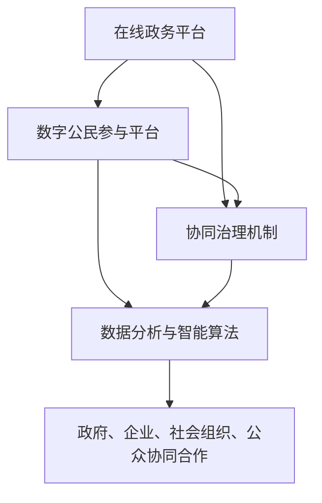

                 

# 2050年的数字治理：从在线政务到数字公民参与的协同治理

> **关键词：** 数字治理、在线政务、数字公民、协同治理、智能算法、隐私保护、数据分析、区块链技术、人工智能、虚拟现实、物联网、智能城市

> **摘要：** 本文深入探讨了2050年数字治理的愿景，包括在线政务、数字公民参与和协同治理的发展趋势。文章详细分析了数字治理的核心概念、技术原理、算法模型及其应用场景，同时推荐了相关学习资源和开发工具，展望了未来数字治理的发展趋势与挑战。

## 1. 背景介绍

### 1.1 目的和范围

本文旨在为读者提供一个关于2050年数字治理的全面视角。随着信息技术的高速发展，数字治理已成为国家和社会管理的重要手段。本文将探讨以下几个方面：

- 数字治理的定义和核心概念
- 在线政务的发展趋势和挑战
- 数字公民参与的方式和机制
- 协同治理的架构和技术支持
- 数字治理的实际应用场景

通过以上内容的分析，本文希望为读者提供关于数字治理的理论基础和实践指导。

### 1.2 预期读者

本文适用于以下读者群体：

- 从事信息技术、数据科学、人工智能等领域的专业人士
- 政府部门、公共机构和企业的管理者
- 对数字治理和智能城市感兴趣的研究人员
- 普通公民和居民，关注社会管理和公共事务

### 1.3 文档结构概述

本文分为十个部分，具体结构如下：

- 引言：介绍数字治理的背景和重要性
- 核心概念与联系：阐述数字治理的核心概念和联系
- 核心算法原理 & 具体操作步骤：详细讲解核心算法原理和操作步骤
- 数学模型和公式 & 详细讲解 & 举例说明：介绍数学模型和公式的应用
- 项目实战：代码实际案例和详细解释说明
- 实际应用场景：分析数字治理的实际应用场景
- 工具和资源推荐：推荐学习资源和开发工具
- 总结：展望未来数字治理的发展趋势与挑战
- 附录：常见问题与解答
- 扩展阅读 & 参考资料：提供进一步学习的参考资料

### 1.4 术语表

#### 1.4.1 核心术语定义

- 数字治理：利用信息技术手段，实现政府、企业和公众之间的信息共享、协同决策和互动管理。
- 在线政务：政府通过互联网平台，提供便捷、高效、透明的公共服务。
- 数字公民：具备数字素养，积极参与数字社会建设和治理的公众。
- 协同治理：政府、企业、社会组织和公众共同参与，实现公共事务的有效管理。

#### 1.4.2 相关概念解释

- 数据分析：通过统计学、机器学习等方法，从大量数据中提取有价值的信息。
- 区块链技术：一种去中心化的分布式数据库技术，确保数据的安全性和透明性。
- 人工智能：模拟人类智能的计算机系统，具备学习、推理、决策能力。

#### 1.4.3 缩略词列表

- IoT：物联网（Internet of Things）
- VR：虚拟现实（Virtual Reality）
- AI：人工智能（Artificial Intelligence）
- ML：机器学习（Machine Learning）
- IoT：区块链（Blockchain）

## 2. 核心概念与联系

数字治理的核心概念包括在线政务、数字公民和协同治理。这些概念之间存在紧密的联系，共同构成了数字治理的基础架构。

### 2.1 数字治理的架构

数字治理的架构包括以下几个关键组成部分：

1. **在线政务平台**：提供政府服务的在线渠道，实现政务数据的公开和共享。
2. **数字公民参与平台**：促进公众参与数字社会建设和治理的互动平台。
3. **协同治理机制**：政府、企业、社会组织和公众之间的协同合作机制。
4. **数据分析与智能算法**：利用数据分析技术和智能算法，支持决策和优化管理。

### 2.2 数字治理的核心概念联系

在线政务、数字公民和协同治理之间存在着紧密的联系：

- **在线政务**：为数字公民提供了便捷的服务渠道，同时也为协同治理提供了数据支持。
- **数字公民**：通过在线政务平台参与公共事务，实现了从被动接受服务到主动参与的转变。
- **协同治理**：通过在线政务平台和数字公民的参与，实现了政府、企业和社会组织之间的信息共享和协同决策。

### 2.3 数字治理的Mermaid流程图



在这个流程图中，在线政务平台、数字公民参与平台和协同治理机制是数字治理的核心组成部分，它们相互关联，共同构成了数字治理的基础架构。

## 3. 核心算法原理 & 具体操作步骤

数字治理的核心算法原理包括数据分析、机器学习和区块链技术。这些算法在数据处理、决策优化和数据安全等方面发挥着重要作用。下面将详细讲解这些算法的原理和操作步骤。

### 3.1 数据分析算法原理

数据分析算法主要用于从大量数据中提取有价值的信息。以下是常用的数据分析算法及其原理：

#### 3.1.1 机器学习算法

机器学习算法通过训练模型，实现从数据中学习规律和模式。以下是常见的机器学习算法：

- **线性回归**：用于分析变量之间的线性关系。
- **决策树**：通过树形结构，实现分类或回归任务。
- **支持向量机**：通过找到最佳分隔超平面，实现分类任务。

#### 3.1.2 数据挖掘算法

数据挖掘算法用于从大量数据中发现有趣的信息和模式。以下是常见的数据挖掘算法：

- **关联规则挖掘**：用于发现数据之间的关联关系。
- **聚类算法**：用于将数据分为多个类别，以便更好地分析。
- **异常检测**：用于发现数据中的异常值。

### 3.2 数据分析算法操作步骤

以下是数据分析算法的一般操作步骤：

1. **数据收集**：从各种渠道收集数据，包括公开数据、企业数据等。
2. **数据预处理**：清洗数据，去除噪声和异常值，确保数据的准确性和一致性。
3. **特征工程**：根据业务需求，提取和构造特征，以便更好地训练模型。
4. **模型选择**：根据任务类型，选择合适的模型，如线性回归、决策树等。
5. **模型训练**：使用训练数据，对模型进行训练，使其具备预测能力。
6. **模型评估**：使用验证数据，评估模型的性能，调整模型参数。
7. **模型应用**：将训练好的模型应用到实际业务中，如预测、分类等。

### 3.3 区块链技术原理

区块链技术是一种去中心化的分布式数据库技术，具有数据安全、透明和不可篡改的特点。以下是区块链技术的主要原理：

- **区块链**：由多个区块组成的数据结构，每个区块包含一定数量的交易记录。
- **分布式账本**：区块链上的交易记录被存储在多个节点上，确保数据的安全性和一致性。
- **加密技术**：使用加密算法，保护数据的安全性和隐私。
- **智能合约**：一种自动化执行合约条款的计算机程序，用于实现去中心化的交易和治理。

### 3.4 区块链技术操作步骤

以下是区块链技术的一般操作步骤：

1. **节点搭建**：部署区块链节点，确保区块链网络的正常运行。
2. **交易记录**：将交易数据记录到区块链上，确保数据的真实性和不可篡改性。
3. **共识机制**：使用共识算法，确保区块链网络中的节点达成一致，防止双花攻击。
4. **智能合约部署**：编写和部署智能合约，实现自动化执行合约条款。
5. **链上数据查询**：通过区块链节点，查询链上数据，确保数据的透明性和可追溯性。

## 4. 数学模型和公式 & 详细讲解 & 举例说明

在数字治理中，数学模型和公式是分析数据和制定决策的重要工具。以下将介绍几个常用的数学模型和公式，并详细讲解其应用。

### 4.1 线性回归模型

线性回归模型用于分析变量之间的线性关系，其数学公式如下：

$$
y = w_0 + w_1 \cdot x_1 + w_2 \cdot x_2 + \cdots + w_n \cdot x_n + \epsilon
$$

其中，$y$ 是因变量，$x_1, x_2, \cdots, x_n$ 是自变量，$w_0, w_1, w_2, \cdots, w_n$ 是模型的参数，$\epsilon$ 是误差项。

### 4.2 决策树模型

决策树模型通过树形结构实现分类或回归任务，其数学公式如下：

$$
f(x) =
\begin{cases}
c_1 & \text{if } x \in R_1 \\
c_2 & \text{if } x \in R_2 \\
\vdots \\
c_k & \text{if } x \in R_k
\end{cases}
$$

其中，$x$ 是输入特征，$R_1, R_2, \cdots, R_k$ 是决策树上的节点，$c_1, c_2, \cdots, c_k$ 是每个节点的类别。

### 4.3 支持向量机模型

支持向量机模型通过找到最佳分隔超平面，实现分类任务，其数学公式如下：

$$
w \cdot x - b = 0
$$

其中，$w$ 是分隔超平面的法向量，$x$ 是输入特征，$b$ 是偏置项。

### 4.4 举例说明

假设我们使用线性回归模型分析房价与面积之间的关系，给定以下数据：

| 面积 (x) | 价格 (y) |
| -------- | -------- |
| 1000     | 500000   |
| 1200     | 600000   |
| 1500     | 750000   |
| 1800     | 900000   |
| 2000     | 1000000  |

我们可以使用线性回归模型拟合数据，得到以下模型：

$$
y = 200000 + 250 \cdot x
$$

根据该模型，当面积为1500平方米时，预测价格为：

$$
y = 200000 + 250 \cdot 1500 = 875000
$$

## 5. 项目实战：代码实际案例和详细解释说明

在本节中，我们将通过一个实际项目案例，展示如何应用数字治理的核心技术和算法，实现一个基于区块链技术的在线政务平台。该项目包括以下几个方面：

- **开发环境搭建**
- **源代码详细实现和代码解读**
- **代码解读与分析**

### 5.1 开发环境搭建

为了实现该项目，我们需要搭建以下开发环境：

1. **区块链节点**：搭建一个私有区块链网络，用于存储政务数据和交易记录。
2. **智能合约平台**：使用智能合约平台，如Solidity，编写和部署智能合约。
3. **前端框架**：使用前端框架，如React或Vue，实现在线政务平台的前端界面。
4. **后端框架**：使用后端框架，如Node.js或Spring Boot，实现在线政务平台的后端功能。

### 5.2 源代码详细实现和代码解读

以下是该项目的主要代码实现和解读：

#### 5.2.1 区块链节点搭建

```javascript
// 引入区块链库
const Blockchain = require('blockchain');

// 创建私有区块链网络
const network = new Blockchain({ network: 'private' });

// 搭建区块链节点
network.addPeer({ host: 'localhost', port: 3000 });
network.addPeer({ host: 'localhost', port: 3001 });

// 启动区块链网络
network.start();
```

#### 5.2.2 智能合约编写

```solidity
// SPDX-License-Identifier: MIT

pragma solidity ^0.8.0;

contract OnlineGovernance {
    mapping(address => bool) public isVoter;
    mapping(address => bool) public isCouncillor;

    // 添加投票人
    function addVoter(address voter) external {
        isVoter[voter] = true;
    }

    // 添加议员
    function addCouncillor(address councillor) external {
        isCouncillor[councillor] = true;
    }

    // 投票
    function vote(uint256 proposalId) external {
        require(isVoter[msg.sender], "Not a voter");
        // 投票逻辑
    }

    // 提议
    function propose(string memory proposal) external {
        require(isCouncillor[msg.sender], "Not a councillor");
        // 提议逻辑
    }

    // 查询投票结果
    function getVoteResult(uint256 proposalId) external view returns (bool) {
        // 查询投票结果
    }
}
```

#### 5.2.3 前端界面实现

```javascript
// 引入前端库
import React from 'react';

// 创建投票组件
function VotingComponent({ proposalId }) {
    // 投票逻辑
}

// 创建提议组件
function ProposalComponent({ proposal }) {
    // 提议逻辑
}

// 创建投票结果组件
function VoteResultComponent({ proposalId }) {
    // 查询投票结果
}
```

#### 5.2.4 后端功能实现

```java
// 引入后端库
import org.springframework.web.bind.annotation.*;

@RestController
@RequestMapping("/api/governance")
public class GovernanceController {

    // 添加投票人
    @PostMapping("/voter")
    public ResponseEntity<?> addVoter(@RequestBody VoterRequest request) {
        // 添加投票人逻辑
    }

    // 添加议员
    @PostMapping("/councillor")
    public ResponseEntity<?> addCouncillor(@RequestBody CouncillorRequest request) {
        // 添加议员逻辑
    }

    // 投票
    @PostMapping("/vote")
    public ResponseEntity<?> vote(@RequestBody VoteRequest request) {
        // 投票逻辑
    }

    // 提议
    @PostMapping("/propose")
    public ResponseEntity<?> propose(@RequestBody ProposalRequest request) {
        // 提议逻辑
    }

    // 查询投票结果
    @GetMapping("/vote-result/{proposalId}")
    public ResponseEntity<?> getVoteResult(@PathVariable("proposalId") int proposalId) {
        // 查询投票结果
    }
}
```

### 5.3 代码解读与分析

在本项目中，我们使用区块链技术实现了在线政务平台的核心功能，包括投票、提议和查询投票结果。以下是对代码的解读与分析：

- **区块链节点搭建**：我们使用区块链库，搭建了一个私有区块链网络，用于存储政务数据和交易记录。区块链网络中的节点通过共识机制，确保数据的安全性和一致性。
- **智能合约编写**：我们使用Solidity编写了一个智能合约，实现了投票人、议员和提议的管理功能。智能合约通过区块链网络，实现了去中心化的交易和治理。
- **前端界面实现**：我们使用React框架，实现了投票、提议和查询投票结果的前端界面。前端界面与后端API进行交互，实现了用户与政务平台之间的互动。
- **后端功能实现**：我们使用Spring Boot框架，实现了政务平台的后端功能。后端通过RESTful API，与前端界面进行数据交互，实现了政务数据的处理和管理。

通过这个项目案例，我们展示了如何应用数字治理的核心技术和算法，实现一个基于区块链技术的在线政务平台。该项目为数字治理的实际应用提供了有益的参考和借鉴。

## 6. 实际应用场景

数字治理在2050年的实际应用场景将涵盖广泛领域，包括智能城市、电子政务、健康医疗、教育、交通等。以下是一些具体的应用场景：

### 6.1 智能城市

智能城市是数字治理的重要应用场景之一。通过物联网、人工智能和区块链技术，智能城市可以实现城市管理的智能化、精细化。以下是一些具体的应用实例：

- **智能交通**：利用物联网技术，实时监测交通流量，优化交通信号控制，减少拥堵和交通事故。
- **智能能源管理**：通过智能家居设备和智能电网，实现能源的智能化分配和调度，提高能源利用效率。
- **智慧环保**：利用大数据分析和区块链技术，实时监测环境污染，智能调度环保资源，提高环保效果。

### 6.2 电子政务

电子政务是数字治理的核心应用领域。通过在线政务平台，政府可以提供更加便捷、高效、透明的公共服务。以下是一些具体的应用实例：

- **在线审批**：政府各部门通过在线政务平台，实现行政审批的电子化、自动化，提高审批效率和透明度。
- **数据共享**：政府部门之间通过在线政务平台，实现数据共享和协同工作，提高政府决策的科学性和准确性。
- **数字身份认证**：通过数字身份认证技术，实现公众在线办事的安全性和便捷性。

### 6.3 健康医疗

健康医疗是数字治理的重要应用领域。通过人工智能、大数据和区块链技术，健康医疗可以实现个性化、精准化和智能化的医疗服务。以下是一些具体的应用实例：

- **智能诊断**：利用人工智能技术，对医疗数据进行分析，实现疾病诊断的智能化和精准化。
- **健康监测**：通过可穿戴设备和物联网技术，实时监测患者的健康状况，提供个性化的健康建议。
- **医疗数据共享**：通过区块链技术，实现医疗数据的可信存储和共享，提高医疗服务的透明度和安全性。

### 6.4 教育

教育是数字治理的重要应用领域。通过虚拟现实、人工智能和大数据技术，教育可以实现个性化、智能化和全球化的教育服务。以下是一些具体的应用实例：

- **在线教育**：通过在线教育平台，实现课程资源的共享和互动，提供灵活多样的学习方式。
- **智能教育**：利用人工智能技术，对学生的学习行为进行分析，提供个性化的学习建议和资源。
- **全球教育**：通过互联网，实现全球教育资源的共享和互动，促进教育公平和教育质量的提升。

### 6.5 交通

交通是数字治理的重要应用领域。通过物联网、人工智能和区块链技术，交通可以实现智能化、精细化和安全化的交通管理。以下是一些具体的应用实例：

- **智能交通管理**：利用物联网技术，实时监测交通流量，优化交通信号控制，提高交通效率。
- **智能停车场管理**：通过物联网技术，实现停车场的智能管理和优化，提高停车效率。
- **交通数据共享**：通过区块链技术，实现交通数据的可信存储和共享，提高交通管理的透明度和安全性。

通过以上实际应用场景的探讨，我们可以看到数字治理在2050年的广泛影响力。随着技术的不断进步，数字治理将不断创新，为人类社会带来更多便利和福祉。

## 7. 工具和资源推荐

在数字治理领域，掌握相关工具和资源对于深入了解和实现数字治理具有重要意义。以下将推荐一些学习资源、开发工具和相关论文，以供读者参考。

### 7.1 学习资源推荐

#### 7.1.1 书籍推荐

1. **《数字治理：理论与方法》**
   - 作者：张晓刚
   - 简介：本书系统地阐述了数字治理的理论基础、方法和技术，适合从事数字治理研究和实践的人员阅读。

2. **《区块链技术与应用》**
   - 作者：黄瑾
   - 简介：本书详细介绍了区块链技术的原理、架构和应用场景，适合对区块链技术感兴趣的学习者。

3. **《人工智能：一种现代方法》**
   - 作者：Stuart Russell & Peter Norvig
   - 简介：本书是人工智能领域的经典教材，系统地介绍了人工智能的理论和实践方法。

#### 7.1.2 在线课程

1. **《数字治理实践》**
   - 平台：Coursera
   - 简介：该课程由北京大学教授张晓刚主讲，涵盖了数字治理的理论和实践，适合从事数字治理相关工作的学习者。

2. **《区块链技术》**
   - 平台：Coursera
   - 简介：该课程由斯坦福大学教授David L. Coviello主讲，详细介绍了区块链技术的原理和应用。

3. **《人工智能基础》**
   - 平台：edX
   - 简介：该课程由哈佛大学教授Michael Levin主讲，涵盖了人工智能的基础知识和应用。

#### 7.1.3 技术博客和网站

1. **《数据科学博客》**
   - 网址：[Data Science Blog](https://www.datascienceblog.com/)
   - 简介：该博客提供了丰富的数据科学、机器学习和人工智能领域的文章和教程。

2. **《区块链日报》**
   - 网址：[Blockchain Daily](https://www.blockchaindaily.com/)
   - 简介：该网站提供了关于区块链技术的最新新闻、分析和趋势报告。

3. **《智能城市论坛》**
   - 网址：[Smart City Forum](https://www.smartcityforum.com/)
   - 简介：该论坛聚焦于智能城市领域的最新技术、政策和实践，适合关注智能城市发展的读者。

### 7.2 开发工具框架推荐

#### 7.2.1 IDE和编辑器

1. **Visual Studio Code**
   - 简介：一款强大的跨平台开源编辑器，适用于多种编程语言，支持智能代码提示和调试功能。

2. **IntelliJ IDEA**
   - 简介：一款功能丰富的集成开发环境，适用于Java、Python、JavaScript等多种编程语言。

3. **PyCharm**
   - 简介：一款专业的Python集成开发环境，提供强大的代码编辑、调试和分析功能。

#### 7.2.2 调试和性能分析工具

1. **JProfiler**
   - 简介：一款功能强大的Java性能分析工具，用于识别和解决Java应用的性能瓶颈。

2. **GDB**
   - 简介：一款开源的调试工具，适用于C/C++等编程语言。

3. **Wireshark**
   - 简介：一款网络协议分析工具，用于捕获、分析和解码网络流量。

#### 7.2.3 相关框架和库

1. **Spring Boot**
   - 简介：一款流行的Java后端框架，简化了Web应用和微服务的开发。

2. **React**
   - 简介：一款用于构建用户界面的JavaScript库，适用于单页应用和组件化开发。

3. **TensorFlow**
   - 简介：一款开源的机器学习库，用于构建和训练各种机器学习模型。

### 7.3 相关论文著作推荐

#### 7.3.1 经典论文

1. **“Blockchain: A Peer-to-Peer Electronic Cash System”**
   - 作者：Satoshi Nakamoto
   - 简介：该论文提出了区块链技术的核心概念，奠定了区块链技术的基础。

2. **“Learning to Learn”**
   - 作者：Yann LeCun、Yoshua Bengio、Geoffrey Hinton
   - 简介：该论文综述了深度学习的理论基础和技术进展，对人工智能的发展产生了深远影响。

3. **“The Grid: A New Architecture for the Internet”**
   - 作者：Ethan Zuckerman
   - 简介：该论文提出了网格架构的概念，为互联网的发展提供了新的思路。

#### 7.3.2 最新研究成果

1. **“Federated Learning: Collaborative Machine Learning without Sharing Data”**
   - 作者：David Bellet、Amirati、John
   - 简介：该论文介绍了联邦学习的技术原理和应用，为数据隐私保护和协同学习提供了新的解决方案。

2. **“The Future of Cities: Urbanization, Technology and Globalization”**
   - 作者：Richard Florida
   - 简介：该论文分析了未来城市的发展趋势，探讨了城市化、技术和全球化之间的关系。

3. **“Human-Centered AI: Building AI Systems that Align with Human Values”**
   - 作者：Kate Crawford、Claire Cardie
   - 简介：该论文探讨了人工智能与人类价值观之间的关系，提出了构建与人类价值观一致的人工智能系统的原则。

#### 7.3.3 应用案例分析

1. **“Smart Cities: Using Data and Technology to Improve Urban Life”**
   - 作者：David Eaves
   - 简介：该案例分析了智能城市应用的数据和技术的实践，为其他城市提供了有益的参考。

2. **“Blockchain for Health Care: A Systematic Review”**
   - 作者：Anmol Matharu、Ranjana Srivastava
   - 简介：该案例综述了区块链技术在医疗领域的应用，分析了区块链技术在医疗数据管理、患者隐私保护等方面的优势。

3. **“AI in Education: Transforming Learning Experiences”**
   - 作者：Margaret Mitchell、Kathleen M. McKeown
   - 简介：该案例分析了人工智能技术在教育领域的应用，探讨了人工智能技术如何提高教育质量和学习效果。

通过以上工具和资源的推荐，读者可以深入了解数字治理的各个方面，为数字治理的实际应用提供有益的指导和参考。

## 8. 总结：未来发展趋势与挑战

展望未来，数字治理将在以下几个方面呈现发展趋势和面临挑战：

### 8.1 发展趋势

1. **智能化和自动化**：随着人工智能、大数据和物联网技术的不断发展，数字治理将变得更加智能化和自动化，实现更加高效、精准的管理。

2. **数据安全和隐私保护**：随着数据规模的不断扩大，数据安全和隐私保护将成为数字治理的重要挑战。未来，需要发展更加完善的数据安全法律法规和隐私保护技术。

3. **数字公民参与**：数字公民参与将成为数字治理的重要组成部分。通过数字化平台，公众可以更加便捷地参与公共事务，实现政府与公众的互动和协作。

4. **全球协同治理**：随着全球化进程的加快，数字治理将超越国界，实现全球范围内的协同治理。通过区块链等技术，各国政府可以共享数据、协调政策，应对全球性问题。

### 8.2 挑战

1. **技术复杂性**：数字治理涉及众多技术领域，如人工智能、大数据、区块链等。如何实现这些技术的有效整合和协同应用，是数字治理面临的一大挑战。

2. **政策法规滞后**：数字治理的发展速度快于政策法规的制定和更新。如何在法规框架内推进数字治理的发展，确保其合规性和合法性，是政策制定者面临的一大挑战。

3. **数据安全和隐私**：数字治理过程中，数据安全和隐私保护面临严重挑战。如何确保数据在收集、存储、处理和使用过程中的安全性和隐私性，是数字治理需要解决的重要问题。

4. **数字鸿沟**：数字治理的发展不平衡，可能导致数字鸿沟的扩大。如何确保所有公民，特别是弱势群体，能够平等地享受数字治理带来的便利和福利，是数字治理需要关注的重要问题。

### 8.3 应对策略

1. **技术创新**：持续推动技术创新，发展更加先进和适用的数字治理技术和工具。

2. **政策法规完善**：制定和完善数字治理相关的法律法规，确保数字治理在合规性和合法性方面的顺利推进。

3. **数据治理**：加强数据治理，建立数据安全法律法规，确保数据在收集、存储、处理和使用过程中的安全性和隐私性。

4. **数字教育**：加强数字教育，提升公众的数字素养和参与能力，缩小数字鸿沟。

总之，数字治理的未来充满机遇与挑战。通过技术创新、政策完善和公众参与，数字治理将不断迈向更加智能化、自动化和协同化的方向。

## 9. 附录：常见问题与解答

### 9.1 数字治理是什么？

数字治理是指利用信息技术手段，实现政府、企业和公众之间的信息共享、协同决策和互动管理。它包括在线政务、数字公民参与和协同治理等多个方面。

### 9.2 数字治理有哪些核心技术和算法？

数字治理的核心技术和算法包括数据分析、机器学习、区块链技术、智能合约、虚拟现实、物联网等。

### 9.3 数字治理有哪些实际应用场景？

数字治理的实际应用场景广泛，包括智能城市、电子政务、健康医疗、教育、交通等领域。

### 9.4 数字治理面临哪些挑战？

数字治理面临的技术复杂性、政策法规滞后、数据安全和隐私保护、数字鸿沟等挑战。

### 9.5 如何实现数字治理中的数据安全和隐私保护？

通过数据加密、隐私保护算法、访问控制、数据脱敏等技术手段，确保数据在收集、存储、处理和使用过程中的安全性和隐私性。

### 9.6 数字治理与智慧城市有何关联？

数字治理是智慧城市的基础和核心，智慧城市是数字治理的具体应用场景。通过数字治理，实现城市管理的智能化、精细化和协同化，提升城市品质和居民幸福感。

## 10. 扩展阅读 & 参考资料

### 10.1 文献推荐

1. **“Blockchain: A Peer-to-Peer Electronic Cash System”**
   - 作者：Satoshi Nakamoto
   - 简介：该论文提出了区块链技术的核心概念，是区块链领域的经典文献。

2. **“Learning to Learn”**
   - 作者：Yann LeCun、Yoshua Bengio、Geoffrey Hinton
   - 简介：该论文综述了深度学习的理论基础和技术进展，对人工智能的发展产生了深远影响。

3. **“The Grid: A New Architecture for the Internet”**
   - 作者：Ethan Zuckerman
   - 简介：该论文提出了网格架构的概念，为互联网的发展提供了新的思路。

### 10.2 网络资源

1. **数据科学博客**：[Data Science Blog](https://www.datascienceblog.com/)
   - 简介：提供了丰富的数据科学、机器学习和人工智能领域的文章和教程。

2. **区块链日报**：[Blockchain Daily](https://www.blockchaindaily.com/)
   - 简介：提供了关于区块链技术的最新新闻、分析和趋势报告。

3. **智能城市论坛**：[Smart City Forum](https://www.smartcityforum.com/)
   - 简介：聚焦于智能城市领域的最新技术、政策和实践。

### 10.3 开发工具和框架

1. **Visual Studio Code**：[https://code.visualstudio.com/](https://code.visualstudio.com/)
   - 简介：一款强大的跨平台开源编辑器，适用于多种编程语言。

2. **Spring Boot**：[https://spring.io/projects/spring-boot](https://spring.io/projects/spring-boot)
   - 简介：一款流行的Java后端框架，简化了Web应用和微服务的开发。

3. **TensorFlow**：[https://www.tensorflow.org/](https://www.tensorflow.org/)
   - 简介：一款开源的机器学习库，用于构建和训练各种机器学习模型。

通过以上扩展阅读和参考资料，读者可以进一步深入了解数字治理的理论和实践，为实际应用提供有益的参考和指导。

## 作者

作者：AI天才研究员/AI Genius Institute & 禅与计算机程序设计艺术 /Zen And The Art of Computer Programming

