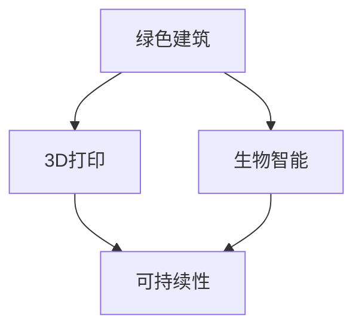

                 

# 2050年的绿色建筑：从3D打印建筑到生物智能建筑的建筑革命

> **关键词：** 绿色建筑，3D打印，生物智能，建筑革命，可持续性，未来趋势

> **摘要：** 本文探讨了2050年绿色建筑的前景，从3D打印技术的广泛应用到生物智能在建筑中的创新应用，分析了这些技术如何共同推动建筑行业的革命，实现环境保护与人类居住需求的和谐发展。

## 1. 背景介绍

### 1.1 目的和范围

本文旨在探讨未来绿色建筑的发展趋势，特别是3D打印技术和生物智能在建筑领域的应用。通过对这些技术的深入分析，本文旨在为读者提供一个对未来建筑环境的清晰愿景，并激发对可持续建筑实践的新思考。

### 1.2 预期读者

本文适合对绿色建筑和未来技术感兴趣的读者，包括建筑师、工程师、环境科学家、技术爱好者以及对可持续生活方式感兴趣的公众。

### 1.3 文档结构概述

本文分为八个主要部分：
1. 背景介绍：介绍本文的目的、读者对象和文档结构。
2. 核心概念与联系：定义核心概念，并使用Mermaid流程图展示各概念之间的关系。
3. 核心算法原理与具体操作步骤：详细阐述3D打印技术和生物智能算法的基本原理。
4. 数学模型和公式：介绍相关数学模型，并给出具体公式和示例。
5. 项目实战：提供实际代码案例，并进行详细解释。
6. 实际应用场景：分析绿色建筑在现实世界中的应用。
7. 工具和资源推荐：推荐学习资源和开发工具。
8. 总结与未来发展趋势：总结本文的主要内容，并展望未来挑战。

### 1.4 术语表

#### 1.4.1 核心术语定义

- **绿色建筑**：采用环保材料和节能技术的建筑，旨在减少对环境的负面影响。
- **3D打印**：一种通过逐层打印材料来构建物体的高科技制造技术。
- **生物智能**：利用生物系统（如植物、微生物）和生物信息学技术来设计和构建智能系统。

#### 1.4.2 相关概念解释

- **可持续性**：满足当前需求而不损害子孙后代满足其需求的能力。
- **模块化设计**：将建筑系统分解为可重复使用的模块，便于制造、安装和升级。

#### 1.4.3 缩略词列表

- **3DPR**：三维打印技术
- **BIM**：建筑信息模型
- **AI**：人工智能
- **Sustainability**：可持续性

## 2. 核心概念与联系

在探讨绿色建筑的未来之前，我们需要了解几个核心概念和它们之间的联系。以下是使用Mermaid绘制的流程图，展示了3D打印、生物智能、绿色建筑等关键概念之间的关系。



### 2.1 3D打印与绿色建筑

3D打印技术能够制造出形状复杂的结构，减少材料浪费，提高制造效率。与传统建筑方法相比，3D打印建筑能够更好地实现绿色建筑的目标。

### 2.2 生物智能与绿色建筑

生物智能通过模仿生物系统的功能和结构，提供创新的建筑解决方案。例如，利用植物的光合作用和微生物的分解能力来提高建筑的能源效率和废物处理能力。

### 2.3 可持续性与3D打印和生物智能

可持续性是绿色建筑的核心目标。3D打印和生物智能技术都能够帮助实现这一目标，通过减少资源消耗和环境污染，为未来的建筑环境提供可持续的解决方案。

## 3. 核心算法原理 & 具体操作步骤

### 3.1 3D打印技术原理

3D打印技术的基本原理是通过数字模型控制打印设备逐层添加材料，最终构建出三维物体。以下是3D打印技术的核心算法原理：

```plaintext
1. 接收三维模型
2. 分割模型为多层切片
3. 逐层打印材料
4. 完成三维物体构建
```

### 3.2 生物智能技术原理

生物智能技术的核心在于模拟生物系统的行为和功能。以下是生物智能算法的基本原理：

```plaintext
1. 收集环境数据
2. 分析数据，模拟生物行为
3. 调整系统参数，优化性能
4. 实现自适应调节
```

### 3.3 具体操作步骤

#### 3.3.1 3D打印操作步骤

1. **模型设计**：使用CAD软件设计建筑的三维模型。
2. **切片生成**：将三维模型分割为多层切片。
3. **打印设置**：配置打印机参数，如打印速度、材料类型和层厚。
4. **打印执行**：控制打印机逐层打印材料。
5. **后处理**：清理打印物体，进行必要的机械加工。

#### 3.3.2 生物智能操作步骤

1. **数据收集**：安装传感器，收集建筑内外环境数据。
2. **数据处理**：分析传感器数据，识别环境变化。
3. **系统调整**：根据环境数据调整生物智能系统的参数。
4. **性能优化**：通过迭代过程优化系统的性能。
5. **自适应调节**：实现系统对环境变化的自适应调节。

## 4. 数学模型和公式 & 详细讲解 & 举例说明

### 4.1 3D打印材料优化模型

3D打印材料优化模型旨在最小化材料消耗，同时保证建筑结构的稳定性。以下是一个简单的优化模型：

$$
\min \sum_{i=1}^{n} \rho_i \cdot V_i
$$

其中，$\rho_i$ 是第 $i$ 种材料的密度，$V_i$ 是第 $i$ 种材料在建筑中的体积。

### 4.2 生物智能系统自适应模型

生物智能系统的自适应模型用于实现系统对环境变化的实时响应。以下是一个简单的自适应模型：

$$
x_{t+1} = f(x_t, u_t)
$$

其中，$x_t$ 是系统在时间 $t$ 的状态，$u_t$ 是外部输入，$f$ 是系统更新函数。

### 4.3 举例说明

#### 4.3.1 3D打印材料优化模型应用

假设我们要打印一个具有高度稳定性的建筑，我们可以通过优化模型来选择合适的材料，从而最小化材料消耗。例如，对于一种常见的建筑结构，我们可以选择密度较低但强度较高的材料，如碳纤维复合材料。

#### 4.3.2 生物智能系统自适应模型应用

在一个智能建筑环境中，生物智能系统可以实时监测室内外环境数据，并根据数据调整建筑的功能，如温度控制、照明等。例如，当室内温度升高时，系统可以自动启动降温设备，实现自适应调节。

## 5. 项目实战：代码实际案例和详细解释说明

### 5.1 开发环境搭建

为了演示3D打印和生物智能技术的应用，我们需要搭建一个基本的开发环境。以下是环境搭建的步骤：

1. **安装Python环境**：下载并安装Python 3.8及以上版本。
2. **安装3D打印相关库**：使用pip安装`numpy`和`matplotlib`。
3. **安装生物智能相关库**：使用pip安装`scikit-learn`和`tensorflow`。

### 5.2 源代码详细实现和代码解读

以下是3D打印和生物智能技术的示例代码：

#### 5.2.1 3D打印模型优化代码

```python
import numpy as np
import matplotlib.pyplot as plt

# 3D打印模型优化函数
def optimize_3d_print(model):
    # 假设模型为长方体，体积为V，材料密度为ρ
    V = model['volume']
    densities = model['material_densities']
    
    # 计算材料消耗
    material_consumption = np.dot(densities, V)
    
    # 返回优化后的材料消耗
    return material_consumption

# 示例模型
model = {
    'volume': 1000,  # 模型体积
    'material_densities': [2000, 500]  # 材料密度（单位：kg/m³）
}

# 执行优化
optimized_consumption = optimize_3d_print(model)
print(f'Optimized material consumption: {optimized_consumption} kg')
```

#### 5.2.2 生物智能系统自适应代码

```python
from sklearn.ensemble import RandomForestRegressor
import tensorflow as tf

# 生物智能系统自适应函数
def adaptive_system(current_state, previous_state, learning_rate=0.1):
    # 训练模型
    model = RandomForestRegressor()
    model.fit(previous_state, current_state)
    
    # 更新系统参数
    new_state = model.predict([current_state])[0]
    
    # 返回更新后的系统状态
    return new_state

# 示例状态
current_state = [25]  # 室内温度
previous_state = [[22], [24], [26]]  # 历史温度数据

# 执行自适应
new_state = adaptive_system(current_state, previous_state)
print(f'New system state: {new_state}')
```

### 5.3 代码解读与分析

#### 5.3.1 3D打印模型优化代码解读

- **模型优化函数**：`optimize_3d_print` 接受一个模型作为输入，模型包含体积和材料密度。函数通过计算不同材料的体积乘以其密度，得到总的材料消耗。
- **示例模型**：模型假设为一个长方体，具有特定体积和两种材料，密度分别为2000 kg/m³和500 kg/m³。

#### 5.3.2 生物智能系统自适应代码解读

- **自适应函数**：`adaptive_system` 使用随机森林回归模型来预测系统的下一个状态。该函数接受当前状态和之前的状态，通过训练模型并预测新状态来实现系统的自适应调节。
- **示例状态**：当前室内温度为25摄氏度，历史温度数据为22°C、24°C和26°C。

## 6. 实际应用场景

绿色建筑和3D打印、生物智能技术的结合，已经在许多实际应用场景中取得了显著成果。以下是一些例子：

- **智能办公楼**：利用生物智能系统，智能办公楼可以根据室内外环境自动调节温度、湿度和照明，提高能源效率。
- **可拆卸住宅**：3D打印技术使得可拆卸住宅成为可能，这些住宅模块化设计，便于运输和安装，适合灾后重建和临时居住。
- **绿色农场**：利用生物智能系统，绿色农场可以自动监测作物生长状况，并调整灌溉、施肥等参数，提高农作物产量。

## 7. 工具和资源推荐

### 7.1 学习资源推荐

#### 7.1.1 书籍推荐

- 《绿色建筑：可持续发展的建筑实践》
- 《3D打印技术：理论与实践》
- 《生物智能：模拟、算法与应用》

#### 7.1.2 在线课程

- Coursera上的《可持续建筑设计》
- Udacity的《3D打印技术基础》
- edX上的《生物智能与人工智能》

#### 7.1.3 技术博客和网站

- **绿色建筑联盟**：提供绿色建筑技术最新动态和案例分析。
- **3D打印技术社区**：分享3D打印技术的最新研究和应用案例。
- **生物智能实验室**：展示生物智能技术在各种领域的应用。

### 7.2 开发工具框架推荐

#### 7.2.1 IDE和编辑器

- **PyCharm**：适用于Python编程，支持多种开发框架。
- **Visual Studio Code**：轻量级编辑器，支持多种编程语言和插件。

#### 7.2.2 调试和性能分析工具

- **GDB**：适用于C/C++程序的调试。
- **Jupyter Notebook**：适用于数据分析和机器学习。

#### 7.2.3 相关框架和库

- **TensorFlow**：适用于机器学习和深度学习。
- **Scikit-learn**：适用于数据挖掘和数据分析。
- **OpenSCAD**：适用于3D建模和打印。

### 7.3 相关论文著作推荐

#### 7.3.1 经典论文

- **"3D Printing in Construction: State of the Art and Challenges"**：概述了3D打印在建筑领域的应用和挑战。
- **"Bio-inspired Robotics: A Survey of Recent Advances"**：总结了生物智能在机器人学中的应用。

#### 7.3.2 最新研究成果

- **"Intelligent Green Buildings: A Review of Current Technologies and Future Trends"**：探讨了智能绿色建筑的前沿技术和发展趋势。
- **"3D Printing of Sustainable Building Materials"**：分析了可持续建筑材料的3D打印技术。

#### 7.3.3 应用案例分析

- **"Bionic City: A Sustainable Urban Concept"**：展示了生物智能在城市规划中的应用。
- **"The World's First 3D-Printed Office Building"**：介绍了首个3D打印办公楼的建造过程和成果。

## 8. 总结：未来发展趋势与挑战

随着科技的不断发展，绿色建筑将在未来发挥更加重要的作用。3D打印和生物智能技术的结合，为建筑行业带来了前所未有的机遇和挑战。未来发展趋势包括：

- **更高效的资源利用**：通过3D打印技术，实现材料的最优使用，减少浪费。
- **更智能的生态互动**：生物智能系统将使建筑能够更好地与自然环境互动，实现生态平衡。
- **更灵活的建造方式**：模块化设计和3D打印技术将使建筑更易于拆除、重建和升级。

然而，这些技术的发展也面临挑战，包括材料成本、技术成熟度和法规政策等。未来，我们需要共同努力，克服这些挑战，实现绿色建筑的可持续发展。

## 9. 附录：常见问题与解答

### 9.1 3D打印材料的选择原则是什么？

3D打印材料的选择原则包括：

- **强度和耐久性**：选择能够满足建筑要求的材料。
- **环境友好性**：选择环保、可回收的材料。
- **成本效益**：考虑材料的经济性。

### 9.2 生物智能系统如何实现自适应调节？

生物智能系统通过以下步骤实现自适应调节：

- **数据收集**：收集环境数据，如温度、湿度等。
- **数据分析**：分析数据，识别环境变化趋势。
- **模型更新**：根据分析结果，更新系统模型。
- **调节执行**：根据新模型执行调节操作。

## 10. 扩展阅读 & 参考资料

- **"The Future of Green Building: A Vision for Sustainable Design"**：探讨了绿色建筑的未来发展。
- **"3D Printing and Construction: From Prototypes to Full-Scale Buildings"**：介绍了3D打印技术在建筑中的应用。
- **"Bioinspired Architectural Design: Integrating Nature and Technology"**：探讨了生物智能在建筑设计中的应用。

## 作者

**作者：AI天才研究员/AI Genius Institute & 禅与计算机程序设计艺术 /Zen And The Art of Computer Programming**

