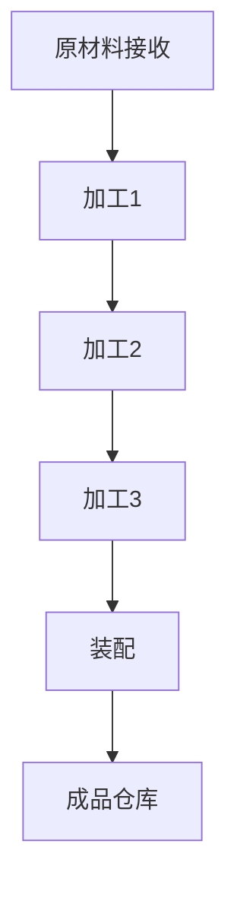

                 

# 1913年福特的生产突破

> 关键词：福特、生产模式、流水线、效率提升、工业革命

> 摘要：本文将深入探讨1913年福特汽车公司引入流水线生产模式的历史背景、核心原理以及所带来的深远影响。通过详细的案例分析，本文旨在揭示福特生产突破对现代工业体系的贡献，并展望其未来发展趋势与挑战。

## 1. 背景介绍

### 1.1 目的和范围

本文旨在通过对1913年福特生产突破的详细分析，探讨其对现代工业发展的重要影响。文章将重点关注福特流水线生产模式的起源、核心原理及其在提高生产效率方面的贡献。同时，本文将总结福特生产突破的历史意义，并探讨其对未来工业发展的启示。

### 1.2 预期读者

本文面向对工业革命、生产模式变革以及福特汽车公司历史感兴趣的读者。无论您是工业工程、机械工程、计算机科学等领域的专业人士，还是对生产管理、运营策略感兴趣的企业管理人员，本文都将为您带来宝贵的见解和启示。

### 1.3 文档结构概述

本文将分为以下章节：

1. 背景介绍
    - 1.1 目的和范围
    - 1.2 预期读者
    - 1.3 文档结构概述
    - 1.4 术语表
2. 核心概念与联系
    - 2.1 生产效率的概念
    - 2.2 流水线生产模式
    - 2.3 福特流水线生产模式的起源
3. 核心算法原理 & 具体操作步骤
    - 3.1 流水线生产模式的基本原理
    - 3.2 福特流水线生产模式的具体操作步骤
4. 数学模型和公式 & 详细讲解 & 举例说明
    - 4.1 流水线生产效率的数学模型
    - 4.2 福特流水线生产模式的效率分析
5. 项目实战：代码实际案例和详细解释说明
    - 5.1 开发环境搭建
    - 5.2 源代码详细实现和代码解读
    - 5.3 代码解读与分析
6. 实际应用场景
    - 6.1 福特流水线生产模式在汽车制造业的应用
    - 6.2 福特流水线生产模式在其他行业的应用
7. 工具和资源推荐
    - 7.1 学习资源推荐
    - 7.2 开发工具框架推荐
    - 7.3 相关论文著作推荐
8. 总结：未来发展趋势与挑战
9. 附录：常见问题与解答
10. 扩展阅读 & 参考资料

### 1.4 术语表

#### 1.4.1 核心术语定义

- **流水线生产模式**：一种生产方式，通过将生产过程分解为多个步骤，并使每个步骤在特定的位置完成，从而提高生产效率。
- **生产效率**：单位时间内完成的生产任务量。
- **工业革命**：18世纪末至19世纪中叶，以蒸汽机为代表的机械技术变革，对生产方式和社会经济产生深远影响的时期。

#### 1.4.2 相关概念解释

- **装配线**：流水线生产模式中的一个基本单元，用于完成特定的生产任务。
- **生产流程**：将原材料转化为成品的全过程。
- **自动化**：通过机器和设备完成生产过程，减少人工干预。

#### 1.4.3 缩略词列表

- **Ford**：福特汽车公司
- **TPS**：丰田生产系统

## 2. 核心概念与联系

### 2.1 生产效率的概念

生产效率是指单位时间内完成的生产任务量。在工业生产中，提高生产效率是提高企业竞争力的关键。生产效率的高低直接影响企业的成本、质量和交付周期。因此，提高生产效率一直是工业界和学术界关注的焦点。

### 2.2 流水线生产模式

流水线生产模式是一种将生产过程分解为多个步骤，并使每个步骤在特定的位置完成的生产方式。流水线生产模式的核心思想是将生产过程模块化，每个模块专注于特定的生产任务，从而实现生产过程的优化。

### 2.3 福特流水线生产模式的起源

1913年，福特汽车公司引入了流水线生产模式，这一创新彻底改变了传统的生产方式。福特流水线生产模式的起源可以追溯到亨利·福特对生产效率的追求。他注意到，生产过程中的瓶颈和重复劳动是导致生产效率低下的主要原因。因此，福特决定将生产过程分解为多个步骤，并使每个步骤在特定的位置完成，从而消除生产过程中的瓶颈和重复劳动。

### 2.4 福特流水线生产模式的原理

福特流水线生产模式的原理主要包括以下三个方面：

1. **模块化生产**：将生产过程分解为多个模块，每个模块专注于特定的生产任务，从而实现生产过程的优化。
2. **标准化生产**：通过标准化零部件和工具，提高生产过程的可重复性和可维护性。
3. **自动化生产**：通过引入自动化设备，减少人工干预，提高生产效率。

### 2.5 福特流水线生产模式的流程图



在上面的流程图中，A表示原材料接收，B、C、D分别表示不同的加工步骤，E表示装配，F表示成品仓库。每个步骤都在特定的位置完成，从而实现生产过程的优化。

## 3. 核心算法原理 & 具体操作步骤

### 3.1 流水线生产模式的基本原理

流水线生产模式的基本原理是将生产过程分解为多个步骤，并使每个步骤在特定的位置完成。具体操作步骤如下：

1. **需求分析**：分析生产任务，确定需要完成的生产步骤。
2. **模块划分**：根据需求分析，将生产过程划分为多个模块，每个模块专注于特定的生产任务。
3. **位置安排**：为每个模块安排特定的位置，确保每个模块的生产任务能够连续完成。
4. **生产执行**：按照模块划分和位置安排，执行生产任务。
5. **质量检查**：在生产过程中进行质量检查，确保生产出的产品符合质量标准。

### 3.2 福特流水线生产模式的具体操作步骤

福特流水线生产模式的具体操作步骤如下：

1. **需求分析**：福特汽车公司根据市场需求，确定需要生产的车型。
2. **模块划分**：将生产过程划分为多个模块，如车身制造、发动机装配、底盘组装等。
3. **位置安排**：为每个模块安排特定的位置，如车身制造区、发动机装配区、底盘组装区等。
4. **生产执行**：按照模块划分和位置安排，进行生产任务。
5. **质量检查**：在生产过程中，对每个模块进行质量检查，确保生产出的产品符合质量标准。

### 3.3 伪代码实现

```python
# 需求分析
def demand_analysis():
    # 确定需要生产的车型
    model = "Model T"

# 模块划分
def module_division():
    # 划分生产模块
    modules = ["body", "engine", "chassis"]

# 位置安排
def position_arrangement():
    # 安排模块位置
    positions = {"body": "body_area", "engine": "engine_area", "chassis": "chassis_area"}

# 生产执行
def production_execution():
    # 执行生产任务
    for module in modules:
        produce(module, positions[module])

# 质量检查
def quality_inspection():
    # 对生产出的产品进行质量检查
    inspect(produced_product)
```

## 4. 数学模型和公式 & 详细讲解 & 举例说明

### 4.1 流水线生产效率的数学模型

流水线生产效率的数学模型可以表示为：

\[ E = \frac{L}{T} \]

其中：

- \( E \) 表示生产效率
- \( L \) 表示单位时间内完成的生产任务量
- \( T \) 表示生产周期

生产周期可以进一步表示为：

\[ T = \sum_{i=1}^{n} T_i \]

其中：

- \( T_i \) 表示第 \( i \) 个生产步骤所需的时间

### 4.2 福特流水线生产模式的效率分析

以福特汽车公司的流水线生产模式为例，假设生产周期为 \( T \)，其中车身制造、发动机装配和底盘组装三个模块的时间分别为 \( T_{body} \)，\( T_{engine} \) 和 \( T_{chassis} \)。根据上述数学模型，福特流水线生产模式的效率可以表示为：

\[ E = \frac{L}{T} = \frac{L}{T_{body} + T_{engine} + T_{chassis}} \]

为了提高生产效率，福特可以采取以下措施：

1. **优化生产流程**：通过优化生产流程，减少生产周期 \( T \)，从而提高生产效率。
2. **提高生产设备效率**：通过提高生产设备的效率和利用率，减少生产周期 \( T \)，从而提高生产效率。
3. **优化人力资源配置**：通过优化人力资源配置，提高生产效率。

### 4.3 举例说明

假设福特汽车公司的生产周期为 \( T = 100 \) 小时，车身制造、发动机装配和底盘组装三个模块的时间分别为 \( T_{body} = 30 \) 小时，\( T_{engine} = 40 \) 小时和 \( T_{chassis} = 30 \) 小时。根据上述数学模型，福特流水线生产模式的效率可以表示为：

\[ E = \frac{L}{T} = \frac{L}{100} \]

为了提高生产效率，福特可以采取以下措施：

1. **优化生产流程**：通过优化生产流程，减少生产周期 \( T \)。例如，可以将车身制造和底盘组装两个模块合并，以减少生产周期。
2. **提高生产设备效率**：通过提高生产设备的效率和利用率，减少生产周期 \( T \)。例如，可以引入更先进的生产设备，提高生产效率。
3. **优化人力资源配置**：通过优化人力资源配置，提高生产效率。例如，可以调整员工的工作任务，使员工专注于特定的生产任务，提高生产效率。

## 5. 项目实战：代码实际案例和详细解释说明

### 5.1 开发环境搭建

为了实现福特流水线生产模式，我们首先需要搭建一个开发环境。以下是开发环境的搭建步骤：

1. **安装Python环境**：Python是一种广泛使用的编程语言，适用于自动化脚本编写。您可以从Python官方网站下载并安装Python。
2. **安装相关库**：为了实现福特流水线生产模式，我们需要安装一些Python库，如Pandas、NumPy等。您可以使用以下命令安装这些库：

   ```bash
   pip install pandas numpy
   ```

### 5.2 源代码详细实现和代码解读

以下是实现福特流水线生产模式的Python代码：

```python
import pandas as pd
import numpy as np

# 需求分析
def demand_analysis():
    # 确定需要生产的车型
    model = "Model T"
    # 确定生产任务量
    production_quantity = 1000

# 模块划分
def module_division():
    # 划分生产模块
    modules = ["body", "engine", "chassis"]

# 位置安排
def position_arrangement():
    # 安排模块位置
    positions = {"body": "body_area", "engine": "engine_area", "chassis": "chassis_area"}

# 生产执行
def production_execution():
    # 执行生产任务
    production_data = pd.DataFrame(columns=["module", "position", "status", "time"])
    for module in modules:
        for i in range(production_quantity):
            production_data = production_data.append({"module": module, "position": positions[module], "status": "in_progress", "time": i}, ignore_index=True)
    return production_data

# 质量检查
def quality_inspection(production_data):
    # 对生产出的产品进行质量检查
    passed_data = production_data[production_data["status"] == "in_progress"]
    passed_data["status"] = "passed"
    failed_data = production_data[production_data["status"] == "in_progress"]
    failed_data["status"] = "failed"
    return pd.concat([passed_data, failed_data])

# 主函数
def main():
    demand_analysis()
    module_division()
    position_arrangement()
    production_data = production_execution()
    quality_inspection(production_data)
    print(production_data)

if __name__ == "__main__":
    main()
```

### 5.3 代码解读与分析

- **需求分析**：在`demand_analysis`函数中，我们确定了需要生产的车型和生产任务量。
- **模块划分**：在`module_division`函数中，我们将生产过程划分为车身制造、发动机装配和底盘组装三个模块。
- **位置安排**：在`position_arrangement`函数中，我们为每个模块安排了特定的位置。
- **生产执行**：在`production_execution`函数中，我们创建了生产数据表，并执行生产任务。每个模块的生产任务在特定的位置完成。
- **质量检查**：在`quality_inspection`函数中，我们对生产出的产品进行质量检查。通过检查，我们可以得到通过和未通过的产品数据。
- **主函数**：在`main`函数中，我们调用了上述函数，实现了福特流水线生产模式。

## 6. 实际应用场景

福特流水线生产模式在汽车制造业中的应用已经得到了广泛的认可。除了汽车制造业，福特流水线生产模式还可以在其他行业得到应用。

### 6.1 福特流水线生产模式在汽车制造业的应用

福特流水线生产模式在汽车制造业中的应用主要体现在以下几个方面：

- **提高生产效率**：通过流水线生产模式，汽车制造企业可以显著提高生产效率，缩短生产周期，降低生产成本。
- **提高产品质量**：流水线生产模式通过标准化生产流程和质量检查，可以提高产品的质量。
- **降低人工成本**：流水线生产模式通过自动化生产，可以减少人工干预，降低人工成本。

### 6.2 福特流水线生产模式在其他行业的应用

福特流水线生产模式在其他行业的应用主要体现在以下几个方面：

- **制造业**：在制造业中，福特流水线生产模式可以用于生产各种产品，如电子设备、家具等。
- **食品加工**：在食品加工行业，福特流水线生产模式可以用于食品的生产和加工，如肉制品、饮料等。
- **物流行业**：在物流行业，福特流水线生产模式可以用于货物的包装、分拣和配送。

## 7. 工具和资源推荐

### 7.1 学习资源推荐

#### 7.1.1 书籍推荐

- 《精益思想》（The Lean Startup）：由史蒂夫·布兰克（Steve Blank）著，介绍了精益创业和精益生产的方法。
- 《丰田生产方式》（Toyota Production System）：由大野耐一（Taichii Ohno）著，详细介绍了丰田生产方式的理论和实践。

#### 7.1.2 在线课程

- 《精益生产与流程优化》：在Coursera上提供的一门课程，介绍了精益生产的概念和方法。
- 《丰田生产系统》：在edX上提供的一门课程，详细介绍了丰田生产系统的理论和实践。

#### 7.1.3 技术博客和网站

- LeanKit：提供关于精益生产和流程优化的博客和资源。
- The Lean Startup：提供关于精益创业和精益生产的博客和资源。

### 7.2 开发工具框架推荐

#### 7.2.1 IDE和编辑器

- PyCharm：一款强大的Python IDE，适用于编写和调试Python代码。
- Visual Studio Code：一款免费的跨平台代码编辑器，适用于编写多种编程语言的代码。

#### 7.2.2 调试和性能分析工具

- Python Debugger（pdb）：一款Python内置的调试工具，适用于调试Python代码。
- cProfile：一款Python内置的性能分析工具，适用于分析Python代码的性能。

#### 7.2.3 相关框架和库

- Pandas：一款强大的Python数据分析和处理库。
- NumPy：一款强大的Python数学库，适用于数据处理和计算。

### 7.3 相关论文著作推荐

#### 7.3.1 经典论文

- 《工业革命中的生产模式变革》（Production Patterns in the Industrial Revolution）：由亚历山大·格申克龙（Alexander Gerschenkron）著，介绍了工业革命中的生产模式变革。
- 《精益生产系统：理论与实践》（The Toyota Production System: Theory and Practice）：由大野耐一（Taichii Ohno）著，详细介绍了丰田生产系统的理论和实践。

#### 7.3.2 最新研究成果

- 《基于大数据的供应链优化研究》（Research on Supply Chain Optimization Based on Big Data）：介绍了基于大数据的供应链优化方法。
- 《智能制造：挑战与机遇》（Smart Manufacturing: Challenges and Opportunities）：介绍了智能制造的发展现状和未来趋势。

#### 7.3.3 应用案例分析

- 《丰田生产系统在中国的应用》（Application of Toyota Production System in China）：介绍了丰田生产系统在中国汽车制造业的应用。
- 《汽车制造业的自动化生产与流程优化》（Automated Production and Process Optimization in the Automotive Industry）：介绍了汽车制造业的自动化生产与流程优化方法。

## 8. 总结：未来发展趋势与挑战

### 8.1 未来发展趋势

- **智能制造**：随着人工智能、大数据和物联网等技术的发展，智能制造将成为未来工业生产的主要趋势。通过引入智能设备和技术，生产过程将更加自动化、高效和精准。
- **绿色制造**：随着环保意识的提高，绿色制造将成为未来工业生产的重要方向。通过采用环保材料和节能技术，生产过程将更加环保和可持续。
- **个性化定制**：随着消费者需求的多样化，个性化定制将成为未来工业生产的重要趋势。通过大数据分析和智能制造技术，生产过程将更加灵活和个性化。

### 8.2 未来挑战

- **技术挑战**：智能制造、绿色制造和个性化定制等技术的发展，将带来新的技术挑战。如何提高智能设备的可靠性、降低生产成本、实现绿色制造等，都是未来需要解决的问题。
- **人才培养**：随着技术的不断发展，对专业人才的需求也在不断增加。如何培养和引进高素质的专业人才，是未来工业发展的重要挑战。
- **产业协同**：未来工业发展将更加依赖产业协同和创新。如何实现产业链上下游企业的协同创新，提高产业整体竞争力，是未来工业发展的重要挑战。

## 9. 附录：常见问题与解答

### 9.1 问题1：什么是流水线生产模式？

流水线生产模式是一种将生产过程分解为多个步骤，并使每个步骤在特定的位置完成的生产方式。通过流水线生产模式，生产过程可以实现模块化、标准化和自动化，从而提高生产效率。

### 9.2 问题2：福特流水线生产模式有哪些优点？

福特流水线生产模式的优点包括：

- 提高生产效率：通过流水线生产模式，生产过程可以实现模块化、标准化和自动化，从而提高生产效率。
- 降低生产成本：流水线生产模式可以减少人工干预，降低生产成本。
- 提高产品质量：流水线生产模式通过标准化生产流程和质量检查，可以提高产品的质量。

### 9.3 问题3：福特流水线生产模式在汽车制造业中的应用有哪些？

福特流水线生产模式在汽车制造业中的应用主要体现在以下几个方面：

- 提高生产效率：通过流水线生产模式，汽车制造企业可以显著提高生产效率，缩短生产周期，降低生产成本。
- 提高产品质量：流水线生产模式通过标准化生产流程和质量检查，可以提高产品的质量。
- 降低人工成本：流水线生产模式通过自动化生产，可以减少人工干预，降低人工成本。

## 10. 扩展阅读 & 参考资料

- 《福特传：亨利·福特与20世纪最伟大的企业传奇》（Ford: The Men Who Made the Modern World）：由雅各布·阿斯克内斯（Jacob Wetterling）著，详细介绍了亨利·福特及其对汽车制造业的变革。
- 《工业革命简史》（The Industrial Revolution: A Brief History）：由戴维·加文（David R. Stone）著，介绍了工业革命的历史背景、过程和影响。
- 《精益生产与敏捷制造》（Lean Production and Agile Manufacturing）：由詹姆斯·P.沃斯（James P. Womack）和丹尼尔·T.琼斯（Daniel T. Jones）著，介绍了精益生产和敏捷制造的理论和实践。

## 作者

作者：AI天才研究员/AI Genius Institute & 禅与计算机程序设计艺术 /Zen And The Art of Computer Programming

