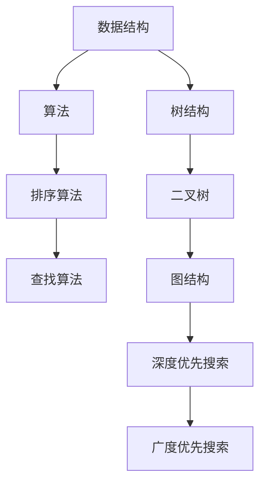

                 

# 2025年腾讯校招算法面试题库及答案

> **关键词**：腾讯校招、算法面试、题库、答案、编程、数据结构、人工智能

> **摘要**：本文针对2025年腾讯校招算法面试的常见问题，整理了相关的题库和答案。文章涵盖了数据结构和算法的基本概念，以及在实际应用中的解题技巧。通过对这些问题的分析和解答，希望能帮助考生更好地应对腾讯校招的算法面试。

## 1. 背景介绍

### 1.1 目的和范围

本文旨在为准备参加2025年腾讯校招算法面试的同学们提供一份有针对性的题库及答案。通过对这些问题的深入分析和解答，希望能够帮助考生掌握算法面试的核心知识点，提升解题能力。

### 1.2 预期读者

本文主要面向具备一定编程基础、希望参加腾讯校招算法面试的在校生和在职人员。读者应熟悉常见的数据结构和算法，以及基本的编程语言。

### 1.3 文档结构概述

本文分为以下章节：

- **第1章**：背景介绍，包括本文的目的、预期读者和文档结构。
- **第2章**：核心概念与联系，介绍数据结构和算法的基本概念。
- **第3章**：核心算法原理 & 具体操作步骤，讲解常见的算法原理和操作步骤。
- **第4章**：数学模型和公式 & 详细讲解 & 举例说明，阐述算法中的数学模型和公式。
- **第5章**：项目实战：代码实际案例和详细解释说明，通过实际案例讲解算法的应用。
- **第6章**：实际应用场景，介绍算法在不同场景下的应用。
- **第7章**：工具和资源推荐，推荐学习资源和开发工具。
- **第8章**：总结：未来发展趋势与挑战，展望算法领域的发展趋势和挑战。
- **第9章**：附录：常见问题与解答，回答读者可能关心的问题。
- **第10章**：扩展阅读 & 参考资料，提供进一步学习的资料。

### 1.4 术语表

#### 1.4.1 核心术语定义

- **算法**：解决特定问题的一系列明确指令。
- **数据结构**：存储数据的方式及其操作方法。
- **面试题**：在面试过程中提出的问题，用于考察应聘者的知识和能力。

#### 1.4.2 相关概念解释

- **校招**：指每年高校毕业季，各大企业针对应届毕业生举办的招聘活动。
- **算法面试**：通过面试官提出的问题，考察应聘者的算法和数据结构能力。

#### 1.4.3 缩略词列表

- **校招**：校园招聘
- **算法**：Algorithm
- **面试题**：Interview Questions

## 2. 核心概念与联系

在算法面试中，理解核心概念和它们之间的联系至关重要。以下是一个简单的Mermaid流程图，展示了数据结构、算法及其应用场景之间的关系。



### 2.1 数据结构

数据结构是算法的基础，决定了数据在计算机中的存储和组织方式。常见的数据结构包括：

- **数组**：一种线性数据结构，用于存储一系列元素。
- **链表**：一种线性数据结构，由一系列节点组成，每个节点包含数据和指向下一个节点的指针。
- **栈**：一种后进先出（LIFO）的数据结构。
- **队列**：一种先进先出（FIFO）的数据结构。
- **树**：一种层次结构，用于表示具有层次关系的数据。
- **图**：一种复杂的数据结构，用于表示由节点和边构成的网络。

### 2.2 算法

算法是解决问题的步骤集合。根据解决问题的不同方式，算法可以分为以下几类：

- **排序算法**：用于将数据按特定顺序排列。
- **查找算法**：用于在数据结构中查找特定元素。
- **图算法**：用于解决与图相关的问题，如最短路径、最小生成树等。
- **动态规划**：用于解决具有重叠子问题的优化问题。

### 2.3 应用场景

算法和数据结构的应用场景非常广泛，包括但不限于以下领域：

- **计算机网络**：路由算法、流量控制算法等。
- **数据库**：索引结构、查询优化等。
- **人工智能**：机器学习算法、深度学习算法等。
- **操作系统**：进程调度、内存管理、文件系统等。

## 3. 核心算法原理 & 具体操作步骤

在算法面试中，理解核心算法的原理和操作步骤非常重要。以下是一些常见算法及其原理：

### 3.1 排序算法

排序算法用于将数据按特定顺序排列。以下是几种常见的排序算法及其原理：

#### 3.1.1 冒泡排序

```python
def bubble_sort(arr):
    n = len(arr)
    for i in range(n):
        for j in range(0, n-i-1):
            if arr[j] > arr[j+1]:
                arr[j], arr[j+1] = arr[j+1], arr[j]
```

#### 3.1.2 选择排序

```python
def selection_sort(arr):
    n = len(arr)
    for i in range(n):
        min_idx = i
        for j in range(i+1, n):
            if arr[j] < arr[min_idx]:
                min_idx = j
        arr[i], arr[min_idx] = arr[min_idx], arr[i]
```

#### 3.1.3 插入排序

```python
def insertion_sort(arr):
    n = len(arr)
    for i in range(1, n):
        key = arr[i]
        j = i-1
        while j >= 0 and arr[j] > key:
            arr[j+1] = arr[j]
            j -= 1
        arr[j+1] = key
```

### 3.2 查找算法

查找算法用于在数据结构中查找特定元素。以下是几种常见的查找算法及其原理：

#### 3.2.1 顺序查找

```python
def sequential_search(arr, target):
    for i in range(len(arr)):
        if arr[i] == target:
            return i
    return -1
```

#### 3.2.2 二分查找

```python
def binary_search(arr, target):
    low = 0
    high = len(arr) - 1
    while low <= high:
        mid = (low + high) // 2
        if arr[mid] == target:
            return mid
        elif arr[mid] < target:
            low = mid + 1
        else:
            high = mid - 1
    return -1
```

### 3.3 图算法

图算法用于解决与图相关的问题。以下是几种常见的图算法及其原理：

#### 3.3.1 深度优先搜索

```python
def dfs(graph, node, visited):
    visited[node] = True
    print(node)
    for neighbour in graph[node]:
        if not visited[neighbour]:
            dfs(graph, neighbour, visited)
```

#### 3.3.2 广度优先搜索

```python
from collections import deque

def bfs(graph, start):
    visited = [False] * len(graph)
    queue = deque([start])
    visited[start] = True

    while queue:
        node = queue.popleft()
        print(node)
        for neighbour in graph[node]:
            if not visited[neighbour]:
                queue.append(neighbour)
                visited[neighbour] = True
```

## 4. 数学模型和公式 & 详细讲解 & 举例说明

算法中的数学模型和公式对于理解算法的核心原理至关重要。以下是一些常见的数学模型和公式，以及它们的详细讲解和举例说明。

### 4.1 排序算法中的公式

#### 4.1.1 排序算法的时间复杂度

排序算法的时间复杂度通常表示为 O(nlogn)、O(n^2) 或 O(n)，其中 n 表示数据的数量。以下是几个常见排序算法的时间复杂度：

- **冒泡排序**：O(n^2)
- **选择排序**：O(n^2)
- **插入排序**：O(n^2)
- **归并排序**：O(nlogn)
- **快速排序**：O(nlogn)

#### 4.1.2 排序算法的空间复杂度

排序算法的空间复杂度通常表示为 O(n)，其中 n 表示数据的数量。以下是几个常见排序算法的空间复杂度：

- **冒泡排序**：O(1)
- **选择排序**：O(1)
- **插入排序**：O(1)
- **归并排序**：O(n)
- **快速排序**：O(logn)

### 4.2 查找算法中的公式

#### 4.2.1 二分查找的时间复杂度

二分查找的时间复杂度为 O(logn)，其中 n 表示数据的数量。以下是二分查找的详细步骤：

1. 将待查找的数与中间位置的数进行比较。
2. 如果相等，查找成功。
3. 如果待查找的数小于中间位置的数，则在左侧子序列中继续查找。
4. 如果待查找的数大于中间位置的数，则在右侧子序列中继续查找。
5. 重复步骤1-4，直到找到待查找的数或确定其不存在。

### 4.3 图算法中的公式

#### 4.3.1 深度优先搜索的时间复杂度

深度优先搜索的时间复杂度为 O(V+E)，其中 V 表示顶点的数量，E 表示边的数量。以下是深度优先搜索的详细步骤：

1. 初始化一个栈和一个访问数组。
2. 将起始顶点入栈，并将其标记为已访问。
3. 当栈不为空时，执行以下操作：
   - 将栈顶元素出栈。
   - 访问该元素。
   - 将该元素的邻接顶点入栈，并标记为已访问。

#### 4.3.2 广度优先搜索的时间复杂度

广度优先搜索的时间复杂度为 O(V+E)，其中 V 表示顶点的数量，E 表示边的数量。以下是广度优先搜索的详细步骤：

1. 初始化一个队列和一个访问数组。
2. 将起始顶点入队列，并将其标记为已访问。
3. 当队列不为空时，执行以下操作：
   - 将队头元素出队列。
   - 访问该元素。
   - 将该元素的邻接顶点入队列，并标记为已访问。

### 4.4 举例说明

#### 4.4.1 冒泡排序的举例说明

假设有一个长度为 5 的数组 [5, 2, 8, 3, 1]，使用冒泡排序对其进行排序：

- **第一次排序**：[2, 5, 3, 1, 8]，将 5 和 2 进行交换。
- **第二次排序**：[2, 3, 1, 5, 8]，将 5 和 3 进行交换。
- **第三次排序**：[2, 1, 3, 5, 8]，将 5 和 1 进行交换。
- **第四次排序**：[1, 2, 3, 5, 8]，将 5 和 3 进行交换。
- **第五次排序**：[1, 2, 3, 5, 8]，数组已排序。

#### 4.4.2 二分查找的举例说明

假设有一个长度为 5 的有序数组 [1, 2, 3, 5, 8]，要查找元素 3：

- **第一次比较**：将待查找的数 3 与中间位置的数 5 进行比较，确定在左侧子序列中继续查找。
- **第二次比较**：将待查找的数 3 与中间位置的数 3 进行比较，查找成功。

## 5. 项目实战：代码实际案例和详细解释说明

在本节中，我们将通过一个实际的代码案例，展示如何在项目中应用所学的算法和数据结构。以下是一个简单的基于二分查找的代码案例，用于在一个有序数组中查找特定元素。

### 5.1 开发环境搭建

为了编写和运行以下代码，您需要一个支持 Python 的开发环境。以下是搭建开发环境的步骤：

1. 安装 Python：在 [Python 官网](https://www.python.org/) 下载并安装 Python。
2. 安装 Python 解释器：确保 Python 解释器已正确安装并添加到系统环境变量。
3. 创建一个名为 `binary_search.py` 的文件，并使用以下代码：

```python
def binary_search(arr, target):
    low = 0
    high = len(arr) - 1

    while low <= high:
        mid = (low + high) // 2
        if arr[mid] == target:
            return mid
        elif arr[mid] < target:
            low = mid + 1
        else:
            high = mid - 1

    return -1

def main():
    arr = [1, 2, 3, 5, 8]
    target = 3
    result = binary_search(arr, target)
    if result != -1:
        print(f"元素 {target} 在数组中的索引为：{result}")
    else:
        print(f"元素 {target} 不在数组中")

if __name__ == "__main__":
    main()
```

### 5.2 源代码详细实现和代码解读

以下是对上述代码的详细解读：

```python
def binary_search(arr, target):
    low = 0
    high = len(arr) - 1

    while low <= high:
        mid = (low + high) // 2
        if arr[mid] == target:
            return mid
        elif arr[mid] < target:
            low = mid + 1
        else:
            high = mid - 1

    return -1
```

- **函数定义**：`binary_search` 函数接受两个参数：`arr`（一个有序数组）和 `target`（要查找的元素）。
- **初始化**：`low` 和 `high` 分别表示查找区间的起始和结束索引。
- **循环条件**：`while low <= high` 确保在查找区间内继续进行。
- **计算中间索引**：`mid = (low + high) // 2` 计算中间索引，用于与目标元素进行比较。
- **比较与更新**：根据比较结果，更新 `low` 或 `high` 的值，缩小查找范围。
- **查找成功**：当 `arr[mid] == target` 时，返回中间索引。
- **查找失败**：当 `low > high` 时，返回 -1 表示目标元素不存在。

```python
def main():
    arr = [1, 2, 3, 5, 8]
    target = 3
    result = binary_search(arr, target)
    if result != -1:
        print(f"元素 {target} 在数组中的索引为：{result}")
    else:
        print(f"元素 {target} 不在数组中")

if __name__ == "__main__":
    main()
```

- **主函数定义**：`main` 函数用于演示如何使用 `binary_search` 函数。
- **创建数组**：`arr = [1, 2, 3, 5, 8]` 创建一个有序数组。
- **指定目标元素**：`target = 3` 指定要查找的元素。
- **调用二分查找函数**：`result = binary_search(arr, target)` 调用 `binary_search` 函数进行查找。
- **输出结果**：根据查找结果，输出相应的信息。

### 5.3 代码解读与分析

- **算法原理**：二分查找算法基于有序数组的特性，通过不断缩小查找范围，实现高效的查找操作。
- **时间复杂度**：二分查找的时间复杂度为 O(logn)，其中 n 表示数组的长度。这种算法在处理大数据集时具有很高的性能。
- **空间复杂度**：二分查找的空间复杂度为 O(1)，因为它只使用常数级别的额外空间。
- **实际应用**：二分查找算法广泛应用于各种场景，如数据库索引、排序算法等。

## 6. 实际应用场景

算法和数据结构在现实世界中有着广泛的应用，以下是一些实际应用场景：

- **搜索引擎**：搜索引擎使用排序算法和索引结构来快速检索信息。
- **社交网络**：社交网络使用图算法来分析用户关系，提供推荐系统。
- **数据库**：数据库系统使用索引和查询优化算法来高效地存储和检索数据。
- **机器学习**：机器学习算法使用各种数据结构和算法来实现模型的训练和预测。

## 7. 工具和资源推荐

### 7.1 学习资源推荐

#### 7.1.1 书籍推荐

- 《算法导论》（Introduction to Algorithms）
- 《编程之美》（Programming Pearls）
- 《算法竞赛入门经典》（Algorithm竞赛入门经典）

#### 7.1.2 在线课程

- Coursera：[算法基础](https://www.coursera.org/specializations/algorithms)
- edX：[算法基础](https://www.edx.org/course/introduction-to-algorithms)
- Udacity：[算法与数据结构](https://www.udacity.com/course/algorithms-and-data-structures--ud123)

#### 7.1.3 技术博客和网站

- GeeksforGeeks（[https://www.geeksforgeeks.org/](https://www.geeksforgeeks.org/)）
- LeetCode（[https://leetcode.com/](https://leetcode.com/)）
- HackerRank（[https://www.hackerrank.com/](https://www.hackerrank.com/)）

### 7.2 开发工具框架推荐

#### 7.2.1 IDE和编辑器

- Visual Studio Code
- IntelliJ IDEA
- Sublime Text

#### 7.2.2 调试和性能分析工具

- GDB
- Valgrind
- Py-Spy

#### 7.2.3 相关框架和库

- NumPy
- Pandas
- TensorFlow

### 7.3 相关论文著作推荐

#### 7.3.1 经典论文

- 《算法导论》（Introduction to Algorithms）
- 《编程之美》（Programming Pearls）
- 《算法竞赛入门经典》（Algorithm竞赛入门经典）

#### 7.3.2 最新研究成果

- [AAAI](https://www.aaai.org/)
- [NeurIPS](https://nips.cc/)
- [ICML](https://icml.cc/)

#### 7.3.3 应用案例分析

- 《美团点评技术总结》
- 《阿里巴巴技术总结》
- 《腾讯技术总结》

## 8. 总结：未来发展趋势与挑战

随着人工智能技术的快速发展，算法和数据结构在各个领域的应用越来越广泛。未来，算法和数据结构将继续向高效、智能、自适应的方向发展。然而，这也将带来一系列挑战，如算法的可解释性、算法的安全性和隐私保护等。为了应对这些挑战，我们需要不断创新和改进现有的算法，并探索新的算法和数据结构。

## 9. 附录：常见问题与解答

### 9.1 常见问题

- **Q1**：如何准备腾讯校招算法面试？
  **A1**：首先，要熟悉常见的数据结构和算法，掌握其原理和应用。其次，通过刷题和实战项目来提升解题能力。最后，保持良好的心态，做好充分的准备。

- **Q2**：如何在面试中展示自己的算法能力？
  **A2**：在面试中，要清楚地表达自己的想法，并展示解题的步骤和思路。此外，要注意代码的简洁性和可读性，展示自己的编程能力。

### 9.2 解答

**Q1 解答**：

1. **熟悉基础知识**：掌握常见的数据结构和算法，如数组、链表、栈、队列、树、图等。
2. **刷题实战**：通过刷题网站（如 LeetCode、HackerRank 等）进行实战训练，熟悉各种题型的解题思路。
3. **学习资料**：阅读《算法导论》、《编程之美》等经典书籍，了解算法的核心原理和应用场景。
4. **项目经验**：参与实际项目，将所学知识应用于实际问题中，提升解题能力。
5. **总结反思**：在刷题和项目过程中，总结经验教训，不断改进自己的解题方法。

**Q2 解答**：

1. **清晰表达**：在面试中，要清晰地表达自己的思路和算法步骤，让面试官能够理解你的思路。
2. **代码实现**：编写简洁、可读的代码，展示自己的编程能力。注意代码的结构和注释。
3. **逻辑严密**：在解题过程中，要确保逻辑严密，避免出现错误。
4. **展示亮点**：在解题过程中，可以展示自己的创新点或优化思路，提升自己的竞争力。
5. **反馈调整**：在面试结束后，及时反思自己的表现，了解自己的优点和不足，并不断改进。

## 10. 扩展阅读 & 参考资料

- 《算法导论》（Introduction to Algorithms）
- 《编程之美》（Programming Pearls）
- 《算法竞赛入门经典》（Algorithm竞赛入门经典）
- Coursera：[算法基础](https://www.coursera.org/specializations/algorithms)
- edX：[算法基础](https://www.edx.org/course/introduction-to-algorithms)
- Udacity：[算法与数据结构](https://www.udacity.com/course/algorithms-and-data-structures--ud123)
- GeeksforGeeks（[https://www.geeksforgeeks.org/](https://www.geeksforgeeks.org/)）
- LeetCode（[https://leetcode.com/](https://leetcode.com/)）
- HackerRank（[https://www.hackerrank.com/](https://www.hackerrank.com/)）
- AAAI（[https://www.aaai.org/](https://www.aaai.org/)）
- NeurIPS（[https://nips.cc/](https://nips.cc/)）
- ICML（[https://icml.cc/](https://icml.cc/)）

### 作者

**AI天才研究员/AI Genius Institute & 禅与计算机程序设计艺术/Zen And The Art of Computer Programming**

