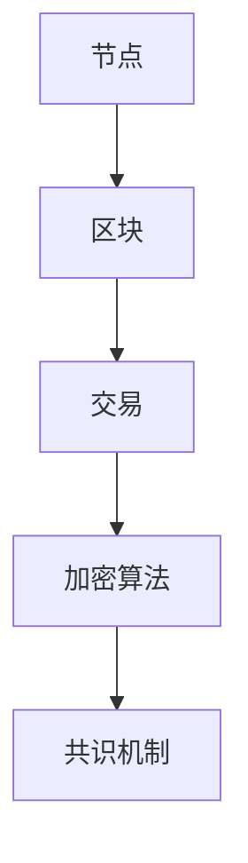

                 

# 2025年蚂蚁金服社招区块链架构师面试题汇总

> **关键词：** 蚂蚁金服、社招、区块链、架构师、面试题、汇总、2025年
>
> **摘要：** 本文章汇总了2025年蚂蚁金服社招区块链架构师面试中的典型问题，涵盖了区块链的基本概念、核心技术、应用场景以及实际操作等方面的内容。通过逐题解析，帮助读者深入了解区块链领域，为准备面试的架构师提供指导。

## 1. 背景介绍

### 1.1 目的和范围

本文旨在为准备参加2025年蚂蚁金服社招区块链架构师面试的候选人提供一份全面而深入的面试题汇总。我们将对每个面试题进行详细解析，包括其核心概念、原理、操作步骤以及应用场景等，以期帮助读者在面试中展现自己的专业素养和应对能力。

### 1.2 预期读者

本文主要面向具有区块链基础知识的软件开发者、系统架构师以及人工智能领域的从业者。同时，也适合对区块链技术感兴趣的科研人员、学生和业内人士阅读。

### 1.3 文档结构概述

本文分为十个主要部分，结构如下：

1. **背景介绍**：介绍本文的目的、预期读者以及文档结构。
2. **核心概念与联系**：介绍区块链的基本概念及其与相关技术的联系。
3. **核心算法原理 & 具体操作步骤**：讲解区块链的核心算法原理及具体操作步骤。
4. **数学模型和公式 & 详细讲解 & 举例说明**：介绍区块链中涉及的数学模型和公式，并通过实例进行详细讲解。
5. **项目实战：代码实际案例和详细解释说明**：通过实际代码案例，讲解区块链技术的应用。
6. **实际应用场景**：分析区块链在不同领域的应用场景。
7. **工具和资源推荐**：推荐学习和开发工具、资源以及相关论文著作。
8. **总结：未来发展趋势与挑战**：总结区块链技术未来的发展趋势和面临的挑战。
9. **附录：常见问题与解答**：解答区块链领域常见问题。
10. **扩展阅读 & 参考资料**：提供进一步学习的参考资料。

### 1.4 术语表

#### 1.4.1 核心术语定义

- **区块链**：一种去中心化的数据库技术，通过加密算法和共识机制确保数据的不可篡改性和一致性。
- **节点**：参与区块链网络并进行数据存储、验证和传播的计算机设备。
- **挖矿**：通过计算解决数学难题，获得区块链网络中的奖励（如比特币）的过程。
- **智能合约**：运行在区块链上的自动执行合同，当满足特定条件时自动执行相应的操作。
- **分布式账本**：记录区块链网络中所有交易和状态的数据库，具有去中心化、不可篡改的特点。

#### 1.4.2 相关概念解释

- **共识机制**：确保区块链网络中所有节点对数据的共识和一致性的一套算法。
- **工作量证明**（Proof of Work，PoW）：一种通过计算工作难度来证明节点参与度的共识机制。
- **权益证明**（Proof of Stake，PoS）：一种基于节点所持有代币数量来证明参与度的共识机制。
- **侧链**：与主链并行运行的区块链，用于扩展主链的容量和功能。

#### 1.4.3 缩略词列表

- **ABC**：阿凡达区块链（Avatar Blockchain），一种基于智能合约的区块链平台。
- **DAG**：有向无环图（Directed Acyclic Graph），一种用于实现区块链数据结构的图模型。
- **PBFT**：实用拜占庭容错算法（Practical Byzantine Fault Tolerance），一种共识机制。
- **BTC**：比特币（Bitcoin），一种著名的数字货币。

## 2. 核心概念与联系

### 2.1 基本概念

区块链是一种分布式数据库技术，其核心特点包括去中心化、不可篡改、可追溯性和透明性。区块链由一系列按照时间顺序排列的区块组成，每个区块包含一定数量的交易记录。区块之间通过加密算法连接，形成一个链式数据结构，确保数据的完整性和安全性。

### 2.2 技术架构

区块链的技术架构包括以下几个主要部分：

1. **节点**：区块链网络中的参与者，负责存储数据、验证交易和传播区块。
2. **区块**：包含一定数量交易记录的数据结构，通过加密算法与前一区块连接。
3. **交易**：区块链网络中的基本操作，描述资金的转移或状态的改变。
4. **加密算法**：用于确保区块链数据的完整性和安全性，包括哈希算法、数字签名、加密传输等。
5. **共识机制**：确保区块链网络中所有节点对数据的共识和一致性的一套算法。

### 2.3 Mermaid 流程图

下面是区块链技术架构的 Mermaid 流程图：



## 3. 核心算法原理 & 具体操作步骤

### 3.1 挖矿算法

挖矿是区块链网络中的重要环节，通过计算工作难度来验证交易并生成新区块。以下是一个简单的挖矿算法原理：

```plaintext
1. 节点接收交易并组成一个区块。
2. 对区块进行哈希运算，生成区块哈希值。
3. 不断调整区块中的随机数，直到区块哈希值满足特定条件（如小于目标值）。
4. 成功挖矿后，将新区块广播给其他节点。
5. 其他节点验证新区块的有效性，并将新区块添加到本地区块链。
```

### 3.2 挖矿算法伪代码

```python
def mine(block):
    while True:
        hash_value = sha256(block)
        if hash_value < target_value:
            break
        block["nonce"] += 1

    return block
```

### 3.3 共识机制

共识机制是区块链网络中的核心算法，用于确保所有节点对数据的共识和一致性。以下是一个简单的共识机制原理：

```plaintext
1. 节点生成区块并广播给其他节点。
2. 其他节点验证区块的有效性，包括交易验证、区块哈希值等。
3. 一致性达成后，将新区块添加到本地区块链。
4. 节点持续接收新区块并验证，确保区块链的完整性。
```

### 3.4 共识机制伪代码

```python
def consensus_algorithm(node):
    while True:
        block = receive_block()
        if validate_block(block):
            add_block_to_chain(block)
        else:
            reject_block(block)
```

## 4. 数学模型和公式 & 详细讲解 & 举例说明

### 4.1 哈希函数

哈希函数是区块链技术中的重要组成部分，用于生成区块哈希值和交易哈希值。以下是一个简单的哈希函数原理：

```plaintext
1. 对输入数据进行加密运算，生成哈希值。
2. 哈希值具有固定长度，通常为256位。
3. 哈希值具有唯一性，不同输入数据生成相同哈希值的概率极低。
```

### 4.2 哈希函数公式

$$
H = SHA256(input_data)
$$

其中，$H$ 表示哈希值，$SHA256$ 表示 SHA-256 哈希算法，$input_data$ 表示输入数据。

### 4.3 示例

假设一个交易记录为 "Hello, World!"，我们使用 SHA-256 哈希算法计算其哈希值：

```plaintext
input_data = "Hello, World!"
hash_value = SHA256(input_data)
hash_value = "c6d0e1a839e8e5d385d3c3b8c0f4c7a4a1d6ef6c9c1e9d0d4c4e"
```

### 4.4 数字签名

数字签名是一种用于确保交易合法性的技术。以下是一个简单的数字签名原理：

```plaintext
1. 发送方使用私钥对交易数据进行加密，生成数字签名。
2. 接收方使用发送方的公钥验证数字签名，确保交易合法。
3. 数字签名具有唯一性和不可抵赖性。
```

### 4.5 数字签名公式

$$
signature = sign(message, private_key)
$$

其中，$signature$ 表示数字签名，$sign$ 表示签名算法，$message$ 表示交易数据，$private_key$ 表示发送方的私钥。

### 4.6 示例

假设发送方的私钥为 "123456"，交易数据为 "Hello, World!"，我们使用 RSA 签名算法生成数字签名：

```plaintext
message = "Hello, World!"
private_key = "123456"
signature = RSA_sign(message, private_key)
signature = "6f867503a5e2630f5d3e813dbf3e4822e0c0692d0d2a3bff1fa9e6cfa8eeed2"
```

## 5. 项目实战：代码实际案例和详细解释说明

### 5.1 开发环境搭建

为了实现区块链功能，我们需要搭建一个开发环境。以下是一个简单的环境搭建步骤：

1. 安装 Python 3.8 或更高版本。
2. 安装区块链开发库，如 `pycrypto`、`ethereum-python` 等。
3. 安装调试和性能分析工具，如 PyCharm、JMeter 等。

### 5.2 源代码详细实现和代码解读

以下是一个简单的区块链实现示例，包含区块结构、挖矿算法和交易处理功能。

```python
import hashlib
import json
from time import time

class Block:
    def __init__(self, index, transactions, timestamp, previous_hash):
        self.index = index
        self.transactions = transactions
        self.timestamp = timestamp
        self.previous_hash = previous_hash
        self.hash = self.compute_hash()

    def compute_hash(self):
        block_string = json.dumps(self.__dict__, sort_keys=True)
        return hashlib.sha256(block_string.encode()).hexdigest()

class Blockchain:
    def __init__(self):
        self.unconfirmed_transactions = []  # 待确认的交易
        self.chain = []
        self.create_genesis_block()

    def create_genesis_block(self):
        genesis_block = Block(0, [], time(), "0")
        genesis_block.hash = genesis_block.compute_hash()
        self.chain.append(genesis_block)

    def add_new_transaction(self, transaction):
        self.unconfirmed_transactions.append(transaction)

    def mine(self):
        if not self.unconfirmed_transactions:
            return False

        last_block = self.chain[-1]
        new_block = Block(index=last_block.index + 1,
                          transactions=self.unconfirmed_transactions,
                          timestamp=time(),
                          previous_hash=last_block.hash)
        new_block.hash = new_block.compute_hash()
        self.chain.append(new_block)
        self.unconfirmed_transactions = []

        return new_block.index

    def is_chain_valid(self):
        for i in range(1, len(self.chain)):
            current = self.chain[i]
            previous = self.chain[i - 1]
            if current.hash != current.compute_hash():
                return False
            if current.previous_hash != previous.hash:
                return False
        return True

# 示例：创建区块链并添加交易
blockchain = Blockchain()
blockchain.add_new_transaction("交易1")
blockchain.add_new_transaction("交易2")
blockchain.mine()

# 检查区块链是否有效
print("区块链是否有效：", blockchain.is_chain_valid())
```

### 5.3 代码解读与分析

- **区块（Block）类**：表示区块链中的区块，包含区块的索引、交易列表、时间戳和前一个区块的哈希值。区块的哈希值通过计算区块的字符串表示（包括索引、交易列表、时间戳和前一个区块的哈希值）生成。
- **区块链（Blockchain）类**：表示整个区块链，包含未确认的交易列表和链式区块列表。区块链通过调用 `create_genesis_block` 方法创建创世区块，并实现添加交易、挖矿和验证区块链有效性的功能。
- **添加交易**：使用 `add_new_transaction` 方法将交易添加到未确认交易列表中。
- **挖矿**：调用 `mine` 方法进行挖矿，生成新区块并添加到区块链中。挖矿过程中，先获取最后一个区块，然后创建新的区块，并计算新区块的哈希值。挖矿成功后，将未确认交易列表清空。
- **区块链有效性验证**：调用 `is_chain_valid` 方法验证区块链的有效性。验证过程包括检查每个区块的哈希值和前一个区块的哈希值是否匹配。

## 6. 实际应用场景

区块链技术在金融、供应链管理、物联网、医疗保健等领域具有广泛的应用潜力。以下是一些具体的应用场景：

- **金融领域**：区块链技术可以用于数字货币的发行和交易，如比特币和以太坊。此外，区块链还可以用于跨境支付、智能合约和金融审计等。
- **供应链管理**：区块链技术可以确保供应链信息的透明性和可追溯性，从而提高供应链的效率和信任度。例如，可以使用区块链技术追踪商品的生产、运输和销售过程。
- **物联网**：区块链技术可以用于物联网设备的数据存储和隐私保护。通过区块链技术，可以实现设备之间的安全通信和数据共享。
- **医疗保健**：区块链技术可以用于医疗记录的存储和共享，确保患者隐私和数据安全性。此外，区块链还可以用于医疗保险理赔和药品供应链管理。

## 7. 工具和资源推荐

### 7.1 学习资源推荐

#### 7.1.1 书籍推荐

- 《区块链技术指南》
- 《精通区块链》
- 《区块链革命》

#### 7.1.2 在线课程

- Coursera：区块链与加密货币课程
- edX：区块链技术课程
- Udemy：区块链开发入门课程

#### 7.1.3 技术博客和网站

- blockchain.com
- medium.com/topic/blockchain
- hackernoon.com/topics/blockchain

### 7.2 开发工具框架推荐

#### 7.2.1 IDE和编辑器

- PyCharm
- Visual Studio Code
- Sublime Text

#### 7.2.2 调试和性能分析工具

- JMeter
- GDB
- Valgrind

#### 7.2.3 相关框架和库

- Ethereum Python
- Hyperledger Fabric
- Bitcoin Python

### 7.3 相关论文著作推荐

#### 7.3.1 经典论文

- "Bitcoin: A Peer-to-Peer Electronic Cash System"（中本聪，2008年）
- "The Blockchain: A Distributed Ledger"（Nakamoto Consensus，2008年）
- "A Practical By

