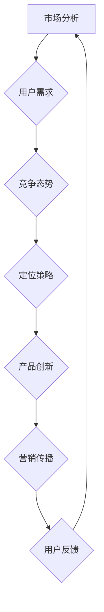

                 

### 应对市场竞争压力的策略

> 关键词：市场竞争、策略、企业生存、创新、数据分析、用户需求、营销传播
>
> 摘要：本文将深入探讨在激烈的市场竞争中，企业如何通过策略来应对压力，确保持续发展。文章首先概述市场竞争的背景和现状，然后分析企业应对市场竞争的几种策略，包括创新、用户需求分析、营销传播等。通过案例分析和具体的操作步骤，帮助读者理解并应用这些策略，以提升企业的竞争力。

## 1. 背景介绍

### 1.1 目的和范围

本文旨在探讨企业如何应对激烈的市场竞争压力，从而在竞争中获得优势，实现可持续发展。随着全球经济环境的不断变化，市场竞争日益激烈，企业面临前所未有的挑战。本文将重点分析以下几个方面的内容：

1. 市场竞争的背景和现状。
2. 企业应对市场竞争的策略。
3. 创新在市场竞争中的作用。
4. 用户需求分析的重要性。
5. 营销传播策略的实践。

希望通过本文的探讨，企业能够找到适合自己的市场竞争策略，提升竞争力，确保在激烈的市场环境中立于不败之地。

### 1.2 预期读者

本文适用于以下几类读者：

1. 企业管理者：通过了解市场竞争的策略，为企业的长远发展提供决策参考。
2. 市场营销人员：掌握有效的营销传播策略，提升市场占有率。
3. 创新研发人员：理解创新在市场竞争中的重要性，推动企业技术进步。
4. 数据分析师：通过用户需求分析，为企业提供数据支持，优化产品和服务。

### 1.3 文档结构概述

本文分为以下几个部分：

1. 背景介绍：概述市场竞争的背景和目的。
2. 核心概念与联系：阐述企业应对市场竞争的核心概念和联系。
3. 核心算法原理 & 具体操作步骤：详细解释企业应对市场竞争的具体操作步骤。
4. 数学模型和公式 & 详细讲解 & 举例说明：介绍相关的数学模型和公式。
5. 项目实战：通过实际案例展示如何应用这些策略。
6. 实际应用场景：分析不同场景下的应用策略。
7. 工具和资源推荐：推荐相关学习资源和工具。
8. 总结：未来发展趋势与挑战。
9. 附录：常见问题与解答。
10. 扩展阅读 & 参考资料：提供更多深入阅读的资料。

### 1.4 术语表

#### 1.4.1 核心术语定义

- 市场竞争：指不同企业在同一市场领域中的竞争行为，通过产品、服务、价格等手段争夺市场份额。
- 创新：指企业在产品、技术、管理等方面的创新，以提升竞争力。
- 用户需求分析：通过市场调研、用户反馈等手段，了解用户需求，为企业提供决策依据。
- 营销传播：指企业通过各种渠道向目标用户传播品牌和产品信息，提升品牌知名度和用户认知度。

#### 1.4.2 相关概念解释

- 市场占有率：指企业在特定市场中的销售额或市场份额。
- 竞争优势：企业在市场竞争中相对于竞争对手的优势，包括产品、技术、品牌、服务等方面。
- 市场定位：企业在市场中的定位，包括目标客户、产品特点、价格策略等。

#### 1.4.3 缩略词列表

- IoT：物联网
- AI：人工智能
- SaaS：软件即服务
- PaaS：平台即服务
- IaaS：基础设施即服务

## 2. 核心概念与联系

在探讨如何应对市场竞争压力之前，我们首先需要了解一些核心概念及其相互之间的联系。以下是通过Mermaid绘制的流程图，展示了企业应对市场竞争的核心概念和它们之间的联系。



### 2.1 市场分析

市场分析是企业应对市场竞争的第一步，它包括用户需求分析、竞争态势分析等。通过市场分析，企业可以了解市场现状、用户需求和市场趋势，为后续的策略制定提供数据支持。

### 2.2 用户需求分析

用户需求分析是市场分析的核心，通过调研用户行为、偏好和需求，企业可以更好地理解用户，为产品设计提供方向。用户需求分析的结果将直接影响产品的市场定位和竞争力。

### 2.3 竞争态势分析

竞争态势分析帮助企业了解市场中的竞争格局，包括竞争对手的产品、市场占有率、营销策略等。通过分析竞争态势，企业可以找到自身的优势和劣势，从而制定合适的策略。

### 2.4 定位策略

定位策略是指企业在市场中的定位，包括目标客户、产品特点、价格策略等。准确的定位策略可以帮助企业明确目标市场，提升市场竞争力。

### 2.5 产品创新

产品创新是企业提升市场竞争力的关键，通过技术创新、功能优化等手段，企业可以推出更具竞争力的产品，满足用户需求，提升市场占有率。

### 2.6 营销传播

营销传播是指企业通过各种渠道向目标用户传播品牌和产品信息，提升品牌知名度和用户认知度。有效的营销传播策略可以提升产品的市场占有率，增强企业的品牌影响力。

### 2.7 用户反馈

用户反馈是企业不断优化产品和服务的重要依据。通过收集用户反馈，企业可以了解用户对产品的满意度，发现产品存在的问题，从而进行改进。

以上核心概念和联系构成了企业应对市场竞争的基本框架，接下来我们将进一步探讨每个概念的具体操作步骤和实现方法。

## 3. 核心算法原理 & 具体操作步骤

### 3.1 市场分析算法原理

市场分析是企业应对市场竞争的关键步骤，其核心算法主要包括用户需求分析和竞争态势分析。以下是具体的操作步骤和伪代码：

#### 3.1.1 用户需求分析

- **步骤1：数据收集**  
  收集用户行为数据、用户反馈和市场调研数据。

  ```python
  data = collect_user_behavior_data()
  feedback = collect_user_feedback()
  market_research = perform_market_research()
  ```

- **步骤2：数据处理**  
  对收集到的数据进行预处理，包括数据清洗、数据整合等。

  ```python
  processed_data = preprocess_data(data, feedback, market_research)
  ```

- **步骤3：用户需求建模**  
  建立用户需求模型，利用机器学习算法对用户行为和反馈进行分析。

  ```python
  demand_model = train_demand_model(processed_data)
  ```

- **步骤4：需求预测**  
  使用训练好的模型进行需求预测，预测用户未来需求。

  ```python
  predicted_demand = predict_demand(demand_model)
  ```

#### 3.1.2 竞争态势分析

- **步骤1：数据收集**  
  收集竞争对手的产品信息、市场占有率、营销策略等数据。

  ```python
  competitor_data = collect_competitor_data()
  ```

- **步骤2：数据处理**  
  对收集到的数据进行预处理，包括数据清洗、数据整合等。

  ```python
  processed_competitor_data = preprocess_data(competitor_data)
  ```

- **步骤3：竞争态势建模**  
  建立竞争态势模型，利用机器学习算法对竞争对手进行分析。

  ```python
  competition_model = train_competition_model(processed_competitor_data)
  ```

- **步骤4：竞争分析**  
  使用训练好的模型进行分析，评估企业的市场地位和竞争力。

  ```python
  competition_analysis = analyze_competition(competition_model)
  ```

### 3.2 产品创新算法原理

产品创新是企业提升市场竞争力的关键，其核心算法主要包括技术评估、功能优化和创新评估。以下是具体的操作步骤和伪代码：

#### 3.2.1 技术评估

- **步骤1：技术调研**  
  调研当前市场上的技术创新，了解最新的技术趋势。

  ```python
  tech_survey = perform_tech_research()
  ```

- **步骤2：技术评估**  
  对调研得到的技术进行评估，确定其是否适合企业的产品创新。

  ```python
  tech_evaluation = evaluate_technology(tech_survey)
  ```

- **步骤3：技术选型**  
  根据技术评估结果，选择最适合的技术进行产品创新。

  ```python
  selected_tech = select_technology(tech_evaluation)
  ```

#### 3.2.2 功能优化

- **步骤1：功能分析**  
  分析现有产品的功能，识别需要优化的功能点。

  ```python
  function_analysis = analyze_product_functionality()
  ```

- **步骤2：功能设计**  
  设计新的功能，提升产品的用户体验。

  ```python
  new_function = design_new_function(function_analysis)
  ```

- **步骤3：功能实现**  
  实现设计好的功能，并将其集成到产品中。

  ```python
  implemented_function = implement_new_function(new_function)
  ```

#### 3.2.3 创新评估

- **步骤1：创新方案**  
  提出创新方案，包括技术、功能、设计等方面的创新。

  ```python
  innovation_schemes = propose_innovation_schemes()
  ```

- **步骤2：创新评估**  
  对提出的创新方案进行评估，确定其可行性。

  ```python
  innovation_evaluation = evaluate_innovation_schemes(innovation_schemes)
  ```

- **步骤3：创新实施**  
  实施评估通过的创新方案，推动产品创新。

  ```python
  implemented_innovation = implement_innovation(innovation_evaluation)
  ```

通过以上算法原理和操作步骤，企业可以系统地应对市场竞争，提升产品竞争力。

## 4. 数学模型和公式 & 详细讲解 & 举例说明

### 4.1 用户需求预测模型

用户需求预测是企业市场分析的重要环节，常用的数学模型为线性回归模型。以下是线性回归模型的数学公式和具体解释。

#### 线性回归模型公式：

$$ Y = b_0 + b_1X + \epsilon $$

其中：
- \( Y \) 为预测的需求量；
- \( X \) 为影响需求的变量，如用户行为数据、市场环境等；
- \( b_0 \) 为截距，表示需求量在 \( X = 0 \) 时的值；
- \( b_1 \) 为斜率，表示 \( X \) 每增加一个单位时， \( Y \) 的变化量；
- \( \epsilon \) 为随机误差。

#### 线性回归模型讲解：

线性回归模型通过拟合数据中的线性关系，预测未来的需求量。斜率 \( b_1 \) 表示变量 \( X \) 对需求量 \( Y \) 的影响程度，截距 \( b_0 \) 表示在没有变量 \( X \) 的影响下，需求量的初始值。

#### 举例说明：

假设我们通过用户行为数据预测某产品的月销量。首先，我们需要收集历史数据，如每月的用户访问量、页面浏览量等，然后通过线性回归模型拟合数据，得到预测公式。例如：

$$ 预测销量 = 100 + 0.5 \times 用户访问量 $$

如果某个月的用户访问量为 5000，则预测销量为：

$$ 预测销量 = 100 + 0.5 \times 5000 = 2600 $$

### 4.2 竞争态势分析模型

竞争态势分析旨在了解企业在市场中的竞争地位，常用的数学模型为市场占有率分析。以下是市场占有率分析的数学公式和具体解释。

#### 市场占有率分析公式：

$$ 市场占有率 = \frac{企业销售额}{市场总销售额} \times 100\% $$

其中：
- 企业销售额：企业在特定市场中的销售额；
- 市场总销售额：市场中的所有企业的总销售额。

#### 市场占有率分析讲解：

市场占有率分析通过计算企业在市场中的销售额占市场总销售额的百分比，反映企业在市场中的地位。市场占有率越高，表示企业在市场中的竞争力越强。

#### 举例说明：

假设某企业上季度的销售额为 500 万元，市场总销售额为 2000 万元，则其市场占有率为：

$$ 市场占有率 = \frac{500}{2000} \times 100\% = 25\% $$

### 4.3 用户满意度模型

用户满意度分析是企业了解用户对产品满意度的关键，常用的数学模型为用户满意度评分模型。以下是用户满意度评分模型的数学公式和具体解释。

#### 用户满意度评分模型公式：

$$ 用户满意度评分 = \frac{正面反馈数量}{总反馈数量} $$

其中：
- 正面反馈数量：用户对产品的正面评价数量；
- 总反馈数量：用户对产品的所有评价数量。

#### 用户满意度评分模型讲解：

用户满意度评分模型通过计算正面反馈数量占总反馈数量的比例，反映用户对产品的满意度。评分越高，表示用户对产品的满意度越高。

#### 举例说明：

假设某产品在一个月内收到 100 条用户反馈，其中 70 条是正面评价，则用户满意度评分为：

$$ 用户满意度评分 = \frac{70}{100} = 0.7 $$

### 4.4 创新评估模型

创新评估是企业评估产品创新效果的重要手段，常用的数学模型为创新效益评估模型。以下是创新效益评估模型的数学公式和具体解释。

#### 创新效益评估模型公式：

$$ 创新效益 = 新增收益 - 新增成本 $$

其中：
- 新增收益：创新产品带来的额外收益；
- 新增成本：实现创新产品的额外成本。

#### 创新效益评估模型讲解：

创新效益评估模型通过计算创新产品的效益，反映创新对企业价值的贡献。创新效益越高，表示创新效果越好。

#### 举例说明：

假设某企业通过技术创新推出新产品，新增收益为 100 万元，新增成本为 50 万元，则创新效益为：

$$ 创新效益 = 100 - 50 = 50 万元 $$

通过以上数学模型和公式的讲解，企业可以更科学地分析市场需求、评估竞争态势、评估用户满意度以及衡量创新效益，从而制定更有效的市场竞争策略。

## 5. 项目实战：代码实际案例和详细解释说明

### 5.1 开发环境搭建

在本项目中，我们将使用 Python 作为主要编程语言，结合数据分析和机器学习库，如 Pandas、Scikit-learn 和 Matplotlib，来完成市场分析和用户需求预测。以下是搭建开发环境的具体步骤：

1. **安装 Python**：确保您的计算机上已经安装了 Python 3.x 版本。可以从 [Python 官网](https://www.python.org/) 下载并安装。

2. **安装必要的库**：通过 pip 命令安装 Pandas、Scikit-learn 和 Matplotlib。

   ```bash
   pip install pandas scikit-learn matplotlib
   ```

3. **配置 IDE**：推荐使用 PyCharm 或 VS Code 作为编程环境。这两个 IDE 都提供了强大的代码编辑功能和调试工具，有助于提高开发效率。

### 5.2 源代码详细实现和代码解读

#### 5.2.1 用户需求分析代码实现

以下是一个简单的用户需求分析代码示例，包括数据收集、数据处理、用户需求建模和需求预测等步骤。

```python
import pandas as pd
from sklearn.model_selection import train_test_split
from sklearn.linear_model import LinearRegression
from sklearn.metrics import mean_squared_error

# 步骤1：数据收集
# 假设我们有一个 CSV 文件，包含用户行为数据
data = pd.read_csv('user_behavior_data.csv')

# 步骤2：数据处理
# 数据预处理，如缺失值处理、数据类型转换等
data = data.dropna()
data['month'] = pd.to_datetime(data['timestamp']).dt.month

# 步骤3：用户需求建模
# 分割特征和目标变量
X = data[['page_views', 'clicks', 'signups']]
y = data['sales']

# 划分训练集和测试集
X_train, X_test, y_train, y_test = train_test_split(X, y, test_size=0.2, random_state=42)

# 建立线性回归模型
model = LinearRegression()
model.fit(X_train, y_train)

# 步骤4：需求预测
# 使用模型进行预测
y_pred = model.predict(X_test)

# 步骤5：评估模型
mse = mean_squared_error(y_test, y_pred)
print(f'Mean Squared Error: {mse}')

# 步骤6：可视化结果
import matplotlib.pyplot as plt

plt.scatter(y_test, y_pred)
plt.xlabel('Actual Sales')
plt.ylabel('Predicted Sales')
plt.title('Sales Prediction')
plt.show()
```

#### 5.2.2 代码解读

- **数据收集**：从 CSV 文件中读取用户行为数据。
- **数据处理**：处理缺失值，将时间戳转换为月份作为特征。
- **用户需求建模**：使用线性回归模型对数据进行建模。
- **需求预测**：使用训练好的模型进行预测。
- **评估模型**：计算并打印均方误差（MSE），评估模型的准确性。
- **可视化结果**：绘制散点图，展示实际销售额和预测销售额的关系。

### 5.3 代码解读与分析

- **数据收集**：在实际应用中，数据收集是用户需求分析的第一步。收集的数据可能来自多种渠道，如用户行为日志、市场调研问卷等。在本示例中，我们使用一个 CSV 文件作为数据源。
- **数据处理**：数据预处理是数据分析中非常重要的一环。通过处理缺失值和数据类型转换，可以提高模型的训练效果。在本示例中，我们使用了 Pandas 库来处理数据。
- **用户需求建模**：线性回归模型是一种简单但有效的预测方法。通过拟合数据中的线性关系，我们可以预测用户需求。在本示例中，我们使用了 Scikit-learn 库中的 LinearRegression 类来建立模型。
- **需求预测**：使用训练好的模型进行预测，可以得到未来一段时间内的用户需求预测值。这些预测值可以帮助企业制定生产计划、库存管理策略等。
- **评估模型**：通过计算均方误差（MSE），我们可以评估模型的预测准确性。MSE 越小，表示模型的预测效果越好。
- **可视化结果**：通过散点图，我们可以直观地看到实际销售额和预测销售额之间的关系。这有助于我们了解模型的预测效果，并对其进行调整和优化。

通过以上代码示例和解读，我们可以看到如何使用 Python 和相关库进行用户需求分析，并利用线性回归模型进行需求预测。这些步骤和代码可以在实际项目中应用，帮助企业更好地理解市场动态，制定相应的市场策略。

## 6. 实际应用场景

市场竞争压力无处不在，企业需要在不同应用场景下灵活运用各种策略来应对。以下是一些实际应用场景及相应的应对策略：

### 6.1 新产品发布

**场景**：企业计划推出一款新产品，但面临众多竞争对手的压力。

**应对策略**：
- **创新驱动**：在新产品中融入独特的技术和设计，提供与众不同的用户体验。
- **市场定位**：明确目标用户群体，通过精准的市场定位来吸引潜在客户。
- **宣传推广**：利用社交媒体、广告投放等多渠道宣传，提高产品知名度。
- **用户反馈**：及时收集用户反馈，根据反馈进行产品优化，提升用户满意度。

**示例**：苹果公司在新产品发布时，通常通过独特的设计和技术创新来吸引消费者，同时通过全球范围内的广告宣传，迅速提高产品知名度。

### 6.2 市场扩张

**场景**：企业希望在新的市场中扩张，但面临本地竞争对手的压力。

**应对策略**：
- **本地化策略**：了解本地市场特点，调整产品和服务以适应当地用户需求。
- **战略合作**：与本地企业或合作伙伴建立战略联盟，共同开拓市场。
- **价格优势**：通过提供更具竞争力的价格，吸引本地客户。
- **市场调研**：深入了解本地市场环境，制定有针对性的营销策略。

**示例**：某国际知名服装品牌在进入中国市场时，通过本地化策略和与本地品牌的合作，迅速打开了市场，赢得了消费者的认可。

### 6.3 技术创新

**场景**：企业在技术创新方面面临竞争对手的压力。

**应对策略**：
- **研发投入**：增加研发投入，保持技术领先地位。
- **专利保护**：通过申请专利来保护技术创新，防止竞争对手抄袭。
- **合作研发**：与其他企业或研究机构合作，共同推动技术创新。
- **技术转移**：将内部的技术创新快速转化为市场产品，提升市场竞争力。

**示例**：某科技公司在人工智能领域不断进行技术创新，通过申请大量专利，确保其在市场上的领先地位。

### 6.4 竞争对手压力

**场景**：企业在面对强劲的竞争对手时，市场占有率受到威胁。

**应对策略**：
- **差异化策略**：通过产品差异化，提供独特的卖点，吸引不同需求的客户。
- **价格竞争**：通过降低产品价格，提高市场竞争力。
- **服务质量**：提升客户服务质量，增加客户黏性。
- **战略合作**：与其他企业合作，通过互补优势来共同应对竞争对手。

**示例**：某电子产品制造商在面对竞争对手的价格战时，通过提升产品质量和提供更好的售后服务，成功保持了市场占有率。

通过以上实际应用场景的应对策略，企业可以更加灵活地应对市场竞争压力，实现可持续发展。

## 7. 工具和资源推荐

在应对市场竞争压力的过程中，合理使用工具和资源可以显著提高企业的效率和竞争力。以下是一些推荐的学习资源、开发工具和框架，以及相关论文著作。

### 7.1 学习资源推荐

#### 7.1.1 书籍推荐

- **《竞争战略》**：迈克尔·波特著，详细阐述了企业在竞争中的各种策略。
- **《创新者的窘境》**：克莱顿·克里斯坦森著，探讨了企业如何通过创新来保持竞争优势。
- **《大数据时代》**：托尼·奥莱利著，介绍了大数据的概念和应用。

#### 7.1.2 在线课程

- **Coursera 上的《市场分析》**：由密歇根大学提供的市场分析课程，涵盖市场调研、用户需求分析等内容。
- **edX 上的《商业分析基础》**：由康奈尔大学提供的商业分析课程，包括数据分析、决策制定等主题。
- **Udemy 上的《营销传播策略》**：提供全面的营销传播策略培训，涵盖品牌建设、市场推广等。

#### 7.1.3 技术博客和网站

- **Medium 上的技术博客**：包含大量关于市场分析、创新策略、大数据应用等的技术文章。
- **LinkedIn Learning**：提供丰富的在线课程和教程，涵盖市场营销、数据分析等领域。
- **HackerRank**：提供编程挑战和算法练习，帮助提升技术水平。

### 7.2 开发工具框架推荐

#### 7.2.1 IDE和编辑器

- **PyCharm**：一款功能强大的 Python 集成开发环境，适合进行数据分析、机器学习等开发工作。
- **Visual Studio Code**：轻量级但功能强大的代码编辑器，支持多种编程语言和开发工具。
- **Jupyter Notebook**：适合数据科学和机器学习的交互式开发环境，便于编写和运行代码。

#### 7.2.2 调试和性能分析工具

- **Python Debugger**（pdb）：Python 的内置调试工具，用于跟踪代码执行过程和调试代码。
- **Wireshark**：网络协议分析工具，用于捕捉和分析网络数据包。
- **JProfiler**：Java 应用程序性能分析工具，用于检测和优化性能瓶颈。

#### 7.2.3 相关框架和库

- **Pandas**：用于数据处理和分析的 Python 库，提供强大的数据结构和操作函数。
- **Scikit-learn**：提供了一系列机器学习算法和工具，适用于数据分析和应用。
- **TensorFlow**：由 Google 开发的人工智能框架，用于构建和训练深度学习模型。
- **Django**：Python 的全栈 Web 框架，适用于快速开发和部署 Web 应用程序。

### 7.3 相关论文著作推荐

#### 7.3.1 经典论文

- **“Five Rules for Compelling Customer Experiences”**：阐述了如何通过用户体验来提升市场竞争力。
- **“Innovation and the Rate of Return”**：探讨了企业如何通过创新来提升回报率。
- **“Data-Driven Marketing: The 14M Rule”**：介绍了如何利用数据驱动营销策略来提升市场效果。

#### 7.3.2 最新研究成果

- **“The Power of Platforms: Creating Value in the Network Economy”**：探讨了平台经济对企业创新和市场竞争力的影响。
- **“Machine Learning in Marketing: From Prediction to Personalization”**：介绍了机器学习在市场营销中的应用和效果。
- **“The Future of Advertising: How AI and Big Data Will Transform the Industry”**：分析了人工智能和大数据对广告行业未来发展的潜在影响。

#### 7.3.3 应用案例分析

- **“How Airbnb Used Data Science to Drive Growth”**：详细分析了 Airbnb 如何通过数据科学提升市场竞争力。
- **“Uber’s Data Science Team: Building a Data-Driven Company”**：探讨了 Uber 如何利用数据科学来优化运营和提高服务质量。
- **“Amazon’s Secret Weapon: How Data Science Drives Competitive Advantage”**：介绍了亚马逊如何通过数据科学来实现持续创新和竞争优势。

通过以上工具和资源的推荐，企业可以更加高效地应对市场竞争压力，提升自身的竞争力和创新能力。

## 8. 总结：未来发展趋势与挑战

在市场竞争日益激烈的今天，企业不仅要适应不断变化的市场环境，还要预见未来的发展趋势，提前布局，以应对潜在挑战。以下是对未来市场发展趋势的展望以及企业可能面临的挑战。

### 8.1 未来发展趋势

1. **数据驱动的决策**：随着大数据和人工智能技术的发展，数据将日益成为企业决策的重要依据。企业将更加依赖数据分析和机器学习来预测市场趋势、优化运营流程、提升用户体验。

2. **个性化服务**：在个性化营销和推荐系统方面，企业将利用用户数据和行为分析，提供更加个性化的产品和服务，满足用户的个性化需求。

3. **数字化转型**：随着云计算、物联网和区块链等技术的普及，企业的业务流程和管理模式将逐步实现数字化转型，提高效率和灵活性。

4. **跨界合作与生态构建**：企业将更加注重跨界合作，构建生态系统，通过资源共享和协同创新来提升市场竞争力。

### 8.2 挑战

1. **数据安全和隐私保护**：随着数据量的增长，数据安全和隐私保护成为企业面临的重要挑战。如何确保用户数据的安全性和隐私，成为企业必须解决的问题。

2. **技术更新换代**：技术的快速更新换代要求企业不断投入研发资源，保持技术领先地位。然而，技术更新的速度有时超过企业的承受能力，这给企业带来巨大的压力。

3. **市场变化的不确定性**：市场环境的变化难以预测，企业需要具备快速适应和调整的能力。在市场不确定性增加的情况下，企业需要制定灵活的应对策略。

4. **人才竞争**：随着市场竞争的加剧，人才成为企业争夺的焦点。如何吸引、培养和保留高素质人才，是企业面临的重要挑战。

### 8.3 应对策略

1. **持续创新**：通过不断的技术创新和管理创新，企业可以保持竞争优势，应对市场变化。

2. **数据驱动**：利用数据分析和机器学习，企业可以更加精准地预测市场趋势，制定科学决策。

3. **生态合作**：通过跨界合作，构建生态系统，企业可以共享资源，降低成本，提高效率。

4. **人才培养**：通过建立人才发展机制，提升员工的技能和素质，确保企业具备应对未来挑战的能力。

总之，面对未来市场的发展趋势和挑战，企业需要不断创新，加强数据驱动，构建生态合作，培养人才，以提升自身的竞争力和适应能力，确保在激烈的市场竞争中立于不败之地。

## 9. 附录：常见问题与解答

### 9.1 市场分析中的数据来源

**问题**：在进行市场分析时，如何确保数据来源的可靠性和完整性？

**解答**：确保数据来源可靠性和完整性的关键在于：

- **多渠道数据收集**：从多个渠道收集数据，如用户行为数据、市场调研、竞争对手分析等，以避免数据偏差。
- **数据清洗**：对收集到的数据进行预处理，包括去重、缺失值填充、数据格式转换等，提高数据的完整性。
- **数据验证**：使用数据分析工具对数据的质量进行验证，确保数据的准确性和一致性。
- **数据存储和管理**：使用专业的数据存储和管理工具，确保数据的存储安全、访问方便，便于后续分析。

### 9.2 如何进行用户需求分析

**问题**：在进行用户需求分析时，应遵循哪些步骤和方法？

**解答**：进行用户需求分析通常遵循以下步骤：

- **需求收集**：通过问卷调查、用户访谈、行为分析等方式收集用户需求信息。
- **需求分类**：将收集到的需求按照功能、优先级等进行分类，以便后续分析和处理。
- **需求优先级排序**：根据用户需求的重要性和紧急性进行排序，确定哪些需求需要优先处理。
- **需求建模**：使用适当的工具和方法（如用户画像、需求矩阵等）对用户需求进行建模，以更清晰地理解用户需求。
- **需求验证**：与用户进行沟通和反馈，验证需求的准确性和可行性，确保需求满足用户实际需求。

### 9.3 如何评估市场竞争力

**问题**：企业在评估市场竞争力时，应关注哪些关键指标？

**解答**：评估市场竞争力时，企业应关注以下关键指标：

- **市场份额**：企业在市场中的销售额或市场份额，反映企业在市场中的地位。
- **利润率**：企业的盈利能力，反映企业的运营效率和市场竞争力。
- **客户满意度**：用户对企业产品和服务的满意度，直接影响企业的品牌价值和市场份额。
- **创新速度**：企业在技术创新和产品更新方面的速度，反映企业的研发能力和市场反应能力。
- **品牌知名度**：企业在目标市场中的品牌认知度和影响力，影响企业的市场进入和市场份额。

通过综合分析这些指标，企业可以全面评估自身的市场竞争力，并制定相应的改进策略。

### 9.4 营销传播策略的有效性评估

**问题**：如何评估营销传播策略的有效性？

**解答**：评估营销传播策略的有效性通常采用以下方法：

- **目标设定**：明确营销传播的目标，如提高品牌知名度、增加销售额等。
- **指标监测**：设定可量化的指标，如点击率、转化率、品牌提及量等，以监测营销活动的效果。
- **数据收集**：收集相关的数据，如用户行为数据、市场反馈等。
- **数据分析**：使用数据分析工具对收集到的数据进行分析，评估营销活动的效果。
- **用户反馈**：通过用户反馈了解营销活动的实际效果，调整策略以提升效果。

通过以上方法，企业可以全面评估营销传播策略的有效性，并根据评估结果进行优化。

## 10. 扩展阅读 & 参考资料

### 10.1 相关书籍

1. 波特，迈克尔。**《竞争战略： Industry and Competition Analysis Techniques》**。1998年。
2. 克里斯坦森，克莱顿。**《创新者的窘境》**。1997年。
3. 奥莱利，托尼。**《大数据时代》**。2012年。

### 10.2 在线课程

1. Coursera - **《市场分析》**：由密歇根大学提供。
2. edX - **《商业分析基础》**：由康奈尔大学提供。
3. Udemy - **《营销传播策略》**：提供全面的营销传播策略培训。

### 10.3 技术博客和网站

1. Medium - 包含大量关于市场分析、创新策略、大数据应用等的技术文章。
2. LinkedIn Learning - 提供丰富的在线课程和教程，涵盖市场营销、数据分析等领域。
3. HackerRank - 提供编程挑战和算法练习，帮助提升技术水平。

### 10.4 相关论文

1. Anderson, C. (2006). “The Long Tail: Why the Future of Business Is Selling Less of More”.
2. Christensen, C. M. (1997). “The Innovator's Dilemma: When New Technologies Cause Great Firms to Fail”.
3. Ransbotham, S., Kietzmann, J. H., & Hermkens, K. (2010). “The Rise of the Networked Customer: How the Net Is Strengthening Markets and Weakening Brands”.

### 10.5 开发工具和框架

1. **PyCharm** - 功能强大的 Python 集成开发环境。
2. **Visual Studio Code** - 轻量级但功能强大的代码编辑器。
3. **Jupyter Notebook** - 适合数据科学和机器学习的交互式开发环境。
4. **Pandas** - 用于数据处理和分析的 Python 库。
5. **Scikit-learn** - 提供了一系列机器学习算法和工具。
6. **TensorFlow** - 用于构建和训练深度学习模型。
7. **Django** - Python 的全栈 Web 框架。

