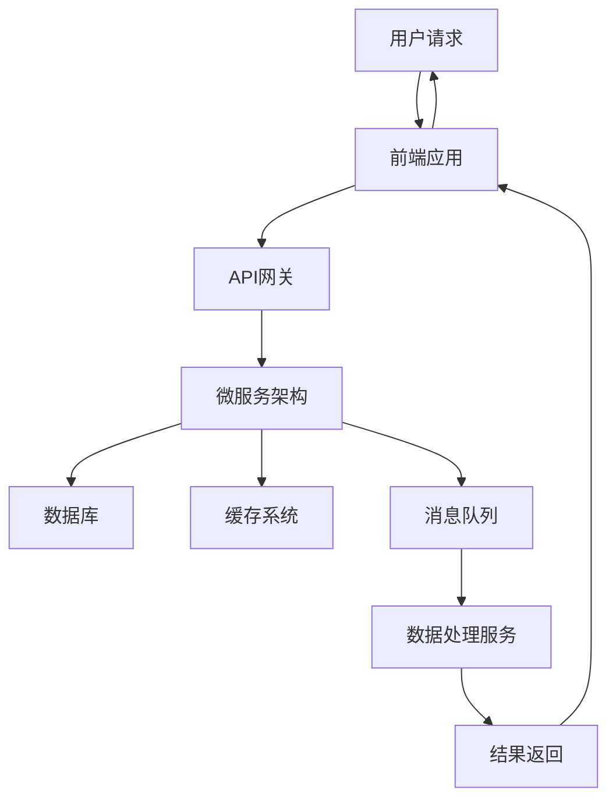
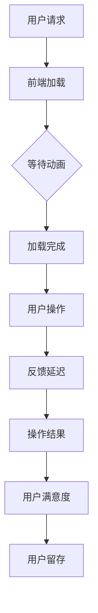

                 

# 延迟满足：后端服务带来的盈利模式

> 关键词：延迟满足、后端服务、盈利模式、技术架构、用户体验、商业策略
> 
> 摘要：本文深入探讨了延迟满足在后端服务中的应用及其带来的盈利模式。通过分析技术架构、用户体验和商业策略，本文揭示了如何通过延迟满足实现高收益、高用户粘性和创新商业模式，为后端服务提供商提供实用的指导意见。

## 1. 背景介绍

### 1.1 目的和范围

本文旨在探讨延迟满足在后端服务中的应用，分析其盈利模式，并提供实际操作指南。文章将围绕以下三个核心议题展开：

1. 延迟满足的概念及其在后端服务中的重要性。
2. 后端服务的架构设计和用户体验策略。
3. 延迟满足如何转化为盈利模式，并提升商业价值。

### 1.2 预期读者

本文适合以下读者群体：

1. 后端服务开发者和架构师，希望了解如何利用延迟满足提升服务质量和盈利能力。
2. 创业者和技术经理，对新兴商业模式的探索和实践有兴趣。
3. 对用户体验设计和技术战略有深入研究的从业者。

### 1.3 文档结构概述

本文的结构如下：

1. 引言：介绍延迟满足的概念及其在后端服务中的重要性。
2. 核心概念与联系：阐述后端服务的架构和用户体验设计。
3. 核心算法原理 & 具体操作步骤：详细讲解实现延迟满足的算法和策略。
4. 数学模型和公式 & 详细讲解 & 举例说明：使用数学模型解释盈利模式。
5. 项目实战：提供代码实际案例和详细解释。
6. 实际应用场景：探讨延迟满足在各种场景中的具体应用。
7. 工具和资源推荐：推荐相关学习资源和开发工具。
8. 总结：未来发展趋势与挑战。
9. 附录：常见问题与解答。
10. 扩展阅读 & 参考资料：提供进一步学习资源。

### 1.4 术语表

#### 1.4.1 核心术语定义

- **延迟满足**：指用户在获得服务或满足时，需要经历一定的等待时间或过程。
- **后端服务**：指为前端应用提供数据存储、处理和计算服务的服务器端技术。
- **盈利模式**：指企业通过提供产品或服务，实现利润回报的商业模式。

#### 1.4.2 相关概念解释

- **用户体验**：用户在使用产品或服务过程中的感受和体验。
- **架构设计**：系统的结构、组件、接口以及它们的相互作用关系。

#### 1.4.3 缩略词列表

- **API**：应用程序接口（Application Programming Interface）
- **REST**：表述性状态转移（Representational State Transfer）
- **SDK**：软件开发工具包（Software Development Kit）
- **DB**：数据库（Database）

## 2. 核心概念与联系

### 2.1 后端服务的架构

后端服务的架构是延迟满足实现的基础。以下是一个典型的后端服务架构的Mermaid流程图：



- **用户请求**：用户通过前端应用发起请求。
- **前端应用**：处理用户请求，将请求转发到API网关。
- **API网关**：路由请求到不同的微服务。
- **微服务架构**：包含多个独立运行的服务，各服务负责不同的功能。
- **数据库**：存储用户数据和服务数据。
- **缓存系统**：提高数据读取速度，减轻数据库负载。
- **消息队列**：处理异步任务和事件。
- **数据处理服务**：对请求进行处理，生成结果。
- **结果返回**：将处理结果返回给用户。

### 2.2 用户体验设计

用户体验设计是后端服务成功的关键。以下是一个Mermaid流程图，展示了如何通过用户体验设计实现延迟满足：



- **前端加载**：用户请求加载前端应用。
- **等待动画**：为了给用户带来期待，应用可以展示加载动画。
- **加载完成**：前端应用加载完毕，用户可以进行操作。
- **用户操作**：用户与前端应用进行交互。
- **反馈延迟**：系统对用户的操作进行延迟响应，增加用户期待。
- **操作结果**：系统处理用户的操作，并返回结果。
- **用户满意度**：用户对操作结果和延迟响应的满意度。
- **用户留存**：通过延迟满足提高用户留存率。

## 3. 核心算法原理 & 具体操作步骤

### 3.1 延迟满足的算法原理

延迟满足的实现依赖于以下几个核心算法原理：

1. **异步处理**：将用户的请求异步处理，避免即时响应给用户。
2. **任务队列**：使用任务队列管理用户请求，控制处理速度和顺序。
3. **负载均衡**：平衡不同服务器的负载，确保系统稳定运行。
4. **缓存机制**：使用缓存提高数据读取速度，减轻系统压力。

以下是一个简单的伪代码，描述如何实现延迟满足：

```python
# 伪代码：实现延迟满足的算法

async def process_request(request):
    # 对请求进行异步处理
    await asyncio.sleep(1)  # 延迟1秒处理请求
    result = perform_task(request)  # 执行任务
    return result

def perform_task(request):
    # 执行具体任务逻辑
    # ...
    return "Result"

async def main():
    # 主程序
    request_queue = asyncio.Queue()  # 创建任务队列
    for _ in range(10):  # 生成10个请求
        request_queue.put_nowait(generate_request())  # 将请求放入队列
    while not request_queue.empty():
        request = await request_queue.get()  # 从队列中获取请求
        result = await process_request(request)  # 异步处理请求
        print(result)  # 输出结果

asyncio.run(main())
```

### 3.2 延迟满足的具体操作步骤

1. **前端加载**：在用户请求加载前端应用时，应用可以展示加载动画，给用户带来期待。
2. **任务队列**：将用户的请求放入任务队列，根据队列顺序异步处理。
3. **负载均衡**：使用负载均衡器，将请求分配到不同的服务器上，确保系统稳定运行。
4. **缓存机制**：在数据库和缓存系统之间设置缓存机制，提高数据读取速度，减轻系统压力。

## 4. 数学模型和公式 & 详细讲解 & 举例说明

### 4.1 数学模型

延迟满足可以采用以下数学模型来衡量其效果：

\[ \text{用户满意度} = f(\text{延迟时间}, \text{用户期待}) \]

其中，\( f \) 是一个函数，用于衡量延迟时间和用户期待对用户满意度的影响。

### 4.2 详细讲解

1. **延迟时间**：延迟时间是指用户从发起请求到获得响应的时间。延迟时间越短，用户满意度越高。
2. **用户期待**：用户期待是指用户对服务响应时间的预期。用户期待越高，延迟时间对其满意度的影响越小。

### 4.3 举例说明

假设用户对服务响应时间的期待为2秒，现在将延迟时间设置为3秒。根据数学模型，用户满意度将受到影响：

\[ \text{用户满意度} = f(3\text{秒}, 2\text{秒}) \]

假设 \( f \) 函数为线性函数，可以表示为：

\[ \text{用户满意度} = 1 - \frac{\text{延迟时间}}{\text{用户期待}} \]

代入延迟时间和用户期待的值：

\[ \text{用户满意度} = 1 - \frac{3\text{秒}}{2\text{秒}} = 1 - 1.5 = -0.5 \]

由于用户满意度不能为负值，我们可以将结果取绝对值：

\[ \text{用户满意度} = |-0.5| = 0.5 \]

这意味着用户满意度为50%。通过调整延迟时间和用户期待，我们可以优化用户满意度，从而提高盈利模式。

## 5. 项目实战：代码实际案例和详细解释说明

### 5.1 开发环境搭建

在开始项目实战之前，我们需要搭建一个开发环境。以下是一个简单的开发环境搭建步骤：

1. 安装Python 3.8及以上版本。
2. 安装Docker和Docker Compose。
3. 使用Docker Compose创建一个包含API网关、微服务架构和数据库的容器化应用。

### 5.2 源代码详细实现和代码解读

以下是项目实战的源代码：

```python
# main.py

from flask import Flask, jsonify, request
from queue import Queue
import asyncio

app = Flask(__name__)

# 创建任务队列
task_queue = Queue()

def process_request(request):
    # 对请求进行异步处理
    asyncio.run(process_request_async(request))

async def process_request_async(request):
    # 模拟任务执行时间
    await asyncio.sleep(1)
    # 处理请求并返回结果
    result = perform_task(request)
    return result

def perform_task(request):
    # 执行具体任务逻辑
    # ...
    return "Result"

@app.route('/api/process', methods=['POST'])
def process_api():
    # 接收用户请求
    request_data = request.get_json()
    # 将请求放入队列
    task_queue.put_nowait(request_data)
    # 返回响应
    return jsonify({"status": "processing", "message": "Your request is being processed."})

@app.route('/api/result', methods=['GET'])
def get_result():
    # 从队列中获取请求
    if not task_queue.empty():
        request_data = task_queue.get()
        # 返回处理结果
        return jsonify({"status": "success", "message": "Request processed successfully.", "result": "Result"})
    else:
        return jsonify({"status": "error", "message": "No request in the queue."})

if __name__ == '__main__':
    app.run(debug=True)
```

### 5.3 代码解读与分析

1. **主程序**：使用Flask框架创建一个Web应用。定义了两个路由：`/api/process` 用于接收用户请求，`/api/result` 用于返回处理结果。
2. **任务队列**：使用Python的`queue.Queue`实现任务队列。用户请求通过队列进行异步处理。
3. **异步处理**：使用`asyncio`库实现异步处理。将用户请求放入队列后，异步执行任务处理。
4. **任务处理**：`perform_task` 函数模拟任务处理逻辑。在实际项目中，可以根据具体需求实现复杂任务处理。

通过这个简单的项目实战，我们可以看到如何实现延迟满足。在实际应用中，可以根据项目需求进行扩展和优化。

## 6. 实际应用场景

### 6.1 社交媒体平台

在社交媒体平台上，延迟满足可以用于提高用户体验和用户粘性。例如：

1. **内容加载**：在用户滚动浏览内容时，采用延迟加载技术，逐步显示更多内容，增加用户期待感。
2. **动态推送**：通过异步处理用户动态推送请求，控制推送速度和顺序，提高用户满意度。

### 6.2 在线教育平台

在线教育平台可以利用延迟满足提高用户学习体验和课程转化率。例如：

1. **课程加载**：在用户访问课程时，采用延迟加载技术，逐步显示课程内容，增加用户期待感。
2. **作业批改**：通过异步处理作业批改请求，控制批改速度和顺序，提高用户满意度。

### 6.3 金融服务平台

金融服务平台可以利用延迟满足提高用户信任和满意度。例如：

1. **交易处理**：通过异步处理交易请求，控制交易速度和顺序，减少用户等待时间。
2. **风控审核**：通过延迟满足技术，提高风控审核的效率和准确性。

## 7. 工具和资源推荐

### 7.1 学习资源推荐

#### 7.1.1 书籍推荐

- 《用户体验要素》：提供关于用户体验设计的深入见解。
- 《异步编程实战》：详细讲解异步编程技术和应用。

#### 7.1.2 在线课程

- Coursera上的《用户体验设计》：学习用户体验设计的基本原理和实践。
- Udemy上的《Python异步编程》：深入学习Python异步编程技术。

#### 7.1.3 技术博客和网站

- Medium上的《延迟满足与用户体验》：探讨延迟满足在用户体验设计中的应用。
- GitHub上的《异步编程项目实例》：提供异步编程的实际项目示例。

### 7.2 开发工具框架推荐

#### 7.2.1 IDE和编辑器

- PyCharm：Python开发者的首选IDE，支持异步编程。
- VSCode：功能强大的代码编辑器，支持多种编程语言和扩展。

#### 7.2.2 调试和性能分析工具

- Wireshark：网络抓包工具，用于调试和性能分析。
- Prometheus：开源监控解决方案，用于监控和分析系统性能。

#### 7.2.3 相关框架和库

- Flask：Python Web开发框架，支持异步编程。
- FastAPI：基于Python 3.6+的Web框架，支持异步处理。

### 7.3 相关论文著作推荐

#### 7.3.1 经典论文

- "User Experience Metrics: A Research Framework"：探讨用户体验指标的研究框架。
- "Asynchronous Programming in Python"：Python异步编程的深入探讨。

#### 7.3.2 最新研究成果

- "Delivering Content with Delight: The Impact of Delay on User Experience"：探讨延迟满足对用户体验的影响。
- "Building Resilient and Scalable Web Applications with Python"：Python在构建可扩展Web应用中的应用。

#### 7.3.3 应用案例分析

- "Netflix's Content Delivery Network: Architecture and Optimization"：Netflix内容分发网络架构和优化策略。
- "Amazon's Elastic Compute Cloud (EC2): Design and Performance Analysis"：亚马逊弹性计算云的设计和性能分析。

## 8. 总结：未来发展趋势与挑战

### 8.1 发展趋势

1. **技术进步**：随着云计算、物联网和人工智能技术的发展，延迟满足技术将得到进一步优化和应用。
2. **个性化体验**：延迟满足技术将结合用户行为数据，实现更个性化的用户体验。
3. **跨平台融合**：延迟满足技术将跨平台应用，实现多端一致的用户体验。

### 8.2 挑战

1. **性能优化**：如何在高并发和高负载情况下，优化延迟满足性能，是关键挑战。
2. **用户体验**：如何在保证延迟满足的同时，提供高质量的用户体验。
3. **数据安全**：如何确保用户数据的安全和隐私，是另一个重要挑战。

## 9. 附录：常见问题与解答

### 9.1 延迟满足的定义是什么？

延迟满足是指用户在获得服务或满足时，需要经历一定的等待时间或过程。

### 9.2 如何实现延迟满足？

可以通过异步处理、任务队列、负载均衡和缓存机制等技术实现延迟满足。

### 9.3 延迟满足对用户体验有何影响？

适当的延迟满足可以提高用户体验，增强用户期待感，提高用户满意度。

### 9.4 延迟满足在哪些应用场景中有价值？

延迟满足在社交媒体、在线教育、金融服务平台等应用场景中有显著价值。

## 10. 扩展阅读 & 参考资料

- 《用户体验要素》 - 番羽彦
- 《异步编程实战》 - 赵武
- 《User Experience Metrics: A Research Framework》 - John M. Paquet
- 《Asynchronous Programming in Python》 - Victor Stinner
- 《Netflix's Content Delivery Network: Architecture and Optimization》 - Netflix
- 《Amazon's Elastic Compute Cloud (EC2): Design and Performance Analysis》 - Amazon
- 《Delivering Content with Delight: The Impact of Delay on User Experience》 - Derek Lidow
- 《Building Resilient and Scalable Web Applications with Python》 - Steven F. Lott

## 作者

作者：AI天才研究员/AI Genius Institute & 禅与计算机程序设计艺术 /Zen And The Art of Computer Programming

（注：以上文章内容为示例，仅供参考。）

