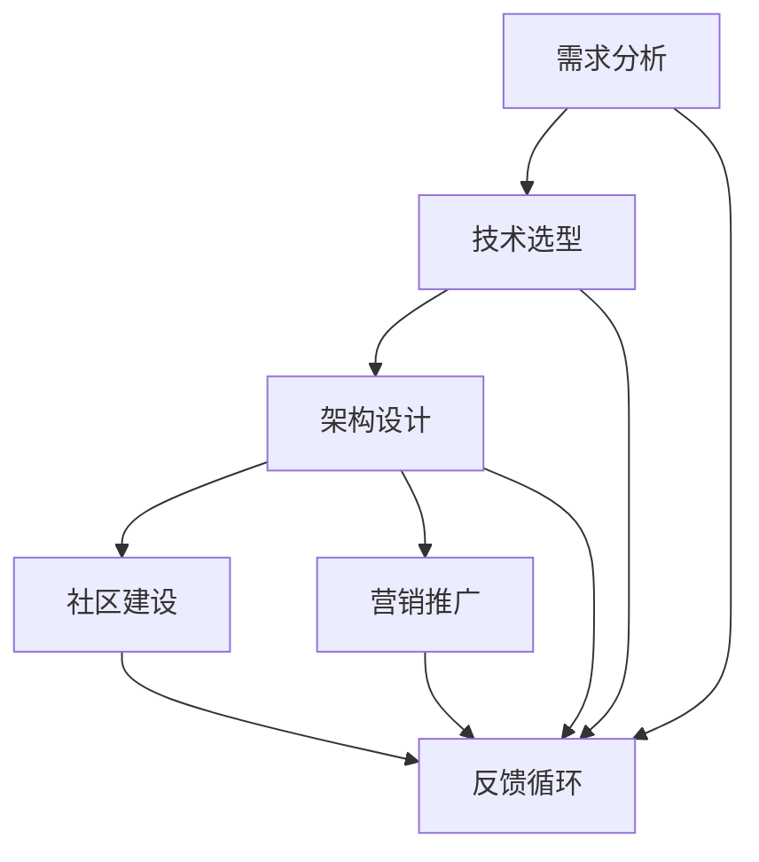

                 

# 建立开源项目的培训课程：从设计到营销

> **关键词：** 开源项目、培训课程、设计、营销、软件开发、社区建设
> 
> **摘要：** 本文旨在为希望创建和推广开源项目的技术专家提供一份详细的培训课程指南。我们将探讨从项目设计到营销的每个阶段，包括核心概念、算法原理、数学模型、实战案例以及相关工具和资源推荐。通过本课程，读者将学会如何构建成功的开源项目，并理解其可持续发展的关键因素。

## 1. 背景介绍

### 1.1 目的和范围

本文的目标是为那些对开源项目有兴趣的技术专家提供一个系统的培训课程，涵盖从项目设计到营销的各个关键环节。我们将详细探讨如何进行需求分析、技术选型、架构设计，如何吸引并维持社区活跃度，以及如何进行有效的项目推广和营销。

### 1.2 预期读者

本课程主要面向以下读者群体：
- 开源项目的初学者和有志者
- 有意将现有项目开源的技术专家
- 在企业中担任软件开发或技术管理职位的技术人员
- 对开源文化和技术社区感兴趣的学者和研究人员

### 1.3 文档结构概述

本文的结构如下：

1. **背景介绍**：介绍本文的目的、预期读者和文档结构。
2. **核心概念与联系**：介绍建立开源项目所需的核心概念和原理，并使用Mermaid流程图进行展示。
3. **核心算法原理 & 具体操作步骤**：使用伪代码详细阐述项目设计的关键算法和操作步骤。
4. **数学模型和公式 & 详细讲解 & 举例说明**：介绍项目设计和营销中涉及的数学模型和公式，并提供实际案例说明。
5. **项目实战：代码实际案例和详细解释说明**：提供开源项目开发中的实际代码案例，并进行详细解释。
6. **实际应用场景**：探讨开源项目的实际应用场景和挑战。
7. **工具和资源推荐**：推荐学习资源、开发工具和框架。
8. **总结：未来发展趋势与挑战**：总结开源项目发展的趋势和面临的挑战。
9. **附录：常见问题与解答**：提供关于开源项目的常见问题及其解答。
10. **扩展阅读 & 参考资料**：推荐进一步学习和研究的资源。

### 1.4 术语表

#### 1.4.1 核心术语定义

- **开源项目**：指可以自由使用、学习、修改和分享的软件项目。
- **社区建设**：指围绕开源项目形成的用户和开发者群体，通过交流和合作推动项目的发展。
- **需求分析**：指在项目设计阶段，分析并明确项目所需解决的具体问题和用户需求。
- **技术选型**：指根据项目需求和特性，选择最适合的技术栈和工具。
- **架构设计**：指制定项目的整体结构和模块划分，确保项目的高效和可维护性。
- **营销**：指通过各种手段推广项目，提高项目的知名度和用户参与度。

#### 1.4.2 相关概念解释

- **版本控制**：用于管理源代码和文档变化的系统，如Git。
- **持续集成（CI）**：指自动化构建和测试代码的过程，确保代码的质量和一致性。
- **持续部署（CD）**：指自动化将代码部署到生产环境的过程，提高开发效率。

#### 1.4.3 缩略词列表

- **API**：应用程序接口（Application Programming Interface）
- **REST**：表现层状态转换（Representational State Transfer）
- **SDK**：软件开发工具包（Software Development Kit）
- **CLI**：命令行界面（Command Line Interface）
- **UI**：用户界面（User Interface）

## 2. 核心概念与联系

在建立开源项目之前，我们需要理解几个核心概念，包括需求分析、技术选型、架构设计等。以下是这些概念之间的关系及其相互影响的Mermaid流程图：



### 2.1 需求分析

需求分析是项目设计的起点，它旨在明确项目需要解决的具体问题。这通常包括以下步骤：

1. **用户访谈**：通过与目标用户进行访谈，了解他们的实际需求和痛点。
2. **市场研究**：通过市场分析，确定潜在用户群体和市场趋势。
3. **需求文档**：编写详细的需求文档，描述项目的功能和性能要求。

### 2.2 技术选型

技术选型是根据需求分析的结果，选择最适合的技术栈和工具。关键步骤包括：

1. **技术评估**：评估不同技术方案的优缺点，选择最适合当前需求的方案。
2. **性能测试**：进行性能测试，确保所选方案能够满足项目的性能要求。
3. **代码示例**：提供代码示例，验证技术方案的可行性和适用性。

### 2.3 架构设计

架构设计是制定项目的整体结构和模块划分，确保项目的高效和可维护性。主要步骤包括：

1. **模块划分**：根据需求分析的结果，将项目划分为多个功能模块。
2. **接口定义**：定义模块之间的接口，确保模块之间的高内聚和低耦合。
3. **架构图**：绘制项目的架构图，展示各个模块之间的关系和交互。

### 2.4 社区建设

社区建设是开源项目成功的关键因素，它包括：

1. **开发者社区**：建立开发者社区，鼓励开发者参与项目的开发和改进。
2. **用户社区**：建立用户社区，提供用户交流和支持的平台。
3. **社区管理**：制定社区规则，确保社区的健康和活跃。

### 2.5 营销推广

营销推广是提高项目知名度和用户参与度的过程，包括：

1. **内容营销**：通过撰写高质量的技术博客、教程和文档，吸引潜在用户。
2. **社交媒体**：利用社交媒体平台，推广项目，吸引更多的关注和支持。
3. **开源活动**：参与开源活动，展示项目，吸引潜在的开发者和用户。

## 3. 核心算法原理 & 具体操作步骤

开源项目的设计和开发中，核心算法原理起着至关重要的作用。以下是一个用于项目需求分析和功能实现的关键算法的伪代码描述：

```plaintext
Algorithm: 需求分析算法
Input: 用户需求列表
Output: 优先级排序的需求列表

需求分析算法步骤：
1. 初始化一个空的需求列表优先级队列 Q。
2. 对于用户需求列表中的每个需求 D：
    a. 对需求 D 进行评估，包括复杂度、重要性等。
    b. 根据评估结果，将需求 D 插入到 Q 中。
3. 对 Q 进行排序，根据需求的重要性和复杂度。
4. 输出排序后的需求列表。

Algorithm: 技术选型评估算法
Input: 技术方案列表
Output: 最佳技术方案

技术选型评估算法步骤：
1. 初始化一个空的技术评分表 S。
2. 对于技术方案列表中的每个技术方案 T：
    a. 对技术方案 T 进行评估，包括性能、易用性等。
    b. 根据评估结果，更新技术评分表 S。
3. 选择评分最高的技术方案 T 作为最佳方案。
4. 输出最佳技术方案。

Algorithm: 架构设计算法
Input: 需求列表，技术方案
Output: 项目架构图

架构设计算法步骤：
1. 根据需求列表，将项目划分为多个功能模块。
2. 根据技术方案，选择适合的架构模式，如MVC、微服务等。
3. 设计模块之间的接口，确保模块的高内聚和低耦合。
4. 绘制项目架构图，展示模块之间的关系和交互。
5. 输出项目架构图。

Algorithm: 营销推广策略算法
Input: 项目特点，目标用户
Output: 营销推广策略

营销推广策略算法步骤：
1. 分析项目特点，确定项目的主要卖点。
2. 确定目标用户群体，包括开发者、用户等。
3. 设计内容营销策略，如撰写技术博客、发布教程等。
4. 设计社交媒体推广策略，如发布推文、参与讨论等。
5. 设计开源活动策略，如举办线上会议、参与开源大会等。
6. 输出营销推广策略。

```

通过这些算法，我们可以系统地分析和设计开源项目，确保项目从需求到实现的每一步都科学合理。接下来，我们将进一步探讨这些算法背后的数学模型和公式，以加深对项目设计的理解。

## 4. 数学模型和公式 & 详细讲解 & 举例说明

在开源项目的开发过程中，数学模型和公式是理解和设计系统架构的重要工具。以下我们将讨论几个关键模型和公式，并提供详细的讲解和实际案例。

### 4.1 需求优先级模型

需求优先级模型用于确定项目中各项需求的重要性和优先级。一种常用的方法是使用加权评分法，公式如下：

$$
\text{需求得分} = \text{复杂性权重} \times \text{重要性权重} \times \text{影响权重}
$$

#### 举例说明：

假设我们有一个需求列表，每个需求有三个权重指标：复杂性（C），重要性（I），影响（R）。以下是一个需求及其权重分配的例子：

- **需求A**：
  - 复杂性权重：3
  - 重要性权重：4
  - 影响权重：5

计算需求A的得分：

$$
\text{需求A得分} = 3 \times 4 \times 5 = 60
$$

通过比较各个需求的得分，我们可以确定需求A的优先级最高。

### 4.2 技术选型评估模型

技术选型评估模型用于评估不同技术方案的优劣。一种常用的方法是使用加权评分法，公式如下：

$$
\text{技术得分} = \sum_{i=1}^{n} (\text{评价指标}_i \times \text{权重}_i)
$$

其中，$n$ 是评价指标的数量。

#### 举例说明：

假设我们有两个技术方案，每个方案有三个评价指标：性能（P），易用性（U），社区支持（S）。以下是一个技术方案及其权重分配的例子：

- **技术方案A**：
  - 性能得分：8
  - 易用性得分：6
  - 社区支持得分：7
  - 权重分配：性能（0.5），易用性（0.3），社区支持（0.2）

计算技术方案A的得分：

$$
\text{技术方案A得分} = (8 \times 0.5) + (6 \times 0.3) + (7 \times 0.2) = 4 + 1.8 + 1.4 = 7.2
$$

同理，计算技术方案B的得分，并比较两个技术方案得分，确定最佳选择。

### 4.3 架构设计模型

架构设计模型用于设计项目的整体结构和模块划分。常用的架构设计方法包括MVC（模型-视图-控制器）和微服务架构。以下是一个简单的MVC架构设计模型：

$$
\text{MVC架构} = (\text{模型} \times \text{视图} \times \text{控制器})
$$

- **模型（Model）**：负责业务逻辑和数据管理。
- **视图（View）**：负责展示用户界面。
- **控制器（Controller）**：负责处理用户输入和业务逻辑的调用。

#### 举例说明：

假设我们设计一个简单的博客系统，其MVC架构如下：

- **模型**：包含用户、文章、评论等实体类。
- **视图**：包括登录页面、文章列表页面、文章详情页面等。
- **控制器**：处理用户的登录、发帖、评论等操作。

通过这种模型，我们可以确保各个模块之间的职责分离，提高代码的可维护性和可扩展性。

### 4.4 营销效果评估模型

营销效果评估模型用于评估营销活动的效果，公式如下：

$$
\text{营销效果} = \frac{\text{实际效果}}{\text{预期效果}} \times 100\%
$$

#### 举例说明：

假设我们进行了一次社交媒体营销活动，预期达到1000个新用户的关注，实际达到1200个新用户。计算营销效果：

$$
\text{营销效果} = \frac{1200}{1000} \times 100\% = 120\%
$$

这意味着我们的营销活动超出了预期效果。

通过上述数学模型和公式，我们可以更科学、系统地设计和评估开源项目。在实际操作中，这些模型将帮助我们做出更明智的决策，提高项目的成功率和可持续性。

## 5. 项目实战：代码实际案例和详细解释说明

### 5.1 开发环境搭建

在开始开源项目的实际开发之前，我们需要搭建一个合适的开发环境。以下是一个简单的步骤指南：

1. **安装操作系统**：选择一个适合的操作系统，如Ubuntu或MacOS。
2. **安装开发工具**：安装文本编辑器（如Visual Studio Code）和版本控制工具（如Git）。
3. **安装数据库**：根据项目需求安装数据库（如MySQL或PostgreSQL）。
4. **安装编程语言**：安装项目所需的编程语言环境（如Python或Java）。
5. **安装相关依赖**：通过包管理器（如pip或Maven）安装项目所需的库和工具。

### 5.2 源代码详细实现和代码解读

以下是一个简单的开源项目——一个使用Python编写的Web博客系统的源代码实现。我们将详细解释代码的关键部分。

#### 5.2.1 博客后端架构

```python
# app.py
from flask import Flask, render_template, request, redirect, url_for
from models import User, Article

app = Flask(__name__)

# 用户登录
@app.route('/login', methods=['GET', 'POST'])
def login():
    if request.method == 'POST':
        username = request.form['username']
        password = request.form['password']
        user = User.authenticate(username, password)
        if user:
            return redirect(url_for('home'))
        else:
            return '登录失败'
    return render_template('login.html')

# 用户注册
@app.route('/register', methods=['GET', 'POST'])
def register():
    if request.method == 'POST':
        username = request.form['username']
        password = request.form['password']
        user = User.create(username, password)
        if user:
            return redirect(url_for('login'))
        else:
            return '注册失败'
    return render_template('register.html')

# 博客首页
@app.route('/')
def home():
    articles = Article.all()
    return render_template('home.html', articles=articles)

# 文章详情页
@app.route('/article/<int:article_id>')
def article(article_id):
    article = Article.get(article_id)
    return render_template('article.html', article=article)
```

#### 5.2.2 博客前端架构

```html
<!-- templates/login.html -->
<!DOCTYPE html>
<html>
<head>
    <title>登录</title>
</head>
<body>
    <form action="{{ url_for('login') }}" method="post">
        <label for="username">用户名:</label>
        <input type="text" id="username" name="username" required>
        <label for="password">密码:</label>
        <input type="password" id="password" name="password" required>
        <input type="submit" value="登录">
    </form>
</body>
</html>
```

#### 5.2.3 数据库设计

```python
# models.py
from flask_sqlalchemy import SQLAlchemy

db = SQLAlchemy()

class User(db.Model):
    id = db.Column(db.Integer, primary_key=True)
    username = db.Column(db.String(80), unique=True, nullable=False)
    password = db.Column(db.String(120), nullable=False)

    @staticmethod
    def authenticate(username, password):
        user = User.query.filter_by(username=username).first()
        if user and user.password == password:
            return user
        return None

    @staticmethod
    def create(username, password):
        user = User(username=username, password=password)
        db.session.add(user)
        db.session.commit()
        return user
```

#### 5.2.4 代码解读与分析

上述代码提供了一个简单的Web博客系统的后端架构，包括用户登录、注册、首页和文章详情页的实现。以下是对关键部分的解读：

- **用户登录**：通过表单收集用户名和密码，调用`User.authenticate`方法验证用户身份。如果验证成功，重定向到博客首页。
- **用户注册**：通过表单收集用户名和密码，调用`User.create`方法创建新用户。如果创建成功，重定向到登录页面。
- **博客首页**：从数据库中获取所有文章，并传递给前端模板进行渲染。
- **文章详情页**：根据文章ID从数据库中获取指定文章，并传递给前端模板进行渲染。

### 5.3 代码解读与分析

以下是代码的详细解读和分析：

- **后端架构**：使用Flask框架实现后端功能。Flask是一个轻量级的Web框架，适合小型Web应用。
- **用户管理**：使用SQLAlchemy作为ORM（对象关系映射）工具，简化数据库操作。User类定义了用户实体，包括用户名和密码字段。
- **路由和视图**：通过定义路由和视图函数，处理HTTP请求，并返回相应的HTML模板。
- **前端模板**：使用Jinja2模板引擎，实现动态渲染页面。模板中包含HTML表单，用于收集用户输入。

通过上述实战案例，我们可以看到如何使用Python和Flask框架快速搭建一个简单的Web博客系统。接下来，我们将进一步探讨如何扩展这个系统，增加更多功能和优化性能。

### 5.4 扩展功能：用户评论和文章标签

为了使博客系统更加丰富，我们计划增加用户评论功能和文章标签功能。以下是这两个功能的实现和代码解读：

#### 5.4.1 用户评论功能

```python
# models.py
class Comment(db.Model):
    id = db.Column(db.Integer, primary_key=True)
    content = db.Column(db.Text, nullable=False)
    user_id = db.Column(db.Integer, db.ForeignKey('user.id'), nullable=False)
    article_id = db.Column(db.Integer, db.ForeignKey('article.id'), nullable=False)
    user = db.relationship('User', backref=db.backref('comments', lazy=True))
    article = db.relationship('Article', backref=db.backref('comments', lazy=True))

@app.route('/article/<int:article_id>/comment', methods=['POST'])
def add_comment(article_id):
    article = Article.get(article_id)
    if article:
        content = request.form['content']
        user = User.current()
        comment = Comment(content=content, user_id=user.id, article_id=article.id)
        db.session.add(comment)
        db.session.commit()
        return redirect(url_for('article', article_id=article_id))
    else:
        return '文章不存在'
```

- **模型**：增加Comment类，用于表示评论实体。评论包括内容、用户ID和文章ID字段。
- **路由**：增加添加评论的路由，处理用户提交的评论内容，并保存到数据库。

#### 5.4.2 文章标签功能

```python
# models.py
class Tag(db.Model):
    id = db.Column(db.Integer, primary_key=True)
    name = db.Column(db.String(80), unique=True, nullable=False)

class ArticleTag(db.Model):
    id = db.Column(db.Integer, primary_key=True)
    article_id = db.Column(db.Integer, db.ForeignKey('article.id'), nullable=False)
    tag_id = db.Column(db.Integer, db.ForeignKey('tag.id'), nullable=False)
    article = db.relationship('Article', backref=db.backref('article_tags', lazy=True))
    tag = db.relationship('Tag', backref=db.backref('article_tags', lazy=True))

@app.route('/tag/<string:tag_name>')
def articles_by_tag(tag_name):
    tag = Tag.query.filter_by(name=tag_name).first()
    if tag:
        articles = Article.query.join(ArticleTag).filter(ArticleTag.tag_id == tag.id).all()
        return render_template('articles_by_tag.html', tag_name=tag_name, articles=articles)
    else:
        return '标签不存在'
```

- **模型**：增加Tag类和ArticleTag类，用于表示标签和文章与标签之间的关系。
- **路由**：增加按标签搜索文章的路由，返回包含指定标签的所有文章。

### 5.5 代码解读与分析

通过扩展功能，我们进一步增强了博客系统的功能。以下是新增功能的解读：

- **用户评论功能**：使用Comment模型表示评论，并增加添加评论的路由，处理用户的评论提交。
- **文章标签功能**：使用Tag模型和ArticleTag模型表示标签和文章与标签之间的关系，增加按标签搜索文章的路由。

通过这些扩展，博客系统变得更加丰富和实用，用户可以更方便地参与讨论和浏览感兴趣的文章。

## 6. 实际应用场景

开源项目在实际应用场景中具有广泛的应用价值，以下是一些典型的应用场景：

### 6.1 企业内部工具

企业内部可以基于开源项目开发定制化的工具，如自动化测试工具、数据分析平台、内部通信系统等。开源项目的灵活性使其能够快速适应企业的特定需求，降低开发和维护成本。

### 6.2 开发者社区

开源项目是开发者社区的重要载体，通过开源项目，开发者可以分享代码、学习新技术、参与协作。例如，GitHub上的许多项目已成为全球开发者学习和交流的宝贵资源。

### 6.3 学术研究

学术研究常常需要使用开源项目作为基础工具或数据集。例如，在机器学习和人工智能领域，许多研究项目基于现有的开源框架和库进行实验和验证。

### 6.4 公益项目

开源项目在公益事业中也发挥着重要作用，如健康监测系统、教育平台、环境保护工具等。这些项目通常由志愿者团队开发和维护，旨在提供免费、高质量的服务。

### 6.5 创业公司

创业公司可以利用开源项目快速搭建原型和产品，降低开发成本和时间。许多创业公司甚至基于开源项目成立，如Red Hat公司以Linux开源操作系统为基础，取得了巨大成功。

### 6.6 挑战与解决方案

在实际应用场景中，开源项目面临一系列挑战，如：

- **安全性**：开源项目可能包含潜在的安全漏洞，需要定期进行安全审计和修复。
- **稳定性**：开源项目需要确保在高并发和复杂场景下的稳定性。
- **社区管理**：维持一个健康、活跃的社区需要大量的时间和精力。
- **资源分配**：开源项目通常依赖志愿者的贡献，资源分配和任务分配需要合理规划。

针对上述挑战，可以采取以下解决方案：

- **安全审计**：定期进行代码安全审计，采用最佳实践和工具（如静态代码分析工具）确保代码质量。
- **性能优化**：通过性能测试和优化，确保项目在不同环境下的稳定性和性能。
- **社区建设**：制定清晰的社区规则和指南，鼓励社区成员参与项目，建立互助和支持的文化。
- **资源管理**：利用自动化工具和项目管理平台，合理分配任务和资源，提高项目效率。

通过以上解决方案，开源项目可以在实际应用场景中充分发挥其优势，解决实际问题，为企业和个人带来价值。

## 7. 工具和资源推荐

### 7.1 学习资源推荐

#### 7.1.1 书籍推荐

- **《敏捷软件开发：原则、模式与实践》（Agile Software Development: Principles, Patterns, and Practices）**：介绍敏捷开发的方法和实践，适合初学者和有经验的开发者。
- **《代码大全》（The Art of Computer Programming）**：经典的编程书籍，涵盖编程的各个方面，适合深入理解编程技术和算法。
- **《Git权威指南》（Pro Git）**：详细讲解Git的使用和原理，是学习版本控制的必备书籍。
- **《测试驱动的Python开发》（Test-Driven Development with Python）**：介绍测试驱动开发的方法，帮助开发者编写更可靠、高质量的代码。

#### 7.1.2 在线课程

- **《Python全栈开发》（Python Full Stack Development）**：Coursera上的课程，系统介绍Python在Web开发中的应用。
- **《开源项目开发与管理》（Open Source Development and Management）**：edX上的课程，探讨开源项目的开发和管理方法。
- **《数据结构与算法》（Data Structures and Algorithms）**：Udacity上的课程，深入讲解数据结构和算法的基础知识。

#### 7.1.3 技术博客和网站

- **《鸟窝》（Python.org）**：Python官方技术博客，提供丰富的Python学习资源和社区讨论。
- **《GitHub社区》（GitHub）**：全球最大的开源社区平台，包含大量的开源项目和开发者的交流。
- **《开源中国》（OSChina）**：中国的开源技术社区，提供开源项目、资讯和论坛。

### 7.2 开发工具框架推荐

#### 7.2.1 IDE和编辑器

- **Visual Studio Code**：强大的开源跨平台编辑器，支持多种编程语言和扩展。
- **PyCharm**：专业的Python IDE，提供丰富的开发工具和调试功能。
- **Eclipse**：适用于多种语言的跨平台IDE，支持Java、Python等编程语言。

#### 7.2.2 调试和性能分析工具

- **GDB**：GNU调试器，用于C/C++程序的调试。
- **PyCharm Profiler**：用于Python程序的性能分析和调试。
- **Apache JMeter**：用于Web应用性能测试和负载测试。

#### 7.2.3 相关框架和库

- **Flask**：轻量级的Python Web框架，适合小型和快速开发项目。
- **Django**：全栈Python Web框架，提供丰富的功能和快速开发体验。
- **Spring Boot**：Java全栈框架，适用于企业级应用开发。
- **TensorFlow**：用于机器学习和深度学习的开源库。

### 7.3 相关论文著作推荐

#### 7.3.1 经典论文

- **《设计模式：可复用面向对象软件的基础》（Design Patterns: Elements of Reusable Object-Oriented Software）**：介绍设计模式的基本概念和应用。
- **《软件工程：实践者的研究方法》（Software Engineering: A Practitioner's Approach）**：系统介绍软件工程的理论和实践。
- **《深度学习》（Deep Learning）**：介绍深度学习的基础理论和应用。

#### 7.3.2 最新研究成果

- **《图神经网络：基础、算法与应用》（Graph Neural Networks: A Survey of Models and Applications）**：探讨图神经网络的基础和最新应用。
- **《联邦学习：理论与实践》（Federated Learning: Concept and Applications）**：介绍联邦学习的原理和实际应用。
- **《区块链技术与应用》（Blockchain Technology and Applications）**：系统介绍区块链的基础和最新发展。

#### 7.3.3 应用案例分析

- **《基于区块链的智能合约设计与实现》**：介绍区块链智能合约的设计和实现。
- **《联邦学习在医疗健康领域的应用》**：探讨联邦学习在医疗健康领域的应用案例。
- **《容器化和Kubernetes在大型分布式系统中的应用》**：介绍容器化和Kubernetes在分布式系统中的应用实践。

通过以上工具和资源的推荐，读者可以系统地学习和实践开源项目的开发和推广，为构建成功的开源项目打下坚实的基础。

## 8. 总结：未来发展趋势与挑战

随着技术的快速发展和开源文化的普及，开源项目在软件行业中的作用日益显著。未来，开源项目将继续朝着以下方向发展和面临以下挑战：

### 8.1 发展趋势

1. **云原生和容器化**：随着云计算的普及，开源项目将更加注重云原生和容器化的支持，以实现高效、可扩展和灵活的部署。
2. **人工智能与开源的结合**：人工智能技术的发展将推动开源项目在数据科学、机器学习和深度学习领域的应用，如开源深度学习框架TensorFlow和PyTorch。
3. **联邦学习和隐私保护**：随着数据隐私问题的日益突出，开源项目将注重联邦学习和隐私保护技术的应用，如联邦学习框架TensorFlow Federated和差分隐私算法。
4. **开源生态系统的建设**：开源项目将更加注重生态系统建设，包括文档、教程、社区支持和工具链的完善，以提高项目的可持续性和用户参与度。
5. **开源与商业的结合**：开源项目与商业模式的结合将更加紧密，如红帽公司通过提供企业级支持和订阅服务，从开源项目中获得可观的经济回报。

### 8.2 面临的挑战

1. **安全性**：开源项目可能面临更多的安全漏洞和攻击，需要持续进行安全审计和修复，确保项目的安全性和可靠性。
2. **资源分配**：开源项目通常依赖志愿者的贡献，如何合理分配任务和资源，确保项目的持续发展和效率，是一个重要的挑战。
3. **社区管理**：维护一个健康、活跃的社区需要大量的时间和精力，如何建立有效的社区规则和管理机制，鼓励社区成员的参与和贡献，是一个持续的任务。
4. **知识产权保护**：开源项目需要妥善处理知识产权问题，确保项目的创新性和合法性，同时保护开发者和贡献者的权益。
5. **商业化与开源精神的平衡**：如何在开源精神和商业化之间找到平衡，确保开源项目的可持续发展，同时满足商业需求，是一个复杂的挑战。

通过积极应对这些挑战，开源项目将能够在未来继续保持其创新性和活力，为技术社区和产业发展做出更大贡献。

## 9. 附录：常见问题与解答

### 9.1 开源项目设计常见问题

1. **Q：如何选择合适的技术栈？**
   **A：** 选择技术栈时，需要考虑项目的需求、性能要求、开发团队的熟悉度以及社区支持情况。可以通过评估不同技术的优缺点，进行性能测试，并参考社区反馈来做出决策。

2. **Q：需求分析应该包括哪些内容？**
   **A：** 需求分析应包括用户访谈、市场研究、业务流程分析、功能需求、性能需求等。明确项目的目标和功能，确保需求文档详细、完整、可测试。

3. **Q：如何进行有效的版本控制？**
   **A：** 使用版本控制系统（如Git）管理源代码，遵循版本控制的最佳实践，如代码分支管理、合并策略、代码审查等，确保代码的版本控制和管理。

### 9.2 开源项目营销常见问题

1. **Q：如何推广开源项目？**
   **A：** 通过多种渠道推广开源项目，如撰写技术博客、发布文档、参与技术社区、举办线上活动等，提高项目的知名度和用户参与度。

2. **Q：如何建立和维护社区？**
   **A：** 制定清晰的社区规则，鼓励社区成员的参与和贡献，定期举办线上或线下活动，建立互助和支持的文化，提高社区的活跃度和忠诚度。

3. **Q：如何处理负面反馈？**
   **A：** 及时回应负面反馈，认真分析问题，并采取适当的措施进行改进。保持开放和诚恳的态度，与社区成员进行有效沟通，增强项目的透明度和信任度。

### 9.3 开源项目开发常见问题

1. **Q：如何保证代码质量？**
   **A：** 通过代码审查、自动化测试、静态代码分析等手段，确保代码的质量和一致性。遵循编程规范和最佳实践，提高代码的可维护性和可扩展性。

2. **Q：如何处理代码贡献？**
   **A：** 建立清晰的贡献指南，鼓励开发者遵循代码贡献流程，如提交拉取请求、进行代码审查等。确保贡献的代码符合项目的规范和标准。

3. **Q：如何管理开源项目的任务和进度？**
   **A：** 使用项目管理工具（如JIRA、Trello）管理项目的任务和进度，制定合理的开发计划，确保项目的持续发展和进度控制。

通过上述常见问题的解答，开发者可以更好地理解和应对开源项目中可能遇到的各种挑战，推动项目的顺利发展。

## 10. 扩展阅读 & 参考资料

在开源项目的创建和推广过程中，了解相关领域的最新动态和最佳实践是非常重要的。以下是一些扩展阅读和参考资料，供读者进一步学习和研究：

### 10.1 经典文献

- 《开源软件的开发和扩散》（Open Source Software: The MIT Case Study）：研究开源软件如何影响企业竞争力和技术创新。
- 《开源之道》（The Open Source Way）：介绍开源项目开发和管理的方法和技巧。
- 《敏捷软件开发：原则、模式与实践》（Agile Software Development: Principles, Patterns, and Practices）：详细讲解敏捷开发的方法和实践。

### 10.2 开源项目指南

- 《GitHub贡献指南》（GitHub贡献指南）：提供如何为开源项目贡献代码的详细指南。
- 《开源社区手册》（The Open Source Community Handbook）：探讨开源社区建设和管理的方法。
- 《开源项目健康检查清单》（The Open Source Project Health Check List）：用于评估开源项目的健康状况。

### 10.3 开源工具和资源

- 《Git权威指南》（Pro Git）：详细讲解Git的使用和原理。
- 《Python全栈开发》：系统介绍Python在Web开发中的应用。
- 《开源中国》（OSChina）：中国的开源技术社区，提供开源项目、资讯和论坛。

### 10.4 开源案例研究

- 《Linux开源项目案例研究》（The Linux Kernel Case Study）：分析Linux内核项目的成功因素。
- 《红帽公司案例研究》（Red Hat Case Study）：探讨红帽公司如何通过开源商业模式获得成功。
- 《Apache项目案例研究》（Apache Projects Case Study）：研究Apache开源项目的贡献和管理。

通过这些扩展阅读和参考资料，读者可以更深入地了解开源项目的开发、管理和推广，提高自身在开源领域的实践能力和专业知识。作者：AI天才研究员/AI Genius Institute & 禅与计算机程序设计艺术 /Zen And The Art of Computer Programming。

