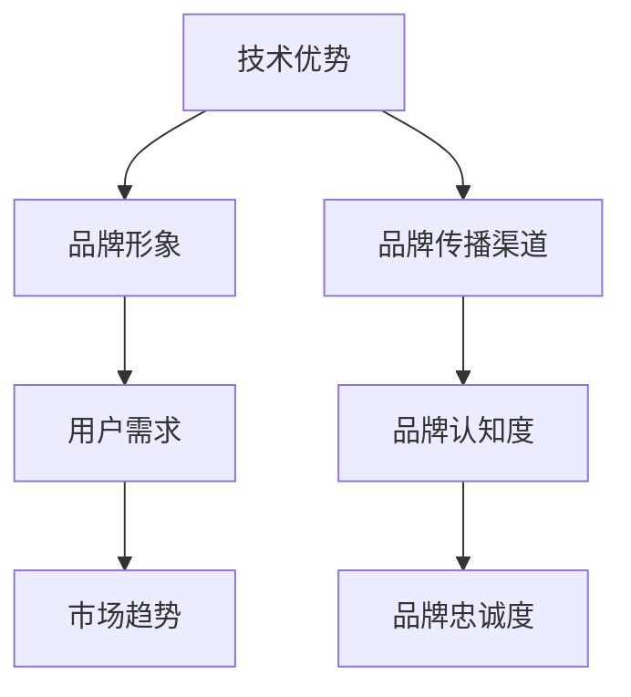
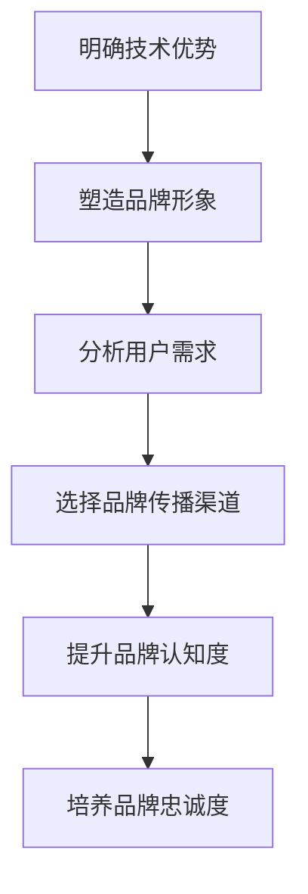
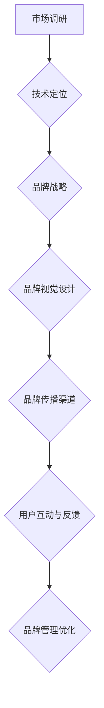
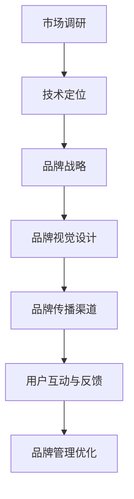

                 

### 文章标题

《开发者大会与技术沙龙：创业公司的技术品牌营销》

### 关键词

- 开发者大会
- 技术沙龙
- 创业公司
- 技术品牌营销
- 品牌建设
- 技术传播
- 市场推广

### 摘要

本文旨在探讨创业公司在开发者大会和技术沙龙等场合中进行技术品牌营销的策略和方法。通过深入分析技术品牌的定义、构建过程以及在不同场景下的传播策略，本文将为创业公司提供一套系统的技术品牌营销方案，帮助他们更有效地提升品牌知名度和市场竞争力。

## 1. 背景介绍

### 1.1 目的和范围

本文的目的是为创业公司提供一套切实可行的技术品牌营销策略，帮助它们在开发者大会和技术沙龙等活动中，通过有效的品牌传播，提升市场影响力和用户认可度。本文将涵盖以下几个主要方面：

- 技术品牌营销的定义和重要性。
- 技术品牌构建的步骤和方法。
- 技术品牌在开发者大会和技术沙龙中的传播策略。
- 成功案例分析和经验总结。

### 1.2 预期读者

本文的预期读者包括：

- 创业公司的创始人、市场经理、品牌经理等。
- 技术公司的产品经理、技术总监等。
- 对技术品牌营销感兴趣的营销人员、创业者等。

### 1.3 文档结构概述

本文结构如下：

1. **背景介绍**：介绍文章的目的、预期读者和文档结构。
2. **核心概念与联系**：介绍技术品牌营销的核心概念，并通过流程图展示其关联关系。
3. **核心算法原理与具体操作步骤**：详细讲解技术品牌构建的步骤和方法。
4. **数学模型和公式与详细讲解**：通过公式和例子阐述技术品牌营销的关键数学模型。
5. **项目实战**：通过实际案例展示技术品牌营销的具体实施过程。
6. **实际应用场景**：分析技术品牌营销在不同领域的应用。
7. **工具和资源推荐**：推荐学习资源、开发工具和相关论文。
8. **总结**：总结技术品牌营销的未来发展趋势与挑战。
9. **附录**：常见问题与解答。
10. **扩展阅读与参考资料**：提供进一步的阅读材料和参考文献。

### 1.4 术语表

#### 1.4.1 核心术语定义

- 技术品牌：企业通过技术特色和优势，在市场中建立的独特品牌形象。
- 技术传播：通过多种渠道和方式，将技术品牌的信息传递给目标受众。
- 品牌营销：运用各种策略和手段，提升品牌知名度和美誉度的过程。
- 开发者大会：面向技术社区的大型聚会，旨在促进技术交流和合作。
- 技术沙龙：小规模的技术交流活动，通常聚焦于某一特定技术领域。

#### 1.4.2 相关概念解释

- **品牌认知度**：目标受众对品牌名称、标志和产品的了解程度。
- **品牌忠诚度**：目标受众对品牌产品的持续使用和推荐意愿。
- **品牌传播渠道**：用于传递品牌信息的媒介和途径，如线上论坛、社交媒体、线下活动等。

#### 1.4.3 缩略词列表

- **CMO**：首席营销官
- **CTO**：首席技术官
- **API**：应用程序编程接口
- **SDK**：软件开发工具包
- **ROI**：投资回报率

## 2. 核心概念与联系

### 2.1 技术品牌营销的核心概念

技术品牌营销是指企业通过展示自身技术优势、创新能力以及解决问题的能力，在市场中塑造独特品牌形象，从而获得竞争优势和用户认可。核心概念包括：

- **技术优势**：企业通过技术创新、独特解决方案等在市场上形成差异化优势。
- **品牌形象**：企业通过品牌标识、口号、视觉元素等塑造的公众形象。
- **用户需求**：目标用户对技术产品的需求、期望和偏好。
- **市场趋势**：当前市场的发展方向、热点和技术趋势。

### 2.2 技术品牌营销的关键关联关系

技术品牌营销的关联关系可以通过以下Mermaid流程图展示：

### 2.3 技术品牌营销的流程图

技术品牌营销的流程可以概括为以下几个步骤：

1. **明确技术优势**：分析企业技术特点、创新点和竞争力。
2. **塑造品牌形象**：制定品牌标识、口号和视觉元素。
3. **分析用户需求**：研究目标用户的需求和偏好。
4. **选择品牌传播渠道**：根据目标受众选择合适的传播渠道。
5. **提升品牌认知度**：通过多种方式传递品牌信息，提高市场曝光。
6. **培养品牌忠诚度**：通过持续服务和产品优化，增强用户黏性。

通过以上流程，企业可以系统地构建和传播技术品牌，从而在市场竞争中脱颖而出。

### 2.4 技术品牌营销的框架图

为了更清晰地展示技术品牌营销的框架，我们可以使用以下Mermaid流程图：

### 2.5 技术品牌营销的核心算法原理

技术品牌营销的核心算法原理可以概括为以下步骤：

1. **市场调研**：分析市场需求和竞争状况，确定技术定位。
2. **技术定位**：明确企业技术特色和优势，形成差异化定位。
3. **品牌战略**：制定品牌发展策略，包括目标市场、品牌定位等。
4. **品牌视觉设计**：设计品牌标识、口号、视觉元素等。
5. **品牌传播渠道**：选择合适的传播渠道，如线上论坛、社交媒体、线下活动等。
6. **用户互动与反馈**：与用户互动，收集反馈，优化品牌传播策略。
7. **品牌管理优化**：持续监控品牌表现，调整和优化品牌营销策略。

通过以上步骤，企业可以实现技术品牌的有效构建和传播，提升品牌价值和市场竞争力。

### 2.6 技术品牌营销的数学模型和公式

技术品牌营销的数学模型主要包括品牌认知度、品牌忠诚度和投资回报率（ROI）等指标。以下为详细讲解和举例说明：

#### 2.6.1 品牌认知度（Brand Awareness）

品牌认知度是指目标受众对品牌名称、标志和产品的了解程度。其计算公式为：

\[ \text{品牌认知度} = \frac{\text{知道品牌的人数}}{\text{总目标受众人数}} \]

**举例说明**：

假设某创业公司目标受众为100万人，其中60万人知道该公司的品牌名称。则该公司的品牌认知度为：

\[ \text{品牌认知度} = \frac{60}{100} = 0.6 \]

即60%的目标受众知道该公司的品牌。

#### 2.6.2 品牌忠诚度（Brand Loyalty）

品牌忠诚度是指目标受众对品牌产品的持续使用和推荐意愿。其计算公式为：

\[ \text{品牌忠诚度} = \frac{\text{持续使用品牌产品的人数}}{\text{总目标受众人数}} \]

**举例说明**：

假设某创业公司的目标受众为100万人，其中40万人持续使用该公司产品。则该公司的品牌忠诚度为：

\[ \text{品牌忠诚度} = \frac{40}{100} = 0.4 \]

即40%的目标受众持续使用该公司产品。

#### 2.6.3 投资回报率（ROI）

投资回报率是指品牌营销投资所产生的经济效益与投资成本之间的比率。其计算公式为：

\[ \text{ROI} = \frac{\text{投资回报}}{\text{投资成本}} \]

**举例说明**：

假设某创业公司在品牌营销上投资了100万元，通过营销活动产生了300万元的经济效益。则该公司的投资回报率为：

\[ \text{ROI} = \frac{300}{100} = 3 \]

即该公司的投资回报率为300%。

通过以上数学模型和公式，企业可以更科学地评估品牌营销效果，优化营销策略。

### 2.7 技术品牌营销的实际应用场景

技术品牌营销在不同场景下有不同的应用策略，以下为几个常见应用场景：

#### 2.7.1 开发者大会

开发者大会是展示企业技术实力和品牌形象的重要平台。企业可以通过以下策略进行技术品牌营销：

1. **主题演讲**：邀请技术专家进行主题演讲，展示企业技术优势和创新能力。
2. **技术展示**：展示企业核心技术、解决方案和产品，吸引潜在用户和合作伙伴。
3. **互动环节**：设置互动环节，如问答、技术挑战等，增强与参会者的互动。
4. **品牌宣传**：通过展台、宣传册、PPT等渠道，宣传企业品牌形象和价值观。

#### 2.7.2 技术沙龙

技术沙龙是针对某一特定技术领域的小规模交流活动。企业可以通过以下策略进行技术品牌营销：

1. **专题讨论**：邀请行业专家进行专题讨论，分享技术见解和实践经验。
2. **案例分享**：分享成功案例，展示企业技术实力和实际应用效果。
3. **技术交流**：组织技术交流和合作，促进与参会者的技术合作。
4. **品牌互动**：通过问答、互动游戏等环节，与参会者建立联系，提高品牌认知度。

#### 2.7.3 线上活动

线上活动是品牌营销的重要渠道，企业可以通过以下策略进行技术品牌营销：

1. **直播演讲**：通过直播平台进行技术演讲，扩大品牌影响力。
2. **在线讨论**：组织线上讨论，与用户互动，了解用户需求和反馈。
3. **内容营销**：发布技术博客、白皮书等高质量内容，提高品牌权威性。
4. **社交媒体推广**：通过社交媒体平台进行宣传，提高品牌曝光率。

通过在不同场景下灵活运用技术品牌营销策略，企业可以有效地提升品牌知名度和市场竞争力。

### 2.8 技术品牌营销的工具和资源推荐

在进行技术品牌营销时，选择合适的工具和资源可以大大提高营销效果。以下为几类推荐：

#### 2.8.1 学习资源推荐

1. **书籍推荐**：

   - 《市场营销管理》（菲利普·科特勒著）：全面介绍市场营销的基本理论和实践方法。
   - 《品牌策划与营销》（艾·里斯著）：系统讲解品牌战略和营销策略。

2. **在线课程**：

   - “市场营销基础课程”：网易云课堂、腾讯课堂等平台上的免费课程。
   - “品牌营销实战”：网易云课堂、腾讯课堂等平台上的付费课程。

3. **技术博客和网站**：

   - “营销博客”：提供市场营销的最新动态和案例分析。
   - “技术博客”：提供技术领域的最新趋势和解决方案。

#### 2.8.2 开发工具框架推荐

1. **IDE和编辑器**：

   - Visual Studio Code：一款轻量级但功能强大的代码编辑器。
   - IntelliJ IDEA：一款专为Java和Android开发者设计的IDE。

2. **调试和性能分析工具**：

   - Chrome DevTools：用于网页性能分析和调试的工具。
   - JMeter：一款开源的性能测试工具。

3. **相关框架和库**：

   - React.js：一款用于构建用户界面的JavaScript库。
   - Angular：一款用于构建动态Web应用的框架。

#### 2.8.3 相关论文著作推荐

1. **经典论文**：

   - “A Framework for Understanding Marketing”（菲利普·科特勒著）：提出市场营销的5P模型。
   - “The Experience Economy”（约瑟夫·派恩二世著）：探讨体验经济时代的品牌营销策略。

2. **最新研究成果**：

   - “The Rise of Artificial Intelligence in Marketing”（马克·贝尼奥夫著）：探讨人工智能在市场营销中的应用。
   - “Digital Transformation and Its Impact on Marketing”（安德斯·佩雷蒂著）：分析数字化转型对市场营销的影响。

3. **应用案例分析**：

   - “Apple's Marketing Strategies”（苹果公司的营销策略）：分析苹果公司如何通过技术品牌营销取得成功。
   - “Google's Brand Building Strategies”（谷歌的品牌建设策略）：探讨谷歌如何通过技术创新和品牌营销赢得市场。

通过学习和借鉴这些资源和案例，企业可以更好地开展技术品牌营销，提升品牌价值和市场竞争力。

### 2.9 总结：未来发展趋势与挑战

技术品牌营销在未来将面临新的发展趋势和挑战。以下为几个关键点：

1. **数字化转型加速**：随着数字化转型的加速，企业需要更高效地整合技术、数据和市场资源，实现智能化营销。
2. **用户体验的重要性**：用户需求个性化，企业需要注重用户体验，通过数据分析和个性化推荐提高用户满意度。
3. **社交媒体的崛起**：社交媒体成为品牌传播的重要渠道，企业需要充分利用社交媒体平台，提高品牌曝光率和用户互动。
4. **数据隐私和法规合规**：随着数据隐私法规的加强，企业需要确保数据安全和合规，避免数据泄露和违规行为。
5. **人工智能的应用**：人工智能技术将在品牌营销中发挥更大作用，如智能推荐、自动化广告投放等。
6. **竞争加剧**：随着市场的不断细分，竞争将更加激烈，企业需要不断创新和优化品牌营销策略。

### 2.10 附录：常见问题与解答

#### 问题1：技术品牌营销与普通品牌营销有何区别？

技术品牌营销与普通品牌营销的核心区别在于：

- **目标受众**：技术品牌营销主要面向技术社区、开发者等专业人士；普通品牌营销则面向更广泛的消费者群体。
- **传播渠道**：技术品牌营销更多依赖于技术社区、开发者大会、线上论坛等渠道；普通品牌营销则更多依赖广告、社交媒体等渠道。
- **内容形式**：技术品牌营销更注重技术解决方案、创新点等；普通品牌营销更注重产品特点、品牌故事等。

#### 问题2：如何评估技术品牌营销的效果？

评估技术品牌营销效果可以从以下几个方面进行：

- **品牌认知度**：通过问卷调查、市场调研等手段了解目标受众对品牌的认知度。
- **品牌忠诚度**：通过用户反馈、重复购买率等指标评估品牌忠诚度。
- **投资回报率（ROI）**：计算营销投资所产生的经济效益与投资成本之间的比率，评估营销效果。

#### 问题3：创业公司如何开展技术品牌营销？

创业公司开展技术品牌营销可以遵循以下步骤：

- **明确目标**：明确品牌定位、目标受众和营销目标。
- **打造技术优势**：突出企业技术特点和优势，形成差异化竞争力。
- **制定营销策略**：根据目标受众和传播渠道选择合适的营销策略。
- **实施和优化**：执行营销计划，持续监控和优化营销效果。

### 2.11 扩展阅读与参考资料

1. **书籍推荐**：

   - 《营销管理》（菲利普·科特勒著）
   - 《数字营销实战手册》（戴夫·查莫斯著）

2. **在线课程**：

   - “市场营销专业课程”（网易云课堂）
   - “品牌营销与传播”（腾讯课堂）

3. **技术博客和网站**：

   - “技术营销博客”（TechMarketingBlog.com）
   - “品牌营销案例解析”（BrandMarketingCase.com）

4. **相关论文著作**：

   - “Digital Transformation and Its Impact on Marketing”（安德斯·佩雷蒂著）
   - “Artificial Intelligence in Marketing”（马克·贝尼奥夫著）

通过进一步阅读和学习，读者可以更深入地了解技术品牌营销的理论和实践，提升自身的品牌营销能力。

## 3. 结语

本文从多个角度探讨了创业公司在开发者大会和技术沙龙等场合中进行技术品牌营销的策略和方法。通过明确技术优势、塑造品牌形象、选择合适的传播渠道以及持续优化营销策略，企业可以有效地提升品牌知名度和市场竞争力。在未来的市场竞争中，技术品牌营销将成为企业制胜的关键。希望本文能为广大创业公司和从业者提供有益的参考和启示。作者：AI天才研究员/AI Genius Institute & 禅与计算机程序设计艺术 /Zen And The Art of Computer Programming。如有任何疑问或建议，欢迎在评论区留言交流。期待与您共同探讨技术品牌营销的更多精彩话题。

